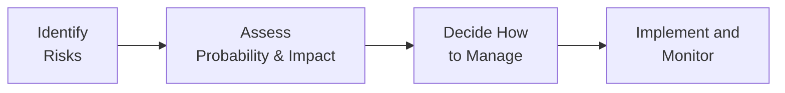
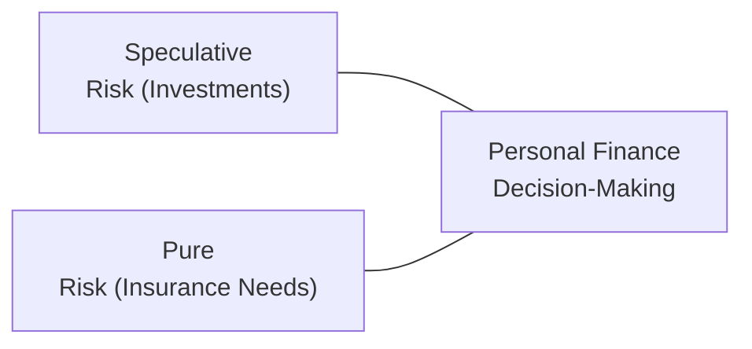

## 8.1 The Nature of Risk

Imagine you’re chatting with a friend over coffee—someone who’s never really given much thought to financial planning. You might start by saying, “You know, it’s sort of wild how life can throw stuff at you from out of nowhere, right?” And that, in a nutshell, is what risk is all about. It’s the potential for unexpected events—such as illness, disability, or even the premature passing of a loved one—to alter our financial landscape in ways we didn’t quite plan.

Risk can be a little confusing because, well, it comes in so many shapes and sizes. But if we peel back the layers, most financial planners will talk about two main categories: pure risk and speculative risk. Let’s journey through these ideas and see how they matter in day-to-day financial planning.

---

### Understanding Risk in Financial Planning

At its core, risk is the possibility that things won’t turn out exactly as you expected. This deviation could mean outcome A is much worse than you thought (like losing your salary for several months due to an accident—that’s nerve-wracking!). Sometimes the difference between reality and expectation could be positive, although we typically don’t worry as much when things turn out better than planned. In personal finance and life insurance, we’re usually concerned with the stuff that might go wrong and lead to real financial harm.

Every financial planner worth their salt tries to help folks predict or manage these potential outcomes. Why? Because ignoring risk can mean you’re suddenly left without the income you need to pay the bills, or in a position where your dependents are left without support. And trust me, I’ve seen people overlook this. One of my neighbors, for instance, went through a serious layoff without disability coverage, and it took them three years just to get back on their feet. That’s a long road, and a stress no one really wants.

---

### Defining Pure Risk

Pure risk is basically the kind of risk where the best you can hope for is that everything stays the same. There is no scenario in which you actually end up with a financial gain. If a client faces a risk of property damage due to a big storm, for example, there’s no “positive upside” in that scenario. They either lose a portion of their home’s value, or they don’t. So that’s pure risk—think property loss, critical illness, or the tragic event of losing a family breadwinner prematurely.

In personal financial planning, pure risk is often the main game. The reason it’s so crucial is that the consequences can be devastating. If you’re incapacitated, you’re not earning money. If a family’s primary earner passes away, you can imagine how that event can drastically shift the entire financial future of the surviving family members. These areas are typically addressed through various insurance products and strategies that will hopefully protect you if something goes terribly wrong.

---

### Comparing Speculative Risk

Speculative risk stands in contrast to pure risk because here, the outcome might be really good, or it might be really bad, or somewhere in between. A common example is making an investment in the stock market. You could generate a healthy return that beats the market, or you might end up with a significant loss if your chosen stock plummets. So you can “win” or “lose” (or break even). In personal financial planning, we typically talk about investment strategies separately from the insurance or risk mitigation side—even though they’re connected through the broader lens of your overall financial health.

---

### The Financial Impact of Risk Events

So what exactly is the impact of these unfortunate events? Let’s get more concrete. When we talk about pure risk like critical illness or premature death, the impact is generally measured in cold, hard dollars (or the intangible stress that eventually translates to a financial burden for families). For example:

• If you were to suffer a disability that prevented you from working for a year, you’d lose wages, and you might accumulate large medical bills not fully covered by your health plan.  
• If you’re the primary income earner and you pass away unexpectedly, your family or estate may be left wrestling with mortgage or rent payments, credit card balances, tuition payments, and more.

Events tied to pure risk often have deep emotional repercussions too. But from a financial planning standpoint, we measure the cost to the client’s livelihood and to the well-being of their dependents.

---

### A Quick Look at Some Basic Probability

It’s one thing to say a negative event might happen—it’s another thing entirely to say how likely it is to happen. That’s where probability comes in. Probability is usually expressed on a scale from 0 (no possibility) to 1 (certainty). While we rarely talk about 0 or 1 in real life, the formula for an event E is typically:


P(E) = \frac{\text{Number of outcomes where E happens}}{\text{Total number of possible outcomes}}


In the context of actuarial data—where insurance companies track large pools of insured individuals—these probabilities can become quite precise. After all, the more data you’ve got, the better the predictions. Insurance companies rely heavily on this, because it determines how they’ll price policies to balance their own risk exposure with offering fair coverage to their clients.

---

### Assessing Risk: Qualitative and Quantitative Approaches

You might be wondering, “So do financial planners just run the numbers on a spreadsheet and call it a day?” Well, not exactly. Advisors evaluate two dimensions:

**Qualitative Analysis**  
• This part is about the client’s personal or subjective approach to risk. How comfortable is the client with uncertainty? Are they okay with paying for a higher level of insurance coverage, or would they rather keep premiums low and handle more risk themselves?  
• Life experiences shape how people feel about risk. If someone grew up in a family that lost a home to a fire, they might keep their insurance coverage really robust.

**Quantitative Analysis**  
• This involves the nitty-gritty numbers: computing probabilities, reviewing actuarial data, and analyzing how a risk event stacks up financially if it does occur.  
• Every scenario is assigned a certain likelihood and a certain potential loss (or even gain, where speculative risk is relevant), so the big question is how large a claim or cost might be relative to your financial position.

Successful risk management is about blending these two. A purely numbers-based approach might ignore how anxious or comfortable a client feels. And a purely feelings-based approach can overlook hard data, leaving individuals unprepared for high-cost events.

---

### Identifying Client Risk Exposures

The first step a financial advisor will take is a thorough data-gathering session that covers a client’s personal and financial situation—everything from family structure to outstanding liabilities, from business ownership to donation obligations. For instance:  
• Does the client have young children who depend on them for financial support?  
• Are there existing insurance policies in place?  
• Any major medical concerns in the family?  
• What about mortgage or consumer debt levels?  

Collecting this information is critical. It’s kind of like making a jigsaw puzzle: You need to see every piece before you can make sense of the whole picture. If you don’t have a piece—say, you forgot to ask about a big student loan—your final approach to risk might be incomplete or downright misleading.

---

### Showing Empathy and Clarity

Talking about difficult potential outcomes (premature death, serious illness, etc.) can be uncomfortable, right? But from a client’s perspective, empathy from an advisor is critical. You’re dealing with stressful things. A caring, empathetic approach ensures the client trusts you enough to open up about personal or uncomfortable details (like hidden debts or health conditions). And clarity ensures they know exactly what the coverage does—and doesn’t—include.

So how do you approach it? Some advisors might say: “I know this can be really tough to talk about. But let’s just imagine how you’d feel if this scenario came up. We want to ensure you have a cushion, so you don’t have to worry about losing your home or scrambling for income.” In my opinion, that’s the sweet spot—patiently laying out risks without fearmongering.

---

### Deciding Which Risks to Retain, Transfer, or Reduce

There’s an old saying: “You can’t insure away every risk.” And that’s because insurance premiums can get expensive if you try to cover every conceivable downside. There’s a balance. Clients have to decide which risks to retain (self-insure), which to transfer (buy an insurance policy), and which to reduce (perhaps by changing a habit or installing a protective device).

**Risk Retention**  
• Retention means taking on the risk yourself. For small potential losses—like the deductible on your car insurance—this can be sensible. In other words, you pay out of pocket for the first chunk of any damage.

**Risk Transfer**  
• Transferring a risk means buying insurance, plain and simple. Life insurance policies, disability coverage, property and casualty insurance—all are ways of pushing a big chunk of risk onto an insurer’s balance sheet.

**Risk Reduction**  
• If you invest in a security system for your home, you’re reducing the likelihood (and extent) of a burglary. If you adopt a healthy lifestyle, you’re lowering certain health risk factors. Steps like these reduce the probability or severity of a loss, though they seldom eliminate it entirely.

**Documenting All the Discussions**  
An important part of the advisory process: thoroughly documenting everything. Advisors usually keep records of the risk topics discussed, the client’s decisions, plus the rationale behind each approach to coverage. This is partly about regulatory compliance—especially under guidelines from the Canadian Investment Regulatory Organization (CIRO)—and partly about having a reference point if questions arise down the road.

---

### Visualizing the Risk Management Process

It can be helpful to see a quick overview of how risk identification, assessment, and treatment flows:

• Identify Risks: Gather client data, personal circumstances, and financial obligations.  
• Assess Probability & Impact: Use qualitative insights and actuarial data to determine likelihoods and potential financial consequences.  
• Decide How to Manage: Retain, transfer, or reduce each risk category.  
• Implement and Monitor: Put chosen strategies into action—like buying insurance—and review periodically.

---

### Regulatory Considerations and Additional Resources

Financial advisors in Canada operate under regulations that aim to protect investors and policyholders. If you look at the historical path, you’ll see that the Mutual Fund Dealers Association (MFDA) and the Investment Industry Regulatory Organization of Canada (IIROC) were both replaced by the Canadian Investment Regulatory Organization (CIRO) on January 1, 2023. Today, CIRO is the go-to body for investor protection oversight on dealers and marketplaces.

Insurance carriers in Canada are regulated federally by the Office of the Superintendent of Financial Institutions (OSFI) in terms of risk-based capital requirements. Meanwhile, the Insurance Bureau of Canada (IBC) adds guidelines and resources for property and liability risks, and the Canadian Life and Health Insurance Association (CLHIA) covers best practices around marketing life insurance products. For deeper reading, you might check out:

• CIRO website at [https://www.ciro.ca](https://www.ciro.ca) for guidelines on assessing client risk.  
• OSFI publications on capital adequacy frameworks for insurers (osfi-bsif.gc.ca).  
• IBC resources on property, auto, and liability coverage (ibc.ca).  
• CLHIA guidelines clarifying how to talk to clients about coverage (clhia.ca).  
• “Against the Gods: The Remarkable Story of Risk” by Peter L. Bernstein, which gives a historical perspective on the evolution of risk management concepts.  
• CPA Canada’s website for budgeting tools and risk assessments (cpacanada.ca).  
• COSO Enterprise Risk Management Framework for an open-source approach to organizational risk management.  
• The Financial Consumer Agency of Canada (FCAC) for free budgeting calculators and guidance (canada.ca/en/financial-consumer-agency).

---

### Practical Example: A Family’s Dilemma

Let’s get real for a second with a short scenario: Suppose David and Susan are a couple in their late 30s with two young kids. Susan works full-time, while David works part-time and stays home with the children half the week. Their mortgage is substantial. They worry that if Susan can’t work due to an accident or illness, the family might lose their home. So how can they manage this pure risk?

1. They gather all their financial data with the help of an advisor—income, expenses, assets, liabilities.  
2. They assess the probability that Susan could become unable to work at some point in the next 20 years. (Actuarial tables can provide a rough number here.)  
3. They decide whether to buy disability insurance or rely on their existing emergency fund, or maybe both.  
4. To reduce the likelihood of injury, Susan invests in an ergonomic office setup, and commits to a daily fitness routine to stay healthy—which lowers the probability dimension of the risk.  
5. Their advisor documents the entire conversation, ensuring clarity for all decisions.

By being proactive, David and Susan gain a sense of security. They’re balancing premium costs with the potential financial ruin they’d face if Susan couldn’t work for an extended period. That’s risk management in action.

---

### Pitfalls and Best Practices

**Common Pitfalls**  
• Underestimating Indirect Costs: People often forget intangible or indirect costs, like additional childcare or rehab expenses.  
• Failure to Update Coverage: As families grow or personal circumstances change, an old policy might be inadequate.  
• Relying Too Much on Employer Coverage: Employer plans can be more limited than you think, and job changes can disrupt coverage.

**Best Practices**  
• Annual Review: Revisit your risk exposures as part of an annual financial review.  
• Adequate Contingency Fund: Even if insured, having a liquid emergency fund is crucial.  
• Transparent Communication: Talk openly about what you can afford in premiums and what coverage you absolutely need.

---

### Quick Conceptual Diagram for Layers of Risk

Another way to visualize risk is to see how pure risk and speculative risk might overlap in a broader personal finance context:

Speculative risks, like deciding to invest in high-growth tech stocks, intersect with your personal finance decisions (budgeting, saving), but pure risks, like accidents or illnesses, are also constantly influencing those decisions. The bigger the bubble of risk, the more critical it is to manage it carefully, whether by insurance, diversification, or other strategies.

---

### Final Thoughts

Risk is an integral part of life and financial planning. There’s no way to eliminate it entirely—life’s uncertain, and that’s just how it is. However, you can be deliberate about which risks you retain, which ones you transfer, and which ones you reduce. By taking the time to get honest about your current situation, consult credible data, and match it to the emotional side of decision-making, you’ll be ready to ride out potential storms with a little more confidence.

When you meet with a financial advisor, expect them to gather all relevant information, assess your willingness to accept risk, and offer coverage or management strategies that fit. It’s not about selling a one-size-fits-all policy but guiding you towards an informed choice—one that aligns with both your lifestyle goals and your budget.

---

## Test Your Knowledge: The Nature of Risk in Financial Planning



### Which of the following best describes pure risk?
- [ ] The possibility of gain and loss
- [x] The possibility of loss without any chance for financial gain
- [ ] An event with guaranteed financial benefits
- [ ] A transaction involving stocks and real estate

> **Explanation:** Pure risk, such as death or disability, offers no potential for financial gain—only the possibility that a loss or negative outcome will occur.

### What is speculative risk?
- [x] A risk that can result in a gain or a loss
- [ ] A risk that can only cause a loss
- [ ] A risk that is always avoidable
- [ ] A risk that must be retained

> **Explanation:** Speculative risk involves the possibility of profit or loss, with investing in stocks being a common example.

### Why is it important to blend both qualitative and quantitative approaches in assessing risk?
- [x] Because numbers alone can’t capture a client’s attitude and comfort level toward risk
- [ ] Because probability analysis is never accurate
- [ ] Because all clients prefer emotional discussions over data
- [ ] Because actuarial data is legally restricted in Canada

> **Explanation:** Qualitative factors (like emotional comfort with risk) complement quantitative data (like actuarial statistics) to give a well-rounded view of a client’s risk exposure.

### Which organization replaced the Mutual Fund Dealers Association (MFDA) and the Investment Industry Regulatory Organization of Canada (IIROC)?
- [x] The Canadian Investment Regulatory Organization (CIRO)
- [ ] The Insurance Bureau of Canada (IBC)
- [ ] The Canadian Life and Health Insurance Association (CLHIA)
- [ ] The Office of the Superintendent of Financial Institutions (OSFI)

> **Explanation:** On January 1, 2023, the MFDA and IIROC amalgamated into CIRO, now Canada’s self-regulatory body overseeing investment dealers, mutual fund dealers, and market integrity.

### In risk management, installing a home security system represents:
- [x] Risk reduction
- [ ] Risk transfer
- [x] Preventative maintenance
- [ ] Risk retention

> **Explanation:** A security system can reduce the probability of theft or intrusion. This is a strategy to lower the chance or severity of a loss.

### What is a key pitfall if insurance coverage is not updated regularly?
- [x] The coverage may become inadequate as circumstances change
- [ ] Premiums are guaranteed to decrease without your knowledge
- [ ] Clients have more money for other investments
- [ ] It eliminates all liability in case of an unforeseen event

> **Explanation:** Failing to update your coverage as life events occur—marriage, children, mortgage changes—can leave significant gaps that won’t adequately protect against losses.

### Which best describes risk retention?
- [x] A decision to self-insure and handle certain financial losses on one’s own
- [ ] Purchasing a full life insurance policy
- [x] Carrying a deductible on an auto insurance policy
- [ ] Taking out additional liability coverage

> **Explanation:** Retaining risk means you accept the potential cost yourself, often used for smaller, manageable risks (like a higher deductible).

### How does empathy support clients in risk management discussions?
- [x] It creates an environment of trust and openness
- [ ] It undermines objective decision-making
- [ ] It forces clients to buy more coverage
- [ ] It invalidates quantitative data

> **Explanation:** When advisors use empathy, clients are more likely to be honest about fears and financial realities, enabling more accurate risk assessments.

### What aspect of risk management involves transferring a significant portion of financial loss to an insurer?
- [x] Risk transfer
- [ ] Risk retention
- [ ] Risk elimination
- [ ] Risk avoidance

> **Explanation:** Transferring risk typically means buying insurance to shift part of the financial burden from yourself to the insurer.

### Risk in financial planning primarily involves:
- [x] True
- [ ] False

> **Explanation:** True: Risk in financial planning usually refers to the possibility that an event will cause negative financial outcomes, like reduced earning capacity or asset damage.


