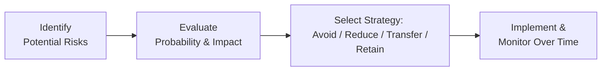

## 8.2 Managing Risk

Have you ever felt that little twinge of anxiety when you step onto an airplane, or maybe when you watch the stock markets bounce up and down? You're definitely not alone. When we talk about finances, many of us feel that same uncertainty. And yep, it can get overwhelming. Think of risk as the unknown events in life that might throw a wrench into your plans. But here’s the good news: there’s a framework to manage it. In this part of the course, we’ll explore exactly that—practical ways to handle risk and some real-life examples to bring these concepts home.

The truth is, nobody can totally escape risk (unless they lock themselves in a bubble and never come out, but that’s not exactly practical, right?). Instead, the goal is to figure out which risks you can tolerate, which to minimize, and which to transfer away—often through a good insurance strategy. Let’s explore the different ways we can handle risk, including avoiding it, reducing it, transferring it, and (sometimes) simply retaining it.

---

### Understanding Risk Management

Risk management is, effectively, the process of identifying and preparing for potential financial, personal, or property-related losses. The quest for a stress-free life might direct you to steer clear of all possibility of harm. But that might mean never driving a car (avoiding accidents), never leaving home (avoiding theft or bad weather), or never investing your money (avoiding market fluctuations). You get the point—it’s neither possible nor wise to avoid everything that carries risk! So we need a balanced approach.

**The Four Main Risk Management Strategies**  
1. **Avoid Risk**  
2. **Reduce Risk**  
3. **Transfer Risk**  
4. **Retain Risk**

Let’s get to know each strategy inside out.

---

### 1. Risk Avoidance

Risk avoidance is exactly what it sounds like. You arrange your life in such a way that you simply do not expose yourself to the risk in question. For instance:  
• Deciding not to drive a car at all, to avoid potential accidents.  
• Never investing in volatile markets to avoid the possibility of loss.  

Obviously, this can go to extremes. If you avoid car travel altogether, sure, you reduce your chance of a car accident to zero, but you also give up the convenience of driving, possibly hamper your career prospects if you need to commute, and generally limit your freedom. Avoiding risk might keep you physically safe, but it can cost you in quality of life, personal development, or even financial gains.

So, I once had a friend who told me, “I’m never going to get into the stock market— it’s too scary.” Well, he avoided the risk of losing money in a downturn, but guess what? He also missed many years of potential growth that could have significantly built his wealth. Risks can offer rewards, and complete avoidance can come with big opportunity costs. So understanding the pros, cons, and your real comfort level is absolutely critical before you choose to avoid.

---

### 2. Risk Reduction

Another approach is to reduce either the probability (likelihood) of a loss happening, or the severity of the damage if it does occur. Unlike total avoidance, this strategy acknowledges that certain risks are inevitable. The goal is to minimize their impact.

**Examples of Risk Reduction**  
• If you’re worried about health risks, you might start exercising regularly, eating well, and scheduling annual check-ups. It’s not a guarantee you’ll never be sick, but your overall health risk goes down.  
• If you hold property—like a house—you might install a security alarm, maintain the roof regularly, and fix small issues before they turn into big (and expensive) disasters.  
• In investing, risk reduction often takes the shape of diversification. By spreading your money across different asset classes (stocks, bonds, real estate, etc.), you reduce the chance that one poor-performing investment wipes out your entire portfolio.  

There’s a well-known principle: “Don’t put all your eggs in one basket.” That’s basically risk reduction in a nutshell. It’s crucial in personal finance. If you decide to invest in the stock market, you can reduce risk by investing in an index fund covering multiple sectors rather than only picking one single stock or a single industry.

---

### 3. Risk Transfer

This is where insurance generally takes center stage in people’s personal financial plans. Risk transfer means you offload the financial consequences of a potential adverse event to another party, typically an insurance company, in exchange for premium payments.

**How Risk Transfer Works**  
1. You, as the policyholder, pay a premium. Think of this premium as a regular, predictable expense.  
2. In exchange, the insurance provider (the “insurer”) agrees to cover specified losses or damages that might occur in the future.  
3. If the adverse event occurs, you (typically) pay a deductible out of pocket, and the insurer pays the rest.  

Why do we do this? For one, it’s often more feasible to pay, say, $500 a year for an insurance policy than foot the entire $50,000 or $100,000 (or more!) bill if something goes severely wrong. The insurer has the resources to pool premiums from a large number of policyholders and then cover losses according to the agreed terms. 

From my personal experience, I got into a fender-bender a few years back. My insurance premiums felt like a monthly chore—until the accident happened. Then I realized, “Oh wow, so this is what I’m paying for.” Yes, it can feel painful to consistently pay premiums and then see nothing tangible in return if all is well. But the moment something big goes wrong, the cost of well-chosen insurance can pale in comparison to the potential financial hit you’d take without it.

---

### 4. Risk Retention

Sometimes, it makes more sense to just keep the risk yourself, especially if the cost of insuring (transferring) it is disproportionate to the risk itself. For small or low-likelihood losses, we might choose to self-insure or just not insure at all. 

For example, you might decide it’s not worth getting an extended warranty (which is a type of insurance) for every small appliance you purchase, because if that blender or TV breaks, you can handle the replacement cost out of pocket without disrupting your overall financial health. If the financial consequence is something you can budget for—or something that wouldn’t destroy you financially—it can be more economical to retain the risk and not pay for coverage you rarely use.

---

### Balancing the Strategies

In reality, your risk management plan might use a mix of these four strategies. Perhaps you reduce risk by eating healthy, driving carefully, or diversifying your holdings in your investment portfolio. At the same time, you transfer certain large potential risks by buying life, property, or medical insurance. Meanwhile, you might retain the smaller risk for minor items like that old garden shed or small electronics.

The key is to be intentional about how you categorize and handle each type of exposure in your life.  

Here’s a simplified diagram to illustrate the interplay of the four strategies:

• **Identify Potential Risks**: The first step is always to make a list of what could go wrong. This includes everything from catastrophic events (like the loss of a family’s primary income provider) to small stuff (like theft of a bicycle).  
• **Evaluate Probability & Impact**: Next, figure out how likely each risk is and how big the financial impact could be.  
• **Select Strategy**: Based on probability and impact, you decide which method—avoid, reduce, transfer, or retain—makes the most sense.  
• **Implement & Monitor**: Put your chosen strategies into action, and keep tweaking them as circumstances change.

---

### Re-Evaluating Your Risk Management Strategy Over Time

People’s lives aren’t static. Circumstances change, whether we’re talking about personal health, family, career, or even the broader economic environment. Because of this, it’s important to re-evaluate your risk management approach at least every few years—or whenever a major life event occurs. 

For instance:  
• **Starting a family**: When you get married or have children, the stakes go up. Out-of-pocket costs can skyrocket if something happens to you or your spouse/partner. Life insurance, disability insurance, and critical illness coverage might jump in priority.  
• **Buying a home**: You might need bigger property and liability insurance coverage than you had renting an apartment.  
• **Career shifts**: Starting a high-risk job (like a pilot or construction worker) could raise your insurance premiums, whereas working strictly at a desk might reduce them.  
• **Retirement**: Health insurance, travel insurance, and estate planning can move to the forefront after you exit the workforce.

The bottom line is: keep your plan dynamic. Don’t just purchase life insurance once and forget about it for decades. Revisit your coverage levels, read the fine print, adjust your beneficiaries, and keep track of changes that might affect your premium or coverage.

---

### Factors Influencing Insurance Premium Costs

Insurance companies use a process called **underwriting** to figure out how much of a risk an individual or asset poses. Let’s say you’re applying for life insurance:

• **Age**: The older you are, the higher your probability of mortality, typically resulting in higher life insurance premiums.  
• **Health Status**: Conditions such as diabetes or a history of heart problems might raise premiums because of higher claim likelihood.  
• **Occupation**: A high-risk job, like certain types of construction or offshore oil rig work, can lead to steeper premiums.  
• **Lifestyle Habits**: Smoking status, excessive drinking, or “extreme sports” hobbies can factor in.  
• **Amount of Coverage**: The more coverage you want, the bigger your premiums will be (all else being equal).  

And for property insurance:  
• **Location**: Is your home in a flood zone or an area with frequent wildfires? That’s likely to lead to higher premiums or coverage limitations.  
• **Value & Condition of the Property**: A more expensive property or older building might be costlier to insure.  
• **Security Measures**: Homes with robust security systems, sprinklers, or certain renovations can see reduced premiums.  

Understanding how insurers price coverage can help you find cost-effective policies. For instance, if you’re renovating a house, you might consider upgrades that also lower your insurance costs. Or if you’re applying for life insurance, it might be wise to address any lifestyle risks—like smoking or a particularly dangerous hobby—before seeking coverage.

---

### Tax Implications and Opportunities

Insurance sometimes interacts with the tax system in interesting ways. Let’s walk through a couple of broad considerations (noting this can get complex quickly and might require specialized professional advice):

1. **Estate Planning**: Some life insurance policies (e.g., permanent life) can be structured so that the death benefit flows to named beneficiaries tax-free. This can be used for estate-planning or business-succession purposes.  
2. **Insurance Premiums**: Generally, life insurance premiums in Canada are not tax-deductible. But in certain business contexts—like corporate-owned life insurance for key employees—some structures might offer specific tax advantages.  
3. **Insurance as an Investment Vehicle**: Some permanent life policies (e.g., Universal Life) come with an investment component. Earnings on these investments may grow tax-deferred under certain conditions, which could be advantageous, but you must be mindful of complexities such as policy limits, surrender charges, and regulatory constraints.  

If you’re looking at complex scenarios like using insurance for estate planning or combining it with investment vehicles, remember to do your homework or consult a qualified professional. The **Financial Consumer Agency of Canada (FCAC)** has some handy online calculators to compare policies. Engaging an advisor well-versed in Canadian regulations can help you avoid pitfalls while maximizing these opportunities.

---

### Regulatory Landscape and Best Practices

Since January 1, 2023, Canada’s investment dealers and mutual fund dealers have been overseen by the newly formed **Canadian Investment Regulatory Organization (CIRO)**. CIRO provides guidance and enforces rules for financial planners and advisors. Although IIROC and MFDA were historically the separate regulators, they’ve been folded into CIRO. This shift doesn't specifically regulate the insurance sector (which falls under each province’s specific insurance regulator, such as the **Financial Services Regulatory Authority of Ontario (FSRA)** or the **Autorité des marchés financiers (AMF)** in Quebec), but it does create consistent expectations around best practices in client disclosure, product suitability, and overall ethics.

Insurance professionals must also comply with their respective provincial or territorial regulators. Organizations such as the **Insurance Bureau of Canada (IBC)** (ibc.ca) publish consumer-friendly guides on topics like home, auto, and business coverage.

Following best practices means ensuring that:  
• You do your due diligence when recommending insurance products (understand your client’s situation thoroughly).  
• Clients understand the terms, coverage limits, and exclusions of policies.  
• You keep abreast of changes in your client’s life circumstances.  
• You adhere to any applicable rules from CIRO, your provincial regulator (like FSRA or AMF), and relevant industry guidelines.  

---

### Best Practices, Common Pitfalls, and Potential Challenges

**Best Practices**  
1. **Review Your Portfolio Annually**: If something major changes—like you buy a new property, or health conditions shift—update your coverage accordingly.  
2. **Shop Around**: Different insurers might offer wildly different premiums for essentially the same coverage.  
3. **Plan Ahead**: Start thinking about insurance early (especially life and health). You generally lock in lower premiums if you’re younger and in good health.  

**Common Pitfalls**  
1. **Underinsuring**: People sometimes guess or pick a random coverage amount without doing a thorough needs analysis. That can lead to shortfalls when it really counts.  
2. **Overlooking Policy Limitations**: You might buy travel insurance that excludes pre-existing medical conditions, or a home insurance policy that excludes basement flooding. Watch out for these sneaky exclusions.  
3. **Ignoring the Fine Print**: Deductibles, waiting periods, coverage caps—these details matter. Don’t wait until a crisis strike to learn about them.  

**Potential Challenges**  
1. **Balancing Budget Constraints**: Paying a higher premium might protect you from big losses, but it also chips away at your monthly cash flow. Striking a balance can be tricky.  
2. **Medical Underwriting Surprises**: Even if you’re healthy, you might have some obscure condition (or test result) that elevates your premium, or you might be declined coverage altogether.  
3. **Complexity of Some Insurance Products**: Universal life or variable life insurance can have investment components. They’re not always straightforward, and it’s easy to misinterpret fees, performance assumptions, or coverage constraints.

---

### Additional References and Further Exploration

• **CIRO** (<https://www.ciro.ca>): Canada’s consolidated self-regulatory organization for investment dealers, offering best practices and investor resources.  
• **Provincial Insurance Regulators**: Such as the **Financial Services Regulatory Authority of Ontario (FSRA)** or the **Autorité des marchés financiers (AMF)** in Quebec, which oversee insurance licensing, consumer protection, and compliance in their respective jurisdictions.  
• **Insurance Bureau of Canada (IBC)** (<https://www.ibc.ca>): Provides consumer guides on everything from home insurance to auto insurance. Very helpful if you want to dig deeper.  
• **Financial Consumer Agency of Canada (FCAC)** (<https://www.canada.ca/en/financial-consumer-agency.html>): Has calculators and resources for comparing different insurance products and coverage levels.  
• **Canadian Insurance Claims and Risk Management** by Greg Pynt: A practical deep dive into the nitty-gritty of how claims get handled and how to manage risk from a Canadian perspective.  
• **Estate Planning**: Look into Canadian estate planning guides or consult a specialized lawyer to see how life insurance can effectively transfer wealth to your heirs.  

---

### Glossary

• **Risk Avoidance**: Eliminating exposure to a particular risk (e.g., not owning a car to avoid accidents).  
• **Risk Reduction**: Tactics to lessen the probability or severity of a loss (e.g., regular health check-ups, property maintenance, diversification).  
• **Risk Transfer**: Paying an insurance premium to shift the financial burden to an insurer in case of covered losses.  
• **Risk Retention**: Opting to keep (or self-insure) against certain risks when the potential loss is deemed manageable (e.g., deciding to forgo comprehensive coverage on an old, low-value vehicle).  
• **Premium**: The amount you pay at regular intervals to keep your insurance coverage active.  
• **Deductible**: An amount you must pay out of pocket on a claim before your insurance pays the remainder.  
• **Underwriting**: The process by which insurers assess and price the risk you present.  
• **Life Stage Planning**: Adapting your finances and insurance provisions throughout changing life phases (e.g., marriage, parenthood, retirement).

---

In summary, managing risk in personal finance isn’t just about buying insurance—though insurance often serves as the backbone of any solid plan. It’s about understanding your exposures, calculating which ones you can live with, and figuring out ways to mitigate or transfer them. And yes, it changes through every stage of your life and career. Keep tabs on how your needs evolve. By balancing risk avoidance, risk reduction, risk transfer, and risk retention, you can shape a plan that meets your needs without depriving you of life’s opportunities.

---

## Test Your Understanding of Managing Risk



### Which of the following is an example of risk avoidance?
- [ ] Buying insurance for high-value items.
- [x] Choosing not to drive in any circumstances.
- [ ] Installing a home security system.
- [ ] Setting money aside in an emergency fund.

> **Explanation:** Risk avoidance involves completely removing the potential for exposure, like deciding never to drive to avoid any possibility of a car accident.

### Which of the following best illustrates risk reduction?
- [ ] Taking the bus instead of driving to avoid accidents entirely.
- [ ] Opting for the highest policy deductible.
- [x] Diversifying investments to lessen the impact of a single asset’s poor performance.
- [ ] Not purchasing any insurance whatsoever.

> **Explanation:** Risk reduction doesn’t eliminate exposure but rather reduces the probability or effect of a loss—like diversification in investing.

### What is a central reason people transfer risk via insurance?
- [x] To avoid bearing the entire financial burden when a covered loss occurs.
- [ ] To exploit insurance companies for monetary gain.
- [ ] To circumvent all personal responsibility for an event.
- [ ] To eliminate the need for budgeting or savings.

> **Explanation:** By paying a premium, you transfer the majority of a potential large financial burden from yourself to the insurer.

### When might retaining risk be the most appropriate strategy?
- [ ] When the risk involves catastrophic loss of one’s home.
- [x] When the potential loss is small and easily handled by personal funds.
- [ ] Whenever the premiums are higher than you’d like.
- [ ] If you anticipate the insurer might never pay out anyway.

> **Explanation:** If the cost to insure outweighs the value of the item or the potential loss is financially manageable, retaining the risk can be more economical.

### Which of the following changes in life situation is most likely to prompt a re-evaluation of risk management strategies?
- [x] Having your first child.
- [ ] Buying a new brand of toothpaste.
- [ ] Switching cell phone carriers.
- [ ] Subscribing to a newsletter.

> **Explanation:** Significant events like childbirth can dramatically increase financial obligations and highlight new risks, making an update to coverage crucial.

### Which of the following is NOT a common factor influencing life insurance premiums?
- [x] The policyholder’s employer’s repair history on its building.
- [ ] The policyholder’s age.
- [ ] The policyholder’s health.
- [ ] The policyholder’s occupation.

> **Explanation:** An employer’s building-related history for repairs is not typically relevant for personal life insurance underwriting.

### Which statement about Canada’s regulatory environment is correct?
- [x] CIRO is the current national self-regulatory organization overseeing investment dealers and mutual fund dealers.
- [ ] IIROC was replaced by the Federal Reserve in 2023.
- [ ] MFDA is the main regulator for auto insurance in Ontario.
- [ ] Provincial regulators have no role in overseeing insurance.

> **Explanation:** Since January 2023, IIROC and MFDA merged into CIRO. Provincial regulators still supervise insurance.

### How might insurance premiums interact positively with tax or estate planning in Canada?
- [x] Life insurance proceeds can pass to beneficiaries tax-free, aiding estate planning.
- [ ] Premiums for personal life insurance are generally tax-deductible like RRSP contributions.
- [ ] Policyholders can claim a tax credit on term life premiums.
- [ ] Premiums are fully refundable if no claims occur.

> **Explanation:** One key advantage is that proceeds from life insurance can typically pass to beneficiaries without incurring income tax.

### What best describes the concept of underwriting?
- [ ] A guarantee that the insurer will always pay 100% of any claim.
- [ ] The process of paying out claims automatically without checking.
- [x] The insurer’s assessment of an applicant’s risk profile to determine policy terms.
- [ ] A government regulation that sets universal prices for insurance.

> **Explanation:** Underwriting is where an insurance company evaluates the level of risk presented by an individual or asset, setting the premium and coverage terms accordingly.

### True or False: Risk management strategies do not need to evolve over time, as most personal risk profiles stay the same.
- [x] False
- [ ] True

> **Explanation:** Personal circumstances and broader economic or regulatory environments change over time, so risk management strategies should be revisited and updated periodically.


