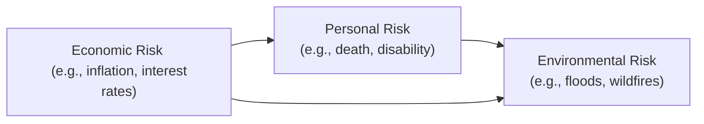

## 8.3 Types of Risk

Sometimes, when we talk about “risk,” it can feel like we’re opening a complicated vault of scary possibilities—like losing a job, falling ill, or having a freak accident wipe out everything. I remember when a friend of mine started her own bakery: she was bright-eyed and full of hopes (and croissants!). But she quickly discovered that personal challenges, like her partner’s unexpected disability, intersected with business issues (like equipment breakdown at the bakery) and even investment turmoil (she had invested a large portion of her personal savings in a short-term market opportunity that went sour just when she needed cash). All these risks piled up at once, threatening her finances.

That might sound dramatic, but it illustrates just how risk can be multi-dimensional. In this section, we’ll dive into the various types of risk, including personal/family risks, business ownership risks, and investment risks. We’ll step through how these categories often blend together in the real world and highlight strategies—like maintaining an emergency fund or diversifying investments—to help manage whatever life throws at you. So let’s chat about these different kinds of risk exposures in a more down-to-earth way.

### Personal and Family Risks

Personal or family-related risks can strike at the core of your financial stability—and sometimes at the worst possible moments. They can lead to loss of income, increased expenses, or the forced liquidation of assets. Let’s explore some of the major ones:

• Premature Death Risk  
  If someone passes away earlier than expected, it can leave major financial obligations unmet. Life insurance is often used to manage this risk. It provides a lump sum that can cover mortgage payments, children’s education, or living expenses for surviving dependants.

• Disability Risk  
  This is the risk that an illness or an injury reduces an individual’s ability to earn an income. Maybe you’ve heard stories from relatives who got into a car accident and were out of work for months. Disability insurance, whether offered through an employer or purchased privately, helps replace a portion of that lost income.

• Critical Illness Risk  
  Serious health conditions (such as cancer, heart disease, or stroke) can bring big medical bills and time away from work. In Canada, critical illness insurance can provide a lump-sum payment upon diagnosis of covered illnesses. From personal experience, I’ve seen how even strong families can be financially knocked sideways by months of treatment and recovery.

• Property Loss Risk  
  This refers to the potential damage or total loss of property (such as a home, personal belongings, and vehicles). Fire, theft, and natural disasters (like floods or wildfires) are typical examples. Property and casualty insurance is the main tool to cover repair or replacement costs.

• Liability Risk  
  It’s easy to underestimate liability risk. If someone slips on your icy driveway and sues you, you might be on the hook for medical costs and legal fees. Your homeowner’s insurance typically includes personal liability coverage. However, in higher-risk cases (e.g., large property or rental operations), umbrella liability insurance might be wise.

### Business Ownership Risks

If you’re self-employed or a small business owner, your personal and business worlds often collide in interesting (sometimes stressful) ways. Let’s look at some special risk categories:

• Business Interruption Risk  
  If your business must pause operations due to a fire, flood, or other catastrophe, you might lose revenue while still paying rent, utilities, or vendor contracts. Business interruption insurance covers lost income and helps keep you afloat until you can reopen.

• Liability Suits  
  Businesses might face lawsuits from customers, employees, or third parties—a slip-and-fall in your retail store, a dispute over a contract, or product liability concerns. Commercial liability insurance offers protection against such claims.

• Key Person Risk  
  Suppose your business partner or top salesperson is responsible for bringing in most of the big accounts. What if that individual suddenly passes away or becomes disabled? That’s key person risk—and it can jeopardize the entire operation. Key person insurance (often a life or disability policy owned by the business) provides a financial cushion to help find or train a replacement.

### When Investment Risk Intersects with Personal Risk

Investment risk doesn’t just float around in an isolated bubble. It can impact your ability to address personal risks. 

• Liquidity Risk  
  Maybe you’ve invested heavily in real estate (with no immediate intention to sell). If an unexpected crisis arises—like a family illness or urgent home repair—you might need fast access to cash. But if you can’t quickly sell your property at a fair price, you face liquidity risk. In turn, this might cause you to miss insurance premium payments or force you to take on high-interest debt to cover costs.

• Market Risk  
  If your investments suffer a downward swing (like a stock market crash), you might lose a portion of the funds you rely on for living expenses or risk management. While market slumps are somewhat expected over the long run, they can be devastating if they overlap with personal emergencies.

• Credit Risk  
  This is the risk that a borrower or counterparty fails to meet its obligations. If you heavily invest in corporate bonds or loan money to a private venture that defaults, you might find yourself short on funds precisely when you need them the most.

### Holistic Risk Classification: Economic, Personal, and Environmental

For a well-rounded view, many financial planners categorize risk into three broad groups: economic, personal, and environmental. A simple mental picture might look like this:

Above, you can see that these categories often overlap. Inflation (an economic risk) can drastically affect a retiree’s budget (a personal risk) if they’re on a fixed income. Meanwhile, environmental risk (like a wildfire) can spawn immediate personal safety threats and lead to severe property loss.

### How Risks Interconnect in a Comprehensive Financial Plan

Even though we talk about risks in separate groups, in real life they work together—sometimes in painful ways. Picture a scenario where an individual gets diagnosed with a critical illness. That event alone might:

• Reduce their income (disability risk).  
• Increase medical expenses (health care costs and specific treatments).  
• Spark a need to tap into savings or liquidate investments, potentially at a bad time (impacting liquidity risk).  
• Trigger additional mortgage stress if the person’s spouse or partner must take unpaid leave from work to provide care.  

The ripple effect can touch nearly every corner of personal finances. Hence, it’s essential to have a broad, integrated financial plan that anticipates these interconnected risks.

### The Importance of Emergency Funds

Let’s just say it plainly: an emergency fund can be a lifesaver. It’s typically the first line of defense—a stash of cash equivalents or highly liquid assets that’s easy to tap without undermining your long-term financial health. Many advisors recommend holding three to six months of living expenses in such a fund. 

But the exact amount depends on your lifestyle, family situation, and risk tolerance. If you’re self-employed in a volatile industry, you might need a bigger safety net. For example, if you run a seasonal outdoor adventure business (looking at you, canoe outfitters in northern Ontario), a sudden drop in tourism might slash your revenue, so having extra reserves could be extremely valuable.

### Diversification and Investment Risk

You’ll often hear about “diversification” within investment planning. It means spreading your money across different asset classes (e.g., stocks, bonds, real estate) and sectors. It can significantly reduce the volatility of your portfolio—one sector might rise when another falls.

Does diversification solve every risk? Definitely not. A well-diversified portfolio might cushion the blow of market fluctuations, but it won’t prevent a health crisis or uninsured property loss. That said, it does reduce some economic risks (like market or sector-specific collapses) and ensures that you have multiple potential sources of returns—and possibly liquidity—when needed.

### A Quick Note on Risk Exposure Formulas

In more analytical circles, you’ll find formulas that quantify or approximate risk. One simplified version is:


\text{Risk Exposure} = P(\text{Event}) \times \text{Potential Loss}


Where \\(P(\text{Event})\\) is the probability (chance) of an event occurring, and \\(\text{Potential Loss}\\) is how severe the financial impact might be. In real life, measuring probabilities for events like a serious illness or a house fire can be more art than science, which is why insurance companies use actuaries to estimate these numbers. Nonetheless, it’s a reminder that risk involves both chance and consequence.

### Best Practices, Common Pitfalls, and Strategies

• Best Practices  
  - Get adequate insurance coverage for life, health, property, and liability.  
  - Maintain an emergency fund with at least three to six months of living expenses.  
  - Diversify investments to manage market risk and bolster liquidity.  
  - Periodically review your financial plan to ensure it stays aligned with your needs and risk profile—especially after major life events like marriage, birth of a child, or starting a business.

• Common Pitfalls  
  - Underestimating the possibility of disability, critical illness, or lawsuits.  
  - Over-leveraging your personal or business finances without enough cash reserves.  
  - Holding all your wealth in illiquid assets (e.g., real estate), then needing emergency funds.  
  - Postponing insurance applications until you’re older or already have a medical issue—premiums might skyrocket or coverage could be denied.

• Strategies to Overcome These Issues  
  - Schedule annual (or semi-annual) financial reviews.  
  - Use readily available tools like risk assessment questionnaires found on the Canadian Securities Administrators (CSA) website (securities-administrators.ca).  
  - Consult with insurance specialists to discover coverage gaps.  
  - Look into product due diligence guidelines offered by CIRO (the Canadian Investment Regulatory Organization) for better KYC (Know Your Client) insights, ensuring your financial plan addresses the full range of your risks.

### Glossary

• **Premature Death Risk**  
  The risk that an individual dies earlier than statistically expected, leaving unmet financial obligations for their dependants.  

• **Disability Risk**  
  The chance of a long-term or short-term illness or injury that diminishes or eliminates an individual’s capacity to earn.  

• **Critical Illness**  
  A serious health issue, such as cancer or heart disease, that often leads to significant medical expenses and recovery time away from work.  

• **Liquidity Risk**  
  The risk that assets cannot be quickly converted to cash at or near fair market value when needed.  

• **Key Person Risk**  
  The financial toll on a business if a vital employee or owner can no longer contribute due to death or disability.  

• **Business Interruption Risk**  
  Potential losses when a business halts operations temporarily (e.g., following a fire or natural disaster), resulting in lost revenue.  

• **Liability Risk**  
  Exposure to legal claims and potential compensation if a party is found responsible for damages or injuries.  

• **Environmental Risk**  
  Potential financial losses due to natural disasters or ecological damage (e.g., floods, wildfires).

### References and Further Resources

• **CIRO (Canadian Investment Regulatory Organization)**: For the latest guidance on product due diligence and integrated risk management. Visit:  
  [https://www.ciro.ca](https://www.ciro.ca)

• **Canadian Life and Health Insurance Association (CLHIA)**: Offers consumer guides on critical illness, disability, and life insurance.  

• **Canadian Securities Administrators (CSA)**: Check out their investor tools, such as portfolio trackers and risk assessment questionnaires at  
  [https://www.securities-administrators.ca](https://www.securities-administrators.ca)

• **“The Financial Planning Workbook: A Comprehensive Guide to Building Your Financial Plan”** (by Covey T.): Includes sections on categorizing and mitigating life risks.

• **Insurance Institute of Canada**: Provides risk management frameworks and educational materials, which can help you understand and mitigate various types of risk.

• And don’t hesitate to consult a certified financial planner or insurance specialist who understands the Canadian marketplace and can tailor recommendations to your personal scenario. 

---

## Test Your Knowledge: Types of Risk in Financial Planning Quiz



### Which of the following best describes premature death risk?

- [ ] The possibility that an investment won't generate expected returns
- [x] The risk that an individual dies earlier than expected, leaving unmet financial obligations
- [ ] The risk of a fire destroying personal assets
- [ ] The risk of insufficient cash flow due to business interruption

> **Explanation:** Premature death risk relates specifically to someone’s untimely passing, creating potential hardship for dependants or creditors.

### Which of the following is a key aspect of disability risk?

- [ ] It only affects retirees in long-term care
- [x] It reduces or eliminates a person’s ability to earn an income
- [ ] It exclusively covers legal fees related to liability claims
- [ ] It has no impact on long-term savings

> **Explanation:** Disability risk particularly addresses an inability to engage in gainful employment due to illness or injury.

### When thinking about potential business interruptions, which scenario is most relevant?

- [ ] Only a short-lived personal vacation
- [x] A mandatory shutdown due to a fire or natural disaster
- [ ] A surge in product demand
- [x] Extended refurbishment of the business premises after severe flooding

> **Explanation:** Business interruption risk focuses on times when normal operations are halted and revenue is lost, such as a forced closure (like a fire or flood).  

### What is the primary difference between critical illness and disability risk?

- [x] Critical illness typically offers a lump-sum benefit upon diagnosis, while disability insurance often replaces a portion of lost income
- [ ] Critical illness covers short-term ailments only, whereas disability covers all medical treatments
- [ ] Disability only covers permanent injuries, and critical illness covers everything else
- [ ] Both critical illness and disability are mandatory insurances for everyone

> **Explanation:** While both address major health issues, critical illness usually pays a lump sum for specific conditions, whereas disability policies provide ongoing income replacement.

### Which of the following statements about key person risk is correct?

- [x] It involves the financial impact if a crucial employee or owner is unable to work or passes away
- [ ] It concerns the possibility of losing or destroying key business assets, such as equipment
- [x] Key person insurance can provide a financial cushion to help the company adjust
- [ ] It mainly applies to government entities

> **Explanation:** Key person risk affects businesses dependent on a single individual for major revenue or operations. Key person insurance helps mitigate this loss.

### How does liquidity risk intersect with personal or family risk?

- [x] If your assets can’t be liquidated quickly, you might not be able to meet urgent financial needs
- [ ] Liquidity risk doesn’t affect personal finances at all
- [ ] It only affects large corporations
- [ ] It accelerates the time it takes to sell property

> **Explanation:** Liquidity risk can exacerbate personal emergencies by forcing asset sales at discount prices or causing missed payments.

### Which strategy may help reduce volatility but doesn’t address personal risk events like death or disability?

- [ ] Purchasing an umbrella liability policy
- [ ] Maintaining an emergency fund  
- [x] Diversifying your investment portfolio
- [x] Holding term life insurance

> **Explanation:** Portfolio diversification helps mitigate certain market risks but doesn’t protect against life events like premature death or disability. Life insurance or disability insurance is needed for that.

### What is a common pitfall in risk management?

- [x] Delaying insurance purchases until later in life
- [ ] Maintaining an adequate emergency fund
- [ ] Conducting regular financial reviews
- [ ] Consulting CLHIA guidelines on critical illness coverage

> **Explanation:** Procrastination in buying insurance may lead to higher premiums or even denial of coverage if health conditions arise.

### Why is an emergency fund considered a “first line of defense”?

- [x] It provides quick access to cash for unexpected expenses
- [ ] It guarantees permanent income replacement
- [ ] It is provided by all Canadian provincial governments
- [ ] It eliminates the need for any insurance

> **Explanation:** An emergency fund allows immediate access to resources to handle sudden financial shocks without disturbing longer-term investments.

### True or False: The Canadian Investment Regulatory Organization (CIRO) oversees investment dealers, mutual fund dealers, and market integrity on equity and debt marketplaces.

- [x] True
- [ ] False

> **Explanation:** As of January 1, 2023, the MFDA and IIROC amalgamated into CIRO, which now serves as Canada’s national self-regulatory body for investment dealers, mutual fund dealers, and market integrity.


