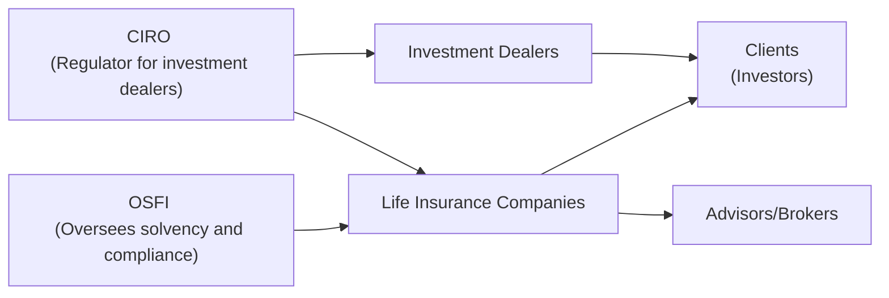
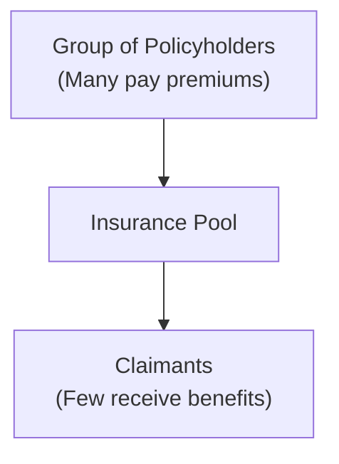

## 8.4 The Life Insurance Industry

Life insurance might feel like one of those topics nobody really wants to think about—like cleaning out the attic or scheduling that overdue checkup—but it’s also something that becomes incredibly important when you truly need it. I remember the first time I tried to read through a life insurance contract: I felt my eyes glaze over with all those definitions, conditions, and numbers. And yet, I quickly realized that understanding how life insurance works can be a game-changer for financial security.

So, let’s roll up our sleeves and explore the heart of the life insurance industry. In this section, we’ll talk about how insurers function in Canada, the regulatory environment that keeps them accountable, and how they pool risk (so you don’t have to bear it alone). We’ll also peek under the hood to see how policies are created, priced, and monitored for solvency—and how entities like the Office of the Superintendent of Financial Institutions (OSFI) and the Canadian Investment Regulatory Organization (CIRO) fit into the bigger picture. Along the way, we’ll clear up some of the jargon and provide examples so it’s not just theory.

### An Overview of the Canadian Life Insurance Landscape

Canadian life insurance companies operate in a unique environment that balances innovation with consumer protection. Historically, insurers have existed as mutual companies (owned by policyholders) or as stock companies (owned by shareholders). Over time, some mutual insurers have converted to stock ownership, a process known as demutualization, which we’ll discuss further below. Nowadays, large insurers may offer more than just life insurance—they often have a suite of financial products, including annuities and segregated funds.

Life insurance companies help individuals manage the financial risk of losing a loved one, falling seriously ill, or suffering an injury. By collecting premiums from many people and paying benefits to the relatively small number of claimants, the insurer creates a “pool” of risk that’s more predictable and stable.

### The Regulatory Environment

In Canada, the federal government keeps a close eye on life insurance companies because, well, if an insurer fails, it can cause major upheaval. That’s where OSFI (Office of the Superintendent of Financial Institutions) steps in as the main federal regulator for banks and insurance companies. OSFI’s role is to maintain public confidence by ensuring that financial institutions have enough capital to meet their obligations.

When it comes to distributing insurance products that double as investment vehicles—like segregated funds—CIRO becomes relevant. CIRO, which replaced the former IIROC and MFDA as Canada’s sole self-regulatory organization, sets the conduct and supervision standards for investment dealers and mutual fund dealers. If an insurance company also deals with investment products, they must abide by CIRO’s guidelines and ensure that advisors comply with the “client-first” principle.

Here’s a simple diagram illustrating some key relationships in the Canadian regulatory framework for insurers and other financial institutions:

In this diagram, OSFI monitors the solvency of life insurers, while CIRO sets the standards for selling investment products, including those offered by insurance companies. The final link is always to you—clients and policyholders—who benefit from stable and transparent financial markets.

### The Role of OSFI and Solvency

OSFI is tasked with making sure life insurance companies maintain enough reserves (and follow proper risk management practices) to meet future claims. They issue guidelines on capital requirements, investment practices, and internal policies to minimize the risk of insolvency. If you’re ever curious how OSFI keeps a company honest, check out the guidelines on their website (osfi-bsif.gc.ca). It ensures insurers can meet their obligations—even if a large number of claims come in all at once or financial markets take a sudden downturn.

### Insurance Agents, Brokers, and Advisors

If you’ve ever purchased a life insurance policy, chances are you spoke with an insurance agent, broker, or financial advisor. These professionals must meet licensing requirements in the province where they operate. They’re responsible for recommending products that fit your needs and explaining the fine print—like premiums, coverage levels, exclusions, and riders.

• Insurance Agents: Often work exclusively for a single insurer or group of affiliated insurers.  
• Brokers: May represent multiple insurers, offering a broader selection of policy options.  
• Financial Advisors: Sometimes function as insurance agents or brokers, but they might also deal with investment and retirement planning, requiring compliance with CIRO’s rules when selling investment products.

Provincial regulators such as the Insurance Council of British Columbia or the Alberta Insurance Council monitor the licensing and conduct of insurance professionals, ensuring that the advice you receive is transparent and in your best interest.

### Risk Pooling: The Core Concept

The magic of life insurance is all about pooling risk. Imagine 100,000 people paying into a large pot every month. Not everyone will pass away in the same year or experience the same life-altering events. In fact, a small fraction of policyholders will make claims at any given time. By collecting small premiums from many, the insurer can afford to pay relatively large benefits to the few who experience the covered event.

Here’s a quick visual to help illustrate the idea:

In this pooling process, insurers rely on actuarial science to predict mortality or morbidity rates. They then set premiums that balance affordability for consumers with the need to remain financially viable.

### Underwriting and Actuarial Science

Underwriting is the process insurers use to evaluate an applicant’s health and lifestyle to decide how much premium to charge—or if coverage can be offered at all. Let’s say you apply for a life insurance policy. You might be asked about your:

• Age  
• Family medical history  
• Smoking habits  
• Occupation (a race car driver is riskier than an accountant)  
• Coverage needs and type (Term vs. Whole Life, etc.)

This data is processed using actuarial science, which blends math, statistics, and forecasting models to quantify risk and predict how likely it is that an insured event—like death or disability—will happen in a given time frame. The more precise the insurance company’s actuarial predictions, the more stable its premium rates (and hopefully the more competitive its pricing).

One small personal note: I had a friend who started skydiving lessons right about the same time she applied for life insurance. Turns out, taking up risky hobbies can nudge your premiums a little higher—even if you only plan to jump out of a plane once in a while!

### Demutualization and Reinsurance: Industry Practices

Insurance companies have various ways to reshape or hedge their own risk. One major transformation is demutualization, where a mutual company (owned by policyholders) transitions to a public company with shareholders. This move can inject capital and create greater flexibility for expansion, but it also changes the relationship between the company and policyholders. Policyholders might receive shares or cash compensation, effectively becoming partial owners of the new shareholder-owned entity.

Reinsurance is another practice: it’s basically insurance for insurers. If a company accumulates a large book of high-value policies, it might transfer (or “cede”) a portion of that risk to another insurer, called a reinsurer, in exchange for a premium. This reduces the chance that a single catastrophic event or an unexpectedly high number of claims could bankrupt the primary insurer.

### Non-Insurance Products Under Insurers

Many of Canada’s large life insurers offer a range of products beyond traditional insurance—like segregated funds or annuities. Here’s where CIRO’s oversight can come into play if these products are sold through investment dealers or mutual fund dealers. If a life insurance agent is also licensed to sell mutual funds, they must comply with CIRO’s proficiency and know-your-client (KYC) requirements. It might sound familiar to what you learned in Chapters 5 and 6 about compliance, investment accounts, and how to match clients with the right products.

### Assuris Protection

You’ve probably heard about deposit insurance for bank accounts, but did you know there’s also coverage if your life insurer fails financially? In Canada, Assuris is a not-for-profit organization that steps in to protect policyholders. Within certain limits, Assuris ensures you still receive at least a portion of your insurance benefits, disability income, or annuity payments even if your insurer becomes insolvent.

Assuris coverage includes minimum levels of protection for death benefits and cash values. These coverage levels can change, so it’s a good idea to visit assuris.ca for the most up-to-date details. Think of it as a safety net: you hope you never need it, but you’ll be glad it’s there if something goes wrong.

### Evaluating Financial Strength

Just as we’d check customer reviews before trying a new restaurant, it’s wise to look up an insurer’s financial stability. Independent rating agencies like A.M. Best, Moody’s, and Standard & Poor’s assess how well an insurer can meet its promises. If you see top ratings—like A+ or similar notations—it typically indicates a strong capacity to pay claims and weather financial storms. Nobody can guarantee eternal solvency, of course, but higher ratings generally signal lower risk.

### Practical Examples and Case Studies

Let’s walk through a scenario:  
• An advisor meets with a 35-year-old client needing enough coverage to pay off a mortgage and provide income replacement for their young family. After evaluating the client’s needs, the advisor suggests a 20-year term policy with a coverage amount of $400,000.  
• The insurer runs through underwriting and finds no major red flags, so they offer a competitive monthly premium, around $30/month, based on the client’s age and health status. Because the advisor is also licensed to sell mutual funds, they explain how a segregated fund might be used for the client’s long-term investment, with certain insurance guarantees.  
• Before finalizing the deal, the client and advisor check the insurer’s financial ratings and see it holds an A+ rating from a major agency. They also confirm that if the impossible happened and the insurer collapsed, Assuris coverage would be there. That peace of mind might not matter on a daily basis, but it’s comforting to know that layers of protection exist.

### Glossary

• **Underwriting Process**: The evaluation of an insurance applicant’s health, lifestyle, and other risk factors to determine coverage eligibility and premium costs.  
• **Actuarial Science**: The discipline using mathematics, statistics, and financial theory to study risk probabilities and premium pricing.  
• **Pooling of Risk**: The principle by which many people pay into the same fund, distributing financial losses across a broad group.  
• **Demutualization**: The process where a mutual insurer (owned by policyholders) transforms into a publicly traded, shareholder-owned company.  
• **Reinsurance**: Insurance purchased by insurers themselves to limit exposure to large or unpredictable losses.  
• **Assuris**: A not-for-profit organization protecting Canadian policyholders within specified limits against the loss of benefits if a life insurer fails financially.  
• **Financial Ratings**: Evaluations by agencies (e.g., A.M. Best, Moody’s, Standard & Poor’s) that measure an insurer’s ability to pay claims.  
• **Separation of Functions**: The distinct roles of regulators (OSFI, CIRO), insurers, and distribution channels (agents, brokers, and advisors).

### References for Further Exploration

• Office of the Superintendent of Financial Institutions (OSFI):  
  Visit osfi-bsif.gc.ca for federal regulatory guidelines, capital requirements, and solvency standards.  
• CIRO (formerly IIROC and MFDA):  
  Visit ciro.ca for updates on regulations when life insurers also offer investment or mutual fund products.  
• Provincial Insurance Councils (e.g., Insurance Council of British Columbia, Alberta Insurance Council):  
  Check their websites for licensing requirements and professional conduct standards for insurance agents/brokers.  
• Canadian Life and Health Insurance Association (CLHIA):  
  Access clhia.ca for consumer guides, industry data, and best practices documentation.  
• “Essentials of Life Insurance Products” by Chris L. Smith:  
  A comprehensive book about how life insurance products are structured and function, ideal for deeper study.  

---

## Test Your Knowledge: The Life Insurance Industry Quiz



### Which organization oversees the solvency of Canadian life insurance companies at the federal level?

- [ ] Canadian Life and Health Insurance Association (CLHIA)
- [x] Office of the Superintendent of Financial Institutions (OSFI)
- [ ] Assuris
- [ ] Canadian Investment Regulatory Organization (CIRO)

> **Explanation:** OSFI is responsible for ensuring that life insurance companies maintain sufficient capital reserves and follow proper risk management practices to meet policyholder claims.

### Which of the following best describes the purpose of "risk pooling" in life insurance?

- [ ] Increasing the premiums for all policyholders collectively
- [ ] Paying out more claims than premiums received
- [ ] Concentrating certain high-risk individuals into a separate pool
- [x] Combining premiums from many policyholders to pay for a small number of claims

> **Explanation:** Risk pooling means premiums from a large group of policyholders pay for claims for the relatively few who experience covered events, distributing the cost among many persons.

### What is the primary function of reinsurance?

- [ ] Replacing Assuris coverage
- [ ] Protecting individual policyholders from claim denials
- [x] Allowing insurers to transfer some of their policy risk to another insurer
- [ ] Reducing underwriting costs for life insurance companies

> **Explanation:** Reinsurance is effectively "insurance for insurers," allowing them to share or transfer large risks to another insurer in exchange for a premium.

### Which organization can step in to protect Canadian policyholders if their life insurance company fails?

- [ ] The Canada Deposit Insurance Corporation (CDIC)
- [x] Assuris
- [ ] A.M. Best
- [ ] OSFI

> **Explanation:** Assuris is a not-for-profit entity that protects Canadian life insurance policyholders, within specified limits, if their insurer becomes insolvent.

### Which statement is TRUE about demutualization?

- [x] It transforms a mutual insurer owned by policyholders into a publicly traded company with shareholders.
- [ ] It forces a company to stop selling whole life policies.
- [x] Policyholders of the mutual insurer may receive compensation in the form of shares or cash.
- [ ] It is fully regulated by CIRO.

> **Explanation:** Demutualization is when a mutual insurer legally changes its structure to become a publicly traded insurer, often giving original policyholders some form of compensation.

### In Canada, who generally licenses insurance agents and brokers?

- [x] Provincial insurance councils
- [ ] Office of the Superintendent of Financial Institutions (OSFI)
- [ ] A.M. Best
- [ ] Canadian Investment Regulatory Organization (CIRO)

> **Explanation:** While OSFI oversees solvency at a federal level, the provincial insurance councils are responsible for licensing and regulating insurance professionals.

### Which of the following are key factors underwriters consider when evaluating a life insurance application?

- [x] Health and lifestyle
- [ ] Preferred agent commission
- [x] Occupation risks
- [ ] Past auto loan defaults only

> **Explanation:** Underwriters focus on health status, habits (like smoking), occupation, and other risks that might affect mortality or morbidity. Loan defaults may affect credit but are not the primary focus in life insurance underwriting.

### Which self-regulatory organization supervises the conduct of dealers and mutual fund dealers in Canada for insurance-related investment products?

- [ ] A.M. Best
- [ ] The defunct IIROC
- [ ] The defunct MFDA
- [x] CIRO

> **Explanation:** CIRO oversees investment dealers and mutual fund dealers. IIROC and MFDA are historical entities that amalgamated to form CIRO.

### Which rating agency is commonly used to evaluate an insurer’s financial strength?

- [x] A.M. Best
- [ ] Assuris
- [ ] OSFI
- [ ] CIRO

> **Explanation:** A.M. Best is one of the independent agencies (along with Moody’s, Standard & Poor’s, etc.) that rate an insurer’s ability to meet its financial commitments.

### True or False: CIRO has replaced both IIROC and MFDA as the main self-regulatory organization for dealers in Canada.

- [x] True
- [ ] False

> **Explanation:** As of June 1, 2023, IIROC and MFDA no longer exist as separate entities. They were amalgamated into the Canadian Investment Regulatory Organization (CIRO).


