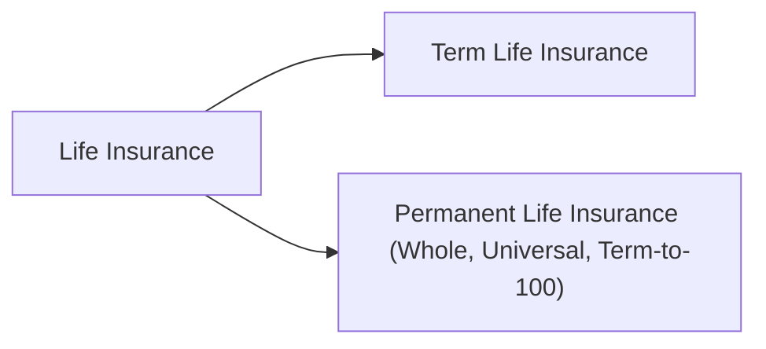

## 8.5 Types of Life Insurance

So, maybe you’ve heard a friend say, “I just bought term insurance in case something happens while the mortgage is still huge,” or you’ve seen someone else mention something like “I invested in a whole life policy and it’s growing tax-deferred.” If you’re feeling a bit puzzled, you’re not alone. Life insurance—believe it or not—can be one of the most interesting and creative tools in your financial planning arsenal.

This section peels back the layers to show exactly what life insurance can do for you and your clients, how it’s structured, and how it fits right into a broader financial plan.

---

## Overview

Life insurance, at its heart, is a risk management tool that protects your loved ones (or even your business partners) against the financial blow that can follow a death. That’s the big-picture definition. But there’s a lot more detail and nuance when you get into the different types—some of which come with savings or investment features. 

Why does this matter? Well, it means that beyond just providing a death benefit, life insurance can also grow wealth, preserve your estate, or even supply additional retirement income. Of course, there’s a trade-off: more complex policies often come with higher costs, potential administrative fees, and a need for careful management. 

---

## The Basics of Life Insurance

There are two broad categories: Term Life and Permanent Life. But, within “Permanent Life,” we’ve got three major sub-categories you’re likely to encounter: Whole Life, Universal Life, and Term-to-100. Think of it as a family tree:

Each of these has different payment structures, investment (or no-investment) features, and coverage rules.

---

## Term Life Insurance

Term life insurance covers you for a specific time period—like 10, 20, or 30 years. If the insured person passes away within that term, the policy’s beneficiary receives the coverage amount (the death benefit). Once the term ends, the coverage typically ends as well. Some policies let you renew (often at a higher premium), or convert to a permanent insurance plan without fresh medical underwriting, if that’s part of the contract.

• Affordability: Term insurance is generally more cost-friendly during the initial coverage years since there’s no cash value or investment component.  
• Specific Needs: It’s often used to protect a mortgage, help cover a child’s education expenses if a primary earner dies early, or replace lost income until retirement.  
• No Cash Value: With term insurance, you won’t build up any equity inside the policy. The entire premium goes toward insurance coverage.  

Bit of a personal story here: My cousin decided on a 20-year term policy when he purchased his first home. He knew he wanted enough coverage to pay off the mortgage if he passed away, but he also wanted the lowest possible premium. The policy was fairly inexpensive, and he liked the idea of possibly converting it to a permanent policy in the future if his long-term needs changed.

---

## Permanent Life Insurance

Permanent life insurance is designed to be “forever” coverage, lasting throughout your lifetime, as long as premiums are paid. It’s like buying a house instead of renting; part of each premium can go into a savings or investment component called the cash value, depending on the type of permanent policy.

### Whole Life Insurance

Whole life insurance is the classic, often described as “set it and forget it.” It has:

• Guaranteed Level Premiums: You pay the same premium throughout the life of the policy.  
• Guaranteed Cash Values: Part of your premium builds equity—often referred to as the cash value—that grows according to a schedule laid out in the policy.  
• Guaranteed Death Benefit: The insurance company promises your beneficiaries a certain amount when you pass away, assuming all terms and premiums have been met.  

Whole life is sometimes used in estate planning. You can name beneficiaries who will receive a lump sum (often tax-free) when you pass, which can help cover taxes on estate assets, or it can fund bequests to family members or charities. The tax-deferred growth of the policy’s cash value can be particularly beneficial if it fits your financial plan—just confirm you’re within the legislative limits so that your policy maintains its tax advantages in Canada.

### Universal Life Insurance

Universal life is a more flexible cousin to whole life. It unbundles the insurance component from the savings component, so you see each separately:

• Flexibility with Premiums: You can pay in more than the minimum required premium (up to certain contribution limits) to accelerate the growth of the cash value. If you need to lower or skip premiums for a time and there’s enough cash value, the policy can cover itself.  
• Investment Options: The cash value side can be invested among a variety of funds (e.g., index funds, bond funds, or guaranteed options), depending on what the insurance company offers.  
• Potential for Growth: Because the money can be invested in the market, there can be higher potential returns—but also increased risk based on those investment choices.  

It’s kinda like building your own sandwich. You’ve got the bread (insurance coverage) and then the fillings (investment selections) that you pick. You can tweak it to your personal or business needs. This flexibility can make universal life policies more complex to manage, though, because you’ve got to keep an eye on fees, changing investment values, and potential tax implications.

### Term-to-100

A third form of permanent coverage, Term-to-100 (sometimes called T-100), stretches coverage all the way to age 100, with level premiums:

• No Cash Value: Typically, T-100 policies don’t build a cash component.  
• Lifelong Coverage: The coverage remains in place as long as you pay the premiums, usually up to age 100, at which point, in many policies, premiums might cease, yet coverage remains in effect.  
• Hybrid Feel: It feels a bit like a cross between term insurance and a whole life plan, but without the typical whole life “guaranteed cash surrender value.”  

---

## Policy Riders and Customizations

No two lives are the same, so many insurers offer riders—like add-ons to a basic phone plan—that give you extra features tailored to your scenario. Here are some common ones:

• Waiver of Premium Rider: If you become disabled and cannot work, the insurance company will waive your premiums (meaning the policy stays active without you paying in).  
• Accidental Death Benefit Rider: Pays an additional benefit if the insured’s death results from an accident.  
• Child Term Rider: Covers your children under your existing policy, often until they reach adulthood or the rider’s coverage end date.  

Think of riders as additional protective gear on a road trip. Standard gear might get you by, but that extra coverage for unexpected twists can go a long way in bringing peace of mind.

---

## Cost Differences and Considerations

So, you might be wondering, “Why bother with permanent coverage if term is less expensive?” The short answer: it depends on your needs, budget, and financial goals.

• Term Insurance: Lower cost initially, straightforward coverage, good for short-to-medium-term needs like paying off a mortgage or shielding children’s education funds. Premiums, however, often jump sharply if you renew at the end of the term.  
• Permanent Insurance (Whole, Universal, T-100): Higher cost initially, but the coverage stays for life, your premium typically remains level (except for some universal life variable cost structures), and there may be a cash value component.  

Some folks start with term (because it’s cheaper) and later pivot to permanent coverage if they anticipate estate needs or want the integrated savings/investment. Others stick with term insurance their entire life cycle—especially if they later self-insure with accumulated wealth. It’s not a one-size-fits-all, and that’s where an advisor’s knowledge and your personal situation come into focus.

### Regulatory Note
Canadian advisors must operate under the guidance of the Canadian Investment Regulatory Organization (CIRO), which came into effect after the merger of the former MFDA and IIROC. CIRO underscores the importance of full disclosure, ensuring clients understand policy fees, potential risks, and coverage details when being recommended a life insurance product.

---

## Real-Life Scenarios

Let’s consider a few examples:

• Mortgage Protection with Term Life: Suppose Jane is a 35-year-old new homeowner. She picks a 20-year term policy set at a death benefit that matches her mortgage. If she passes away before her house is paid off, her beneficiaries can use the insurance proceeds to clear the debt (or part of it, depending on the loan’s balance).  

• Estate Preservation with Whole Life: Catherine, age 50, is thinking about leaving a polished estate for her family. She invests in a participating whole life policy that builds cash value. Over time, her policy accumulates a not-insignificant sum. When she eventually passes away, her heirs can use the death benefit to pay final taxes, or simply enjoy a larger inheritance.  

• Retirement Supplement with Universal Life: Tony, a high-income earner, has maxed out his Registered Retirement Savings Plan (RRSP) and TFSA. He invests in universal life to leverage the tax-deferred growth potential. In 20 years, he might withdraw or borrow against the policy’s cash value to help fund part of his retirement.  

Each scenario addresses a different life stage and goal. Part of what’s cool here is seeing that yes, life insurance can morph to suit a whole bunch of objectives, beyond just a death benefit.

---

## Best Practices and Common Pitfalls

Best Practices:  
• Align Coverage to Goals: Make sure you’re not over- or under-insuring.  
• Check Your Budget: Life insurance is a commitment. If permanent insurance is too costly, better to get a solid term policy early than none at all.  
• Review Annually: Life changes constantly—job changes, marriage, birth, retirement. Don’t let your coverage stagnate.

Pitfalls:  
• Overlooking Riders: Missing out on riders like waiver of premium or child term coverage can sometimes leave you unprotected in certain situations.  
• Confusion Over Cash Value: People sometimes assume they can get the full “cash value” if they cancel a policy immediately, not realizing fees might reduce or even eliminate it for the first several years.  
• Not Updating Beneficiaries: Keep your beneficiary designations current—nobody wants their ex-spouse to inherit their insurance by mistake!

---

## Additional Resources

• [Canadian Life and Health Insurance Association (CLHIA)](https://www.clhia.ca/): Provides excellent consumer guides and comparators for term, whole, and universal life insurance.  
• [CIRO](https://www.ciro.ca): Canada’s self-regulatory organization that ensures transparency, proficiency, and fair dealings within the financial and insurance context.  
• [Financial Consumer Agency of Canada (FCAC)](https://www.canada.ca/en/financial-consumer-agency.html): Offers online tools for comparing insurance quotes, clarifying key policy features, and understanding your rights as a consumer.  
• “Canadian Life and Health Insurance” by Adam Hersh: A solid resource for deeper dives into policy structures, underwriting, and advanced contract details.  
• Open-source financial modeling libraries (available in Python, R, etc.) can help you run projections on different policy scenarios, ensuring that your chosen life insurance aligns with your long-term financial plan.

---

## Glossary

Term Life Insurance: Coverage for a specified number of years (e.g., 10, 20, or 30 years), with no cash value.  
Permanent Life Insurance: Coverage designed to last a lifetime, often featuring a cash value or investment component.  
Whole Life Insurance: A type of permanent insurance with guaranteed level premiums, guaranteed cash values, and guaranteed death benefits.  
Universal Life Insurance: Provides more flexibility with premiums and investment options within the policy’s cash value account.  
Term-to-100: A hybrid product without cash value, offering lifetime coverage with level premiums until age 100.  
Policy Riders: Additional benefits or coverages that can be attached to a basic life insurance policy.  
Cash Value: The amount accumulated in the savings component of a permanent life insurance policy, which can be accessed via withdrawals or loans.  
Waiver of Premium Rider: A provision allowing the insured to keep the policy active without paying premiums if they become disabled.

---

## Test Your Knowledge: Types of Life Insurance Quiz



### Which statement best describes term life insurance?

- [x] It offers coverage for a set period with no cash value.
- [ ] It provides lifelong coverage with potential investment options.
- [ ] It’s designed specifically to cover immediate funeral costs.
- [ ] It always includes a borrowing feature.

> **Explanation:** Term life insurance is typically purchased for a specific time period (e.g., 10 or 20 years) and does not accumulate any savings or investment component.

### Which type of permanent insurance typically has guaranteed death benefits, guaranteed premiums, and guaranteed cash value?

- [x] Whole life insurance
- [ ] Universal life insurance
- [ ] Term life insurance
- [ ] Segregated funds only

> **Explanation:** Whole life insurance is known for its guarantees in death benefit, premium structure, and cash value accumulation. Universal life is more flexible and does not always offer the same guarantees.

### How does universal life insurance differ from whole life insurance?

- [x] Universal life provides flexible premiums and investment choices, whereas whole life offers set premiums and guaranteed cash values.
- [ ] Universal life is only for short-term protection needs.
- [ ] Whole life doesn’t have any cash value component.
- [ ] Universal life insurance is never used in estate planning.

> **Explanation:** Universal life lets policyholders adjust premiums and choose from various investment options for cash value growth, providing greater flexibility compared to whole life.

### Term-to-100 policies generally:

- [x] Provide lifetime coverage but no cash value.
- [ ] End exactly at age 70.
- [ ] Offer significant dividends and bonuses.
- [ ] Cover only accidental deaths.

> **Explanation:** Term-to-100 policies maintain coverage for the insured’s lifetime (up to age 100) but typically don’t feature any cash accumulation component.

### Which rider allows an insured to stop paying premiums if they become disabled?

- [x] Waiver of premium rider
- [ ] Accidental death benefit rider
- [x] Child term rider
- [ ] Guaranteed insurability rider

> **Explanation:** A waiver of premium rider keeps your policy in force without additional payments during a qualifying disability.

### Which statement about cost differences among life insurance policies is correct?

- [x] Term life is typically cheaper at first, but permanent policies lock in coverage at a level premium.
- [ ] Permanent policies are always cheaper than term life in early years.
- [ ] Term insurance always remains cheaper and never increases in price.
- [ ] Universal life insurance never has any fees associated with it.

> **Explanation:** Term life insurance initially costs less, but permanent life insurance can lock in your coverage for the long run with a steady premium.

### A child term rider:

- [x] Can provide coverage for a child under the parent’s policy.
- [ ] Terminates the policy when a child is born.
- [x] Is the same as accidental death benefit coverage.
- [ ] Is never needed when you have whole life insurance.

> **Explanation:** A child term rider is an add-on that covers the children of the insured under the parent’s or guardian’s existing policy up to a certain age or coverage limit.

### What is the main purpose of a life insurance policy’s cash value?

- [x] It’s a savings/investment component that can often be borrowed against or withdrawn.
- [ ] It replaces re-insurance costs for the insurer.
- [ ] It’s solely used to pay for underwriting fees.
- [ ] It’s the face amount of a term policy.

> **Explanation:** Cash value in permanent insurance policies can accumulate and be accessed via policy loans or withdrawals, providing potential liquidity or an additional resource in retirement or emergencies.

### Why might someone choose to convert their term policy to a permanent policy?

- [x] They want lifelong coverage and possibly the added benefit of cash value accumulation.
- [ ] They want to cancel coverage immediately.
- [ ] They only need coverage for one more year.
- [ ] They want to reduce their premium drastically in the short term.

> **Explanation:** Conversion typically allows clients to transition from short-term coverage to a lifelong policy, benefiting from potential estate planning advantages and investment components.

### Whole life insurance policies:

- [x] True
- [ ] False

> **Explanation:** Whole life insurance provides fixed premiums, guaranteed death benefits, and cash value accumulation that grows on a guaranteed schedule.



Remember—your choice of life insurance should reflect your personal journey. Whether it’s protecting a mortgage, leaving something behind for loved ones, or even building a nest egg that can benefit you while you’re still around, life insurance can be an important piece of your ever-evolving financial puzzle. If you’re unsure, reach out to an advisor to discuss your goals, risk appetite, and budget constraints.
