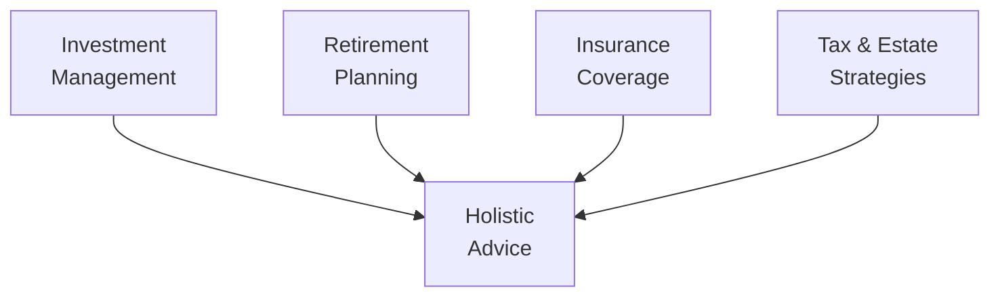

## 1.1 The Financial Planning Business Today

If you've ever spoken to a friend who needed financial advice, you might have noticed how broad and complex the financial planning business can be. It wasn’t always this specialized, though. In Canada, financial planning originally sprouted from professionals in accounting, insurance, banking—really, wherever people handled money issues. Over time, the demand for more robust, client-centered guidance led to the rise of financial planners as distinct professionals. Now, with integrated regulation, technological advances, and evolving client expectations, financial planners often act as the pivotal link between clients and the broader financial world.

We’ll explore how this business got to where it is today, why it’s so important to stay on top of industry changes, and how technology and collaboration keep shaping the way advisors serve their clients.

### Evolution from Various Fields to a Recognized Profession

Walk into any financial advisor’s office, and you might see diplomas or designations from business, accounting, insurance, or economics. These professionals—once scattered throughout the financial sector—gradually converged to form the “financial planner” role. This journey from multiple, distinct fields to a consolidated profession was driven by:

• Increasing Complexity: Clients need more than just investment advice. They want tax strategies, retirement plans, risk management, estate solutions, and beyond.  
• Growing Regulations: Regulatory changes forced professionals to adhere to higher standards, obtain relevant credentials, and follow strict ethical guidelines.  
• Consumer Awareness: People became more aware of the value of comprehensive advice, especially after witnessing market fluctuations or hearing cautionary tales of poor money management.

Now, if you’re seeking a professional who can walk you through everything from budgeting to estate transfers, you’ll often find someone trained in multiple disciplines, or who collaborates with experts in law, accounting, and insurance.

### The Role of Regulatory Bodies

Financial planning, particularly in Canada, is heavily influenced by regulatory bodies that oversee various aspects of the work. Historically, the Mutual Fund Dealers Association of Canada (MFDA) and the Investment Industry Regulatory Organization of Canada (IIROC) oversaw different segments of the investment industry. But, for those of you who might not know, these two organizations were amalgamated into a single, national self-regulatory organization now known as the Canadian Investment Regulatory Organization (CIRO). Launched officially on January 1, 2023, and renamed effective June 1 of that year, CIRO brings under one umbrella:

• Investment dealers  
• Mutual fund dealers  
• Marketplace integrity regulation for equity and debt markets  

By streamlining regulation, CIRO (https://www.ciro.ca) has bolstered transparency and eased the compliance burden. It’s a crucial evolution because clients want reassurance that their advisor is held to consistent, robust standards. Importantly, the Canadian Investor Protection Fund (CIPF)—formed from the merging of the MFDA’s Investor Protection Corporation and the original CIPF—now protects client assets if a member firm becomes insolvent.

So, how does this help you? Well, fewer regulatory grey areas and consistent rules mean clients get better protection. It also means financial planners need to uphold the same high standards, no matter their area of specialization. This integrated regulation approach is often referred to as “holistic” or “unified,” making sure that whether you’re working with mutual funds or stocks, the same overarching rules apply.

### Ethical Standards and Professional Associations

Regulation is one piece of the puzzle; ethics is another. You’ll often hear about professional bodies such as FP Canada (https://www.fpcanada.ca) or Advocis (The Financial Advisors Association of Canada) that offer designations, continuing education, and a code of ethics. Many advisors are also licensed through provincial insurance councils or securities commissions. By abiding by these codes, planners commit to:

• Acting in the best interests of their clients  
• Maintaining confidentiality  
• Providing full and fair disclosure  
• Pursuing ongoing education  

In Chapter 1.2: Ethics and Financial Advisors, we’ll dive deeper into what these ethical obligations look like and how the industry enforces them. For now, just remember that these standards serve as a cornerstone of trust between the advisor and client—and trust, as we all know, is the foundation of any lasting relationship.

### Adapting to Sophisticated Client Demands

I once had a friend who came to me saying, “I’m not just looking for an ‘RRSP guy.’ I need someone who can handle all my finances—retirement, taxes, maybe even my future kids’ education.” That sentiment echoes what a lot of Canadians feel nowadays: They want holistic financial advice. Clients are no longer satisfied with a narrow focus on, say, just mutual funds or insurance policies. They expect a full menu of services that incorporate:

• Investment Management: Building, monitoring, and adjusting portfolios aligned with risk tolerance and life goals.  
• Retirement Planning: Covering everything from basic RRSP contributions to advanced strategies involving pension plans and potential government benefits.  
• Tax Optimization: Suggesting ways to reduce or defer tax payments (legally, of course!) through structures like Tax-Free Savings Accounts (TFSAs) or Registered Retirement Savings Plans (RRSPs).  
• Insurance Solutions: From term life insurance to disability insurance, ensuring that families are protected against unforeseen events.  
• Estate Planning: Coordinating wills, powers of attorney, trusts, and beneficiary designations to ensure assets pass smoothly to heirs.  

Financial planners often work hand-in-hand with lawyers, tax specialists, and estate practitioners to deliver comprehensive solutions. You’ll see more about how these collaborations work in Chapter 16: Family Law and Chapter 17: Trusts and Powers of Attorney. The takeaway? Your role as a financial planner might be part quarterback, part coach, overseeing many financial “players” to ensure everything runs smoothly for the client’s benefit.

### Technology’s Transformative Role

Technology has become an indispensable ally in the financial planning world. Picture this typical conversation: “So, Sarah, let’s plug your numbers into our software,” the advisor says, turning the monitor so Sarah can see her future projections based on different rates of return.

Common tools include:  
• Financial Planning Software: Platforms that integrate a client’s financial data—assets, liabilities, projected inflows, and outflows. These tools can run simulations under various “what-if” scenarios.  
• Client Portals and Dashboards: Online platforms where clients can track their own portfolios, financial goals, and net worth in real time.  
• Robo-Advisors: Automated platforms that can help with certain investment selections or rebalancing tasks.  
• Compliance Solutions: Programs to ensure advisors meet all regulatory requirements set by CIRO and other authorities.

The use of sophisticated software means advisors can quickly analyze multiple scenarios. Clients can see how an early retirement or a new mortgage might affect their financial roadmap. This not only saves time but also fosters transparency—that magical ingredient that makes clients feel they’re part of the process.

Below is a sample diagram showing how technology intersects with the traditional components of financial advising:

In this diagram, you can see how technology acts as a bridge between collecting client data and delivering strategic, personalized recommendations. By constantly monitoring the results, advisors can adapt and refine their plans.

### Importance of Ongoing Education

You might be wondering: “If the industry is so regulated, is that enough to guarantee advisor expertise?” Not quite. Regulatory frameworks set minimum standards, but the financial world is ever-evolving. Markets shift, tax rules change, new investment vehicles pop up, and client demographics shift. Advisors who rely on outdated knowledge do everybody a disservice. That’s why continuing education is paramount.

Many professional associations, like FP Canada or Advocis, require a specified number of continuing education (CE) credits annually. Others offer specialized courses, such as Advocis’s “Introduction to Professional Ethics” (https://www.advocis.ca). Numerous designations—like the Certified Financial Planner (CFP) designation—carry mandatory ethics and technical proficiency updates. In short, staying relevant is as much a duty to your client as it is a career-building move.

### Collaboration with Other Professionals

Let’s say an advisor’s client is selling a small business and wants to reinvest the proceeds. That situation might involve complex tax considerations, corporate reorganizations, or estate freeze strategies (check out Chapter 15: Financial Planning for Small Business to learn more). A single advisor might not be an expert in all these areas, so they often call in:

• Tax Specialists (to minimize liabilities)  
• Lawyers (to handle complex contractual and estate requirements)  
• Valuation Experts (for accurate business worth assessments)  
• Insurance Experts (for risk management and coverage)

Collaboration ensures that advice is both comprehensive and accurate. It also underscores that modern financial planning is about teamwork—nobody has to (or should try to!) do everything themselves.

### Best Practices and Common Pitfalls

Because modern financial planning is so holistic, there are also some pitfalls to watch out for:

• Over-Promising Returns: Some advisors might be tempted to offer unrealistic returns to entice clients. Always ground recommendations in a realistic understanding of market movements.  
• Neglecting Risk Profiles: Improper or incomplete assessment of a client’s risk tolerance can lead to mismatched portfolios and potential losses.  
• Lack of Regular Reviews: Life changes quickly. What suits a client today might not be ideal in five years—or even five months. Frequent check-ins are non-negotiable.  
• Inadequate Documentation: Failing to keep records or confirm instructions in writing can lead to misunderstandings or regulatory headaches.  

The good news? Adhering to guidelines from CIRO, applying ethical standards, collaborating effectively, and continuing your education can help you sidestep these pitfalls. Think of them more as signposts than obstacles.

### Case Study: A Young Family Seeking Holistic Advice

Imagine a couple, Mark and Andrea. They’re in their early 30s, have stable incomes, one toddler, and dream of retiring by 60. Here’s how a planner might step in:

• Gathering Data: The planner collects details on their current net worth, insurance policies, monthly expenditures, and future goals (like saving for their child’s education).  
• Analyzing Scenarios: Using financial planning software, the planner shows them how different saving rates, investment choices, or mortgage strategies impact their retirement timeline.  
• Collaborating with a Lawyer: Since Mark and Andrea also need a will and guardian arrangements for their child, they’re referred to a family lawyer.  
• Revisiting the Plan: The couple’s plan includes scheduled reviews—maybe once a year or after major life events like buying a home or having another child.

This real-life scenario highlights how a modern financial planner’s role is both comprehensive and client-focused. The couple’s overall financial well-being is the planner’s top priority, from daily budgeting to long-term estate planning.

### Diagram: Key Elements of Holistic Financial Advice

In this second diagram, all elements (investment management, retirement planning, insurance coverage, and tax/estate strategies) converge to form truly holistic financial advice. This flow underscores the importance of integrating every puzzle piece.

### Closing Thoughts

The financial planning business in Canada is more than just about picking stocks or mutual funds. It’s a profession that demands ethical integrity, broad technical knowledge, and the ability to communicate effectively with clients and collaborate with other experts. With unified oversight from CIRO, the modern financial planner operates in an environment that aims to keep investors protected and well-informed.

Staying engaged with educational opportunities, leveraging the latest tech tools, and abiding by strong ethical principles allows professionals to excel. As we move forward through this course, you’ll learn about the specific processes and frameworks that make up a comprehensive financial planning approach—from cash management to estate settlement. The ultimate goal remains the same: helping clients live out their personal aspirations while safeguarding their financial future.

---

### Glossary

• **CIRO (Canadian Investment Regulatory Organization):** The national self-regulatory organization responsible for overseeing investment dealers, mutual fund dealers, and marketplace activities in Canada.  
• **Regulatory Bodies:** Government or self-regulatory agencies that set and enforce standards and rules for the financial industry (e.g., Canadian Securities Administrators).  
• **Holistic Financial Advice:** A comprehensive approach to financial planning that incorporates investment, taxation, insurance, estate, and retirement elements.  
• **Professional Associations:** Groups that represent financial planning professionals, providing education, advocacy, ethical guidelines, and continuing education (e.g., FP Canada, Advocis).  
• **Integrated Regulation:** A regulatory approach wherein multiple types of financial services (mutual funds, stocks, bonds, insurance) are overseen by a single or unified body.  
• **Financial Planning Software:** Specialized software that helps planners analyze, project, and illustrate a client’s financial situation under different assumptions.  
• **Licensing Bodies:** Entities that grant legal authority for individuals or institutions to offer specific financial services (e.g., provincial insurance councils).  
• **Further Client Demands:** The trend that clients expect more personalized, thorough, and technology-driven solutions to suit their unique goals.

### Additional Resources

- CIRO: https://www.ciro.ca  
- Financial Consumer Agency of Canada (FCAC): https://www.canada.ca/en/financial-consumer-agency.html  
- FP Canada: https://www.fpcanada.ca  
- Suggested Book: “Canadian Securities Course (CSC®) textbook” by the Canadian Securities Institute (CSI)  
- Recommended Online Course: “Introduction to Professional Ethics” by Advocis (https://www.advocis.ca)

---

## Test Your Knowledge: The Financial Planning Business Today



### Which organization emerged from the amalgamation of MFDA and IIROC?

- [ ] Canadian Securities Administrators
- [x] The Canadian Investment Regulatory Organization (CIRO)
- [ ] The Financial Consumer Agency of Canada (FCAC)
- [ ] FP Canada

> **Explanation:** MFDA and IIROC were consolidated into CIRO, which serves as Canada’s single self-regulatory organization overseeing investment dealers, mutual fund dealers, and marketplace integrity.

### What is one key advantage of CIRO’s integrated regulation?

- [x] It provides consistent oversight across investment dealers and mutual fund dealers.
- [ ] It eliminates the need for licensing exams.
- [ ] It replaces all provincial securities regulators permanently.
- [ ] It only regulates banks operating outside Canada.

> **Explanation:** By integrating separate regulatory functions, CIRO applies consistent rules and oversight to investment dealers and mutual fund dealers, improving market transparency and investor protection.

### Why are holistic financial solutions gaining popularity among clients?

- [ ] Clients only care about earning high returns.
- [ ] Clients no longer value tax or estate planning services.
- [ ] Clients prefer a quick fix to complex financial issues.
- [x] Clients expect comprehensive guidance on investments, taxes, insurance, and estate planning.

> **Explanation:** Modern investors often seek an all-encompassing approach that addresses several areas—investments, retirement, tax, insurance, and estate planning—rather than a single isolated solution.

### Which of the following best describes the role of technology in current financial planning?

- [x] It streamlines data gathering and scenario analysis to facilitate personalized plans.
- [ ] It completely replaces the need for in-person financial advisors.
- [ ] It is limited to portfolio rebalancing without regulatory compliance checks.
- [ ] It only offers standardized financial advice templates.

> **Explanation:** Technology fosters more efficient, tailored financial planning by processing complex data, illustrating results, and helping automate compliance tasks, enhancing planner-client collaboration.

### What are professional associations like FP Canada known for?

- [x] Providing a framework for education, ethics, and best practices for financial planners.
- [x] Offering continuing education programs.
- [ ] Serving as government bodies that directly regulate planners.
- [ ] Issuing provincial licenses for real estate transactions.

> **Explanation:** Groups like FP Canada offer designations, enforce a code of ethics, and provide ongoing educational opportunities—though they are not direct regulators of the profession.

### Which is an example of a collaborative effort within financial planning?

- [x] A planner consulting with a lawyer and accountant to handle a client’s business sale.
- [ ] A broker reducing commissions without discussing the client’s goals.
- [ ] A planner working entirely alone on a client’s corporate tax filing.
- [ ] A plan that ignores the client’s existing insurance policies.

> **Explanation:** Collaborative financial planning involves multiple professionals—tax specialists, lawyers, insurance experts—to deliver comprehensive advice.

### What is a common pitfall some advisors might fall into?

- [x] Over-promising returns to attract more clients.
- [ ] Encouraging frequent plan reviews to match life changes.
- [x] Properly documenting every client interaction.
- [ ] Regularly updating knowledge through continuing education.

> **Explanation:** Over-promising returns can mislead clients and damage trust. Additionally, failing to document client interactions can lead to misunderstandings or regulatory issues.

### What regulatory changes contributed to the current state of the Canadian financial planning industry?

- [x] The amalgamation of MFDA and IIROC into CIRO.
- [ ] The elimination of all proficiency requirements.
- [ ] The deregulation of Canada’s financial markets.
- [ ] The transfer of regulation to non-Canadian authorities.

> **Explanation:** The creation of CIRO centralized oversight into one SRO, bringing more consistency to regulation and investor protection within the Canadian financial planning industry.

### Why is ongoing education crucial for financial planners?

- [x] Markets and regulations constantly evolve, requiring updated knowledge.
- [ ] It is optional to maintain official certification requirements.
- [ ] It only advances technology skills but not market knowledge.
- [ ] Most regulatory bodies don’t require any formal education after licensing.

> **Explanation:** Financial planners must stay up to date with ever-changing markets, regulatory frameworks, and emerging investment strategies to offer reputable and compliant advice.

### Under current Canadian regulations, client assets held at an insolvent member firm are protected by CIPF.  
- [x] True
- [ ] False

> **Explanation:** The Canadian Investor Protection Fund (CIPF) safeguards clients whose assets are with a member firm that becomes insolvent, underscoring the importance of SRO-backed investor protection.


