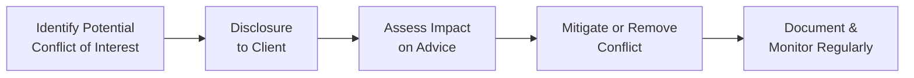

## 1.2 Ethics and Financial Advisors

Ethics often gets tossed around as a buzzword, right? You hear it at conferences, see it splashed on websites, and read it in countless corporate mission statements. But when it comes to financial planning—especially here in Canada—ethics isn’t just another box to tick. It’s the core of what an advisor does every single day. This is not just about telling the truth, though honesty obviously matters a lot. It’s also about putting your client’s interests first, diligently protecting their private data, making recommendations that actually make sense for them, and being transparent about every fee or compensation you receive. 

Some folks might say that’s just “best practice.” But let’s be honest: The real difference is whether or not you have a deeply ingrained sense of responsibility that guides your decisions even when nobody’s watching. So let’s explore what that means in our day-to-day lives as financial planners and how ethical guidelines help us keep our focus on what truly matters: the client’s overall well-being.

Why does this matter so much? Well, imagine your mother or your sibling entrusting their entire life savings to someone. You'd want that someone to be grounded in solid professional ethics, right? That’s the crux of it: trust. If you don’t have trust, you can’t build long-term, sustainable relationships in this business. And if you don’t have an ethical foundation, you lose trust in a heartbeat.

---

### The Heart of Ethics in Financial Planning

Ethics in our industry is kind of like the “invisible force.” It shapes how we consider clients’ best interests, how we interpret laws and regulations, how we disclose potential conflicts, and even how we handle everyday interactions—like responding to a worried client’s Sunday-night text about market fluctuations. 

Ethical standards in Canadian financial planning take their cues from wide-ranging frameworks that reach across national and international boundaries. For instance, you have the codes set by FP Canada, Advocis, and others. These guidelines reflect big ideas like:

• The superiority of client interests (i.e., client first).  
• Integrity and fairness.  
• Confidentiality.  
• Professionalism.  
• Clear, honest disclosure of relevant information.  

Whether you’re holding a Certified Financial Planner (CFP) designation, part of the Chartered Financial Analyst (CFA) community, or affiliated with various professional bodies, you’re expected to keep sharpening your ethical decision-making skills.

---

### Personal Anecdote: An Early Lesson in Ethics

I’ll never forget my own baptism by fire when I was a junior advisor. A client had hinted about wanting me to “fudge some numbers” on an investment form to help them qualify for higher returns or at least get a discount. Technically, you might say, “What’s the big deal?” But it was a big deal. Even if the client’s intention seemed harmless, it was an outright ethical violation. My mentor at the time asked me a question I still remember: “Would you be hiding that from anyone if you had to defend it in public?” I realized then and there how easy it is to slip into questionable territory if you’re not hyper-vigilant about ethics. 

That experience taught me that ethical decisions can be subtle. It wasn’t that the client was an evil mastermind—far from it. But in an effort to help them, I was in danger of crossing a line. And once you cross it, it’s not so easy to go back.

---

### Core Principles of Ethical Conduct

It helps to break things down: what does “being ethical” mean in the day-to-day context? Let’s look at a few pillars that typically appear in codes of ethics across the board.

#### Client Interests Above All Else

In Canada, financial advisors are expected—by both professional organizations and regulators—to serve their clients’ best interests. This means no recommendation should ever be colored by your own potential financial gain or personal bias. For example, maybe there’s a mutual fund that pays higher compensation or trailing commissions than another. If it isn’t suitable for your client after factoring in risk tolerance, investment objectives, or time horizon, you shouldn’t even consider it. 

“Suitability requirement” is the term you’ll often see in legislation and in the guidelines set by regulators like the Canadian Securities Administrators (CSA). For advisors operating under the purview of the Canadian Investment Regulatory Organization (CIRO)—the new national self-regulatory body as of 2023—suitability means you’re strictly obligated to ensure any recommendation is in line with the client’s actual profile. 

#### Integrity

Integrity means consistency of actions, values, methods, and principles. In simpler terms: if you say you’ll do something for a client, do it thoroughly, accurately, and without hidden motives. It’s about honesty. If you make a mistake, you own up to it—no excuses, no sweeping it under the rug. 

This is one of those areas where “actions speak louder than words.” Don’t just talk about integrity; show it. If a piece of an investment strategy starts to show signs of trouble, address it immediately with the client rather than hoping it resolves on its own.

#### Fairness and Transparency

Ever had that moment at a restaurant where you get handed the bill and you see a mysterious charge you didn’t order? You feel cheated, or at least uneasy. In financial planning, that sense can be magnified because the stakes are so much higher. 

People have the right to know exactly what they’re paying for advice or transactional services. Whether it’s a commission-based model, fee-based, or some hybrid, you have to be totally upfront. If you recommend a particular insurance product where you earn a commission, that’s okay, provided it’s the most suitable solution and you’ve clearly disclosed how you’re compensated. 

Think about personal privacy, too. Clients often share deeply personal information—like their net worth, tax returns, family finances, even health issues that might impact insurance. Upholding confidentiality is not just ethically correct; it’s legally mandated in many cases.

#### Professionalism

Professionalism is all about how you conduct yourself, from the smallest details—like writing a polite and accurate email—to the bigger strategic moves, such as how you handle a conflict of interest. It typically includes:

• Staying current with continuing education requirements.  
• Maintaining any designations (like CFP) in good standing by keeping up with ethics and technical modules.  
• Communicating clearly and in a timely manner.  

In Canada, professional conduct also involves meeting regulatory guidelines about record keeping and the timely disclosure of important information. CIRO, replacing the former IIROC and MFDA, sets out many of these guidelines for its member firms. The idea? Regulators want to create a uniform standard so that no matter where you live in Canada, you get consistent, high-quality financial advice.

---

### Conflicts of Interest: Identifying and Managing

A conflict of interest occurs when your personal or financial situation could compromise—or appear to compromise—your professional judgment. We deal with them more often than we might think, from referral fees to product sale incentives. 

The key questions:  
1. Is there a possibility that my recommendation might be influenced by something other than what’s best for the client?  
2. Could an outsider reasonably perceive that my decision was swayed by personal benefit?  

If the answer is “yes” or “maybe,” you have to disclose it, mitigate it, or even eliminate it if possible. Disclosing a conflict to the client doesn’t automatically solve everything, but it’s crucial in allowing the client to make an informed decision. The next big step is making sure you don’t let that conflict steer your advice.

Here’s a quick look at the process of managing conflict of interest, visualized as a flowchart:

- A: Recognize early warning signs (e.g., receiving commission from a product-specific distribution channel).  
- B: Immediately inform the client if a conflict exists (or might exist).  
- C: Analyze how significant the conflict might be for the client’s situation.  
- D: If possible, remove the conflict entirely (like refusing a commission or referring elsewhere) or mitigate it (like discounting fees).  
- E: Keep records of each step, re-evaluate periodically.

---

### Regulatory Framework in Canada

Canada’s regulatory environment for financial services, especially for investments, is shaped by both federal and provincial authorities. The overarching body for market integrity and oversight is the Canadian Securities Administrators (CSA). Each province also has its own securities commission (such as the Ontario Securities Commission, British Columbia Securities Commission, etc.).

Starting in 2023, the industry took a significant turn when the former Mutual Fund Dealers Association of Canada (MFDA) and the Investment Industry Regulatory Organization of Canada (IIROC) merged into a single self-regulatory organization, the Canadian Investment Regulatory Organization (CIRO). CIRO now supervises investment dealers, mutual fund dealers, and fosters market integrity across Canadian markets.

If you’re seeking updates or official guidelines, check:
• CIRO’s resources at https://www.ciro.ca  
• CSA’s updates at https://www.securities-administrators.ca  

The principle is the same across these regulatory bodies: always act transparently, fairly, and in the client’s best interest. Any breach can result in disciplinary measures, fines, or even losing your license to practice.

---

### Codes of Ethics and Standards

Professional bodies like FP Canada, Advocis, and the CFA Institute provide codes of ethics and practice standards that go beyond mere legal requirements. They often incorporate the following themes:

• Placing the client’s interest first.  
• Exercising due care and diligence.  
• Maintaining and advancing the profession’s integrity.  
• Disclosing potential conflicts.  
• Reinforcing the need for ongoing ethics education.  

As a Canadian financial advisor, you’ll likely find common ground between these codes. For instance, the FP Canada Standards Council’s Code of Ethics lays down specific principles that revolve around integrity, objectivity, competence, fairness, confidentiality, and diligence. Advocis has its own set of guidelines emphasizing the responsibility to clients, the profession, and the community. Meanwhile, the CFA Institute’s code, though global in scope, resonates with many similar principles. 

---

### Practical Case Study: Disclosing a Fee Structure

Imagine you recommend Corporate Bond Fund A to your client. While you genuinely see it as suitable, you also know it comes with a slightly higher trailer fee for you than Bond Fund B. Ethically, you have to tell your client that:

• Both funds meet their investment objectives and risk tolerance.  
• Fund A will pay you a bigger commission.  
• Performance projections might be roughly comparable to Fund B.  

Then you let them decide—armed with all the relevant facts. If you fully believe Fund A’s benefits justify choosing it anyway, but you are transparent about your compensation, you’ve taken the ethical route. Concealing that difference in your compensation would be unethical and goes against the transparency principle.

---

### Confidentiality and Data Protection

Let’s talk about confidentiality. In the digital era, we deal with everything from cloud-based client portals to texting sensitive information. Advisors must keep up with best practices for data security—using encrypted email, strong passwords, or secure file-sharing systems. The reasons go beyond wanting to look professional. It’s about respecting the trust clients place in you with their personal financial info.

That trust is also legally enforced. Provincial and federal privacy laws, like the Personal Information Protection and Electronic Documents Act (PIPEDA), dictate how personal data should be collected, used, and disclosed. Advisors must ensure compliance or risk penalties, not to mention severe reputational damage.

---

### Ongoing Education and Ethics Training

It’s not enough to learn about ethics once and then forget it. Most professional designations require some form of continuing education in ethics. For example, the CFP designation from FP Canada mandates annual or biennial ethics modules. These modules keep you updated on regulatory changes (like those from CIRO or the CSA) and help you navigate emerging ethical dilemmas—say, how to handle new fintech-based recommendations or define conflict-of-interest challenges around robo-advisors. 

Remember, compliance with continuing education is not merely a bureaucratic exercise; it’s a chance to reflect and sharpen your moral compass. One year, you might learn about changes in tax laws that affect trust accounts. The next, you might delve into new best practices for cybersecurity or responding to complex estate planning conflicts among blended families.

---

### Building and Upholding Client Trust

While fancy credentials and decades of experience certainly matter, the single biggest factor that keeps your client relationships strong is trust grounded in ethical conduct. For instance, even if you’re not a legal expert, any mention or suspicion that your client’s marriage situation could affect their financial plan needs to be addressed. Maybe that means referring them to legal professionals or simply raising the topic for them to consider. It might feel uncomfortable, but ignoring it could be ethically questionable—your job is to highlight any significant issues or changes that might affect their finances.

Likewise, tax legislation changes frequently in Canada. Informing your client promptly, or at least guiding them to relevant resources and professionals, maintains that relationship of trust. Clients want to know you have their back—especially if a new capital gains rule or proposed government measure could drastically influence their investment strategy.

---

### Glossary

• **Code of Ethics:** A formal set of principles and values established by professional organizations like FP Canada or Advocis. It’s the framework against which all your advisory actions are measured.  
• **Integrity:** The cornerstone of ethical behavior. Requires honesty and consistency, whether you’re advising on a multi-million-dollar business buyout or a small retirement savings plan.  
• **Conflict of Interest:** Any scenario where your personal gain could overshadow the best interest of your client, or appear to do so. Full disclosure is non-negotiable.  
• **Transparency:** Operating in a way that’s open and straightforward—especially regarding fees, compensation, potential risks, and any changes that might impact a client’s financial situation.  
• **Professionalism:** Demonstrating expertise, respect, and accountability in every facet of your advisory role. Think about timely communications, ongoing education, and a respectful approach to client relations.  
• **Suitability Requirement:** A rule that your recommended investments must fit the client’s risk tolerance, timeline, financial objectives, and overall capacity to handle risk.  
• **Ethics Education:** Structured learning, often part of continuing education, that ensures you remain current with laws, regulations, and best practices in moral decision-making.

---

### Ethical Best Practices and Common Pitfalls

Ethical guidelines sometimes sound grand, but they do translate into day-to-day habits. Below are some best practices that can serve as anchors:

• Always document your rationale: If you recommend a certain product or strategy, note reasons and potential conflicts. If questioned later, you have a transparent record.  
• Communicate clearly: Jargon confuses people. Making sure your client understands the “why” behind every recommendation is an ethical courtesy. It helps them make informed decisions.  
• Update knowledge regularly: Laws, market trends, or even new financial technologies can change the playing field. Being outdated isn’t just bad for business; it can be unethical if you give advice that’s no longer relevant.  
• Know your limitations: If you’re not qualified in a certain area—like specialized estate law—refer your client to someone who is.  

Pitfalls often revolve around conflicts of interest, sloppy confidentiality, or failing to keep up with changes in tax or securities regulations. Another trap is “soft-dollar benefits,” like a fund manager offering a fancy conference trip under the pretext of “education.” It might be educational, or it might not. The question remains: does it influence your recommendations? If it does, or if it creates that appearance, you need to handle it ethically and transparently.

---

### Real-World Scenario: Handling an Urgent Ethical Dilemma

Let’s say you learn suddenly that one of your firm’s recommended investment products was involved in questionable business practices abroad. The marketing materials your firm has been giving to clients don’t mention these newly uncovered controversies or potential legal issues. Do you:

• Assume the firm will update all marketing materials eventually?  
• Or proactively alert your compliance department and recommend a hold on new sales until more information is available?

The ethical approach is to address it head-on. Speak to your firm’s leadership or compliance team. If your firm is under CIRO’s oversight, they’ll have mandated procedures for dealing with potentially misleading marketing or promotional material. Keeping silent—hoping the issue goes away—could harm your clients and tarnish your professional standing.

---

### The Road Ahead

Ethics isn’t a static rulebook tucked away in a dusty corner of your office. It’s a living, breathing practice that evolves with changing regulations, new financial products, and shifting client needs. By continuously reflecting on ethical principles—client first, integrity, fairness, transparency, professionalism—you cement a relationship built on trust.

Yes, it can be uncomfortable to navigate grey areas. You might occasionally wonder if you’re overcomplicating it by disclosing all the possible conflicts in a certain recommendation. But trust me, a few extra moments of clarity can save you months—or years—of regret down the line. With strong ethics, you don’t just do the bare minimum to stay legally compliant. You become a beacon of integrity in an industry that absolutely depends on public confidence.

---

### References and Additional Resources

• FP Canada Standards Council: https://www.fpcanada.ca/ethics  
• Advocis – The Financial Advisors Association of Canada: https://www.advocis.ca  
• CFA Institute Code of Ethics and Standards of Professional Conduct (international reference): https://www.cfainstitute.org  
• Canadian Securities Administrators (CSA): https://www.securities-administrators.ca  
• For the latest updates on self-regulatory changes, refer to CIRO: https://www.ciro.ca  
• Book Recommendation: “The Trust Edge” by David Horsager – a great read on how ethical behavior builds trust in professional and personal settings.

---

## Test Your Knowledge: Ethics and Financial Advisors Quiz



### Which of the following best describes why integrity is essential in financial advisory?

- [ ] It helps advisors secure higher commissions and bonuses.
- [x] It ensures honesty and consistency in actions and principles.
- [ ] It simplifies the financial planning process for clients.
- [ ] It exclusively addresses conflicts of interest.

> **Explanation:** Integrity is about consistent adherence to ethical principles such as honesty and fairness. It goes beyond temporary gains like commissions or bonuses.

### When dealing with a potential conflict of interest, which is the first step an advisor should take?

- [x] Identify and disclose it to the client.
- [ ] Immediately switch to a new product without informing the client.
- [ ] Provide only partial information about the nature of the conflict.
- [ ] Delay disclosure until the client complains.

> **Explanation:** The first step is to identify the conflict of interest and then fully disclose it to ensure the client can make an informed decision.

### Which statement about “suitability requirement” is accurate?

- [x] Recommendations must align with the client’s unique risk tolerance and goals.
- [ ] Advisors must choose products that yield the highest commissions.
- [ ] The requirement only applies to insurance products, not investments.
- [ ] Suitability is optional if the client has an alternate advisor.

> **Explanation:** The suitability requirement mandates that recommendations align with the client’s risk profile, objectives, and capacity. This is not optional and applies to all recommendations, not just insurance or extra services.

### How should an advisor handle new information about suspicious activity related to a recommended investment product?

- [x] Immediately raise the concern with compliance and consider suspending further recommendations.
- [ ] Continue recommending the product while waiting for official updates.
- [ ] Hide the information to avoid alarming the client.
- [ ] Wait for the fund manager to contact you first.

> **Explanation:** Advisors have an ethical obligation to act promptly in the client’s interest, which includes raising potential red flags and being transparent.

### Why is data security an ethical issue for financial advisors?

- [x] Clients share sensitive financial data that must be protected to uphold trust and comply with the law.
- [ ] Data security only matters if advisor compensation is commission-based.
- [x] Unsecured or misused data can severely damage professional reputation.
- [ ] It’s optional because regulators do not require data protection.

> **Explanation:** Data security is both legally required and ethically necessary to protect clients’ personal and financial information. Breaches erode trust and can have legal consequences.

### Which of the following is an outcome of breaching ethical standards in Canada?

- [x] Potential disciplinary measures from regulators like CIRO.
- [ ] Automatic upgrade to a higher advisor designation.
- [ ] Guaranteed immunity from client lawsuits.
- [ ] No consequences unless it’s a criminal offense.

> **Explanation:** Advisors risk fines, losing designations, or suspensions by breaching ethical codes enforced by regulators and professional bodies.

### Which professional body focuses on upholding ethical standards for financial planners in Canada?

- [x] FP Canada
- [ ] Canadian Medical Association
- [x] Advocis
- [ ] Canadian Banker’s Association exclusively

> **Explanation:** FP Canada and Advocis both set and maintain ethical standards for financial planners. The Canadian Medical Association is for healthcare professionals, and the Canadian Banker’s Association is separate from financial planning designations.

### In what scenario might an advisor violate confidentiality principles?

- [x] Sharing client data with friends or family.
- [ ] Using encryption when sending confidential documents.
- [ ] Discussing risk management strategies with the client in person.
- [ ] Reviewing the client’s file in a secure office environment.

> **Explanation:** Confidentiality is breached when an advisor shares client info with unauthorized individuals, whether intentionally or accidentally.

### What is the first check when mitigating a disclosed conflict of interest?

- [x] Assess how it impacts the advisor’s recommendations to the client.
- [ ] Cancel all insurance policies immediately.
- [ ] Ask the client to accept it without further explanation.
- [ ] Increase fees to discourage the client from using the service.

> **Explanation:** After disclosure, the advisor must carefully evaluate the degree to which the conflict might sway the recommendation, then address it accordingly.

### True or False: The new Canadian Investment Regulatory Organization (CIRO) replaced IIROC and MFDA as of 2023.

- [x] True
- [ ] False

> **Explanation:** Effective January 1, 2023, IIROC and MFDA amalgamated to form the Canadian Investment Regulatory Organization (CIRO), now overseeing investment dealers and mutual fund dealers in Canada.


