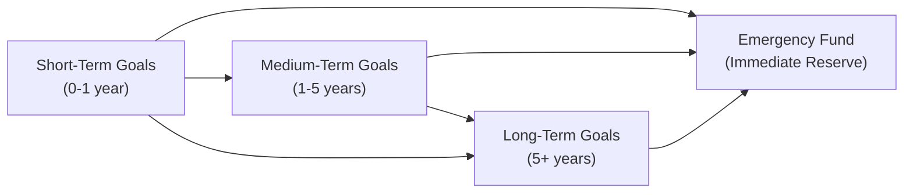

## 1.4 Identifying Your Client’s Goals

Figuring out what people truly want to accomplish with their money is often the most exciting part of financial planning—yet it can be surprisingly tricky. Clients will toss around big dreams like buying a cozy cottage on a lake or taking a three-month trip abroad. They might also have more pressing short-term concerns: “I want to pay down my student loan!” But that’s the magic, isn’t it? Our job as financial professionals is to help them turn these hopes and wishes into a clear, prioritized set of targets. Let’s explore how to do that.

The process of identifying a client’s goals starts with open and honest conversation. We can talk about their day-to-day life, their biggest worries, and what they see happening for themselves or their families in five, ten, maybe twenty years. Understanding these goals—and how they interact with one another—is critical. For instance, saving aggressively for retirement might conflict with big travel plans or a dream to purchase real estate in the next couple of years. A thorough discussion on priorities and timelines helps ensure that the financial plan includes realistic trade-offs and a healthy sense of balance.

Below, we’ll explore strategies for clarifying, prioritizing, and documenting a client’s financial goals so that you have a rock-solid foundation for the rest of the planning process.

### The Foundation of a Solid Plan

Gathering data about assets, liabilities, and income is obviously important (and we’ll dive deeper into that in future chapters). But the fundamental piece that ties it all together—really the glue that holds the plan in place—is the client’s set of personal objectives.

If you think about it, a financial plan with no goals is like a sailing trip with no destination. You might be able to ride the winds and waves for a while, but ultimately, you end up drifting around in circles. When you help your clients identify their goals and map them onto feasible timelines, the rest of the planning process becomes more purposeful.

Short-term goals (within one year) might include basics like building an emergency fund or paying off high-interest credit card debt. Medium-term goals (one to five years) might involve saving up for a house down payment, planning a wedding, or putting aside funds for a new car. Long-term goals (beyond five years) are often about retirement planning, children’s education, or estate considerations.

### Clarifying and Prioritizing Goals

Sometimes people walk into your office (or connect with you online, these days) with a big list of “wants.” They want to retire comfortably, buy a fancy car, travel twice a year, pay off their mortgage, and help their kids through college—oh, and they also want to invest in a friend’s new tech startup. After all, we’re human and have a ton of ambitions. But resources, as we know, are finite, and that’s where prioritization comes in.

A helpful, slightly informal approach is to ask: “If you could only accomplish one of these goals in the next 12 months, which one would it be?” This question often reveals your client’s true priorities (sometimes even they’re surprised by how they answer). Encourage them to rank or group their goals in terms of importance. This is where we also talk about trade-offs—like a big mortgage could limit monthly cash flow for their children’s education savings, or an oversized travel budget might delay building an emergency fund.

> Pro tip: Use open-ended questions—“Why is that goal important to you?”—so your client can reflect in-depth.

### Common Trade-Offs and Challenges

Trade-offs arise in nearly every financial plan. We might have enough funds to make progress on two or three major goals, but not all of them at once. A few examples:

• Reducing Debt vs. Building Investments: Paying high-interest debt is often more urgent than maintaining a robust portfolio. On the other hand, missing out on valuable investment growth might be costly if the interest rate environment is low. Balancing these concerns is part of the art.

• Big Home Purchase vs. Saving for Children’s Education: A mortgage can tie up a significant portion of the monthly budget. That might slow down contributions to a Registered Education Savings Plan (RESP) for a child’s future schooling.

• Aggressive Retirement Savings vs. Lifestyle Spending: Saving diligently for retirement is essential, but it doesn’t have to mean never taking a vacation. Clients may aim for a middle ground that comforts them emotionally and financially.

With each set of trade-offs, you’re guiding the client to make informed decisions based on their values and time horizons. Understanding that these goals can and often will shift over time is crucial.

### Documenting Goals and Staying Accountable

Just like writing down one’s personal exercise goals can boost the chances of actually going for that morning jog, documenting financial objectives is a great way to keep everyone accountable. A written plan that clearly states each short-, medium-, and long-term goal—along with timelines, approximate amounts needed, and next steps—creates a roadmap that’s easy to revisit and measure against.

One approach is to create a single-page summary of the client’s goals, along with a brief rationale or context for each goal. Maybe you leave a short note like, “Plan to purchase a new home by 2027, ideally with a 20% down payment.” This reference point can keep the client and you on the same page, literally.

### Flexibility Over Time

Goals are like living, breathing things. They grow, evolve, and sometimes vanish as our personal or economic circumstances change. If a client gets a fantastic job offer in a new city, maybe that big home renovation project gets delayed. Or, if they experience a divorce or welcome a new child, or if a parent passes away leaving an inheritance, new financial decisions come into play. Regular check-ins—perhaps annually or any time a major life event occurs—are essential. Encourage your clients to be open to rethinking and reshuffling their goals.

### Why an Emergency Fund Is Essential

An emergency fund is often the first short-term goal, yet it gets overlooked because it’s not as exciting as saving for a vacation or acquiring a fancy new gadget. However, life happens. A job loss, a major house repair, or an unexpected medical bill can throw even the best financial plan off track. Generally, having three to six months’ worth of non-discretionary expenses stashed in a high-interest savings account is recommended. This provides a safety buffer that allows the rest of your goals to proceed, even in the face of adversity.

### Working with Time Horizons

The timeline of each goal plays a major role in how it’s funded, as well as the level of risk tolerance that might be appropriate. For short-term goals, clients often keep funds in more stable, low-volatility vehicles. For medium- and longer-term goals, they might invest in a balanced portfolio or something more growth-oriented.

In many cases, you can help your client visualize the connection between time horizon and future value with a simple formula. For instance, the present value (PV) of a future goal (FV) can be found by:


\text{PV} = \frac{\text{FV}}{(1 + r)^n}


Where:  
• FV = Future value of the goal  
• r = Rate of return (decimal)  
• n = Number of compounding periods  

While you don’t need to show every client this formula on day one, it’s a handy concept to illustrate why saving earlier can lower the overall financial burden. If we aim to have \$100,000 in five years for a down payment, the annual required contributions might be smaller if we can achieve a reasonable investment return, compared to just letting money sit in a zero-interest account.

### A Visual Overview of Goal Categories

Sometimes pictures really do speak louder than words. The diagram below illustrates a simplified view of how short-term, medium-term, and long-term goals might interact and feed into an overall life plan.

In this simplified flow:
- The short-term goals feed into medium-term goals and eventually support the client’s long-term aspirations.  
- The emergency fund is shown as a protective measure that all goal categories should help maintain, ensuring unexpected costs don’t derail the entire plan.

### Real-World Case Study

Let’s consider a hypothetical scenario: Jenna. She’s 29, has some student loans, and wants to buy a condo within the next three years. She also hopes to start a small business someday and eventually retire by 60 with enough savings to travel.

1) Short-Term Goal: Jenna wants to build an emergency fund of \$12,000 to cover basic expenses for about three months.  
2) Medium-Term Goal: She’s saving for a down payment on a condo in three years, aiming for \$40,000 as a 20% deposit on a place.  
3) Long-Term Goal: She wants to retire by 60, comfortable with a balanced lifestyle that includes occasional extended travel.

As her advisor, you help Jenna figure out her monthly cash flow, pick the right type of low-risk investments for her emergency fund, and strategize a savings plan for that condo down payment. You also encourage her to open–or maximize contributions to–a Registered Retirement Savings Plan (RRSP) or Tax-Free Savings Account (TFSA) for the longer horizon. If her financial situation changes (e.g., new job, higher salary, marriage), regular check-ins help realign the strategy.

### Pitfalls and Best Practices

A few pitfalls to be mindful of:
• Overlooking Small Goals: Clients often focus on big-ticket items (down payment, retirement) and ignore smaller achievements (like reducing a credit card balance). Celebrate all successes—it keeps them motivated.  
• Underestimating Emergencies: Many people believe they’re immune to major financial shocks. Emphasize that no one is immune from, say, car troubles or a sudden layoff.  
• Delaying Goal-Setting: Thinking “I’ll do it later” can easily lead to drifting. The earlier they define their goals, the better.  
• Confusing Tools with Goals: Opening an RRSP or TFSA is not necessarily a goal—it’s a method or tool to help meet a goal such as retirement or major purchase.

Best practices include:  
• Use Simple Language: Clients can get overwhelmed by too much jargon. If you mention “RESP” or “RDSP,” always explain what it is.  
• Encourage Consistent Reviews: Like a checkup with a doctor, a yearly or semi-annual review of goals helps keep track of progress or needed adjustments.  
• Build In Flexibility: Life doesn’t always proceed according to plan, so plan for the unexpected.  
• Stay Current on Regulation: As of 2025, financial advisors in Canada must follow the guidelines of the Canadian Investment Regulatory Organization (CIRO) when dealing with client-focused reforms. Keep up with updated CIRO guidance, as it replaces the older MFDA and IIROC references.

### Regulatory and External Resources

• Financial Consumer Agency of Canada (FCAC):  
  Provides user-friendly guides on budgeting and setting financial objectives. Check out their Goal Setting resources at  
  https://www.canada.ca/en/financial-consumer-agency.html  

• CIRO:  
  Canada’s national self-regulatory body overseeing investment dealers, mutual fund dealers, and market integrity. They offer educational materials concerning client-focused reforms. See https://www.ciro.ca for the most current resources.

• The Canadian Investor Protection Fund (CIPF):  
  Canada’s sole investor protection fund, shielded from the time it merged with the MFDA IPC. This ensures better coverage if a firm becomes insolvent.

• Recommended Book:  
  “The Wealthy Barber Returns” by David Chilton. It uses engaging stories to highlight the real-world value of consistent saving and level-headed spending.

• Online Course:  
  “Fundamentals of Personal Financial Planning” on Coursera. An excellent introduction to financial planning principles, especially for new advisors or clients who want to learn more about the process.

---

So, the next time your client sits across from you, wide-eyed, with a big list of aspirations, remember that identifying those goals is not just step one—it’s the guiding compass for the rest of the journey.

## Test Your Knowledge: Client Goal-Setting Essentials Quiz



### Which of the following best defines "short-term goals" in financial planning?

- [x] Objectives usually targeted within one year
- [ ] Objectives targeted within six months only
- [ ] Objectives that can only be met through credit
- [ ] Goals that require no emergency fund

> **Explanation:** Short-term goals refer to any milestone typically within the timeframe of one year, such as building an emergency fund.

### Why is prioritizing goals so important during the financial planning process?

- [ ] It allows clients to eliminate all but one goal
- [x] It helps manage limited resources and identify necessary trade-offs
- [ ] It guarantees immediate success
- [ ] It focuses solely on maximizing investment returns

> **Explanation:** Clients usually have multiple goals that might conflict with one another. Prioritizing ensures resources are allocated effectively and trade-offs are understood.

### Which statement about trade-offs is correct?

- [x] Trade-offs highlight how achieving one goal might limit resources for another
- [ ] Trade-offs make it impossible to set multiple goals at once
- [ ] Trade-offs are never required for clients with high income
- [ ] Trade-offs relate only to short-term objectives

> **Explanation:** Trade-offs are about balancing competing demands and recognizing that resources may be insufficient to achieve every goal simultaneously.

### What is the primary benefit of documenting client goals?

- [ ] It discourages flexibility
- [x] It provides a reference point for future reviews and accountability
- [ ] It forces clients to abandon less important goals
- [ ] It is only necessary if the client is a high-net-worth individual

> **Explanation:** Writing down goals helps both client and advisor track progress, remain aligned, and measure success over time.

### Which life event is least likely to alter a client’s financial goals?

- [ ] Divorce
- [ ] Inheritance
- [ ] Birth of a child
- [x] Minor technical glitch at the client’s bank

> **Explanation:** While unexpected, a minor technical glitch rarely demands altering long-term financial plans. Major life events can significantly impact financial priorities.

### What is the recommended range for an emergency fund?

- [ ] 1–2 months of savings
- [ ] 12–18 months of savings
- [x] 3–6 months of living expenses
- [ ] 10–12 months of net income

> **Explanation:** Having three to six months of living expenses on hand is commonly recommended to handle sudden financial hardships.

### Why do short-term goals often require conservative or low-volatility investments?

- [ ] Short-term goals are less important
- [x] There is not enough time to recover from market fluctuations
- [ ] Clients prefer to pay high fees for short-term investments
- [ ] Regulatory bodies do not allow risk in short-term goals

> **Explanation:** If the market drops significantly, there may not be enough time to rebound before the funds are needed, so stable investment vehicles are often chosen.

### Which of the following is an example of a medium-term goal?

- [ ] Building an emergency fund in two months
- [x] Saving for a down payment on a house over four years
- [ ] Creating a trust for your grandchildren in 20 years
- [ ] Paying next month’s credit card bill

> **Explanation:** Medium-term goals typically fall within one to five years, making a four-year down payment plan a prime example.

### Which tool best supports a “long-term” financial goal for retirement in Canada?

- [x] RRSP (Registered Retirement Savings Plan)
- [ ] GST/HST credit
- [ ] RESP (Registered Education Savings Plan)
- [ ] TFSA only

> **Explanation:** An RRSP is specifically designed to encourage retirement savings over the long term. TFSAs can also be used, but the RRSP is highly recognized for retirement-focused contributions.

### True or False: Goals will remain the same regardless of changes in a client’s personal life or the economic environment.

- [x] True
- [ ] False

> **Explanation:** This is a trick question. Financial goals do change over time. However, many novices believe goals are static. Regular review and flexibility are key, so the correct interpretation is that goals typically do NOT remain exactly the same—be prepared for adjustments.


