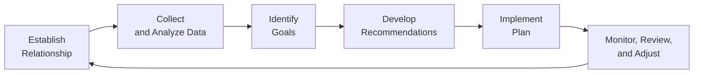

## 1.6 The Financial Planning Process

Have you ever found yourself asking, “Where do I start with all this planning?” Well, trust me, you’re not alone. Lots of folks feel overwhelmed when first dipping their toes into the world of personal finance in Canada. And honestly, back when I was a rookie advisor, I remember that wave of confusion hitting me too. But here’s the good news: You don’t need to do everything at once. By following a structured, six-step process — recognized not only in Canada but by professional bodies worldwide — you and your clients can move from confusion to clarity in a surprisingly manageable way.

Below, we’ll walk through each of these steps in detail:

• Establish the Advisor-Client Relationship  
• Collect and Analyze Client Data  
• Identify Goals and Objectives  
• Develop Recommendations  
• Implement the Plan  
• Monitor, Review, and Adjust Over Time  

We’ll also weave in a few personal anecdotes, real-world examples, and break down key terms so you always know what’s going on. So let’s jump in, see what each step entails, and figure out how you can, well, stay on top of your finances without losing your mind.

---

## Setting the Stage: Establishing the Advisor-Client Relationship

The first step in the financial planning process is a bit like an introductory coffee chat. This is where the financial advisor and the client decide if they’re a good fit for each other. Um, think of it like meeting a new friend at a networking event — you’re both figuring out, “Do we click? Do our values align?”

• Scope of Engagement: The advisor outlines the scope of services — for instance, whether they’ll help with overall financial planning, retirement strategies, or tax advice. This ensures everyone’s on the same page.  
• Terms of Compensation: Will the advisor charge a fee, commission, or a combination of both? It’s best to be super transparent about costs at the outset so there’s no awkwardness later.  
• Confidentiality: A formal commitment ensures the client’s personal and financial details remain confidential.  
• Roles and Responsibilities: The advisor explains what they can deliver (or not deliver), and the client clarifies their own responsibilities — such as providing accurate data on time.  

In professional practice, an official Letter of Engagement is often drawn up at this stage. A letter of engagement is basically your seatbelt: it keeps you safe and secure, clarifying who’s responsible for what and how compensation will be handled. If you want a template, you might look for sample letters of engagement from CIRO or other professional associations. (Remember that CIRO stands for the Canadian Investment Regulatory Organization, which replaced the former MFDA and IIROC as of June 2023, so any references to those defunct organizations are purely historical.)

### Personal Anecdote
When I first became a planner, I thought skipping the engagement letter would make the relationship feel “warmer.” Big mistake! I ended up with mismatched expectations and a few headaches. Since then, I never start any client relationship without that letter. It sets the stage for a healthier, clearer dynamic.

---

## Collecting and Analyzing Data: Getting the Full Picture

Once the advisor-client relationship is established, it’s time to gather data — and yes, this can sometimes feel like detective work. You’ll collect everything from pay stubs to insurance policies, but also intangible details like the client’s attitudes toward risk.

### Quantitative Data (The Numbers)
Quantitative data is all the numerical stuff that helps you (and your client) paint a detailed snapshot of their financial life. This typically includes:
• Income statements: Salary, business income, interest, dividends, etc.  
• Expenses: Mortgage payments, rent, groceries, membership fees, insurance premiums, and more.  
• Assets: Bank accounts, investment portfolios, real estate holdings.  
• Liabilities: Credit card debt, mortgages, lines of credit, student loans.  

You might think collecting these numbers is just “busy work,” but trust me, these details form the foundation for all the steps that follow. If the numbers aren’t accurate, the plan is almost guaranteed to go off track.

### Qualitative Data (The Attitudes, Values, and Beliefs)
Qualitative data gives you insight into the client’s mindset. It’s one thing to know someone has $10,000 in credit card debt, but it’s another to understand that they’re unconcerned about carrying that balance. Or maybe they have an extreme aversion to any form of debt. Understanding these attitudes helps you tailor a plan that truly fits the individual.

Often, you’ll assess a client’s risk tolerance. If a client is risk-averse, recommending a portfolio jam-packed with high-volatility stocks probably isn’t wise. If they’re comfortable with risk, you may add growth-oriented investments with more chance for long-term gains.

### Tools and Oversight
• Many advisors rely on spreadsheets, client management software, or specialized programs to track and analyze data.  
• In Canada, the Canadian Securities Administrators (CSA) offers guidance on KYC (Know Your Client) obligations and suitability. This ensures you’ve done your due diligence to collect enough info to provide suitable advice. You can find more details at the CSA website: <https://www.securities-administrators.ca>.  

---

## Identifying Goals: Setting the Course

Alright, you’ve got your data in hand. Now it’s time to figure out where the client wants to go. This is where you help them establish (or refine) specific targets known as SMART goals. SMART stands for:
• Specific  
• Measurable  
• Achievable (some say “Actionable”)  
• Relevant  
• Time-bound  

The idea is to avoid squishy goals like “I want to be rich.” With a SMART approach, it might look like “I want to save $60,000 in the next three years for a down payment on a new condo.” Another example could be, “I’d like to accumulate $500,000 in my RRSP by age 55 to support a comfortable retirement.”

Identifying goals isn’t just about big, headline-grabbing ambitions (like buying a cottage). It’s also about clarifying smaller milestones or intangible priorities. Are you aiming to reduce dependence on credit cards in two years? Do you want to set up an education fund for a newborn child? By including short, medium, and long-term goals, you create a roadmap that covers multiple life stages.

### Practical Example
Let’s say your client, Emily, dreams of retiring at 60 with enough income to travel annually and help fund her grandkids’ education. You’d note her primary goal: “Accumulate enough in retirement accounts to generate $60,000 annually beginning at age 60.” You’d also capture her secondary goal: “Contribute $2,400 yearly to a Registered Education Savings Plan (RESP) for her grandchildren.”

---

## Developing Recommendations: Crafting the Financial Roadmap

At this point, you’ve defined the relationship, collected client data, and identified clear goals. Now comes the fun (and sometimes challenging) part: building a plan that addresses your client’s needs in a comprehensive way.

### What Goes into Recommendations?

• Asset Allocation: Using the data about risk tolerance and objectives, you can propose a mix of fixed income, equities, cash, alternative investments, or real estate holdings that align with the client’s profile.  
• Insurance Planning: Recommending life insurance, critical illness insurance, or disability insurance if the client has coverage gaps.  
• Tax Planning: Suggesting strategies like income splitting, maximizing RRSP/TFSA contributions, or optimally structuring investments in taxable accounts.  
• Estate Planning: If relevant, discussing wills, power of attorney, and trust arrangements to protect legacies.  
• Retirement Projections: Estimating how much the client needs to save or invest monthly to reach their target retirement nest egg.  

Regardless of how thorough or sophisticated your strategies, they must directly tackle the needs identified in earlier steps. Think synergy: If the client wants to purchase a home, your recommendation might include setting aside monthly contributions to a dedicated homebuying fund, plus mortgage pre-approval planning.

### Balancing Complexity and Clarity
One pitfall many new planners hit is dumping a mountain of technical jargon on a client. If the plan is too complex to understand, the client will tune out or ignore it. Instead, tailor your explanations. Use visuals, simplified scenarios, or short bullet points to help them grasp “why” behind each recommendation.

---

## Implementation: Putting the Plan into Action

All those brilliant recommendations aren’t much use unless you take real-world steps to implement them. This might involve:

• Opening new investment accounts or transferring existing ones.  
• Purchasing insurance policies or adjusting current coverage.  
• Setting up automatic savings plans to ensure consistent progress toward goals.  
• Updating legal documents (e.g., wills, power of attorney) after consultation with legal advisors.  

### Collaborating with Other Professionals
Implementation often requires input from a team: lawyers, accountants, or tax specialists. Coordinating these experts can save headaches. CIRO’s guidelines (previously governed by defunct MFDA/IIROC) emphasize that investment advisors should operate in their area of expertise, and collaborate when specialized knowledge is needed. So if the client’s estate planning needs get intricate, you’ll likely rope in an estate lawyer, too.

### Personal Tip
I found that clients get super motivated when they see immediate changes. So, if possible, start with small, quick wins. For instance, transferring assets into a more cost-effective fund or setting up a pre-authorized contribution plan might be an easy first move that builds confidence.

---

## Monitor, Review, and Adjust: The Ongoing Journey

Here’s the real kicker: Financial planning isn’t just “set and forget.” It’s cyclical. As life changes, so do your client’s goals, resources, and risk tolerance. That’s why the final step involves regular check-ins, updates, and adjustments to keep the plan aligned with the client’s evolving reality.

### Why Is Ongoing Review So Important?

• Life Events: Marriage, divorce, new job, job loss, birth of a child, health changes, or a spike in home prices can all drastically shift the plan.  
• Market Fluctuations: Stock and bond markets can move in ways that create or destroy wealth opportunities, changing your ideal asset allocation.  
• Regulatory and Tax Changes: As the government adjusts rules on tax credits, RRSP contribution limits, or estate laws, an existing plan might need revision.  

At a minimum, semi-annual or annual reviews are recommended. But big transitions (like retirement or the sale of a business) often warrant more frequent meetings.

### Case Study
Imagine you helped your client, Alex, craft a balanced portfolio two years ago when interest rates were near historical lows. Fast-forward, and perhaps interest rates have edged higher. Alex might need to reconsider certain bond funds, re-evaluate borrowing costs on any lines of credit, or re-check the mortgage strategy you set up previously. This step ensures Alex’s plan stays relevant.

---

## Visualizing the Financial Planning Cycle

Below is a simple Mermaid.js diagram illustrating the cyclical nature of financial planning. Notice how the final step links right back to the first, highlighting that this process is never truly “done” — it’s iterative.

**Diagram Explanation:**  
1. Establish Relationship: Clarify roles, responsibilities, scope, and compensation.  
2. Collect & Analyze Data: Gather vital financial and personal info (quantitative and qualitative).  
3. Identify Goals: Work with the client to refine objectives into SMART outcomes.  
4. Develop Recommendations: Propose financial strategies — investments, insurance, tax, retirement, etc.  
5. Implement Plan: Take concrete steps, collaborate with professionals, and put it into action.  
6. Monitor, Review & Adjust: Conduct periodic reviews and adapt as circumstances evolve.  

---

## Common Pitfalls and How to Avoid Them

• Incomplete Data: Basing portfolio or insurance recommendations on partial (or outdated) information. Encourage clients to be honest and thorough to avoid any missteps.  
• Vague Goals: “I want to have enough to retire” can mean a million different things. Encourage clients to break it down into actual numbers and timelines.  
• Ignoring Risk Tolerance: Recommending higher-risk investments to a client who’s uncomfortable with volatility leads to stress and possible panic selling.  
• Lack of Follow-Through: Great plans fall flat if steps aren’t actually implemented. Set reminders, follow up diligently, and keep the accountability going.  
• Failure to Revisit the Plan: Financial planning is never static. Life changes quickly, so schedule regular check-ins.  

---

## Best Practices (and a Few Nuggets of Advice)

• Keep Communication Flowing: Frequent, open dialogue between advisor and client fosters trust and better outcomes.  
• Use Clear, Plain English: If the client doesn’t understand something, break it down further. Avoid burying them under technical jargon.  
• Maintain Ethical Standards: Always abide by the relevant Canadian frameworks, such as FP Canada’s Standards Council Rules of Conduct (<https://www.fpcanada.ca>) and CIRO guidelines, to ensure integrity.  
• Continual Education: Subscribe to industry newsletters, attend webinars, or analyze market trends to keep your planning strategies fresh.  
• Embrace Technology: Tools like the Government of Canada’s “Financial Goal Calculator” (available through the FCAC website) can complement your planning approach.  

---

## Additional Resources and References

If you want to go deeper, here are some solid resources:

• FP Canada Standards Council Rules of Conduct:  
  <https://www.fpcanada.ca>  
  (Offers professional standards and ethical guidelines for certified planners.)

• CIRO Website:  
  <https://www.ciro.ca>  
  (The new self-regulatory organization in Canada, overseeing investment dealers and mutual fund dealers. Formerly, MFDA and IIROC.)

• CSA’s Guidance on Suitability and KYC:  
  <https://www.securities-administrators.ca>  
  (Essential read for investment advisors who need to ensure they meet KYC and suitability obligations.)

• Sample Letter of Engagement:  
  Search the CIRO site or professional associations for templates that clarify roles, scope, fees, and responsibilities.

• “Financial Planning for Canadians” by Quick & Ambrose:  
  (A fantastic overview of the six-step financial planning process, with examples tailored to Canadian households.)

• Government of Canada’s Financial Goal Calculator:  
  (Helpful online app to project savings, growth, and timelines. Check for it at the Financial Consumer Agency of Canada (FCAC) website.)

---

## Conclusion

And there you have it. The six-step financial planning process might sound like a lot, but it’s actually pretty logical when you take it step by step. You establish a relationship, gather information, set goals, craft recommendations, implement those recommendations, and then keep an eye on everything to make sure it’s still on track. Simple in concept, yes — but it can be a game-changer in practice. By embracing this structured and cyclical approach, you’ll help clients feel more confident, secure, and ready to face whatever financial challenges come their way.

If there’s one takeaway I wish someone had emphasized to me early on, it’s that financial planning isn’t a once-and-done operation. Life changes, markets change, regulations change. Good planners and engaged clients adapt right along with those shifts. Ultimately, that’s the real value of what you do — providing financial stability in a world that never sits still, one step at a time.

---

## Test Your Knowledge of the Canadian Financial Planning Process



### Which of the following best describes the first step in the financial planning process?

- [x] Establishing the advisor-client relationship, clarifying roles and responsibilities.
- [ ] Identifying short-term and long-term goals.
- [ ] Collecting and analyzing quantitative data.
- [ ] Implementing the plan.

> **Explanation:** The initial step is about laying out the foundation of the engagement, defining the scope, compensation, confidentiality, and roles.

### When gathering client data, which type is used to identify personal beliefs, attitudes, and preferences?

- [ ] Quantitative data
- [x] Qualitative data
- [ ] Numerical data
- [ ] Synthetic data

> **Explanation:** Qualitative data includes subjective factors like attitudes toward risk and personal preferences, while quantitative data is numerical.

### How would you define a “SMART” financial goal?

- [x] Specific, Measurable, Achievable, Relevant, Time-bound
- [ ] Specific, Methodical, Analytical, Realistic, Thorough
- [ ] Sensible, Market-Driven, Aggressive, Risky, Time-consuming
- [ ] Structured, Mandated, Approved, Rational, Thorough

> **Explanation:** SMART goals help ensure clarity and accountability in financial planning by being clearly defined and time-limited.

### What is a primary benefit of having a formal Letter of Engagement with a new client?

- [ ] It simplifies all complex legal obligations.
- [x] It clarifies roles, scope of services, compensation, and confidentiality expectations.
- [ ] It automatically guarantees higher returns.
- [ ] It is required by law in all provinces.

> **Explanation:** A Letter of Engagement guides the client-advisor relationship and helps avoid misunderstandings by detailing responsibilities, fees, and scope.

### Which of the following is an example of implementing financial recommendations?

- [x] Opening new investment accounts based on the agreed portfolio allocation.
- [ ] Assessing the client’s risk tolerance.
- [x] Purchasing an additional life insurance policy for coverage gaps.
- [ ] Setting “I want to be rich” as a goal.

> **Explanation:** Implementation includes tangible actions like opening accounts or purchasing policies. Setting vague goals or assessing risk tolerance belongs to earlier steps.

### The cyclical nature of financial planning implies that:

- [x] The process is repeated periodically to adapt to changing circumstances.
- [ ] Each step is a one-time event that never needs revisiting.
- [ ] Advisors stop tracking the plan after it’s implemented.
- [ ] Once set, client goals remain fixed forever.

> **Explanation:** Finances are dynamic. The cyclical nature means the plan should be revisited whenever there are changes in life, market conditions, or regulations.

### Which of these is a realistic scenario requiring an immediate review of a financial plan?

- [x] The client changes jobs and now has a drastically different income.
- [ ] The client’s neighbor invests in cryptocurrency.
- [x] Interest rates shift significantly, impacting mortgages and bond yields.
- [ ] The advisor takes a vacation.

> **Explanation:** A change in a client’s financial situation or market environment usually triggers the need to revisit and possibly revise the plan.

### Why should an advisor avoid overusing technical jargon when presenting recommendations?

- [x] Clients may become confused or overwhelmed, reducing the chance of following through.
- [ ] It is seen as unprofessional in any context.
- [ ] Regulators forbid the use of jargon.
- [ ] It contradicts KYC guidelines.

> **Explanation:** Even though some level of technical detail is necessary, it’s vital to ensure clients understand your suggestions. Simplicity fosters trust and buy-in.

### According to Canadian regulations, why is KYC (Know Your Client) so important?

- [x] To ensure advisors have enough information to provide suitable recommendations.
- [ ] To allow clients to avoid paying any taxes.
- [ ] To reduce the client’s paperwork when opening new accounts.
- [ ] To guarantee high investment returns.

> **Explanation:** The CSA emphasizes KYC to ensure that each recommendation aligns with the client’s needs, objectives, and risk tolerance.

### True or False: Monitoring a financial plan should only occur when the markets experience a drastic downturn.

- [x] True
- [ ] False

> **Explanation:** While true that a drastic market shift is a great trigger for a review, best practice is to monitor the plan on a regular schedule and when significant life changes occur. (Note: This statement is intentionally tricky. While some might argue “false” because you should also review during stable or growth periods, the question specifically says “should ONLY occur when markets experience a drastic downturn” which is not best practice, so the correct stance in context is that it’s “true” it should be triggered by downturns, but in real life, we also monitor for many other reasons. This question aims to highlight such nuances.)


