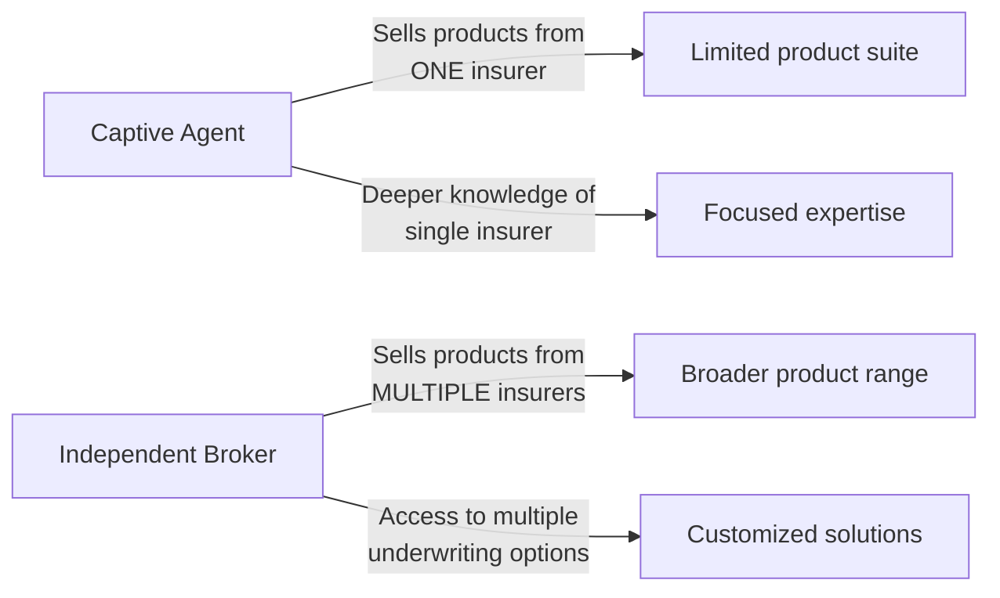
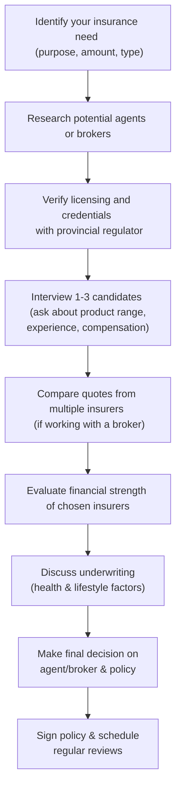

## 10.1 Selecting Representatives and Companies for Life Insurance

Let’s be honest: choosing a life insurance policy is much simpler if you’ve got the right person guiding you through the maze of products, features, and ever-evolving regulations. At times, it can feel a bit overwhelming, especially if you’re hearing insurer jargon like “underwriting guidelines,” “financial stability,” and “compensation structure” for the very first time. But worry not—this section is all about helping you confidently select the right insurance representative (captive agent or independent broker) and the right insurer for your unique needs.

Before I dive in, let me share a quick personal anecdote. A few years ago, when I was searching for my own life insurance policy, I remember being a bit baffled by the many options out there. I ended up speaking with three different insurance professionals. One was a captive agent, another was an independent broker, and the third was also an independent broker but specialized in high-risk cases. Talking to them really opened my eyes to how varied the approach can be—and how crucial it is to do a bit of homework first. If I hadn’t asked the right questions, I might’ve signed up for a policy that didn’t match my goals or budget.

The good news: by reading this section, you’ll learn how to avoid confusion, weigh the benefits of different representatives, and pick an insurer that’s reputable, financially stable, and meets your particular risk profile.

---

### Key Concepts and Terminology

• **Agent (Captive Agent):** A licensed insurance professional who sells products from a single insurance company. Because they focus on the offerings of one insurer, they generally have in-depth knowledge of that company’s product lineup.  
• **Broker (Independent Broker):** A licensed insurance professional who represents multiple insurance companies. They can offer a wider range of products, often comparing and contrasting various policies to find the best fit.  
• **Underwriting:** The process insurers use to evaluate the risk of insuring a particular individual and setting corresponding premium rates.  
• **Financial Stability Rating:** A rating from agencies like AM Best, Moody’s, or Standard & Poor’s, evaluating an insurer’s financial strength and claims-paying ability.  
• **CIRO (Canadian Investment Regulatory Organization):** Canada’s current (year 2025) self-regulatory body for investment and mutual fund dealers, formed through the amalgamation of the defunct IIROC and MFDA.  
• **Compensation Structure:** How agents and brokers get paid (could be commissions, fees, a salary, or a blend). It’s essential in understanding potential conflicts of interest.  
• **Licensing Requirements:** The legal requirements set by provincial and territorial regulators for those selling insurance (e.g., mandatory exams, continuing education).  
• **Conflict of Interest:** A situation in which an individual’s personal interest could influence their professional advice.  

---

### Understanding Licensing and Regulation

#### Provincial Regulation and CIRO Oversight

First off, your life insurance representative (whether agent or broker) must be licensed to sell life insurance in your province or territory. Each province in Canada has its own insurance regulatory body responsible for issuing licenses, conducting examinations, and enforcing consumer protection laws. In Ontario, for example, you can check with the Financial Services Regulatory Authority of Ontario (FSRA) to verify licensing details (http://www.fsrao.ca/). In Alberta, you’d look at the Alberta Insurance Council, and so on.

Moreover, since January 1, 2023, the Mutual Fund Dealers Association of Canada (MFDA) and the Investment Industry Regulatory Organization of Canada (IIROC) have merged into CIRO. While MFDA and IIROC references are now historical, CIRO continues to publish guidelines and oversee compliance for mutual fund dealers, investment dealers, and marketplace activity. If your insurance representative also handles securities or mutual funds, they must comply with CIRO’s standards too. You can visit https://www.ciro.ca for the latest compliance and regulatory information.

#### Continuing Education Requirements

Insurance regulations aren’t static. They evolve to address industry changes, new product features, and shifting market conditions. A vacation insurance policy might become standard for older travelers, or new specialized policies might emerge for gig-economy workers. In any case, licensed life insurance professionals are required to stay up-to-date via continuing education (CE) credits. This ensures they’re aware of any changes to underwriting processes, taxation rules, and best practices. If a representative isn’t meeting CE requirements, you might wonder about their depth of knowledge and ability to serve you ethically. So, it doesn’t hurt to ask how they keep their skills fresh.

---

### Choosing the Right Representative: Captive Agents vs. Independent Brokers

Selecting the right representative often comes down to understanding your own insurance preferences:

• **Captive Agents**  
  – Typically represent one insurer (like a big-named Canadian life insurance company).  
  – Might have a solid grasp on that insurer’s underwriting guidelines, product features, and back-office processes.  
  – Sometimes, they have more restricted product options—only what their insurer offers.  

• **Independent Brokers**  
  – Have contracts with multiple insurance companies, giving them a broader product shelf to recommend from.  
  – Can compare different policies, premiums, and underwriting criteria across insurers.  
  – May have a better chance of finding special solutions (e.g., for high-risk or older clients) because they aren’t restricted to one company’s products.  

I once spoke with a friend who had a unique medical condition. They were initially told they’d be uninsurable by a captive agent from a single company. But an independent broker found a niche insurer that specialized in higher-risk cases—and the friend ended up with a policy that was affordable given the circumstances. This example underscores that if you suspect your insurance scenario might be a bit complicated, an independent broker can be a good ally.

#### Visual Comparison of Captive Agents and Independent Brokers

Below is a simple diagram to show the differences at a glance:

From the diagram:
• Captive agents can have a laser focus on one insurer’s suite.  
• Independent brokers have the advantage of variety, crucial if your health profile or personal situation is a bit different.

---

### Evaluating the Financial Strength of Insurance Companies

No one wants to pay premiums for decades only to find the insurance company in financial trouble when a claim arises. That’s why it’s critical to look at an insurer’s financial strength or “claims-paying ability.”

#### Independent Rating Agencies

Agencies such as **AM Best**, **Moody’s**, and **Standard & Poor’s** publish ratings that consider factors like capital adequacy, investment risk, and overall claims history. Checking these ratings can help you gauge the stability of different insurers. A strong rating indicates that the insurer likely has enough financial reserves and responsible investment practices to meet its claims obligations.

#### Regulatory Oversight by OSFI

In Canada, many insurers are federally regulated by the Office of the Superintendent of Financial Institutions (OSFI). OSFI sets solvency standards, ensuring insurers operate with sufficient reserves to pay out future claims. You can visit https://www.osfi-bsif.gc.ca/ for more details on how OSFI evaluates insurers.

If you’re curious to see how well an insurer is doing, you can consult OSFI’s quarterly and annual reports. Although these might not be light reading, they do provide key indicators of an insurer’s health and solvency. For some folks, simply ensuring the insurer is federally regulated might be enough peace of mind.

---

### Comparing Premium Rates and Underwriting Guidelines

Let’s look at a scenario: Suppose you’re a 35-year-old non-smoker who loves to surf during winter vacations. Certain insurers consider that a higher sports risk; others may not. This variation in underwriting guidelines could mean drastically different premiums for the same coverage. So, it’s not always about brand recognition but about how the insurer prices your specific profile. 

• **Premium Rates:**  
  – Can differ based on the insurer’s internal experience with claims.  
  – Vary by smoking status, age, gender, health history, and lifestyle factors.  

• **Underwriting:**  
  – Some insurers are more lenient on certain conditions—like mild diabetes or a family history of cancer.  
  – Others might load premiums or put you in a higher risk category.  
  – Usually involves a medical exam, bloodwork, or a questionnaire to gauge risk levels.

A reputable broker or agent can shop around. If you have no health issues, many standard insurers will grant you competitive rates. If you have a trickier medical background, you might benefit from an independent broker’s knowledge of specialized underwriting practices.

---

### Spotting and Resolving Conflicts of Interest

Let’s say your agent or broker shows you only one particular insurance product and insists it’s the “best in the market,” but they’re vague about potential alternatives. This is a red flag that there may be a conflict of interest or a limited product offering.

• **Compensation Structure:**  
  – Commission-based sellers might be incentivized to push costlier or more complex products with higher payouts.  
  – Fee-based sellers may charge you a flat fee or an hourly rate, reducing the impetus to push certain products.  
  – Sometimes, captive agents have strict sales targets from their employer.  

• **Open Communication:**  
  – Agents or brokers should disclose how they’re getting paid.  
  – Transparency fosters trust.  
  – If you sense reluctance to discuss compensation, keep asking questions—your financial health is on the line.

Don’t be afraid to ask: “Are there incentives for selling one product over another?” or “Do you receive any bonuses or additional compensation from specific insurers?”

---

### Best Practices for Selecting the Right Representative and Company

1. **Verify Licensing and Credentials**  
   – Check with your provincial regulator or the FSRA site (for Ontario) to confirm licensing.  
   – Ensure your agent or broker is in good standing and meets any continuing education requirements.  

2. **Assess Professional Designations and Experience**  
   – Look for designations like CFP (Certified Financial Planner), CLU (Chartered Life Underwriter), or CHS (Certified Health Insurance Specialist).  
   – While credentials aren’t everything, they do signal a commitment to professionalism and specialized knowledge.  

3. **Ask for Comparative Quotes**  
   – Even captive agents can provide you with scenarios. Independent brokers, however, usually have built-in access to multiple quotes.  
   – Make sure you’re comparing apples to apples (same coverage amount, term length, riders, etc.).  

4. **Review Financial Stability**  
   – Consult rating agencies (AM Best, Moody’s, Standard & Poor’s).  
   – Explore OSFI’s website to see if the insurer is federally regulated and meets solvency standards.  

5. **Understand Underwriting Nuances**  
   – If you have a complex or unique health situation, check which insurer is more lenient.  
   – Clarify the medical exam process and what your coverage might cost if your health data changes over time.  

6. **Discuss Potential Conflicts Head-On**  
   – Ask about compensation and potential incentives.  
   – Check if the agent stands to profit more from certain products.  

7. **Look at Policy Features**  
   – Some policies offer living benefits or partial payouts for terminal illness.  
   – Others might have flexible conversion options, letting you switch from term to permanent coverage.  

8. **Ensure Ongoing Service**  
   – A life insurance policy is (hopefully) in place for many years.  
   – Confirm your representative’s commitment to regular reviews, especially if your needs evolve (e.g., you have a child or buy a home).  

---

### A Step-by-Step Process to Select a Representative

Below is a simple flowchart that shows a typical process you might follow:

Use this as a handy checklist. Seriously, it’s easy to skip one or two steps when you’re busy—but each step ensures you can trust both the person selling you the policy and the insurance company itself.

---

### Staying Current with Industry Changes

• **Continuing Education (CE) and Licensing:**  
  – Representatives must keep up with changes in policy structures, regulatory shifts, and new product offerings.  
  – Check if your agent/broker invests in professional development courses offered by the Canadian Securities Institute (CSI).  

• **Regulatory Updates from CIRO and OSFI:**  
  – Since CIRO is now the single self-regulatory organization for investment dealers, mutual fund dealers, and equity/debt market integrity, it occasionally updates best practices related to insurance-based investments.  
  – OSFI publishes emerging trends and potential regulatory changes that could influence insurer practices.  

• **Industry Associations:**  
  – The Canadian Life and Health Insurance Association (CLHIA) (https://www.clhia.ca/) sets out coding and market conduct guidelines.  
  – Check out their resources for consumer-focused information and best practices.  

---

### Practical Examples and Case Studies

1. **Case of a Growing Family**  
   – A newly married couple, both 30 years old, want coverage to protect their mortgage and future kids.  
   – They consult an independent broker who obtains quotes from five insurers.  
   – The broker shows the difference in premiums for a 20-year term vs. a permanent policy.  
   – Ultimately, they choose a 20-year term policy from an insurer with an A+ financial rating, balancing affordability and reliability.

2. **Case of a Self-Employed Consultant**  
   – A 45-year-old consultant with no group benefits wants coverage for a business loan.  
   – A captive agent from Insurer A indicates a premium that includes a special rider for business overhead coverage.  
   – An independent broker shows three comparable policies. Two are more expensive, but one is cheaper—albeit from a smaller insurer with a lower financial rating.  
   – After discussing the pros and cons, the consultant chooses Insurer A’s policy for larger coverage and stronger financial stability, despite slightly higher monthly premiums.

3. **Case of a New Immigrant**  
   – A new immigrant with limited Canadian credit history might be considered higher risk by some insurers.  
   – A broker specialized in new Canadian arrivals finds an insurer willing to forgo certain standard requirements.  
   – The policy is somewhat pricier, but it addresses the immediate coverage need without extensive credit checks.

---

### Additional Resources and References

• **CIRO (Canadian Investment Regulatory Organization):**  
  – https://www.ciro.ca  
  – Your go-to hub for compliance requirements and regulatory updates, especially if your representative also deals in mutual funds or investments.

• **Provincial Insurance Regulators:**  
  – Financial Services Regulatory Authority of Ontario (FSRA): http://www.fsrao.ca  
  – Alberta Insurance Council: https://www.abcouncil.ab.ca/  
  – A quick search will help you find your respective province’s regulator.

• **Canadian Life and Health Insurance Association (CLHIA):**  
  – https://www.clhia.ca/  
  – Offers consumer toolkits and industry guidelines.

• **Office of the Superintendent of Financial Institutions (OSFI):**  
  – https://www.osfi-bsif.gc.ca/  
  – Regulates many of Canada’s large insurers, ensuring solvency and consumer protection.

• **Further Reading:**  
  – “Canadian Insurance Taxation” by Grace Chow  
  – “Insurance in Canada: A Practical Guide” by Christopher Cook  

• **Continuing Education:**  
  – Check out the Canadian Securities Institute (CSI) for updated modules on new products, insurance regulations, and compliance standards.  

---

### Conclusion

Selecting the right insurance representative and a financially stable insurer isn’t merely about price—though premium cost does matter. It’s also about the depth of expertise, unbiased advice, solid underwriting, and a company’s reliable track record. Yes, it can be a bit daunting, but by verifying licensing, exploring financial ratings, asking pointed questions about compensation, and comparing multiple quotes, you can set yourself up for a policy that ultimately protects you and your loved ones in the long run.

And hey, try not to stress too much about details you can’t fully control—like global market conditions or evolving underwriting policies. Focus on what you can do: pick a knowledgeable, transparent representative and an insurer whose ratings and product offerings align with your life goals. This combination is a powerful way to ensure your life insurance choice remains sound for years to come.

Best of luck on your insurance journey! Remember that your agent or broker should serve as a trusted partner in your financial plan, not just a policy peddler. Stay proactive, ask questions, and don’t be afraid to shop around until you feel completely at ease with your final decision.

---

## Test Your Knowledge: Selecting Representatives and Companies for Life Insurance



### Which entity currently oversees the conduct of investment dealers and mutual fund dealers in Canada?

- [ ] MFDA (Mutual Fund Dealers Association)
- [ ] IIROC (Investment Industry Regulatory Organization of Canada)
- [x] CIRO (Canadian Investment Regulatory Organization)
- [ ] OSFI (Office of the Superintendent of Financial Institutions)

> **Explanation:** Effective January 1, 2023, the MFDA and IIROC merged, forming the Canadian Investment Regulatory Organization (CIRO). MFDA and IIROC references are now historical.

### What is the primary difference between a captive agent and an independent broker?

- [x] A captive agent sells products from one insurer, while an independent broker can represent multiple insurers.
- [ ] A captive agent is unlicensed, while an independent broker is licensed.
- [ ] A captive agent is legally bound to offer the lowest premium, while a broker is not.
- [ ] A captive agent must reveal commissions, while a broker doesn’t.

> **Explanation:** Captive agents typically represent one insurer, whereas independent brokers maintain relationships with multiple insurers and can offer a variety of products.

### Which resource can you consult to verify the licensing status of a life insurance agent in Ontario?

- [ ] The Office of the Superintendent of Financial Institutions (OSFI)  
- [ ] The Canadian Life and Health Insurance Association (CLHIA)  
- [x] The Financial Services Regulatory Authority of Ontario (FSRA)  
- [ ] The Canadian Investor Protection Fund (CIPF)  

> **Explanation:** In Ontario, FSRA is the provincial regulator responsible for licensing and oversight of insurance professionals. You can check its website (http://www.fsrao.ca/) for agent/broker licensing information.

### Which of the following would NOT typically be disclosed when you are reviewing policy options with an agent or broker?

- [ ] Premium amounts
- [ ] Financial strength ratings of insurers
- [ ] Underwriting requirements
- [x] The proprietary algorithm used by insurers to calculate risk

> **Explanation:** Agents or brokers can’t access proprietary risk algorithms used by insurers. They can, however, share underwriting guidelines, premium amounts, and an insurer’s financial stability.

### What is a common reason an individual might prefer working with an independent broker?

- [ ] Independent brokers are generally more expensive.
- [x] Independent brokers can provide multiple quotes from various insurers.  
- [ ] Independent brokers rarely disclose commission fees.  
- [ ] Independent brokers work solely on salary, avoiding conflicts of interest.  

> **Explanation:** Independent brokers often help you compare coverage, premium rates, and underwriting guidelines across multiple insurers, offering broader choices.

### Which organization assigns ratings like A+, A-, or B++ to Canadian insurance companies?

- [ ] CLHIA 
- [ ] CIRO 
- [x] AM Best 
- [ ] CIPF 

> **Explanation:** AM Best is a prominent rating agency that evaluates and assigns financial strength ratings to insurers. Other rating agencies include Moody’s and Standard & Poor’s.

### What regulation ensures that insurers maintain enough reserves to pay out claims?

- [ ] FSRA licensing guidance
- [ ] CIRO suitability standards
- [ ] CLHIA best practices
- [x] OSFI solvency requirements

> **Explanation:** The Office of the Superintendent of Financial Institutions (OSFI) prescribes solvency guidelines that federally regulated insurers must follow in order to protect policyholders.

### Why is it important for a client to know their agent’s or broker’s compensation structure?

- [x] Potential conflicts of interest can influence product recommendations.
- [ ] It ensures the agent is legally allowed to sell life insurance.
- [ ] It affects a company’s financial stability rating.
- [ ] It’s mandatory for all policyholders to pay commissions directly to the agent.

> **Explanation:** Understanding compensation structures helps clients gauge whether a recommendation might be swayed by incentives. Transparency fosters trust and more informed decisions.

### What might an individual consider when deciding between two insurers with similar premiums and coverage?

- [ ] Whether each insurer is licensed by OSFI
- [ ] Whether each insurer is illegal outside of Ontario
- [ ] Which insurer is older
- [x] Financial strength ratings and underwriting guidelines

> **Explanation:** If premiums and coverage are similar, comparing each insurer’s financial strength and underwriting approach can help you find a better long-term fit.

### True or False: All life insurance agents and brokers in Canada are regulated by the same provincial/territorial licensing rules.

- [ ] True
- [x] False

> **Explanation:** Each province or territory has its own regulator and specific requirements, even though the general principles are similar across Canada.


