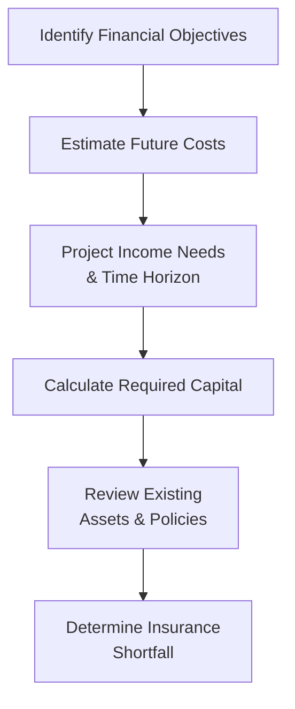

## 10.2 Conducting a Life Insurance Needs Analysis

Life insurance can seem, well, a little intimidating at first. I remember back when I was just starting out in financial planning—someone casually mentioned “capital needs analysis” and I thought: “Oh boy, that sounds technical!” But trust me, once you grasp the essential ideas, it’s actually pretty logical (and dare I say, fun?) to see how life insurance can truly protect a family’s financial well-being. Let’s walk step by step through how to figure out precisely how much life insurance coverage someone might need—considering everything from covering mortgage payments to making sure dependants get a fair shake at future education.

Life insurance needs analysis is essentially a methodical way to determine the proper coverage. By systematically adding up goals (like income replacement or debt repayment) and then subtracting resources (savings, investments, existing policies), you come out with the approximate amount of extra coverage your client—or, let’s say, you—should consider. What follows will help you build a clear plan to guide your clients toward a suitable figure, aligning with their goals and the reality of their financial situation.

---

### Why Do a Life Insurance Needs Analysis?

Before we dive into the details, let’s clarify why this exercise is so important. Having the “perfect” life insurance coverage is like wearing that custom-tailored jacket: it’s cut just right, so you’re neither swimming in extra fabric nor left with something too tight and uncomfortable. Over-coverage means paying extra premiums with diminishing returns on peace of mind, whereas under-insurance can lead to big problems for loved ones if the worst-case scenario occurs.

For instance, imagine a young parent with two small kids. They want to ensure that if something happens to them, the mortgage on the family home is paid off, the children’s education is funded, and daily living expenses are covered so the other parent doesn’t struggle financially. Meanwhile, a business owner might want coverage to protect the company from losing a key person. Different goals, different needs—same principle of systematically figuring out how much coverage is appropriate.

---

### Main Objectives of Life Insurance

Although each client’s situation is unique, there are common life insurance objectives that pop up frequently:

• Income Replacement for Dependants  
• Debt Repayment (Mortgage, Loans, Credit Lines)  
• Final Expenses (Funeral Costs, Estate Settlement)  
• Funding Education for Children or Other Dependants  
• Business Continuity Plans (e.g., Buy-Sell Agreements, Key Person Insurance)

Let’s break them down a little.

#### Income Replacement 
Income replacement is the big one. If the family’s primary breadwinner dies, the survivors often need a lump sum that can generate sufficient annual income (after taxes and inflation) to pay the bills, put food on the table, and maintain their lifestyle. For instance, a spouse or partner with young children might need substantially more coverage than, say, a retiree whose mortgage is paid off and whose children are grown.

#### Debt Repayment
Many people carry a mortgage, a car loan, or even lines of credit. The sudden loss of an income can make it impossible for survivors to keep up with loan payments. By factoring in total debt balances, the insurance coverage can be set high enough to eliminate or drastically reduce debts so that survivors aren’t burdened with overwhelming monthly payments.

#### Final Expenses
In Canada, funeral costs can easily run into the tens of thousands of dollars. Plus, you might need to factor in probate or estate settlement expenses. Although these costs aren’t typically near a mortgage’s size, it’s still wise to include them so the estate can be settled smoothly. Nothing says “financial headache” like inadequate funds for final arrangements.

#### Funding Education
If you have clients whose children are in grade school, or even approaching college, they typically want coverage that helps ensure the kids’ education is not derailed by losing a parent prematurely. The coverage might be enough to pay for future university tuition or vocational programs. Remember to account for those potential cost increases over time since higher education tends to rise in cost year after year.

#### Business Continuity
For entrepreneurs or business owners, a life insurance policy can fund a buy-sell agreement so the surviving partners can buy the deceased owner’s share. Or it might cover losses if a key person—someone whose skills, contacts, or vision are integral—passes away. These situations can be more complex but rely on the same fundamental principle: quantifying the financial impact of a potential loss and insuring against it.

---

### The Capital Needs Analysis Method

When it comes to “how much coverage do I need?” the capital needs analysis stands out as a well-structured approach. Essentially, it asks: “How big a lump sum do we need, right now, to cover all future financial needs?”

In practice, it helps to visualize this in steps, so here’s a simple Mermaid diagram showing the general flow:

1. Identify Financial Objectives: For example, is the main driver providing replacement income? Funding a child’s education? Paying off a mortgage? Possibly all of these?  
2. Estimate Future Costs: Consider inflation, potential changes in lifestyle, and any anticipated large expenses.  
3. Project Income Needs & Time Horizon: For how many years will the clients need that income? For younger dependants, that timeline might stretch two decades or more.  
4. Calculate Required Capital: Determine what lump sum is required. You might use various assumptions about return on investment, inflation, and so on to find a principal that, when invested, meets the annual needs.  
5. Review Existing Assets & Policies: Check whether they have an inheritance, existing group life insurance coverage through an employer, or spousal RRSP accounts that can offset part of the needed sum.  
6. Determine Insurance Shortfall: Subtract the total available resources from the required total. The difference is the approximate coverage shortfall.

For a quick example, let’s say a widow needs $40,000 annually to maintain her family’s lifestyle. If we assume a 4% after-tax, after-inflation return, the capital to generate that $40,000 is $1,000,000 (because $40,000 is 4% of $1M). If she already has $300,000 in savings and another $200,000 in group life insurance coverage, you subtract that combined $500,000 from the $1M figure, leaving a $500,000 shortfall. Of course, you’d also want to factor in final expenses, mortgage debts, and so forth, but the formula remains the same.

---

### Reviewing Current Assets

No one wants to pay for coverage they don’t actually need. That’s why it’s critical to do a thorough check of a client’s financial picture:

• Investments (RRSPs, TFSAs, Non-Registered Accounts)  
• Employer-Sponsored Plans (Group RRSP, Pension)  
• Government Benefits (CPP/QPP death benefits, OAS survivor benefits)  
• Existing Life Insurance Policies (Individual and Group)

I have to share a small anecdote: I once worked with a couple who realized they both had a decent amount of coverage provided by their employers—enough to cover small debts and final expenses. What they needed was a top-up for child education funding. By delving into their existing benefits, we saved them the cost of duplicating coverage, and they were thrilled to redirect that extra money toward something else (a needed renovation, in that case).

---

### Adjusting for Changes in Life Circumstances

Life is dynamic. Major life events—like getting married, welcoming a baby, starting a business, or going through a divorce—drastically alter your financial needs. Therefore, we recommend revisiting a needs analysis every few years or whenever there’s a significant shift in lifestyle or responsibilities. For instance:

• Marriage: Your finances become more interdependent. You may want to ensure your new spouse is protected from your share of the mortgage or other debts.  
• Birth of a Child: This increases the length of time you need income replacement. You might also add a future education fund to your coverage.  
• Divorce: You might have to recalculate coverage that accounts for child support obligations, spousal support (if applicable), and a new daily-living budget.  
• Retirement: Debt might be almost paid off, and your children may be independent, so your coverage needs might significantly diminish—or shift toward estate-tax coverage.  
• Business Expansion: If you’re scaling your business, you might need key person insurance or to revise your buy-sell agreement numbers so the coverage is still adequate.

---

### Tax Implications and Estate Planning Considerations

Life insurance often plays a vital role in estate planning. When the death benefit is paid out, it’s generally received tax-free by the beneficiaries (assuming the policy meets Canadian tax rules). This tax-free lump sum can:

• Offset estate taxes or final tax liabilities, keeping the estate intact.  
• Provide immediate liquidity for covering probate fees and other settlement expenses.  
• Facilitate wealth transfer strategies, especially in cases where you want to pass on assets to your heirs without saddling them with huge bills.

From a business perspective, buy-sell agreements and key person insurance can help ensure continuity and proper funding for corporate share buyouts or bridging any financial shortfall caused by the death of a vital employee. Ideally, these strategies should be integrated as part of a larger financial plan, coordinating with investment, retirement, and estate strategies.

---

### Balancing Insurance with Other Financial Goals

A life insurance needs analysis shouldn’t look at coverage in isolation. Instead, it’s best to see it as a piece of a much bigger puzzle. The idea: if you put too much of your income toward insurance premiums, then your savings, investments, or retirement plans might lag behind. Conversely, if you’re underinsured, your loved ones face risk in a worst-case scenario.

Promoting a holistic financial plan is about synergy: each component—be it an RRSP, TFSA, real estate holdings, or insurance policies—complements the others. For instance, your client might consider a combination of permanent life insurance for estate needs and term insurance for temporary high-needs periods (like paying off a mortgage or covering children’s expenses until they’re grown).

---

### Practical (Hypothetical) Case Study

Let’s walk through a quick scenario—just to bring these ideas to life. Suppose we have Sarah, a 35-year-old single mother with two children, ages 3 and 5. She earns $80,000 a year as a project manager. Her biggest concerns:

• She wants to replace her income until both kids are over 18.  
• She has a $400,000 mortgage remaining on her condo.  
• She’d like to set aside around $50,000 per child for post-secondary studies.  
• She receives some coverage from work: $100,000 of group life insurance.  
• Her personal savings stand around $25,000, and she has no other investments.

So, we calculate:

• Income Replacement: We need about $50,000 a year net of taxes to maintain the household (less than her gross salary, because we assume some reduction in expenses plus spousal/child benefits from government). Over 15 years until her youngest is 18, in present-value terms, that might require a capital sum of about $550,000, assuming a moderate rate of return.  
• Mortgage: She wants that $400,000 gone if she passes away, so her kids have a secure place to live.  
• Education Funding: $50,000 x 2 = $100,000 total.  
• Final Expenses: We’ll allocate $15,000 here.  

The sum of these needs is $1,065,000. Subtract the $100,000 from her group coverage and $25,000 from savings, and she has a shortfall of $940,000. Based on her budget and risk tolerance, she might opt for a combination of a $500,000 term policy for 20 years to cover mortgage and child expenses and a $450,000 policy of permanent insurance for estate liquidity. The specifics will vary by client, but that’s the general approach.

---

### Using Open-Source Tools and Resources

To make the numbers more precise, you can tap into a number of free or paid calculators. Some are offered by Canadian banks, credit unions, or insurers. The Government of Canada website (at [canada.ca](https://www.canada.ca/)) also offers resources for calculating benefits such as CPP/QPP Survivors’ Benefits or OAS amounts. 

You can also check out the “FP Canada™ Projection Assumption Guidelines,” which provide standardized assumptions for inflation, returns, and other variables used frequently in financial planning calculations across Canada. This ensures consistent, transparent, and unbiased calculations.

---

### Canadian Regulatory Environment

As of 2023, CIRO (the Canadian Investment Regulatory Organization) is Canada’s official self-regulatory organization overseeing investment and mutual fund dealers, as well as market integrity. Advisors and dealers must comply with CIRO’s guidelines around best practices for suitability and fair dealing. 

Historically, you may have heard about IIROC or the MFDA, but those have been folded into CIRO. For official updates and professional guidelines, check the CIRO website at [www.ciro.ca](https://www.ciro.ca). Life insurance offerings, meanwhile, continue to be regulated provincially. However, certain national guidelines or best practices can still apply when you’re dealing with life insurance as part of an overall financial plan.

---

### References and Further Study

• The Government of Canada ([canada.ca](https://www.canada.ca/)) – for official references on CPP/QPP, OAS, and potential death benefits.  
• “Life Insurance and Financial Planning in Canada” by Glenn Stephens – an excellent resource.  
• The Canadian Securities Institute ([csi.ca](https://www.csi.ca/)) – offers advanced courses on life insurance planning beyond the scope of this book.  
• FP Canada ([fpcanada.ca](https://www.fpcanada.ca/)) – for information on setting standardized projection assumptions, best practices in financial planning, and further professional designations.  
• Open-Source Financial Tools – Online calculators you can find through your bank or credit union for quick coverage estimates.  

---

### Glossary (Key Terms)

**Needs Analysis (Capital Needs Analysis):** A method used to figure out how much life insurance coverage is required to meet specific objectives in the event of death. It typically tallies potential liabilities (mortgage, final expenses, etc.) and needed income for survivors, then subtracts existing resources (like current assets and insurance).

**Income Replacement:** This is the calculation of how much money is necessary to keep beneficiaries’ lifestyles intact when the policyholder’s salary is no longer available.

**Estate Settlement Costs:** Fees and taxes that arise from finalizing an estate, such as probate fees, executor fees, and last tax returns.

**Buy-Sell Agreement:** A contract between business owners about what happens to a partner’s share of the business if they pass away or become disabled. Life insurance often funds the purchase of the deceased’s share.

**Key Person Insurance:** A policy that covers an employee (or owner) crucial to the success or survival of a business, so the business can maintain operations or find a replacement.

**Inflation:** The rise in prices over time; it reduces purchasing power. Insurance coverage should consider expected inflation, especially when coverage extends over decades.

**Holistic Financial Plan:** A comprehensive plan that integrates all aspects of an individual or family’s finances, including insurance, investments, retirement savings, and estate planning.

---

### Best Practices and Common Pitfalls

• Engage in “what-if” scenarios: This might sound uncomfortable, but actually pretending to live through the scenario of a primary breadwinner’s death (even if just on paper) can reveal real coverage requirements.  
• Don’t ignore existing resources: Overlapping insurance can result in paying for coverage you don’t need. Always do a thorough inventory first.  
• Revisit often: A one-and-done approach to insurance planning might not reflect changing life events. Stay flexible and update coverage as needed.  
• Consider coverage beyond your term: For many Canadians, a blend of term and permanent coverage addresses short-term high needs (like a mortgage) and long-term estate planning goals.  
• Watch out for assumptions: Overly optimistic or pessimistic assumptions on inflation, investment returns, or future expenses can skew results. Use standardized or validated guidelines for your projections.

---

### Wrapping Up

A life insurance needs analysis takes a bit of math, a dash of futurecasting, and some honest conversations about your client’s lifestyle. But the real benefit is peace of mind. You can’t predict the future, but you can set up a strategy that ensures loved ones (or business partners) remain on stable ground financially, even when life throws the worst curveballs.

Balancing insurance with other financial priorities is an art and a science, but with the capital needs approach—and a solid understanding of factors like inflation, existing asset offsets, and business continuity needs—you’ll be well on your way.

So whether you’re a new advisor carefully guiding your first client or a seasoned pro looking to refresh your approach, understanding the nuts and bolts of life insurance needs analysis is integral to providing top-tier advice. After all, protecting families and businesses is at the heart of any holistic financial plan.

---

## Test Your Knowledge: Life Insurance Needs Analysis Essentials



### Which of the following best describes the primary purpose of a life insurance needs analysis?

- [ ] To maximize commission for the insurance agent
- [ ] To comply only with regulatory requirements
- [x] To systematically determine the amount of insurance needed to cover specific goals and obligations
- [ ] To calculate retirement income needs

> **Explanation:** A life insurance needs analysis is about identifying and quantifying coverage needs so that dependants and other financial obligations are adequately protected in the policyholder’s absence.

### Which of the following is generally NOT part of the main objectives of life insurance?

- [ ] Providing income replacement for dependants
- [ ] Paying for final expenses
- [ ] Covering outstanding debt
- [x] Eliminating all monthly living expenses before death

> **Explanation:** Life insurance is aimed at protecting survivors by covering future obligations, not eliminating monthly expenses for the policyholder while they are still alive.

### In the capital needs approach, the lump sum required is determined by:

- [x] Estimating how much capital is needed now to generate sufficient income and pay off financial obligations
- [ ] Forecasting returns on a tax-sheltered growth portfolio with an indefinite time horizon
- [ ] Calculating how long the mortgage will take to pay off at current rates
- [ ] Assessing current monthly savings and ignoring future needs

> **Explanation:** The capital needs approach focuses on identifying a one-time lump sum that, when properly managed, covers future income needs and liabilities.

### How should existing assets and policies be treated in a life insurance needs analysis?

- [ ] They should be ignored since life insurance coverage is independent
- [x] They should be subtracted from the total calculation to avoid over-insurance
- [ ] They should be converted into annuities immediately
- [ ] None of the above

> **Explanation:** It’s important to subtract existing resources—including current savings and existing coverage—to ensure the client isn’t purchasing unnecessary additional insurance.

### Which statement is TRUE concerning inflation in the needs analysis process?

- [x] Inflation reduces purchasing power and should be accounted for in the calculation of future expenses
- [ ] Inflation only matters if the policy is a whole life policy
- [ ] Inflation will always go down to 0% eventually
- [ ] Inflation is negligible if the insured is under 30

> **Explanation:** Inflation should be factored into the projections because it affects the future cost of living and education, among other expenses.

### When should clients most likely review and update their life insurance needs?

- [ ] Only when their premiums change
- [x] Whenever major life events occur, such as marriage, a birth, divorce, or retirement
- [ ] On every second provincial election
- [ ] Immediately after purchasing any new credit product

> **Explanation:** Because life circumstances and financial obligations evolve, major life changes are key triggers for re-evaluating coverage.

### Which of the following best describes key person insurance?

- [ ] Insurance designed to cover final funeral expenses
- [ ] Coverage for business partners only
- [x] Coverage on an essential employee or owner whose loss would significantly impact the business
- [ ] A type of personal policy renewed annually

> **Explanation:** Key person insurance protects the business from financial loss if a crucial individual passes away, helping fund transitional costs.

### Suppose a family calculates that over 20 years, they will need a capital sum of $800,000 for income replacement and another $300,000 for a mortgage and other debts, but they already have $200,000 in assets and existing coverage. Their life insurance shortfall is:

- [ ] $300,000
- [ ] $800,000
- [x] $900,000
- [ ] $1,100,000

> **Explanation:** By adding the obligations ($800,000 + $300,000), you get $1,100,000. After subtracting assets/coverage of $200,000, the required insurance coverage is $900,000.

### In Canada, which self-regulatory organization oversees investment dealers and mutual fund dealers as of 2023?

- [ ] MFDA
- [ ] IIROC
- [ ] OSFI
- [x] CIRO

> **Explanation:** Effective 2023, the Mutual Fund Dealers Association (MFDA) and the Investment Industry Regulatory Organization of Canada (IIROC) amalgamated into the Canadian Investment Regulatory Organization (CIRO).

### A best practice when determining life insurance needs is to:

- [x] Use standardized or recognized projection assumptions for inflation and returns
- [ ] Use arbitrary rates to ensure a large insurance policy
- [ ] Avoid factoring in spouse’s assets or income
- [ ] Always assume zero returns on investments

> **Explanation:** Standardized assumptions (e.g., those from FP Canada) help ensure transparent and consistent calculations.


