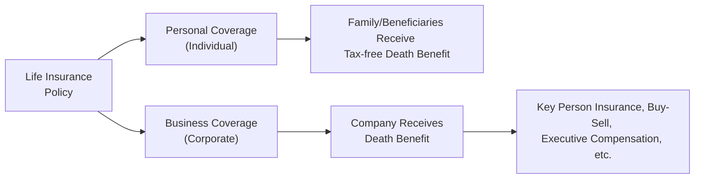

## 10.3 Business and Personal Applications

Life insurance isn’t just about leaving something behind for loved ones. It’s also a powerful tool that can protect a business, secure essential financing, and even help with a company’s long-term tax planning. I've seen a family friend’s small business saved by life insurance—really—when the owner passed away unexpectedly, the insurance money helped cover the startup’s debts and kept employees paid. So, yeah, life insurance goes far beyond just a simple death benefit.

This section explores the dual functionality of life insurance in Canada as both a personal and a business-oriented financial strategy. We’ll break down how personal coverage can help families, then dive into the different ways businesses use life insurance to protect their revenue streams, satisfy lenders, and create orderly succession plans. Let’s also discuss how these strategies often intertwine with other aspects of financial planning, from estate considerations to tax structures like the Capital Dividend Account (CDA).

In case you’re new to these terms, don’t worry—we’ll define them along the way. And as always, for any specific queries about taxes or legal angles, check with a qualified professional, or consult the Income Tax Act (Canada), the Canada Revenue Agency (CRA), or the Canadian Life and Health Insurance Association (CLHIA). Let’s get started!

---

## Personal Coverage

When we talk about personal coverage, we’re looking at how life insurance can protect individuals and families. It’s not just for the wealthy or for older folks, despite the stereotype. Younger individuals often get better insurance rates and can lock in coverage for the long term, ensuring financial security for those who depend on them. Below are some primary ways personal coverage is used.

### Providing Financial Protection for Dependants

If you die prematurely, life insurance can offer your family a lump sum that helps them avoid a sudden financial crisis. You know, raising kids, paying for schooling, or managing day-to-day bills can be stressful enough without the main income earner's paycheque. Having a policy in place is like having a safety net, so your loved ones can maintain their lifestyle and your children’s future plans aren’t completely derailed.

• Replace lost income: If you or your spouse suddenly pass away, the policy proceeds can help pay for things like groceries, mortgage or rent, and your kids’ education.  
• Pay for childcare or caregiving: If a stay-at-home parent passes, the cost of hiring a nanny or daycare can be covered by the policy.  
• Handle existing debts or liabilities.

### Tax-Free Benefit to Beneficiaries

One of the most appealing aspects of a life insurance policy is that, under Canadian tax law, the death benefit is generally received tax-free by your named beneficiary. This means if you pass away, your loved ones get the entire proceeds, without losing part of the benefit to income taxes.

### Covering Final Expenses, Debts, and Mortgages

Funeral and burial costs, outstanding credit card debt, personal loans, or even larger responsibilities like a still-outstanding mortgage can be settled using the insurance payout. Think about it: when someone passes away, the bills don’t just magically vanish. Life insurance can step in and clean up those obligations so your family doesn’t struggle to do it themselves.

In practice, many advisors (like we do in the broader financial community) suggest that coverage should at least equal your mortgage balance or any major financial liabilities—plus some additional amount to replace a portion of your income for a certain number of years. Many people use a rule of thumb like 10 times their annual salary, though that’s hardly a “one size fits all.” A better approach is running a thorough needs analysis.

Here’s a quick formula in KaTeX for a simplified needs approach:


\text{Required Coverage} = \underbrace{( \text{Annual Income} \times \text{Multiple} )}_{\text{Income Replacement}} + \underbrace{\text{All Debts}}_{\text{Debts}} + \underbrace{\text{Final Expenses}}_{\text{Funeral Costs}} 


The “multiple” of annual income could be anywhere from 5 to 15, depending on your circumstances. This is just a simplified representation—any specific plan should involve consultation with professionals who understand your life stage, employment type, and risk tolerance.

---

## Business Coverage

Life insurance can be a powerful asset within a business, addressing concerns from the unexpected loss of a key leader to giving lenders confidence that a loan will be repaid if something tragic happens to that leader. Here are some key applications:

### Key Person Insurance

Ever wonder what happens if the business owner—who’s intimately involved in daily operations—suddenly passes? That’s a major risk, especially for smaller companies. Key Person Insurance is designed to mitigate the financial fallout. The policy is owned by the business and the premium is paid by the business. If the insured key person passes away, the business receives the death benefit.

Typical uses:  
• Hiring a replacement for the role.  
• Offsetting lost revenue or lost goodwill.  
• Covering immediate costs until new leadership is found.  

When I was working with a local consulting company, the founder was the driving force behind all client relationships. They had a Key Person Insurance policy on him. It actually convinced a major client to stick around, because they saw the company was prepared for any worst-case scenario.

### Buy-Sell Agreements

Let’s say you’ve got two or three business partners who’ve built a company together. What happens if one of them dies or becomes incapacitated? A Buy-Sell Agreement is basically a contract that outlines how a deceased or disabled partner’s shares in the business will be redistributed or purchased by the remaining partners.

Life insurance serves as the funding mechanism. Each partner takes out a life insurance policy (often cross-owned or individually owned with the corporation as beneficiary, depending on the structure) that pays out when a partner dies. The proceeds can then be used to buy that partner’s shares from the estate. This prevents disputes, manages the transfer of equity quickly, and ensures continuity of ownership without having the deceased’s estate or heirs trying to manage the business.

### Collateral Insurance for Business Loans

Banks or private lenders may require a business owner to assign a life insurance policy as collateral for a loan. This arrangement ensures that if the owner or key executive dies, the payout will cover the outstanding loan. It also can secure a lower interest rate in some instances, because the lender is provided with a more robust guarantee of repayment.

This is common with new businesses where a single individual is intimately tied to the company’s creditworthiness. Let’s say you’re opening a boutique store with a $500,000 loan, and the bank insists you have a life insurance policy of at least $500,000 assigned to them. That way, if something happens to you, the bank can recoup its loan from the insurance proceeds. If the insurance covers the loan fully, any remainder then goes to your beneficiaries.

### Executive Compensation Planning

In some organizations, offering permanent (whole or universal) life insurance coverage is used as an executive perk. It can be part of a retention strategy. If the executive stays with the company for a certain number of years, the cash value built up inside the policy can then be accessed or transferred. The policy might be owned by the company, and the company pays the premiums. Arrangements like split-dollar insurance are sometimes used, where benefits are split between the corporation and the insured executive.

• Incentive/Retention: The executive sees the policy as a significant benefit.  
• Tax Efficiency: The policy can accumulate cash value in a tax-advantaged manner, subject to certain limits.  
• Alignment: The executive’s long-term interests are aligned with the success of the company.

---

## Coordinating with Other Financial Strategies

Life insurance shouldn’t be considered in isolation. It plays a key role in estate planning (see Chapter 18: Passing on the Estate) and business structuring (see Chapter 15: Financial Planning for Small Business). There are a few major touchpoints to consider:

1. **Tax and Estate Planning**  
   Life insurance proceeds can help cover taxes owing upon death. This is especially important if there are large capital gains on properties or shares. If you’re the business owner, you might have multiple streams of taxable assets. Life insurance can be used to offset this liability and ensure the estate doesn’t need to liquidate core assets quickly (often at a disadvantageous price).  

2. **Corporate-Owned Insurance & Capital Dividend Account (CDA)**  
   Canadian private corporations can maintain a notional account called the Capital Dividend Account (CDA). Insurance proceeds received by the corporation upon death of the insured may be credited to the CDA. This allows tax-free distribution of those funds to shareholders, subject to specific rules. This is a significant advantage, especially for business owners who want to ensure the death benefit flows to heirs or surviving partners with minimal tax leakage.  

3. **Aligning Business Succession with Personal Goals**  
   A well-structured succession plan includes buy-sell agreements, Key Person Insurance, and an orderly transfer of shares or ownership. When business owners fail to align personal estate plans with the business succession plan, loved ones can be stuck facing conflicts or liquidity challenges. For example, if your spouse is not actively involved in the business, do you really want them to inherit your shares, or do you prefer that the other partners buy them out? A life insurance policy can ensure everyone gets what they need, while leaving the company intact.

---

## Diagrams to Illustrate the Concepts

Below is a high-level visual representation of how personal and business coverage flows from a single Life Insurance Policy.

• Note how a single policy can be structured to protect either a family or a business, depending on the ownership, beneficiary designation, and purpose of coverage.

And here’s another quick look at a Buy-Sell Agreement flow:

In the diagram above, each partner holds a policy on the other partner. The “Buy-Sell Agreement” coordinates that, if one partner dies, the payout from the policy is used to buy out the deceased’s shares.

---

## Case Studies

### Case Study 1: Collateral Insurance in a Startup

Susan launched a tech startup with a loan from her local bank. She was the only founder, which meant if she died, the business’s viability would be questionable. The bank required her to get a term life insurance policy (with a death benefit of $300,000). She assigned it (collateral insurance) to the bank. Four years later, her software business soared, and she repaid the loan. The bank released the assignment, and now Susan can either keep that policy for personal coverage or terminate it.

### Case Study 2: Family Business Buy-Sell Agreement

José and Carla co-owned a successful restaurant. They had an agreement that if one of them died, the surviving partner could purchase the deceased’s share from their family at a fair price. They funded it with two life insurance policies—José was the beneficiary of Carla’s policy, and Carla was the beneficiary of José’s. When Carla unfortunately passed away, the insurance proceeds went to José. He used the money to buy Carla’s share from her heirs. Meanwhile, Carla’s family got immediate cash and had no stress about operating the restaurant. José continued running the business. Everybody’s interests were protected.

### Case Study 3: Corporate-Owned Universal Life for an Executive

A medium-sized manufacturing company wanted to attract a superstar executive. They offered to pay the premiums on a corporate-owned universal life policy as part of an executive compensation package. The agreement stated that after 10 years of service, the executive could access some of the policy’s cash value. This arrangement helped with the executive’s retirement planning and served as a “golden handcuff,” discouraging them from leaving early.

---

## Best Practices and Pitfalls

1. **Review Policy Ownership and Beneficiary Designations**  
   Mistakes in ownership structure can lead to unintended tax consequences or lack of funds where they’re needed most. For instance, if your corporation pays the premiums but a personal beneficiary is named, you might run into tax or legal complications.

2. **Keep Policies Up to Date**  
   Life events—like marriage, divorce, or new children—necessitate changes to your insurance coverage and beneficiary designations. If you don’t adjust, you risk leaving someone out or over-insuring yourself in ways that no longer match your priorities.

3. **Watch for Funding Gaps in Buy-Sell Agreements**  
   If the business valuation has grown significantly but the buy-sell life insurance coverage remains the same as when you started, the insurance proceeds might fall short, leaving the surviving partner without enough funds to buy the deceased’s shares.

4. **Review Tax Rules Regularly**  
   Canadian tax laws around insurance can shift (the Income Tax Act is regularly updated). The Capital Dividend Account rules, taxation of death benefits, or corporate ownership intricacies could change. Keep an eye on the CRA website (https://www.canada.ca/en/revenue-agency.html) for updates.

5. **Coordinate with Succession and Estate Plans**  
   Make certain your will, insurance policies, shareholder agreements, and family trusts (if any) are in harmony. Inadvertent conflicts might force unintended estate distributions or create liquidity nightmares. This is especially true if you have a cross-border element—maybe you own property in a different country.

6. **Consult Professionals**  
   Sure, personal research is great—but the complexities in business structuring, tax, and insurance can be tricky. Work with a licensed insurance advisor, a tax accountant, and possibly an estate lawyer to ensure your plan is bulletproof (or close to it).

---

## Glossary

• **Key Person Insurance:** Business-owned life insurance on an important individual (an executive, manager, or founder) whose loss would significantly disrupt operations or revenue.  
• **Buy-Sell Agreement (Shareholder Agreement):** A contract that dictates how a partner’s share of a business will be bought or sold in case of death, disability, or departure.  
• **Collateral Insurance:** A life insurance policy assigned to a creditor (like a bank) as collateral for a loan.  
• **Capital Dividend Account (CDA):** A notional account in a Canadian private corporation that allows certain tax-free dividends to flow to shareholders. Life insurance proceeds can be added to the CDA, providing potential tax benefits.  
• **Executive Compensation Planning:** Using insurance (often permanent policies) within compensation packages to retain or attract top talent.  
• **Corporate-Owned Insurance:** A policy owned by a corporation on the life of an owner, employee, or investor, offering potential tax advantages and fulfilling business coverage needs.

---

## References and Additional Resources

1. **Income Tax Act (Canada):**  
   Access the legislation at  
   [https://laws-lois.justice.gc.ca/](https://laws-lois.justice.gc.ca/)  
   This is the foundational resource for any tax treatment questions concerning life insurance.

2. **Canada Revenue Agency (CRA):**  
   [https://www.canada.ca/en/revenue-agency.html](https://www.canada.ca/en/revenue-agency.html)  
   Offers guidance on business taxes, deductions, and potential eligibility rules.

3. **“Insurance for Small Businesses” by the Canadian Life and Health Insurance Association (CLHIA):**  
   [https://www.clhia.ca/](https://www.clhia.ca/)  
   Great for advanced details on coverage scenarios.

4. **Buy-Sell Agreements for Closely Held Businesses by Lynne Butler:**  
   Offers best practices for structuring the legal aspects of a buy-sell agreement.

5. **CIRO (Canadian Investment Regulatory Organization):**  
   [https://www.ciro.ca](https://www.ciro.ca)  
   For updated continuing education modules and guidelines on how registered advisors can guide business owners in building robust insurance solutions.

6. **Consult a Professional:**  
   Remember that regulation changes periodically, and unique business or personal setups call for professional advice.  

### Closing Thoughts

Life insurance can play multiple roles, from a straightforward term policy protecting your loved ones to complex corporate-owned setups that minimize tax and maintain business operations. Perhaps you’ve always just thought of it as “I pay money, so if I die, my family gets a cheque.” But with the right strategies, life insurance can integrate seamlessly into your broader financial plan, giving both you and your business real peace of mind.

So, maybe it’s time to ask yourself: “Does my coverage match my current life's big picture?” If the answer is uncertain, schedule a review with a licensed advisor. Trust me, feeling secure about your financial future is a game-changer, both personally and professionally.

---

## Test Your Knowledge: Business and Personal Life Insurance Applications Quiz



### Which of the following best describes how life insurance proceeds are generally taxed when paid to a named beneficiary in Canada?

- [x] They are received tax-free by the beneficiary.
- [ ] They are taxed as capital gains.
- [ ] They are considered regular income and fully taxable.
- [ ] They are always subject to probate fees.

> **Explanation:** In Canada, life insurance proceeds paid to a named beneficiary typically bypass the estate altogether and are received tax-free.

### A buy-sell agreement funded by life insurance is primarily designed to:

- [ ] Provide retirement income to employees.
- [x] Allow surviving partners to purchase the deceased partner’s business share.
- [ ] Protect a lender in case of the borrower’s death.
- [ ] Ensure that corporate taxes are reduced at year-end.

> **Explanation:** A buy-sell agreement defines how a deceased partner’s business share is purchased by the remaining partners, and life insurance is the funding mechanism ensuring immediate liquidity.

### Which of the following describes a significant advantage of Key Person Insurance for a corporation?

- [ ] It pays dividends to shareholders annually.
- [ ] It eliminates the need for a corporate will.
- [x] It helps mitigate financial losses if a crucial executive or owner dies unexpectedly.
- [ ] It defers taxes on shareholder dividends indefinitely.

> **Explanation:** Key Person Insurance is designed to compensate the corporation for losses (including time to find a replacement or lost revenue) when a vital individual passes away.

### In a corporate-owned life insurance arrangement, which statement about the Capital Dividend Account (CDA) is correct?

- [x] It can allow certain insurance proceeds to be distributed to shareholders on a tax-free basis.
- [ ] It is not permitted under the Income Tax Act in Canada.
- [ ] It automatically forces a sale of shares upon death.
- [ ] It applies only to policies that cover more than three insured individuals.

> **Explanation:** The CDA is a notional account for certain private Canadian corporations that can allow life insurance proceeds to be used to distribute money tax-free to shareholders.

### Which scenario represents collateral insurance?

- [x] A loan is given to a small business on the condition that the owner assigns a life insurance policy to the lender.
- [ ] A company offering permanent life insurance to a star executive as part of a benefits package.
- [ ] A father naming his children as beneficiaries to a policy.
- [x] Both the first statement (loan scenario) and second statement (wrong scenario).

> **Explanation:** Collateral insurance is a life insurance policy assigned to a lender to secure a business or personal loan, ensuring the lender gets paid if the borrower dies.

### Which type of life insurance arrangement is commonly used in business to attract and retain top executives?

- [x] Executive compensation planning with permanent life insurance.
- [ ] Term life insurance with annual premium adjustments.
- [ ] Accidental death and dismemberment coverage only.
- [ ] Mortgage life insurance from a retail bank.

> **Explanation:** Executive compensation planning often uses permanent life insurance as part of an employment package to align the executive’s interests with the company's and provide long-term benefits.

### If the valuation of a company has grown substantially but the buy-sell policies have not been updated, what is the major risk?

- [x] The insurance proceeds may be insufficient to buy the deceased partner’s shares.
- [ ] The insurance proceeds will be classified as capital gains.
- [x] The business will automatically dissolve on partner’s death.
- [ ] The lender can claim more than the loan amount.

> **Explanation:** An outdated policy might not reflect the higher value of the business, leaving the surviving partners short on funds to buy out the deceased partner’s shares.

### What is one common use of personal life insurance proceeds?

- [x] Covering final expenses or outstanding personal debt upon death.
- [ ] Paying only business taxes after the owner’s death.
- [ ] Funding charity events during retirement.
- [ ] Modifying car or auto insurance policies post-death.

> **Explanation:** Personal coverage helps settle final expenses, outstanding personal debts, and mortgages, ensuring the deceased’s family isn’t left with unexpected financial burdens.

### How do life insurance premiums for Key Person Insurance typically get paid?

- [x] By the business that owns the policy.
- [ ] By the key person from their personal account.
- [ ] Split between multiple creditors, monthly.
- [ ] Paid by a government grant.

> **Explanation:** In Key Person Insurance arrangements, the business pays the premiums because it also receives the death benefit.

### True or False: Life insurance should be considered separately from an individual’s or corporation’s estate or succession planning.

- [x] False
- [ ] True

> **Explanation:** Life insurance is an integral part of a broader financial plan and should be coordinated with estate and succession strategies for optimal results.


