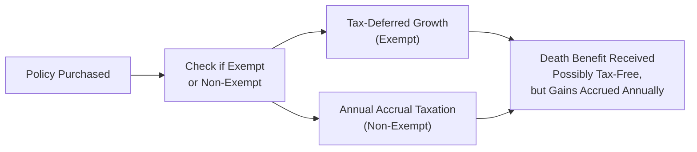

## 10.4 Tax Treatment of a Life Insurance Policy

Life insurance plays a critical role in Canadian financial planning, offering both immediate protection and long-term savings or investment options. While our previous sections (see Sections 10.2 and 10.3) focused on assessing one’s life insurance needs and exploring various applications, here we take a deeper look at the tax implications that come into play. After all, taxes can have a significant impact on the net benefit received by beneficiaries and policyholders alike.

In this section, we’ll tackle everything from how the proceeds of a life insurance policy can be tax-free, to the intricacies of exempt policy rules, adjusted cost basis (ACB), policy loans, and the broader role of corporate-owned life insurance. This discussion is especially relevant in Canada because, unlike some other jurisdictions, life insurance is governed by a unique tax regime under the Income Tax Act (Canada). Let’s dig in.

---

## Why Tax Treatment Matters

Let me share a quick story from my early days working with clients: one client of mine, a small-business owner, was worried that taxes might eat up everything they had worked so hard to build, including the payout to their beneficiaries if something unexpected happened. We found out that, yes, the life insurance proceeds would generally be received tax-free by their named beneficiary. However, there were a few major caveats if the policy did not meet certain criteria or if corporate ownership came into play. They were surprised (and relieved) to learn just how big a difference “exempt” status and the adjusted cost basis could make.

This story shows just how essential it is to understand the basic rules for how a life insurance policy is taxed in Canada. Sometimes, failing to follow the rules or not keeping up with changes to the policy could have unintended (and pricey) tax consequences.

---

## Tax-Free Death Benefit

One of the most appealing features of life insurance in Canada is that the proceeds (i.e., the death benefit) are almost always tax-free when paid to a named beneficiary. The beneficiary doesn’t have to report the amount as income, which makes a life insurance policy a powerful tool for estate planning. Regardless of whether you have term insurance or a permanent policy, the standard rule is this:

• When the life insured passes away, the named beneficiary receives the face amount of the policy without having to pay income tax on it.

This stands in marked contrast to other forms of investments that might trigger capital gains or other forms of tax upon death. Of course, if the proceeds end up going through the estate rather than directly to a beneficiary, provincial probate fees (estate administration taxes) or other administrative costs may apply. Regardless, the death benefit itself won’t be subject to income tax.

---

## Cash Value Accumulation and Tax-Deferred Growth

### Permanent Policies and Cash Value

If you have a permanent life insurance policy—such as Whole Life or Universal Life—it might accumulate cash value or feature an investment component. And here’s the exciting part: the growth of that cash value is typically tax-deferred, provided your policy meets certain “exempt test requirements” under the Income Tax Act (Canada).

Let’s briefly define that:

- **Cash Value:** The portion of the policy that acts similarly to an investment or savings account within the contract. Over time, premiums above the cost of insurance may grow on a tax-deferred basis.  
- **Exempt Test Requirements:** A set of rules that restrict the investment portion of a life insurance policy so that it qualifies for special tax treatment. Essentially, these rules limit how much money can build up inside the policy before otherwise triggering annual taxation.

When your life insurance policy is exempt, you often won’t pay taxes on the growth earned within the policy until there’s an actual disposition—like a full surrender or withdrawal that exceeds the policy’s adjusted cost basis. As a result, these policies are quite popular for clients who prefer a more conservative, insurance-based vehicle for certain funds.

### Impact of Surrendering or Withdrawing Policy Values

So, what if you decide to surrender or partially withdraw from your permanent policy? In many cases, if the cash you receive exceeds the policy’s ACB, that overage is taxable.

You could express this relationship as follows:

$$
\text{Taxable Gain} = \text{Proceeds of Disposition} \;-\; \text{ACB}
$$

- **Proceeds of Disposition:** The amount you receive from the surrender or withdrawal.  
- **ACB (Adjusted Cost Basis):** Defined in more detail just below, the ACB is your “cost” for tax purposes.  

As we note in Section 10.5 (Calculating Taxes on Life Insurance), determining the ACB can get tricky—especially with policies that have been in force for many years, or if riders, dividends, or policy loans have come into play. It’s always wise to keep accurate, up-to-date statements or consult the insurer for the official ACB figure.

---

## Policy Loans and Potential Tax Events

In Canada, insurance companies may allow you to borrow against the cash value of a permanent life insurance policy. This usually involves the following:

- **Collateral Assignment:** The policy is assigned (partly) to the insurer or a lending institution, and you receive a loan.  
- **Outstanding Loans Reduce the Death Benefit:** Upon the policyholder’s death, any unpaid policy loan typically reduces the final payout.

### When a Policy Loan Causes a Taxable Event

Here’s the surprise that can happen: if the loan exceeds certain thresholds or if it’s structured in a particular way, it can trigger the same tax consequences as if you had partially surrendered the policy. In other words, if the amount borrowed is in excess of the ACB, it may be considered a disposition of that portion of the policy. Then you may face a taxable gain on the difference.

So, if you or your clients are considering a policy loan to cover certain expenses, it’s crucial to monitor not only the policy’s total cash value but also its ACB. This helps avoid unexpected tax bills. Also, keep in mind that the interest on a policy loan could be deductible if the money is used for investment or business purposes, but you’ll want to confirm specifics with the Canada Revenue Agency (CRA) or a qualified tax professional.

---

## Exempt vs. Non-Exempt Policies

### How a Policy Becomes “Exempt”

A life insurance policy is considered “exempt” if it meets specific requirements set out in the Income Tax Act. These requirements limit how much the “investment” portion can accumulate relative to the insurance coverage within a given time frame. If the policy meets or stays within these limits, the investment growth can continue on a tax-deferred basis, similar to how registered retirement savings plans (RRSPs) and tax-free savings accounts (TFSAs) function (albeit under different rules).

### Implications of Non-Exempt Policies

Non-exempt policies, on the other hand, are subject to annual accrual taxation. That means you may need to pay taxes each year on the growth in the policy, rather than enjoying a tax-deferred accumulation. For most individuals and businesses, non-exempt policies are less appealing unless there’s a very specialized need or structuring.  

That said, certain high-net-worth strategies might involve non-exempt policies. But those often require sophisticated tax planning and the assistance of accountants and estate planners.

Below is a quick visual overview of the difference between exempt and non-exempt:

As shown, an exempt policy maintains a tax-deferred environment until a disposition occurs, whereas a non-exempt policy triggers annual taxation on the growing funds. However, in both policy types, the death benefit itself can still be received tax-free (though the ultimate net benefit could be lower in a non-exempt scenario if tax was paid along the way).

---

## Ownership and Beneficiary Designations

### Personal Ownership

Most people own their policies personally, naming either a family member or their estate as a beneficiary. In that case, upon death, the beneficiary receives the proceeds tax-free (with typical estate considerations if the estate is named). However, any withdrawals or surrenders during the policyholder’s lifetime could create a taxable event, as we’ve noted.

### Corporate Ownership and the Capital Dividend Account (CDA)

Things get more interesting when a corporation owns the life insurance policy. Let’s say you have a private corporation that purchases a life insurance policy on the life of a key shareholder or executive. Upon that person’s death, the payout is still generally received tax-free by the company. However, there are additional rules and planning opportunities:

- **Capital Dividend Account (CDA):** In Canada, a private corporation can credit life insurance proceeds (minus the policy’s ACB) to its CDA. From there, the corporation can often pay a capital dividend to its shareholders on a tax-free basis.  
- **Business Continuity:** Corporate-owned insurance can be used to fund buy-sell arrangements or to ensure liquidity to pay off corporate debts or taxes upon an owner’s passing.

Naturally, if the corporation extracts these insurance proceeds through a regular (taxable) dividend, the shareholders will pay tax on the distribution. So using the CDA effectively is key here.  

### Trusts and Family Planning

Similarly, some families prefer to own life insurance within a trust. That can help ensure the proceeds go to beneficiaries exactly as intended, and possibly guard them from creditors. Even with trust-owned life insurance, the typical rule is that the proceeds are not taxed as income when distributed upon death. However, be mindful of how the trust is structured, since improperly drafting a trust or not understanding the timing of distributions can lead to unintended tax consequences.

---

## Tax Planning Strategies with Life Insurance

Life insurance is more than just peace of mind. It’s often a cornerstone of broader tax and estate planning. A couple of strategies:

1. **Estate Freeze with Insurance**  
   - Let’s say you’re a business owner who wants to limit future tax liabilities on death and pass on the growth of your company to the next generation. An estate freeze can lock in your current shares’ value now, while future growth goes to newly issued shares (generally to your children or a family trust).  
   - Life insurance can then provide liquidity to pay for final taxes on the value of your “frozen” shares, or ensure that your heirs have ready funds without needing to sell assets.

2. **Insurance and Trust Combinations**  
   - Some folks pair life insurance with trusts (e.g., a joint partner trust or a family trust) to ensure that the policy proceeds remain protected, potentially skip probate, and pass seamlessly to beneficiaries.  
   - This can also serve as a shield against creditor claims under certain circumstances.

3. **Using Policy Loans for Retirement Income**  
   - Instead of withdrawing from your policy (and risking a big tax bill), you might consider borrowing against the policy as a source of supplementary retirement income. You must keep watch on the policy’s ACB and ensure you won’t inadvertently trigger a taxable event.

4. **Corporate-Owned Policies for Buy-Sell Funding**  
   - If you operate a business with one or more partners, a life insurance policy owned by the corporation—or cross-owned by each partner—can fund a buy-sell agreement. This helps ensure a smooth transition of ownership in the event of an untimely death. The proceeds received by the corporation can often be distributed tax-free to redeem or purchase shares, thanks to the Capital Dividend Account.

---

## Best Practices, Pitfalls, and Challenges

### Best Practices

- **Maintain Up-to-Date Records:** Track your policy’s ACB so you aren’t blindsided by taxes if you withdraw or surrender.  
- **Review “Exempt” Status Regularly:** Certain changes in a policy (e.g., adding additional deposits or riders) might alter the exempt status. Schedule periodic checkups with the insurer.  
- **Seek Professional Advice:** Because these rules can be complex, it’s wise to consult financial planners, tax accountants, and legal professionals to optimize your strategy.

### Common Pitfalls

- **Ignoring Policy Loans:** Borrowing too much from your policy can inadvertently trigger a taxable disposition.  
- **Naming the Estate as Beneficiary:** While not always a pitfall, be aware that naming your estate can expose the insurance to probate fees and potential creditor claims.  
- **Overstepping Exempt Limits:** Stuffing too much premium or cash into the investment component may convert your policy to a non-exempt one—leading to annual taxation.

### Potential Challenges to Overcome

- **Aligning with Other Financial Goals:** Sometimes the most tax-efficient strategy might not be the best liquidity strategy. Striking a balance is key.  
- **Corporate Ownership Nuances:** Using a company to own a policy involves different rules, especially concerning the CDA and shareholder agreements. This tends to be a more advanced technique and requires specialized advice.

---

## Glossary of Key Terms

- **Tax-Free Death Benefit:** Insurance proceeds paid upon the policyholder’s death that are not subject to income tax, provided a beneficiary is named.  
- **Exempt Policy Test:** Rules in the Income Tax Act that, if satisfied, ensure a life insurance policy accumulates value on a tax-deferred basis.  
- **Adjusted Cost Basis (ACB):** A policy’s “cost” for tax purposes. When you surrender or withdraw funds, any amount exceeding the ACB may be taxable.  
- **Policy Loan:** Borrowing using the cash surrender value of the policy as collateral. These loans may trigger a partial or full disposition for tax purposes if they exceed specific thresholds.  
- **Estate Freeze:** A tax planning approach to lock in the value of an asset today so that future growth is transferred to the next generation or another entity.  
- **Capital Dividend Account (CDA):** A notional account used by private corporations in Canada to pay certain amounts (including life insurance proceeds) to shareholders free from tax.

---

## Additional Resources and References

• **Income Tax Act (Canada):** The prime source for understanding exempt test requirements, corporate ownership implications, and other legislative details.  
  → https://laws-lois.justice.gc.ca/  
• **Canada Revenue Agency Bulletins on Life Insurance:** The CRA publishes interpretation bulletins and guides on the tax treatment of life insurance, policy loans, and dispositions.  
  → (Search “CRA IT Bulletins on Life Insurance” on the CRA website)  
• **Canadian Life and Health Insurance Association (CLHIA):** Great resource for life insurance basics, industry standards, and consumer guides.  
  → https://www.clhia.ca/  
• **Guide to Life Insurance Taxation in Canada:** Leading accounting firms (e.g., KPMG, Deloitte) publish detailed guides that can provide advanced insights into life insurance taxation.  
• **CIRO Continuing Education Courses:** Canada’s national self-regulatory organization (CIRO) offers updated continuing education modules on integrated investment and insurance solutions.  
  → https://www.ciro.ca  

For more on other life insurance considerations, take a look at Section 10.5, where we delve further into calculating taxes on life insurance. And don’t hesitate to review earlier sections in Chapter 10 to refresh your grasp of product types, features, and practical applications.

---

## Practical Example and Closing Thoughts

Let’s do a quick hypothetical: Suppose Priya, a 45-year-old entrepreneur, has a Whole Life policy with a cash surrender value of $150,000 and an ACB of $120,000. If she surrenders the policy altogether and receives $150,000, the taxable portion is $30,000. If she simply borrowed $50,000 from the policy, that might or might not result in a taxable event, depending on the policy’s structure and how the loan is arranged. Because of all these nuances, Priya has to weigh the benefit of accessing funds now against the potential tax consequences, plus the future growth she’d be giving up.

Anyway, the bottom line is that while life insurance is one of the most powerful tools in a Canadian’s financial arsenal, it’s important to understand how taxation factors into the strategy. Whether you’re a business owner, a high-net-worth individual, or just starting out with your first permanent policy, a good handle on the tax aspects can help you stay on the right side of the CRA’s rules and keep more of what you build for the people you care about.

---

## Test Your Knowledge: Tax Treatment of Life Insurance Policies



### 1. Which of the following best describes a key benefit of life insurance proceeds for a named beneficiary in Canada?

- [ ] They are always subject to capital gains tax.  
- [ ] They are treated as earned income.  
- [ ] They are subject to a withholding tax of 25%.  
- [x] They are typically received tax-free.  

> **Explanation:** In Canada, life insurance proceeds paid to a named beneficiary are generally not taxed as income, which makes it a powerful estate planning tool.

### 2. What typically happens if a permanent life insurance policy is classified as “non-exempt”?

- [ ] It loses its cash value automatically.  
- [ ] The death benefit is taxed as income upon the policyholder’s death.  
- [x] Annual accrual taxation on the policy’s growth may apply.  
- [ ] Loans cannot be taken against the policy.  

> **Explanation:** Non-exempt policies face annual taxation on the investment growth, unlike exempt policies which enjoy tax-deferred growth.

### 3. Suppose a policy has an adjusted cost basis (ACB) of $90,000, and the policyholder withdraws $100,000. Which of the following is true?

- [ ] The taxable amount is $190,000.  
- [ ] There is no taxable amount.  
- [x] The taxable amount is $10,000.  
- [ ] The ACB resets to $250,000.  

> **Explanation:** When proceeds exceed the ACB, the difference is a taxable gain. Here, $100,000 – $90,000 = $10,000 is taxable.

### 4. Which of the following is true about a policy loan?

- [x] If the loan exceeds the policy’s ACB, a partial disposition might occur, triggering a taxable event.  
- [ ] It can never trigger a taxable disposition.  
- [ ] It always resets the ACB to zero.  
- [ ] It invalidates the insurance coverage.  

> **Explanation:** A policy loan can result in a taxable event if the loan amount surpasses certain thresholds (including the ACB). Careful monitoring of the ACB is essential.

### 5. In corporate-owned life insurance scenarios, the insurance proceeds are typically credited to which special account?

- [ ] Retained Earnings  
- [x] Capital Dividend Account (CDA)  
- [ ] Contributed Surplus  
- [ ] Authorized Share Capital  

> **Explanation:** Life insurance proceeds received by a private corporation are generally allocated to the Capital Dividend Account (CDA), from which tax-free capital dividends can be paid to shareholders.

### 6. Under an “estate freeze” strategy, how is life insurance often used?

- [ ] To borrow money to pay down personal debt.  
- [ ] To create a non-registered trading account under the family’s name.  
- [ ] To avoid using trusts altogether.  
- [x] To provide liquidity to cover tax liabilities triggered on “frozen” shares.  

> **Explanation:** An estate freeze locks in the value of shares at a certain point in time, transferring future growth to other entities (often children). Life insurance proceeds are then used to help pay the taxes due upon death, ensuring the assets are not forcibly sold.

### 7. Which of the following ensures that the investment component of a life insurance policy remains tax-deferred?

- [ ] Failing to pay premiums on time.  
- [ ] Having no named beneficiary.  
- [x] Meeting the exempt test under the Income Tax Act.  
- [ ] Owning the policy through a foreign corporation.  

> **Explanation:** A life insurance policy must meet the exempt test requirements under the Income Tax Act to maintain tax-deferred growth in its investment component.

### 8. If a policyholder names their estate as the beneficiary of their life insurance policy, which of the following may occur?

- [x] The insurance proceeds may be subject to probate fees.  
- [ ] The death benefit is taxed at an additional 30%.  
- [ ] The insurance proceeds automatically lose their exempt status.  
- [ ] All taxes are waived upon the policyholder’s death.  

> **Explanation:** While the death benefit itself remains tax-free, naming the estate as beneficiary could subject the proceeds to probate fees and potentially creditor claims, depending on provincial rules.

### 9. Which factor most directly influences whether policy withdrawals lead to a taxable gain?

- [ ] The policy’s contract date.  
- [x] The adjusted cost basis (ACB).  
- [ ] The beneficiary’s tax bracket.  
- [ ] The willingness of the insurer to report.  

> **Explanation:** Taxable gains from withdrawals or surrenders are determined by comparing the amount withdrawn against the policy’s ACB.

### 10. True or False: Using a life insurance policy as collateral for a loan never causes any tax implications.

- [x] True
- [ ] False

> **Explanation:** Actually, this statement is tricky, but in many cases, using the policy as collateral alone does not trigger a disposition for tax purposes. However, if the loan proceeds exceed the policy’s ACB or the loan is structured in certain ways, a partial disposition could occur. It’s essential to analyze each scenario carefully.


