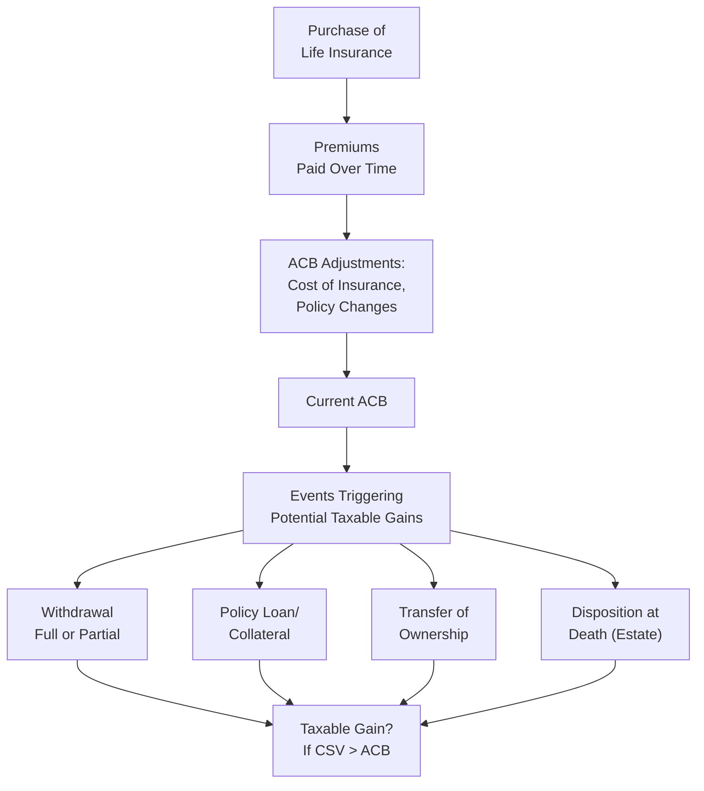

## 10.5 Calculating Taxes on Life Insurance

Life insurance is often sold as a straightforward way to protect loved ones, fund estate taxes, or provide liquidity at death. But the moment we look closer—especially at the math behind taxes on withdrawals, policy loans, or transfers—things can get a bit more involved. No need to panic, though. The good news is that with a little guidance, we can grasp how to calculate taxes on life insurance policies in Canada and avoid common pitfalls or confusion. Let’s walk through the key considerations step by step.

Feel free to read this section at your own pace, and don’t hesitate to pause and reflect on each concept before moving on. Also, remember that tax rules can shift, so always confirm with the Canada Revenue Agency (CRA) or consult your professional advisors (lawyers, accountants, etc.) for the most up-to-date information.

---

## Understanding the Adjusted Cost Basis (ACB)

One of the linchpins of life insurance taxation in Canada is the concept of Adjusted Cost Basis (ACB). “Basis” typically refers to your original cost in an asset. With life insurance, that “cost” isn’t always straightforward. The ACB of an insurance policy usually starts off as the total premiums you’ve paid, then gets adjusted up or down over time.

• Why Adjustments Happen  
  When you pay a premium into a life insurance policy (especially permanent policies, like universal or whole life), part of those premiums might go toward the cost of insurance, administrative fees, or—depending on your arrangement—a built-up cash value. Over the years, these internal charges, along with certain policy transactions, can alter your policy’s cost base.  
  - If your policy has a significant cash value, you might see the ACB steadily go down because some portion of your premium covers insurance costs rather than building up a tax-advantaged value.  

• Why the ACB Matters  
  The ACB is crucial for determining whether there’s a taxable gain on withdrawal, surrender, or transfer of ownership. If the policy’s narrative is, “You pay premiums, and value grows tax-deferred,” you also need to know when the government says, “Hold on, that’s a realized gain.” The difference between the cash surrender value (CSV) and ACB decides how much, if any, of that realized amount is taxable.

### Quick Illustration of an ACB
Suppose you purchased a permanent life insurance policy ten years ago:
• Total premiums paid to date: $30,000  
• Internal insurance costs over time: $10,000  
• Adjusted Cost Basis: $20,000 (i.e., $30,000 – $10,000)  

If your policy has a current cash surrender value of $25,000, and you decide to surrender it, the taxable gain will generally be $25,000 (CSV) – $20,000 (ACB) = $5,000. That $5,000 is the amount that must be reported as income for the year in which you dispose of or surrender the policy.

Here’s a small flowchart to visualize how ACB and CSV interact:

---

## Surrender or Partial Withdrawal: Tax Consequences

Every so often, you might want to draw from your life insurance policy’s cash value. Think of it like a built-in savings account that accumulates over time. That’s great for emergencies, business opportunities, or supporting retirement needs. But watch out: each time you withdraw or surrender a portion of the policy, you have to see if a gain occurs.

• Full Surrender  
  Full surrender is essentially terminating your policy. You receive the cash surrender value, your coverage ends, and you walk away. If CSV > ACB, you have a taxable gain. If CSV < ACB (which can happen early in a policy’s life), there’s no taxable gain, and you simply end the policy.  

• Partial Withdrawal  
  With some universal life or whole life policies, you can withdraw a chunk of the CSV. Let’s say you withdraw $5,000. If the portion of the CSV assigned to that withdrawal exceeds the corresponding slice of the ACB, you might realize a gain. The calculation can get more detailed, often requiring a proportion of the policy’s overall ACB to be allocated to the withdrawal.  

**Practical Example**  
Let’s say the ACB of your policy is $40,000, and the CSV is $60,000. You withdraw $15,000. Typically, there’s a method (prescribed by the Income Tax Act) to figure out how much of the ACB is allocated to that $15,000 withdrawal. For our simplified demonstration:  
• Proportion of the CSV withdrawn: $15,000 / $60,000 = 25%  
• Therefore, 25% of the ACB is allocated to that withdrawal, i.e.: 25% of $40,000 = $10,000  
• Taxable portion: $15,000 – $10,000 = $5,000  

You’d report $5,000 as income in the year you made the partial withdrawal. This is a simplified snapshot—your actual calculations could look different, especially if your policy’s structure is complex.  

---

## Policy Loans and Collateral Assignments

I remember once a friend, who owned a small landscaping business, told me he borrowed against his life insurance policy after the local bank refused him a loan. “I had no idea you could do that,” he said. Then he asked, “Wait, do I pay taxes on that?” Possibly—depending on how the loan is structured.

• How Policy Loans Work  
  Certain life insurance policies allow you to borrow directly from the insurer using your policy’s cash value as collateral. You receive a loan, and interest will accrue—but you still have coverage in place.  

• Tax Implications of Policy Loans  
  The main question with policy loans is whether they’re considered a “disposition” for tax purposes. If it’s structured as a true policy loan from the insurer, it might not trigger immediate tax. However, if you borrow from a bank or another lender and assign your policy as collateral, partial or total dispositions could arise if the loan arrangement effectively surrenders or withdraws from the CSV.  

• Interest Deductibility  
  If you’re using the policy loan for business or investment purposes, you may be able to deduct the interest expense. But (and this is key) the rules are strict. You must be able to show a direct link between the borrowed funds and your business or investment activity. And trust me, the CRA can be quite picky here, so be sure to keep thorough documentation.  

---

## Dividend Options in Whole Life Policies

Whole life insurance contracts often pay “dividends” when the insurer’s performance (through investments, mortality experience, and expenses) exceeds certain policy assumptions. These dividends aren’t the same as stock dividends, although the name might confuse people from time to time.

• Common Dividend Options  
  1. Receive Dividends in Cash.  
  2. Use Dividends to Purchase Paid-Up Additional Insurance (PUA).  
  3. Use Dividends to Reduce Future Premium Payments.  
  4. Accumulate Dividends in the Policy.  

Each choice can yield distinct tax consequences, though ironically, many policyholders blindly select “reinvest dividends in the policy” or “use them to reduce premiums,” not realizing the potential differences.

• Typical Tax Treatments  
  - Receiving dividends in cash: Normally, that’s not automatically considered a taxable event if the policy itself is still considered exempt under the Income Tax Act. But, in some cases, the dividend may exceed your ACB or reduce it. Always keep track!  
  - Using dividends to reduce premiums or purchase additional coverage: Generally, these actions don’t trigger a tax event as long as everything stays within the rules for exempt policies.  

It’s always a good idea to check with an advisor if you plan on drastically changing how you receive dividends—especially if the new arrangement changes your policy’s exempt status or ACB.

---

## Taxable Policy Gains on Transfer of Ownership

Transferring a life insurance policy—whether it’s from you to a corporation you control, from a parent to a child, or from one spouse to another—can trigger a deemed disposition. In plain English, that means the government treats it as if you sold or surrendered the policy, even though all you did was hand it over to someone else.

• When Transfers Are Tax-Deferred (Rollover Basis)  
  A special spousal rollover is one of the prime exceptions. If you transfer your life insurance policy to a spouse (or common-law partner) in circumstances that meet certain rules, the policy can roll over, deferring tax until there’s another disposition event.  

• Transfer to a Corporation  
  Let’s say you’re transferring your personally owned policy to your corporation for business or estate planning reasons. The fair market value of that policy or the policy’s CSV can come into play. If the corporation “pays” you for the policy, or you simply assign it a certain value, the difference between that value and your ACB might be taxable.  

Remember, the moment ownership changes, think “deemed disposition.” If the CSV is higher than your ACB, it triggers a taxable gain.  

---

## Integration with Estate Planning

No conversation about life insurance taxation is complete without touching on estate planning. Some folks think, “As long as I keep the policy in force until death, the payout is tax-free to my beneficiaries.” Often, that’s correct—but there are absolutely scenarios where tax creeps in.

• Deemed Disposition at Death  
  Upon death, your policy might be considered disposed of for certain tax calculations. Typically, the death benefit itself is not taxed in the hands of the beneficiary. However, if your policy has a large investment component and you die, the policy might pay out death benefits plus an additional CSV portion—there can be complexities.  

• Last-to-Die Policies  
  These are commonly used to pay final estate taxes on the second spouse’s death. Because the payout only happens on the surviving spouse’s death, the cost can be lower, or the coverage period longer. Be mindful that if you transfer ownership or if the policy is part of a corporate estate freeze, different tax rules might apply.  

• Collaborate With Professionals  
  Estate planning often involves multiple professionals: financial planners, accountants, and estate lawyers. They can help minimize taxes on dispositions at death by structuring ownership, beneficiaries, or trust arrangements appropriately.  

---

## Case Study: Partial Withdrawal and Spousal Transfer

Let me share a slightly fictional scenario that combines a couple of these concepts:

Lily has a whole life policy she’s been funding for 15 years. Over that period, she’s paid $45,000 in premiums, and the policy’s ACB after adjustments is $32,000. The CSV is now $50,000. She decides she needs $10,000 for a home renovation. She withdraws $10,000 from the policy. By proportion, her allocated ACB for that withdrawal is $6,400, leaving $3,600 as a taxable gain.  

Fast forward a few years. Lily’s ACB is now further adjusted after the partial withdrawal. She decides to transfer the policy to her spouse for future estate planning. Provided the transfer meets the spousal rollover rules, no immediate gain is triggered. A few more years pass, Lily and her spouse pass away, and the beneficiary (their child) collects the death benefit free of tax at that stage (assuming the policy remains exempt). The spousal rollover saved Lily from declaring a gain at the time of transfer, deferring it until a later potential disposition event.

This scenario highlights how each step—partial withdrawal, adjusted cost basis changes, spousal rollover—can affect the ultimate tax result.  

---

## Diagram: Overview of Life Insurance Tax Calculation Flows

Below is a more comprehensive flowchart summarizing how various events interact with tax calculations:

---

## Best Practices, Pitfalls, and Tips

• Keep Track of Your Paperwork  
  It sounds obvious, but you’d be surprised how often people lose track of policy statements, dividend notices, or the cost of insurance amounts. Without these, accurately calculating ACB can become a nightmare.

• Verify Policy Exempt Status  
  Policies can “lose” their exempt status in certain circumstances (e.g., too high a savings component). Once that happens, the growth inside the policy is no longer fully tax-deferred. Always confirm with your insurer if your policy remains exempt.

• Consider Professional Advice for Major Transactions  
  Whether you’re transferring ownership, taking a large policy loan, or removing a big chunk of the CSV, it’s smart to consult with a knowledgeable tax accountant or financial planner, especially if complex rules (like spousal rollovers) are in play.

• Watch Out for “Corporately Owned” Policies  
  Corporations can own life insurance on shareholders or key employees. Premiums might not be deductible, but the corporation could receive the death benefit tax-free—but only up to a certain credited portion known as the “Capital Dividend Account.” This area gets complicated, so do keep in mind that you must track the ACB meticulously for a corporately owned policy.

---

## Additional Resources and References

If you’re looking for more indepth information, or if you need to double-check the finer points:

• [Canada Revenue Agency – Life Insurance Policy Dispositions](https://www.canada.ca/en/revenue-agency.html)  
  Search for “Life Insurance Policy Dispositions” for details on how the CRA views surrender, withdrawal, and policy loans.

• [CIRO (Canadian Investment Regulatory Organization)](https://www.ciro.ca)  
  As of January 1, 2023, the MFDA and IIROC merged into CIRO. For the most up-to-date guidance on regulations related to investment and mutual fund dealers, check CIRO’s resources.

• [Alberta Insurance Council](https://www.abcouncil.ab.ca/), [Autorité des marchés financiers (AMF)](https://lautorite.qc.ca/)  
  These provincial bodies govern insurance regulation and licensing in their respective jurisdictions. Check them for compliance guidelines in Alberta or Quebec.

• [Canadian Tax Foundation](https://www.ctf.ca/)  
  Offers plenty of articles, papers, and guides that analyze specialized tax rules, including advanced life insurance taxation.

• Financial Planning Software  
  – “moneySTACK” and “Open Financial Planning Tools” can simulate your policy’s future ACB changes or see how partial withdrawals might affect your taxes.  
  – They can also produce neat scenario-based projections, preventing any unwelcome surprises come tax time.

• [FP Canada](https://www.fpcanada.ca/)  
  Provides courses on advanced estate planning and continuing education for financial planners. Their modules cover how last-to-die policies and tax rules can reduce estate taxes and deliver optimum benefits to loved ones.

---

## Conclusion

Calculating taxes on life insurance involves more than just a quick glance at your cash surrender value. We, as policyholders or financial professionals, need to be mindful of the Adjusted Cost Basis, track any surrenders or loans, understand how dividends are treated, and anticipate the impact of policy transfers or dispositions at death. None of this is meant to be scary—it’s simply an integral part of comprehensive financial planning.

Keep solid records, talk to tax pros when making big moves, and always confirm with the CRA or provincial regulators if something feels uncertain. Life insurance can indeed be a powerful asset in our financial toolkit, but only when handled with informed care and attention to detail.

---

## Test Your Knowledge on Life Insurance Taxation



### Which factor primarily determines whether there is a taxable gain on the surrender of a life insurance policy?

- [ ] The face amount of the policy
- [x] The difference between the cash surrender value (CSV) and the adjusted cost basis (ACB)
- [ ] The amount of any outstanding loans on the policy
- [ ] The total number of years the policy has been in force

> **Explanation:** The taxable gain is computed when the CSV exceeds the ACB, not simply based on the face amount or policy duration.

### When a life insurance policy is partially withdrawn, how is the ACB typically allocated to the withdrawal?

- [x] Proportionally, based on the fraction of the CSV that is withdrawn
- [ ] Entirely, reducing the ACB to zero
- [ ] No allocation; the entire withdrawal is taxable
- [ ] Based on current interest rates

> **Explanation:** The ACB portion assigned to the withdrawal is typically proportional to the amount of the CSV that is withdrawn, ensuring only the excess is taxed.

### In Canada, which organization replaced the MFDA and IIROC as the main self-regulatory body for investment dealers and mutual fund dealers effective 2023?

- [ ] Canadian Investor Protection Fund (CIPF)
- [x] The Canadian Investment Regulatory Organization (CIRO)
- [ ] Canada Deposit Insurance Corporation (CDIC)
- [ ] The Canadian Tax Foundation (CTF)

> **Explanation:** CIRO was formed on January 1, 2023, by the amalgamation of the MFDA and IIROC. MFDA and IIROC no longer exist as separate entities.

### Which dividend option in a whole life policy typically does not trigger an immediate tax event, so long as the policy remains exempt?

- [ ] Receiving dividends in cash
- [ ] Investing dividends in the stock market
- [x] Using dividends to reduce premiums or to purchase paid-up additional insurance
- [ ] Donating dividends to charity

> **Explanation:** Using dividends to pay premiums or purchase paid-up additional coverage generally remains tax-free within an exempt policy.

### When you pledge a policy as collateral for a bank loan, under what condition might it trigger a taxable disposition?

- [ ] If the policy is term life
- [x] If the bank effectively accesses the policy's cash surrender value
- [ ] If the loan is for mortgage purposes only
- [ ] There is never a taxable disposition with collateral assignments

> **Explanation:** If the collateral assignment constitutes an actual partial withdrawal or surrender, it may be deemed a disposition, triggering a potential taxable event.

### Which term refers to a situation where an asset is treated as if it were sold, even though no actual sale took place?

- [x] Deemed disposition
- [ ] Forced liquidation
- [ ] Collateral meltdown
- [ ] Phantom sale

> **Explanation:** “Deemed disposition” is the tax concept that treats property as if it has been sold, commonly used in transfers or at death.

### What key advantage do spousal rollovers provide when transferring a life insurance policy between spouses?

- [ ] Immediate tax-free withdrawal
- [ ] Elimination of policy premiums
- [x] Deferral of any taxable gain until a subsequent disposition
- [ ] Increase in the face value of the policy

> **Explanation:** Spousal rollovers allow you to pass the policy on without triggering a taxable gain until the next disposition event.

### In the event of a policyholder’s death, how is the death benefit of a life insurance policy generally treated for tax purposes in Canada?

- [x] It is received tax-free by the beneficiary
- [ ] It is always taxed as income
- [ ] It is taxed if received as an annuity
- [ ] It is subject to capital gains tax

> **Explanation:** Typically, the death benefit is paid out tax-free to your named beneficiary.

### If a corporate-owned life insurance policy with a CSV in excess of its ACB is transferred from the corporation to a shareholder, which of the following is likely to occur?

- [ ] The shareholder can ignore the gain
- [ ] No reporting is required unless the policy is universal
- [ ] Future policy premiums become tax-deductible
- [x] A taxable gain may be triggered based on the fair market value or CSV

> **Explanation:** When a corporately owned policy is transferred, a taxable gain typically arises if the CSV exceeds the ACB, reflecting a deemed disposition.

### True or False: A policy loan for business purposes can result in deductible interest if properly documented.

- [x] True
- [ ] False

> **Explanation:** If the borrowed funds are used for business or investment-related activities, the interest on the policy loan may be deductible, provided documentation meets CRA requirements.


