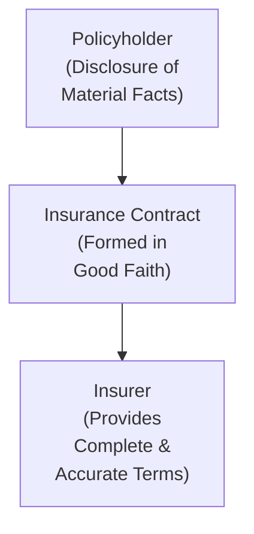

## 11.1 Legal Aspects of the Insurance Contract

Insurance in Canada is, well, a fascinating world. It's governed by the standard rules of contract law—offer, acceptance, consideration, capacity, and lawful object—but it also comes bundled with additional layers of complexity, like insurable interest and the principle of utmost good faith. When you think about it, insurance is all about protection: the insurer wants to ensure they understand exactly what risk they're taking on, and the policyholder wants some measure of financial reassurance if things go wrong. In this section, we’ll explore the special legal aspects of insurance contracts, how they differ from typical contracts, and the regulatory frameworks that influence them across Canada.

### Importance of Legal Foundations

One reason insurance is so critical in financial planning is that it touches nearly every major facet of life—your car, your home, your health, your business, and even your loved ones’ well-being in the event of your death. A properly structured insurance contract can mean the difference between financial ruin and a manageable setback. However, the pre-conditions laid out by law impose specific obligations on all parties. The guiding principle is fairness: the policyholder and insurer must deal with each other fairly and openly. 

I remember once talking to a family friend about a home insurance claim that was denied because the insurer discovered significant misrepresentations about the condition of the house. The friend was frustrated, and he initially thought, “I pay premiums—why isn't the insurer paying out?” But from the insurance company’s perspective, the policy should never have existed in the first place because key information had been concealed. That’s exactly why the principle of utmost good faith is so important in insurance contracts. 

### Essential Elements of an Insurance Contract

A valid insurance contract, much like any contract, needs five fundamental elements: offer, acceptance, consideration, capacity, and lawful object. But let’s look at how each element applies specifically to insurance.

#### Offer and Acceptance

We usually see the policyholder starting the process by applying for coverage—this is essentially the “offer.” The insurer’s underwriting process transforms that offer into acceptance or rejection. Sometimes the insurer may propose changes (for instance, a higher premium or different coverage limits), which effectively becomes a counteroffer. The policy takes effect once the two sides meet on the same set of terms.

#### Consideration

In insurance, the policyholder’s premium payment is the most obvious form of consideration. In return, the insurer promises to pay out in the event of a covered loss. This two-way exchange is what makes an insurance contract legally binding in the first place.

#### Capacity

Everyone involved—both the insurer (which must be properly licensed) and the insured—needs the legal capacity to enter into a contract. In Canada, minors generally don’t have the capacity to contract, except in very specific circumstances (for example, some provinces allow minors above a certain age to hold life insurance policies). Corporate entities have capacity if their internal governance and licensing, where relevant, permit them to do so.

#### Lawful Object

An insurance contract can’t be used to protect illegal interests. A policy that insures contraband or other illegal property, for instance, wouldn’t be enforceable. In essence, you can’t buy an insurance contract to shield yourself from consequences of illegal acts.

Below is a simplified diagram illustrating these five core elements in the context of insurance:

Each of these elements must be met before a contract is considered validly formed. However, insurance law goes beyond these generic requirements to include concepts like insurable interest and utmost good faith.

### Insurable Interest

An insurable interest means that you have a direct financial or other type of loss if the insured event occurs. Without an insurable interest, the contract cannot stand. Think about it this way: If you had no stake in whatever you’re insuring—like your neighbor’s vehicle—there’d be a moral hazard. You might not care if that vehicle gets stolen or destroyed, or worse, you might even have an incentive to cause the loss. 

For property and liability insurance, it’s pretty straightforward: owners, co-owners, or people in possession of an item have an insurable interest. For life insurance, you need a recognized relationship—like a spouse, parent, or business partner—and a financial dependency or emotional relationship that the law recognizes. In practice, Canadian provincial insurance acts or the Civil Code of Quebec define or guide how to determine if an insurable interest exists.

### Utmost Good Faith (Uberrima Fides)

Insurance contracts hinge on disclosure—both from you (the policyholder) and from the insurer. If you’re applying for a life insurance policy and you fail to mention a significant medical condition, you risk the contract being rendered void later. The term “material fact” is often used: a material fact is any piece of information that might change the insurer’s evaluation of the risk. 

Insurance companies must also uphold their side of this bargain, providing policy information, disclaimers, and coverage details in a transparent manner. This reciprocal obligation ensures both parties know what they’re signing up for. The following diagram captures how utmost good faith weaves through the insurance relationship:

Some folks might say, “But wait, the insurer has all the power!” Actually, it can seem that way at times because the insurer drafts the contract. And that’s exactly why courts have historically applied the contra proferentem rule: if the language is ambiguous, it’s interpreted in favor of the insured. 

### Principle of Indemnity

For many forms of insurance—property, health, liability—the principle of indemnity is key. Indemnity means that if you suffer a loss, the payout should ideally put you back to where you were financially before the loss occurred. You shouldn’t be able to profit from the insurance claim. If you insured your car for its fair market value (let’s say $20,000) and it gets destroyed, your settlement isn’t supposed to exceed $20,000. 

Life insurance is a notable exception. It’s classified as a “valued contract,” meaning it pays out a predetermined sum (the face amount) upon the insured’s death. If that sum happens to exceed any actual “financial loss,” you don’t have to justify that difference—it’s simply the amount stated in the policy.

### Legal and Regulatory Oversight

Insurance is primarily regulated at the provincial or territorial level in Canada. Each province has an Insurance Act (in Quebec, the Civil Code addresses many of these issues) that lays out specific requirements for insurance companies, agents, and contracts. While provinces oversee market conduct and contract provisions, federal oversight (through the Office of the Superintendent of Financial Institutions, or OSFI) applies to federally incorporated insurers in areas such as solvency standards.

For instance, in Ontario, you can find relevant details in the Ontario Insurance Act:
• [Ontario Insurance Act](https://www.ontario.ca/laws/statute/90i08)

Quebec’s legal framework for insurance contracts is found in the Civil Code of Quebec:
• [Civil Code of Quebec](https://www.legisquebec.gouv.qc.ca)

Financial planners practicing in Quebec need to be mindful that Quebec law often has slight variations from common-law provinces. For example, the approach to interpretation and certain formalities around contract formation can differ.

### Insurance in Quebec

Quebec’s legal system, shaped by the Civil Code, is distinct from the common-law approach in the other provinces. For insurance, Articles 2389 to 2643 in the Civil Code establish how contracts should be interpreted, how claims should be processed, and what obligations each side holds. The Civil Code emphasizes clarity, good faith, and the notion that contracts are binding on all parties. For instance, while the rest of Canada also upholds utmost good faith, Quebec’s version is explicitly embedded in the civil law tradition.

When I first encountered Quebec’s insurance provisions, I was struck by how meticulously the Civil Code describes the rights and obligations of policyholders versus insurers. If you plan to offer financial planning services in Quebec, it's wise to get well acquainted with these statutory articles so you can navigate client issues effectively.

### Disputes and Contract Interpretation

Disagreements about insurance contracts typically relate to policy language—specifically, whether a given loss or event is covered. The wording can sometimes be ambiguous, leading to confusion about coverage. If the matter ends up in court, judges often rely on the contra proferentem rule to interpret any ambiguity in favor of the policyholder, because the insurer is the one who drafted the contract terms. 

At the same time, if an insurer discovers a policyholder made false statements about their health, property condition, or claims history, it may have grounds to void the contract. The policy might be declared “void ab initio” (i.e., invalid from the start) if the insurer can prove intentional misrepresentation concerning a material fact.

### Real-World Examples and Case Studies

• Life Insurance Misrepresentation. Suppose Maria applies for a life insurance policy but conceals her history of heart disease. If she passes away soon after the policy is issued, the insurer might investigate and discover the omission. The insurer could then argue the contract is void due to misrepresentation. If upheld, the beneficiary might not receive the policy proceeds.

• Property Insurance Indemnity. Mark owns a house insured for $350,000. A major fire destroys it. The insurer’s adjuster comes to look at the damage and calculates that replacing the home will cost $300,000. Mark cannot demand $400,000, even though that would be “nice.” Under the principle of indemnity, insurance is not there to get him a profit.

• No Insurable Interest. Jason, who has no relationship to David, takes out a life insurance policy on David. David is not Jason’s spouse, child, business partner, or close relative. Jason cannot prove a financial loss if David dies. Any policy that Jason tries to obtain likely won’t be valid, because there’s no insurable interest.

### The Significance of CIRO and Other Regulatory Bodies

Within the financial services space in Canada, the Canadian Investment Regulatory Organization (CIRO) was established on January 1, 2023, through the amalgamation of the Mutual Fund Dealers Association of Canada (MFDA) and the Investment Industry Regulatory Organization of Canada (IIROC)—both now defunct. CIRO oversees investment dealers, mutual fund dealers, and market integrity on debt and equity marketplaces. Although CIRO does not directly regulate insurance contracts (that remains under provincial/territorial regulators and other bodies), many financial professionals wear multiple hats: they sell both investment and insurance products. Staying updated with CIRO’s continuing education standards can help ensure you adhere to professional requirements when advising clients on integrated solutions involving insurance and investment.  
• [Visit the CIRO website for more information](https://www.ciro.ca)

Additionally, if you sell insurance products in a particular province, be sure to keep track of local councils and licensing authorities. All these pieces weave together to ensure consumers receive fair treatment and accurate advice.

### Common Pitfalls and Best Practices

• Failure to Disclose Material Facts. Always remind clients that “small details” can make a big difference. If in doubt, disclose.  
• Ambiguity in Policy Wording. Encourage clients to read the policy carefully. Clarify ambiguous terms immediately.  
• Lapse in Insurance Coverage. A client might forget to renew a policy or maintain premium payments, leading to unintentional lapses in coverage. Always advise setting up reminders or automatic payments.  
• Inadequate Coverage. Sometimes a client tries to save money by opting for minimal coverage. In the event of a significant loss, the insurance might not fully indemnify them. Educate your clients on the true cost of being underinsured.  

### Time for a Personal Anecdote

I recall a conversation with a friend who thought having a minimum coverage on his home was enough. He said, “Well, I can handle small repairs—why do I need more coverage?” Then a big storm hit, a huge tree fell on his roof, and, suddenly, the cost to rebuild was far beyond his “cheap” coverage limit. The insurer only covered a fraction of the rebuild, and he ended up paying thousands out of pocket. That’s when he called me in frustration, and I thought, “If only we’d had this talk about adequate coverage sooner!”  

### References and Further Exploration

• [Insurance Bureau of Canada](https://www.ibc.ca) – Consumer information and insurance basics.  
• [Financial Consumer Agency of Canada (FCAC)](https://www.canada.ca/en/financial-consumer-agency) – Tools, resources, and guides on various financial products.  
• [Canadian Investment Regulatory Organization (CIRO)](https://www.ciro.ca) – For staying current on professional standards, especially if you’re dual-licensed.  
• [Ontario Insurance Act](https://www.ontario.ca/laws/statute/90i08) – Key provincial legislation.  
• [Civil Code of Quebec](https://www.legisquebec.gouv.qc.ca) – Articles 2389 to 2643 govern many insurance matters in Quebec.  
• OSFI (Office of the Superintendent of Financial Institutions) – Federal oversight for the financial health of federally regulated insurers.  
• “Canadian Life and Health Insurance Law” by Raya Marian – Detailed coverage of life and health insurance legislation in Canada.  
• “Life Insurance in Canada” by Freedman & Freedman – Comprehensive guide on life insurance products and their legal contexts.  
• Insurance Institute of Canada – Offers in-depth courses and designations for insurance professionals.  

Staying on top of these resources means you’re better equipped to navigate complex insurance scenarios and advise clients effectively.

### Bringing It All Together

Insurance contracts are unique in their insistence on utmost good faith and an insurable interest, ensuring the arrangement benefits both sides ethically and legally. Whether you’re advising a family on a life insurance policy or consulting with a business about commercial general liability coverage, understanding these legal underpinnings helps you avoid the pitfalls of misrepresentation and underinsurance—or even just plain confusion about contract terms. 

At the end of the day, a reliable insurance policy is about peace of mind. If the contract is legally sound, meets all essential conditions, and each party has been upfront and honest, insurance can serve as that safety net people rely on in their darkest hour. Keep learning, stay curious about legislative changes, and don’t forget to share these insights with your clients. You’ll be providing them with far more than just a policy; you’ll be giving them the legal clarity and confidence they need to protect the things that matter most.

---

## Self-Assessment on Legal Aspects of Canadian Insurance Contracts



### Which of the following is NOT a required element for forming a valid insurance contract?  
- [ ] Offer  
- [ ] Acceptance  
- [ ] Capacity  
- [x] Underwriting discount  

> **Explanation:** While underwriting may involve discounts, the elements needed are offer, acceptance, capacity, lawful object, and consideration.

### Which principle ensures that both the insurer and the insured disclose all material facts?  
- [ ] Principle of indemnity  
- [x] Utmost good faith (uberrima fides)  
- [ ] Contra proferentem rule  
- [ ] Subrogation principle  

> **Explanation:** Utmost good faith is the principle that demands full and honest disclosure of material facts by both parties.

### Why is life insurance often referred to as a “valued contract”?  
- [x] It pays out a predetermined sum upon the insured’s death regardless of the actual financial loss  
- [ ] The premium depends on the total fair market value of the insured’s estate  
- [ ] It allows the insured to profit from property losses  
- [ ] It gives the insurer the right to refuse payment for any loss  

> **Explanation:** Life insurance pays a fixed amount (the face value) when the insured dies, irrespective of whether that amount matches the exact economic loss.

### Which of the following examples best illustrates the concept of “insurable interest”?  
- [x] A wife purchasing life insurance on her spouse’s life  
- [ ] Insuring a random stranger’s car  
- [ ] Buying an insurance policy on someone you’ve never met  
- [ ] An adult child insuring a friend’s weekend cottage  

> **Explanation:** A spouse insuring a spouse’s life has a legally recognized insurable interest, whereas insuring a stranger typically does not meet that requirement.

### What does the contra proferentem rule generally dictate in insurance disputes?  
- [x] Ambiguities in an insurance contract are interpreted in favor of the policyholder  
- [ ] The insurer always wins if the premium has been paid  
- [ ] The insured must pay more premiums if the language is ambiguous  
- [ ] The insurance contract must be voided outright  

> **Explanation:** When there is ambiguity in the terms, Canadian courts usually interpret the contract against the party that drafted it (the insurer).

### In which scenario can a contract be declared “void ab initio”?  
- [x] When the insurer discovers a deliberate misrepresentation of a material fact  
- [ ] When the insurance company changes its lending rate  
- [ ] When the insured’s name is misspelled in the policy  
- [ ] When premiums are paid through automatic withdrawals  

> **Explanation:** Misrepresentation of a material fact gives the insurer the right to treat the contract as though it never existed.

### Which Canadian province uses the Civil Code to regulate insurance?  
- [ ] Ontario  
- [ ] British Columbia  
- [x] Quebec  
- [ ] Nova Scotia  

> **Explanation:** Quebec is uniquely governed by the Civil Code, including the specific provisions applicable to insurance.

### What is the main role of the Canadian Investment Regulatory Organization (CIRO) in today’s financial landscape?  
- [ ] To regulate provincial insurance contracts exclusively  
- [x] To oversee investment dealers, mutual fund dealers, and marketplace integrity  
- [ ] To determine payouts in disputed insurance claims  
- [ ] To handle subrogation claims for auto insurance  

> **Explanation:** CIRO, formed by the amalgamation of the MFDA and IIROC, supervises investment dealers, mutual fund dealers, and market integrity issues, rather than regulating insurance contracts directly.

### Which of the following references is a provincial/territorial resource for insurance regulation?  
- [x] Ontario Insurance Act  
- [ ] Basel III Guidelines  
- [ ] Canada Business Corporations Act  
- [ ] Reciprocal Tax Treaty  

> **Explanation:** Each province or territory has its own Insurance Act or equivalent legislation. Basel III pertains to international banking rules, and the Canada Business Corporations Act deals with corporate governance, not insurance.

### True or False: A policyholder can never profit from an insurance claim if the contract is one of indemnity.  
- [x] True  
- [ ] False  

> **Explanation:** In an indemnity-based insurance policy, the goal is to restore the insured’s financial position to what it was before the loss. Profiting from the claim would run contrary to the principle of indemnity.


