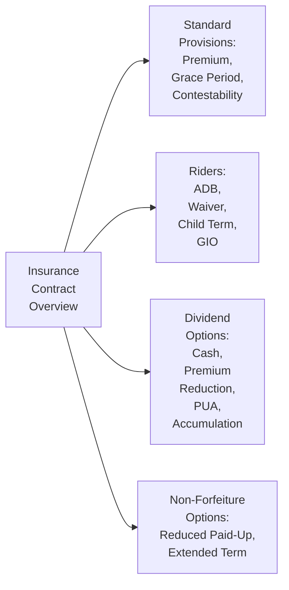

## 11.2 Policy Provisions, Riders, and Dividend Options

Have you ever opened up a life insurance policy document and felt like you were deciphering a secret code? Well, you’re not alone. Life insurance policies can be pretty intimidating at first. I still remember the first time I tried to read mine—so many terms, provisions, disclaimers—my head was spinning. But once you break it down, it’s not so bad. In fact, understanding these provisions can help you and your clients (if you’re a financial advisor) feel more confident and secure about future financial planning. 

Let’s walk through the most common elements of a life insurance contract—policy provisions, riders, and dividend options. We’ll also talk non-forfeiture provisions, which can be lifesavers if premium payments ever become a burden. Hopefully, by the end of this discussion, you’ll have a firm grasp of what all these features do, how they can be customized, and how to avoid the common pitfalls.

---

### Understanding Standard Policy Provisions

At its heart, a life insurance policy is a contract between two parties: the insurer and the policyholder (often the insured individual). This legal document outlines the rights, responsibilities, and obligations of both sides. Let’s break down some of the typical provisions you’re likely to encounter:

• Premium Payment: The policy states how much the premium is, how frequently it must be paid (monthly, quarterly, annually), and what happens if payments are late.  
• Coverage Period: Identifies when the coverage starts and under what circumstances it ends.  
• Grace Period: Even if you miss a payment deadline, most policies allow a grace period (often 30 days) during which coverage remains in force. This means that if death occurs during the grace period, the policy generally still pays out (though it might subtract any overdue premiums).  
• Contestability Period: Usually two years from the date the policy is issued, this is the window during which the insurer can investigate questionable or incomplete information in the application. If they find intentional misrepresentation or fraud, the policy might be voided or the claim denied.  
• Reinstatement Provision: If the policy has lapsed due to non-payment, many insurers allow the policyholder to reinstate the policy within a certain time (often up to two or three years after lapse), provided they pay arrears and, in many cases, prove insurability.  

Anyway, make it a habit to advise clients (or for yourself) to keep track of these provisions. They can be real lifesavers if anything ever goes off track.

---

### Grace Period in More Detail

The grace period is something I personally find very reassuring. It’s like an extra buffer if you forget a premium payment or if your bank account had “one of those days.” Typically, the grace period is 30 days (though some policies may specify 31 days or an even longer period). As long as the insured passes away within that grace window, the policy is generally considered in force, and the insurer will pay out the benefit (minus overdue premiums).

Imagine you’re preparing for a big family vacation. You have so many errands and bills that the premium payment slips your mind. If you miss the due date, you might start panicking that your coverage is gone. But you actually have those extra days to get caught up. In my opinion, it’s one of the more consumer-friendly features in life insurance.

---

### Contestability Period

This provision often makes people nervous, but it’s quite standard. Insurers typically set a two-year period during which they can investigate any misstatements or omissions in the insurance application. If they discover material misrepresentation—say, failing to mention a serious health condition—the company can deny the claim or even rescind the policy altogether.

• Why is this important? Because it protects insurers from fraudulent applications, which helps keep premiums more affordable for everyone.  
• How can policyholders protect themselves? By being honest and forthcoming during the application process.  

From experience, the best approach is full transparency. I once had a friend who forgot an old sports injury from college in his medical disclosures. It wasn’t intentional—he genuinely forgot about it. Months later, he learned about the possibility of the insurer rescinding coverage if it had been a major issue. Luckily, it wasn’t. But that easily could have been a huge headache. So, yeah, double-check your application details.

---

### Reinstatement Terms

Another provision that can come to the rescue is reinstatement. If your policy lapses because you missed payments beyond the grace period, many insurers permit a reinstatement—usually if you apply within a specific time frame (often two to three years) and can prove health hasn’t changed drastically. Of course, you’ll have to pay the missed premiums plus interest. This can sometimes be more cost-effective than getting an entirely new policy at older age-based rates.

Reinstatement can be a real game-changer if your financial situation was temporarily rocky (e.g., job loss or unexpected medical expenses). Just be mindful of the interest charges and the possibility you’ll need a fresh medical exam. If your health has significantly deteriorated, reinstatement might be an uphill battle.

---

### Riders and Endorsements

So, how do you make a life insurance policy feel more customized to your unique needs? This is where riders (also called endorsements) come in. Think of a rider like a special topping on an already good pizza. The pizza (the policy) is fine on its own, but sometimes you want something extra. Riders allow you to enhance or modify coverage.

Riders can add cost to your policy, but they can also add tremendous value. Here are some of the most popular ones:

• Accidental Death Benefit (ADB): If death occurs due to an accident, this rider provides an additional death benefit on top of the base policy.  
• Waiver of Premium: The insurer waives premium payments if you become disabled, while your coverage remains in force.  
• Child Term Rider: An affordable way to add term coverage for your children under your policy.  
• Guaranteed Insurability Option (GIO): This one can be a game-changer since it allows you to buy additional coverage at various future points—no health questions asked.  

Often, people who foresee changes in their family life or financial situation invest in riders to ensure they won’t have to requalify for coverage down the road. Let’s say you expect to have more children or take on bigger financial commitments. A GIO rider can spare you from unpleasant surprises if you develop health issues later and can’t pass a health exam.

---

### Common Life Insurance Riders: A Closer Look

Accidental Death Benefit:  
• Provides an additional payout (often doubling the face amount) if the death results from an accident.  
• Keep in mind, definitions of “accident” can vary by policy, and there may be exclusions.  

Waiver of Premium:  
• This rider is especially useful if you’re in a high-risk profession or if you simply want extra peace of mind.  
• If you get permanently disabled (as defined by the policy), the insurer takes over premium payments.  
• Disability definitions can vary—some define disability as the inability to do “any occupation,” while others define it as inability to perform “your own occupation.”  

Child Term Rider:  
• Enables you to extend a term life benefit to your children without taking out separate policies.  
• Ranch families or folks with multiple kids love this rider’s simplicity.  

Guaranteed Insurability Option (GIO):  
• Often available at significant life events (marriage, birth of a child) or on specified policy anniversaries.  
• Typically, the additional coverage you can purchase is limited to certain amounts.  

---

### Dividend Options in Participating Policies

If you hold a “participating policy,” you’re essentially sharing in the insurance company’s surplus or profits. When the insurer’s actual expenses are lower, and returns on investments are higher than projected, the policy might pay dividends. These dividends can be handled in a few ways:

• Cash Payment: You can just take the dividends in cash. Simple and direct.  
• Premium Reduction: Use dividends to offset your next premium payment, lowering your out-of-pocket expense.  
• Paid-Up Additions (PUA): Probably one of the more popular strategies. The dividends buy additional coverage, which has its own cash value and death benefit. Over time, this can compound the overall value of your policy.  
• Dividend Accumulation: Let the dividends sit with the insurer, typically earning interest at a declared rate. Think of it as a mini-savings account within your policy.  

Each option has pros and cons. Cash payment is straightforward but doesn’t help your policy grow. Paid-up additions give you extra coverage and build additional cash value, but there’s an opportunity cost if you wanted to invest that money elsewhere. Many financial planners do the math to see which choice best aligns with a client’s short-term and long-term goals.

---

### Non-Forfeiture Provisions

Let’s say you can’t make your premium payments anymore—maybe you lost your job or had a major personal setback—and you’ve already exhausted the grace period and reinstatement is not feasible or attractive. Non-forfeiture provisions help ensure you maintain some benefit from the premiums you’ve paid into the policy. The two most common non-forfeiture options are:

• Reduced Paid-Up Insurance: Converts your policy into a paid-up one at a lower coverage amount. You keep some life insurance without paying extra premiums.  
• Extended Term Insurance: Uses your policy’s accumulated cash value to buy term insurance for the full original face amount. Coverage remains in place as a term policy, but only for as long as the cash value can sustain it (e.g., 10 or 15 years).  

Why does this matter? Because you’ve likely been paying premiums for many years, and it’s nice to retain at least partial value if you can’t keep up the ongoing obligations. The choice usually depends on age, health, coverage needs, and the amount of built-up cash value in the policy.

---

### Practical Examples and Case Studies

Here are a few quick scenarios to shine some light on working with these provisions in real life:

1. Jonathan’s Grace Period Relief  
   Jonathan, an avid traveler, missed his life insurance premium due date because he was hiking in British Columbia with spotty phone reception. He came back home only to find that his premium payment was overdue. Fortunately, the policy had a 30-day grace period. Jonathan paid a few days late, but coverage was continuous, and he breathed a sigh of relief.

2. Emily’s Accidental Death Benefit Rider  
   Emily, a professional athlete, decided to add an Accidental Death Benefit rider to her life insurance. While she tries to stay safe, the added cost for the rider wasn’t too high, and she felt that it gave her and her family more financial security should the worst happen. A year later, she had a serious biking accident. She recovered, but she said it taught her the value of having that “extra layer” of coverage—just in case.

3. Paolo’s Dividend Options  
   Paolo owns a participating whole life policy. Four years in, the policy started paying small dividends. Paolo compared his options and ultimately chose Paid-Up Additions. He reasoned that if he reinvested the dividends, his coverage and cash value would accumulate over time. Ten years later, his policy’s death benefit and cash value are both meaningfully higher.

4. Sandra’s Non-Forfeiture Challenge  
   Sandra lost her job and had difficulty paying her premiums. After careful consideration, she decided on Reduced Paid-Up Insurance. The coverage amount is smaller than before, but at least she isn’t making any more premium payments. Sandra was happy she could hold onto something rather than lose everything she’d built up.

---

### Potential Pitfalls and Best Practices

• Pitfall #1: Not reading the fine print on riders. Some riders have strict definitions and exclusions. For instance, “accidental death” might exclude things like skydiving or other risky activities.  
• Pitfall #2: Overlooking the timing of guaranteed insurability. If you miss the window for adding more coverage, you might need to requalify based on your health status.  
• Pitfall #3: Ignoring your policy’s cash value. Sometimes, extended term coverage backfires if your coverage runs out exactly when you need it most.  
• Pitfall #4: Failing to update your policy or riders when your life situation changes (marriage, new children, mortgage, or business changes).  

As a best practice, put a note on your calendar or set up a reminder to review your policy once a year—maybe every time you do your taxes. Also, keep your insurance professional updated about any major life events. 

---

### Canadian Regulatory Considerations

In Canada, insurance companies are supervised by both federal and provincial regulators. Standards and guidelines may vary in certain respects by province, but overall, the Canadian regulatory framework ensures that insurers maintain adequate reserves and follow ethical conduct.

Since January 1, 2023, the two predecessor self-regulatory organizations for investment dealers and mutual fund dealers (IIROC and MFDA) have combined into the new Canadian Investment Regulatory Organization (CIRO). While CIRO’s mandate focuses on securities and marketplaces, insurance also intersects with the broader financial environment where consumer protection is paramount. For clarity, IIROC and MFDA are now defunct; CIRO is in place to oversee Canada’s investment dealers, mutual fund dealers, and market integrity across equity and debt marketplaces. 

If you’re looking for official regulatory information, including best practices and compliance updates, you can check with:

• The Canadian Investment Regulatory Organization (CIRO): [https://www.ciro.ca](https://www.ciro.ca)  
• The Financial Services Regulatory Authority of Ontario (FSRA): [https://www.fsrao.ca](https://www.fsrao.ca) (though each province may have its own insurance regulator)  

Additionally, the Canadian Investor Protection Fund (CIPF) is the country’s sole investor protection fund, protecting clients of insolvent members under CIRO’s oversight.

For insurance-specific resources and dispute resolution, consider:

• Canadian Life and Health Insurance Association (CLHIA): [https://www.clhia.ca](https://www.clhia.ca)  
• OmbudService for Life & Health Insurance (OLHI): [https://olhi.ca](https://olhi.ca)  

---

### Mermaid Diagram: The Flow of Insurance Contract Provisions

Below is a simple diagram illustrating how various provisions and riders fit within the life insurance policy framework.

• A represents the overall insurance contract.  
• B points to standard provisions like the grace period, reinstatement, and contestability.  
• C covers adding riders: accidental death benefits, child term coverage, waiver of premium, and more.  
• D focuses on the dividend choices that participating policyholders can make.  
• E shows the non-forfeiture provisions, ensuring the policyholder doesn’t walk away empty-handed if premiums are no longer feasible.

---

### References for Further Exploration

• Canadian Life and Health Insurance Association (CLHIA):  
  [https://www.clhia.ca](https://www.clhia.ca) – A cornerstone resource for industry guidelines, consumer information, and policy best practices.  

• OmbudService for Life & Health Insurance (OLHI):  
  [https://olhi.ca](https://olhi.ca) – Offers dispute resolution services if you ever have problems with a life or health insurance claim.  

• “Reference Document on Life Insurance Illustrations” (CLHIA):  
  Great for understanding how insurers illustrate dividend projections and rider benefits in policy documents.  

• Courses from Advocis or CSI:  
  Ideal if you want a deep dive. Advocate-level courses can show how to integrate advanced insurance planning into broader financial planning.  

• “Insurance Planning in Canada” by Hoyes & McDermott:  
  A well-respected book for an in-depth look at how different insurance types work and how they fit Canadian regulations.  

• Financial Services Regulatory Authority (FSRA) of Ontario:  
  [https://www.fsrao.ca](https://www.fsrao.ca) – Offers up-to-date information on Ontario regulations, with parallels in other provinces.  

• CanLII (Canadian Legal Information Institute):  
  [https://canlii.org](https://canlii.org) – A searchable database for case law if you want to see how courts interpret and rule on disputes over insurance provisions.  

---

### Final Thoughts

Life insurance is one of the fundamental pillars of a solid financial plan. By understanding the provisions of your policy and knowing how riders and dividend options can work in your favor, you can tailor coverage to your unique needs or those of your clients. Non-forfeiture options offer a safety net if everything hits the fan, so the money you’ve put in doesn’t go entirely to waste.

As always, keep your coverage updated as life evolves—marriage, kids, property purchases, business ventures, you name it. A simple annual check-in can go a long way toward ensuring you’re getting the best protection for the best value.

Now that we’ve peeled back the layers of life insurance provisions, it’s your turn to dive into your own policy documents. You might just find some untapped benefits (or pitfalls) you never knew existed. And if you’re advising clients, your new knowledge will help you deliver better services and solutions for their long-term financial health.

Remember, this information is for educational purposes only and doesn’t replace professional advice. Speak to a licensed insurance advisor, lawyer, or accountant for personalized recommendations. In Canada, insurance is also regulated at the provincial level, so always confirm details in your specific jurisdiction.

Take heart: that “dense” policy contract is friendlier than it looks once you know what to look for!

---

## Test Your Knowledge: Policy Provisions, Riders, and Dividend Options



### Which provision typically allows a policyholder to miss a premium payment temporarily without losing coverage?

- [ ] Contestability period
- [ ] Reinstatement
- [x] Grace period
- [ ] Dividend option

> **Explanation:** The grace period ensures that, for a specified timeframe after the premium due date, coverage remains in effect despite non-payment. If the insured dies during the grace period, insurers typically pay the claim (minus overdue premiums).

### Which policy modification allows you to buy additional coverage in the future without proving insurability?

- [ ] Accidental Death Benefit
- [ ] Waiver of Premium
- [x] Guaranteed Insurability Option
- [ ] Child Term Rider

> **Explanation:** The Guaranteed Insurability Option rider enables you to increase your coverage at certain intervals or life events, bypassing additional health exams.

### Which choice is NOT a common dividend option offered in participating policies?

- [ ] Taking the dividend in cash
- [ ] Using the dividend to reduce premiums
- [x] Forfeiting dividends to the insurer
- [ ] Applying the dividend toward buying paid-up additions

> **Explanation:** Policyholders generally have the right to receive dividends in some manner (cash, premium reduction, paid-up additions, or accumulation). Simply forfeiting dividends to the insurer is not typically presented as an option.

### What is the purpose of a contestability period in a life insurance policy?

- [ ] It allows the insurer to invest the policy’s premium in contested markets.
- [ ] It ensures coverage while you protest premium hikes.
- [x] It gives the insurer time to investigate misrepresentations in the application.
- [ ] It reduces the waiting period for coverage to become active.

> **Explanation:** The contestability period provides a two-year window (on average) during which the insurer may deny a claim or void a policy if serious misrepresentations or fraudulent information come to light.

### Under which rider does the insurance company waive future premium payments if the policyholder becomes disabled?

- [ ] Accidental Death Benefit
- [ ] Child Term Insurance
- [x] Waiver of Premium
- [ ] GIO Rider

> **Explanation:** The Waiver of Premium rider is specifically designed so that if you meet the insurer’s definition of disability, future premium payments are waived while coverage remains active.

### What is the typical outcome if the insured dies during the grace period and the premium hasn’t been fully paid?

- [x] Death benefit is paid minus the overdue premium.
- [ ] Claim is denied in full.
- [ ] Contestability period restarts.
- [ ] Policy is reinstated.

> **Explanation:** The standard practice is to pay out the death benefit but subtract any unpaid premium from the total payout.

### Which of the following is NOT a standard non-forfeiture option?

- [ ] Extended Term Insurance
- [ ] Reduced Paid-Up Insurance
- [ ] Cash Surrender Value
- [x] Dividend Accumulation

> **Explanation:** Dividend Accumulation is a dividend option rather than a non-forfeiture option. Common non-forfeiture options include Extended Term Insurance and Reduced Paid-Up Insurance. Cash Surrender Value is another avenue when you give up the policy.

### Which rider provides additional coverage in case your children pass away before reaching a certain age?

- [ ] GIO Rider
- [x] Child Term Rider
- [ ] Accidental Death Benefit
- [ ] Waiver of Premium

> **Explanation:** A Child Term Rider extends term coverage to the insured’s children under the same policy, providing a death benefit for each insured child if needed.

### What is one key difference between “Paid-Up Additions” and “Dividend Accumulation” as dividend options?

- [x] Paid-Up Additions purchase additional coverage; Dividend Accumulation leaves dividends with the insurer to earn interest. 
- [ ] Paid-Up Additions only applies if you file a disability claim; Dividend Accumulation is automatic.
- [ ] Paid-Up Additions require you to surrender your base policy; Dividend Accumulation lowers the death benefit. 
- [ ] There is no difference; they mean the same thing.

> **Explanation:** Each dividend option works differently. Paid-Up Additions let you purchase extra insurance coverage, while Dividend Accumulation means you leave the money with the insurer to collect interest.

### True or False: Reinstatement typically allows you to revive a lapsed policy, but you may need to pay overdue premiums and demonstrate good health.

- [x] True
- [ ] False

> **Explanation:** Reinstatement provisions often require payment of all missed premiums plus interest, and insurers may need evidence of insurability, especially if a significant amount of time has passed since lapse.


