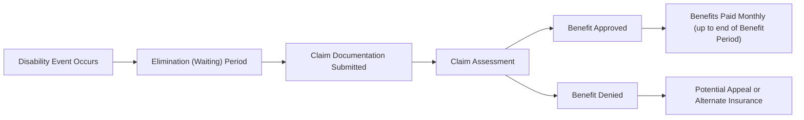

## 12.1 Disability Insurance

So, let’s talk disability insurance. Have you ever thought about how you’d cover your expenses if you suddenly couldn’t work because of an illness or injury? At first, it’s kind of scary—it can feel like we’re tempting fate just by thinking about it. But trust me, it’s so important to plan ahead. That’s exactly what disability insurance is for: to help replace at least part of your lost income when life tosses you that proverbial curveball.

Below, we’ll walk through the essentials—like the different definitions of disability, how long your benefits might last, and which riders you might add to a policy. We’ll also discuss how disability insurance fits into the bigger financial planning context. You’ll see references to other chapters in this course (Insurance to Protect Income and Savings, Tax Planning, even aspects of Financial Planning for Small Business) because, in reality, everything in personal finance is connected. So let’s jump in.

## Why Disability Insurance Matters

Disability insurance is designed to replace a portion of your income if you’re prevented from working due to illness or injury. Think about it: most of us rely on our paycheques to fund daily living expenses—housing, food, utilities, maybe a Netflix subscription. If that income stream disappears overnight, the financial strain can be enormous. That’s why an advisor typically starts with a needs analysis that considers monthly living expenses, any emergency savings, and potential coverage from government or employer-sponsored programs.

Here’s a little personal anecdote: I once met a client who assumed that her short-term savings would see her through any disability. But when a significant health challenge kept her away from work for six months, she nearly went through all those emergency funds. Without supplementary disability coverage, it would have been much worse. This scenario is surprisingly common—and underscores why you or your clients need to think carefully about protection.

## Understanding the Basics

Let’s explore some essential concepts and terms that often come up when we talk about disability insurance. 

• Definition of Disability: Policies can define disability in different ways. You might have heard of “own occupation,” “regular occupation,” or “any occupation.” If a policy uses an “own occupation” definition, you can receive benefits if you cannot perform the substantial duties of your specific job. Under an “any occupation” definition, you only qualify if you are unable to do any job that suits your education, training, or experience. 
• Benefit Period: This is the maximum length of time that benefits will be paid. Short-term disability might cover a few months, while long-term disability could go on until age 65 or even for life (though that’s less common in Canada). 
• Elimination (Waiting) Period: This is how long you must be disabled before benefits start. Common waiting periods range from 30 to 120 days. A longer waiting period generally reduces premiums, but it also means you’ll need enough savings or other coverage to get you through that period. 
• Tax Considerations: If you pay your premiums personally with after-tax dollars, any benefits you receive are typically non-taxable. On the other hand, if your employer covers the premiums, the benefits may be taxable. 

## Types of Definitions: Own Occ vs. Reg Occ vs. Any Occ

Many folks think “disability is disability,” but how it’s defined can shape your entire claims experience. Let’s drill down:

• Own Occupation: 
  - If you can’t perform the major tasks of your current or most recent occupation, you can qualify for benefits even if you theoretically could do some other job. 
  - Typically comes with higher premiums (since it offers broader coverage).

• Regular Occupation (Reg Occ): 
  - Very similar to “own occupation,” but sometimes includes expansions or limitations such that if you’re able to do similar job duties in the same line of work, you may not qualify. 
  - Premiums can be moderate, especially if the wording is close to own occupation.

• Any Occupation: 
  - Possibly the strictest definition: you must be unable to work in any job that you’re reasonably suited for, given your education, training, or experience. 
  - Tends to have the lowest premiums, but the strictest claim criteria.

A lot of times, high-income professionals—like physicians or lawyers—opt for an own occupation definition to maintain a sense of “occupation-specific” security. Individuals in more generalized fields might be okay with a less expensive but narrower “any occupation” definition. It all depends on personal risk tolerance, finances, and career path.

## Short-Term vs. Long-Term Benefits

Let’s face it, we usually focus on “the big one”—the catastrophic incident that leaves us disabled for a long period. But short-term disabilities can also wreak havoc, at least temporarily. For instance, you might break an arm or need unexpected surgery and miss work for a few weeks or months:

• Short-Term Disability (STD): 
  - Often provided as group insurance by employers. 
  - Covers from the end of sick days (if you have them) to a few months, usually up to 26 weeks. 
  - Lower benefit amounts, but easier to get a claim approved because it typically involves a straightforward, short-term medical condition.

• Long-Term Disability (LTD):
  - Typically starts after an elimination (waiting) period—often 90 or 120 days. 
  - The coverage can last two years, five years, or even to age 65 (the most common end date). 
  - The cost of LTD is higher because there’s a greater chance you’ll need benefits for a truly extended period.

## Determining Coverage Needs

So how much coverage does one actually need? Great question. And, well, it depends on your monthly expenses, your family situation, whether you have dependents, your group coverage at work, your tolerance for risk, and how many Netflix subscriptions you absolutely refuse to give up in a crisis. Advisors typically follow these steps:

1. Evaluate Current Expenses: Calculate the monthly costs for housing, groceries, utilities, etc. 
2. Factor in Other Income Streams: Do you have an emergency fund (and for how many months)? Does your employer provide group disability? Are you eligible for CPP/QPP disability if you are severely disabled? 
3. Consider Elimination Period and Benefit Period Options: For instance, a 90-day elimination period might be cheaper, but do you have three months’ worth of savings to cover your bills during that time? 
4. Assess Policy Riders: Future purchase options, cost-of-living adjustments, and partial disability coverage can help tailor the policy to your needs.
5. Keep the Premiums Manageable: The best disability coverage is one that you can sustain paying for the long haul.

In Chapter 2 on Net Worth and Cash Management Planning, we talk about how to budget for insurance premiums. You want to ensure your budget can handle these monthly or annual payments for disability insurance—otherwise, you might be tempted to drop coverage exactly when you need it most.

## Provincial and Federal Safety Nets

In Canada, we’re fortunate to have some level of government support, although the coverage and eligibility can vary:

• Workers’ Compensation (Provincial): 
  - For employees injured on the job or who develop work-related illnesses. 
  - Benefits can include medical benefits, partial wage replacement, or rehabilitation coverage. 
  - But if you’re self-employed or your injury wasn’t job-related, you wouldn’t be covered.

• CPP/QPP Disability: 
  - If your disability is “severe and prolonged,” you may qualify for a monthly disability pension from the Canada Pension Plan (CPP) or Québec Pension Plan (QPP), depending on where you reside. 
  - The eligibility thresholds are high—you typically can’t do any gainful work.
  - The amount is often less than your working income, so it’s usually not sufficient to meet all monthly financial obligations.

• EI Sickness Benefits: 
  - Part of Employment Insurance, offering temporary financial assistance (up to 15 weeks) to those who can’t work due to illness or injury, provided they meet certain criteria.

Because government programs might only provide partial coverage (and often with a stricter definition of disability), many advisors recommend layering private disability insurance on top of these programs.

## Policy Structures and Riders

Policy riders are like the “add-ons” to your phone plan—but hopefully a tad more useful. They broaden or modify coverage to suit specific needs:

• Cost-of-Living Adjustment (COLA) Rider: 
  - Adjusts your benefit amount upward if inflation rises. 
  - Important for long-term claims where the purchasing power of a fixed benefit might erode over time.

• Future Purchase Option: 
  - Allows you to increase coverage later without proving medical insurability—great for younger professionals expecting income growth.

• Partial or Residual Disability Benefit: 
  - Pays a portion of the full benefit if you’re only partially disabled or can still work in some capacity but at a reduced income.

• Return-of-Premium Rider: 
  - In some cases, if you never claim on your policy or if you only claim minimally, you could get a portion of your premiums returned at a specific date (though this feature can make your premiums significantly higher).

## Taxation of Disability Benefits

Nobody wants a surprise come tax time. The short version is this: if you pay your own premiums with after-tax dollars, then any benefits you receive are generally tax-free. If your employer pays the premiums and doesn’t attribute that as a taxable benefit to you, then the benefits are taxable. 

For entrepreneurs or small-business owners (see Chapter 15: Financial Planning for Small Business), figuring out how best to distribute premiums—personally vs. through the business—can be a significant consideration. It’s crucial to examine all angles to avoid unexpected tax liabilities.

## A Quick Viewing of the Disability Insurance Claim Process

Sometimes, it helps to visualize how a disability insurance claim might unfold. Check out the Mermaid diagram below for a simplified path of how benefits flow after a claim event:

• A (Disability Event Occurs): You become disabled from an illness or injury.  
• B (Elimination Period): You wait the specified period (e.g., 90 days) before benefits begin.  
• C (Claim Documentation Submitted): You provide forms, medical reports, etc.  
• D (Claim Assessment): The insurer reviews your claim to ensure you meet the policy definition.  
• E (Benefit Approved): Monthly benefits start flowing.  
• F (Benefit Denied): If you don’t meet the definition, you might dispute or look for alternative sources.  
• G (Benefits Paid Monthly): Continue to receive benefits until you recover, reach the end of your benefit period, or otherwise no longer qualify.  
• H (Potential Appeal or Alternate Insurance): If denied, you might challenge the decision or rely on other coverage such as government disability or a group plan.

## Application and Underwriting

When applying for an individual disability policy, be prepared for a thorough underwriting process. Insurers will look into your:

• Medical History: Detailed questions about past surgeries, illnesses, or ongoing conditions.  
• Occupational Classification: The safer and more “white-collar” your job, the lower the premium. Manual labor or hazardous occupations cost more.  
• Financial Qualifications: They want to confirm your stated income to prevent over-insurance (since disability insurance typically covers a percentage of your income, not 100%).  
• Lifestyle Factors: High-risk hobbies (e.g., skydiving) can lead to exclusions or premium surcharges.

It can be a bit of a hassle, but the thorough process ensures that the policy is appropriately priced for your risk profile.

## Integration with Employer-Sponsored Plans

If your employer offers group disability coverage, that’s awesome—it often comes at a discounted rate. But group coverage also has limitations:

• It might replace only a portion of your base salary, ignoring bonuses or commissions.  
• If your employer pays the premiums, the benefits might be taxable to you.  
• Coverage can end if you leave your employer or if the plan is canceled.  

This is where a supplemental individual policy can fill the gaps. In an ideal scenario, your group plan plus any private plan would cover enough of your regular income to keep you financially afloat.

## Special Considerations for Self-Employed Individuals

When you’re self-employed, you don’t have a built-in safety net from an employer. This means you have to be more proactive:

• Plan for Longer Elimination Periods: You might choose a 90- or 120-day waiting period if you have sufficient savings.  
• Flexible Benefit Periods: Some self-employed individuals opt for coverage to age 65, especially if they rely on specialized skills they can’t easily transfer to a new role.  
• Verify Your Income: Because your business revenue can fluctuate, be prepared to show consistent income over the past few years, and talk to your insurer about how they handle coverage if your income changes significantly year to year.

## Common Pitfalls and How to Avoid Them

1. **Underestimating the Risk**: It’s easy to feel “invincible,” especially when you’re younger. However, accidents and illnesses can happen at any stage of life.  
2. **Relying Solely on Employer Coverage**: Group coverage is a great start, but it often ends when your job does (voluntarily or involuntarily).  
3. **Choosing the Cheapest Policy**: An “any occupation” definition might come with lower premiums but can be near-impossible to claim on if you’re still able to do some type of work.  
4. **Ignoring Inflation**: Without a COLA rider, you might find your benefit doesn’t keep pace with rising costs.  
5. **Forgetting to Update Coverage**: As your income or family situation changes (e.g., you get married, have children), you might need more coverage.  

Keeping your coverage updated and balanced is essential. You don’t want to be over-insured, paying sky-high premiums you don’t need, or underinsured, risking a significant financial gap during a disability.

## Regulatory and Compliance Considerations

In Canada, disability insurance is regulated provincially but also involves federal guidelines for solvency and consumer protection. Notable points:

• CIRO (Canadian Investment Regulatory Organization):  
  - If you’re an insurance advisor who also deals with securities, you’ll need to be registered with CIRO—Canada’s new self-regulatory body as of January 1, 2023, which replaced the now defunct MFDA and IIROC.  
  - CIRO has oversight on the conduct of investment dealers and mutual fund dealers.

• Provincial Insurance Licensing:  
  - You must hold a provincial insurance license to recommend or sell disability insurance. This is separate from your securities license.  
  - Provincial regulators require continuing education credits and adherence to insurance regulations under the Insurance Act of your province.

• OSFI (Office of the Superintendent of Financial Institutions):  
  - Oversees solvency requirements for federal insurance companies, ensuring they have enough reserves to pay out claims.  
  - OSFI guidelines can impact how insurers structure their products and the premiums they charge.

• CIPF (Canadian Investor Protection Fund):  
  - Strictly for investors if a member firm becomes insolvent (and separate from insurance—but understanding the broader financial environment can help you reassure clients about the stability of their investments).  
  - CIPF took over from the former MFDA IPC after the SROs amalgamated.

Staying compliant is crucial. If you’re new to disability insurance or uncertain about the rules, consult resources published by your provincial regulator and check out CIRO’s official site at https://www.ciro.ca for the latest guidelines.

## Real-World Case Study: Balancing Coverage and Budget

Imagine a scenario with Laura, a 35-year-old freelance graphic designer. She’s single, without kids, and nets about $4,500/month. After analyzing her budget, she realizes she needs about $3,000/month to cover rent, utilities, groceries, and minimal savings. She’s got $10,000 in an emergency fund. Here’s how she approached her disability coverage:

• Elimination Period: She chose a 90-day elimination period, which means she’ll rely on her emergency fund for the first three months if she’s disabled.  
• Benefit Period: She chose a policy that covers her to age 65, providing $3,000/month in benefits, so she can maintain her basic living standard.  
• “Own Occupation” Definition: Laura’s specialized work as a designer includes tasks only a graphic designer can do. She wants to ensure that if she can’t use her creative/design skills due to a disability, she’ll receive benefits—even if she could do, say, a desk job in another field.  
• Riders: She added a cost-of-living adjustment and a future purchase option, anticipating that her freelance income might grow.  

Because of these decisions, her premiums weren’t the absolute lowest, but they gave her peace of mind. She knew that if a disability occurred, she wouldn’t be panicking about income.

## Best Practices for Advisors

1. Conduct a Thorough Needs Analysis: Start with how much income a client needs to replace.  
2. Understand Employment Context: Are they self-employed, an employee with group benefits, or a contractor?  
3. Clarify the Definitions: Own occ vs. any occ. This detail can make or break a claim.  
4. Explore Policy Riders That Provide Extra Value: For instance, a partial disability rider can be vital for someone whose income might be partially reduced by an illness.  
5. Stay Updated on Regulations: Check regularly for changes in provincial acts, CIRO guidelines, OSFI directives, or new government benefit programs.  
6. Document Client Discussions: Keep thorough records to ensure compliance and to protect yourself if a claim or coverage dispute arises.

## Helpful Resources

• Provincial Insurance Acts: Search for the “Insurance Act” in your province for specific rules on disability coverage.  
• CIRO: https://www.ciro.ca – Canada’s current self-regulatory body for investment dealers and mutual fund dealers.  
• OSFI: https://www.osfi-bsif.gc.ca – Read about the solvency requirements for insurance companies.  
• Government of Canada on CPP Disability: https://www.canada.ca/en/services/benefits/publicpensions/cpp/cpp-disability-benefit.html  
• “Canadian Life and Health Insurance Facts” by the Canadian Life and Health Insurance Association (CLHIA) – A comprehensive annual publication with stats and industry insights.  
• “The Tools & Techniques of Insurance Planning and Risk Management” by Stephan R. Leimberg – A more in-depth textbook on strategy and product selection.

## Bringing It All Together

Anyway, the main takeaway is that disability insurance is like a financial safety net. The definitions, elimination period, benefit period, riders, and the interplay of other coverage (government, employer, etc.) all affect how well it protects you or your client. There’s a lot to consider, right? But with careful planning, you’ll find a policy that fits your risk tolerance, budget, and life situation.

No one wants to imagine becoming disabled. But ignoring the possibility can be a serious oversight in a financial plan. A well-built disability insurance policy can help you keep the lights on, pay the rent or mortgage, and focus on recovery rather than finances. It’s an essential pillar of risk management—one that advisors and their clients simply can’t afford to overlook.

---

## Test Your Knowledge: Disability Insurance Essentials Quiz



### Disability insurance is primarily designed to:

- [ ] Provide life insurance coverage in the event of death.
- [x] Replace a portion of the insured’s income due to illness or injury.
- [ ] Offer emergency home repair benefits.
- [ ] Guarantee investment returns.

> **Explanation:** Disability insurance isn’t life insurance. Its main purpose is to protect your income if you can’t work because of an illness or an injury.

### Which definition of disability generally provides the broadest scope of coverage?

- [x] Own occupation
- [ ] Regular occupation
- [ ] Any occupation
- [ ] No occupation

> **Explanation:** “Own occupation” typically provides the most comprehensive coverage because you qualify for benefits even if you could work in a different role outside your exact occupation.

### How does the elimination (waiting) period in a disability insurance policy affect premiums?

- [x] A longer waiting period generally lowers premiums.
- [ ] A longer waiting period always increases premiums.
- [ ] It has no impact on premiums.
- [ ] A longer waiting period means premiums must be paid in a lump sum.

> **Explanation:** The waiting period is the time before benefits begin. Longer waiting periods reduce the insurance company’s risk and typically lead to lower premium costs.

### If your employer pays the premiums for your disability insurance plan and does not count this as a taxable benefit to you, then:

- [x] Benefits are considered taxable when received.
- [ ] Benefits are always non-taxable when received.
- [ ] You cannot collect benefits.
- [ ] The policy is automatically void.

> **Explanation:** Employer-paid premiums usually mean that any future benefits you collect are taxed as income, whereas personally paid premiums (using after-tax dollars) generally result in non-taxable benefits.

### Which of the following is a rider that adjusts your benefit to keep pace with rising living costs?

- [x] Cost-of-Living Adjustment (COLA)
- [ ] Future Purchase Option
- [x] Partial or Residual Disability Benefit
- [ ] Return-of-Premium Rider

> **Explanation:** COLA allows the benefit to increase over time in line with inflation, so your real purchasing power is maintained.

### In Canada, who is responsible for overseeing the solvency of federally regulated insurance companies?

- [x] OSFI (Office of the Superintendent of Financial Institutions)
- [ ] Canada Revenue Agency (CRA)
- [ ] CPP/QPP
- [ ] Workers’ Compensation Board

> **Explanation:** OSFI ensures insurance companies maintain adequate capital reserves to meet their obligations.

### Which statement best describes a “partial (residual) disability” benefit?

- [x] It provides a partial benefit if you cannot perform some job duties or experience reduced income due to partial disability.
- [ ] It fully replaces your salary during any disability.
- [x] It only applies if your disability is work-related.
- [ ] It is a government program replacing CPP/QPP.

> **Explanation:** A “partial” or “residual” benefit is specifically designed for individuals who can still work some but experience reduced income.

### If an individual has an “any occupation” policy definition for disability, it means:

- [x] They must be unable to perform any job reasonably suited to their education, training, or experience.
- [ ] They are covered if they cannot perform their specific occupation.
- [ ] They are automatically approved for disability benefits.
- [ ] They only qualify if they are hospitalized.

> **Explanation:** “Any occupation” is the strictest definition; you only qualify if you can’t do any job you’re trained or educated to perform.

### One key benefit of a future purchase option (FPO) rider is:

- [x] You can increase your coverage later without additional medical evidence.
- [ ] It automatically doubles your benefits every five years.
- [ ] It guarantees your premiums will not increase.
- [ ] It acts as life insurance inside your disability policy.

> **Explanation:** An FPO rider allows you to lock in your insurability at the outset, so if your income rises later, you can increase coverage without medical underwriting.

### True or False: CIRO is the national self-regulatory body that currently oversees both investment dealers and mutual fund dealers in Canada, having replaced the former IIROC and MFDA.

- [x] True
- [ ] False

> **Explanation:** As of January 1, 2023, the MFDA and IIROC amalgamated into the Canadian Investment Regulatory Organization (CIRO), the new self-regulatory organization in Canada.


