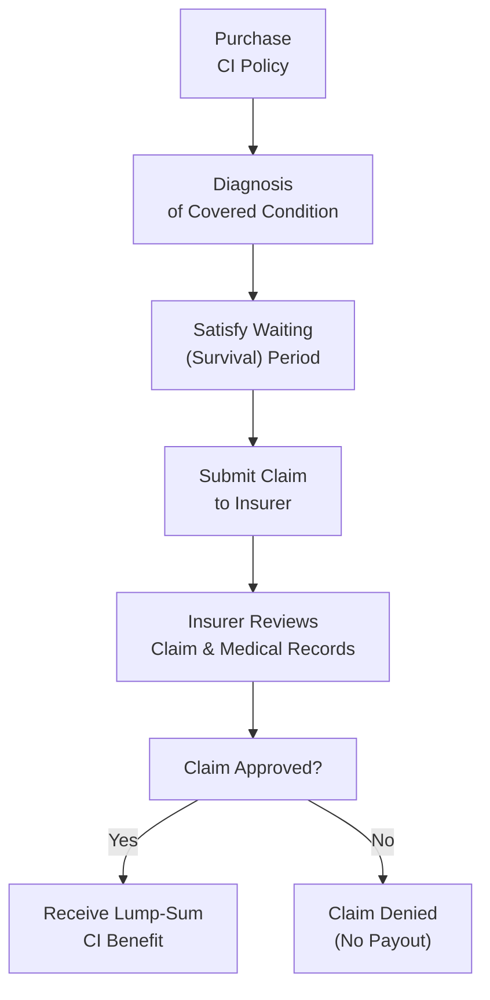

## 12.2 Critical Illness Insurance

Picture this: You’re out one sunny Saturday morning, enjoying a coffee, and your phone rings. You find out a close friend has just been diagnosed with a major, life-threatening health condition. Everything stops. The immediate emotions come rushing in—worry, fear, confusion. And you might start wondering: “How on Earth will they stay financially afloat through medical treatments, specialized care, and time off work?” In some cases, the answer might come from critical illness insurance.

Critical illness insurance (CI insurance) is all about receiving a lump-sum payment if you’re diagnosed with a covered condition—often a major one like cancer, heart attack, stroke, or multiple sclerosis. Unlike disability insurance (which provides a monthly or weekly income replacement if you’re unable to work), critical illness insurance offers a single, tax-free amount to help you handle the big financial burdens that can show up alongside a severe illness or health event. That might include paying your mortgage, upgrading your home for wheelchair access, exploring specialized treatments, or simply covering everyday living expenses so you can concentrate on recovery.

In this section, we’ll walk through how critical illness insurance fits into a broader financial plan, the types of coverage available, and all the pivotal details—like definitions of conditions, waiting periods, expansions, or riders that can sweeten your policy. We’ll also dig into how premiums are determined and what you should think about when you or your clients are looking to add critical illness insurance to the overall plan.

Remember, as an advisor or a savvy consumer, your primary goal is to protect income and savings from the “what if” scenarios that life tosses our way. After all, no one plans on facing cancer or organ failure. But if that day does come, you’ll be relieved to have a financial cushion in your corner.

--------------------------------------
  
Protecting Income and Savings: Where CI Insurance Fits  

When you look at Chapter 12 in this book, you’ll see a variety of insurance solutions aimed at protecting your income and savings. Disability insurance (discussed in Section 12.1) handles lost or reduced income if an individual can’t work for an extended period. That coverage typically comes in the form of periodic income replacement—like a paycheck you receive each month from the insurer. But critical illness insurance is different. It issues a lump-sum benefit upon diagnosis of a covered, life-threatening condition. It’s not necessarily tied to whether or not you can keep working.  

Let’s say a 45-year-old father of two is diagnosed with Stage 2 colon cancer, but he can still perform some tasks in his job from home. He might not receive disability insurance benefits if his ability to work remains largely intact. However, with critical illness insurance, as soon as the diagnosis meets the policy definition—assuming he survives the required waiting period—he could receive the entire coverage amount (for example, $100,000) in one shot. That money could be used to pay for out-of-province treatment or hire a private nurse at home, or even support his family if he decides to reduce working hours to rest and recover fully.

In short, critical illness insurance can relieve a lot of the financial pressure that accompanies a shocking diagnosis. Rather than recasting your entire budget or digging into savings, you potentially have a chunk of tax-free money ready to go.

--------------------------------------

Covered Conditions: The Heart of CI Policies  

Critical illness insurance typically covers the “big three” conditions—cancer, heart attack, and stroke. But in Canada, most comprehensive policies also cover coronary artery bypass surgery, major organ transplant, kidney failure, multiple sclerosis, and other severe illnesses. Depending on the insurer, the coverage list might exceed 20+ conditions, but coverage can vary drastically:

• Basic Coverage: Might include only heart attack, stroke, cancer.  
• Extended Coverage: Could include a wide array of ailments such as Alzheimer’s disease, paralysis, major burns, blindness, deafness, Parkinson’s disease, occupational HIV infection, and more.

At first glance, it can be tempting to choose the policy that covers the longest list of illnesses. But, you also need to read the fine print. Each condition has a precise definition: for instance, what does the insurer count as a “heart attack”? They may require evidence of certain enzymes in the bloodstream, or a typical electrocardiogram reading. Similarly, “cancer” might exclude early-stage or localized forms.

To illustrate just how nuanced this can be, imagine your client is worried about early-stage prostate cancer. You might find that some CI insurance policies will pay a reduced or partial benefit if the illness is considered early-stage (e.g., an “early payout provision”), while others might only provide a payout for advanced stages. Ensuring that policy definitions match your client’s concerns and genetic predispositions is a critical step in your role as an advisor—or for your own financial planning if you’re selecting coverage.

--------------------------------------

Keys to Policy Structure: Waiting Periods and Survival  

When you examine a critical illness policy, you’ll note two important phrases: “waiting period” and “survival period.” They can be easy to overlook but can also be make-or-break in terms of coverage.  

• Survival Period: This is the period you must outlive your diagnosis before you are eligible for the lump-sum payment. In many policies, the survival period is set at 30 days, though it can vary. For instance, if you pass away within 29 days of diagnosis, your critical illness claim might not pay out.  

• Waiting Period (CI Insurance): Sometimes this term is used interchangeably with “survival period,” though, in some contracts, the waiting period might refer to a pre-existing condition clause or a timeline that must pass after the policy’s start date before coverage truly begins.  

Let’s say you’re diagnosed with a covered condition on Day 20 of your brand-new policy—but the coverage has a 90-day waiting period specific to that illness. The diagnosis might not be considered covered if it comes within the waiting period. Alternatively, if your policy’s definition of “cancer” includes a 30-day survival period, you must live at least 30 days after you’ve met the definition of that illness.  

Though it can sound harsh, the reason for these requirements is to ensure the policy covers strictly those events that truly fit the parameter of a “life-threatening condition,” and that the insured client has actually survived that initial crisis point.

--------------------------------------

Case Study: Julia’s Stroke Diagnosis  

Let’s talk about Julia, age 52, a non-smoker with a corporate job. She purchased a critical illness policy for $150,000 coverage, which included the typical 30-day survival requirement post-diagnosis. One morning, she experienced a major stroke. Julia was immediately hospitalized. Thankfully, 35 days later—having survived beyond the survival period—she submitted a claim. After verifying her condition matched the policy definition of “stroke,” the insurer approved a full $150,000 lump-sum payment.

Julia used a portion of the proceeds to hire an in-home therapist to assist in her recovery. She also had to reconstruct her kitchen and bathrooms with accessibility features—ramps, railings, lower counters. Because her policy guaranteed a payment for a covered condition once she survived the waiting period, she avoided dipping into her RRSPs or negotiating lines of credit.  

This single scenario highlights why survival and waiting periods matter. If her stroke had been less than the severity threshold in the policy’s definition—or if she had passed away before the 30-day mark—her beneficiaries might not have received a payout.

--------------------------------------

Return-of-Premium Options: “Getting Something Back”  

One interesting add-on (rider) that many clients find attractive is the Return-of-Premium (ROP) feature. With ROP, if you go through the entire policy term claim-free—meaning you never make a claim—you can get some or all of your premiums reimbursed. It’s a bit like telling your insurance company, “If I never get diagnosed with a critical illness, I’d like my money back, please!”  

The ROP option can vary:    
• Return of Premium Upon Policy Expiry: If your policy ends at age 65, you might receive your cumulative premiums back if you never made a claim.  
• Return of Premium Upon Death: If you pass away from a cause not covered by the policy, your beneficiaries might receive the premiums as a death benefit.  
• Return of Premium on Cancellation: Some plans let you cancel your coverage after a specified period—say, 15 years—and recoup some portion of your premiums.

However, these riders push up the cost of the policy. The insurer recognizes that they might end up giving you your money back, so they build that risk into the premium. If your budget is tight, you might find that skipping ROP keeps your coverage more affordable. On the other hand, if you like the peace of mind in knowing your premiums will return to you if you remain healthy, then ROP can make sense.

--------------------------------------

Additional Riders and Enhancements  

Some insurance carriers allow you to tack on riders or enhancements that enlarge or customize your coverage:

• Partial Payouts: Suppose your policy includes a partial payout rider. If you develop an early-stage cancer or a less severe heart issue that meets the policy’s specifications (but not the full severity level for a lump-sum claim), you may qualify for, say, 25% of your coverage limit.  

• Child Coverage: Policies sometimes add coverage for dependent children at little extra cost. This rider might provide lower levels of coverage if a child is diagnosed with a serious illness—like a pediatric cancer or other rare conditions.  

• Early Payout Provisions: Some carriers offer an “early detection” rider. If your health event is discovered at an early stage (e.g., Stage 0 or 1 cancer), your benefit might be triggered earlier, potentially in part.  

• Multiclaim Options: A policy might allow multiple claims if you experience more than one critical incident, subject to certain conditions. For instance, if you receive a payout for invasive cancer and then, after recovery, you have a stroke a few years later, the policy might pay out again—though typically at a reduced benefit.  

--------------------------------------

How Premiums are Calculated  

Because critical illness insurance pays a lump-sum benefit, insurers analyze your risk profile carefully. A few main factors:

1. Age: The older you are, the more expensive coverage becomes because you’re statistically more likely to develop a covered condition.  
2. Sex: In general, women and men have different life expectancies and different disease predispositions, which affect their premiums.  
3. Smoking Status: Smokers almost always face higher premiums due to an increased risk of heart attacks, cancer, and related conditions.  
4. Family Medical History: If your parents or siblings have had certain hereditary conditions, the insurer might raise your premiums.  
5. Scope of Coverage: Extended coverage (for more illnesses) is typically pricier. ROP riders also bump up the cost.  

Underwriting typically includes a medical questionnaire; in some cases, an insurance medical exam is mandatory. For higher coverage amounts, insurers might request more elaborate testing, like bloodwork, urinalysis, or even specialized screening for certain conditions.

--------------------------------------

Real-World Scenario: “Just Give Me The Basics” vs. “I Want It All”  

Consider a late-30s couple, Adam and Sarah. Adam wants critical illness insurance but is cost-conscious. So, he chooses a policy that covers only the top three conditions—cancer, heart attack, and stroke—and no extras. Sarah, on the other hand, wants the full menu: coverage for 20+ conditions, partial payout for early-stage cancer, a return-of-premium upon policy expiry, and a child coverage rider.  

Adam’s monthly premium might be fairly low—say, $30 per month—because his coverage is narrower. Sarah’s premium can quickly rise—maybe $80-$100 per month—because the policy includes so many added features. It’s not that one approach is “better” across the board; it’s about personal comfort, risk tolerance, and budget.  

For advisors, this is a key conversation point. Why pay for coverage that doesn’t align with your unique health concerns or that you simply can’t afford in the long run? Clients who want robust, near-all-inclusive coverage need to recognize the cost. Those who require a more budget-friendly approach can keep coverage narrower.  

--------------------------------------

Planning Tip: Integrating CI Insurance with Disability Insurance  

Critical illness insurance doesn’t replace disability insurance, and vice versa. They work differently. As we discussed in Section 12.1, disability coverage can replace a portion of your ongoing salary if you’re unable to work. Meanwhile, critical illness insurance can pay a lumpsum to cover both tangible and intangible costs of a severe illness—like travel for specialized treatment or caregiver expenses.  

Sometimes, an individual might claim both at different stages of an illness. For instance, if you develop advanced cancer:  
• Your disability insurance could kick in if you can’t perform your job.  
• At the same time, your critical illness policy would pay a lumpsum after diagnosis if the policy’s conditions are met.  

That lumpsum might help you handle out-of-pocket costs or replace your spouse’s income if they take time off to care for you. This synergy between disability and critical illness coverage can be a lifesaver—literally.  

--------------------------------------

Diagram: Workflow of a Typical Critical Illness Insurance Claim

Below is a simple Mermaid diagram illustrating how a critical illness insurance claim might unfold:

• A["Purchase  CI Policy"]: The moment you decide on your policy, coverage, and sign the forms.  
• B["Diagnosis  of Covered Condition"]: A recognized medical professional confirms a covered condition.  
• C["Satisfy Waiting  (Survival) Period"]: Typically 30 days, though it may vary.  
• D["Submit Claim  to Insurer"]: Provide documentation such as diagnostic results, forms, and possibly doctor’s letters.  
• E["Insurer Reviews  Claim & Medical Records"]: Underwriters double-check details to ensure the policy definition is met.  
• F["Claim Approved?"]: The insurer either approves or denies the claim.  
• G["Receive Lump-Sum  CI Benefit"]: If approved, the lumpsum is paid, typically tax-free.  
• H["Claim Denied  (No Payout)"]: If the insurer determines your condition doesn’t meet the policy definition or other requirements, no payout is granted.

--------------------------------------

Critical Illness Insurance in a Broader Financial Plan  

From a financial planning perspective, CI insurance is often considered part of “risk management” or “protection planning.” You’re ensuring that big, unexpected bills do not destroy the careful savings, investments, and wealth-building you’ve done over the years. Although the lumpsum from a CI policy can be used any way you see fit, many families direct it toward:

• Specialized Treatments: Alternative therapies, overseas procedures, or brand-new drugs that might not be covered under provincial benefit programs.  
• Accessibility Renovations: Ramps, chairlifts, or other modifications to make a home more accessible.  
• Paying Off Debt: Some clients prefer to clear their mortgage or credit cards so they have fewer worries while focusing on recovery.  
• Replacing Lost Income: Even if you can still work, your spouse or partner might need to leave their job for a while to help you recover. That lumpsum can offer breathing room.  
• Creating an Emergency Medical Fund: Some folks like having a cushion in case further related illnesses develop.

For advisors working in Canada—whether you’re dealing with complex investment portfolios or simpler cases—knowing how to position critical illness insurance is crucial. You would typically consider each client’s overall risk tolerance, existing insurance coverage, net worth, and health profile.  

--------------------------------------

Regulatory Environment and Resources  

Insurance is regulated at the provincial level in Canada. For instance, the Alberta Insurance Council oversees the licensing and conduct of life and health insurance agents in Alberta, while the BC Financial Services Authority (BCFSA) does so in British Columbia. In Ontario, the Financial Services Regulatory Authority (FSRA) carries out similar functions. Each regulatory body may have guidelines or bulletins specific to critical illness products, particularly around policy wording, agent responsibilities, and consumer protection.

Meanwhile, the Canadian Life and Health Insurance Association (CLHIA) offers guidance and standard definitions for critical illnesses. Advisors and clients can consult CLHIA’s website (https://www.clhia.ca) to check their reference definitions. This ensures some consistency across insurers so consumers can compare policies more easily.

For those seeking more thorough reading on the topic, Lorne Marr’s “Critical Illness Insurance: A Living Benefit” (article/guide) provides an accessible introduction. Many major Canadian insurers (Canada Life, Sun Life, Manulife, etc.) also publish sample contracts online. Reviewing such contracts can clarify how each provider defines critical illnesses, how riders are structured, and how claims are processed.

--------------------------------------

Practical Example: “Organ Transplant Coverage”  

Imagine you’re advising a client who’s deeply concerned about the possibility of needing an organ transplant due to a family history of kidney failure. This client might specifically seek a policy that covers major organ transplants—heart, liver, kidney, pancreas, or lung—and that definitely covers partial-liver transplants if that’s medically relevant. They might also want coverage for a second diagnosis in case the first transplant fails or leads to further complications.  

Importantly, you’d also pay attention to how the policy defines “transplant.” Some insurers might pay only after a transplant is completed, whereas others might allow a claim if the individual is placed on an official transplant waiting list. The details can profoundly impact the client’s financial outcome if they face that scenario.

--------------------------------------

Common Pitfalls and Challenges  

• Not Checking Definitions: You might be covered for “cancer,” but if it’s an early-stage or less severe form the policy excludes, you won’t get the lumpsum.  
• Overlooking Survival Periods: A common heartbreak occurs when clients pass away within the survival period. The policy never pays out.  
• Budget Constraints: Premiums can increase quickly if riders and ROP features are added. Some families might struggle to keep up the monthly payments over many years, jeopardizing their coverage altogether.  
• Pre-Existing Conditions: If a client fails to disclose a pre-existing condition, the insurer might deny the claim later. Always be forthright on the application.  
• Policy Ownership: If a business owns the policy on behalf of an employee (for business tax planning reasons), the lumpsum might not be paid to the individual. Carefully check ownership and beneficiary designations.

--------------------------------------

Best Practices for Advisors and Policyholders  

1. Read the Fine Print: Carefully review each policy’s definition of covered conditions.  
2. Align Definitions with Concerns: If you’re worried specifically about strokes, check how your policy defines stroke (e.g., residual neurological deficits, etc.).  
3. Compare Quotes: Premiums can differ significantly among insurers, especially for extended coverage.  
4. Consider Bundling with Disability: Recognize that critical illness insurance complements but does not replace your disability coverage.  
5. Evaluate Return-of-Premium Options: Weigh the added cost against the peace of mind or potential savings if you remain claim-free.  
6. Non-Smoking Incentives: If you quit smoking, you can potentially ask the insurer to reclassify you for better rates after a certain time period.  
7. Disclosure is Paramount: In Canada, if you fail to disclose something material to your health, your claim could be denied. Always maintain full honesty.  

--------------------------------------

References and Additional Resources  

• Provincial Insurance Councils:  
  – Alberta Insurance Council: https://www.abcouncil.ab.ca  
  – BC Financial Services Authority: https://www.bcfsa.ca  
  – Financial Services Regulatory Authority of Ontario (FSRA): https://www.fsrao.ca  
• CLHIA Guidelines for Critical Illness Definitions: https://www.clhia.ca  
• “Critical Illness Insurance: A Living Benefit” by Lorne Marr (Article/Guide)  
• Sample Contract Documents from Canadian insurers (Canada Life, Sun Life, Manulife)  
• For broader financial planning references, consult relevant sections in:  
  – Chapter 12.1 (Disability Insurance) for income replacement details.  
  – Chapter 2 (Net Worth and Cash Management) for integration with overall finances.  
  – Chapter 5 (Investment Management) for how insurance coverage can protect investment strategies during health emergencies.

--------------------------------------

A (Slightly) Personal Reflection  

I once had a client—an avid marathon runner—who was convinced he was “too healthy” to need critical illness insurance. But ironically, a year into his policy, he was diagnosed with an aggressive form of leukemia. Luckily, the policy was still active, and he received a sizeable, tax-free lumpsum. That lumpsum didn’t make his diagnosis any less scary, but it certainly helped cover his out-of-pocket costs for experimental therapy in another province. He often says that making that monthly premium payment was one of the best decisions he ever fought me on.

We never hope to make a claim on our insurance. But that’s exactly the point: you get it so you can sleep better at night, knowing that if the unimaginable happens, your finances are solidly safeguarded.

--------------------------------------

## Test Your Knowledge: Critical Illness Insurance Essentials



### Which main difference separates critical illness insurance from disability insurance?

- [ ] Critical illness insurance pays monthly benefits, while disability insurance pays a lump sum.  
- [ ] Disability insurance only covers injuries, while critical illness insurance covers severe illnesses.  
- [x] Critical illness insurance provides a one-time lump-sum payment for covered diagnoses, whereas disability insurance typically offers periodic income replacement.  
- [ ] Disability insurance requires an ongoing survival period, whereas critical illness insurance does not.  

> **Explanation:** The core distinction is that critical illness insurance pays a lumpsum benefit upon diagnosis of a covered condition, while disability insurance usually pays a periodic benefit if you cannot work due to disability.

---

### What is the usual purpose of the “waiting (survival) period” in a critical illness policy?

- [ ] Ensuring the client has seen multiple physicians before claiming.  
- [ ] Determining whether any future illness occurs within the policy expiration.  
- [x] Requiring the insured to survive a specified number of days after diagnosis to qualify for the benefit.  
- [ ] Decreasing the premium cost for insureds who are healthy.  

> **Explanation:** Most critical illness policies require the insured to survive a certain period (often 30 days) after the diagnosis to receive the benefit.

---

### Which of the following conditions is most commonly considered part of basic critical illness coverage?

- [x] Heart attack  
- [ ] Migraine headaches  
- [ ] Type II diabetes  
- [ ] Seasonal allergies  

> **Explanation:** The “big three” typically covered are heart attack, stroke, and cancer, though many policies now include more conditions.

---

### If you add a Return-of-Premium (ROP) rider to your CI policy, what is the primary effect?

- [ ] Your policy covers unlimited illnesses.  
- [ ] Your premiums automatically decrease over time.  
- [x] You may receive some or all of your paid premiums back if no claim is ever made.  
- [ ] Your coverage automatically doubles if there’s a second diagnosis.  

> **Explanation:** An ROP rider allows the insured to get some or all of their premiums returned at a certain point if no claim has been filed.

---

### In general, how can partial payouts in a CI policy benefit the insured?

- [x] They provide a portion of the coverage if a less severe or early-stage illness is diagnosed.  
- [ ] They substitute for disability insurance payouts.  
- [x] They might leave the policy in force for major illnesses later.  
- [ ] They eliminate the survival period requirement.  

> **Explanation:** Partial payouts often apply for early or lower-severity forms of covered illnesses. Some policies allow you to still keep a portion of your coverage intact for future claims.

---

### Which of the following factors typically impacts critical illness insurance premiums?

- [x] The applicant’s age, sex, and smoking status  
- [ ] The prevailing mortgage interest rates  
- [ ] The applicant’s college major  
- [ ] The credit score of the applicant  

> **Explanation:** Premiums are usually influenced by age, gender, smoking status, family medical history, and the scope of coverage requested.

---

### What is typically the main advantage of combining critical illness insurance with disability insurance?

- [ ] Complete elimination of out-of-pocket costs in all scenarios.  
- [x] A lumpsum for recovery costs plus ongoing income replacement if unable to work.  
- [x] Greater financial security if you face both a severe illness and a long-term disability.  
- [ ] Guaranteed acceptance regardless of medical history.  

> **Explanation:** Critical illness insurance provides immediate lumpsum funding after a covered diagnosis, while disability insurance replaces a portion of your lost income. Together, they address different (but complementary) financial needs.

---

### Why might an advisor recommend an extended coverage CI policy containing over 20 conditions?

- [x] The client wants broader protection due to family history and personal preferences.  
- [ ] The advisor wants to reduce the client’s monthly premium.  
- [ ] It’s always mandatory to have maximum coverage for all illnesses.  
- [ ] The coverage definitions are simpler in extended coverage policies.  

> **Explanation:** Extended coverage can offer reassurance for clients who want a larger net of protection, though it often leads to higher premiums.

---

### Which regulatory body provides standardized definitions for critical illnesses in Canada?

- [ ] The Financial Consumer Agency of Canada (FCAC)  
- [ ] The Investment Funds Institute of Canada (IFIC)  
- [x] The Canadian Life and Health Insurance Association (CLHIA)  
- [ ] The Canada Revenue Agency (CRA)  

> **Explanation:** CLHIA offers guidelines and definitions of common critical illnesses, making it easier to compare coverage from various insurers.

---

### In Canada, critical illness insurance typically pays out tax-free. Is this statement true or false?

- [x] True  
- [ ] False  

> **Explanation:** In most cases, when an individual personally owns the policy and pays the premiums with after-tax dollars, the benefit from critical illness insurance is tax-free.


