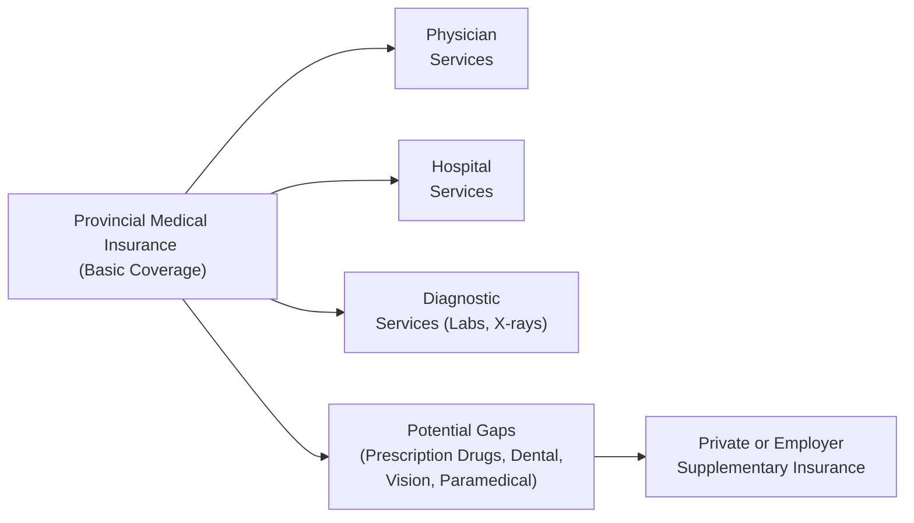

## 12.4 Provincial Medical Insurance

Well, let’s dive right in. If you’re like most people, the idea of sorting out medical insurance can feel a bit, um… complicated. You might have heard someone say, “Isn’t healthcare in Canada free?” And yes, we do have publicly funded healthcare, but it's not entirely “free” in the sense of unlimited coverage. Our wonderful country operates on a public system guided by the Canada Health Act, along with each province or territory running its own broad coverage program. So let’s break this down and see what’s actually covered, what isn’t, and how you—as a financial planner or a savvy consumer—can make sure no big gaps slip through the cracks.

Before we start, I recall a personal story about my aunt who lives in Ontario. She once visited me in British Columbia and ended up visiting a doctor out here for a sudden allergic reaction. The nice surprise? Ontario’s insurance (OHIP) paid for her medically necessary services in BC, but only at Ontario’s rates. She later realized that if costs exceeded what OHIP was willing to reimburse, she would've had to pay out of pocket. That experience opened my eyes to some of the intricacies of out-of-province coverage. Let’s explore those nuances.

---

### Overview of Provincial and Territorial Health Insurance Plans

Canada’s healthcare system might seem uniform at first glance, but each province (and territory) actually operates its own unique plan:

• Ontario: OHIP (Ontario Health Insurance Plan)  
• British Columbia: MSP (Medical Services Plan)  
• Quebec: RAMQ (Régie de l’assurance maladie du Québec)  
• and so on...

These plans are each shaped by the Canada Health Act, which sets out five core principles—public administration, comprehensiveness, universality, portability, and accessibility. In plain language, that means every insured resident can get medically necessary hospital and doctor services without direct cost at point-of-service in their home province. However, the details can vary significantly once you go beyond the basics, like seeing a family physician or visiting the emergency room.

---

### Common Coverage Across Provinces

Despite provincial variations, most provincial medical insurance plans cover:

• Physician Services: This includes visits to your primary care doctor or a specialist, provided the service is considered “medically necessary.”  
• Hospital Services: Hospital stays, most surgical procedures, nursing care, and some in-hospital prescription drugs.  
• Some Diagnostic Services: X-rays, ultrasounds, certain laboratory tests, etc.

But if you’ve lived in more than one province, you might have noticed differences in coverage for certain procedures, ambulance rides, or even certain medical devices. And this leads us to the important question: what isn’t typically covered?

---

### Gaps in Coverage

Sure, Canadians can breathe easy knowing that if they need emergency surgery, it’s generally covered. But what about prescription drugs taken at home? Or physiotherapy after an injury? Or the dentist?

• Prescription Drugs (Outside of Hospital Settings): In many provinces, you could be on the hook for the full cost of prescribed medications outside the hospital. Some provinces have special coverage for seniors, children, or low-income individuals, but coverage rules vary.  
• Dental Care: Routine dental checkups, cleanings, and orthodontics are generally not covered by provincial health insurance.  
• Vision Care: Eye exams, prescription lenses, and related vision-correction treatments are usually not covered, except for specific age groups or medical conditions in certain provinces.  
• Paramedical Services: Physiotherapy, chiropractic care, massage therapy, and mental health counseling are often excluded or only partially covered within a provincial plan.  
• Ambulance Services: In some provinces, riding in an ambulance can carry additional fees not always fully covered by provincial medical plans.  
• Out-of-Country Coverage: Limited coverage for medical services outside of Canada, if any, is offered by most provincial plans. If you travel internationally, you typically need private travel insurance.

One of the biggest potential blind spots is prescription drugs at home. For instance, if you’re in Ontario, once you turn 25 or if you are over 65, you might get coverage through certain programs under the Ontario Drug Benefit. But if you’re a 40-year-old with no private insurance, you might be paying out of pocket for the latest brand-name prescription. Each province has what’s called a “formulary,” which is simply a list of medications the province is willing to cover along with the rules for coverage.

---

### Key Definitions

Let’s unpack a couple of terms you might see:

• **Formulary:** A plan-specific list of medications eligible for coverage, sometimes with restrictions (e.g., you have to be over 65 or meet certain income thresholds).  
• **Out-of-Province Coverage:** The concept that your home province will pay for medically necessary services you receive elsewhere in Canada, typically up to the rate it pays in your province. If the other province charges more, you could be responsible for the difference.  
• **Health Transfer Payments:** The federal government sends money (the Canada Health Transfer, or CHT) to provinces and territories to help fund healthcare; however, each province decides how to allocate those funds individually.

---

### Importance for Financial Planners

Now, what does all this healthcare talk have to do with financial planning? Actually, quite a bit. Imagine you have a client—maybe they’re 55 with a comfortable retirement plan. Because of certain health complications, they rely on a hefty list of prescription drugs not fully covered by their province’s formulary. If they can’t afford a good private plan, their out-of-pocket costs might skyrocket, draining savings meant for other goals.

Financial planners should:

• Stay updated on the coverage rules in the specific province—especially if a client is moving. A client departing from Nova Scotia to retire in Alberta could face a three-month waiting period to get on board with Alberta’s plan.  
• Verify how traveling within Canada is covered by the client’s plan to avoid unexpected out-of-pocket payments.  
• Identify any existing coverage for prescriptions, ambulance, and paramedical services within the provincial plan, and then suggest supplementary private coverage if needed.  
• Provide clarity around seniors’ drug programs—particularly helpful if they’re nearing 65 and might need to add or replace coverage.  
• Keep on top of program changes in federal or provincial budgets. Governments can expand or limit coverage with little warning.

---

### Practical Example: John’s Cross-Country Move

Let’s walk through a hypothetical but realistic scenario. John is a 60-year-old individual who’s lived in Ontario his entire life. He receives coverage under OHIP. John plans to retire shortly and move to British Columbia for the scenic coast. Great choice, right?

However, John discovers that after arriving in BC, he may have to wait up to three months to be eligible for MSP (Medical Services Plan). That doesn't mean he’ll have no coverage at all—Ontario might cover certain services during that interim, but it can get complicated, especially if physicians in BC won’t bill Ontario directly. John might need private short-term coverage or at least an awareness of the potential out-of-pocket costs until his BC plan kicks in. On top of that, if John had a private insurance policy in Ontario, he might need to update it or find a new plan tailored to BC coverage. The key for John is making sure there’s no coverage gap that could cost thousands of dollars for an unexpected accident or illness in that three-month window.

---

### Extended Healthcare Plans: Filling the Gaps

Now that we’ve covered the potential potholes, let’s talk about bridging them with private or employer-sponsored supplemental insurance. These plans can help with:

• Prescription Drugs: Pays all or part of the cost of medication. Some group plans also let you coordinate coverage between spouses’ plans for even lower drug costs.  
• Dental and Vision: Covers routine checkups, cleanings, glasses, and eye exams.  
• Paramedical Services: May provide a set annual allowance for physiotherapy, chiropractic, mental health counseling, and more.  
• Catastrophic Coverage: If you face extremely high drug or medical expenses beyond a certain threshold, catastrophic coverage can kick in to limit out-of-pocket costs.

For advisors, the conversation often goes like this: “Do we rely solely on the provincial plan, or do we get group or individual private health insurance to fill those gaps?” The best answer depends on your client’s age, health status, location, occupation, family situation, travel plans, and, of course, budget.

---
### Staying Current with Provincial Regulations

Every year—or sometimes more frequently—provinces update their coverage details, add or remove certain medications from the formulary, or introduce new pilot programs. Since these changes can have major financial implications, here’s what you can do:

• Keep a reference cheat sheet with the official provincial health websites (we’ve listed a few below).  
• Track changes to drug formularies and out-of-province coverage policies.  
• Pay attention to new or updated residency requirements (as in the example with John).  
• Watch for major policy announcements in federal or provincial budgets that might expand or contract coverage.

Being “in the know” ensures you’re providing the best possible guidance to clients or for your own planning.

---

### Exploring Coverage When Traveling Within Canada

A big question that comes up: “Do I really need travel insurance if I’m just traveling to another province?” Legally, the Canada Health Act states that coverage is portable between provinces for medically necessary treatments, but each provincial plan will only reimburse at its own provincial rates. If the host province charges more than your home province, you could face additional costs.

For example, if you need a certain diagnostic test in Alberta that costs CA$800 but your home province reimburses only CA$500, you might owe the CA$300 balance. Some provinces have reciprocal billing agreements that mitigate these costs, but not always for everything (like ambulance fees or paramedical services). It’s a place where a bit of knowledge can really spare you or your clients a nasty surprise.

---

### Out-of-Country Coverage

You’ve probably heard horror stories of someone traveling to the U.S. for a quick vacation and subsequently incurring a huge medical bill because their provincial plan only reimburses a small fraction of the cost. Provincial plans generally offer minimal out-of-country coverage, if any. Everyday travelers typically want to consider private travel health insurance, which is much cheaper than an astronomical out-of-pocket hospital bill in, say, California.

It’s crucial for financial planners to remind clients (especially retirees who like to winter in Florida or Arizona) about how important private travel insurance is. Even though it’s not always pleasant to pay extra, the alternative can be financially devastating.

---

### Case Study: Surprising Ambulance Bill

My friend Sarah once told me she got slapped with a CA$400 invoice for an ambulance ride after fainting in a grocery store. She was shocked, thinking, “But I have provincial coverage!” It turns out that in her province, ambulance transport to the hospital wasn’t fully covered by the provincial insurance plan. She ended up paying out of pocket, though some private extended health plans would have covered some or all of that cost. It was a wake-up call to read the fine print. If your client can’t afford a surprise bill, then factoring ambulance coverage into a private plan might be worthwhile.

---

### Visualizing Provincial Medical Insurance

Below is a Mermaid diagram outlining some of the major coverage categories within provincial health plans, along with the typical items that remain uncovered. This flow can help you see at a glance how your coverage might unfold, from essential services to those uncovered needs.

In this diagram, you’ll notice the main covered benefits (physician, hospital, diagnostic) flow from the basic provincial plan, while the “Potential Gaps” branch out to highlight areas that usually require private or employer-sponsored insurance.

---

### Best Practices and Common Pitfalls

1. **Evaluate Formulary Coverage**: Know the medication needs of your client or yourself and see if they’re on the provincial formulary. If not, you might need additional coverage.  
2. **Review Residency Requirements**: If you move provinces, find out how long until your new coverage kicks in and whether your old province covers you in the meantime.  
3. **Advise Traveling Clients**: Always ask, “Where are you traveling?” and “For how long?” Travel insurance recommendations can be essential for cross-Canada or out-of-country trips.  
4. **Watch for Catastrophic Drug Coverage**: Many provinces offer special coverage if a person faces extremely high drug costs relative to income. This can be life-changing for some, but the rules differ by province.  
5. **Stay Alert to Legislative Updates**: Another biggie. Provincial budgets can change coverage rules with little notice. A new medication can get added or removed from the formulary. Ambulance fees might be modified. If you’re an advisor, schedule a yearly tune-up with your clients to review coverage modifications.

---

### References and Additional Resources

• **Provincial Ministry of Health Websites**:  
  - Ontario: https://www.ontario.ca/page/health-care-ontario  
  - British Columbia: https://www2.gov.bc.ca/gov/content/health/health-drug-coverage/msp-bc-residents  
  - Quebec: http://www.ramq.gouv.qc.ca  

• **Canada Health Act**: https://laws-lois.justice.gc.ca/eng/acts/C-6/  

• **“Understanding Canada’s Health Care System” (Government of Canada)**:  
  https://www.canada.ca/en/health-canada/services/health-care-system/reports-publications/health-care-system.html

• **CIRO**: For those offering financial advice under an investment dealer or mutual fund dealer platform, please consult the Canadian Investment Regulatory Organization (CIRO) for current compliance guidelines at https://www.ciro.ca.

---

### Conclusion

Maybe this all sounds like a lot to juggle, but in truth, knowledge is power. It’s worth the effort to understand what your province covers and what it doesn’t. You don’t want to wait until you’re on the hook for a sneaky ambulance fee or a big prescription drug bill. As a financial planner, you can add real value by helping clients navigate these complexities, identify coverage gaps, and secure the insurance solutions they need. Paying attention to the details now can help everyone rest easier knowing that, if health surprises do come up, they won’t derail long-term financial goals.

And at the end of the day, if someone says, “Healthcare in Canada is free, right?” you’ll be armed with an informed (maybe slightly long-winded!) answer that sets the record straight. So here’s to staying healthy, protected, and financially secure under our provincial medical insurance systems—and that, my friend, is a pretty awesome goal.

---

## Test Your Knowledge: Provincial Medical Insurance Essentials



### Which statement best describes provincial medical coverage in Canada?

- [ ] It always covers all medical costs, including dental and vision.
- [ ] It provides unlimited out-of-country coverage for any medical emergencies.
- [x] It typically covers physician and hospital services but leaves gaps in areas like dental, vision, and ambulance.
- [ ] It does not cover any diagnostic services.

> **Explanation:** Provincial plans generally cover doctor and hospital services, plus some diagnostic tests. Gaps often include dental, vision, paramedical services, ambulance fees, and out-of-country coverage.

### What is a formulary in the context of provincial healthcare?

- [ ] A schedule of doctor’s appointments.
- [x] A list of prescription drugs covered under a public or private plan.
- [ ] The list of approved ambulance services.
- [ ] A summary of interprovincial travel rules.

> **Explanation:** A formulary is a list of prescription medications that a plan will pay for under specified conditions.

### How do most provincial plans handle coverage for ambulance services?

- [ ] They are always fully covered by the province, regardless of transport distance.
- [ ] They are never covered under any circumstances.
- [x] Most provinces offer partial coverage, but patients may be charged a fee.
- [ ] Coverage is only given if a patient refuses additional private insurance.

> **Explanation:** Provincial coverage for ambulance services varies significantly, but it's common for patients to owe a fee or the full amount, depending on the province and situation.

### Why might a Canadian resident need private health insurance despite having provincial coverage?

- [ ] Provincial coverage doesn’t exist at all in Canada.
- [x] Private insurance can fill gaps, such as prescription drugs, dental, and paramedical services.
- [ ] Provincial coverage only applies after the age of 65.
- [ ] Private insurance is required to maintain a valid driver’s license.

> **Explanation:** While provincial coverage is comprehensive for necessary hospital and physician services, private plans can help pay for services not covered by the province (like dental, drug coverage, and certain therapies).

### If Nora, who lives in Ontario (OHIP), moves to British Columbia (MSP), which statement is most accurate?

- [x] She may need temporary coverage because BC coverage could take up to three months to begin.
- [ ] She will be automatically covered by MSP the day she arrives in BC.
- [ ] OHIP will continue to cover all her costs for the first five years.
- [ ] OHIP will not cover any expenses once she leaves Ontario.

> **Explanation:** Generally, if you move to a new province, there's a waiting period (often up to three months) before the new provincial plan starts. Old coverage may help, but not always fully.

### Which of the following is a financial planning consideration regarding provincial medical insurance?

- [ ] Clients never need to worry about medical costs if they remain in their home province.
- [ ] There are no yearly changes to coverage or drug formularies.
- [x] Advisors should check for updates to coverage, drug formularies, and residency requirements to prevent gaps.
- [ ] Only seniors are eligible for provincial coverage, so younger clients have nothing to plan.

> **Explanation:** Advisors have to stay updated on coverage specifics, drug formularies, and residency rules that may affect their clients’ financial situations.

### How is out-of-province coverage typically handled when a provincial resident needs care in another province?

- [ ] The host province pays 100% of the resident’s expenses.
- [x] The home province usually reimburses at its own established rates, potentially leaving a gap for higher costs in the host province.
- [ ] Coverage is invalid, and the patient may be fully responsible.
- [ ] The federal government will foot the entire bill.

> **Explanation:** Under portability provisions, the home province pays only to the amount it would have covered back home, leaving the patient liable if the host province charges more.

### Which of the following health services is typically included in basic provincial coverage?

- [x] Medically necessary hospital services and physician visits.
- [ ] Routine dental care and orthodontics.
- [ ] Prescription glasses and contact lenses.
- [ ] Massage therapy up to CA$2,000 annually.

> **Explanation:** Provincial plans generally cover services deemed medically necessary, like hospital stays and doctor visits. Dental and vision care are customarily excluded, except in special circumstances.

### Why do seniors in some provinces argue that private coverage is still worthwhile?

- [ ] Seniors receive no provincial coverage at all past age 65.
- [ ] Private plans do not include prescription drugs or dental.
- [x] Seniors may have special coverage for some meds, but private plans can still fill gaps for other services like dental, vision, or paramedical care.
- [ ] Provincial coverage is automatically canceled at age 65 unless you buy a private plan.

> **Explanation:** Even though most provinces have seniors’ drug programs, many older adults still benefit from private health insurance to cover the excluded items.

### Provincial healthcare portability means care is portable within Canada. Is this entirely true?

- [x] True
- [ ] False

> **Explanation:** Portability allows residents to receive coverage throughout Canada for medically necessary hospital and physician services, but reimbursement is typically at the home province’s rate, which may not fully match the actual cost in another province.


