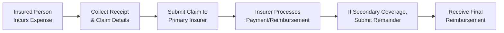

## 12.5 Extended Health Insurance

Have you ever felt that twinge of anxiety when you get your prescription bill at the pharmacy or pay for that extra trip to the chiropractor? Maybe you’ve stared at a hefty dental bill just wishing there was a better way to budget for those costs. Well, that’s exactly where extended health insurance—sometimes called supplemental health insurance—can save the day. Think of extended health coverage as a cushion that sits on top of your provincial health plan. It helps pay for expenses that aren’t always covered by government-funded programs and can relieve the stress of unexpected medical bills.

Extended health insurance can provide coverage for prescription drugs, vision care, dental procedures, paramedical services (like massage therapy or physiotherapy), mental health support, semi-private hospital rooms, and more. Whether this coverage is part of an employer-sponsored group plan or purchased individually, wise financial planning means looking beyond the basics of provincial coverage to ensure you and your family have the support you need.

In this section, we’ll look at how extended health insurance works, how it fits into a holistic financial strategy, and how to plan for and choose the right policy. We’ll also dig into practical examples, personal anecdotes, and highlight common pitfalls so you can be confident you’re making the right decisions. Let’s jump in!

### Why Extended Health Insurance Matters

You might be asking yourself: “Why do I really need extended health insurance? Isn’t my provincial coverage enough?” Well, it can be—until it isn’t. While Canada’s provincial or territorial plans typically cover doctor visits, hospital stays, and some diagnostic tests, they often leave out extras like prescription drugs, dental work, eyeglasses, physiotherapy, and mental health counselling. Over the course of a lifetime, these costs can be substantial.

For instance, let’s say you need ongoing medication for a chronic condition that costs $200 per month. Over the year, that could add up to $2,400 out of your own pocket. And that doesn’t even touch unexpected emergencies, like a chipped tooth that needs a crown or a specialized brace recommended by a chiropractor after a sports injury. Planning only around government health coverage might leave you scrambling to cover costs—or worse, delaying necessary treatments.

Extended health insurance steps in to help with these additional expenses. Knowing that your policy will refund 80% (or sometimes 100%) of your prescription drug costs can offer real peace of mind and keep your financial plan steady. It’s one of those “nice to have” benefits that quickly becomes essential when you need it.

### Key Coverage Areas

When we talk about “extended health insurance,” we’re actually referring to a bundle of benefits that can vary dramatically depending on whose plan you’re looking at. Understanding these coverage areas can guide you in choosing a policy that matches your needs or those of your family.

Prescription Drugs  
Prescription coverage is probably the biggest reason people opt for extended health insurance. The plan typically covers a portion of prescription medication costs, subject to various deductibles, co-pays, or annual maximums. If you or a family member has a chronic condition or expects higher-than-average prescription drug needs, this can be a real lifesaver.

Dental Care  
Dental costs can surprise you. Whether it’s routine checkups, fillings, orthodontics for your teenager, or a root canal you never saw coming, having a good extended health plan can reduce these out-of-pocket costs. Some plans even cover specialized orthodontic treatments and advanced procedures. Watch for annual maximums here—some plans cap the total they’ll pay per year.

Vision Care  
If you or your family members wear glasses or contact lenses, vision coverage can help you avoid that cringe-worthy moment at the optometrist when you realize you have to fork out several hundred dollars for new lenses. Many plans offer an amount every two years toward new frames and lenses. Some will also include coverage for laser eye surgery or specialized ocular care.

Paramedical Services  
Paramedical services include care from regulated health professionals such as chiropractors, physiotherapists, massage therapists, naturopaths, and more. Provincial plans might not include these at all, or if they do, the coverage is minimal. Extended plans typically reimburse you for a certain dollar amount per treatment or per year, making it easier to access the care you need without agonizing over the cost.

Hospital Accommodations  
In Canada, hospital stays are usually covered if you stick to standard wards. But if you want a semi-private or private room—because sometimes you just need your space—an extended health plan can help foot that bill.

Mental Health Supports and Wellness Programs  
In recent years, many insurers have expanded coverage to include mental health therapies. You might see coverage for psychologists, social workers, or counsellors, as well as wellness initiatives like smoking cessation programs. Some employers also bundle in Employee Assistance Programs (EAPs), offering counselling and support for personal or work-related issues.

### Plan Structure: Deductibles, Co-Payments, and Coverage Maximums

It can be a little confusing to figure out how much you’ll actually pay or get reimbursed when you go to the dentist or pick up a prescription. Plans usually have several cost-sharing elements:

• Deductible: The amount you pay before the insurance coverage kicks in.  
• Co-Payment (Co-Insurance): The percentage or portion of the cost you pay after you’ve met your deductible. Sometimes it's written as 20% you pay and 80% the insurer pays.  
• Annual or Lifetime Maximums: These limit how much the insurer will pay over the course of a policy year (or a lifetime).

In formula-like terms:
  
Let D be the deductible, and C% be the co-insurance coverage level (like 80%). If you have an eligible expense E, then the insurance might pay:


\text{Insurance Payment} = \max\big(0, (E - D)\big) \times C\%


If E is less than your deductible, the insurer pays nothing. If you’ve already met your deductible this year, then the insurer would generally pay E × C%. Just watch that you don’t exceed any policy maximums.

### Individual vs. Group Plans

Extended health coverage may come through an employer-sponsored group plan or as an individual policy you purchase on your own. The group route is typically more cost-effective if you have access to it, because your employer often covers part of the premiums. Plus, underwriting requirements (medical exams, questionnaires) are often less stringent because the risk is spread across many employees.

Now, if you’re self-employed or your employer doesn’t offer benefits, you can still buy an individual extended health plan. These policies can be more flexible—maybe you only really need drug and dental coverage—and you can tailor them to your anticipated needs. However, the premiums can be higher, and you’ll probably face a pre-existing condition clause, meaning you might get some exclusions or waiting periods if you already have a significant health issue.

### Common Add-Ons: EAPs, Mental Health Counselling, Wellness Initiatives

An important trend in extended health plans is the rise of comprehensive wellness programs. We’re seeing more coverage for mental health counselling, nutritional counselling, fitness program subsidies, smoking cessation support, and more. This can be especially valuable for families, as kids may need specialized mental health support at different stages, or you might want to invest in a structured weight-loss program. These extra benefits are a reflection of the growing awareness that health is multifaceted—physical, mental, and emotional.

### Reviewing and Tailoring a Plan to Meet Unique Needs

One of the biggest mistakes folks make is assuming all extended health plans are pretty much the same. Actually, they can vary a lot—particularly in areas like dental coverage, ortho coverage, and paramedical benefits, or how each plan prioritizes certain reimbursements. Before selecting or renewing a plan, consider your family’s demographics and needs. For example:

• A young professional with minimal health concerns might prioritize mental health coverage or paramedical services (like massage benefits).  
• A family with three kids might focus on comprehensive dental and orthodontic coverage.  
• An older individual with frequent medication needs might look for strong prescription drug coverage with low co-pays.

### My Own Brush with Extended Health Insurance

Let me share a personal anecdote. A few years back, I neglected to fully update my extended health coverage after switching jobs. My new plan had a higher deductible for prescription drugs than my old one. Imagine my surprise when I went to the pharmacy to pick up a topical cream after a nasty burn from my stovetop accident (don’t ask—still cringe about that). The total cost after the pharmacist rang it up was well above what I expected. Turns out I had not hit my new deductible, and I was on the hook for the entire cost. This is the kind of scenario that can really throw off your monthly budget if you don’t plan well. It was a small incident, but it reminded me that coverage details matter—big time.

### Potential Pitfalls and Common Challenges

There are a few stumbling blocks that can trip you up if you’re not careful:

• Not Reading Policy Exclusions: Some plans exclude certain pre-existing conditions or only cover a narrow range of paramedical services.  
• Annual Maximums: You may assume your dental bill is covered, only to find you exhausted your coverage limit halfway through the year.  
• Forfeiting Group Benefits: If you switch jobs, you might have to wait for a probationary period before you can rejoin extended health coverage at your new workplace.  
• Premium Increases: Premiums for individual policies can jump over time. Make sure you budgeting for possible changes in cost.  
• Claim Filing Deadlines: Extended health insurers require claims to be submitted within a certain time window. Miss that, and you might have to eat the expense entirely.

### Harnessing Extended Health Insurance in a Comprehensive Financial Plan

Extended health insurance isn’t a standalone product—it should integrate with your financial plan. Together with other insurance tools—like disability insurance (Section 12.1), critical illness insurance (Section 12.2), or even travel insurance (Section 12.6)—you build a web of protection to prevent single health events from unraveling your finances.

Think of it this way: you have your investment strategy, debt planning, retirement goals, tax optimization, and then you add risk management tools like health coverage to protect your progress. Without that safety net, you might be forced to dip into your emergency fund or, worse, your retirement savings every time you face a major medical bill. Over a lifetime, that can significantly affect your net worth and your financial freedom.

The same logic applies to business owners, as we explore in Chapter 15: Financial Planning for Small Business. If you’re offering extended health benefits to employees, it helps attract and retain talent. Just be aware of the cost implications and potential tax benefits to both you and your employees.

### The Claims Process: A Quick Overview

Sometimes the claims process itself can feel like an administrative headache. Most insurers have online portals or mobile apps these days, which allows you to submit claims electronically. Others require you to submit a paper claim form and receipts by mail. In either case, keep detailed records of your expenses. If you have a spouse with a separate plan, you can often coordinate benefits so that you end up with even less out-of-pocket expense. This can get a tad complicated, so a quick conversation with your insurance provider or plan administrator can clarify your coverage.

Below is a simplified flowchart of the claims process:

In a situation where you have multiple plans (say, your employer plan plus a spouse’s employer plan), you’d submit your claim to your primary plan first. Once they pay their share, you submit any unpaid balance to the secondary plan. While it may feel bureaucratic, the added coverage can further minimize your expenses.

### Assessing Insurance Quotes and Comparing Policies

If you’re buying an individual policy or evaluating different plan levels through your employer, you’ll want to compare quotes from several insurers. Premiums can vary widely based on:

• Coverage limits (e.g., $2,000 vs. $5,000 annual dental maximum).  
• Deductibles (a higher deductible usually means a lower premium).  
• Your age, health status, location, and sometimes even occupation.  

When comparing, look beyond price. It’s easy to be lured in by a low premium, but pay attention to coverage scope. A plan with a lower monthly cost might have lower coverage maximums or more exclusions, and that could cost you more in the long run.

### Real-World Example: A Young Family

Imagine a young couple, both in their early 30s, with two small children. They currently have no serious health problems but anticipate braces for their older child in a few years (orthodontics can easily run upward of $5,000). They also value chiropractic care due to an active lifestyle. After analyzing different policies, they choose a plan that has:

• 80% coverage on prescription drugs with a $50 annual deductible.  
• $2,000 annual dental maximum per person, with 50% coverage on orthodontics up to $2,500 per lifetime.  
• $500 per year each for chiropractic and physiotherapy.  

They pay a slightly higher monthly premium than a bare-bones policy would cost. But they reason that if their eldest child does need braces soon, they’ll be glad they chose the higher coverage. Throughout the year, they pay out small amounts on co-pays and small paramedical bills, but substantially reduce their costs on critical treatments.

### Extended Health Insurance and Tax Efficiency

While not as commonly optimized from a tax perspective as some other retirement or investment-based products, extended health premiums in certain cases can be claimed as a medical expense on your personal tax return in Canada, subject to eligibility criteria and thresholds. If you run a small business, you might be able to structure some health-related costs as business expenses, which can provide a tax advantage. Check with a tax professional or visit the Canada Revenue Agency (CRA) website for the most accurate and up-to-date rules, as these can change over time.

### References and Further Exploration

• Contact major private insurers—such as Great-West Life, Manulife, or Sun Life—to see sample extended health policy documents and compare coverage details.  
• Garfield, A. “Essential Employee Benefit Packages in Canadian SMEs,” which addresses must-have coverage in smaller workplaces and the benefits of extended health coverage.  
• Government of Canada – Healthcare in Canada Overview: https://www.canada.ca/en/health-canada.html  
• If you’re looking for regulatory guidance on insurance products and investor protection updates, visit the Canadian Investment Regulatory Organization (CIRO) website (https://www.ciro.ca).  
• For an overview of different financial planning approaches, refer back to Chapter 6: Tax Planning Strategies and Chapter 7: Tax Planning Using Registered and Trust Accounts for synergy with extended health insurance decisions.

### Best Practices and Strategies for Success

• Regularly Review Your Coverage: Your health needs change over time. So do insurance policies and premiums. Review annually to ensure you’re not under- or over-insured.  
• Integrate with Financial Planning: Align your extended health coverage with other forms of insurance and your broader financial plan, including retirement and investment goals.  
• Understand the Fine Print: Pay close attention to deductibles, co-pays, and especially any exclusions or waiting periods.  
• Keep Copies of All Bills and Receipts: For tax purposes and claim submissions, you’ll need documentation if you want maximum reimbursements.  
• Consider Future Health Trends: If you foresee needing more robust paramedical coverage or mental health services down the road, factor that into your plan selection now.

### Final Thoughts

Extended health insurance plays a powerful role in protecting you from life’s unpredictable medical expenses. The right plan can reduce stress, free up your cash flow, and help you stay on track with your broader financial goals. With the array of coverage areas—dental, paramedical, vision, and more—and the flexibility of group or individual plans, there truly is something out there for every Canadian’s unique situation.

Whether you’re a freelancer exploring individual policies, an employee optimizing benefits at a new job, or a business owner looking to attract and retain talent, extended health insurance is a tangible investment in your well-being. After all, the healthier you are—both physically and financially—the more freedom you’ll have to build the life you want.

And trust me, there’s nothing more satisfying than stepping out of your dentist’s office with a buzzy, freshly cleaned set of teeth, all while knowing you won’t have to drain your wallet!

---

## Test Your Extended Health Insurance Knowledge Quiz



### Which of the following services is most commonly covered by extended health insurance but is typically not covered under basic provincial plans?

- [ ] Doctors’ visits
- [ ] Hospital stays in a standard ward
- [x] Chiropractic treatments
- [ ] Diagnostic blood tests

> **Explanation:** Most provincial health plans in Canada cover things like doctors’ visits and hospital stays. Chiropractic treatments are generally considered paramedical services and are frequently covered only under extended health insurance policies.

### Which best describes a co-payment?

- [ ] The amount an insurer pays before the plan member begins paying
- [x] The portion or percentage of an expense a plan member pays after meeting the deductible
- [ ] A reimbursement for out-of-pocket expenses
- [ ] The maximum a plan will pay over the insured person’s lifetime

> **Explanation:** A co-payment (or co-insurance) is the percentage or fixed amount that the insured person pays after the deductible has been met. For example, in an 80/20 plan, the coverage covers 80% of the expense and the co-pay is 20%.

### When might an individual choose a more comprehensive extended health plan with higher premiums?

- [x] They have chronic conditions requiring ongoing medical expenses
- [ ] They have zero health expenses
- [ ] They prefer to pay all costs out-of-pocket
- [ ] They live in a province where everything is already covered

> **Explanation:** Someone with ongoing or anticipated healthcare needs—like regular prescriptions, orthodontics, or paramedical services—often finds a more comprehensive plan with higher premiums beneficial in the long run.

### What is the main purpose of an annual or lifetime maximum in an extended health insurance plan?

- [ ] To reduce the available coverage for minor illnesses
- [ ] To ensure the insured pays extra for dental benefits
- [x] To cap how much the plan pays for covered services over a set time frame
- [ ] To allow unlimited usage of paramedical services

> **Explanation:** Annual or lifetime maximums limit the total amount an insurer will pay in claims over a specific period, preventing the plan from covering expenses infinitely.

### Which of the following scenarios could be a disadvantage of relying on employer-sponsored extended health insurance alone?

- [x] Losing coverage during a gap in employment
- [ ] Automatic coverage of all pre-existing conditions under any new job’s plan
- [ ] Permanently locked premiums that never increase
- [ ] Lack of deductible or co-pay requirements

> **Explanation:** Employer-sponsored plans can be lost if you switch jobs, have a waiting period at the new employer, or face changes in coverage. Individual policies can provide continuity if you encounter an employment gap.

### How can extended health insurance integrate with a broader financial plan?

- [x] It prevents medical expenses from depleting emergency funds or retirement savings
- [ ] It fully replaces life insurance
- [ ] It eliminates the need for budgeting
- [ ] It guarantees employment stability

> **Explanation:** Extended health insurance ensures that unexpected medical expenses don’t drain other important financial resources, like emergency funds or investments, thereby aligning with the overall financial plan.

### What is a common challenge when coordinating benefits from two different extended health plans (for example, your plan and your spouse’s plan)?

- [ ] They automatically combine to become a single plan
- [x] You must follow a primary-secondary claim process
- [ ] Both plans refuse coverage if each other is listed
- [ ] You cannot claim the same expense on both plans

> **Explanation:** When you have more than one plan, you typically submit to the primary plan first, then coordinate any unpaid portion with the secondary plan. This can be a bit complex but often results in higher overall reimbursement.

### Why is it important to carefully review policy exclusions in an extended health plan?

- [ ] All plans cover exactly the same incidents
- [x] Some services or conditions might not be payable under the policy
- [ ] Refunds are guaranteed for excluded services
- [ ] Exclusions mean you automatically qualify for group coverage

> **Explanation:** Policy exclusions detail treatments or conditions the insurer won’t cover. Overlooking these exclusions can lead to unanticipated out-of-pocket costs.

### Which type of service is typically included under “paramedical services” in extended health plans?

- [ ] Specialist physician consultations
- [x] Massage therapy provided by a registered therapist
- [ ] Laboratory blood tests in a hospital
- [ ] inpatient surgeries

> **Explanation:** Paramedical services generally refer to care from regulated health professionals like chiropractors, physiotherapists, and massage therapists, which are rarely fully covered by provincial healthcare.

### True or False: Extended health insurance premiums are always tax-deductible without exception in Canada.

- [x] True
- [ ] False

> **Explanation:** Premiums for extended health or dental plans can sometimes be deducted as medical expenses on your personal tax return, subject to specific rules and thresholds set by the Canada Revenue Agency. Always verify conditions and limits to be certain of your eligibility.


