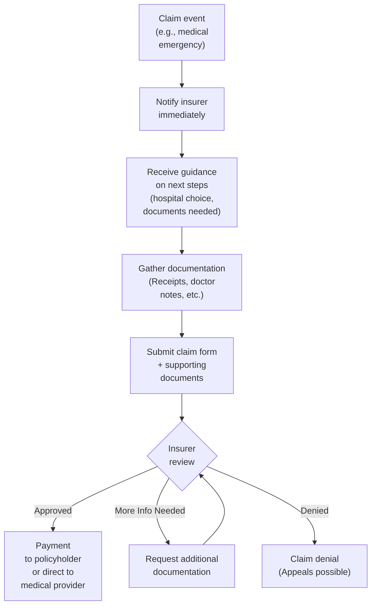

## 12.6 Travel Insurance

Have you ever planned a dream vacation—maybe to a sunny beach in the Caribbean or a bustling city in Europe—and then suddenly found yourself terrified of the “what ifs”? You know, those random last-minute thoughts like, “What if I get sick abroad?” or “Do I really have enough coverage to cover a hospital stay in a foreign country?” I remember vividly, years ago, my friend was on a ski trip in Colorado, took a tumble during her first run, and ended up spending a night at a U.S. hospital. The bill arrived and, let’s just say it wasn’t a pleasant surprise. That’s basically the essence of why travel insurance exists—to protect you and your wallet from unexpected (and often unbelievably high) costs when you’re on pilgrimage outside your home province or country.

This section introduces the key components and considerations of travel insurance—a financial safeguard that helps ensure your fun wouldn’t be overshadowed by massive out-of-pocket expenses or canceled trip losses.

---

### Purpose and Scope of Travel Insurance

Travel insurance, like most insurance products discussed in this chapter, is all about risk management. Unlike other types of insurance (for instance, disability or critical illness plans), travel insurance focuses specifically on the time-limited period when you’re away from home. These policies can cover a wide range of unexpected events, such as:

• Emergency hospitalization and medical treatment abroad.  
• Emergency evacuation and repatriation back to Canada.  
• Trip cancellation if you have to cancel your plans before departure.  
• Trip interruption if you must return earlier than planned (or arrive late).  
• Lost, stolen, or damaged luggage.  
• Accidental death and dismemberment coverage while traveling.  

The heart of travel insurance is protecting you (and your family) from unforeseen medical or travel-related costs that can be financially devastating without coverage. While it might be easy to assume your provincial health plan or employee benefits will pick up the bill no matter where you go, the reality is: coverage outside your home province is often significantly limited. Reciprocal agreements between Canadian provinces and territories can help, but many costs (such as air ambulance, claim sub-limits, or differences in coverage rates) won’t be fully reimbursed. Essentially, having travel insurance is like wearing a seatbelt on a road trip: You hope never to use it, but you’re awfully glad it’s there when you need it.

---

### Emergency Medical Coverage: The Core of Travel Insurance

When people talk about “travel insurance,” the first element that likely comes to mind is medical coverage. This typically includes hospitalization, physician services, medication, and repatriation (meaning, if necessary, bringing you home by air ambulance or other medical transport). Repatriation alone can cost tens of thousands of dollars if you’re not covered—imagine needing a specially equipped flight for a patient who can’t handle commercial travel, along with medical professionals on board.

#### Pre-Existing Conditions and Underwriting Pitfalls

One common point of confusion is “pre-existing conditions.” In short, this refers to any medical condition you had (or knew about) **before** you started your trip or purchased the policy. Travel insurance providers may either:

• Exclude coverage for that condition altogether,  
• Impose a waiting period before granting coverage, or  
• Require you to pass medical underwriting if you’re older (often 60 or 65+) or have a documented history of chronic illness.  

You’ve got to be honest about these conditions. If you fail to disclose a chronic ailment or a past heart condition, the insurer can deny a claim if it appears linked to that pre-existing condition—no matter how unrelated it might seem to you.

---

### Additional Features: Trip Cancellation and Interruption

It’s not just medical stuff that can go wrong on a trip. Flights can get canceled, a close family member might fall ill, or a natural disaster could hit your destination. That’s where two important features come into play:

• **Trip Cancellation Insurance:** Reimburses non-refundable travel expenses if you have to cancel your trip due to a covered event (like an illness, injury, or a death in the family).  
• **Trip Interruption Insurance:** Helps cover additional costs if you need to disrupt or shorten your trip. For instance, having to return home early due to a covered medical emergency or the sudden passing of a family member back home.  

I knew a fellow traveler who was off to her best friend’s wedding in Mexico. She unfortunately tore a ligament in her knee a week before the trip and just couldn’t travel. Thanks to her trip cancellation insurance, she recovered most of the costs for her flight and resort booking. Without that, she’d have been out of pocket by nearly $2,000.

---

### Single-Trip vs. Multi-Trip Annual Policies

If you rarely travel—maybe a single winter vacation getaway each year—a single-trip policy may be enough. But for frequent flyers, a multi-trip annual policy can be more cost-effective and convenient. Here’s a quick comparison:

• **Single-Trip Policies:** Coverage for one specific trip. Typically purchased just before departure.  
• **Multi-Trip Annual Policies:** Offers coverage for unlimited trips within a 12-month period, subject to a maximum duration per trip (e.g., 15, 30, or 60 days).  

For example, if you’re a snowbird who spends four months in Florida every winter, but also takes the occasional weekend to NYC, you might compare a single-trip policy customized for your long stay vs. an annual plan that covers every little getaway.

---

### Coverage Maximums and Exclusion Zones

You might see coverage limits stated as $1 million, $5 million, or even “unlimited.” The question is: do you really need these high amounts? Medical care can skyrocket quickly, especially in countries like the United States where hospital costs are notoriously high. A $1 million cap might seem ample, but in extreme cases (lengthy hospital stays and specialized surgeries), costs can approach or exceed that cap—though it’s relatively rare.

Also, watch out for any geographic exclusions. Many insurers exclude or limit coverage if you travel to regions with a known conflict, or if your destination is under a Government of Canada travel advisory from Global Affairs Canada. It’s critical to check those advisories before booking and before travel, because coverage can become invalid if the government has issued a “do not travel” notice.

---

### Reciprocal Billing Agreements and Provincial Healthcare Gaps

Within Canada, provinces do have reciprocal billing agreements (for example, you can use your Ontario Health Insurance Plan (OHIP) card in BC or Alberta), but there are nuances. The amount each province pays for a specific treatment can vary, leaving you responsible for the difference if your home province’s coverage doesn’t match the out-of-province hospital’s rates. When you go abroad, your provincial coverage typically plunges to minimal levels (often covering only a fraction of the actual cost). In other words, that’s where private travel insurance becomes your financial life raft.

Take the example of a traveler from Ontario who needs to be hospitalized in British Columbia. If BC’s hospital charges more than what OHIP considers standard, the traveler may face a shortfall. Having supplementary travel insurance would help plug that gap.

---

### The Impact of Global Affairs Canada Advisories

Global Affairs Canada (https://travel.gc.ca/travelling/advisories) issues travel advisories that classify countries or regions based on security and health-related risks. These advisories come in various levels, from “Exercise Normal Security Precautions” up to “Avoid All Travel.” If you decide to ignore a high-level advisory and travel anyway, some insurance policies will automatically become void for that trip. Always read the fine print on how your insurer handles these advisories. If at any point your planned destination is upgraded to a more serious advisory, you might find that your coverage no longer sticks.

---

### Incorporating Travel Insurance into a Broader Financial Plan

Insurance, as we’ve emphasized throughout Chapter 12, helps protect your hard-earned funds against life’s curveballs. Travel insurance is no different: it’s a short-term tool designed to keep your finances stable if something happens while you’re away from home.

If you look back at Chapter 2 (Net Worth and Cash Management Planning), part of creating a resilient financial plan involves ensuring you won’t be derailed by unpredictable events. Travel mishaps are classic examples of such unpredictability—any financial advisor worth their salt will suggest that individuals factor travel insurance into their budgets, especially for international travel or extended trips.

Additionally, understanding your personal risk profile (see Chapter 1.5: Determining Your Client’s Risk Profile) helps clarify whether an individual year-round or multi-trip plan is worthwhile, or whether it’s more suitable to pick coverage “à la carte” for each trip. High-frequency travelers, families with young children, or older adults with known conditions will likely have different coverage needs than a single professional who rarely travels.

---

### Diagram: The Travel Insurance Lifecycle

Below is a simple mermaid diagram illustrating how you typically go from deciding on a trip to the potential claims process:

1. Decide to travel and set your budget.  
2. Compare policy options.  
3. Purchase a policy that matches your dates, destinations, and specific needs.  
4. Embark on your trip.  
5. If something goes wrong (injury, sickness, missed flight), you declare it to the insurer and seek medical care.  
6. Complete forms, submit receipts/medical reports, and the insurer processes your claim.  
7. Return home, enjoy your memories, and (hopefully) get reimbursed for covered expenses if you ran into trouble.  
8. Start planning your next adventure!

---

### Practical Examples and Case Studies

1. **Short-Term Tropical Escape**  
   Daryl and Lucy plan a one-week all-inclusive vacation to the Dominican Republic. They buy a single-trip plan that includes $2 million in medical coverage plus trip cancellation insurance. Lucy has mild asthma but hasn’t had complications in years, so she discloses this during the application. While in the Dominican Republic, Lucy experiences severe bronchitis and needs hospital care. Fortunately, she’s covered for treatment. Without travel insurance, she’d pay thousands of dollars out of pocket.

2. **Frequent Business Traveler**  
   Janine travels once a month from Toronto to various U.S. cities for consulting work. Instead of buying a single policy for each trip, she opts for a multi-trip annual plan with a 30-day coverage limit per trip and a $5 million coverage maximum. This arrangement saves her money compared to buying a separate policy for every trip. It also covers her spontaneously if something pops up last minute—a big plus for frequent flyers.

3. **Retiree Snowbirds**  
   Mike and Evelyn are retirees who spend four months each winter in Arizona—a classic Canadian “snowbird” scenario. They have a group medical plan through Evelyn’s former employer, but it caps coverage after 30 days out of province. They purchase a top-up policy for the additional days. They also check Global Affairs Canada advisories regularly, particularly if considering short side trips to Mexico. One year, an advisory changed while they were in Mexico, but they were able to adjust their travel plans and keep coverage valid.

---

### Best Practices, Warnings, and Common Pitfalls

• **Disclose all health conditions.** Many people unintentionally withhold something as small as high blood pressure. Honesty is key because non-disclosure can void the entire policy.  
• **Read the policy wording carefully.** Look for coverage limits, sub-limits, and reasons for claim denials. Policies vary widely.  
• **Understand your home province’s limitations.** Don’t assume you have coverage out-of-province simply because Canada has a universal healthcare system.  
• **Watch out for timing.** Almost all policies require you to buy trip cancellation/interruption coverage before (or within a certain time after) you make your initial trip payment.  
• **Consult your financial advisor.** They can help integrate travel insurance into your overall financial plan, ensuring you have consistent coverage.  
• **Monitor travel advisories.** If the Government of Canada issues a “do not travel” warning, your insurer might just consider your policy void if you ignore it.

One final pitfall? Assuming credit card travel insurance automatically covers everything. Some credit cards do offer robust coverage, but many have strict limitations on trip length, coverage maximums, age, or pre-existing conditions. Always verify your card’s policy details, especially if you have a chronic ailment or you’ll be away for more than a few weeks.

---

### Regulatory Landscape and Canadian Considerations

While travel insurance is regulated on a provincial level (insurance business is typically regulated by provincial watchdogs such as the Financial Services Regulatory Authority in Ontario or the Autorité des marchés financiers in Quebec), it’s also influenced by national frameworks and advisories. Here’s where some references come into play:

• **Global Affairs Canada** – https://travel.gc.ca/travelling/advisories  
  (Check for travel advisories before you book or depart; coverage can be impacted if you ignore warnings.)  

• **Provincial Health Ministry Websites** – For instance, OHIP in Ontario (https://www.ontario.ca/page/ohip-coverage-across-canada) details your out-of-province coverage limitations.  

• **New Self-Regulatory Organization (CIRO)** – As of January 1, 2023, the Mutual Fund Dealers Association and the Investment Industry Regulatory Organization of Canada have amalgamated into CIRO. While this focuses more on investment dealers and securities markets, it emphasizes the importance of having a trusted advisor. Your financial planner may be overseen by CIRO regarding the advice they give about your overall finances, even if the product itself (travel insurance) is regulated provincially.  

• **Canadian Investor Protection Fund (CIPF)** – Not directly relevant to travel insurance, but important if your financial planning includes investment accounts. CIPF stands as the sole investor protection fund after merging with the MFDA IPC.  

• **“Travel Insurance: A Canadian Buyer’s Guide” by Rob Engen** – This is an excellent resource to explore various policy options, coverage details, and real-life scenarios for Canadian travelers.

---

### Practical Tools and Resources

• **Comparison Websites**: Several websites let you compare multiple travel insurance providers side by side. Though you should confirm the policy details once you find a good rate, these tools speed up your initial search.  
• **Online Quotation Tools**: More and more insurers let you answer a short health questionnaire online and instantly see coverage options and premiums.  
• **Smartphone Apps**: Some providers offer mobile apps that not only show your policy details but also feature “click-to-call” for emergency assistance and track claims.  
• **Global Affairs Canada App**: The Travel Smart app from the Government of Canada can notify you of changes to travel advisories or even a local emergency in your destination.  

---

### Additional Mermaid Diagram: Understanding the Claims Process

When a claim arises, it helps to know what to expect. Here’s a simplified breakdown of a travel insurance claims process:

1. You experience a covered event (e.g., an accident or illness) while traveling.  
2. You (or someone on your behalf) immediately contact the insurer’s emergency line.  
3. The insurer guides you to the nearest suitable medical facility, and they outline what kinds of documents you’ll need.  
4. You compile receipts, medical reports, discharge summaries, etc.  
5. You submit a claim form along with supporting documents.  
6. The insurer reviews your claim. They’ll approve if it meets the coverage criteria, deny if it falls outside coverage or standard policy rules, or ask for more documentation.  
7. If approved, payment can go directly to the provider or to you as reimbursement.  

It’s crucial to keep all your documents and receipts together and follow the insurer’s instructions meticulously to avoid delays or denial.

---

### Bringing It All Together

Your travel dreams shouldn’t be overshadowed by anxiety about catastrophic bills from a foreign hospital or the risk of altering your itinerary mid-trip. So, get in the habit of taking a few important steps before you head out:

1. **Assess your travel frequency**: Decide if you need a single-trip or multi-trip annual plan.  
2. **Disclose your medical history**: Especially if you’re older or have known medical conditions.  
3. **Check coverage limits and exclusions**: A “war zone” or country with a high-risk travel advisory might invalidate your coverage.  
4. **Stay updated on travel advisories**: If Global Affairs Canada changes an advisory, coverage validity might shift.  
5. **Integrate with your broader financial plan**: Travel insurance is one piece of your overall financial protection strategy—just like life, disability, or critical illness insurance.  

If you want a deeper dive, I’d absolutely recommend reading “Travel Insurance: A Canadian Buyer’s Guide” by Rob Engen and exploring official government resources. And if you have a dedicated financial advisor (hopefully one well-versed in the new CIRO landscape), don’t hesitate to ask them to walk you through your coverage in plain language.

Yes, travel insurance might seem like an extra expense, but in the grand scheme of financial planning—protecting your future wealth and well-being—this coverage can be the difference between a minor hiccup in your travels and a life-altering financial setback. Safe and happy travels!

---

## Test Your Knowledge: Comprehensive Travel Insurance Quiz



### 1. Which of the following can be covered by travel insurance while traveling abroad?

- [ ] Only emergency medical expenses
- [ ] Only trip cancellations
- [x] Emergency medical expenses, trip cancellations, and lost baggage
- [ ] None of the above

> **Explanation:** Travel insurance can cover several liabilities, including out-of-country medical expenses, repatriation, trip cancellations, and baggage issues, ensuring comprehensive protection for travelers.

### 2. What is the primary disadvantage of not disclosing a pre-existing condition when purchasing travel insurance?

- [ ] Higher monthly premiums
- [ ] Mandatory additional medical tests
- [x] Potential denial of claims if the condition is linked to the claim
- [ ] Automatic CPI adjustments on the policy

> **Explanation:** Failing to disclose pre-existing health conditions can result in the insurer denying coverage if your claim is related to that undisclosed condition.

### 3. When might a multi-trip annual policy be more cost-effective than purchasing single-trip policies?

- [x] When a traveler makes frequent short trips throughout the year
- [ ] When a traveler rarely travels abroad
- [ ] When a traveler wants the lowest possible coverage limit
- [ ] When traveling with no identified medical risk

> **Explanation:** Multi-trip annual policies generally benefit frequent travelers who would otherwise need to purchase separate single-trip policies multiple times each year.

### 4. What is the significance of the reciprocal billing agreements between Canadian provinces?

- [ ] They guarantee complete coverage in any province
- [x] They allow provinces to bill each other for out-of-province medical services, but do not always cover the full cost
- [ ] They only apply if traveling to other countries
- [ ] They are not recognized by any private insurer

> **Explanation:** Reciprocal billing agreements let provinces bill one another for healthcare services, but they often do not match exactly, resulting in partial coverage that may leave patients with a shortfall.

### 5. Which of the following policy features covers expenses if you must end your trip prematurely due to a covered emergency?

- [ ] Travel Delay Insurance
- [x] Trip Interruption Insurance
- [ ] Policy Rider for Baggage
- [ ] State-Sponsored Repatriation Agreement

> **Explanation:** Trip Interruption Insurance helps pay for expenses that arise if you have to cut your trip short for a covered reason, such as a family emergency.

### 6. How might a sudden change in Global Affairs Canada’s travel advisory level affect your travel insurance coverage?

- [ ] It has no effect on existing travel insurance policies
- [ ] It immediately converts your plan to a rider-based policy
- [x] It may invalidate coverage if the advisory is “Avoid All Travel” and you still proceed
- [ ] It extends your coverage by a minimum of 30 days

> **Explanation:** Traveling against a high-level government advisory typically invalidates coverage. Always monitor advisories before and during your trip.

### 7. Which statement accurately describes a pre-existing condition clause?

- [x] It excludes or limits coverage for medical issues the insured had prior to buying the policy
- [ ] It requires insurers to cover all existing conditions without question
- [x] It may require a stability period before covering a condition
- [ ] It is automatically waived for any traveler over 70 years old

> **Explanation:** Pre-existing condition clauses typically exclude coverage for known conditions unless certain stability criteria are met, or underwriting approval is obtained.

### 8. What is a key benefit of purchasing travel insurance when you make your initial trip deposit?

- [x] You may be eligible for trip cancellation benefits from the moment you book
- [ ] Your coverage starts only after you complete your trip
- [ ] You automatically avoid pre-existing condition clauses
- [ ] It cuts your premium costs by 50%

> **Explanation:** Buying coverage early ensures you can claim trip cancellation benefits if something happens between the time you book and your departure date.

### 9. Which item is LEAST likely to be covered by standard travel insurance?

- [ ] Emergency hospitalization in a foreign country
- [x] Elective cosmetic surgery performed abroad
- [ ] Trip interruption due to a family emergency
- [ ] Baggage loss coverage

> **Explanation:** Standard travel insurance typically excludes elective cosmetic procedures. It focuses on medically necessary treatments and accidental injuries.

### 10. Travel insurance is primarily designed to:

- [x] Offer financial protection against unexpected travel-related risks
- [ ] Guarantee you will travel frequently
- [ ] Replace the need for provincial health coverage
- [ ] Reduce hotel prices by half

> **Explanation:** Travel insurance is all about risk mitigation—protecting against unforeseen emergencies or cancellations that could significantly impact your finances.


