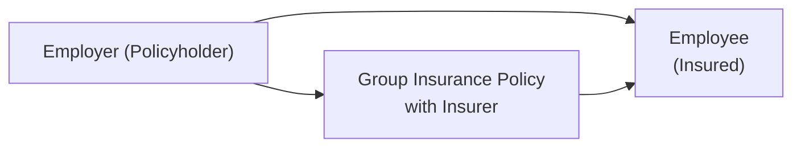

## 12.7 Group Life and Health Insurance

Picture this: you’re at the coffee machine in your office, chatting with a colleague about the benefits package that your employer just rolled out. It includes life insurance, extended health insurance, maybe even dental and a few additional perks like a critical illness rider. If your workplace is like many others in Canada, you’re probably covered by a group insurance policy that’s shared by you and your coworkers. Group life and health insurance can be an incredibly effective way for companies to protect employees’ financial well-being—plus it often comes at a lower cost than if you were to buy individual coverage on your own. 

But how exactly does group insurance work, and why might it matter to you or your clients? Let’s dig into the details.

  
### Why Group Insurance?

Many Canadian employers offer group insurance to attract and retain quality employees. Sometimes the company foots the entire bill (fully employer-paid), sometimes it’s split between the employer and employees (cost-sharing), and other times certain coverage—like optional life insurance—can be fully employee-paid (voluntary). 

Regardless of how it’s paid for, the idea behind group insurance is simple: bundling together large numbers of employees under a single policy tends to lower per-person insurance costs and streamline administration. Insurers also provide coverage with fewer medical questions—sometimes none at all––if you sign up during the initial enrollment period. 

From a financial planning perspective, this “buy in bulk” idea can be a powerful tool. It’s often cheaper and easier to get coverage through a group policy than out on the open market, especially for those who have pre-existing conditions that might make individual insurance more expensive or coverage-challenged.

### Coverage Within Group Life and Health Insurance

It’s not just life insurance that gets bundled into these plans. Employers often include:

• Group life insurance (commonly 1× or 2× your annual salary, though some offer higher multiples).  
• Accidental Death & Dismemberment (AD&D) coverage, which pays additional benefits if you die or suffer certain injuries in an accident.  
• Disability insurance (short-term, long-term, or both).  
• Extended health care, which might cover prescriptions, paramedical services, or hospital expenses not included in provincial coverage.  
• Dental benefits.  
• Vision care.  
• In some cases, critical illness coverage or wellness programs.  

This might sound like a lot, but it’s still wise to look under the hood: coverage amounts can vary, deductibles differ, and waiting periods or exclusions may apply. It’s also good to remember that not every plan is identical; companies customize to meet their budgets and their employees’ needs. 

### The Group Policy

A group policy is essentially a contract between the insurance provider and the employer (or plan sponsor). Unlike individual policies, the organization is the policyholder, and employees are the insured members. Here’s a simple diagram for how that relationship typically looks:

In this diagram, the employer secures the group policy on behalf of all eligible employees, and the insurer underwrites the agreement. Employees become plan members, receiving coverage under that policy’s terms.

  
### Advantages for Employers and Employees

From the employer’s side, providing group benefits can help:

• Attract and retain talented employees.  
• Boost morale and enhance loyalty.  
• Potentially offer tax advantages (employer-paid premiums might be deductible business expenses).  

From the employee’s perspective, group insurance can:

• Provide financial security for loved ones (through life insurance) and for oneself (through disability or extended health).  
• Offer coverage without tedious medical exams (particularly if you enroll when first eligible).  
• Be less expensive than standalone coverage.  
• Include convenient payroll deduction of premiums (the portion you pay, if any).  

I still remember a friend who discovered a pre-existing condition years ago—thankfully, she had hopped on her workplace’s group plan right away. That coverage ended up being a game changer, saving her from enormous medical bills that individual insurance might have excluded or priced steeply.

### Cost-Sharing Approaches

There’s no singular approach to cost-sharing. An employer could pay the entire premium. Alternatively, it may ask employees to chip in a portion of the monthly cost. Some common methods:

• Employer-Paid: The company covers 100% of the cost.  
• Cost-Sharing: The cost is split between the employer and employees, sometimes 50/50, sometimes 70/30, etc.  
• Voluntary Coverage: The employer still administers the plan, but employees pay the full premium for optional coverage—like supplemental life insurance above a standard multiple of salary.  

Tax treatment also varies depending on who pays the premium and the type of coverage. According to Canada Revenue Agency (CRA) guidelines, if an employer pays premiums for certain benefits, that might be considered a taxable benefit for the employee. (Always check the CRA’s official documentation—found at:  
https://www.canada.ca/en/revenue-agency/services/tax/businesses/topics/payroll.html—since these rules can shift over time.)

### Medical Underwriting (Or Lack Thereof)

One of the biggest perks of group coverage is minimal or even no individual medical underwriting. Let’s say your new office job begins and you have 31 days to enroll in a group plan. During that window, you generally won’t be quizzed on your personal medical history. If you miss that window, though, you might need to provide more information and could be denied for certain coverages—or face a waiting period or additional conditions.

It makes sense to remind employees of these deadlines. Advisors can educate Human Resources departments on best practices for communicating these “critical enrollment windows,” so no one misses the opportunity to join the plan with fewer hassles.

### Conversion Privileges

Another helpful feature of many group life policies is the so-called “conversion privilege.” If you leave your job or retire, you may have the right to convert your group life insurance (sometimes other coverages, too) to an individual policy—without needing to pass medical underwriting again. Typically, you must act within a specified timeframe (often 31 days) from the date your group policy ends. 

Although the premiums on the new personal policy might be higher—since you’re no longer part of a large group—the conversion privilege is a big plus for folks who might otherwise be uninsurable. If you’re advising a client who is retiring or changing jobs, make sure they’re aware of these windows. It’s easy for someone to let them slip by while in the midst of a career transition.

  
### Extended Health, Dental, and More

A truly comprehensive group benefits plan can go well beyond just life and AD&D coverage. Employers might offer extended health (covering prescriptions, medical devices, mental health services, and so on), dental coverage, orthotics, vision care, paramedical services like physiotherapy, or special riders such as critical illness coverage. This can significantly reduce out-of-pocket health expenses.

Employees can sometimes also buy extra coverage for spouses, partners, or children. These extended benefits can be a huge help for families—especially if the cost is leveraged by the group’s size. It’s a good idea to keep track of your plan’s annual or lifetime maximums, though. Some benefits (like orthodontics) come with caps that might not cover everything you need.

### The Advisor’s Role in Designing Group Plans

If you work with business owners—or plan sponsors—helping them design the right mix of coverage and cost can be a balancing act. Employers want to be competitive, but they also have to stay within a certain budget. As an advisor, you might:

• Evaluate employee demographics (e.g., younger workforce, older workforce, presence of families) to tailor coverage.  
• Compare quotes from various insurers to find the most cost-effective, comprehensive package.  
• Advise on whether it makes sense to opt for higher multiples of salary for life insurance, or to expand disability coverage.  
• Recommend wellness programs or health spending accounts if cost is a concern but the employer wants to offer flexible perks.  
• Coordinate with provincial insurance regulators and keep an eye on licensing requirements under CIRO for any product distribution overlaps.

A financial advisor who can clearly communicate the nuances of group coverage—like the difference between taxable and non-taxable benefits, or how a health spending account might complement existing coverage—adds tremendous value. It’s not just about picking a plan but ensuring employees actually understand and appreciate it.

### Communicating Plan Details

Let’s face it, many employees glance at the highlights of their benefits package—or the summary in their welcome letter—and then forget it until something happens. By then, it might be too late to take advantage of certain enrollment windows or make changes. 

Successful communication involves explaining:

• Coverage limitations and waiting periods.  
• Which coverage is mandatory versus optional.  
• The overall claim process.  
• How cost-sharing works, including the tax implications.  
• Conversion privileges if employment ends.  

Putting together user-friendly benefit booklets or hosting lunch-and-learn sessions where employees can ask questions is a game-changer. This fosters a better appreciation of the coverage, ensuring employees actually use (and value) the benefits they have.

### Regulatory Framework

Insurance in Canada is regulated primarily at the provincial level, but there are also federal considerations—for instance, how certain benefits may be taxed under CRA rules. When it comes to delivering financial advice related to these group plans, advisors must stay current with any licensing requirements or relevant guidelines from CIRO (the Canadian Investment Regulatory Organization), which, as of 2023, oversees investment dealers and mutual fund dealers. While group insurance itself is typically a provincial insurance matter, advisors who handle investment-related components may be subject to CIRO rules. For official updates, visit https://www.ciro.ca.

On top of that, provinces have different employment standards regarding what sorts of benefits employers must or may offer. It’s always good to consult local resources—like your provincial employment standards website––to ensure the plan is compliant. This is crucial if you have multi-province operations, since the rules can vary.

  
### Tax Considerations

Let’s say your employer pays the entire premium for a group plan that includes life insurance. Under CRA rules, the employer-paid portion of life insurance premiums is generally considered a taxable benefit for you, the employee. In other words, you’d see it added to your T4 each year. Conversely, if the plan includes health and dental benefits, in many cases, employer-paid premiums for those may not appear as a taxable benefit to you—though it depends on the province and the specific coverage. The interplay of these rules can be a bit complex, so it’s best to refer to the CRA’s website or consult a tax professional for the specifics.

### Putting It All Together: A Quick Scenario

Imagine you’re advising a small tech startup with 30 employees, mostly in their late 20s and early 30s. The budget for benefits is modest, but the owners want to offer something competitive because the tech market is—well—fiercely competitive. You might propose:

• A base life insurance of 2× annual salary.  
• Accidental Death & Dismemberment matching the life coverage.  
• A combined health and dental plan with a reasonable annual maximum.  
• Option for employees to add dependents.  
• A cost-share that’s 50/50 for the health and dental portion, to keep premiums manageable.  
• Clear communication around taxable benefits.  

Employees get coverage at a group rate, reducing potential financial stress if something goes wrong, while the startup fosters a supportive workplace culture. Meanwhile, you, as the advisor, help refine the plan’s design each year, monitoring usage and costs. It’s a win-win.

### Common Pitfalls and Challenges

Even the best group plans can have sticking points:

• Lack of clarity on coverage: Employees might assume everything is covered, only to be disappointed by exclusions.  
• Premium creep: Renewals can bring premium increases if there are many claims or if the overall demographic is high-risk.  
• Insufficient coverage levels: Sometimes 1× salary for life insurance isn’t enough to truly protect a family, or the disability benefit could be too low.  
• Conversion deadline missed: Employees leaving the company might not realize they could convert their policy until it’s too late.  

Advisors should prompt plan sponsors to communicate regularly, revisiting coverage amounts to ensure they still make sense. 

### Glossary at a Glance

• **Group Policy:** A single insurance contract covering multiple individuals (e.g., employees of a company).  
• **Accidental Death & Dismemberment (AD&D):** Coverage that pays out if the insured dies or suffers certain specific injuries or dismemberments in an accident.  
• **Cost-Sharing:** An arrangement in which both employer and employee pay portions of the insurance premium.  
• **Conversion Privilege:** The right to convert group coverage to an individual policy upon job loss or retirement, usually without new medical underwriting.

### Additional References and Resources

• **Provincial Employment Standards**: Check your province’s official website for guidelines on offering group or other voluntary benefits.  
• **Canada Revenue Agency (CRA)** Taxable Benefits Guidelines:  
  https://www.canada.ca/en/revenue-agency/services/tax/businesses/topics/payroll.html  
• **“Employee Benefits in Canada” by Morneau Shepell**: An annual report providing insights into market trends, benchmarks, and best practices.  
• **CIRO** (the Canadian Investment Regulatory Organization):  
  https://www.ciro.ca (for current licensing and compliance updates relevant to financial professionals).  
• **Open-Source Financial Tools**: Various budgeting and cash flow management apps can help track insurance benefit spending, such as GnuCash (https://www.gnucash.org) or specialized employee benefits calculators.  

  
### Encouraging a Well-Rounded Protection Strategy

Group life and health insurance can serve as an excellent foundation for an overall financial protection plan, but it’s only one component. In the broader context of personal finance (as highlighted in other sections of this course, like 12.1 Disability Insurance, 12.2 Critical Illness Insurance, and so forth), it’s wise to make sure you—and your clients—understand how these puzzle pieces fit together. If the group plan covers some elements but not enough, an individual supplemental policy might be the missing link. 

And—well—life is full of unexpected twists. Having at least some baseline coverage through an employer’s plan can ease the financial burden if a serious health event occurs. Sure, you might be young, healthy, and unstoppable now, but tomorrow you could be in a totally different situation, wishing you had coverage. That’s the sweet spot of planning: building in protection during good times so you’re covered in the not-so-good times.

  
### Best Practices

• **Educate Employees Early**: Send reminders about enrollment timelines, and host benefit orientation sessions.  
• **Review Regularly**: Revisit coverage amounts, premium costs, and usage data each year (or every couple of years).  
• **Stay Compliant**: Monitor provincial regulations and CRA updates on benefits taxation.  
• **Keep Conversion Options in Mind**: Remind employees leaving a company about critical deadlines.  
• **Encourage Complementary Coverage**: If group disability coverage is limited, consider additional personal or group coverage.  

In my experience, when employees are well-informed—knowing that they have group life insurance that’ll pay out, say, two times their annual salary, or that their spouse can also be added to a decent dental plan—they tend to stress less about finances. That morale boost can be invaluable for both the employer and employees.

  
### Real-World Example: A Case Study

Let’s take a quick look at Danielle, a 45-year-old project manager in a mid-sized marketing firm. Her employer offers:

• Life insurance of 2× salary.  
• AD&D matching the life insurance.  
• Extended health: 80% of drug expenses and 100% hospital coverage, with a $500 annual maximum on paramedical services like massage or physiotherapy.  
• Dental: 80% of basic dental work and 50% of major dental expenses, with an annual maximum of $2,000.  

Danielle pays 40% of the total premium, deducted from her paycheck automatically, and the employer pays 60%. Recently, Danielle discovered she needed emergency dental surgery that ended up costing $3,000 in total. Thanks to her group plan, she was only responsible for 50% of the major dental portion, saving her $1,500. 

She also felt secure knowing that her 2× salary coverage would help her kids cover mortgage payments and living expenses if she passed away prematurely. If she ever decides to move on from the company, she’ll have the option to convert her insurance. Her employer, meanwhile, is proud to offer a strong benefits package that helps attract talented professionals like Danielle. It’s a pretty good arrangement all around.

### Summing It Up

Group life and health insurance can be one of the most accessible and cost-effective ways for Canadians to obtain financial protection. By pooling a group’s risk, insurers can generally offer lower rates and more streamlined underwriting than individuals might face when pursuing private coverage on their own.

For financial advisors, understanding how these plans are structured—and how to optimize them for clients—is crucial. Advisors bridge the gap between the insurer and employees, helping everyone navigate the various moving parts: plan design, underwriting, cost-sharing, conversion, taxation, and so on. And if you’re an employee? Embrace the opportunity. Group insurance is an important part of safeguarding your income and savings, something that lines up perfectly with the overarching aims of prudent financial planning.

All this leads to a time-tested conclusion: having a strong benefits package isn’t just a “nice to have”—it’s essential for both the employer’s workplace culture and the financial well-being of employees. And truly, if you want to see your workplace flourish, you sometimes have to think beyond salaries, focusing on real life supports that allow people to thrive.

  
## Assess Your Understanding of Group Life and Health Insurance



### Which of the following coverages is most commonly included in a group insurance plan?
- [ ] Home insurance
- [ ] Travel insurance
- [x] Life insurance
- [ ] Stock options

> **Explanation:** Group life insurance is a core component of many employer-sponsored group plans, while home insurance, travel insurance, and stock options typically aren’t covered under a group policy.

### What is a primary advantage of group coverage when an employee first becomes eligible for the plan?
- [ ] Lower coverage amounts
- [ ] Multi-year waiting periods
- [x] Minimal or no medical underwriting
- [ ] Guaranteed eligibility for post-retirement conversion

> **Explanation:** Employees who enroll in a group plan during their initial eligibility window typically face no or minimal medical underwriting. This can be especially beneficial for those with pre-existing conditions.

### Under a cost-sharing arrangement, what does it mean when an employer offers to cover 70% of the premium?
- [x] The employer pays 70% of the premium, and employees pay the remaining 30%.
- [ ] The employer pays 70% of any eligible claims.
- [ ] Employees must have at least 70% of their salary covered.
- [ ] Conversion out of the plan costs 70% less.

> **Explanation:** Cost-sharing means the premium expenses are split between employer and employees, in this case, 70% vs. 30%.

### Which statement best describes a conversion privilege in a group policy?
- [ ] Employees cannot continue insurance after leaving.
- [ ] Premiums remain the same after converting coverage.
- [x] Employees can convert group coverage to an individual policy without new medical tests.
- [ ] Conversion privileges are only valid if employees were with their company for over 10 years.

> **Explanation:** Conversion allows departing employees to roll their group coverage into an individual policy without additional medical underwriting, though premiums typically increase due to loss of group discounts.

### When might group life insurance premiums paid by the employer be considered a taxable benefit to an employee?
- [x] If they apply to life insurance coverage
- [ ] If the employee chooses to opt out
- [x] For short-term disability coverage only
- [ ] They are never considered a taxable benefit

> **Explanation:** Employer-paid premiums for group life insurance are generally considered a taxable benefit under CRA rules. Other benefits, like certain forms of health or dental coverage, might not be taxable.

### What is the significance of an “annual maximum” in an extended health or dental group plan?
- [x] It is the maximum amount the plan will pay per year for covered services.
- [ ] It indicates the maximum number of employees who can enroll annually.
- [ ] It refers to the maximum termination age for the plan.
- [ ] It’s a limit on how many claims employees can submit.

> **Explanation:** “Annual maximum” typically refers to the cap on the amount the plan will reimburse for certain services in a given year.

### Which of the following statements is TRUE regarding minimal medical underwriting in group plans?
- [x] It generally applies only if an employee enrolls during the initial eligibility period.
- [ ] It requires employees to waive all pre-existing conditions.
- [x] It applies to group home and auto insurance.
- [ ] Late enrollees always receive an immediate upgrade in coverage.

> **Explanation:** Group plans often have little or no medical underwriting if employees sign up during the initial enrollment window. Missing that window can lead to stricter medical requirements or coverage denial.

### Why is it important to educate employees about the waiting period on certain benefits?
- [ ] It ensures employees apply for coverage immediately after they resign.
- [ ] It allows employees to get a higher salary multiple.
- [x] It helps them understand when coverage begins and avoid coverage gaps.
- [ ] It waives any cost-sharing features.

> **Explanation:** Many group benefit plans include a waiting period before coverage starts. Ensuring employees understand this helps them plan for potential coverage gaps and clarifies when they can actually start claiming benefits.

### How might an advisor help an employer design a group benefits plan?
- [x] By evaluating employee demographics and recommending coverage that fits budget and needs.
- [ ] By setting employee salaries.
- [ ] By determining the tax refunds for each individual staff member.
- [ ] By imposing mandatory health tests on employees annually.

> **Explanation:** Advisors analyze workforce needs and budgets, then suggest coverage and design elements that can optimize cost-effectiveness and comprehensiveness.

### True or False: Under group life insurance, premiums paid by the employer for the health and dental portion are generally taxed as a benefit to the employee.
- [x] True
- [ ] False

> **Explanation:** Typically, employer-paid premiums for group life insurance are a taxable benefit to the employee. Health and dental premiums, however, may or may not be taxable, depending on specific plans and provincial rules. The question phrasing might cause slight confusion—strictly speaking, group life insurance premiums are typically taxable, while health/dental are usually not. Always confirm with CRA guidelines.


