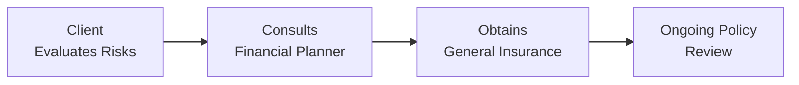

## 13.1 General Insurance Policies

General insurance—often known as property and casualty (P&C) insurance—plays a pivotal role in securing individual and business assets from unexpected events such as accidents, theft, fires, or natural disasters. It’s the safety net that helps preserve your financial plan when life gets unpredictable. In Canada, general insurance is primarily governed at the provincial and territorial levels, with additional federal oversight from the Office of the Superintendent of Financial Institutions (OSFI) for insurers incorporated federally. It’s kinda remarkable—though maybe I’m just easily impressed—how an insurance policy can mean the difference between financial security and devastating loss.

Below, we’ll dive deep into the nuts and bolts of general insurance policies in the Canadian context. We’ll explore common policy features, the importance of underwriting, regulatory considerations, and how financial planners can integrate these policies into a comprehensive plan. We’ll also toss in a few relevant personal anecdotes and real-world examples, because, well, we all know reading about insurance can get a bit dry if we don’t spice it up a little.

---

### General Insurance Policies: An Overview

General insurance is like that protective bubble you might have pictured as a kid. It surrounds us and our stuff—be that our homes, cars, or businesses—shielding us from the fallout of adverse events. I remember one cold winter night when a friend of mine discovered a burst pipe in his basement. Water was everywhere, and the damage probably would have cost more than he could afford out-of-pocket. Luckily, his homeowners insurance kicked in, paying for most of the repairs. That moment drove home how essential general insurance can be in a well-rounded financial plan.

In Canada, general insurance encompasses:  
• Property Insurance (e.g., homeowners, tenant coverage).  
• Automobile Insurance.  
• Liability Insurance (for personal and commercial needs).  
• Specialty Policies (e.g., for high-value collectibles, cyber coverage, or professional liability).

Because each province has its own insurance regulations, it’s important to check the specific rules in your region—especially regarding required coverage types and minimum policy limits.

---

### Core Components of a General Insurance Policy

When you look at an insurance policy, you typically see these key building blocks:  

**Policy Declarations**  
The declarations page is like the front cover of a book: it tells you who’s who (the policyholder, the insurer), what’s being insured, the coverage limit, the policy start and end dates, and any other vital stats. It might also outline the premium—the amount you pay for the coverage—and the deductible.

**Coverage Terms and Conditions**  
Here’s where the policy spells out what it covers (the “perils”) and what it excludes. You’ll usually see language defining your responsibilities, like maintaining the property in good condition. If you own a home, for instance, you’re obligated to fix that leaky roof sooner rather than later to avoid further damage.

**Premium**  
Premiums vary widely and are determined by factors such as:  
• The nature and value of the insured property.  
• Your personal or business risk profile.  
• Past claims history.  
• The insurer’s underwriting criteria.

Occasionally, you might see differences in premium rates due to local events; for instance, coverage in areas prone to flooding or wildfires tends to be more expensive.

**Deductible**  
A deductible is the amount you pay out of your own pocket before the insurer covers the rest of a loss. If your policy has a $1,000 deductible and your water damage claim is $10,000, you cover the first $1,000, and your insurer pays the remaining $9,000—assuming the loss is covered. Having a higher deductible typically lowers your premium because, essentially, you’re retaining a bit more risk.

**Endorsements or Riders**  
These are modifications you can add to your base policy. Maybe you want extra coverage for your new diamond engagement ring, or you’re worried about sewer backup damage in your basement. Riders can enhance or limit coverage, depending on what you negotiate.

---

### Major Types of General Insurance

General insurance is a broad category. Let’s zoom in on some common policy types in Canada:

**Homeowners Insurance**  
Protects your dwelling and personal belongings, and may also cover additional living expenses if your home is uninhabitable after a covered event. Policies can vary between named-perils (only covers specifically stated risks) and all-risks (covers almost any risk not explicitly excluded).

**Tenant Insurance**  
A must-have for renters, covering personal property and liability for accidents in the rented home. Though your landlord’s insurance covers the building, it typically won’t cover your personal belongings or personal liability.

**Condominium Insurance**  
Designed to complement a condo corporation’s master policy, which usually covers common areas and the building’s structure. Your condo policy covers your unit’s interior, personal belongings, and personal liability.

**Automobile Insurance**  
In every Canadian province, auto insurance is mandatory for drivers. While laws vary, core elements typically include liability coverage for bodily injury or property damage, accident benefits (medical and rehabilitation costs), and uninsured motorist coverage. Add-ons like collision and comprehensive coverage help with repairs if your vehicle is damaged by collision, theft, hail, or other perils.

**Commercial Property Insurance**  
Helps businesses protect physical assets such as buildings, equipment, or inventory against losses from fires, theft, and other specified risks.

**Commercial General Liability (CGL)**  
Protects businesses if they’re found legally responsible for property damage or bodily injury caused to others. If you run a small business or a large corporation, a CGL policy is usually the first line of defense in liability coverage.

**Other Niche Coverages**  
• Cyber Liability: For data breaches and cyberattacks.  
• Professional Liability (E&O/Errors and Omissions): For service providers such as consultants or financial planners (including restrictions according to CIRO and provincial guidelines).  
• Directors and Officers Liability: For board members of corporations or non-profits.  

---

### The Underwriting Process

Underwriting is the process insurers use to evaluate risk and determine premiums. They look at an applicant’s history, the property details, or the type of business to be insured. It might feel just a tiny bit invasive—like, do they really need to know how many times I’ve replaced my roof or that I have a snoring dog?—but it’s all part of calculating the probability of a claim.

In mathematical terms, a simplified premium formula might look like this:

$$
\text{Premium} = \text{Rate} \times \text{Coverage Amount} \times (1 - \text{Discounts})
$$

That’s obviously a bit of an oversimplification (insurers also factor in deductibles, overhead, claims reserves, and more). But the gist is that higher risk and higher coverage amounts lead to higher premiums.

---

### Regulatory Oversight in Canada

Insurance in Canada is governed both federally and provincially:

• **Federal Oversight (OSFI)**: The Office of the Superintendent of Financial Institutions ensures the solvency of federally incorporated insurers.  
• **Provincial Insurance Acts**: Each province and territory has an Insurance Act that sets out rules for general insurance, including licensing requirements, policy content, and consumer protection measures.  
• **Industry Bodies**: The Insurance Bureau of Canada (IBC) supports consumer education and advocacy, while organizations like the Canadian Investment Regulatory Organization (CIRO)—formed from the consolidation of the former MFDA and IIROC—provide guidance on how insurance advice can complement investment advice under a single regulatory framework (if your firm is licensed for both).  
• **Professional Designations**: Designations like Chartered Insurance Professional (CIP) or Canadian Accredited Insurance Broker (CAIB) help ensure that insurance professionals have the knowledge and skills to serve clients ethically and effectively.

---

### Integrating General Insurance into Financial Planning

As a financial planner, general insurance is crucial to building a robust plan that stands up to life’s storms. Without the right type and scope of coverage, even the most well-crafted investment strategies and retirement plans could topple under the weight of an unforeseen disaster. Here are some ways to bring these policies into the bigger financial picture:

• **Asset Protection**: Safeguard home equity, personal property, and business assets from ruinous repair bills or replacement costs.  
• **Liability Defense**: Liability suits can be devastating to personal or business wealth. Umbrella policies can also offer extra coverage above the standard policy limits.  
• **Gap Identification**: Check for coverage shortfalls—like not having flood or earthquake endorsements if you live in a high-risk zone.  
• **Business Continuity**: For entrepreneurs, business property and liability coverage ensures the enterprise can weather unforeseen events, maintaining the client’s personal and professional stability.  
• **Life Stages**: Whether your client is getting married, buying a home, or starting a business, general insurance needs shift over time.

---

### Case Studies & Practical Illustrations

Let’s tackle a couple of scenarios that show how insurance policies play out in real life:

**Case Study #1: The Basement Flood**  
Ah, yes, this one is close to home—literally. A homeowner finishes renovating a basement but forgets to add sewer backup coverage. A few months later, a torrential rainstorm overwhelms the local drainage, causing water to flow back into the basement. The baseline homeowners policy excludes this category of water damage because it’s considered a sewer backup. As a result, tens of thousands of dollars in repairs come entirely out of the homeowner’s pocket. The moral of the story? Always check your existing policy’s endorsements and see if you need more.

**Case Study #2: Sue the Small-Business Owner**  
Sue runs a small graphic design studio with a few employees. She invests in commercial property insurance to protect her office, equipment, and valuable client files. She also opts for commercial general liability insurance in case a client visiting her office slips on wet flooring and is injured. A year later, a freak electrical surge damages her computer systems. Fortunately, the commercial property policy covers the replacement costs, allowing Sue to recover quickly without tapping into her personal emergency fund or business line of credit. Meanwhile, because of that same coverage, her staff can keep working with minimal interruption.

---

### Common Pitfalls & Best Practices

**Pitfalls**  
• **Underinsurance**: Overlooked changes in your property or business can leave you lacking coverage.  
• **Ignoring Policy Exclusions**: Failing to realize certain perils (like floods or earthquakes) aren’t automatically covered.  
• **Choosing a Low Deductible Blindly**: There’s a trade-off. While a lower deductible might feel safer, it raises premiums. If you rarely claim, you’re paying more than you need to.  
• **Unclear Policy Wording**: Many policyholders don’t read the definitions, which can lead to nasty surprises during claim time.  
• **Failing to Update Coverage**: Renovations, acquisitions, or expansions can lead to outdated coverage if you don’t revise your policy accordingly.

**Best Practices**  
• **Regular Policy Review**: Reassess coverage whenever you experience a significant life or business event.  
• **Shop Around**: Rates and coverage can differ between insurers—comparisons can help you find the right balance of cost and protection.  
• **Get Professional Advice**: Working with a broker or financial planner who has specialized knowledge ensures you aren’t missing anything.  
• **Risk Mitigation**: Take preventive measures: install smoke alarms, security systems, or water leak detectors to reduce premiums and avoid claims.  
• **Maintain Documentation**: Keep an updated inventory of personal or business assets. In the event of a loss, having documentation can expedite claims.

---

### Practical Tools & Additional Resources

Below is a quick snapshot showing the role of risk management in a financial plan:

1. [Provincial Insurance Acts]  
   • Ontario’s Insurance Act, Alberta’s Insurance Act, and others set out the legal framework for insurance contracts.

2. [Office of the Superintendent of Financial Institutions (OSFI)](https://www.osfi-bsif.gc.ca)  
   • Regulates federally incorporated insurance companies and helps ensure their financial soundness.

3. [Insurance Bureau of Canada (IBC)](https://www.ibc.ca)  
   • Offers consumer resources, guidance, and policy-related information.

4. [Canadian Investment Regulatory Organization (CIRO)](https://www.ciro.ca)  
   • Oversees investment dealers, mutual fund dealers, and market integrity; historically IIROC and MFDA served these functions separately until their amalgamation into CIRO. Consult CIRO guidelines if you’re offering insurance with investment products.

5. [Chartered Insurance Professional (CIP) and Canadian Accredited Insurance Broker (CAIB)]  
   • Designations that demonstrate technical knowledge of property and casualty insurance.

---

### Conclusion

General insurance can seem like a complex tapestry of terms, conditions, and coverage options. But if you peel back the layers, it boils down to one simple principle: safeguarding your financial plan from the unexpected. Whether you’re a homeowner, a renter, or a thriving entrepreneur, you have assets worth protecting. And as you, the financial planner, look after your clients’ well-being, it’s essential to evaluate not only how much they’re earning, saving, or investing—but also how well they shield that wealth from sudden shocks.

So, the next time you discuss a client’s financial plan, give due attention to their P&C insurance. A thorough understanding of policy coverage, exclusions, deductibles, and endorsements can make a massive difference in the face of adversity. Yes, the details can be tedious, but trust me—when that basement flood happens (and hopefully it doesn’t!), your clients will be unbelievably grateful that you steered them in the right direction.

---

## Test Your Knowledge: General Insurance Policies Essentials



### Which of the following best describes the main purpose of general (property and casualty) insurance?

- [ ] To replace all forms of life and health insurance.  
- [x] To protect individuals and businesses from financial loss due to unexpected property damage and liability claims.  
- [ ] To eliminate the need for homeowners and automobile insurance.  
- [ ] To shift the responsibility of risk evaluation entirely to the insurer.  

> **Explanation:** The core function of P&C insurance is to provide financial support when unforeseen accidents, fires, theft, or liability claims occur.

### Which of these policy elements outlines the coverage limits, premiums, and insured parties?

- [ ] Riders or endorsements.  
- [ ] Exclusions clause.  
- [x] Policy declarations page.  
- [ ] Deductible schedule.  

> **Explanation:** The declarations page usually includes the insurer’s name, the policyholder’s name, coverage limits, premiums, and the policy term.

### How does increasing your deductible generally affect your insurance premium?

- [x] It tends to decrease the premium because you assume a greater share of any loss.  
- [ ] It tends to increase the premium because the insurer expects more claims.  
- [ ] It has no impact on the premium.  
- [ ] It only affects the premium if you have an all-risks policy.  

> **Explanation:** Higher deductibles typically reduce premiums because policyholders are taking on more out-of-pocket risk, thus lowering risk exposure for insurers.

### If a policyholder requires additional protection against sewer backup, which policy feature would they likely seek?

- [x] Policy endorsement/rider.  
- [ ] Increasing the deductible.  
- [ ] Waiver of premium.  
- [ ] Policy exclusions.  

> **Explanation:** Endorsements or riders enhance the coverage of a base policy to include perils or situations not automatically covered.

### What is the difference between “replacement cost” and “actual cash value (ACV)”?

- [x] Replacement cost covers the expense to replace property without depreciation, while ACV factors in depreciation.  
- [ ] They are the same thing; different vendors just use different terms.  
- [ ] ACV provides higher payouts than replacement cost.  
- [x] Replacement cost never requires proof of purchase, whereas ACV does.  

> **Explanation:** Replacement cost indemnifies you for the full cost to repair or replace items at current prices, while ACV takes depreciation into account. Policy requirements around proof of purchase can vary, but typically both forms of coverage require documentation.

### Automobile insurance is mandatory in every Canadian province. Which aspect does it typically include?

- [x] Third-party liability coverage.  
- [ ] Unlimited repair costs for custom paint jobs.  
- [ ] Guaranteed premium refunds if no accidents occur.  
- [ ] Optional coverage for personal belongings in a vehicle.  

> **Explanation:** Provincial laws require at least third-party liability coverage; collision, comprehensive, and belongings coverage are usually optional or separate endorsements.

### In the context of small-business insurance, what is the primary benefit of having Commercial General Liability (CGL) coverage?

- [x] It protects the business against liability claims for bodily injury or property damage.  
- [ ] It forces employees to accept personal liability for accidents at work.  
- [x] It only covers inventory losses due to theft.  
- [ ] It is unnecessary if the business is small enough.  

> **Explanation:** A CGL policy is the first layer of defense against claims where your business’s operations, services, or products cause harm or damage.

### Which of the following is an example of a common pitfall in general insurance?

- [x] Failing to review or update coverage after major renovations.  
- [ ] Purchasing a policy with a high deductible and low premium.  
- [ ] Asking your broker about available riders for additional coverage.  
- [ ] Understanding the definitions of covered perils.  

> **Explanation:** Underinsurance is a real risk if you don’t update your policy after significant life changes or renovations.  

### Why might regular policy reviews be essential in a financial plan?

- [x] To ensure coverage keeps pace with life or business changes (e.g., renovations, new equipment).  
- [ ] To reduce coverage to minimize claim payouts.  
- [ ] To eliminate the need for any endorsements or riders.  
- [ ] To avoid ever having to contact your insurer again.  

> **Explanation:** Life circumstances change; so do insurance needs. Regular reviews help prevent coverage gaps.  

### True or False: The Insurance Bureau of Canada (IBC) provides resources primarily focused on consumer education and policy information.

- [x] True  
- [ ] False  

> **Explanation:** The IBC advocates for consumers within the insurance industry and provides educational resources and policy guidance.


