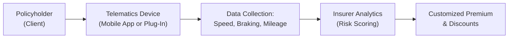

## 13.2 Automobile Insurance

Imagine waking up on a crisp winter morning and seeing a thin layer of fresh snow on the roads. You’re all set for a quick drive to your favorite coffee shop—or so you think. Suddenly, your car hits a patch of black ice, and the next thing you know, you’ve grazed a streetlamp. In moments like these, you appreciate automobile insurance a whole lot more, right? Automobile insurance isn’t just a legal requirement—it's your financial shield when the unexpected happens on the road.

This section will explore the various components of automobile insurance in Canada, detailing how coverage is mandated, how premiums are calculated, and how you can customize coverage to fit your clients’ needs or your own. We’ll also check out some practical examples, a few personal anecdotes, and real-world tips on saving money—like usage-based insurance or telematics—without sacrificing protection.

  
-------------------------------------------------------
  
## Overview of Automobile Insurance in Canada

Automobile insurance in Canada is mandatory in every province and territory. Each jurisdiction decides which coverages and minimum limits are required. While this federal-like structure can seem daunting, the core philosophy remains the same: if you drive, you’re responsible for ensuring that you can compensate anyone who suffers injury or property damage due to your actions.

### Mandatory Coverage Across Provinces

Even though each province and territory has its own legislation, you’ll generally find that the following coverages are required almost everywhere:

• Third-Party Liability Insurance  
• Accident Benefits (also referred to as Section B in certain places)  
• Uninsured or Underinsured Motorist Coverage  

These mandatory elements ensure a baseline level of protection for both you and others on the road. Let’s explore each one in detail.

  
-------------------------------------------------------
  
## Required Coverages

### Third-Party Liability Insurance

Third-Party Liability is the foundation of your auto insurance policy. It protects you from the financial liability of causing bodily injury or property damage when you’re at fault in an accident. 

• Minimum Limit: The required minimum varies by province. For instance, in Ontario, the mandatory minimum limit is often set at $200,000, but many financial advisors recommend coverage of at least $1 million—or even $2 million—to protect personal assets more robustly.  
• Importance: If you cause an accident, you could be sued for damages in the hundreds of thousands or even millions of dollars, especially if someone sustains severe injuries. Higher limits act like a fortified safety net for your personal net worth.

  
### Accident Benefits (“No-Fault” Benefits)

Accident Benefits offer coverage for medical expenses, rehabilitation costs, and loss of income for the insured driver and passengers—regardless of who is at fault. In some provinces, this coverage is referred to as “no-fault” benefits, implying that you can claim benefits from your own insurer without having to prove another driver was responsible.

• Medical and Rehabilitation: Covers treatments such as physiotherapy or psychological counseling.  
• Income Replacement: Provides a portion of lost wages if you’re unable to work.  
• Other Benefits: May include attendant care, housekeeping, and even death benefits, depending on your province and policy.

No-fault systems vary in scope. Provinces like Ontario operate under a hybrid tort/no-fault system, while places like Quebec lean more toward a pure no-fault approach for injuries. Keep in mind that some provinces (e.g., BC, Manitoba, Saskatchewan) have public insurance systems with a specific structure for accident benefits.

  
### Uninsured/Underinsured Motorist Coverage

What if the other driver is at fault but has no insurance, or doesn’t have enough coverage to pay for damages? Uninsured/Underinsured Motorist Coverage provides compensation if you’re hit by a driver who is financially unable to handle the costs of the accident.

• Coverage Amount: Typically mirrors your Third-Party Liability limit, but it can vary.  
• Importance: Without it, you might be left to pay your own expenses—even if the other party was truly at fault.

  
-------------------------------------------------------
  
## Optional Coverages

Mandatory coverages focus on protecting others you might harm and ensuring some basic protection for you. Optional coverages help protect your own vehicle from collisions, theft, vandalism, and so forth. 

### Collision Insurance

Collision insurance pays to repair or replace your vehicle if it’s damaged in a collision with another vehicle or object. Yep, that includes telephone poles, ditches, or even that sneaky curb that jumped out of nowhere. 

• Deductibles: You can usually choose your own deductible—the higher the deductible, the lower the premium.  
• Limitations: Collision coverage doesn’t protect against non-collision events (for that, you’d need comprehensive).

  
### Comprehensive Insurance

Comprehensive insurance covers losses that aren’t related to collisions—examples include theft, vandalism, fire, extreme weather, and fallen objects (like tree branches in a storm).

• Exclusions: Some events may not be covered, such as mechanical breakdown or wear-and-tear.  
• Premium Cost: Because it covers a broader range of risks, comprehensive insurance tends to be priced more expensively than an equivalent collision policy. 

  
### Specified Perils

Choosing specified perils coverage is a way to budget for insurance if you only want protection against certain named risks (e.g., theft, fire). It’s cheaper than full comprehensive coverage but also more limited. If an event isn’t explicitly named—say, hail damage—then you won’t have coverage for it.

  
### All-Perils

All-perils coverage combines collision and comprehensive under a single policy and sometimes includes broader coverage conditions. While it can be the most expensive approach, it offers a wide net of protection, meaning you’ll likely be covered for nearly any sudden, unforeseen damage to your car (unless specifically excluded).

  
-------------------------------------------------------
  
## Premium Calculation Factors

Insurance premiums aren’t pulled out of a hat; they’re carefully calculated by actuaries (the math geniuses behind the scenes). Expect your premium to be influenced by:

• Driver Demographics: Age, driving record, past claims, convictions for speeding or other traffic infractions.  
• Vehicle Type and Model: The make, model, and year of the car, plus its replacement cost and safety features, can heavily affect premiums.  
• Location: Urban vs. rural, and even the neighborhood you park in can make a significant difference, as theft rates and accident frequencies vary.  
• Intended Usage: Commuting to work, carpooling, rideshare driving, or purely personal errands.  
• Coverage Limits and Deductibles: Higher liability limits and lower deductibles generally mean higher premiums—and vice versa.

  
### Real-World Example

Let’s say an Ontario driver is a 30-year-old professional with a clean driving record. They drive a 2018 sedan primarily to commute to work in Toronto. One insurer might quote $1,900 a year for standard coverage (third-party liability, accident benefits, collision, and comprehensive) with a $500 deductible. Another insurer might offer $1,850 with a $1,000 deductible, but limit certain benefits. Shopping around is key. 

  
-------------------------------------------------------
  
## Cost Optimization and Coverage Improvements

Sometimes, I’ll chat with friends who reluctantly mention how pricey their car insurance is—but then they admit they haven’t updated their coverage in five years. Reviewing your insurance, or advising clients to do the same, is crucial. Here are a few strategies:

1. **Shop Around or Bundle**: Insurance providers often give multi-vehicle or multi-line discounts. Bundle auto and home insurance together.  
2. **Increase Deductibles**: You’ll pay more out of pocket for a claim, but you could see significant premium savings.  
3. **Telematics**: Usage-based or “pay-as-you-drive” coverage can lower costs if you have a cleaner driving style (gentle acceleration, less braking, fewer kilometers driven).  
4. **Driving Habits**: Sometimes, carpooling or switching from daily, high-traffic commuting to remote work can reduce your distance-driven category, lowering your premium.  
5. **Regular Policy Review**: Encourage yearly check-ups to ensure coverage matches your changing needs—maybe you moved, sold a car, or started driving less.

  
-------------------------------------------------------
  
## Provincial Drivers: Public and Private Insurance Arrangements

Canada has a mix of public and private auto insurance systems:  

• **British Columbia**: Insurance typically provided through the Insurance Corporation of British Columbia (ICBC), a Crown corporation.  
• **Manitoba**: Manitoba Public Insurance (MPI) runs the basic coverage program.  
• **Saskatchewan**: Saskatchewan Government Insurance (SGI) handles coverage.  
• **Quebec**: Société de l’assurance automobile du Québec (SAAQ) provides personal injury coverage, whereas private insurers cover property damage.  

In many other provinces—including Ontario, Alberta, and the Atlantic provinces—auto insurance is offered by private insurance companies. However, the mandatory and optional coverages remain broadly similar across Canada, with slight variations on coverage limits and definitions.

  
-------------------------------------------------------
  
## Legal and Regulatory Considerations

While automobile insurance policies are subject to provincial rules, the broader financial and regulatory environment across Canada may involve interactions with entities like the Canadian Investment Regulatory Organization (CIRO). Note that CIRO oversees investment dealers and mutual fund dealers, but not automobile insurers—this function is handled at the provincial level by frameworks such as Ontario’s Financial Services Regulatory Authority (FSRA) or the Insurance Council of British Columbia. However, the interplay between a client’s investment portfolio, personal net worth, and risk management strategies often crosses into the realm of financial planning.

For example, if a client is going through an estate freeze or owns a small business in parallel with their personal finances, ensuring their automobile insurance coverage is adequate is part of holistic financial planning. While automobile insurance is not regulated by CIRO, any recommendation from a financial planner must consider potential liabilities that could harm the client’s overall financial position.

  
-------------------------------------------------------
  
## Telematics and Emerging Trends

As technology evolves, so does insurance. Telematics, or usage-based insurance, is making it possible for insurers to tailor premium rates more closely to a driver’s individual habits—like how quickly they accelerate, how hard they brake, and even the time of day they drive. Clients who drive infrequently, or follow best-driving practices, may see noticeable discounts.

Below is a simple diagram showing how telematics can fit into the auto insurance picture:

In short, think of telematics as the “pay-as-you-go” concept. If you drive safely, at off-peak times, or fewer miles each year, you could enjoy cheaper insurance.

  
-------------------------------------------------------
  
## Case Study: Balancing Premium Costs and Adequate Coverage

### Scenario

Susan is a 40-year-old freelance consultant in Calgary with a busy schedule and two kids in hockey. She drives a relatively new minivan to shuttle them around. Over the past few years, Susan’s had no claims, but she’s accumulated a couple of speeding tickets. She’s worried about premium surcharges from these infractions and wonders if cutting down on coverage would help.

### Discussion

• **Third-Party Liability**: Susan’s car insurer suggests $2 million in coverage because she has substantial home equity and personal savings. A serious at-fault accident could lead to catastrophic lawsuits.  
• **Collision and Comprehensive**: The minivan still has an outstanding car loan, so the lender requires both collision and comprehensive coverage.  
• **Telematics**: Susan opts in to a telematics program. She’s a mostly cautious driver—even if she occasionally speeds—and the device might reward her for not driving during peak hours.  
• **Discounts**: She bundles auto and home insurance, increasing her overall discount.  

### Outcome

Susan sees a plausible improvement in premiums over time, particularly if her telematics data shows safe driving. She maintains strong coverage (liability and damage to the vehicle) while reducing out-of-pocket expense.

  
-------------------------------------------------------
  
## Best Practices, Pitfalls, and Strategies

• **Regularly Update Policy Information**: A common pitfall involves forgetting to update address changes, newly licensed drivers in the household, or a new job with a shorter commute. These changes can impact premiums.  
• **Avoid Coverage Gaps**: Sometimes, people might be tempted to cancel coverage for a season if they don’t drive much. However, coverage gaps can make insurers wary in the future, often raising your rates.  
• **Select Higher Liability Limits**: Liability lawsuits can be extremely costly. If you own a home or have significant investments, carrying lower liability might put your assets at risk.  
• **Review Deductibles**: A higher deductible can provide substantial savings, but ensure you have sufficient emergency funds to cover that deductible.  
• **Check for Additional Endorsements**: For example, if you regularly rent or borrow cars, there are endorsements (like the OPCF 27 in Ontario) that can extend your coverage.

  
-------------------------------------------------------
  
## Glossary of Key Terms

• **Third-Party Liability** – Coverage for bodily injury or property damage you cause to others when you’re at fault.  
• **Accident Benefits** – Provides coverage for medical, rehabilitation, and income loss regardless of who is at fault.  
• **No-Fault Insurance** – Each driver’s own insurer pays for certain damages, irrespective of fault. The scope varies by province.  
• **Collision Coverage** – Covers your vehicle if it collides with another vehicle or an object.  
• **Comprehensive Coverage** – Handles non-collision incidents like theft, vandalism, or fire.  
• **Telematics** – Usage-based programs that track driving habits to calculate insurance premiums.  
• **Endorsement (Auto)** – An optional add-on or amendment to a basic auto insurance policy.

  
-------------------------------------------------------
  
## References and Resources

1. **Provincial Regulators**  
   • Insurance Corporation of British Columbia (ICBC): https://www.icbc.com  
   • Quebec’s SAAQ: https://saaq.gouv.qc.ca  
   • Financial Services Regulatory Authority of Ontario (FSRA): https://www.fsrao.ca  
   • Manitoba Public Insurance: https://www.mpi.mb.ca  
   • Saskatchewan Government Insurance: https://sgi.sk.ca  

2. **Insurance Bureau of Canada (IBC)**  
   • For consumer guidance on auto insurance basics, check IBC’s official website:  
     https://www.ibc.ca

3. **Canadian Investment Regulatory Organization (CIRO)**  
   • While it does not regulate auto insurance, CIRO oversees investment dealers and mutual fund dealers in Canada. Visit https://www.ciro.ca for up-to-date investment regulatory details.

4. **Insurance Institute of Canada**  
   • Offers online courses on underwriting practices and auto insurance coverage:  
     https://www.insuranceinstitute.ca

5. **Open-Source Financial Tools & Resources**  
   • For budgeting or comparison of insurance quotes, you can explore open-source platforms like GitHub for code-based projects that help you compare quotes from different insurers.  

Remember that no matter which province or territory you call home, or how many years you’ve been driving, your auto insurance needs evolve with your life. Doing a periodic “checkup” on your coverage makes sense—especially as your financial goals and personal circumstances change.

  
-------------------------------------------------------
  
## Test Your Knowledge: Automobile Insurance in Canada



### Which of the following coverages is typically mandatory in all Canadian provinces and territories?

- [ ] Loss of Use Coverage  
- [x] Third-Party Liability Insurance  
- [ ] Collision Coverage  
- [ ] Comprehensive Coverage  

> **Explanation:** Third-Party Liability Insurance is mandatory across all provinces and territories; it protects you against claims involving bodily injury and property damage to others.

### What is the primary purpose of Accident Benefits (or Section B) coverage?

- [ ] Cover damage to your home if your vehicle strikes it  
- [ ] Provide legal defense if you injure someone else  
- [x] Offer medical and income replacement benefits regardless of fault  
- [ ] Pay for rental car costs  

> **Explanation:** Accident Benefits provide coverage for medical costs, rehabilitation, and income replacement for you and your passengers, regardless of who is at fault during an accident.

### In a no-fault system, which insurer generally pays for the policyholder's medical expenses and lost income?

- [ ] The at-fault driver's insurer  
- [x] The policyholder's own insurer  
- [ ] The provincial government exclusively  
- [ ] The liable party’s insurer if the policyholder requests  

> **Explanation:** Under a no-fault structure, your own insurer covers your medical costs, rehabilitation, or income replacement without requiring proof of fault from another driver.

### Which coverage would protect you from property damage caused by theft or vandalism?

- [ ] Collision Coverage  
- [ ] Accident Benefits  
- [x] Comprehensive Coverage  
- [ ] No-Fault Coverage  

> **Explanation:** Comprehensive coverage pays for damage due to non-collision incidents like vandalism, theft, fire, or natural disasters.

### Which of the following could help reduce your auto insurance premiums while still maintaining adequate coverage?

- [x] Using telematics or usage-based insurance  
- [ ] Selecting the lowest possible liability limit  
- [x] Bundling auto and home insurance  
- [ ] Filing multiple small claims  

> **Explanation:** Telematics rewards safe driving habits with possible discounts. Bundling your insurance policies can lead to multi-line discounts. Opting for lower liability limits or filing small claims often increases long-term costs.

### If you are involved in an accident where the at-fault driver has insufficient coverage, the coverage that compensates you for your damages is:

- [ ] Collision Coverage  
- [x] Uninsured/Underinsured Motorist Coverage  
- [ ] Specified Perils Coverage  
- [ ] Comprehensive Coverage  

> **Explanation:** Uninsured/Underinsured Motorist Coverage protects you when the at-fault driver doesn’t have enough insurance to cover your losses.

### Which organization primarily offers auto insurance in British Columbia?

- [ ] Insurance Bureau of Canada  
- [x] Insurance Corporation of British Columbia (ICBC)  
- [ ] Canadian Investment Regulatory Organization (CIRO)  
- [ ] Financial Services Regulatory Authority (FSRA)  

> **Explanation:** ICBC is a Crown corporation responsible for providing basic auto insurance in BC. CIRO oversees investment dealers and mutual fund dealers, not auto insurance.

### What is a potential drawback of increasing your collision coverage deductible?

- [ ] It always increases your premium  
- [x] You will pay more out of pocket if a claim occurs  
- [ ] It reduces the coverage limit  
- [ ] The insurer can decline future coverage  

> **Explanation:** Raising your deductible can lower premiums, but it means you have to pay more if there’s a collision claim.

### Which statement about telematics usage-based insurance is most accurate?

- [x] It tracks driving habits (speed, braking, mileage) to tailor premiums  
- [ ] It replaces all forms of mandatory coverage  
- [ ] It’s illegal in most Canadian provinces  
- [ ] It leaves your coverage unchanged  

> **Explanation:** Telematics programs record data such as acceleration, braking, and total mileage. Insurers use this data to offer discounts or personalized premium rates.

### True or False: Accident Benefits are paid out based solely on who is at fault in a motor vehicle incident.

- [ ] True  
- [x] False  

> **Explanation:** Accident Benefits are often provided on a no-fault basis, ensuring that insured drivers and passengers can access coverage regardless of fault.


