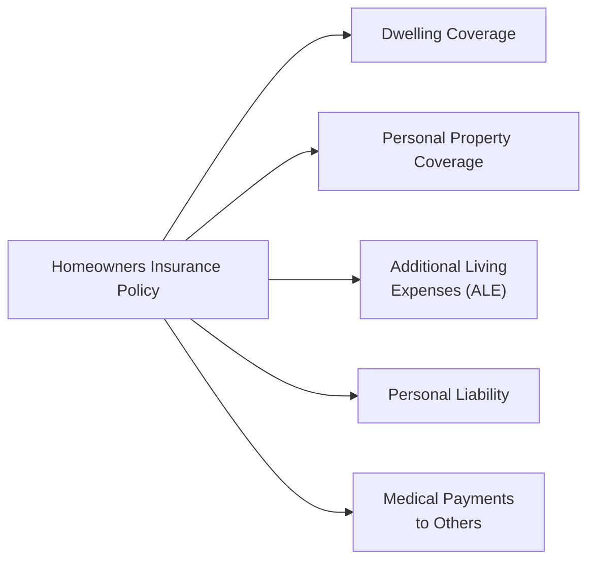
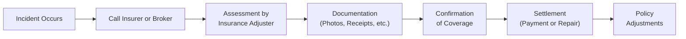

## 13.3 Homeowners Insurance

Homeowners insurance is one of those topics many folks hear about from their real estate agent or mortgage provider—but rarely do we sit down and explore exactly what it entails. I remember back when I purchased my first home, I assumed the policy I got covered just about everything. Then, a tree branch creaked and fell on my roof during a storm, and I found myself on the phone, anxiously hoping the insurer would fix it. Thankfully, they did, but it got me thinking: Did I truly know what was in my policy?

This section aims to demystify homeowners insurance. We’re going to walk through:

• The basics of homeowners insurance and why it matters.  
• Different policy types like Comprehensive (All Risk), Broad Policy, and No-Frills.  
• Key coverages (Dwelling, Personal Property, Additional Living Expenses, Personal Liability).  
• Common underwriting factors that shape premiums and availability.  
• Additional coverages or endorsements like overland flood, sewer backup, or earthquake insurance.  
• A few best practices and pitfalls to avoid.  
• References to Canadian regulations, institutions, and resources.

So, let’s dig right in.

---

### Understanding Homeowners Insurance

You might be wondering: Why does it feel like everyone mandates you have homeowners insurance the minute you sign those mortgage papers? Simply put, homeowners insurance is designed to protect you, your property, and your loved ones from the financial consequences of unexpected events like fires, windstorms, theft, or liability lawsuits. If something goes terribly wrong—like a massive leak that soaks your living room—or if a guest trips on a loose step and sues for injuries, an insurance policy can literally be your financial safety net.

At its core, homeowners insurance covers two broad categories:

1) Damage to your property (including dwelling structures and personal belongings).
2) Liability (for injuries or property damage you might cause to others).

However, the degree of coverage within these categories differs depending on what type of policy you have and which endorsements or additional riders you may add.

---

### Types of Homeowners Insurance Policies

Homeowners insurance policies in Canada typically take a few forms, each offering different levels of protection:

**Comprehensive (All Risk) Policy**  
Often referred to as an “all risk” policy, it covers just about every peril you can imagine unless it’s stated as an exclusion. War, terrorism, or nuclear incidents are common examples of excluded perils. For instance, if your basement floods because of a burst pipe (and it’s not excluded), a Comprehensive Policy will likely pay for necessary repairs, subject to policy limits.

**Broad Policy**  
A Broad Policy blends elements of all-risk and named-perils coverage. It insures the building under “all risk,” meaning any peril not specifically excluded is covered. However, personal property is covered on a named-perils basis (only the perils explicitly listed—like fire, smoke, or wind—are covered). This approach can be more budget-friendly while still offering robust protection for your dwelling.

**Named-Perils Policy**  
Named-perils (sometimes called “Specified Perils”) coverage extends protection only to the causes of loss explicitly listed in the policy. If it’s not named, it isn’t covered. Common perils might include fire, smoke damage, lightning, explosion, windstorm, hail, and vandalism. This policy type often carries lower premiums but can result in an unexpected denial of coverage if you’re not aware of the limitations.

**No-Frills Policy**  
A No-Frills Policy offers very limited coverage, typically designed for dwellings that don’t meet normal underwriting requirements (for instance, a historical home with severely outdated wiring). Premiums may be lower, but so is the coverage. These policies are usually considered a last resort.

---

### Key Coverages Within a Homeowners Policy

A typical homeowners policy might look broad or complicated on the surface. But generally, it breaks down into the following main coverages:

**Dwelling Coverage**  
This one is straightforward: it protects the physical structure of your home—walls, floors, roof, and foundation. If a fire tears through your living room, the insurer helps pay to rebuild or fix that structural damage, up to the policy limits. How much you should insure your dwelling for can be a bit tricky. People sometimes confuse “market value,” the price you’d get if you sold your home, with “replacement cost,” the amount needed to rebuild it from scratch. Insurers often use “replacement cost” to calculate how much you need in coverage.

**Personal Property Coverage**  
If you can pick it up and walk away with it—like your furniture, electronics, or personal items—it usually falls under “personal property.” Many insurers set policy limits at a certain percentage of your dwelling coverage. For instance, you might have personal property coverage worth 70% of your dwelling limit. But be aware, certain belongings such as jewelry, art, or even specialized sporting equipment might exceed typical coverage limits, so you might want to schedule these items separately if they’re particularly valuable.

**Additional Living Expenses (ALE)**  
Say a natural disaster (like a fire) ravages your living and dining rooms, making your home uninhabitable. ALE helps pay for hotel stays, short-term rentals, or other living expenses like meals if you’re displaced from your home. It’s often overlooked because people don’t imagine they’ll need to move out, but when disaster strikes, these costs can climb quickly.

**Personal Liability Coverage**  
This coverage is designed to step in if you or a family member is found responsible for another person’s injury or property damage. For instance, if your dog bites a neighbor, or a friend slips on an icy driveway, you could face legal liability. This coverage helps fund legal fees, settlement payouts, and related costs. Liability coverage typically starts at a certain baseline (e.g., $1 million), but you can purchase higher limits. Especially in litigious societies, having adequate liability protection is crucial.

**Medical Payments to Others**  
Medical payments coverage can help pay minor medical expenses (like X-rays, some clinic visits, or ambulance rides) if someone gets hurt on your property, without needing a lawsuit or full-on liability claim. It’s a goodwill gesture that can help pay for immediate treatment.

---

### Underwriting Factors

Insurance underwriting is that mysterious process of evaluating how “risky” it is to insure your home. If the underwriting says you’re high risk, you’ll either face higher premiums or possibly be declined coverage altogether. How do insurance companies decide?

**Location**  
The physical location of your home matters. Homes in areas prone to flooding, earthquakes, or wildfires might face surcharges or might require specialized coverage. Crime rates also factor in—if the neighborhood sees frequent break-ins, you may see higher premiums.

**Age and Condition of Your Home**  
Is your wiring modern or knob-and-tube from several decades ago? How’s your plumbing? What about the age of your roof? Insurance companies often ask these questions to gauge the likelihood of future claims.

**Proximity to Fire Hydrants and Fire Stations**  
A home that’s 20 minutes away from the nearest fire station might be at greater risk of extensive fire damage compared to a home close by.

**Risky Features**  
Pools, wood-burning stoves, or certain dog breeds can bump up premiums. Insurers see these as potential hazards that could result in bigger claims.

**Claims History**  
If you’ve made multiple claims before (or if your property has a known track record of damage), underwriters may view you as more likely to make future claims.

---

### Additional Coverage Options

Sometimes a standard policy doesn’t cover all situations. You can add endorsements or riders for more comprehensive protection:

**Sewer Backup Coverage**  
Wouldn’t wish a sewer backup on my worst enemy. Let’s say you get a major downpour that overwhelms the city drains—water can back up into your basement. Standard homeowners policies often don’t include sewer backup coverage, so you can add it separately.

**Overland Flood Coverage**  
Overland flood coverage helps if water from an overflowing river or heavy rainfall seeps in through doors and windows. In many parts of Canada, overland flood coverage used to be nearly impossible to find, but insurers increasingly offer it, especially if your home is in an area that’s not deemed too high-risk. Check with your broker or insurer; it’s often an extra endorsement.

**Earthquake Coverage**  
Not every region in Canada is prone to seismic activity, but folks on the West Coast certainly know the big one could hit at some point. If you want to insure against earthquake damages, you typically need an additional rider.

**Scheduled Personal Property**  
High-value collectibles such as jewelry, rare artwork, or expensive coin collections may not be fully covered by standard policy limits. If you own a prized baseball card or aunt’s heirloom ring, scheduling these on a personal articles floater ensures they’re covered for their appraised value.

---

### Best Practices and Common Pitfalls

It’s one thing to buy a policy; it’s another to maintain it wisely:

**Regularly Review and Update Your Coverage**  
Did you renovate the kitchen or add a big extension to your house? If so, your existing coverage limits might be too low. Let your insurer know about major upgrades so you’re not underinsured.

**Pick a Deductible You Can Handle**  
A higher deductible can lower your premiums, which might look appealing—until you actually file a claim. If you can’t comfortably cover that deductible out of pocket, you might end up in a squeeze.

**Maintain Your Property**  
Perform routine maintenance, like cleaning eavestroughs, fixing leaky pipes, or updating old wiring. Not only does this reduce the risk of damage, but some insurers also offer discounts for preventive measures.

**Avoid Unnecessary Small Claims**  
If you file multiple small claims, your insurer might get jittery or raise your premiums. I once had a coworker who filed two small claims within a single year—one for a broken window, another for some minor water damage—and he was non-renewed afterward. Not fun. So ask yourself if the claim is worth the potential long-term consequences.

**Compare Policies Periodically**  
Just as you might shop around for better mortgage rates, it pays to see if different insurers offer better coverage or lower premiums. Insurers have different underwriting philosophies and can interpret risk factors very differently.

---

### Real-World Scenario: A Burst Pipe in January

Let’s say it’s -20°C outside, your pipes freeze, and one of them bursts, flooding your basement. If you have a Comprehensive (All Risk) Policy, and frozen or burst pipes aren’t explicitly excluded (though you usually must maintain heat in the home), you’ll likely be covered. You file a claim, the insurance adjuster comes out, confirms the damage, and you eventually receive coverage for repairs to your basement walls, flooring, and possibly the cost of drying out your space. However, if in the insurer’s investigation they discover you left on vacation and turned your furnace completely off, the insurer may deny coverage because you didn’t take reasonable steps to prevent the pipes from freezing.

In a Named-Perils Policy, you would want to make sure “burst pipe” or “water damage from freezing” is actually listed. If it’s not, you might be out of luck. With coverage details—especially water damage coverage—always read the fine print.

---

### Visualizing Policy Components

Below is a simple Mermaid diagram that illustrates how different components fit together within a homeowner’s policy structure.

In this diagram, each node represents a major coverage category. They all connect back to your main homeowners insurance policy.

---

### Claim Process Overview

It may also help to see how a claim typically flows once you encounter a disaster. This is, of course, generalized, and your insurer might have slightly different steps.

---

### Links to Canadian Regulations and Resources

Canada’s regulatory framework around property insurance is primarily governed at the provincial level, but federal guidelines, industry associations, and self-regulatory organizations also play roles.

• **Provincial Regulators and Insurance Acts**: Each province has legislation that sets the minimum standards for insurance contracts. For instance, in Ontario, refer to the **Ontario Insurance Act** and the **Financial Services Regulatory Authority of Ontario (FSRA)** for consumer guidance.  
• **Public Safety Canada**: (https://www.publicsafety.gc.ca) Offers resources for natural disaster preparedness, including floods, wildfires, and earthquakes.  
• **Insurance Bureau of Canada (IBC)**: (https://www.ibc.ca) Maintains earthquake insurance guidelines and other educational materials about property insurance.  
• **Canadian Mortgage and Housing Corporation (CMHC)**: (https://www.cmhc-schl.gc.ca) Provides mortgage and housing risk mitigation tips. Also touches on how some insurance requirements may overlap with mortgage default insurance for high-ratio mortgages.  
• **CIRO (Canadian Investment Regulatory Organization)**: (https://www.ciro.ca) While CIRO focuses primarily on oversight of investment dealers and mutual fund dealers, it’s helpful to know the regulatory environment if you hold real estate in conjunction with other investment assets.  
• **CIPF (Canadian Investor Protection Fund)**: Protects client assets held by member firms (investment or mutual fund dealers) if the firm fails. Not directly relevant to homeowner’s insurance, but it’s good to remember that CIPF is an investor protection fund, separate from property insurance coverage.

---

### Final Thoughts

Homeowners insurance isn’t just another bill—think of it as a cornerstone of your overall financial plan, especially if you combine it with other elements like life insurance or investment protection. A well-chosen policy can stabilize what might otherwise be a catastrophic financial burden. But do your homework. Talk to an experienced insurance broker or financial planner who understands your situation. Review your policy yearly, take advantage of any applicable discounts (like those for fire alarms, home security systems, or updated roofing), and always ask questions if you’re unsure.

Ultimately, you don’t want to discover you have gaps in your coverage after a major incident. As the cliché goes, it’s better to be safe than sorry—especially when it’s your home on the line.

---

## Test Your Knowledge: Homeowners Insurance Essentials



### Which of the following best describes a Comprehensive (All Risk) homeowners policy in Canada?

- [ ] It covers only a specific set of named perils.
- [x] It covers all perils except those explicitly excluded in the policy.
- [ ] It provides minimal coverage for high-risk properties.
- [ ] It prevents the policyholder from adding any riders or endorsements.

> **Explanation:** A Comprehensive (All Risk) policy indeed covers all perils unless the policy specifically excludes them.

### Which coverage typically pays for a temporary hotel stay if your home is declared uninhabitable after a fire?

- [ ] Personal Liability
- [x] Additional Living Expenses
- [ ] Dwelling Coverage
- [ ] Personal Property Coverage

> **Explanation:** Additional Living Expenses (ALE) pay for extra costs of living away from home if your house is uninhabitable due to an insured peril.

### Named-Perils policies ONLY cover:

- [x] The risks specifically listed in the policy.
- [ ] All risks not specifically excluded in the policy.
- [ ] Flood, sewer backup, and overland water events.
- [ ] Damage from war or terrorism.

> **Explanation:** By definition, Named-Perils policies provide coverage only for the perils explicitly named, such as fire, lightning, or windstorm.

### Which of the following is TRUE regarding underwriter concerns about older homes?

- [x] Older wiring and plumbing might increase the perceived risk, resulting in higher premiums.
- [ ] Updated wiring always decreases premiums by 90%.
- [ ] The age of a home is never relevant to an insurer.
- [ ] An older home is always uninsurable.

> **Explanation:** Insurers often view older electrical, plumbing, and heating systems as higher-risk, which can lead to higher premiums.

### If you have extremely valuable jewelry or fine art, you may need:

- [x] Scheduled Personal Property Coverage (floater).
- [ ] A No-Frills policy.
- [x] To insure them separately for their specific appraised value.
- [ ] Only standard Personal Liability coverage.

> **Explanation:** High-value items typically exceed the limits of standard homeowners insurance, so they need to be “scheduled” or specifically insured on a separate floater.

### Which of the following typically DOES NOT come standard in most homeowners policies?

- [ ] Personal Liability
- [ ] Personal Property
- [x] Earthquake Coverage
- [ ] Dwelling Coverage

> **Explanation:** Earthquake damage usually requires an additional endorsement or rider.

### True or False: Filing multiple small claims can potentially lead to higher premiums or even non-renewal of your homeowners policy.

- [x] True
- [ ] False

> **Explanation:** Insurers track your claims history. Multiple claims in a short timeframe can raise red flags, resulting in surcharges or non-renewal.

### In a Broad Policy, the building is covered on an all-risk basis. The personal property is covered on:

- [ ] An all-risk basis.
- [x] A named-perils basis.
- [ ] A no-frills basis.
- [ ] An “additional living expense” basis.

> **Explanation:** Broad Policies combine all-risk coverage for the building with named-perils coverage for personal property.

### Which of the following is typically looked at during underwriting?

- [x] Claims history of the homeowner.
- [ ] Height of the interior doors.
- [x] Presence of a wood-burning stove.
- [ ] Colour of the walls.

> **Explanation:** Underwriters look at factors like claim history and structural features like wood-burning stoves for potential hazards.

### True or False: Flood damage from an overflowing river is generally included in all standard homeowners insurance policies in Canada.

- [ ] True
- [x] False

> **Explanation:** Overland flood coverage is not automatically included in most standard policies and usually requires an added endorsement.


