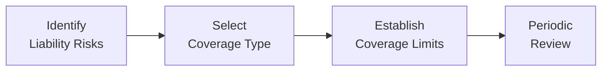

## 13.4 Liability Insurance

Liability insurance is—quite frankly—like having a sturdy safety net under a tightrope. Maybe that’s a silly mental image, but it works. If you ever get caught off guard by a lawsuit, liability insurance steps in to help pay for legal fees or damages, which can protect you from financial hardship. And, well, given how broad life’s “what-ifs” can be, it’s one of those rare pieces of insurance you definitely don’t want to skip. 

I still remember chatting with a friend who had a neighbor slip and fall on his front porch during a winter storm. The neighbor ended up with a broken ankle, and the medical bills were through the roof. Fortunately, my friend’s homeowner’s policy had liability coverage that sprang into action and saved him from paying massive legal and medical expenses out of pocket. That was a moment that really drove home just how valuable liability coverage can be.

Liability insurance protects you if you’re held responsible (legally liable) for causing harm. This harm can be physical injury to a person or damage to their property or even intangible harm like defamation. Liability coverage is often included in standard homeowners and automobile policies, but there are also specialized plans—like Commercial General Liability (CGL) or Directors and Officers (D&O) Liability for businesses—that you can purchase separately. For financial planning purposes, the real question is: Do you have enough coverage, and do you have the right kind of coverage for your unique risks?

Below, we’ll explore the main types of liability insurance, how they integrate into a financial plan, some considerations for coverage amounts, and how to apply these strategies in personal and business contexts. We’ll also highlight best practices, potential pitfalls, and references to official Canadian regulations and institutions.

---

### What Is Liability Insurance?

In essence, liability insurance pays third parties on your behalf if you’re found at fault (legally liable) for harm. That can mean bodily injury—like a guest breaking their arm at your home—or property damage—like your child accidentally hurling a baseball through a neighbor’s window. Liability claims can also stem from professional activities: imagine a financial advisor inadvertently making a mistake in client portfolio analysis. 

From a legal standpoint, when liability is established it typically arises under concepts like negligence (not exercising reasonable care) or strict liability (responsibility without needing to prove negligence). For instance, if an unsafe product design injures a consumer, liability could be found under strict liability principles. Liability insurance is designed to manage these diverse legal exposures.

---

### Common Types of Liability Insurance

#### Personal Liability
Personal liability coverage is included in most standard homeowners or tenants policies. It covers legal defense costs and damages if you unintentionally injure someone or damage their property. This can range from someone falling on your icy walkway to your dog biting a neighbor. 

• Coverage Extent: Typically covers you and your family members who live in your household.  
• Typical Limits: Basic policies might start with coverage of $100,000 or $300,000, although higher limits are increasingly available (e.g., $1 million or more).  
• Personal Anecdote: My cousin once had a small water leak in her apartment that affected the unit below. She didn’t realize it until the ceiling started to sag downstairs. Liability coverage on her tenant’s policy paid for repairs in the unit below, so she didn’t have to shell out thousands of dollars herself.

---

#### Commercial General Liability (CGL)
A Commercial General Liability policy is the backbone of many business insurance programs. It protects businesses against claims arising from bodily injury, property damage, personal injury, or advertising-related harm (like libel or slander) that occur in the course of business operations.

• Coverage Extent: Day-to-day operations, premises-related risks, and some aspects of contractual liability.  
• Who Needs It: Virtually any business—from a small corner café to a large manufacturing company.  
• Example: A delivery customer trips on your store’s wet floor and sues for medical bills. A CGL policy helps cover legal fees and any damages awarded.

For financial planners in particular, CGL coverage goes hand in hand with other specialized liability insurances like Errors & Omissions (E&O), making sure both general and professional exposures are covered.

---

#### Professional Liability (Errors & Omissions, or E&O)
We often shorten it to “E&O” coverage in the industry. This is for professionals who provide advisory or specialized services—accountants, lawyers, financial advisors, consultants, and more. E&O pays for damages when mistakes, negligence, or omissions in your professional duty cause a client financial harm.

• Coverage Extent: Legal costs and damages from professional negligence, errors in advice, miscalculations, or oversights.  
• Why It’s Crucial: Even well-intentioned professionals can give incomplete or mistaken advice, and professional liability lawsuits can be quite costly.  
• Regulatory Perspective: If you’re a financial advisor licensed under CIRO (the Canadian Investment Regulatory Organization), or if you belong to a provincial law society, you may face mandatory E&O coverage requirements.  
• Example: A financial planner makes a significant error in retirement projections. The client sues for damages, claiming they had to extend their working years due to poor advice.

---

#### Directors and Officers (D&O) Liability
D&O policies protect the personal assets of individuals serving as directors or officers of a company or nonprofit organization. If someone alleges that their decisions caused financial harm or another type of damage (like a breach of fiduciary duty or mismanagement), these policies respond.

• Coverage Extent: Usually covers defense costs, settlements, and judgments.  
• Importance: Being a director or officer has major perks but also serious legal responsibilities. Even innocent mistakes can lead to lawsuits, especially if you handle large sums of money or direct corporate strategy.  
• Typical Clients: Board members of charities, non-profit organizations, private and public companies, and condo boards.  

---

#### Umbrella Insurance
Umbrella policies supply extra liability coverage once the limits on your underlying policies—like auto or homeowners insurance—are maxed out. It’s sort of like adding an extra layer of protection on top of the standard coverage.

• Coverage Extent: Doesn’t typically stand alone; you generally must have a designated level of primary coverage first.  
• Why It’s Useful: High-net-worth individuals often carry umbrella coverage because they’re prime targets for large lawsuits. That said, anyone concerned about catastrophic liability exposure could benefit.  
• Example: You’re found responsible for a major auto accident, and the payout is $2 million beyond your auto policy’s $1 million coverage. An umbrella policy might cover the additional $1 million (depending on your coverage limits).

---

### Liability Insurance and Financial Planning

In putting together a comprehensive financial plan, we look not only at a client’s investments, retirement goals, and taxes, but also the potential holes that could unravel their entire plan. Without proper liability insurance, a major lawsuit can wipe out savings, investments—pretty much everything.

Considerations in your personal financial plan:

• Ensuring Adequate Coverage Limits: If you own a home, a car, or a business, ask whether your basic coverage is enough for worst-case scenarios. Sometimes, an umbrella policy is the simplest “extra step” for robust protection.  
• Professional Exposures: If you work in a profession requiring certification or licensing, verify whether your professional body requires a certain level of E&O coverage. This is especially pertinent for financial planners, accountants, lawyers, investment consultants, or medical practitioners.  
• Business and Corporate Exposures: If you’re self-employed or run a small corporation, a Commercial General Liability policy could anchor your coverage. If you’re on the board of directors for any organization, consider D&O coverage as well.  
• Reviewing the Fine Print: Policies vary a lot in their definitions, exclusions, limits, and defense-cost provisions. Reviewing them carefully—or getting a licensed insurance professional’s take—can save headaches later.

Below is a simplified visual representation of how one might approach evaluating and implementing liability insurance in a financial plan:

- A["Identify  Liability Risks"]: Start with analyzing personal, professional, or business exposures.  
- B["Select  Coverage Type"]: Choose from personal liability, CGL, E&O, D&O, umbrella, etc.  
- C["Establish  Coverage Limits"]: Assess net worth, business vulnerability, and potential lawsuit size.  
- D["Periodic  Review"]: Update your coverage as your personal life, business interests, and net worth evolve.

---

### Key Legal Concepts in Liability

Below are some terms frequently used in liability insurance discussions:

• Negligence: Failing to exercise reasonable care, resulting in damage or injury to another person.  
• Vicarious Liability: When you’re held responsible for someone else’s actions—like an employer being liable for the acts of employees.  
• Strict Liability: Imposes responsibility without needing to prove negligence or fault. Product liability, for instance, often follows strict liability.  
• Duty of Care: The standard of care you’re expected to meet in a given situation (e.g., a professional’s duty to her clients).  

Understanding how liability is determined helps clarify exactly what type of coverage you need.

---

### Potential Pitfalls and Best Practices

• Pitfall 1: Underestimating Coverage Requirements  
  – Many individuals and businesses purchase bare-minimum coverage based on premiums alone. The risk is that a large judgment can still bankrupt you if your policy’s limit is too low.  
  – Best Practice: Work closely with an insurance broker or financial planner to estimate a realistic level of potential liability and select coverage accordingly.

• Pitfall 2: Not Disclosing Material Facts  
  – Insurance policies often state that coverage can be denied if you withhold relevant information (e.g., prior lawsuits or known hazards at your business site).  
  – Best Practice: Be transparent about your claims history, nature of business, or any unusual personal exposures.

• Pitfall 3: Assuming Business-Related Activities Are Covered by Homeowners Insurance  
  – If you operate a small side business from home, your homeowner’s policy might not extend coverage to your commercial pursuits.  
  – Best Practice: Clarify with your insurer or add an endorsement. You might need a separate commercial policy if your operations are significant.

• Pitfall 4: Mixing Personal Assets and Business Liabilities  
  – Directors and officers can inadvertently mix personal assets with corporate exposures. If you don’t have D&O, your personal assets might be at risk.  
  – Best Practice: Maintain clear corporate governance, separate personal and business finances, and have a robust D&O policy.

---

### Incorporating Liability Insurance into Financial Plans

Liability insurance is crucial for robust financial and estate planning. The logic is pretty straightforward: if you’re facing a game-changing lawsuit, your entire plan could collapse without adequate coverage. Because we talk about net worth, retirement savings, and tax strategies in other chapters, it’s vital to keep liability coverage in the conversation to protect what you’ve built, both personally and professionally.

A helpful approach might be to think of your coverage levels as thresholds aligned with your net worth. For instance, if your net worth leaps from $500,000 to $2 million over a decade, you may need to re-evaluate your existing homeowners and auto policy limits or consider an umbrella policy. Sometimes the difference in premiums can be marginal compared to the new level of protection you’d get.

For business owners, incorporate annual reviews of your CGL, E&O, or D&O coverage. This can align with your company’s year-end planning or strategic retreats. Keep track of staff changes, expansions into new markets, or major new contracts—these can all elevate your legal risk profile.

---

### Real-World Case Study

Let’s consider a scenario that ties in multiple types of coverage:

• Sarah is a successful financial advisor who also operates a small tax consulting service from her home office. She owns a townhouse worth $700,000 and has an investment portfolio of $350,000, plus $50,000 in an emergency fund.  
• She invests in E&O coverage at levels required by her professional association for her advisory services, but she also sets up a separate CGL policy for her tax consulting side-business because she sometimes hosts clients in her home (which her standard homeowner's policy might exclude).  
• She’s a board member for a local nonprofit, so she ensures the organization has a D&O policy to shield her from personal liability regarding decisions made in that capacity.  
• Because her net worth is creeping close to $1.1 million in total assets, Sarah also decides to buy an umbrella policy that adds another $1 million on top of her homeowner’s and auto coverage.  

When asked why she took so many steps, Sarah sums it up like this: “I love what I do, and I’ve worked hard to build up these savings. It only takes one big incident or lawsuit to unravel everything.”  

This holistic approach helps Sarah insulate her personal wealth, business interests, and professional standing from liability exposures.

---

### References and Further Exploration

• CIRO (Canadian Investment Regulatory Organization):  
  – For official guidelines on professional liability education for financial advisors, visit [https://www.ciro.ca](https://www.ciro.ca)  
• Employment and Social Development Canada (ESDC):  
  – Workplace safety and employer liability guidance: [https://www.canada.ca/en/employment-social-development.html](https://www.canada.ca/en/employment-social-development.html)  
• Provincial Law Societies & Professional Bodies:  
  – For mandatory E&O insurance requirements in regulated professions (lawyers, doctors, accountants, etc.).  
• Insurance Institute of Canada:  
  – Offers extensive courses on commercial liability, specialized liability, and risk management.  

---

### Glossary
• Commercial General Liability (CGL): Coverage for bodily injury, property damage, and personal/advertising injury for business entities.  
• Errors & Omissions (E&O): Professional liability insurance for professionals accused of providing negligent services.  
• Umbrella Insurance: Extra liability coverage that goes beyond the limits of existing policies.  
• Directors and Officers (D&O) Insurance: Protects personal assets of corporate directors and officers from management-related claims.  
• Vicarious Liability: When an individual or entity is held responsible for the acts of another (like an employer for employees).  
• Strict Liability: Liability that doesn’t depend on negligence or intent to harm.  
• Negligence: A failure to exercise reasonable care, resulting in damage or injury to another.

---

Liability insurance, as you can see, is not just for big companies or people with multiple homes—though they surely need it, too. It’s for everyday folks, professionals, and small business owners who simply want to protect their financial stability. However you customize your coverage, just remember to check in regularly as your personal and professional circumstances change. You don’t want a coverage gap to derail the life you’ve worked so hard to build.

## Test Your Knowledge: Liability Insurance Essentials Quiz



### In the financial planning context, why is liability insurance so critical?

- [x] To prevent lawsuits and large financial losses from wiping out personal or business assets
- [ ] Because it replaces a client’s income during periods of disability
- [ ] It is solely for mortgage protection
- [ ] Only professionals need liability insurance

> **Explanation:** A major liability lawsuit can derail a client’s entire financial plan. Liability insurance provides a safety net, preventing massive out-of-pocket settlement costs.

---

### Which of the following types of insurance would most likely cover an accident where a restaurant customer slips on a wet floor?

- [ ] Errors & Omissions (E&O) insurance
- [x] Commercial General Liability (CGL) insurance
- [ ] Umbrella insurance
- [ ] Directors and Officers (D&O) insurance

> **Explanation:** CGL covers bodily injury and property damage claims arising from daily business operations, like slip-and-fall accidents on the premises.

---

### Which statement best describes umbrella insurance?

- [x] An additional layer of liability protection that sits on top of existing coverage
- [ ] A standalone coverage with no underlying policies required
- [ ] A replacement for auto or homeowners insurance
- [ ] A type of property insurance

> **Explanation:** Umbrella insurance provides extra liability coverage once the limits of underlying policies (home, auto, etc.) are reached, extending protection.

---

### A financial advisor makes an oversight in retirement planning for a client, causing them financial loss. Which type of liability insurance would address this scenario?

- [ ] Commercial General Liability (CGL)
- [x] Professional Liability (Errors & Omissions)
- [ ] Directors and Officers (D&O)
- [ ] Umbrella insurance

> **Explanation:** E&O insurance is designed for professionals who are sued for errors, omissions, or negligence in the performance of their services.

---

### D&O coverage protects:

- [x] Personal assets of directors and officers for claims regarding managerial decisions
- [ ] Only the corporation’s physical property
- [x] Organizational board members from legal liability
- [ ] Shareholders from product liability claims

> **Explanation:** Directors and Officers (D&O) insurance covers the personal assets of company leaders who can be sued for decisions made on behalf of the organization.

---

### Vicarious liability typically occurs when:

- [x] An employer is held responsible for the wrongdoing of an employee
- [ ] A person negligently causes a car accident
- [ ] There is no direct relationship between the defendant and any employee
- [ ] There is confusion over who owns the insurance policy

> **Explanation:** Vicarious liability means employers can be held liable for actions done by employees in the course of employment.

---

### Which one of the following is a common pitfall for people who purchase liability insurance?

- [x] Underinsuring their coverage limits
- [ ] Selecting a plan with a reputable insurer
- [x] Forgetting to consider professional exposures requiring E&O coverage
- [ ] Obtaining multiple quotes before deciding

> **Explanation:** Underestimating coverage limits and forgetting specialized risks are two big oversights that can leave people exposed when a lawsuit arises.

---

### Sarah, a financial advisor, is also on the board of a local nonprofit. Which coverage combination would likely serve her best?

- [x] Errors & Omissions and Directors & Officers Liability
- [ ] Strict liability policy only
- [ ] Basic homeowners plus open-peril property coverage
- [ ] A standalone commercial auto policy

> **Explanation:** As a financial advisor, Sarah may need E&O coverage, and for her role as a board member, D&O would protect her personal assets.

---

### An employer fails to ensure machinery is safe, and a product harms a consumer. Under “strict liability,” do plaintiffs need to prove negligence?

- [x] No, they can establish liability without showing negligence
- [ ] Yes, negligence must be proven beyond a reasonable doubt
- [ ] Yes, but only if it was a criminal matter
- [ ] Yes, and they must show repeat offenses

> **Explanation:** Under strict liability, the plaintiff doesn’t need to prove the defendant was negligent; liability is assumed due to the inherently dangerous or defective nature of the product or activity.

---

### Liability insurance coverage is essential in protecting financial plans because it:

- [x] Acts as a buffer against potentially devastating legal claims
- [ ] Primarily covers only property damage on your own home
- [ ] Is meant to replace a life insurance policy
- [ ] Is only required by large multinational corporations

> **Explanation:** Liability insurance provides necessary protection from legal claims that can result in significant financial damage, safeguarding a well-structured financial plan.


