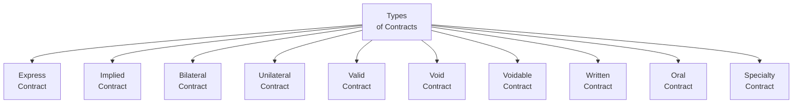

## 14.2 Types of Contracts

Contracts. How could something that sounds so formal have such a huge impact on our everyday financial decisions? Well, contracts are a big deal in financial planning. They affect the advice you give, the deals you make, and the obligations you form on behalf of your clients—or yourself. They’re everywhere: from investment advisory agreements to mortgages, lease agreements, reward programs, or even something as simple as depositing a cheque at the bank.

In Canada’s financial industry, it’s especially important to understand the basics, because everything from client-advisor relationships to the purchasing of insurance or real estate involves some type of agreement. In my early days as a financial planner, I remember drafting a friendly “checklist” contract for a neighbor who wanted help with her small bakery business. I never realized how easily a handshake agreement can turn into a mess when things aren’t spelled out. This article will walk you through key definitions and examples, so you’ll be way more prepared than I was back then.

Below, we’ll look closely at different contract types—how they form, how they’re enforced, and why it matters—particularly if you’re providing financial advice or running a financial planning practice.

---

### Express vs. Implied Contracts

First off, you’ve got express contracts—these are the straightforward ones. An express contract is formed by clear, explicit (spoken or written) words. For instance, a mortgage agreement or an investment advisory contract specifying fees and services is typically an express contract, because all the terms each side is agreeing to are spelled out in writing. And who doesn’t like clear instructions, right?

Implied contracts, on the other hand, are a bit sneakier. They form from actions or circumstances, rather than explicit language. Picture this: you walk into a coffee shop, order a latte, and pay at the cash register. By stepping up and setting down your money, you’ve just created an implied contract. In the context of financial planning, an implied contract might arise when a client leaves funds on deposit with a bank. The bank accepts the deposit and implicitly agrees to process the client’s transactions—even if there’s no formal handshake or signature. If you’re advising clients who operate small businesses, they might come across implied contracts more often than they realize (like a routine arrangement with a vendor who delivers goods monthly without a newly signed contract each time).

---

### Bilateral vs. Unilateral Contracts

Most contracts in financial planning are bilateral. In a bilateral contract, both parties exchange promises. Think about a typical service agreement between an investment advisor and a client. The advisor promises to provide financial planning services and ongoing guidance. In exchange, the client promises to pay a fee. Each side is contractually bound to do something for the other. Bilateral contracts are the bread and butter of everyday transactions and standard financial planning engagements.

A unilateral contract, by contrast, involves a promise by one party that can only be accepted by performance from someone else. Here’s a classic example: a lost pet poster offering a $100 reward. “I will pay you $100 if (and only if) you find my dog.” That’s one-sided until the performance occurs. We see fewer of these in financial planning, but it can come up in reward-based loyalty programs. For instance, a brokerage might say, “We’ll give you a bonus if you transfer your assets here and maintain a certain balance.” You accept by taking the action—transferring your assets.

---

### Valid, Void, and Voidable Contracts

When we say a contract is valid, we mean it has all the required elements under the law—offer, acceptance, consideration, capacity, and legal purpose. Suppose you have a valid contract to set up a registered account (e.g., an RRSP) for someone. If everything meets the legal essentials (no duress, no misrepresentation, lawful purpose, etc.), that contract can be enforced in court if necessary.

A void contract is essentially a nullity. It might appear to be a contract on paper, but it’s missing a crucial element or deals with an illegal object or purpose. Because of that, it’s treated as though it never existed. For instance, if a so-called “contract” was entered into for illegal insider trading, you’d have no valid contractual rights or obligations from it, because the subject matter is unlawful.

A voidable contract is likely legitimate in principle but has a legal defect that allows one or more parties to back out. Maybe one party was coerced or misled, or maybe they were a minor without capacity. In such cases, the contract can be affirmed (made good) or avoided at that party’s choice. As a financial planner, you might see this come into play if a client signs an agreement under serious misrepresentation or undue pressure, then later exercises the right to cancel.

---

### Written vs. Oral Contracts

If my early experience with that friendly neighborhood bakery taught me one thing, it’s the value of writing things down. Written contracts are more straightforward to prove. They also help both parties clarify their responsibilities. Certain contracts—particularly those that deal with real estate or property—must be in writing in many provinces under statute of frauds legislation. For example, Ontario’s Statute of Frauds typically requires land agreements to be written. This common-sense requirement aims to cut down on guesswork and potential disputes over big assets like real estate.

Oral contracts can still be binding, but they can be a nightmare to prove if there’s a disagreement. For instance, if you verbally promise to invest a client’s money in specific assets, you can create an oral contract, but you’ll struggle if the client later disputes the arrangement and there’s no written documentation. It’s not illegal to rely on oral contracts, but having a paper trail (or at least a digital signature or confirmation email) is infinitely better for clarity and risk management.

---

### Specialty Contracts (Under Seal)

Historically, a contract sealed with wax was considered especially formal: the seal itself was recognized as acceptance in place of consideration. Today, you won’t see many folks busting out the wax stamp—unless you’re dealing with certain legal or notarial contexts. However, the principle of the “contract under seal” does still exist in Canadian law and can show up in certain real estate or corporate documents. By affixing a seal, it’s understood that you’re seriously bound by the promise. While less common in modern daily business, the concept might matter if you’re dealing with older or more specialized forms of contracts (especially in real estate leniency or large corporate transactions). A few older trust deeds or mortgage documents still might say “signed, sealed, and delivered.”

---

### Why Types of Contracts Matter in Financial Planning

Now, you might be thinking, “Well, that’s cool, but how does this help me as a financial planner?” Understanding the type of contract is huge. It influences the rights and obligations each party has—especially your client. And if a contract is found to be void or voidable, your client’s entire arrangement could crumple.

• Express vs. Implied: Great to spot potential liability or silent obligations.  
• Bilateral vs. Unilateral: Important to see who’s promising what, and under what conditions.  
• Valid, Void, Voidable: If your client unknowingly enters into a void or voidable agreement, you can guide them on whether they can reject or uphold it.  
• Written vs. Oral: Minimizes misunderstandings. Also helps with regulatory compliance under CIRO guidelines.  
• Specialty Contracts: Might be relevant for certain large or formal deals.

Financial planners who know these nuances can help clients avoid pitfalls or effectively terminate disadvantageous agreements. They can also help draft or recommend proper contract forms for anything from a family loan arrangement to a cross-purchase agreement for business succession.

---

### A Quick Visual Overview

Sometimes it helps to get a visual snapshot. Below is a simple Mermaid diagram illustrating different types of contracts we’ve discussed.

After examining this diagram, you can see how each category not only stands alone but can interact in interesting ways (e.g., you can have an express, bilateral, valid contract that’s also written, etc.). The challenge is often determining which combination your client’s actual agreement falls under.

---

### Practical Guidance for Financial Planners

• Keep it in writing: Even if your province allows oral contracts, a written contract is almost always better for clarity.  
• Double-check legal capacity: If your client doesn’t have the capacity to contract (due to age or mental fitness), you might be inadvertently creating a voidable contract.  
• Watch for misrepresentation: If you sense a client was misled into signing, you may advise them to seek legal counsel about the possibility of making the contract voidable.  
• Stay on top of compliance: As of 2023, CIRO (the Canadian Investment Regulatory Organization) sets the rules for investment dealers and mutual fund dealers. Make sure your client agreements meet CIRO guidelines for disclosure and client communications.  
• Watch for required writings: Some contracts must be written under provincial statute of frauds. That’s an absolute must-watch if the contract involves land or real property in Ontario or other provinces with similar legislation.

---

### Case Study Example

Imagine a scenario: Your client, Sarah, verbally agrees with a cousin to invest $20,000 in a partnership for a new tech startup. She provides the funds, but they never put anything in writing. Several months later, the cousin claims Sarah just gave him a “gift” of $20,000. Now Sarah wants the money back plus a share in any profits—she believed it was an investment. With an oral contract, who is right? That’s precisely why you want to advise Sarah (and all clients) to formalize such arrangements. A simple written contract specifying that this was an investment—for instance, “Bilateral, express, and valid contract with each party’s responsibilities spelled out”—can help clarify the terms. Otherwise, Sarah’s stuck in a muddy “he-said, she-said” dispute about whether there was even a contract at all.

---

### Common Pitfalls and Best Practices

• Incomplete or Ambiguous Terms: If critical details about performance or payment are missing, the contract can be deemed unenforceable or give rise to serious disputes.  
• Failing to Identify the Contract Type: Sometimes clients assume any handshake or promotional promise is binding. Not all promotional statements form a unilateral contract unless the conditions for acceptance are crystal clear.  
• Overlooking Regulatory Requirements: If you’re not aligning with CIRO’s compliance guidelines in Canada, you could face regulatory actions.  
• Legal Capacity Concerns: Dealing with older clients or minors? Double-check capacity. If a contract is entered into with someone who lacks capacity, it may be voidable—or not even recognized at all.  
• Using Old Sealed Forms Unnecessarily: Specialty contracts might offer certain advantages, but if you’re not sure why the seal is there, consult a legal professional before you assume it’s still valid or relevant.

---

### Glossary of Key Terms

• Express Contract: Formed by explicit written or spoken words.  
• Implied Contract: Formed by actions or circumstances rather than explicit statements.  
• Bilateral Contract: An agreement in which each party makes a promise in exchange for the other’s promise.  
• Unilateral Contract: An agreement involving one party’s promise, accepted by performance of the other party.  
• Valid Contract: Has all essential legal elements and can be enforced in court.  
• Void Contract: An agreement with a missing essential element or involving illegal/illicit factors—treated as though it never existed.  
• Voidable Contract: A valid contract at face value, but one party can avoid it under certain circumstances (e.g., if induced by misrepresentation).  
• Specialty Contract: Historically supported by a seal, indicating serious commitment or substituting for consideration.  

---

### References & Additional Resources

• Department of Finance Canada – For insights into financial legislation shaping contracts in the financial services sector:  
  https://www.fin.gc.ca/

• CIRO – Canada’s newest self-regulatory organization (SRO) for investment dealers and mutual fund dealers. Check out their guidelines for client agreements:  
  https://www.ciro.ca/

• Provincial Statute of Frauds legislation (Ontario’s is an example):  
  https://www.ontario.ca/laws/statute/90s19

• “Essentials of Contract Law” by Martin A. Frey – A detailed look at contract fundamentals.

• Online Seminar: “Types of Contracts in Canadian Business,” often offered by local bar associations or continuing legal education platforms.  

• Canadian Investor Protection Fund (CIPF) – Canada’s sole investor protection fund (post-2023). Protects client assets in case of a member firm insolvency.

---

### Conclusion

Contracts might sound intimidating, but they’re basically just formal understandings that guide our financial world. Whether you’re helping a client sign a lease, set up an investment account, or plan out a major business deal, understanding the different types of contracts is like having a compass that points everyone in the right direction.

From my early experience with the bakery to the more formal agreements we see daily (and everything in between!), it’s clear that knowing how a contract is formed—and what kind it is—really can save time, money, and emotional energy down the road. So, I’d encourage you to keep building your knowledge of contract law. You might be surprised how often you rely on these concepts without even thinking about it.

Happy financial planning, and good luck making sure all those dotted lines are signed with confidence!

---

## Test Your Knowledge: Mastering Contract Types in Financial Planning



### Which statement best describes an express contract in a financial planning context?

- [ ] It requires a wax seal to be enforceable.
- [x] It has clearly stated terms, whether spoken or written.
- [ ] It cannot include any financial considerations.
- [ ] It is never legally enforceable.

> **Explanation:** An express contract is formed by clearly stated terms, either orally or in writing. This is the most common type of contract in financial planning engagements.

### What characterizes a unilateral contract?

- [ ] Both parties exchange mutual promises.
- [x] One party makes a promise that can only be accepted through performance.
- [ ] It automatically becomes void after a year.
- [ ] It is always implied, never express.

> **Explanation:** In a unilateral contract, only one party makes a promise, and the other party accepts by performing a specific act (e.g., a reward for finding lost property).

### In what circumstance might a contract be deemed voidable?

- [x] When one party entered into the contract due to misrepresentation or under duress.
- [ ] When no one remembers the terms of the agreement.
- [x] When one of the parties lacked capacity to contract.
- [ ] When both parties fully performed their obligations.

> **Explanation:** A contract is voidable if there were issues like misrepresentation, undue influence, or lack of capacity (e.g., a minor or someone mentally incapacitated). The injured party may cancel the contract.

### If a contract lacks a lawful purpose, it is generally considered:

- [ ] Voidable.
- [ ] Valid but unenforceable.
- [ ] Unilateral.
- [x] Void.

> **Explanation:** Contracts for illegal or unlawful purposes are void. Essentially, they’re treated as though they never existed under the law.

### Which of the following contracts typically must be in writing under provincial statute of frauds?

- [x] A contract for the sale of land.
- [ ] A promise to buy a used car.
- [x] A mortgage agreement.
- [ ] An employment contract for less than one year.

> **Explanation:** Most provincial statute of frauds legislation requires certain contracts involving interests in land (including mortgages) to be in writing.

### What is a specialty contract in Canadian law?

- [x] A contract formally acknowledged under seal.
- [ ] A contract that only exists in oral form.
- [ ] A contract that has no requirement for consideration.
- [ ] A dual-purpose contract that covers both property and services.

> **Explanation:** A specialty contract is often one executed under seal, historically taking the place of consideration. It’s still recognized in certain legal contexts.

### Why is understanding contract types important for financial planners?

- [x] It helps in matching client needs with appropriate and legally enforceable agreements.
- [ ] It eliminates the need for legal professionals entirely.
- [x] It assists in identifying potential void or voidable arrangements.
- [ ] It ensures all contracts are sealed with wax.

> **Explanation:** Financial planners who grasp the different contract types can recommend proper legal structures, avoid unenforceable agreements, and protect clients’ interests.

### Which is an example of an implied contract in financial services?

- [x] A bank processing your deposit without a signed agreement every single time.
- [ ] A mortgage agreement drawn up in writing and signed by both parties.
- [ ] A formal partnership agreement for a new business.
- [ ] A sealed loan contract with no interest.

> **Explanation:** Implied contracts can arise from circumstances and conduct—such as a bank receiving a deposit and implicitly agreeing to process transactions.

### Why might an oral contract be harder to enforce?

- [x] It lacks written proof, making it more challenging to confirm the exact terms.
- [ ] It is automatically considered void after six months.
- [ ] All oral contracts are invalid in Canadian law.
- [ ] It typically violates provincial statute of frauds in all situations.

> **Explanation:** Oral contracts can be valid, but since they rely on parties’ memories or verbal representations, enforcement can be difficult if a dispute arises.

### A contract under which a reward is offered for completing a specific task illustrates which type of contract?

- [x] True
- [ ] False

> **Explanation:** It’s a unilateral contract—one party promises a reward, which is accepted by performing a task (e.g., returning lost property).


