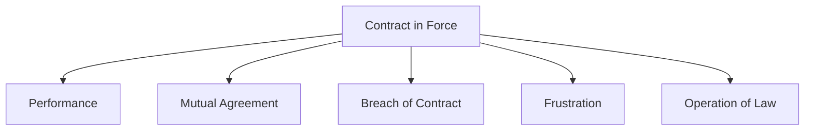

## 14.3 The Termination or Discharge of a Contract

Ending a contract might sound like a big, messy ordeal, but in many cases, it’s actually quite straightforward. That said, you do want to keep an eye out for the various ways a contract can come to a natural (or sometimes unexpected) conclusion. Whether you’re dealing with a loan agreement, an investment contract, an insurance policy, or even a contract for home renovations, it’s super-important to know how the termination process works. After all, contract disputes can be time-consuming and expensive — not to mention emotionally draining.

In Canada’s financial planning environment, advisors and clients often work together on a wide range of agreements. Understanding how they can end helps you avoid potential legal headaches, or at least prepare for them. Have you ever had a friend who had a service contract end prematurely because someone breached an important term? That confusion and stress could have been minimized if they had known, well in advance, the different ways a contract can conclude.

Below is an in-depth discussion to help you get fully up to speed. If you’re like me, you probably want both the “theory” and the “practical aspect” covered. Let’s walk through performance, mutual agreement, breach, frustration (or impossibility), and operation of law, then explore the financial planning impacts for each. By the end, you’ll be able to impress your friends (and maybe even your colleagues) with your newfound contract knowledge — or at least save them from tearing their hair out over a complicated contract termination.

---

## The Importance of Understanding Contract Termination

Contracts are cornerstones of virtually every business and personal transaction. Without a solid understanding of how they end, financial planners might overlook crucial factors such as penalty fees, lost opportunities, or unexpected liabilities. One missed detail could result in big, costly mistakes. And in finance — particularly in the context of your clients’ financial well-being — every risk counts.

In this section, we’ll break down each method of contract termination. We’ll also discuss how it all fits into the broader context of business law (see also 14.1 and 14.2) and the overall financial planning landscape in Canada. Buckle up, let’s start exploring.

---

## Common Ways to Terminate a Contract

### Performance

Perhaps the simplest and most common way to end a contract is through performance: both parties just do exactly what they promised. A nice, clean conclusion, right? Think of a client who signs a loan agreement, makes all scheduled payments on time, and then pays off the entire balance. Once that final payment is processed, everyone’s good — the contract is discharged, and nobody owes anything more (besides the usual courtesies of a departing relationship).

That said, partial performance doesn’t always cut it. The contract usually dictates whether “substantial performance” is acceptable — or whether it has to be perfect. If the contract gets super specific, you want to make sure your client (or you, if you’re a party to the contract) has met all requirements.

From a financial planning perspective, performance is your best-case scenario. Clients who systematically meet their contractual obligations maintain solid credit scores and business reputations. There’s less chance of upset or lawsuits.

### Mutual Agreement (Rescission)

Sometimes, people change their minds or circumstances change around them. If both parties agree to walk away from their obligations, the contract can be rescinded. Rescission effectively says, “Okay, let’s pretend this never happened; we each go back to where we stood before we signed.”

Imagine a scenario: A client hires a business consultant to develop a strategic plan. Halfway through, the client’s market disappears — maybe a new competitor or unforeseen regulation changes everything. Neither the consultant nor your client sees much point in continuing. So, they sign a mutual rescission agreement to end the contract. Done deal! However, the devil is in the details: who covers costs so far? Are there partial payments due? Is there a penalty? Those questions need clarity in the rescission agreement.

For financial advisors, mutual rescission might mean tidying up the leftover financial jumps — balancing out partial fees, handling refunds, or even dealing with advanced payments that must be returned. The key here is ensuring the terms of the mutual agreement are crystal clear to avoid any lingering confusion.

### Breach of Contract

A breach occurs when one party fails to fulfill their obligations, big or small. Let’s say your friend hired a contractor to build a brand-new deck, but the contractor disappears after laying only half the foundation. That’s a breach of contract. The homeowner client might be left with a half-built deck and a big headache. In many cases, the non-breaching party can either terminate the contract or pursue some kind of remedy (damages, specific performance, or rescission).

For financial planners, contract breaches can have unfortunate ripple effects. A breach might mean a product is never delivered, money is lost, or a crucial revenue stream disappears. If clients rely on performance of that contract for their income or business operations, a breach could be devastating. Remedies fall into three broad categories:

• Damages: Monetary compensation for losses.  
• Specific Performance: A court order forcing the breaching party to do what they promised (useful for unique goods or property).  
• Rescission: A cancellation that returns the parties to pre-contract positions (this sometimes overlaps with “mutual agreement,” though in a breach scenario it’s often less friendly).

For instance, if you advise a client who invests in a small start-up that never delivers a promised product, your role may involve helping them navigate the legal steps for claiming damages or guiding them in drafting documents that protect them from similar issues in the future. Always encourage clients to consult legal professionals if the breach has potentially significant ramifications.

### Frustration or Impossibility

Frustration occurs when unexpected events, beyond the control of the parties, make the contract absolutely impossible to perform. This is sometimes viewed as the “get-out-of-jail-free” card for parties who find themselves facing uncontrollable external forces. A classic example is a natural disaster that destroys the subject matter of the contract.

Let’s say a financial planner engaged an event management company to host a large retirement seminar. Suddenly, a government lockdown halts all in-person events for the foreseeable future. If no workable alternative is possible (like a virtual event), the contract could be considered frustrated — the situation fundamentally changed so drastically that the event can’t go on. The parties could be discharged from their duties.

For financial advisors (and their clients), frustration can be a big relief in such extreme scenarios but it’s also tricky. Sometimes, one party might argue frustration, while the other disputes whether it was truly impossible to pivot. For instance, if a webinar or an online meeting was an option, the event management company might say the contract was not frustrated because a digital replacement was feasible. Either way, frustration is a legal concept intended for extreme cases, so it’s not as common as performance or mutual agreement.

### Operation of Law

A contract can also be terminated when dictated by the law, such as new legislation making the subject matter illegal. Bankruptcy can also terminate or alter contractual obligations. If a party declares bankruptcy, some contracts may be automatically ended or altered under the Bankruptcy and Insolvency Act (Canada).

We can also see this in the insurance context. If a participant in a policy incorrectly discloses critical information, and the policy is deemed void by law, the insurer may not have to fulfill its contractual obligations. Operation of law can sometimes come out of nowhere, so it’s wise for financial advisors to encourage their clients to stay informed about relevant changing laws or potential legal statuses like insolvency.

---

## A Quick Visual Overview

To illustrate the different ways a contract can end, let’s use a Mermaid diagram summarizing the main routes:

Above, you see that a contract can branch into any of these “end” states. Each path has different legal and financial consequences, so it’s important to determine (a) which path is relevant and (b) the associated ramifications.

---

## Financial Planner’s Perspective: Potential Impacts

When contracts end, it might bring fees, lost revenue, or other repercussions affecting a client’s financial health or business. Here are a few key points to keep in mind:

• Legal Costs: If the contract ends badly (like in a breach), the parties might spend thousands of dollars (or even tens of thousands) in legal fees. Encourage clients to hold an emergency fund if the contract in question is substantial.  
• Damages or Penalties: A contract might specify that a breaching party has to pay certain damages, or an early termination penalty. This can quickly drain someone’s financial resources.  
• Renegotiation Opportunities: Sometimes it’s not so black and white. If a breach or frustration is looming, the parties could renegotiate better-suited contract terms. Advisors can help clients see that a reworked arrangement might be more beneficial than simply walking away.  
• Reputation Risks: If a client repeatedly walks away from deals or breaches contracts, it can hurt their standing in the market, possibly leading to credit difficulties or social proof issues.  
• Future Risk Management: Clients experiencing a painful contract termination might become more risk-averse. Encourage them to thoroughly draft future agreements, use disclaimers, or get legal sign-offs to reduce the chance of disputes.

---

## Case Studies and Real-World Scenarios

1. Performance in Action  
   Picture a mortgage contract: a client obtains a mortgage to buy their dream home and consistently makes monthly payments for 25 years. Once the final payment is made, the contract is discharged by performance. The bank’s security interest is removed, and our client can now enjoy a home that’s fully owned with no further obligations. This is the perfect example of a smooth, expected conclusion.

2. Rescission by Mutual Consent  
   A small business hires a marketing agency to adapt its brand. Halfway through, the business decides to merge with another company that has its own brand guidelines. The parties agree to mutually rescind the contract. The marketing agency is partially paid for the work completed; the business recovers any unused deposit. Both walk away – hopefully with no ill will.

3. Breach and its Aftermath  
   A client invests in a software project that promises a new trading platform. The development team never delivers, but they’ve already spent the investment funds. The investor sues for breach of contract. The court awards damages to the investor, but it’s uncertain if the development team can pay. This underscores the importance of due diligence and clear contract terms when investing in new ventures.

4. Frustration of Purpose  
   A wedding venue contract is canceled when a natural disaster renders the venue unusable for an extended period. The couple can’t hold their ceremony or reception, leaving the contract effectively frustrated. Both sides walk away without performing or compensating the other because the contract’s fundamental purpose no longer exists.

5. Operation of Law  
   A lender becomes bankrupt. Depending on the circumstances, the debtor’s obligations might be reassigned or discharged. This underscores the complexities that can arise when parties to a contract face insolvency.

---

## Key Glossary Terms

• Performance: The act of fulfilling all contractual obligations exactly as stated.  
• Rescission: A mutual decision to cancel the contract and restore the parties to pre-contract positions.  
• Breach of Contract: Failure to fulfill obligations.  
• Frustration: Circumstances making performance impossible (or fundamentally different from what was agreed), thereby releasing parties from the contract.  
• Operation of Law: A legal event (bankruptcy, changes in legislation, etc.) that alters or terminates a contract.  
• Damages: Monetary compensation for losses or harm because of a breach.  
• Specific Performance: A court order forcing a party to fulfill its contractual duties rather than simply paying damages.  

---

## Common Pitfalls and Best Practices

Even if we know the various ways a contract can end, it’s easy to run into pitfalls. Below are a few to watch out for:

• Vague Clauses: A contract might not clearly define each party’s obligations. Without precise wording, it’s hard to prove a breach or to claim frustration.  
• Missing Termination Clauses: Some contracts don’t outline how to terminate or what notice period is required. Clarifying these provisions is critical to a smooth exit.  
• Timing Mistakes: Failing to act promptly when a breach occurs can cause you to “affirm” the contract, essentially waiving your right to terminate later.  
• Emotional Attachments: Clients may hold onto a poorly performing contract for sentimental reasons, hoping it will “all work out.” Rationally discussing options and consequences is crucial to good financial planning.  
• Lack of Professional Advice: Clients sometimes skip legal or financial advice to save costs. This often backfires if disputes lead to lengthy — and expensive — court battles or arbitrations.

Best practices:  
1. Encourage thorough **due diligence** before signing.  
2. Include a **clear termination clause** (notice requirements, buy-out possibilities, etc.).  
3. Use **written amendments** if circumstances change.  
4. Keep **timely records**. If you suspect a breach, record it right away.  
5. Seek qualified advice, especially for high-stakes contracts.

---

## Canadian Regulations and Resources

Canada’s legal framework for contract termination is governed by both federal and provincial legislation. Although the provinces handle the bulk of contract law, certain contracts or industries (like banking and insurance) may have federal regulations. For instance:

• **CIRO (Canadian Investment Regulatory Organization)**: As of 2023, CIRO replaced the former IIROC and MFDA organizations, overseeing investment dealers and mutual fund dealers. The organization’s resources (https://www.ciro.ca) can offer guidance on typical client agreements in the financial space, as well as dispute resolution processes.  
• **CIPF (Canadian Investor Protection Fund)**: Now the sole investor protection fund in Canada, CIPF steps in if a member firm becomes insolvent. This might indirectly affect contractual obligations between clients and investment dealers.  
• **Canada Business Network**: (https://www.canada.ca/en/services/business.html) — For general guidance on managing contractual disputes and legal compliance.  
• **CanLII (Canadian Legal Information Institute)**: (https://www.canlii.org/) — If you need to browse actual legal cases for deeper insight into how Canadian courts handle breaches, frustration, or rescission.  

---

## Additional Readings and Courses

• “Canadian Contract Law” by Angela Swan & Jakub Adamski: A comprehensive look at the foundations of contract law in Canada.  
• “Advanced Contract Law in Canada”: Offered by various local law societies’ continuing education platforms, this course is perfect for professionals wanting a deeper dive into specific situations.  

---

## Practical Example: A Smoother Exit Strategy

Imagine your client, Sarah, is a budding entrepreneur who entered a partnership arrangement to develop a niche financial planning software. Mid-development, the lead developer says they need to double the original budget to handle new compliance requirements. Sarah decides that this is way beyond her comfort zone. If they continue, the cost might sink the project. She suggests a mutual rescission, offering to cover all software completed so far in exchange for the developer releasing all creative rights. After some discussion, they finalize a rescission agreement.

Sarah avoids a bigger financial hit, the developer’s work so far is compensated, and both walk away respecting each other’s time. By planning this “exit strategy” in advance, the contract included a clause that specifically permitted termination with a lump-sum compensation for partial work. From a financial planning standpoint, Sarah’s business wasn’t dragged into legal battles or forced to pay for a product she couldn’t afford.

This scenario shows how contract termination doesn’t have to be acrimonious. When done carefully — and with a well-drafted contract — it can be a smooth pivot to new opportunities.

---

## Conclusion

So, you know, contract termination might appear ominous on the surface, but when we break it down, it’s all about clarity, preparedness, and good communication. Performance and mutual agreement are usually the “friendly” pathways, while breach triggers more legal complexities. Frustration and operation of law are, in essence, legal out-clauses, but they’re quite specific, usually reserved for more extreme changes in circumstances or bankruptcy.

For financial planners in Canada, it’s crucial to be aware of the potential costs and benefits of each type of contract termination. Don’t just focus on the “signing” part — also think about how the contract could end and what those outcomes might mean for your clients’ finances. After all, contracts can shape huge swaths of your clients’ personal and professional lives.

And if you’re confused, worried, or unsure, definitely encourage your clients to seek legal counsel. A well-planned exit or well-managed dispute can save everyone a whole bunch of money and sleepless nights.

Remember, a contract exit doesn’t have to be a fiasco. With some upfront awareness, strong drafting, and timely advice, you can approach the end of a contract the same way you approached the start — with confidence.  

---

## Test Your Knowledge: The Termination or Discharge of a Contract



### Which of the following is the most common way to end a contract?

- [ ] Breach of contract
- [ ] Frustration
- [ ] Operation of law
- [x] Performance

> **Explanation:** Most contracts end when both parties perform their obligations exactly as stated.

### When parties decide they no longer want to be bound by a contract and agree to walk away, it’s called:

- [x] Rescission
- [ ] Specific performance
- [ ] Tortious interference
- [ ] Liquidation

> **Explanation:** Rescission involves both parties mutually consenting to return to their pre-contract state.

### In a breach of contract scenario, which of the following remedies might a non-breaching party seek?

- [x] Damages
- [x] Specific performance
- [ ] Automatic renewal of the contract
- [ ] Mandatory arbitration only

> **Explanation:** Damages and specific performance are common remedies for breach. Automatic renewal or forced arbitration are not typical breach remedies (though arbitration could be an option if the contract mandates it).

### Which term refers to a situation where unforeseen events make performance impossible, leading to the contract’s discharge?

- [ ] Breach of contract
- [x] Frustration
- [ ] Rescission
- [ ] Liquidation

> **Explanation:** Frustration involves events beyond either party’s control that fundamentally change or make performance impossible.

### Which of the following best illustrates termination by operation of law?

- [x] A borrower filing for bankruptcy
- [ ] The original contract containing no end date
- [x] Legislation making the contract illegal
- [ ] A client refusing to accept performance

> **Explanation:** Bankruptcy or newly enacted laws can result in a contract’s termination by operation of law.

### Which is NOT a potential impact of contract termination in a financial context?

- [ ] Legal costs
- [ ] Damages or penalties
- [ ] Reputation risks
- [x] Guaranteed profit

> **Explanation:** Contract termination rarely guarantees profit; it often involves costs or risks.

### A client has a building contract canceled due to a natural disaster that destroys the site. This is an example of:

- [x] Frustration
- [ ] Breach of contract
- [x] Impossibility
- [ ] Moral hazard

> **Explanation:** The contract is discharged because an event beyond anyone’s control (natural disaster) made performance impossible.

### What is the best step for financial advisors when a client is facing a likely breach of contract?

- [x] Record details and encourage prompt legal consultation
- [ ] Avoid discussing it until the contract ends
- [ ] Tell the client to ignore it
- [ ] Advise the client to accept any settlement offer immediately

> **Explanation:** Documenting events and seeking professional legal advice help protect the client’s interests.

### Which of the following resources can assist you in finding Canadian case law on contract breaches?

- [x] CanLII
- [ ] CIPF
- [ ] Canada Business Network only
- [ ] A personal blog unrelated to law

> **Explanation:** CanLII (Canadian Legal Information Institute) is a large database for Canadian case law.

### True or False: Rescission and mutual consent to end a contract solely applies in situations where one party is at fault.

- [ ] True
- [x] False

> **Explanation:** Rescission is typically a mutual arrangement where neither party needs to be at fault; they simply agree to end the contract.


