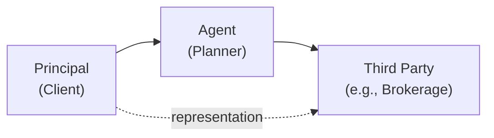
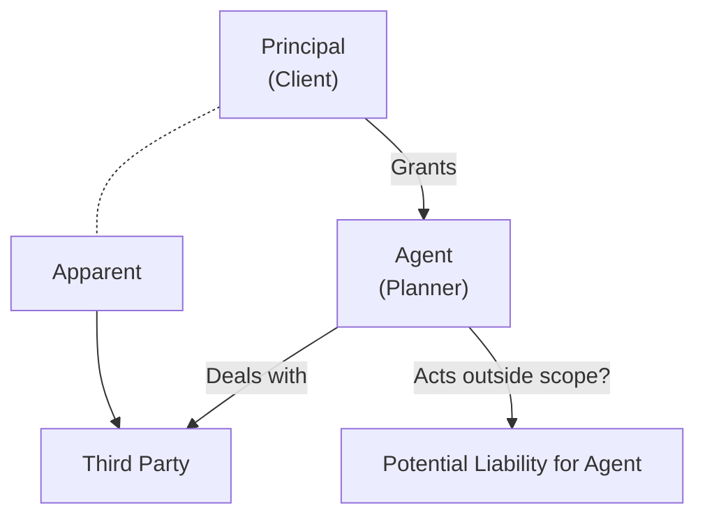

## 14.4 Agency Relationships

So, have you ever thought about how, exactly, a financial planner ends up representing their client in all those investment or insurance transactions? I mean, it’s not like we all walk around with an official name tag that says “I’m an Agent!” But in business law, that’s precisely what's happening: the planner (as an agent) acts on behalf of the client (the principal), ideally helping the client move toward their financial goals. And, wow, does it come with a lot of responsibilities—especially in the Canadian context, with regulators like CIRO looking over everything. That’s where the concept of “Agency Relationships” really takes center stage.

This section explores how agency relationships are formed, the duties owed by agents to their principals, the scope of authority (actual and apparent), plus the liabilities that can arise when someone goes out of bounds. We’ll also tie things back to specific financial planning contexts: like applying for insurance on behalf of a client or purchasing securities under a discretionary mandate. I’ll share a personal anecdote or two about times I got that authority piece slightly tangled (um, I promise it all worked out in the end!), and hopefully, you’ll see just how crucial it is to understand these concepts in your day-to-day practice.

I. Let’s jump right in by talking about the creation of an agency relationship.

---

### Creation of Agency

An agency relationship, at its core, is formed whenever a principal authorizes an agent to act on their behalf. Typically, the principal is the client, and the agent is the financial planner or advisor. But there are a few ways this can happen:

1. **By Express Agreement**  
   A straightforward contract (written or oral) in which the principal appoints the agent. In financial planning, that could be a formal engagement letter stating, for example, “You are authorized to manage my RRSP by investing in mutual funds within these parameters.” This arrangement should detail the scope of authority, duties, compensation (if applicable), and so forth. A clear written agreement helps avoid confusion—trust me, it prevents so many headaches down the line.

2. **By Implication**  
   Sometimes, the words or actions of the principal can implicitly create an agency relationship. For instance, if a client repeatedly tells others that their financial planner manages all their accounts and the planner routinely transacts on those accounts with the client’s knowledge, a court might find an implied agency if a dispute arises about whether the planner had authority. It’s less formal but can still carry legal weight. If it looks like an agency, quacks like an agency, it probably is an agency.

3. **By Necessity**  
   This one’s a bit rarer—especially in finance—but it crops up in emergency situations. Suppose a client is temporarily incapacitated (e.g., abroad and unreachable) and a pressing issue in their portfolio demands immediate attention to avoid heavy losses. If no explicit instructions were provided, a financial planner might act of necessity to protect the client’s interests. However, always exercise caution in such scenarios because stepping outside a client’s mandate can be risky—especially if the client later claims you overstepped your bounds.

---

### Fiduciary Duties

Now, let’s talk about the big one: fiduciary duties. The notion that an agent owes the principal a bundle of obligations—loyalty, care, and full disclosure. It’s not just a nice idea; it’s a legally binding standard that ensures you, as an agent, always put your client’s interests first.

In Canada, many financial planners are either regulated directly or indirectly—under guidelines from CIRO (the Canadian Investment Regulatory Organization) or by the Canadian Securities Administrators (CSA). And they’re actually pretty strict about ensuring you uphold fiduciary duties. Let’s break this down:

- **Duty of Loyalty**: You can’t favor your own interests (or a third party’s, like a commission-paying fund sponsor) over your client’s. If there’s a conflict of interest—like a referral fee arrangement—full disclosure is essential. 
- **Duty of Care**: You must act with the competence and diligence of a prudent professional. This means staying current on new investment products and best practices, as well as understanding your client’s unique situation. 
- **Duty of Disclosure**: You have to keep your client informed of everything important that affects their financial decisions. If you stand to get a higher commission for placing them in a particular annuity, they deserve to know.

A personal story: early in my career, I had a client who wanted to invest in a fairly exotic financial product. I quickly realized that the product was paying me a generous commission. I was excited—who wouldn’t be? But then I paused and asked myself: is this product really in the client’s best interest? After digging deeper, I discovered it was riskier than the client could stomach. That forced me to address the conflict and recommend a more stable alternative. Those fiduciary duties can sometimes feel like they’re “cramping your style,” but they are crucial for building trust and, frankly, staying out of trouble.

---

### Authority of the Agent

So, how far can an agent go in acting on a client’s behalf? Well, that depends. We generally distinguish between two major types of authority:

1. **Actual Authority**  
   - **Express**: Explicitly granted in the contract. If your engagement letter says, “You can buy or sell mutual funds for me, up to $50,000,” that’s your express authority.  
   - **Implied**: All the tasks necessary and logical to carry out the express authority. For example, if the agreement allows you to manage the client’s stock portfolio, it’s implied you can also handle administrative tasks associated with those transactions, like signing routine forms on the client’s behalf.

2. **Apparent Authority**  
   This is when third parties (like a mutual fund company or an insurance provider) reasonably assume the agent has authority based on the principal’s conduct. For instance, if a client regularly tells their contact at a brokerage firm that “My planner handles everything—just do whatever they say,” the firm may rely on that statement. If the agent acts within that appearance of authority, the principal might be bound by those actions—even if the agent actually had no formal permission. 

Here’s a simple Mermaid diagram to illustrate how authority typically flows from principal to agent, and how third parties see that authority:

In this diagram, the dotted line from the principal to the third party represents the principal’s representations or conduct, which can create apparent authority. The third party is thus convinced that the agent is authorized to do certain things. 

---

### Liability in Agency

Knowing what’s at stake might make you swallow hard. If a principal gives a planner the authority to do something and the planner acts within that scope, the principal is typically bound by those acts. But what if the planner steps outside their allowed scope?

- **Principal’s Liability**  
  The principal usually bears responsibility for the agent’s actions taken within actual or apparent authority. So, if all signs point to the planner being authorized to purchase shares in a certain company, the client (principal) is on the hook for that transaction—even if they later decide it wasn’t such a great buy.

- **Agent’s Liability**  
  However, if the agent acts without authority, or disregards limitations set in the agreement, or breaches a fiduciary duty, the agent may be personally liable for any resulting damages. In other words, you can’t just say “hey, I was trying to help!” if your help was outside the boundaries of your authority or your legal obligations.

Case in point: Imagine a financial planner invests in high-volatility options on a client’s account, ignoring the explicit instruction that the portfolio should remain conservative. If huge losses occur, the finders of fact (e.g., the courts, an arbitrator, or a regulatory body under CIRO) might decide the planner is personally liable for the losses. Yikes. That’s why strict adherence to the client’s risk profile and instructions is non-negotiable.

---

### Application to Financial Planners

Now, let’s bring this home to the day-to-day realities of a financial planner in Canada:

• **Compliance with CIRO**:  
  As of June 1, 2023, the Investment Industry Regulatory Organization of Canada (IIROC) and the Mutual Fund Dealers Association of Canada (MFDA) both merged into the Canadian Investment Regulatory Organization (CIRO). CIRO is your go-to body if you’re regulated as an investment dealer or a mutual fund dealer rep. This new entity has guidelines on how you must handle agency duties and responsibilities—like having a well-documented Know Your Client (KYC) process, properly disclosing conflicts, and ensuring all trading authority is documented in client agreements.

• **Maintaining Transparency**:  
  One best practice is to confirm in writing the scope of your authority. Are you a “discretionary portfolio manager”? Or are all trades subject to client approval, except in emergencies? This clarity fosters trust and wards off allegations that you somehow overstepped your mandate. Also, remember to be super transparent about fees, commissions, referral arrangements, or any potential or perceived conflict of interest.

• **Observing Fiduciary Duties**:  
  You’ve heard it a million times, but it bears repeating: Put the client’s interest first. This intangible principle is at the heart of an agency relationship. And it’s not just for compliance’s sake—long-term trust is the bedrock of a successful, fulfilling planning practice.

---

### Best Practices and Potential Pitfalls

- **Document Everything**:  
  If it’s not documented, it may as well have never happened. Keep records of phone calls, instructions, emails, and meeting minutes. This not only protects you but also shows you’re serious about your professional duty of care.
  
- **Limitations on Authority**:  
  Make sure your client understands they must specifically grant you permission for certain actions. For instance, margin trading is drastically different from short selling or investing in derivatives. If it’s not explicitly permitted or implied, don’t do it—or at least not without further discussion.

- **Regular Check-ins**:  
  Even if a client has given you broad discretion, keep them in the loop. This fosters trust, heads off misunderstandings, and ensures that changing risk tolerances or life events are incorporated into the plan.

- **Stay Updated**:  
  Don’t let your knowledge stagnate. If a new type of product or service hits the market, learn about it. This ensures you can advise your client effectively and remain well within your duty of care.

- **Beware the Conflict of Interest**:  
  If you stand to gain financially from a recommendation, be transparent. Offer comparable solutions, disclose all fees, and let the client make an informed choice. If it feels awkward, that might be a sign you need to reevaluate the recommendation.

- **Watch Out for Unauthorized Practice**:  
  In some provinces or under certain circumstances, you may need specific licenses or accreditations to provide certain financial services. Acting outside your professional scope—like giving legal advice without being a lawyer—can lead to serious trouble, both from your professional regulator and the bar association.

---

### Diagram: Actual vs. Apparent Authority

Here’s another Mermaid diagram that shows the difference between Actual and Apparent Authority and where liability typically lands:

- The solid arrow from Principal to Agent indicates the granting of Actual Authority.  
- The dotted line from Principal to Third Party shows that the Principal, by their conduct or statements, might create Apparent Authority, even if not explicitly intended.  
- If the Agent acts outside that scope, they risk personal liability.

---

### Glossary

- **Agency**: The legal relationship in which one party (agent) is authorized to act for another (principal).
- **Principal**: The person or entity granting authority, often the client.
- **Agent**: The party acting on behalf of the principal, here the financial planner.
- **Fiduciary Duty**: An obligation to act primarily for the benefit of the principal, involving loyalty, care, and full disclosure.
- **Actual Authority**: Authority that’s either explicitly stated or reasonably implied in the engagement.
- **Apparent Authority**: Authority a third party believes exists because of the principal’s statements or actions—whether or not it actually does.
- **Breach of Fiduciary Duty**: Failing to act in the principal’s best interests, potentially leading to liability.

---

### Practical Examples and Case Studies

• **Case Study 1: Mutual Fund Switch**  
  A financial planner has an express agreement allowing them to switch mutual funds in a client’s RRSPs as long as the risk profile remains moderate. The planner sees an opportunity in a more aggressive fund. They buy it without consulting the client. If it’s within the moderate classification, they might be acting within actual authority. If it’s outside, they risk liability for an unauthorized buy.

• **Case Study 2: Insurance Application**  
  A client is traveling and unreachable. A big policy renewal date arrives. The planner acts of necessity to renew the coverage to prevent a lapse. If the client’s instructions were previously given in an email to “always ensure coverage is continuous,” this implied authority might save the day. But if the client had said, “Don’t ever renew without my explicit OK,” then the planner could face liability for stepping over the line.

• **Case Study 3: Apparent Authority Nightmare**  
  The principal once told a life insurance agent, “Feel free to sign anything you need for me.” They parted ways. The new agent had no idea about that statement, but the old agent tries to sign the principal up for a new policy with a new insurer. The insurer relies on the old statements and issues coverage. Because of the principal’s prior representation, the principal might be bound—though they could later have a messy legal fight establishing that old agent’s authority had ended.

---

### References and Further Exploration

- **CIRO** – Guidelines on agency duties and responsibilities in financial planning and advisory roles:  
  [https://www.ciro.ca](https://www.ciro.ca)

- **Canadian Securities Administrators (CSA)** – Additional regulatory context for advisory relationships:  
  [https://www.securities-administrators.ca](https://www.securities-administrators.ca)

- **Bank of Canada** – Information on financial markets and relevant frameworks that may affect agents acting in treasury or related transactions:  
  [https://www.bankofcanada.ca](https://www.bankofcanada.ca)

- **Suggested Reading**: “Agency, Partnerships, and the LLC in a Nutshell” by J. Dennis Hynes and Mark J. Loewenstein (While U.S.-focused, many concepts analogously apply in Canada.)

- **Online Course**: “Fiduciary Responsibility in Financial Services” on various professional development platforms.

These materials provide a deeper dive if you want to geek out (like I did in my early days) on the finer points of agency creation and liability. Some are more general business law resources, but they have chapters on fiduciary notions that mirror Canadian practice.

---

### Key Takeaways

• Agency relationships spring into existence when one person authorizes another to act on their behalf, whether explicitly or implicitly.  
• Financial planners typically operate under an express or implied agency agreement to buy or sell investments, purchase insurance policies, or otherwise manage assets for clients.  
• As an agent, you owe your client a duty of loyalty, care, and full disclosure (fiduciary duties). Violating them can have serious legal and professional consequences.  
• The scope of your authority (actual or apparent) shapes what you can do. If you exceed that scope, you may incur personal liability.  
• In Canada, the newly formed CIRO plays an important role in overseeing how financial advisors handle their agency role. Maintaining compliance with these regulations is a vital part of professional practice.  
• Clear documentation, transparent communication, and consistent observance of fiduciary obligations help you avoid most pitfalls. Trust (and verifying it!) is everything in these relationships.

Anyway, that’s the big picture of agency relationships in business law as it ties to financial planners in Canada. Yep, it’s a lot, but it’s definitely worth mastering—newsflash: your entire business model as a planner depends on it. And once you treat these principles as second nature, you’ll find that your relationships with clients become stronger and more secure in the face of everyday surprises.

--------------------------------------------------------------------------------

## Test Your Knowledge: Agency Relationships in Financial Planning



### 1. Which of the following best describes an “agency relationship”?

- [x] The principal (client) authorizes the agent (planner) to act on their behalf.  
- [ ] The agent (planner) authorizes the principal (client) to sign legal documents.  
- [ ] Two parties share authority in a joint venture.  
- [ ] The principal invests funds in the agent’s account.  

> **Explanation:** An agency relationship is created when a principal (client) grants authority to an agent (planner) to act on their behalf.

### 2. Which one of the following is NOT a way that agency can be created under Canadian law?

- [ ] By express agreement.  
- [ ] By implication.  
- [ ] By necessity.  
- [x] By forced assumption.  

> **Explanation:** Agency can be created through express agreement, implication, or necessity. "Forced assumption" is not a recognized method.

### 3. In an agency relationship, which duty is encompassed by “fiduciary obligations”?

- [x] Loyalty, care, and disclosure to the principal.  
- [ ] Commingle personal funds with the principal’s assets.  
- [ ] Always claim the highest commissions possible.  
- [ ] Act solely in the agent’s interest.  

> **Explanation:** Fiduciary obligations require the agent to place the principal’s (client’s) interests first, act with competence, and make full disclosure of pertinent information.

### 4. If a planner invests in a high-risk security contrary to the client’s agreed-upon conservative profile, which best describes the potential outcome?

- [x] The planner may be personally liable for any resulting losses.  
- [ ] The planner is automatically protected by professional indemnity insurance.  
- [ ] The client bears full responsibility for the purchase.  
- [ ] No liability arises if the agent believed it was a good investment.  

> **Explanation:** Acting outside scope or in violation of a fiduciary duty exposes the planner to personal liability.

### 5. Which term describes a situation when a third party believes an agent has authority based on the principal’s representation, even if that authority was never explicitly granted?

- [x] Apparent authority  
- [ ] Express authority  
- [x] Apparent authority  
- [ ] Inherent authority  

> **Explanation:** Apparent authority (sometimes called “ostensible authority”) arises when a principal’s words or conduct give a reasonable impression that the agent is authorized to act.

### 6. Which statement about CIRO is correct, given the recent regulatory changes?

- [x] CIRO oversees both investment dealers and mutual fund dealers in Canada.  
- [ ] IIROC and MFDA remain separate entities.  
- [ ] CIRO is responsible only for derivatives markets.  
- [ ] CIRO does not require agents to adhere to fiduciary duties.  

> **Explanation:** Effective June 1, 2023, IIROC and MFDA amalgamated into CIRO, which regulates investment dealers, mutual fund dealers, and market integrity in Canada.

### 7. Which of the following is an example of implied authority?

- [x] A planner performing administrative tasks necessary to implement a purchase authorized in the agreement.  
- [ ] A client telling the planner, “Don’t act unless I sign an approval form.”  
- [x] A planner performing administrative tasks necessary to implement a purchase authorized in the agreement.  
- [ ] A third party reading a letter from the principal that is not addressed to the planner.  

> **Explanation:** Implied authority includes the tasks and responsibilities necessary to carry out an expressly authorized action.

### 8. An agent who wishes to avoid potential conflicts of interest in an agency arrangement should:

- [x] Disclose all fees or referral arrangements to the principal.  
- [ ] Keep fee arrangements confidential to avoid client confusion.  
- [ ] Only accept commissions, not fees.  
- [ ] Avoid recording telephone conversations with the client.  

> **Explanation:** A key part of the duty of loyalty and disclosure is revealing any arrangements in which the agent might personally benefit.

### 9. A personal anecdote: A planner gets a strong commission for recommending a specific fund, but upon closer inspection, finds it unsuitable for the client’s risk profile. The best course of action is to:

- [x] Disclose the potential conflict and recommend a more suitable alternative.  
- [ ] Select the fund anyway for the higher commission.  
- [ ] Transfer the client to another advisor.  
- [ ] Make the client sign a waiver, ignoring their risk tolerance.  

> **Explanation:** Fiduciary duty dictates you act in the client’s best interest and disclose conflicts. Recommending a more suitable product maintains that duty.

### 10. In an agency relationship, the principal is generally held liable for:

- [x] Acts the agent performs within their actual or apparent authority.  
- [ ] All criminal acts committed by the agent.  
- [ ] Only unauthorized acts the agent performs.  
- [ ] No acts performed by the agent.  

> **Explanation:** A principal is bound by the agent’s actions when performed within the scope of actual or apparent authority.


