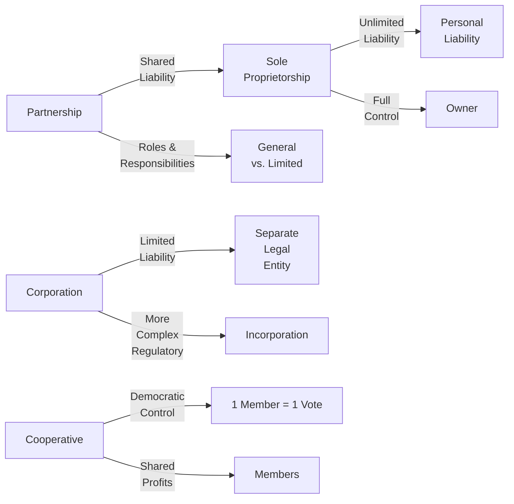

## 15.1 Forms of Business Entities

So let's talk about business structures. When I first got interested in small businesses, I honestly had no idea that something as simple as “the legal form” of a business could make or break someone’s long-term success. It wasn’t until a friend of mine started his own little ice cream shop—just him and his scrumptious recipes—that I learned the difference between a sole proprietorship and a corporation the hard way. Long story short: he ran into some liability issues, and because he hadn’t set things up properly, it got more complicated and nerve-racking than it probably should have been.

In this section, we’re going to help you avoid that. We will explore the main legal structures available to small businesses in Canada: the sole proprietorship, the partnership (both general and limited), the corporation, and the cooperative. You’ll see that each type has its own perks and drawbacks, from tax advantages to personal liability concerns. Let’s break everything down so that the next time your friend (or you!) wants to open a café or an e-commerce venture, you’ll know exactly how to protect your interests—and your wallet.

Before diving deeper, do keep in mind that this is an educational overview. It’s always a good idea to seek professional legal and tax advice specific to your situation when choosing a business structure.

### Understanding the Big Four

Below is a quick visual overview of how these different forms of business entities relate to liability, control, and the nature of the relationships involved:

This chart is just a bird’s-eye view. Let’s jump into the details.

---

## Sole Proprietorship

A sole proprietorship is the simplest way to start a business in Canada. Basically, it means there’s a single owner who calls all the shots—and, well, shoulders all the risks.

• Total Control: As the sole owner, you’re “the boss.” You decide what products or services to offer, how to price them, who to hire (if you hire anyone at all), and how to run day-to-day operations.  
• Simple Tax Filing: The profits from your business are taxed as personal income. This makes the tax process a bit more straightforward because you’ll just report your business’ net income on your personal tax return (T1 in Canada).  
• Low Start-up Costs: You don’t need to file incorporation documents, and you don’t need complex legal structures. You do, however, need to register your business name with your provincial or territorial government if you’re operating under a name other than your own.  
• Unlimited Personal Liability: Here’s the kicker. If your business gets into trouble and you can’t pay back debts, your personal assets (like your car, bank account, or even your home) could be at risk. That story about my friend who ran the ice cream shop? He ended up personally liable for a lease dispute—a stress nightmare no one wants.

#### Best Practices for Sole Proprietorships
• Keep Good Records: Even though it’s relatively simple, you need separate records for your personal and business finances. Track your business expenses carefully, so you know what’s deductible.  
• Consider Insurance: General liability insurance can help protect you if a customer sues you.  
• Plan for Growth: As your business expands, you might need more capital or new partners. Prepare to transition to a partnership or corporation if you outgrow a one-person shop.

#### Common Pitfalls
• Undervaluing Your Time: You do everything yourself, and that can lead to burnout.  
• Overlooking Risk Management: Sometimes, a small oversight can lead to big liabilities.  
• Lack of Succession Planning: If you’re incapacitated or decide to retire suddenly, the business can effectively dissolve unless you’ve laid out a plan.

---

## Partnership

A partnership is two or more individuals, or even other legal entities, carrying on business together with a view to profit. It can be an awesome way to share the risks, responsibilities, and joys of running a business—but you’ll want a formal agreement in place to avoid “he-said-she-said” scenarios.

### General Partnership
• Shared Profits and Liabilities: In a general partnership, everyone is on the hook for all the debts of the partnership—joint and several liability. That means if one partner racks up a huge debt and the business can’t pay, creditors might come after you personally as well.  
• Collaborative Decision-Making: This structure excels when each partner brings different skills or resources to the table—like a coder pairing up with a marketing guru.  
• Taxed Individually: Partnerships don’t pay income taxes directly; instead, each partner reports their share of the partnership’s income (or losses) on their personal tax return.

### Limited Partnership
Sometimes, you want “silent” or “investor” partners who aren’t actively running the show but still invest capital. Enter the limited partnership.

• Roles: At least one general partner who manages the business and has unlimited liability, plus one or more limited partners who have liability capped at their investment.  
• Limited Liability: The big benefit is that limited partners only lose what they’ve put into the business, so their personal assets are generally protected.  
• Registration Requirements: Limited partnerships usually must be registered with the provincial or territorial authority. Generally, the relevant legislation outlines how to form and maintain them.

#### Partnership Agreements
In either a general or limited partnership, it’s crucial to have a legally binding partnership agreement. This document clarifies:
• How profits and losses are distributed.  
• Decision-making processes and voting rights.  
• What happens if a partner wants to leave or if a dispute arises.  
• How the partnership can be dissolved or sold.

The biggest pitfall? Not having one. Trust me, if any challenge pops up—like somebody wanting to cash out or disagreements about strategic direction—an informal handshake deal can quickly turn sour, leaving folks resentful (and possibly in court).

---

## Corporation

The corporation is like the well-dressed formal-wear of the business world: polished, recognized, and separate from its owners. In law, the corporation is treated as its own “person.” This can be a great advantage if you want protection of your personal assets.

• Limited Liability: Generally, shareholders are not personally liable for the corporation’s debts or lawsuits, aside from the value of their shares.  
• Separate Legal Entity: The corporation can own property, enter contracts, sue, and be sued in its own name.  
• Tax Benefits: If qualified, a Canadian-controlled private corporation (CCPC) may take advantage of the small business deduction, reducing its corporate income tax on active business income (up to a threshold). This can be a significant advantage.  
• Complexity: Incorporation involves filing articles of incorporation federally (under the Canada Business Corporations Act, or CBCA) or within a specific province. You’ll also have annual reporting obligations, potential corporate transparency requirements, and corporate record-keeping obligations (such as the corporate minute book).  
• Costs: More expensive to set up and maintain than a sole proprietorship or partnership. Expect to pay legal fees, accounting fees, and registration fees on an ongoing basis.

#### When to Incorporate
• Risk Minimization: If you’re in an industry that could attract major lawsuits or high debt loads, limited liability might be a lifesaver.  
• Raising Capital: Corporations can issue shares or secure financing more easily than a sole proprietorship or partnership. Investors generally prefer corporations because they can buy an equity stake.  
• Tax Planning: The ability to split income (i.e., pay dividends to family members who are shareholders), plus other strategies, might save on taxes. But these strategies can be complex—always coordinate with your accountant or tax advisor.

#### Common Challenges
• Administrative Overhead: You’ll need to file annual returns, maintain corporate records, and sometimes hold director/shareholder meetings.  
• Potential Double Taxation: Profits are taxed at the corporate level, and dividends distributed to shareholders are taxed again on personal tax returns—although in Canada, there’s a dividend tax credit that mitigates this somewhat.  
• Director Liability: In certain circumstances, directors can be personally liable (e.g., unpaid wages, source deductions like CPP/QPP, and GST/HST). So be aware of your responsibilities if you sit on the board.

---

## Cooperative

A cooperative (or “co-op”) is a business you might hear about in contexts like agricultural producers, community grocery stores, or credit unions. They’re owned and democratically controlled by their members, with the principle of “one member, one vote.”

• Member Ownership: The folks who use the co-op’s services or buy its products typically own it, so it’s designed for mutual benefit instead of maximizing profits for external shareholders.  
• Democratic Decision-Making: Every member has an equal say, regardless of how much capital they’ve contributed.  
• Profit Distribution: If the co-op makes a surplus (i.e., “profit”), it’s distributed among members or re-invested for their benefit.  
• Regulatory Environment: Co-ops are governed by either federal or provincial cooperative legislation, which can impose unique rules (like requirements for boards of directors, capital structure, and membership provisions).  
• Best for Like-Minded Groups: Co-ops excel when multiple individuals want to collaborate, share resources, or leverage economies of scale while maintaining democratic control.

#### Advantages
• Strong Community Orientation: They promote inclusivity, economic participation, and community goals.  
• Limited Liability (Generally): Most cooperative incorporation statutes limit members’ liabilities.  
• Highly Collaborative: Great for groups that want to share ownership, decision-making, and profits equally.

#### Disadvantages
• Slower Decision-Making: Balancing the diverse views of members can be time-consuming and lengthy.  
• Potential Conflict: When many people have a say, disagreements can escalate if not well-managed.  
• Legislative Complexity: Federal or provincial co-op regulations can be intricate and can require specialized legal knowledge.

---

## Key Factors to Consider

Now that we’ve walked through each business form, how do you figure out which one is right for you or your client? Let’s outline the main considerations:

• Liability Protection: If you’re worried about being personally on the hook for business debts, skip the sole proprietorship or general partnership—seriously.  
• Tax Implications: Want access to small business deductions? A Canadian-controlled private corporation (CCPC) could help. But remember that personal taxes and corporate taxes differ significantly.  
• Administrative Complexity: Corporations and co-ops demand more in terms of registration, reporting, and record-keeping. Partnerships and sole proprietorships are simpler.  
• Ownership and Control: If you prefer calling all the shots, a sole proprietorship might work. If you’re all about democratic values and broad participation, maybe a co-op is your jam.  
• Succession Plan: Corporations can carry on after an owner passes away; sole proprietorships, not so much. Partnerships can continue under certain conditions, but it depends on the agreement.  
• Nature and Scale of Business: Small local artists might be comfortable with a partnership or sole proprietorship, while a high-growth startup with investor funding is more likely to incorporate.

---

## Personal Anecdote: The Tech Startup Turned Family Corporation

Let me share another quick story. I once knew a group of three college friends—two coders and one marketing savant—who built a small software app. They started as a partnership because it was quick, cheap, and easy. But as soon as they saw traction—angel investors, potentially some serious money on the table—they realized a partnership wouldn’t cut it. The investors wanted equity and the protections of a corporate structure. They ended up incorporating, which let them issue shares and welcome the new investors on board. Yes, it involved more paperwork, but it opened up all sorts of new possibilities. The moral of the story? The right structure can evolve as your business grows.

---

## Best Practices and Potential Pitfalls

### Best Practices
• Consult Professionals: An accountant, lawyer, or financial advisor can help tailor the choice of business structure to your specific needs.  
• Keep Solid Records: Whichever structure you choose, maintain clear financial records and separate personal and business bank accounts.  
• Review Periodically: Businesses evolve. Review your structure every few years to see if it still makes sense.  
• Insurance is Your Friend: Liability insurance, property insurance, cyber insurance—whatever is relevant to your line of business can be a lifesaver.

### Potential Pitfalls
• Overlooking Regulatory Requirements: Failing to register a partnership or missing annual filings for a corporation can result in penalties or dissolution.  
• Complacency in Documentation: A handshake deal might be fine if all is going well, but if something goes wrong, you’ll regret not having everything in writing.  
• Not Having a Transition Plan: People move, retire, or lose interest. Partnerships dissolve. Corporations might merge or get sold. Make sure you plan for the “what-ifs.”

---

## Regulatory Context in Canada

Choosing a business structure in Canada often involves dealing with federal, provincial, or territorial legislation, plus it’s important to keep an eye on the broader regulatory environment—especially if your business deals with financial products or invests capital in markets.

• Federal Incorporation: If you go the corporation route, consider federal incorporation under the [Canada Business Corporations Act (CBCA)](https://laws-lois.justice.gc.ca/eng/acts/c-44/). You’ll get the flexibility of operating nationally, though you might still need extra provincial registrations depending on where you do business.  
• Provincial Incorporation: Each province has its own legislation; for example, Ontario’s Business Corporations Act or British Columbia’s Business Corporations Act. Check the relevant rules if you only foresee operating within a single province.  
• CIRO (Canadian Investment Regulatory Organization): If your small business grows into offering investment products or dealer services (an unusual scenario but possible), you’ll have to comply with CIRO regulations. CIRO is Canada’s new (launched in 2023) self-regulatory organization overseeing investment dealers and mutual fund dealers.  
• CRA (Canada Revenue Agency) Guidelines: For tax guidance, you can check out the CRA’s [“Business and Professional Income Guide”](https://www.canada.ca/en/revenue-agency/services/forms-publications/publications/t4002.html). It’s quite comprehensive and user-friendly—well, as user-friendly as tax documentation can be.  
• Provincial Regulation for Cooperatives: If you’re forming a co-op, ensure you follow federal or provincial cooperative legislation, which often requires specific formation documents, membership provisions, and governance frameworks.

---

## Practical Financial Examples

1. Sole Proprietorship Tax Example:  
   Imagine you’re a freelance graphic designer who made CAD 60,000 in net profit last year. As a sole proprietor, you’d simply include that as part of your personal income on your tax return. No separate corporate tax. But you also can’t pay yourself a “salary,” so taxes might be higher if you’re in a higher personal tax bracket.

2. Partnership Profit-Sharing:  
   You and a friend run a small consulting biz as a partnership. If your net profit is CAD 120,000 for the year and your partnership agreement states you split profits 50-50, each of you would claim CAD 60,000 on your personal tax returns. But remember, each partner can be 100% liable for the partnership’s total debts if something goes wrong.

3. Corporation Salary vs. Dividends:  
   You form a corporation for your growing e-commerce brand. The corporation earns CAD 200,000 in profit. You decide to pay yourself a salary of CAD 60,000 to reduce corporate income. Then the corporation pays corporate tax on the remaining profit. You could also pay yourself or other shareholders dividends, which could have potential tax advantages (like the dividend tax credit) but also might create complexities with personal tax rates.

4. Cooperative Surplus Distribution:  
   A small group of organic farmers form a cooperative to jointly market their produce. After costs, they turn a surplus of CAD 30,000 at year-end. The co-op might distribute some of that surplus back to members based on how much produce each farmer contributed, and then reinvest the rest into equipment or marketing for the co-op’s benefit.

---

## Additional Resources and References

• Government of Canada – [“Incorporating Your Business”](https://www.canada.ca/en/services/business/start/register-with-gov.html)  
• [Canada Business Corporations Act (CBCA)](https://laws-lois.justice.gc.ca/eng/acts/c-44/)  
• [Canadian Investment Regulatory Organization (CIRO)](https://www.ciro.ca/)  
• Canada Revenue Agency (CRA) – [“Business and Professional Income Guide”](https://www.canada.ca/en/revenue-agency/services/forms-publications/publications/t4002.html)  
• Book: “Business Structures and Governance in Canada” by Christopher C. Nicholls  
• Online Course: “Introduction to Canadian Business Law” (Coursera)  

Regardless of which form you choose, always keep in mind your long-term goals and potential liability. Life happens. People bring legal actions, economies fluctuate, and you want to be sure your personal nest egg stays secure if the business hits a rough patch. A solid business structure puts your plan on a firm foundation.

Remember—there’s no one-size-fits-all. Each structure can be brilliant given the right conditions. Think about your own sense of risk, the scale of your operation, and where you see yourself in five or ten years. If you’re not entirely sure, consult qualified professionals. After all, the best planning is done when you actually plan before trouble looms on the horizon.

Wishing you the best of success—and a drama-free journey—in setting up (or revising) your business structure!

---

## Test Your Knowledge: Canadian Business Structures and Planning



### Which of the following is NOT a feature of a sole proprietorship in Canada?

- [ ] Simple tax filing
- [x] Limited liability protection
- [ ] Low start-up costs
- [ ] Direct personal control by the owner

> **Explanation:** Sole proprietorships offer unlimited liability to the owner, meaning that personal assets can be used to satisfy business debts. They do not offer any form of limited liability protection.

### In a general partnership:

- [x] Each partner can be held liable for all partnership debts.
- [ ] Limited partners are responsible only for their investments.
- [ ] Only one partner has unlimited liability.
- [ ] Partners pay corporate income tax on profits.

> **Explanation:** In a general partnership, all partners share unlimited liability for debts. There is no concept of limited partnership status unless it's established under a limited partnership structure.

### A limited partnership:

- [x] Must have at least one general partner with unlimited liability.
- [ ] Shields all partners from personal liability.
- [x] Includes limited partners who typically invest capital but do not handle management.
- [ ] Does not require any formal registration.

> **Explanation:** A limited partnership must have at least one general partner who is fully liable. The limited partners provide capital and enjoy liability limited to their investments, but they generally do not participate in management.

### Which of the following is a key advantage of incorporating a business in Canada?

- [ ] Exemption from paying any taxes
- [x] Limited liability for shareholders
- [ ] No ongoing regulatory requirements
- [ ] Guaranteed government grants

> **Explanation:** Corporations offer limited liability to shareholders, meaning personal assets are usually protected from business debts or lawsuits. However, it does not exempt the corporation from paying taxes, and corporations do have ongoing regulatory obligations.

### Which statement about cooperatives in Canada is correct?

- [ ] Members do not share in profits.
- [x] Each member typically has one vote regardless of investment size.
- [x] They are often formed around common goals or economic interests.
- [ ] Cooperatives are prohibited from making a profit.

> **Explanation:** Cooperatives are democratically owned and controlled, with each member having one vote irrespective of how much they invested. They can make a surplus and distribute it to members or reinvest it for their benefit.

### Which business structure typically has the simplest tax filing requirements?

- [x] Sole proprietorship
- [ ] Corporation
- [ ] Cooperative
- [ ] Limited partnership

> **Explanation:** In a sole proprietorship, all business income and expenses are reported directly on the owner’s personal income tax return, making it generally the simplest in terms of tax filing.

### Which entity is considered a separate legal person under Canadian law?

- [ ] Sole proprietorship
- [x] Corporation
- [x] Cooperative (if formally incorporated)
- [ ] General partnership

> **Explanation:** Corporations and properly organized cooperatives are recognized as separate legal entities in Canada. Sole proprietorships and general partnerships are not.

### If two partners in a general partnership disagree on how to split profits, what document is most crucial to refer to?

- [ ] Shareholder agreement
- [ ] BIA certificate
- [x] Partnership agreement
- [ ] Strategy white paper

> **Explanation:** A partnership agreement establishes how profits and losses are distributed among partners, reducing risks of disagreement.

### When might someone transition from a sole proprietorship to a corporation?

- [x] They want to protect personal assets from business liabilities.
- [ ] They plan to shrink or close the business soon.
- [ ] They prefer paying personal income tax on all business revenue.
- [ ] They no longer want to comply with any government regulations.

> **Explanation:** Incorporating can limit personal liability, allow for more sophisticated funding options, and create a more formal business structure if growth or risk levels increase.

### True or False: Directors of a corporation sometimes can be held personally liable for certain debts, such as unpaid wages or source deductions.

- [x] True
- [ ] False

> **Explanation:** Directors in Canadian corporations can be personally liable for unpaid wages, unremitted GST/HST, source deductions like CPP/QPP, and other specific statutory liabilities.


