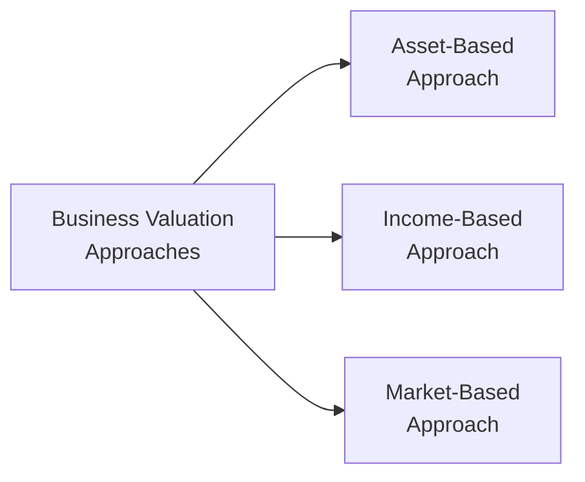

## 15.2 Business Valuations

Business valuation, at its core, is all about answering one simple question: “How much is this company truly worth?” But, as many of you might already suspect, the process of determining that single number can get a little complicated. Maybe you’ve tried selling an old car and realized that you and the buyers never seem to agree on a fair price. Well, think of business valuation in a slightly more professional (and yes, more formal) context. You’re not just looking at year, make, and model; you’re also considering intangible factors like brand reputation and potential future growth. In this section, we’ll break down what goes into business valuation, highlight the key methods, and examine how these valuations inform financial planning for small businesses here in Canada (and even around the world).

Just so you know, I remember once chatting with an entrepreneur who was convinced his small tech startup was worth millions based on intangible “buzz” alone—no assets, no real revenue, just an idea. In our conversation, one thing became super clear: you need more than just hype to pin down a real price tag. That’s where formalized valuation techniques come in.

Below, we’ll discuss why business valuations matter, examine three major valuation approaches (asset-based, income-based, and market-based), and highlight important considerations specific to the Canadian regulatory environment. We’ll even throw in a bit of math (don’t worry, nothing too scary) to show how something like a Discounted Cash Flow (DCF) can be calculated. Lastly, we’ll provide references to resources like the Canadian Institute of Chartered Business Valuators (CICBV), relevant Government of Canada sites, and official accounting frameworks like IFRS. Let’s get started.

---

### Why Do Business Valuations Matter?
Business valuations serve a variety of pivotal roles in the life of a company. Some key scenarios include:

• Selling or transferring ownership: If you’re looking to sell your business, you need a clear and credible starting point for negotiations.  
• Mergers and acquisitions: In M&A transactions, valuations guide offer prices and outline how synergy might impact the combined entity’s future.  
• Succession planning or estate planning: Transferring shares between generations or partners often demands an accurate valuation for tax, probate, or funding reasons.  
• Financing and investment: Lenders and investors will almost always want to see a rigorous valuation to gauge risk and potential returns.  
• Legal obligations: Certain situations—like shareholder disputes or divorces—may require a valuation as part of legal proceedings.  

Given these scenarios, it’s easy to see how a weak valuation could lead to misguided business decisions or even legal trouble. And from my personal experience, bank managers and potential investors typically won’t even entertain a funding request without some evidence that you’ve done your valuation homework.

---

### Overarching Factors to Consider
Before we jump into methods, here are four overarching factors that influence a business valuation:

• Purpose of the valuation: Are you using it for resale, estate freeze, or securing financing from a bank? Each purpose might shift how you approach the math.  
• Data accuracy: The reliability of your financial statements, tax returns, and market research is crucial. Garbage in, garbage out.  
• Industry-specific metrics: Healthcare practices, tech startups, and manufacturing firms each have different business models, so make sure you’re comparing apples to apples.  
• Economic conditions: The broader market environment heavily influences risk premiums, discount rates, and investor sentiment.  

In Canada, you also need to be mindful of our regulatory environment, which is governed by the Canadian Investment Regulatory Organization (CIRO) for investment-related concerns. While CIRO doesn’t necessarily govern small private business valuations directly, the overall financial climate and best practices in reporting can indirectly affect valuations. For official updates on regulatory frameworks, you can consult https://www.ciro.ca.

---

### Common Valuation Approaches
Let’s explore the three main approaches: asset-based, income-based, and market-based. Think of them as different lenses you can use to snap a picture of a company’s worth. Sometimes, you’ll use more than one approach to triangulate a final estimate—especially if the business has multiple unique aspects (e.g., a strong product pipeline plus valuable real estate holdings).  

Above is a simple diagram illustrating how these three methods fan out from the big concept of “Business Valuation Approaches.” Let’s tackle each in turn.

---

#### Asset-Based Approach
The asset-based approach essentially looks at what the business owns (assets) and subtracts what it owes (liabilities). What’s left is the business’s net worth. This may sound straightforward, but there’s nuance when considering intangible assets like brand identity, customer data, or intellectual property.  

1. **Book Value Method**  
   You sum up the asset values as they appear on the balance sheet (adjusted for depreciation), then subtract liabilities. Often, the final result can diverge from market reality if the balance sheet does not reflect current prices or intangible strengths.

2. **Liquidation Value Method**  
   This means imagining the business is about to sell all its assets for the best possible price in a short time frame. Subtract outstanding debts, and you have the “break-up” or liquidation value. This method often yields a lower value since forced sales rarely command premium pricing.

The asset-based approach is handy for asset-heavy industries such as real estate or certain manufacturing businesses. It’s also used in worst-case scenario planning (liquidation). However, be aware that intangible goodwill—like a brand’s reputation or a proprietary software platform—can be significantly undervalued if they’re not captured on the books.

---

#### Income-Based Approach
The income-based approach hones in on the business’s earning potential. You’re basically saying, “Let’s project this business’s future cash flow or earnings, and discount them back to the present value.” The idea is that a dollar earned in five years is worth less than a dollar in your pocket today.  

##### Discounted Cash Flow (DCF)
A common technique within the income-based approach is the Discounted Cash Flow (DCF). You forecast the free cash flows of the business for a certain period—maybe three to five years—and then calculate a terminal value (the lump-sum worth of all subsequent cash flows after that forecast period). Finally, you discount these amounts back to present-day dollars using a discount rate that reflects the risk of the investment.

Mathematically, a simplified version of DCF looks like this:


  PV = \sum_{t=1}^{n} \frac{CF_t}{(1 + r)^{t}} + \frac{\text{Terminal Value}}{(1 + r)^{n}}


Where:
• \\( CF_t \\) is the expected cash flow in year \\( t \\).  
• \\( r \\) is the discount rate, often estimated as the Weighted Average Cost of Capital (WACC).  
• \\( n \\) is the number of years in your projection.  

In real life, you might see the discount rate broken down as:


  r = R_f + \beta(R_m - R_f) + \cdots


Where \\( R_f \\) is the risk-free rate (like yields on Government of Canada Treasury Bills), \\( R_m \\) is the expected market return, and \\(\beta\\) is a measure of risk relative to the market. Determining \\(\beta\\) for private companies can be tricky since they’re not traded on the stock exchange, so you’d look for proxies or comparable public firms.

**Example**: Let’s pretend you predict your small business will generate $200,000 in free cash flow each year for the next three years, and then you’ll probably sell it. You decide your discount rate is 10%. Roughly, the present value of each year’s $200,000 at 10% would be:

• End of Year 1: \\( \frac{200,000}{1.10} \approx 181,818 \\)  
• End of Year 2: \\( \frac{200,000}{1.10^2} \approx 165,289 \\)  
• End of Year 3: \\( \frac{200,000}{1.10^3} \approx 150,262 \\)  

If you think you can sell the business (terminal value) at $600,000 at the end of Year 3, you also discount that by \\(1.10^3\\):


  TV_{discounted} = \frac{600,000}{1.10^3} \approx 450,787


So, your total present value might be \\(181,818 + 165,289 + 150,262 + 450,787 \approx 948,156\\). In other words, you might say, “Hey, as of today, my business is valued around $948,156, given my assumptions.” Of course, that’s factoring in stable growth and a 10% discount rate. Change either assumption, and your valuation might shift dramatically.

---

#### Market-Based Approach
Finally, there’s the market-based approach, which looks at how similar businesses—sometimes called “comps”—are valued. If you’ve ever sold or bought real estate, it’s like checking the price of similar houses in the neighborhood.  

1. **Guideline Public Company Method**  
   You identify a set of publicly traded companies in the same industry with similar risk profiles. You look at valuation multiples, such as the price-to-earnings (P/E) ratio or the price-to-sales (P/S) ratio, and then apply those multiples to the private company’s financial metrics.  

2. **Transaction Method**  
   You gather data on recent M&A deals involving comparable private companies. For instance, if a competitor was sold at a 5x EBITDA multiple (Earnings Before Interest, Taxes, Depreciation, and Amortization), you might apply that multiple to your own business.  

**Caution**: The challenge is finding truly comparable companies. Even subtle differences—like a stronger management team or different brand equity—can skew the multiples. Plus, M&A deals often include synergy considerations or unique financing structures that inflate or deflate the reported valuation.

---

### Bringing It All Together
So, how do you decide which method to use? In many real-life scenarios, valuators use several of the above approaches, weighting them based on how well they reflect the particular business in question. For a capital-intensive manufacturing firm with lots of equipment, you might highlight the asset-based approach. For a tech startup banking on future revenue growth, you’ll probably lean heavily on an income-based DCF. And if there’s a robust market of similar deals or publicly traded peers, the market-based approach can give you an excellent sanity check.

---

### Intangible Assets and Goodwill
One aspect that trips people up all the time is intangible assets. You might have a lot of intangible value locked up in a brand or a proprietary algorithm. The difficulty is measuring something that doesn’t show up on your physical balance sheet. In these cases, specialized valuations—often performed by accredited individuals such as Chartered Business Valuators (CBVs)—are crucial to capturing the worth of those intangible assets.  

If your business thrives on brand loyalty, you can’t just ignore that factor. Both the income-based and market-based approaches can help capture intangible value, provided your projections (or comparables) reflect the strength of your intangible assets.

---

### Valuation for Estate Freezes
If you’re planning an estate freeze—where you, as a business owner, freeze the value of your shares and pass future growth on to your children or other family members—it’s essential to have a credible valuation. Canadian tax authorities (under the Canada Revenue Agency, or CRA) will examine these transactions closely. You don’t want to be caught undervaluing or overvaluing shares. Proper valuations ensure you minimize tax liabilities while complying with regulations.

---

### Impact of Succession Planning
If you’re grooming your niece or nephew to take over the family business, the valuation discussion becomes more personal and future-focused. You might adopt a lower discount rate if you believe your successor can unlock new markets, or maybe apply a smaller market multiple if you know the industry is in decline. Either way, having a robust valuation helps set realistic expectations for the next generation.

---

### Practical Examples with Real-World Scenarios
1. **Dental Practice**  
   Let’s say you’re valuing a small dental practice with a loyal client base, specialized equipment (like x-ray machines), and intangible assets like goodwill and client relationships. An asset-based approach may drastically undervalue the practice if it only counts furniture, fixtures, and equipment. You’d likely lean toward the income approach, using a discounted cash flow that projects patient billings. Market comps might be used if there are comparable dental practices in the area recently sold.

2. **Manufacturing Plant**  
   When you’re dealing with a heavy-machinery manufacturing plant—where large physical assets dominate the balance sheet—an asset-based approach might weigh more heavily. That said, an income-based approach could also reveal the profitability of their unique production processes. You might combine the two to provide a well-rounded perspective.

3. **Tech Startup**  
   For a tech startup with minimal current revenues but massive projected growth, an income-based approach leaning on a multi-stage DCF is often the go-to. The startup might have intangible assets such as intellectual property, brand recognition, or network effects from a large user base. A market-based approach might also be relevant if venture capital or angel investors have financed comparable startups at specific valuation multiples.

---

### Common Pitfalls
• **Overoptimism**: Overstated growth projections or ignoring possible downturns can lead to inflated valuations.  
• **Ignoring Market Conditions**: A slump in the broader economy or a seismic shift in industry technology can easily make your historical comparables outdated.  
• **Poor Data Quality**: If your financial records are a mess, your valuation will be a guess at best.  
• **Misjudging Intangibles**: Ignoring intangible assets (or overemphasizing them without proof) can lead to distorted valuations.  

---

### Best Practices for a Sound Valuation
• **Maintain Accurate Books**: Audited financial statements, clear balance sheets, and up-to-date records build trust.  
• **Document Your Assumptions**: Whether you’re using a 10% discount rate or a 25% projected growth rate, be clear about why.  
• **Use Multiple Methods**: Cross-verify your DCF results with a market-based approach or asset-based approximations to see if your numbers align.  
• **Seek Professional Guidance**: For complex valuations, consult a Chartered Business Valuator (CBV) or other accredited professional.  
• **Stay Current on Regulations**: Keep an eye on the CRA’s stance on estate freezes and relevant IFRS updates if your reporting is governed by IFRS.  

---

### Tools, Frameworks, and Additional Resources
• **Canadian Institute of Chartered Business Valuators (CICBV)** – https://cicbv.ca/  
  This is Canada’s leading organization for accredited business valuators. Their site has practice standards, case studies, and guidance on specialized valuations.  
• **International Financial Reporting Standards (IFRS)** – https://www.ifrs.org/  
  Many Canadian businesses adopt IFRS in their reporting. IFRS has specific rules on how to treat intangible assets, goodwill, and impairments.  
• **Government of Canada – “Business Valuation Resources”** – https://www.canada.ca/en.html  
  Official resources and guidelines for small businesses looking for valuations, financing, and partnership.  
• **Book Recommendation: “Canadian Business Valuation: Procedures and Principles”** by the CICBV  
  A thorough exploration of valuation techniques, with real Canadian case examples.  
• **Open-Source Business Valuation Calculators**  
  Search for free DCF or market-multiple calculators online, but verify their reliability with recognized standards or a professional.  
• **CIRO** – https://www.ciro.ca  
  For official updates on Canada’s national self-regulatory framework overseeing investment dealers and mutual fund dealers.  

---

### A Personal Note
I remember chewing over a valuation scenario with a family member who was starting a small brewery. It had great local buzz, minimal assets (just a few vats and rented space), but a loyal customer base. After reviewing her “numbers,” we discovered that leaning solely on an asset-based approach would severely undervalue her intangible brand presence. Instead, using a conservative income-based approach with fairly modest discount rates captured the future growth in local sales. We also ran a quick scan of local craft brewery acquisitions, providing a sanity check that the final valuation wasn’t off in left field. She eventually attracted two investors at a fair share price—an outcome that might not have been possible if we’d used the asset-based approach alone.

---

### Conclusion
Business valuations can be as nuanced as the businesses themselves. Knowing the strengths and blind spots of each approach (asset-based, income-based, and market-based) will help you capture an accurate snapshot of your company's value. Equally important is clarifying the purpose of the valuation—whether it’s for a chunk of equity financing, a strategic merger, or a carefully planned estate freeze. Keeping up with valid data, IFRS requirements, CRA regulations, and best practices from organizations like the CICBV will give you a leg up.

And, hey, valuations aren’t just for giant corporations or impending acquisitions. Even small mom-and-pop operations benefit from a well-reasoned valuation when planning retirement or exploring expansion opportunities. So take the time to do it right, and if in doubt, consult a professional so you can avoid pitfalls and keep your financial dreams on track.

---

## Test Your Knowledge: Business Valuation Essentials



### Which of the following best describes the purpose of a business valuation?

- [ ] To compare the business only to publicly traded companies
- [x] To determine the economic value of a company for various events
- [ ] To focus exclusively on tangible assets
- [ ] To avoid reporting to tax authorities

> **Explanation:** A valuation’s main purpose is to determine the economic value of a company; it supports events like sales, mergers, financing, or estate planning.  

### Which approach primarily subtracts liabilities from assets to determine the net value of a business?

- [x] Asset-based approach
- [ ] Income-based approach
- [ ] Market-based approach
- [ ] Growth-based approach

> **Explanation:** The asset-based approach focuses on total assets minus total liabilities to establish a company’s base value.  

### In the Discounted Cash Flow (DCF) method, the discount rate typically reflects:

- [ ] Only the prime rate offered by Canadian banks
- [ ] The business owner’s personal credit score
- [ ] The government’s statutory corporate tax rate
- [x] The time value of money and investment risk

> **Explanation:** The DCF discount rate takes into account both the time value of money and the risk associated with future cash flows, often represented by the WACC or other risk-based metrics.  

### Which method is most appropriate for a tech startup with minimal current revenue but high projected future earnings?

- [ ] A quick asset-based approach
- [x] An income-based approach (DCF)
- [ ] A strict liquidation-based approach
- [ ] A replacement cost approach

> **Explanation:** For a tech startup that expects substantial future growth, an income-based method like DCF is more reflective of its potential.  

### When valuing a small private company, which statement is TRUE regarding the market-based approach?

- [x] It utilizes comparables such as recent sales of similar businesses or industry multiples.
- [ ] It never applies to private companies because no public information is available.
- [ ] It ignores intangible assets entirely.
- [ ] It considers the net assets minus liabilities and intangible assets.

> **Explanation:** The market-based approach relies on comparable transactions or publicly available data from similar companies, which helps approximate a private company’s value.  

### Why might the asset-based approach undervalue certain businesses?

- [ ] Because it automatically doubles the value of intangible assets
- [x] Because it may ignore or underestimate intangible assets and future growth potential
- [ ] Because it doesn’t account for liabilities
- [ ] Because it relies solely on international accounting standards

> **Explanation:** The asset-based approach often struggles to account for intangible value such as brand strength, customer loyalty, or intellectual property.  

### Which factor is critical when selecting a discount rate in a DCF valuation?

- [x] The company’s risk profile and the market’s required rate of return
- [ ] The current prime lending rate plus 2%
- [x] Arbitrary management preference
- [ ] The inventory turnover ratio

> **Explanation:** The discount rate in a DCF valuation is selected based on the company’s risk profile and market expectations (e.g., WACC). Tying it directly to prime rates or inventory turnover alone would be an oversimplification.  

### You’re valuing a family-owned manufacturing business with significant machinery. Which approach might be emphasized?

- [ ] Income-based approach alone
- [x] Asset-based approach, potentially combined with others
- [ ] Market-based approach alone
- [ ] No valuation approach is necessary

> **Explanation:** For a capital-intensive manufacturing operation, the asset-based approach can reveal the significant equipment and physical asset values, often combined with income and market data.  

### Which of the following is a potential pitfall when forecasting cash flows for DCF?

- [ ] Using a discount rate that accounts for risk
- [ ] Including intangible assets in the calculation
- [x] Overly optimistic or inflated future growth projections
- [ ] Relying on audited financial statements

> **Explanation:** Overestimated growth metrics can inflate the final valuation in a DCF and lead to unrealistic valuations.  

### True or False? Merging the results of asset-based, income-based, and market-based approaches can improve the accuracy of a valuation.

- [x] True
- [ ] False

> **Explanation:** Combining different valuation methods often yields a more balanced and realistic valuation, as each approach highlights different aspects of the company’s worth.


