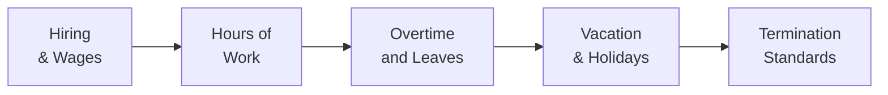
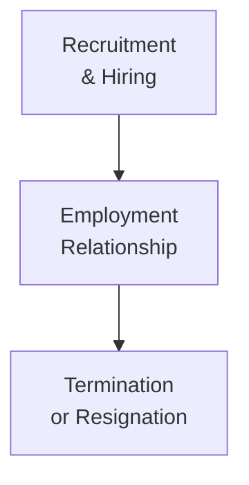

## 15.3 Employment Law

Running your own small business can feel like juggling a dozen balls at once: you’ve got marketing, client relationships, product development, finances—oh, and that small detail of “employing people.” Sometimes the biggest stumbling block for new entrepreneurs is realizing that, yep, even super friendly owners need to follow the rules when hiring and managing employees. In Canada, the rules around employing staff are actually quite well-defined. We’re talking about Employment Standards Legislation, Occupational Health and Safety (OHS), Human Rights laws, not to mention the ins and outs of writing strong contracts and responsibly handling terminations. Let’s walk through these topics step by step, in a hopefully not-too-dry way, so you can keep your business thriving (and your employees happy and protected).

### Why Employment Law Matters for Your Financial Planning

First off, you might be thinking, “Isn’t employment law something for HR folks to worry about?” But here’s the deal: If you’re a small business owner, you are the HR person—at least until your business grows enough to hire additional help. Noncompliance can lead to serious financial fallout, whether in the form of legal penalties, settlement costs, or just the intangible cost of a damaged reputation. So ignoring employment law can be an expensive mistake.

And from a financial planning angle (since this is, after all, a course on financial planning), proper compliance ensures predictable labor costs, reduced legal risk, and a more stable environment to plan for expansions, capital investments, or even your own eventual retirement. So, yeah, it matters.

---

### Employment Standards Legislation

Almost every new entrepreneur has that moment of shock: “Wait, we have federal and provincial rules? And they apply differently depending on my industry or my province?” Exactly. You’ll really want to pay attention to these specifics: in Canada, the core set of employment standards typically covers minimum wage, hours of work, overtime pay, vacation pay, and statutory holiday pay. While some industries are federally regulated (like banking, telecommunications, and interprovincial transportation), most small businesses fall under provincial or territorial legislation.

• Minimum Wage and Working Hours  
You might not be able to call your cousin’s kid at 2:00 a.m. and ask them to come in for a 16-hour shift on a moment’s notice—at least not without running into some compliance issues. Each province or territory sets rules for maximum hours of work before overtime kicks in. They also mandate daily and weekly rest periods.

• Overtime and Vacation Pay  
A small sandwich shop I used to frequent (they had the best turkey club!) closed abruptly because the owner had neglected to pay proper overtime. That quickly led to a labor board complaint by employees. The penalties racked up, plus the negative publicity basically tanked their sales. Because of that fiasco, I realized how critical it is to track hours correctly—especially in smaller operations where recordkeeping is sometimes done on the back of a napkin.

• Leaves and Statutory Holidays  
Another sneaky one: employees have certain entitlements to leaves, such as maternity/parental leave, medical leaves, and even bereavement leaves. In many jurisdictions, employees also earn paid statutory holidays. Overlooking these obligations can blow up your finances if you happen to get a Ministry of Labour inspection or an unhappy employee complaint.

#### Diagram: Basic Employment Standards Flow

Below is a simple visualization showing the major elements of Employment Standards. It’s helpful to see how they interconnect:

Each of these nodes represents a key stage or area of compliance. Overlooking any one of them can result in steep penalties or lawsuits.

#### Cross-Reference with Other Topics
If you’re planning for your small business’s finances (as discussed in other areas of Chapter 15), remember to factor in wages, statutory holiday pay, and potential overtime overhead. That’s part of the broader financial planning puzzle—knowing your labor obligations helps you estimate and control your HR budget accurately.

---

### Occupational Health and Safety (OHS)

Have you ever stepped into a cluttered storeroom, banged your knee on some boxes, and thought, “This seems kind of dangerous; I might break my neck if I’m not careful?” That’s the scenario OHS legislation aims to prevent. Each province or territory enforces laws that require employers to provide a safe working environment. That means:

• Identifying and mitigating workplace hazards (chemical or environmental).  
• Providing necessary safety equipment (like gloves, helmets, or goggles).  
• Offering health and safety training pertinent to your industry.

From a financial standpoint, OHS compliance matters because workplace accidents can lead to serious costs: higher insurance premiums, potential litigation, and worker’s compensation claims. Not to mention the moral duty (and brand damage) if employees get hurt on your watch. Think about it: If someone is injured, your productivity might plummet, morale could nosedive, and you might face regulatory fines. So it’s definitely part of the big financial picture.

---

### Human Rights Legislation

Ah, the broad and sometimes complex area of human rights. In Canada, human rights legislation protects employees from discrimination based on certain protected grounds (such as race, gender, age, religion, disability, and more). Aside from the moral imperative of treating people equitably, the law specifically requires that employers accommodate employees’ needs—up to the point of undue hardship.

• Accommodation in Practice  
Maybe you hire an employee who has a disability requiring a wheelchair. You might need to install a ramp or adjust how the workspace is laid out. Or you might have an employee who practices a religion that requires prayer breaks. You’re generally expected to accommodate these requests so long as it doesn’t cause undue hardship to your operations or finances.

• Undue Hardship Isn’t Just an Excuse  
Undue hardship is a higher legal threshold than many employers assume. Simply stating, “It’s too expensive” isn’t enough. You have to demonstrate that making the accommodation would be a serious strain on the viability of your business. When in doubt, consult a lawyer or local human rights commission guidelines. (Many are posted online, like the Canadian Human Rights Commission at https://www.chrc-ccdp.gc.ca/.)

• Reputation Management = Financial Management  
One of my own “a-ha!” moments about human rights law came when a fellow business owner told me she’d overlooked the need to accommodate an employee’s religious observance. The subsequent formal complaint was widely discussed in the local community. Negative word-of-mouth shot up her costs for hiring new staff—nobody wanted to work for a place known to be discriminatory. Moral of the story: a single oversight can not only land you in legal trouble—but can also seriously impact your workforce, your community image, and your bottom line.

---

### Employment Contracts

If you’ve hung out with friends who run their own small businesses, you might’ve heard them say: “I don’t really bother with official contracts—it’s just an informal arrangement.” And maybe that works out for some, but… it’s super risky. Having a well-drafted written employment contract is often your best line of defense if misunderstandings arise.

• Key Elements of a Good Employment Contract  
  – Job description and duties  
  – Compensation (hourly wage, salary, bonuses, commissions)  
  – Benefits (health, dental, retirement savings programs)  
  – Vacation and other leaves  
  – Termination clause (notice periods, severance)  
  – Confidentiality, non-competition, or non-solicitation clauses (if appropriate)

By outlining these terms, both parties understand what’s expected. You can reduce the risk of “he-said, she-said” scenarios where an employee claims you promised them a certain number of hours, or you claim an employee agreed to do certain tasks. From a financial perspective, clarity in an employment contract can help you budget for labor expenses and avoid abrupt disputes that can become costly lawsuits.

To be even safer, some experts recommend having a lawyer review your contract language. Laws are always evolving, and what worked five years ago might not hold up in court today.

---

### Termination and Severance

Let’s face it: not every employment relationship pans out. Sometimes the role needs to change, or the employee simply isn’t performing. Whatever the reason, an employer is legally obligated to provide either a notice period or severance pay (and sometimes both) if the termination is “without cause.” If you terminate for cause (like serious misconduct), you may not owe severance—but it must be truly serious (the legal bar is usually high).

• Notice and Severance Basics  
In many places, the rule of thumb is “the longer the employee has served, the more notice or severance they must receive.” Common law, statutory minimums, or both can apply. The statutory minimum may be quite low (e.g., one week per year of service, up to some limit), but common law can push that higher.

• Documenting Performance Issues  
It’s often wise to keep a paper trail if you’re anticipating termination for performance reasons. If an employee can show they were fired under suspicious circumstances—like unfair discrimination—they might take legal action.

• Cost Management  
Severance isn’t just about writing a lump-sum check. You might be required to continue benefits for a time, or provide outplacement services. So definitely factor potential termination costs into your financial planning. You might not want a budget that’s so tight you can’t afford an unexpected severance obligation without pushing your business into the red.

---

### Common Pitfalls and Best Practices

Let’s highlight some typical pitfalls that small business owners face:

• Pitfall #1: “We’re too small for these rules to apply.”  
Nope, generally any business with at least one employee is covered by employment legislation. Even family businesses might need to consider at least some aspects of the law.

• Pitfall #2: “We have an oral agreement; handshake deals are fine.”  
Seriously, get a contract. Handshake deals can lead to big misunderstandings and legal headaches later.

• Pitfall #3: “No one has ever complained—so we must be in compliance.”  
It’s possible nobody has complained yet. That doesn’t mean you’re in the clear. Proactive compliance is way cheaper than reactive legal defense.

• Pitfall #4: “We’re not unionized, so labor laws don’t apply.”  
Unionization is a separate topic involving collective bargaining. Employment standards and other legislation apply whether you’re unionized or not (with some different nuances for union shops).

And some best practices:

• Keep thorough records of hours worked, wages paid, and any issues or incidents.  
• Provide ongoing training. Let your employees learn about safety procedures, harassment policies, and relevant workplace standards.  
• Seek professional advice. If you’re unsure about your obligations, consider consulting an employment lawyer or using a reputable HR advisory service.  
• Stay up to date. Laws change, so keep an eye on updates to your local employment standards legislation.  

---

### Real-World Scenarios

Scenario 1: Sara’s Salon  
Sara owns a small hair salon. One day, her top stylist requests modified duties because of a wrist injury. Under OHS and human rights laws, Sara needs to find ways to accommodate that employee. She invests in an ergonomic workstation and ensures more frequent breaks. It’s a cost item, but it’s also part of her legal obligations. Plus, she recognizes that retaining an experienced stylist is better for the salon’s finances in the long run.

Scenario 2: Digital Design Agency  
A digital design start-up tries to push employees to work “all-nighters” regularly without paying overtime. The employees eventually file a complaint with the provincial employment standards board. The fines and back pay claims nearly shut down the business. The founder realized too late that the intangible cost of employee burnout and the tangible cost of noncompliance were both huge threats.

Scenario 3: Family Bakery  
A father-mother-daughter trio run a cozy bakery. They never used contracts because “it’s just family.” But the daughter decided to bring in two new employees, and those hires came with many questions about vacation time, statutory holidays, and hourly wages. With no formal structure, confusion reigned. At the urging of a local small business advisor, they quickly formalized their policies. Now, everything’s in writing, and new staff don’t feel they’re guessing about entitlements anymore.

---

### Visualizing the Employment Relationship Lifecycle

To better understand how everything ties together, here’s a simplified look at the employment journey, from recruitment to termination/resignation:

• Recruitment & Hiring: You must adhere to human rights, ensuring no discriminatory job postings or interviews. Use a written contract to clarify terms.  
• Employment Relationship: Day-to-day compliance with employment standards, OHS, and human rights obligations.  
• Termination or Resignation: Follow proper termination protocols, or accept resignation in a manner consistent with the contract and legislative rules.

---

### Financial Perspectives on Employment Law

Because this section appears within “Financial Planning for Small Business,” it’s worth emphasizing: all these aspects—wages, overtime, severance, accommodations—have direct financial implications. A few finance-relevant angles:

• Budget Forecasting: Factor in wages, benefits, statutory holiday pay, and potential overtime.  
• Contingency Funds: Setting aside a reserve for unexpected severance payouts is prudent.  
• Tax Implications: Some benefits (like extended health plans) might have particular tax treatments for either the employer or employee, depending on your province.  
• Insurance: Workers’ compensation insurance is mandatory in most jurisdictions covering workplace injuries. Premium rates differ by sector and safety track record.

---

### Suggestions for Continued Learning

• Federal Labour Standards: https://www.canada.ca/en/services/jobs/workplace/federallabour-standards.html  
• Provincial and Territorial Employment Standards Information: [Example – Ontario’s Guide to the Employment Standards Act](https://www.ontario.ca/document/your-guide-employment-standards-act-0)  
• Canadian Human Rights Commission: https://www.chrc-ccdp.gc.ca/  
• Book Recommendation: “Employment Law for Business and Human Resources Professionals” by Kathryn J. Filsinger.  
• Consider an online certificate program in “Canadian Employment Law.” Many Canadian universities offer short courses or extended programs.

---

### Final Thoughts

You already juggle inventory, marketing, and finances—why add a labor dispute to your plate? While it can sometimes feel cumbersome to keep up with all these legislative requirements, it’s basically part of running a professional and stable business. And from a financial planner’s perspective, it’s also about risk management and cost predictability.

So, yes, you may experience those stressful moments: late-night reading of provincial labor codes, double-checking you’re paying the right overtime rate, or rethinking your office design to meet safety requirements. But the time you invest in doing right by your employees (and following the law) is time well spent, for your own financial security and for the health of your business.

---

## Test Your Knowledge: Canadian Employment Law Essentials



### Which of the following best describes the primary function of provincial or territorial employment standards legislation?

- [x] It sets minimum requirements like wages, hours, and vacation for most employees in that jurisdiction.
- [ ] It determines the federal pension plan contribution amounts.
- [ ] It manages tax returns for self-employed individuals.
- [ ] It only applies to unionized workplaces.

> **Explanation:** Provincial or territorial employment standards typically cover wage rates, working hours, vacation pay, and related issues for most employees in that region.

### Under human rights legislation in Canada, what concept describes an employer's threshold for meeting an employee’s accommodation request?

- [ ] Reasonable Efforts
- [ ] Flexible Work Arrangements
- [x] Undue Hardship
- [ ] Duty to Maintain

> **Explanation:** Employers have a duty to accommodate employees up to the point of undue hardship, which is the legal threshold for accommodation.

### Which of the following best describes a reason why Occupational Health and Safety (OHS) compliance is critical for small businesses?

- [x] Noncompliance can result in accidents, fines, higher insurance premiums, and legal liability.
- [ ] It reduces the need to pay federal taxes.
- [ ] Only large corporations are subject to OHS rules.
- [ ] It guarantees a government subsidy for workplace improvements.

> **Explanation:** Every employer must comply with OHS regulations to prevent workplace injuries and avoid significant financial and legal consequences.

### What is one recommended best practice in drafting an employment contract?

- [ ] Making it entirely oral to reduce paperwork.
- [x] Stating job duties, compensation, termination clauses, and benefits in writing.
- [ ] Omitting any reference to legal compliance to maintain flexibility.
- [ ] Keeping it very general to avoid limiting the employer's flexibility.

> **Explanation:** Written clarity on job duties, compensation, benefits, and possible termination conditions helps protect both parties and aligns with legal standards.

### True or False: If an employer fires an employee for poor performance without properly documented evidence, the employer might still owe severance or notice under common law.

- [x] True
- [ ] False

> **Explanation:** Even for poor performance, if termination is without solid cause (and documentation), the employer typically owes notice or severance based on statutory and common law principles.

### Which of the following is generally the best initial step before terminating an employee for persistent performance issues?

- [x] Documenting the performance problems and providing warnings or improvement plans.
- [ ] Immediately issuing a severance payout.
- [ ] Firing them on the spot to avoid formalities.
- [ ] Filing a complaint with the local labor board against them.

> **Explanation:** Proper documentation and giving the employee a chance to correct performance are crucial to handle a termination lawfully.

### An employer refusing an employee’s request for religious accommodation must demonstrate which of the following to be justified?

- [x] That the accommodation would result in undue hardship.
- [ ] That the request lacks any merit.
- [ ] That the employer rarely approves accommodations.
- [ ] That the employee signed a non-accommodation clause in the employment contract.

> **Explanation:** Employers must accommodate up to undue hardship. Generic or weak justifications won’t typically suffice.

### Which of the following is a direct financial benefit of having a robust health and safety program?

- [x] Reduced workplace accidents and lower workers’ compensation premiums.
- [ ] Automatic eligibility for a government wage subsidy.
- [ ] Exemption from provincial tax requirements.
- [ ] Guaranteed approval for a business loan.

> **Explanation:** Fewer accidents mean fewer compensation claims, possibly lowering premiums and absenteeism costs.

### True or False: Only employees in federally regulated industries need to worry about Canadian employment standards.

- [ ] True
- [x] False

> **Explanation:** Most employees are covered by provincial or territorial legislation, while federally regulated industries have a separate set of rules. All employees must adhere to the relevant legal framework.

### When it comes to non-written agreements with employees, which of the following is the primary concern?

- [x] Potential for misunderstandings and legal disputes.
- [ ] Decreased flexibility for the employer.
- [ ] Automatic federal tax audits.
- [ ] Non-competition clauses are invalid.

> **Explanation:** Oral agreements are legally risky, as each party may have conflicting recollections of the terms, leading to disputes and potential litigation.


