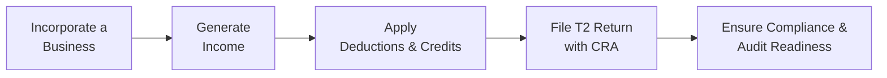

## 15.4 Business Taxation

Have you ever heard someone say, “Oh, I started my own corporation to pay fewer taxes,” and wondered if it’s really that straightforward? It’s true that structuring your business properly can help you manage—and sometimes defer—tax liabilities. But people often don’t realize how layered, and yes, how complicated, business taxation can be in Canada.

In this section, we’ll explore the wide landscape of Canadian business taxation, focusing on four main areas: corporate income tax, GST/HST, payroll taxes, and provincial/territorial taxes. We’ll also walk through the importance of meticulous record keeping and compliance steps to satisfy the Canada Revenue Agency (CRA) and avoid unnecessary penalties.

I had a friend, for instance—we’ll call him Alex—who started a consulting company and decided to incorporate. He was thrilled about the lower small-business tax rate, but he never dreamed about all the deadlines, GST/HST returns, payroll remittances, and hours spent keeping his books in order. The process can be overwhelming, but once you understand the logic behind these different tax obligations, you’re in a much better place to strategically plan your finances, optimize tax benefits, and (perhaps most importantly) stay on the CRA’s good side.

Below, we’ll break down each core aspect of business taxation. We’ll keep it slightly informal, but rest assured the concepts and compliance requirements here are solid and align with the Canadian environment, which, by 2025, is regulated by the Canada Revenue Agency (CRA) for all tax matters and overseen by the Canadian Investment Regulatory Organization (CIRO) for many investment-related compliance activities.

---

## Overview of Key Business Taxes

Before diving in, here’s a quick overview:

• Corporate Tax (T2 filing): Incorporated entities file a T2 return, possibly benefiting from the Small Business Deduction (SBD).  
• GST/HST: Most businesses collect and remit the Goods and Services Tax or Harmonized Sales Tax and get Input Tax Credits (ITCs) for taxes paid on business expenses.  
• Payroll Taxes: Employers must withhold and remit periodic payroll deductions (income tax, CPP, EI).  
• Provincial/Territorial Taxes: Vary widely depending on your province or territory, with unique rates and sometimes special credits.  

---

## Corporate Income Tax in Canada

### Canadian-Controlled Private Corporations (CCPCs) and the T2 Return
Let’s say you’ve decided to incorporate your business. You’ll file a T2 Corporate Tax Return each year. The T2 is how your corporation reports its revenues, expenses, and net taxable income to the Canada Revenue Agency. If your business is a Canadian-Controlled Private Corporation (CCPC), you might qualify for the Small Business Deduction (SBD) on the first $500,000 of active business income (though thresholds can vary depending on your province and how the rules evolve over time).

In plain English, this means you might pay a significantly lower tax rate on that slice of income. That’s why so many small businesses choose to incorporate. They love that concept of “Hey, I’m paying a 12% or 13% or 15% corporate rate, instead of what might be closer to 50% on my personal tax bill if I earned that income personally.” But hold your horses: This is a deferral. When you eventually pay yourself from the corporation—let’s say through dividends—you’ll face personal taxes. The benefit is that you control the timing of when you take that income personally, and possibly how you split it with other family shareholders, within the boundaries of tax law.

### The Small Business Deduction (SBD)
The SBD is the crown jewel for Canadian small businesses. By receiving a lower effective corporate tax rate on a set amount of active business income, you can keep more money inside the corporation for future investment or growth. This can make a huge difference in building up funds for expansion, acquiring capital assets, or even investing surplus funds.

However, a few cautionary notes:
- SBD is available only to CCPCs on income from active business carried on in Canada.  
- Passive income (like interest, dividends from large investments, or rental income not from an active property management business) does not qualify for the same preferential rates.  
- The SBD can be clawed back if your corporation’s passive investment income exceeds certain thresholds.  

### Paying Salary vs. Dividends
Another puzzle piece: do you pay yourself a salary (and thus be subject to payroll taxes) or do you pay out dividends (which do not come with CPP or EI withholding)? Both have tax consequences. Generally, salary is deductible by the corporation, which might reduce its taxable income, but you’ll pay personal taxes on that salary now. Dividends are not deductible by the corporation and are taxed in your hands under the dividend tax credit system, which aims to integrate corporate and personal taxes. The ultimate question? Sometimes it’s about balancing the personal cash flow you need, your personal tax bracket, and your desire to keep corporate earnings in the company.

### Income Splitting
If family members are meaningfully involved in the business or hold certain shares, you might be able to distribute dividends among multiple people to spread out the tax load. The income splitting advantage used to be much more flexible, but current tax legislation uses “Tax on Split Income” (TOSI) rules to curb abuse. Nevertheless, legitimate involvement of family members in the business, especially if they hold shares, can still provide tax-saving opportunities. The key is ensuring their involvement is genuine and that you’re complying with TOSI rules.

---

## GST/HST: Collecting and Remitting

### Registration Basics
If your venture sells goods or services in Canada and your total annual revenue exceeds $30,000 (in a 12-month period), you’re generally required to register for the Goods and Services Tax (GST) or the Harmonized Sales Tax (HST), depending on your province. Let’s say you operate in Ontario, which uses HST. You’ll typically charge 13% to your clients (a combined federal and provincial component) and then remit it to the government. If you live in Alberta, you may be dealing with just GST (5%).

I recall the first time Alex, my friend, had to register for GST. He was a bit shocked at the idea of collecting more from his clients, thinking, “They’re going to get mad!” But guess what—everyone’s used to it. It’s just part of doing business in Canada.

### Input Tax Credits (ITCs)
Because you’re charging GST/HST, the federal government allows you to claim Input Tax Credits (ITCs) on the GST/HST you pay on your own business expenses. Example: You pay $100 plus $5 GST for a subscription to a professional software tool used 100% for your business. You add that $5 to your ITCs, which reduces the total GST/HST you owe when you file your return.

If your annual revenues exceed certain thresholds, you might need to file GST/HST returns quarterly or monthly. If you’re smaller, you can opt to file annually, which simplifies life a bit but can extend the time until you can claim your ITCs. Keep in mind that if you file annually, you may still pay installments throughout the year based on estimated revenues.

### The Quick Method
Smaller service-based businesses with revenues under certain limits can sometimes use the “Quick Method” for calculating GST/HST, simplifying reporting. Instead of meticulously claiming actual ITCs, you charge the regular rate to customers but remit a lower prescribed rate based on your total revenues. It’s a neat approach if your expenses are relatively low and you prefer simpler calculations.

---

## Payroll Taxes

### Employer Responsibilities
Congratulations, you’ve hired an employee—maybe a part-time assistant or a bookkeeper. Along with new help, you also get new duties as a payroll remitter. You must deduct federal and provincial income tax at source, as well as Canada Pension Plan (CPP) contributions and Employment Insurance (EI) premiums. Then you send these amounts, along with your employer portion of CPP and EI, to the Canada Revenue Agency at scheduled intervals.

Now, these remittance schedules must be taken seriously. Late submissions come with interest and penalties that can be downright painful. The CRA’s website (see references below) provides a handy schedule. For example, new employers usually remit monthly. Larger employers might have to remit more frequently.

### T4 Slips and Summaries
At year-end, you’ll issue T4 slips to your employees, summarizing how much they earned and what was deducted and remitted. You’ll also file a T4 Summary with the CRA. If you missed something or messed up, the CRA typically compares your payroll totals with your corporate tax returns, or even your GST/HST returns, so any discrepancies might trigger an audit. That’s why it’s crucial to keep your bookkeeping accurate.

### Common Pitfalls
I’ve seen small business owners try to cut corners by calling employees “contractors.” Maybe that works sometimes, but if the relationship is truly employer-employee by CRA’s definition, that worker is an employee, and you must do payroll withholding. Getting caught misclassifying can result in large retroactive payroll taxes plus penalties and interest.

Another potential pitfall is forgetting about your own payroll if you pay yourself a salary. It can be tempting to just take money out of the business to pay personal bills. But if you track that as salary, you must do the required withholding. If not, maybe you track it as a shareholder draw or a dividend. The point is—be consistent, keep track, and consult a professional for advice.

---

## Provincial and Territorial Taxes

### Corporate Income Tax Rates by Province/Territory
Canadian provinces and territories each have their own corporate tax rates, which stack on top of federal rates. So, if your federal corporate tax rate for small business income is, say, 9% (after applying the SBD), your province might add another 2% to 8%, depending on where you operate. This leads to combined small-business rates that differ significantly across the country.

There can also be other incentives. For instance, some provinces offer tax credits or incentives for research and development, digital media production, film, or other targeted industries. If you’re in manufacturing or technology, you might qualify for partial rebates or credits that reduce your overall tax costs.

### Provincial Sales Tax (PST or QST)
In some provinces (like Ontario and the Atlantic provinces), the provincial sales tax is integrated into the HST. In others, such as British Columbia, Saskatchewan, and Manitoba, businesses charge a separate Provincial Sales Tax (PST). Quebec has the QST, which is similar to GST/HST but administered by Revenu Québec. These sales taxes can complicate life if you do business across multiple provinces, so be sure to keep track of your obligations.

---

## Record Keeping and Compliance

### Why Accurate Records Matter
Record keeping is the unsung hero of tax compliance. It’s not glamorous, but it can save you from serious trouble. The CRA can audit your books at any time to verify income, expenses, payroll deductions, and GST/HST. If your records are a mess—receipts stuffed into a shoebox, no consistent accounting method— you risk losing legitimate deductions or, worse, getting penalized for failing to remit the right amounts.

### How to Stay Organized
1. Use a dedicated business bank account and credit card—so all your transactions flow through one or two accounts.  
2. Keep receipts and invoices in an organized digital or paper system.  
3. For GST/HST tracking, record the tax amount on every purchase you make.  
4. Do monthly or quarterly reconciliations—matching your bank statements to your accounting records—so mistakes don’t accumulate over time.  

### Avoiding Audits (or at Least Surviving Them)
Contrary to popular opinion, you can’t always avoid an audit, because the CRA uses random selection sometimes. That said, good record keeping, consistent reporting, and accurate remittances make audits smoother. If you’re singled out, the auditor typically asks for specific documentation supporting certain tax positions, like large deductions or major transactions. Having your documents ready, labeled, and accessible makes the process far less painful.  

---

## Common Strategies and Pitfalls

### Best Practices
• Separate personal and business accounts.  
• Set aside money each month for taxes (GST/HST, corporate tax installments, payroll remittances) to avoid last-minute cash crunches.  
• Stay up-to-date on tax law changes—especially around small business deduction thresholds, TOSI rules, and provincial tax changes.  
• Consult with a qualified accountant or tax advisor annually (or more frequently if needed).

### Common Pitfalls
• Failing to register for GST/HST when required, or forgetting to remit on time.  
• Misclassifying employees as subcontractors.  
• Missing out on certain tax credits or the small business deduction because of incorrect classification of income.  
• Sloppy record keeping that leads to the denial of legitimate expenses.  
• Overlooking provincial tax credits or local incentives.

---

## Example: Scenario of a Tech Startup

Imagine Sam starts a small tech consulting firm in Ontario:

• First, Sam incorporates “SamTech Inc.” which is a CCPC.  
• Annual active business income is around $300,000. SamTech qualifies for the Small Business Deduction on this income. So the combined federal and provincial rate might be around 12.2% (actual rates may vary). This means Sam is paying about $36,600 in corporate taxes (300K x 12.2%).  
• Sam must register for HST and charge 13% on consulting fees. If Sam has $300,000 in revenue, the total invoice amounts to $339,000 (300K + 39K in HST). Sam then pays the $39K in HST to the government, minus any Input Tax Credits for HST on business expenses.  
• Sam hires two contractors, but after consulting with an accountant, Sam classifies them properly as independent contractors because they truly control their own workflows and supply their own tools. Sam remits no payroll taxes for them. However, Sam does bring on a part-time administrative coordinator. This employee’s payroll must have deductions for CPP, EI, and income tax. Sam sends these deductions to the CRA monthly, along with the employer portion of CPP and EI.  
• Sam keeps excellent records using accounting software. At year-end, Sam’s T2 return is straightforward, and Sam can easily generate T4 and T4 summaries for the employee.  

---

## A Visual Look at the Business Taxation Cycle

Below is a simple flowchart illustrating the path of business taxation for a small corporation:

• Incorporate a Business → The legal structure is set (CCPC).  
• Generate Income → The business operates and earns revenue.  
• Apply Deductions & Credits → Factor in the Small Business Deduction, expenses, other credits (R&D, etc.).  
• File T2 Return with CRA → Complete corporate tax return, pay taxes owing, or request a refund.  
• Ensure Compliance & Audit Readiness → Keep records well-organized for potential CRA audits.

---

## Additional Resources for Canadian Business Taxation

To delve deeper into these topics or find specific forms and deadlines, consult:

• [Canada Revenue Agency (CRA) – Small Businesses and Self-Employed](https://www.canada.ca/en/revenue-agency/services/tax/businesses/small-businesses-self-employed-income.html)  
• [CRA – Business Tax Remittance Schedules](https://www.canada.ca/en/revenue-agency/services/tax/businesses/topics/payroll/payroll-overview.html)  
• [Ontario Ministry of Finance – Business Tax (Example)](https://www.fin.gov.on.ca/en/tax/bct/)  
• “Canadian Income Taxation: Planning and Decision Making” by Buckwold & Kitunen  
• [Taxation in Canada (CPA Canada)](https://www.cpacanada.ca)  

Also, always consider an annual review of your business structure with a tax professional, especially for bigger decisions like paying dividends vs. salary, or optimizing for passive investment income in a CCPC.

---

## Conclusion

That was a whirlwind tour through the world of Canadian business taxation. Yes, it can be complicated, and yes, it definitely feels like “just one more thing” on a small business owner’s ever-growing to-do list. But if you handle it properly—understanding your corporate tax obligations, effectively managing GST/HST, staying on top of payroll requirements, and keeping meticulous records—you might just find that sweet spot where you’re leveraging every available tax advantage and avoiding pitfalls.

And let’s not forget, the system is designed to help small businesses thrive in Canada. With the Small Business Deduction, various provincial incentives, and strategic planning (like deciding on dividends vs. salary), you can keep more of your hard-earned funds in the business or in your pocket—well, eventually.

“Business Taxation” is an ongoing journey. Each year, new federal or provincial budgets can tweak rules and deadlines, so staying informed is important. Continuous learning, perhaps using guides from the CRA or taking specialized courses, is worth the time investment. An accountant or tax advisor can be a big support when you’re short on time or new to the intricacies of T2 returns and payroll tax.  

All set? Next time your friend says they incorporated to “not pay taxes,” you can smile knowingly and say, “Well, there’s a bit more to it than that.”

---

## Test Your Knowledge: Business Taxation Essentials



### Which Canadian tax return do incorporated small businesses typically file annually?

- [ ] T1 personal income tax return
- [ ] T4 summary return
- [x] T2 corporate tax return
- [ ] T5013 partnership return

> **Explanation:** Incorporated companies in Canada use the T2 Corporate Tax Return to report their income, expenses, and any taxes owed.

---

### Which tax benefit allows many Canadian-controlled private corporations (CCPCs) to pay a reduced rate on their first $500,000 of active business income?

- [ ] Capital Cost Allowance
- [x] Small Business Deduction (SBD)
- [ ] Manufacturing and Processing Deduction
- [ ] Labour-Sponsored Funds Tax Credit

> **Explanation:** The Small Business Deduction (SBD) is a key incentive that provides a preferential tax rate for income earned by CCPCs up to a certain limit.

---

### True or False: GST/HST registrants can claim Input Tax Credits (ITCs) on the business-related taxes they spend, reducing the net amount of GST/HST they owe.

- [x] True
- [ ] False

> **Explanation:** Input Tax Credits (ITCs) allow registrants to recover the GST/HST they pay on valid business purchases and expenses.

---

### What is a primary difference between dividends and salary when paying yourself from your corporation?

- [x] Dividends do not require CPP and EI contributions, while salary does.
- [ ] Dividends are 100% tax-free, while salary is taxed at regular rates.
- [ ] Salary is tax-exempt for the corporation, while dividends trigger business tax.
- [ ] Salary does not count as personal income, but dividends do.

> **Explanation:** Dividends typically are not subject to CPP or EI withholding. Salary is considered employment income and requires withholding at source for taxes, CPP, and EI.

---

### Under what circumstances might a small Canadian business be required to register for GST/HST?

- [ ] When they earn any business income at all
- [ ] Only if they have employees
- [ ] Only if they import goods
- [x] If annual taxable revenues exceed $30,000 in any 12-month period

> **Explanation:** The threshold for mandatory registration is $30,000 in worldwide taxable supplies in a 12-month period; once you exceed that, you must generally register and collect GST/HST.

---

### Which of the following is an example of a payroll tax obligation for Canadian businesses?

- [ ] Holding a perfect credit score
- [ ] Making sure employees sign a non-disclosure agreement
- [x] Remitting CPP contributions, EI premiums, and income tax withholdings
- [ ] Publicly listing the company’s shares

> **Explanation:** Employers must deduct and remit to the CRA the Canada Pension Plan (CPP) contributions, Employment Insurance (EI) premiums, and federal/provincial income tax from employee pay.

---

### Which of the following might disqualify a CCPC from accessing the full Small Business Deduction?

- [x] Excessive passive investment income in the corporation
- [ ] The sole shareholder being a Canadian resident
- [ ] Having only part-time employees
- [ ] Selling physical products

> **Explanation:** Recent rules can reduce the Small Business Deduction when a CCPC’s passive investment income exceeds certain thresholds, ultimately limiting the preferred tax rate on active business income.

---

### Recall that some provinces/territories offer specific tax credits or incentives. Which of the following industries is a common target of these credits in some regions?

- [ ] Office cleaning services
- [x] Research and development
- [ ] Landscaping
- [ ] Grocery stores

> **Explanation:** Many provincial tax credits specifically encourage R&D or film/entertainment production, stimulating innovation and job creation.

---

### True or False: One advantage of using the Quick Method for GST/HST is that it can simplify how you calculate net tax owing if you have relatively few input tax credits.

- [x] True
- [ ] False

> **Explanation:** The Quick Method simplifies GST/HST accounting by letting small businesses remit a prescribed rate based on total revenues rather than claim actual ITCs line by line.

---

### Which of the following is the BEST reason for detailed and accurate bookkeeping?

- [ ] It allows you to pay less tax, even on unreported income.
- [ ] You can hide expenses from the CRA more easily.
- [ ] The CRA never audits small businesses.
- [x] It ensures compliance, maximizes legitimate deductions, and eases potential audits.

> **Explanation:** Proper record keeping is essential for accurate tax reporting, maximizing legal deductions, and managing CRA audits effectively.


