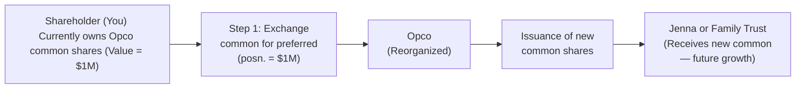

## 15.5 Death of the Business Owner — Estate Freezes

Have you ever wondered if there’s a way to preserve the value of your business while transferring future growth to your kids or other key stakeholders? Enter the estate freeze—a popular tax-planning strategy that does just that. Whether you’re running a small, family-owned enterprise in Alberta or an incorporated consultancy in Toronto, an estate freeze could be the missing piece in your succession plan. Below, we’ll explore what an estate freeze is, why you might want one, and how it’s typically set up. We’ll wrap up with potential pitfalls to watch out for, along with references and resources so you can dig even deeper.

Feel free to think of this chapter as you would a conversation with a friend (albeit a slightly geeky friend who loves financial planning). So let’s unravel estate freezes in a friendly, straightforward way, and then we’ll take a look at some real-world scenarios.

---

### Introduction to Estate Freezes

Picture this: you spent decades growing your business from a tiny, one-person operation into a thriving venture that employs a team of dedicated folks. You’d like your heirs—perhaps your son or daughter, or maybe a trusted partner—to benefit from the future success of the company. But you’re also worried about the massive capital gains tax bill that might pile up when you pass ownership along. Estate freezin’ is a technique that can help you lock in the current value of your shares for tax purposes and shift the potential growth to someone else (often the next generation).

In my opinion, an estate freeze is a bit like taking a photograph of your business’s worth at a specific time. From that point forward, any additional “value” the business generates goes to new shareholders instead of you. You continue to hold a “frozen” interest—often in the form of special or preferred shares—while fresh common shares (the ones that can rise in value) sit in the hands of your successors, or in a trust for their benefit.

---

### Rationale for an Estate Freeze

An estate freeze is usually motivated by three broad goals: minimizing taxes, providing clarity on succession, and reducing the potential for (unpleasant) family disputes. Let’s break those down:

• Lock in Current Value: By freezing the value of your existing shares, you basically say, “This is how much my portion is worth now.” Whatever growth happens in the future belongs to someone else. This is important because, come the day your estate is taxed, your capital gains (in theory) won’t balloon beyond that frozen amount.

• Defer or Reduce Capital Gains Taxes: While some taxes can be deferred, remember that “tax deferral” doesn’t always mean “tax elimination.” However, it often results in a more manageable or phased tax liability. If you end up passing away while still holding those frozen shares, at least that big tax bill is pinned to the value at the time of the freeze, not the bigger value from years later (assuming the business grows).

• Provide Succession Clarity: An estate freeze can create clarity for future ownership. Maybe you’re grooming your niece to take over. By setting up the freeze, you can shift new common shares her way—she participates in the future growth, and your share value is effectively locked in.

There’s also a practical benefit: if your family members (or key employees) are participating in the business, it can promote motivation and alignment. They literally hold a stake in future success. Talk about “skin in the game.”

---

### Common Freeze Techniques

You might be wondering: “Okay, that sounds neat, but how does the freeze actually happen?” Generally speaking, estate freezes come in a few flavors. The Income Tax Act (Canada) provides room for legitimate reorganization strategies, especially under Section 85. Let’s explore the typical approaches.

#### Section 85 Rollovers (Income Tax Act)

Under Section 85 of the Income Tax Act, you can transfer assets (think shares of your private corporation, or in some cases real estate or other eligible property) into a corporation at a chosen transfer value—often the asset’s adjusted cost base—so that you don’t trigger an immediate capital gain. Essentially, you “roll over” these assets in exchange for shares of the corporation, such as preferred shares that lock in your business’s current value. Then, new common shares can be issued to family members or a family trust for any future growth.

It’s like saying, “Hey, I’d like to pass these assets to the corporation at a price I set, subject to certain rules, so that I won’t pay taxes right away.” The specific mechanics can get intricate—there’s a formal election process with the Canada Revenue Agency (CRA)—but the gist is to let the business continue operating without you being slammed with a big tax bill for transferring your shares.

#### Corporate Reorganization

Sometimes, the simplest path is a good, old-fashioned share swap. You might exchange your existing common shares for new preferred shares with a “redemption value” equal to the current worth of your company. Then you issue brand-new common shares to your kids, spouse, or a trust. Result? You’ve locked in your stake and set aside future growth for someone else.

Be aware that a corporate reorganization can get complicated if you have multiple classes of shares, or if the corporation is already involved in other complex transactions. However, if done properly, it’s a straightforward, widely used tool.

#### Family Trusts

This is where family trusts come in handy. In an estate freeze, it’s common to issue new growth shares not directly to individuals, but to a trust set up for the benefit of those individuals. Picture it this way: you freeze your interest, new shares get created, and those new shares land in a family trust that’s professionally managed (maybe by a trustee or a team of trustees, including you). This structure can provide flexibility in allocating income or capital among different beneficiaries—even across multiple generations.

A trust can be especially helpful if you’re not 100% sure which family members or future heirs will be involved in the business, or how you want to slice the ownership. You can keep your options open while still locking in your own share value for tax purposes.

---

### Diagram: Typical Estate Freeze Flow

Let’s take a look at a simplified diagram. Suppose you have an existing corporation (we’ll call it “Opco”) in which you own 100% of the common shares, worth $1M. You want to freeze that $1M and let future growth accrue to your daughter, Jenna. Here’s a mini visual representation:

1. You exchange your existing common shares—worth $1M—for new preferred shares with a redemption value of $1M.  
2. New common shares are issued (often at a nominal amount) to Jenna or a family trust.  
3. Future growth in the business accumulates in those new common shares.  
4. Your value in the business remains at $1M, “frozen” in the preferred shares.

---

### Planning Considerations

Estate freezes don’t happen in a vacuum; they’re part of a broader financial plan. Here are a few things to keep in mind.

#### Valuation Is Key

You have to decide (or confirm) how much your existing shares are worth at the time of the freeze. This typically involves getting a professional valuation. If you balloon the valuation to an unrealistically high level, you might reduce future growth potential for your heirs. If you undervalue the shares, the CRA might come knocking to reassess. The sweet spot is a fair market value that stands up to scrutiny.

#### Legal Documentation

An estate freeze often involves complex legal steps, including share exchanges, corporate reorganizations, and amendments to shareholder agreements. Don’t wing it—engage a lawyer and maybe a tax accountant or a Certified Financial Planner (CFP) who’s done this sort of thing many times.

#### Timing and Succession Alignment

From a business standpoint, the freeze is a big step. You’re effectively capping your own share of the upside, so you want to be sure your successors are truly ready to lead. Freezing too early might lead to regrets if you end up ramping the business’s value yourself. Freezing too late might leave you saddled with a monster capital gains tax. Like everything in financial planning, timing is everything.

---

### Risks and Complications

I once saw a business owner who froze his shares at a multimillion-dollar valuation, only to have the market crash and the business’s valuation tank. That freeze was suddenly “frozen” at a number higher than the actual market value, which meant he ended up with a less-than-ideal tax position. Let’s just say he wasn’t thrilled. Here are some complexities to watch out for:

• Post-Freeze Decline in Value: If the business’s value tumbles after the freeze, you’re stuck holding preferred shares that may be worth more on paper than the business could actually fetch. Meanwhile, your heirs have the new common shares that might end up worthless (or near it). That has estate and tax repercussions.

• Maintenance Costs: Complex structures bring legal, accounting, and administrative fees. For small businesses, these expenses can be burdensome. Make sure the potential tax savings really justify the cost.

• Shareholder Disputes: Suppose you freeze your shares in favor of your children—and then they disagree with each other on how to run the company. A well-drafted shareholder agreement is priceless in these scenarios, ensuring buy-sell provisions and conflict-resolution mechanisms are laid out in black and white.

• Overlooking Broader Estate Planning: Freezing shares might solve one part of your estate puzzle, but failing to address your will, insurance, or trust arrangements can undermine your efforts. Coordinate your freeze with the rest of your estate plan.

---

### A Practical Example

Let’s say you have a tech startup in Vancouver called “Maple Tech Solutions.” You, as the founder, own 100% of the common shares, which are worth $2 million. You expect the business to grow substantially over the next five years.

1. You decide to freeze your stake at $2 million by exchanging your common shares for new preferred shares valued at $2 million.  
2. Maple Tech issues brand-new common shares—maybe 1,000,000 common shares at a nominal price—to a family trust, benefiting your two kids, Aiden and Aria.  
3. If Maple Tech Solutions doubles in value over the next several years, that growth is attributed to the new common shares. In the event you pass away, the capital gain on your holding is roughly pegged to your earlier $2 million valuation, rather than the new, higher figure.

In short, you’ve laid the groundwork so that your kids can partake in the upside without drastically inflating your taxable capital gain at death.

---

### Glossary

• Estate Freeze: A strategy to fix the value of an owner’s interest in a business, allowing future growth to shift to other holders of new shares or to a trust.  
• Section 85 Rollover: A legislative provision in the Income Tax Act (Canada) allowing a tax-deferred transfer of eligible property to a corporation in exchange for shares.  
• Preferred Shares: Shares that typically don’t participate in the future growth of the company but may have a fixed redemption value and/or priority rights.  
• Family Trust: A trust set up to hold property (like shares) for the benefit of family members. Often used in conjunction with an estate freeze for flexibility and income splitting.

---

### Best Practices and Common Pitfalls

• Get a Robust Valuation: Ensure you have credible documentation of fair market value.  
• Use Qualified Advisors: Estate freezes leverage multiple areas of expertise—tax law, corporate law, valuation, and financial planning.  
• Revisit and Monitor: Business and family circumstances evolve. A freeze can be revisited, but that might require “thawing” (essentially reversing or re-freezing) the arrangement.  
• Communicate Early: Don’t let the freeze come as a surprise to your family or key employees who may be affected. That fosters trust and smoother transitions.

---

### Regulatory Backdrop and Additional Resources

Although estate freezes are primarily governed by the Income Tax Act (Canada), it’s also important for financial advisors to follow the guidelines of the Canadian Investment Regulatory Organization (CIRO) when advising clients on complex planning strategies (particularly if those clients hold investment accounts or if the freeze interacts with securities transfers).

For official updates or external references:
- [Income Tax Act (Canada) – Section 85](https://laws-lois.justice.gc.ca/eng/acts/i-3.3/)  
- [CRA Guidance on Estate Freezes](https://www.canada.ca/en/revenue-agency.html)  
- “Succession Planning Toolkit for Business Owners,” available through CPA Canada  
- [“Estate and Succession Planning – Advanced Strategies”](https://www.csi.ca) (Canadian Securities Institute)  
- Provincial resources regarding business transfers and estate planning (e.g., [Ontario Wills & Powers of Attorney](https://www.ontario.ca/page/wills-and-powers-attorney))  
- [CIRO](https://www.ciro.ca) for regulatory compliance and investor protection updates

If you’re totally new to estate planning, you might also check out open-source financial modeling tools (some available via GitHub) that can run hypothetical scenarios on how a freeze would affect your future net worth and potential tax bills. Combine these with official frameworks—like the CRA’s bulletins or advanced tax rulings—and you’ll have a good vantage point to make informed decisions.

---

### Final Thoughts

An estate freeze is an elegant tool: it can lower the tax hit for business owners, ensure a smooth handoff to the next generation, and keep growth where it matters most. But before you jump in, do your homework. In my experience, the biggest stumbling blocks happen when folks rush into a freeze without weighing the potential downside—like decreased business value or complicated intrafamily tension.

Remember, this is Chapter 15.5: the topics of business forms, valuations, and taxation from previous chapters all connect here. If you haven’t yet reviewed those sections, you may want to circle back for a deeper foundational understanding of the interplay between business ownership structures (introduced in 15.1) and advanced tax strategies (discussed in earlier chapters on tax planning).

Think of an estate freeze as part of a bigger mosaic: your net worth, your long-term business strategy, and your family’s evolving needs. Done right, it might just be the key to a lasting family legacy.

---

## Test Your Knowledge of Estate Freezes and Succession Planning



### Which of the following best describes the concept of an estate freeze?

- [ ] A strategy that allows business owners to avoid paying capital gains taxes altogether  
- [x] A tax-planning technique to lock in the current value of a business owner’s shares so that future growth passes to new shareholders  
- [ ] A provincial regulation that sets guidelines for how businesses must exit the market  
- [ ] A contract that guarantees the business successor will inherit 100% of the assets  

> **Explanation:** An estate freeze fixes or “freezes” the current value of a business owner’s shares, transferring future growth to other shareholders or a trust.

### What is a common feature of preferred shares used in estate freezes?

- [x] They often have a fixed redemption value and do not participate in future growth  
- [ ] They are exclusively issued to children under the age of 18  
- [ ] They are always convertible into debt at the owner’s discretion  
- [ ] They cannot be transferred to a trust  

> **Explanation:** In most estate freezes, the existing owner exchanges common shares for preferred shares with a fixed redemption value, locking in the current value.

### Under Section 85 of the Income Tax Act, what does a “rollover” generally allow?

- [ ] Paying capital gains tax immediately to help raise government revenue  
- [x] Transferring eligible property to a corporation on a tax-deferred basis  
- [ ] Eliminating all future capital gains on business shares  
- [ ] Ensuring that a business owner’s estate plan is handled exclusively by the CRA  

> **Explanation:** A Section 85 rollover allows an owner to transfer assets into a corporation without triggering immediate capital gains, provided specific conditions are met.

### Which of the following is a risk associated with an estate freeze?

- [ ] Increasing tax liabilities without any control  
- [ ] Guaranteed loss of ownership rights for the business owner  
- [ ] Automatic disqualification from provincial business grants  
- [x] If the business value decreases post-freeze, the freeze can become less advantageous  

> **Explanation:** If the business’s value goes down after the freeze, it may create negative tax or valuation consequences.

### Which statement about family trusts in estate freezes is most accurate?

- [x] Family trusts can hold new growth shares for the benefit of children or other relatives, offering flexibility in distribution  
- [ ] Family trusts must distribute all profits annually to avoid taxes  
- [ ] They are only valid outside Canadian jurisdiction  
- [ ] They eliminate the need for professional valuations  

> **Explanation:** A family trust can be a key element in an estate freeze, issuing new common shares to benefit selected family members in a flexible manner.

### What is one major reason to consult professionals when implementing an estate freeze?

- [x] Ensuring compliance with complex legal and tax requirements  
- [ ] Guaranteeing a higher business valuation from the CRA  
- [ ] Obtaining free legal advice under Canadian law  
- [ ] Avoiding any documentation in the business reorganization  

> **Explanation:** Estate freezes involve intricate tax, legal, and valuation issues. Professional guidance helps manage risks and ensure compliance.

### Why is an accurate valuation of the business essential at the time of an estate freeze?

- [x] To avoid disputes with the CRA and to ensure fair market value is reflected in the freeze  
- [ ] To artificially inflate the share value for minimal capital gains taxes  
- [x] To precisely calculate the redemption amount of preferred shares  
- [ ] To skip legal requirements under Section 85  

> **Explanation:** A credible valuation ensures the shares are frozen at fair market value, minimizing CRA challenges and clarifying the capital gains baseline.

### If a business owner freezes too early in the company’s lifecycle, what is a potential downside?

- [ ] The freeze is automatically invalid under Canadian law  
- [ ] The owner avoids all future tax liabilities on death  
- [x] The owner might cap the upside of shares they continue to hold too soon, missing out on potential growth  
- [ ] The new shareholders can’t sell their shares  

> **Explanation:** Freezing early can lock the owner out of future appreciation, meaning they miss out on the upside.

### Which of the following resources is recommended for further exploration of estate freezes?

- [x] “Succession Planning Toolkit for Business Owners” through CPA Canada  
- [ ] An unregulated social media group on tax shortcuts  
- [ ] Only foreign legal guides that don’t address Canadian tax policy  
- [ ] Private lenders that offer freeze-based mortgages  

> **Explanation:** CPA Canada’s “Succession Planning Toolkit for Business Owners” is a reputable resource for additional strategies and guidance on estate freezes.

### True or False: A freeze can be revisited or reversed (“thawed”) if circumstances change, although it may involve added complexity.

- [x] True  
- [ ] False  

> **Explanation:** It is possible to “thaw” or modify a freeze if needed, though doing so can be complex and potentially trigger tax consequences.


