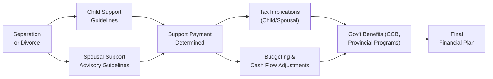

## 16.2 Financial Issues in Family Law

When families break down—whether it’s a marriage or a common-law partnership—financial matters often become front and center. Maybe you’ve seen friends or family members agonize over child support arrangements, or you’ve heard stories about spousal support battles that drag on forever. It can feel overwhelming and, honestly, pretty emotional. Here, we’ll walk through some key considerations in Canadian family law that affect a client’s financial plan. We’ll explore both child and spousal support, talk about tax implications, examine governmental benefits, and wrap up with enforcement mechanisms. Throughout, we’ll share practical strategies, personal anecdotes, and real-life scenarios to help it all sink in. By the end, you should have a deeper sense of how to incorporate family law responsibilities into a comprehensive financial plan for your clients—or, if you’re reading this for personal guidance, you’ll be better equipped to navigate financial decisions during or after separation.

### General Context and Why It Matters
If you’re the person who’s going to pay child or spousal support, you need to budget carefully, adjust your cash flow, and plan your investments around these obligations. If you’re the recipient, it’s crucial to know how these amounts affect your own income, your taxes, and even your eligibility for certain government benefits. Plus, family law can intersect with areas like estate planning, property division (see Section 16.3 for more on property issues during relationship breakdown), and retirement planning.

Below, we’ll dive into each critical area: child support, spousal support, tax implications, imputed income, budgeting, enforcement, and how to keep all those moving parts in a single cohesive plan.

---

### Child Support Basics
Child support is one of the most common financial issues you encounter in family law. In fact, child support obligations are established by the Federal Child Support Guidelines or similar provincial guidelines. If you’ve ever looked at these tables, you’ll notice they consider the paying parent’s (or payor’s) income, the number of children, and, in some cases, the province of residence. The outcome is a “basic” monthly amount owed to the recipient (the parent who primarily cares for the children).

• The Guidelines are designed to make the amount of child support more predictable and consistent across similar income levels and family circumstances.  
• The adjustments are based on line 15000 of your tax return (previously line 150) and possibly other income sources, though the official measure of “income” may differ slightly from standard T4 wages (we’ll tackle that a bit later).  
• Under these guidelines, the payor is responsible for a base monthly amount that generally covers everyday living costs like food, clothing, and shelter.

#### A Personal Take
A friend once shared with me that when his kids were small, the idea of a set formula for child support actually eased a lot of tension. He and his ex-spouse could point to the guidelines and say, “Hey, this is what the government says; let’s base everything off that.” It gave them a starting point to negotiate other elements, like extra-curricular costs. Maybe it’ll work similarly for your clients.

---

### Child Support: Special or Extraordinary Expenses
Beyond the basic amount, there’s this additional piece called “special or extraordinary expenses.” We’re talking about child care costs, dental or medical needs that go beyond standard coverage, extracurricular activities that are essential for the child’s development, or private school fees. The law suggests that both parents should share these costs in proportion to their respective incomes.

Let’s say your clients have a child who excels in competitive gymnastics. This can be pricey—training fees, gear, travel for competitions can all add up. Because it’s more than a typical sports club fee, it might be considered an extraordinary expense. Courts or agreements can require each parent to contribute based on how much they earn. So if one parent makes 70% of the combined income, they might pay 70% of those special expenses.

---

### Spousal Support: The Basics
Spousal support comes into play when one spouse (or common-law partner) is entitled to financial assistance from the other after separation. The Spousal Support Advisory Guidelines (SSAG) help lawyers, judges, mediators, and financial professionals figure out appropriate ranges for support: both the monthly amount and how long the payments should last.

Factors that typically shape the spousal support arrangement include:  
• Length of the relationship: A 25-year marriage often leads to a different outcome than a short 1- or 2-year cohabitation.  
• Roles during the marriage: Did one spouse stay home to raise kids while the other worked? Were both earning similar incomes?  
• Each spouse’s financial circumstances post-separation: If one spouse is in financial crisis while the other is comfortably well off, that imbalance might influence spousal support decisions.

#### Incorporating Spousal Support in a Financial Plan
From a pure financial planning perspective, spousal support is a significant cash flow item. If your client is going to receive support, do you factor that in as stable monthly income? Possibly yes, but be careful—spousal support can end or get adjusted if financial circumstances change. If your client is the payor, you want to build that monthly expense into the plan (and watch out for changing life or employment situations that might affect their ability to pay).

---

### Tax Implications of Support Payments
Now, let’s talk taxes—everyone’s favorite topic (or maybe not!). Under typical Canadian family law rules:

• Child Support: Currently, it’s neither taxable for the recipient nor tax-deductible for the payor. This means it’s “tax-neutral.”  
• Spousal Support: This can be tax-deductible to the payor and taxable to the recipient, provided certain conditions are met. Generally, the arrangement must be in the form of a written agreement or court order, with periodic payments rather than a lump sum.

Picture this scenario: A high-income spouse is ordered to pay spousal support monthly to the lower-income spouse. The payor reduces their taxable income by making these payments, while the recipient increases their taxable income. In that sense, it’s almost like transferring a chunk of the payor’s income bracket to the lower-income spouse. 

However, lump-sum spousal support payments are usually neither tax-deductible nor included in the recipient’s income. Be sure you understand how the payments are being structured—if your client wants the tax deduction, the payments need to qualify under the rules.

---

### Imputed Income for Support Calculations
Sometimes, the court or both parties might believe a spouse is “intentionally under-employed.” Maybe they quit a high-paying job to avoid paying higher child support. In these situations, the court can assign an income to that spouse (“imputed income”) that’s higher than what they actually report, to ensure fairness. For instance, if a dentist decides to work part-time without a valid reason—like health constraints or childcare responsibilities—courts can say, “We think you’re capable of earning more. We’ll base support on that notional higher income.”

As a financial planner, it’s really important to know that “income” in family law might not be identical to T4 or net business income. A spouse’s non-taxable benefits, certain deductions, and other factors could be added back to get a “true” support-eligible income. This means your clients might have a higher or lower official figure for support purposes than what they see on their tax return.

---

### Government Benefits for Children
Clients with children often receive the Canada Child Benefit (CCB) or other provincial/territorial benefits. After separation, custody arrangements come into play. If the parents share custody 50/50, each parent might receive 50% of the entitled benefits. If it’s a primary residence arrangement, only the parent with the primary residence might receive the benefit. Understanding this is vital for budgeting: the shift in benefits can be dramatic if a client goes from 100% of the CCB to half, or vice versa.

Governments also adjust your child benefit amounts when your marital status changes and your net family income changes. Encourage your clients to let the Canada Revenue Agency (CRA) know right away about changes in their living arrangements because delayed updates can trigger overpayments or underpayments that complicate next year’s taxes (and finances).

---

### Budgeting and Cash Flow Adjustments
Alright, so let’s bring it all together in terms of everyday money management. If you’re updating a client’s financial plan after separation or divorce, consider the following:

• Income Adjustments: If your client is paying spousal support, we obviously need to reduce their disposable income. If they receive spousal support, that income affects both their standardized living expenses and their tax bracket (when the support is taxable).  
• Saving for Emergencies: Whenever you see ongoing family law obligations, you need to ensure there’s a decent emergency fund. Missed support payments can lead to enforcement (more on that in a minute).  
• Housing and Lifestyle: With multiple households to support, sometimes one or both spouses need to scale down homes, cars, or other expenses.  
• Retirement Targets: Spousal support might last until a certain age or for a set number of years, which can have ripple effects on RRSP contributions or future retirement planning. Make sure any monthly shortfall or surpluses are accounted for in the client’s financial projections.

Personally, I’ve seen friends who, post-divorce, realized that two mortgages and extra living expenses were just unworkable on their paycheques—and they ended up dipping into their RRSPs to cover monthly costs. That’s obviously not ideal. A proactive plan could have helped them preserve more of their long-term savings.

---

### Maintenance Enforcement Programs (MEP)
Canada has a system in each province and territory known as the Maintenance Enforcement Program (MEP). If a spouse or parent isn’t paying support, the MEP can step in to enforce court orders or agreements. How can this enforcement look?

• Garnishing Income: MEP can garnish wages directly from the payor’s employer.  
• Seizing Tax Refunds: If there’s a tax refund owing to the payor, the government might redirect those funds to the support recipient.  
• Suspending Driver’s Licences or Passports: In extreme cases, a payor who owes significant arrears could lose their driving privileges or even their passport.

For a financial planner, you should be aware of MEP if your client is dealing with missed payments. If your client is the payor and behind on obligations, it can be very destructive to their financial plan (and overall well-being). If your client is the recipient who’s not being paid, the MEP might give them some measure of security.

---

### Putting It All Together: A Visual Overview
Below is a mermaid diagram to illustrate how child support, spousal support, tax considerations, and benefits might interact in a post-separation scenario.

• “A” is where separation or divorce initiates the entire process.  
• “B” and “C” represent child support and spousal support guidelines.  
• From “D,” you see how these support payments tie into both “E” (tax implications) and “F” (budget and cash flow).  
• Government benefits (“G”) can be affected by both tax changes and support arrangements.  
• Ultimately, the final financial plan is adjusted based on all these data points.

---

### Case Studies: Bringing It to Life
Let’s look at two quick snapshots:

1) The Bundling Parent Scenario  
   - Jennifer and David are recently separated. They have two kids, ages 9 and 13. Jennifer earns CA$90,000 a year; David earns CA$40,000.  
   - Using the Federal Child Support Guidelines, David pays a base monthly child support for both kids that’s tied to his income bracket.  
   - Because their 13-year-old is in advanced music lessons and the fees are considered special or extraordinary expenses, David contributes an additional share towards that expense in proportion to his income (roughly 30% of it, while Jennifer covers 70%).  
   - Both update the CRA about their new statuses, so each receives a portion of the Canada Child Benefit based on custody arrangements.

2) The High-Income Separation  
   - Karen and Michael had a 20-year marriage. Karen made $200,000 annually, and Michael was a stay-at-home parent with minimal side income.  
   - Court orders spousal support. Because the relationship was long-term, the SSAG suggested a multi-year spousal support arrangement.  
   - Karen writes monthly checks, and the spousal support payment is tax-deductible to her while taxable to Michael.  
   - Karen’s financial planner adjusts her RRSP contributions to account for the new tax scenario. Michael’s planner helps him budget the new inflow while factoring in the tax he’ll owe each April.

---

### Additional Tools and Resources
• Federal Child Support Guidelines:  
  https://laws.justice.gc.ca/eng/regulations/SOR-97-175/

• Spousal Support Advisory Guidelines:  
  Available through the Department of Justice Canada website or provincial justice websites.

• Provincial Maintenance Enforcement Programs (Search: “Maintenance Enforcement Program [Province/Territory]”)

• CIRO for regulatory and compliance updates:  
  https://www.ciro.ca  
  (Note that the Mutual Fund Dealers Association of Canada [MFDA] and the Investment Industry Regulatory Organization of Canada [IIROC] amalgamated into CIRO on January 1, 2023.)

• Canada Child Benefit, provincial/territorial child benefits, and other child/family benefits:  
  https://www.canada.ca/en/revenue-agency/services/child-family-benefits.html

• Open-source budgeting tools like GnuCash:  
  https://www.gnucash.org/

• Online Child Support Calculators:  
  Some provincial websites provide a free tool to approximate child support amounts.

Consider also referencing your legal counsel or professional resources when in doubt. Every situation is personal, and the statutory or court-based nuances can be tricky.

---

### Glossary of Key Terms

Child Support Guidelines: Government tables (federal or provincial) that illustrate standard monthly child support obligations based on the payor’s income and the number of children.

Spousal Support Advisory Guidelines (SSAG): Soft-law guidelines in Canada that provide recommended ranges for spousal support amounts and durations.

Imputed Income: Income assumed or “imputed” by the court when a spouse is under-employed or intentionally earning less than they are capable of.

Maintenance Enforcement Program (MEP): Provincial/territorial agency dedicated to enforcing child and spousal support orders or agreements.

Canada Child Benefit (CCB): A tax-free monthly government benefit for eligible families with children under the age of 18.

Payor/Payer: The individual who pays financial support.

Recipient: The individual who receives financial support.

Special or Extraordinary Expenses: Child-related costs beyond standard living expenses. Common examples include childcare, extra-curricular fees, and certain medical or dental treatments.

---

### Conclusion
Family law is rarely cut and dry, especially when it comes to finances. Child and spousal support considerations weave together tax implications, personal budgeting, government benefits, and ongoing enforcement concerns. If you’re a financial advisor, it’s about helping clients navigate these complexities in a balanced way, ensuring they stay on track for goals like retirement and saving for a home—while fulfilling their legal obligations. If you’re the client yourself, remember you don’t have to go it alone. Resources are out there—official guidelines, enforcement programs, and family budgeting tools that lighten the administrative burden. 

When in doubt, remember that every situation can be unique, so working alongside qualified family lawyers, tax experts, or financial planners with family law experience is key. It’s not just about the legal obligations; it’s about forging a sustainable financial path for everyone involved, including the children at the center of it all.

---

## Family Law Financial Issues: 10 Question Review Quiz



### Which document provides tables that outline typical child support payments based on the payor’s income and number of children?
- [ ] Spousal Support Advisory Guidelines (SSAG)
- [ ] CIRO Regulatory Guidelines
- [x] Federal Child Support Guidelines
- [ ] Canadian Child Benefit Act

> **Explanation:** The Federal Child Support Guidelines (and relevant provincial versions) list standard child support amounts reflecting the payor’s income and the number of children.

### Which of the following costs would typically be classified as a “special or extraordinary expense” under child support rules in Canada?
- [ ] Regular groceries
- [x] Competitive sports fees for specialized training
- [ ] School bus fare
- [ ] Basic clothing

> **Explanation:** Extraordinary expenses often include high-cost activities (e.g., advanced training, daycare, comprehensive dental) beyond regular child-rearing costs.

### True or False? Child support payments are generally taxable in the recipient’s hands and deductible for the payor.
- [ ] True
- [x] False

> **Explanation:** Child support payments are neither taxable for the recipient nor tax-deductible for the payor.

### Under what circumstance can a court “impute income” to a spouse for support calculation?
- [ ] When the spouse is working multiple jobs
- [ ] When the spouse has a valid medical reason to work part-time
- [ ] When the spouse’s employer changes
- [x] When the spouse is intentionally under-employed or unemployed without valid justification

> **Explanation:** Courts can impute income when it appears a spouse is intentionally avoiding reasonable employment to reduce support obligations.

### The Spousal Support Advisory Guidelines (SSAG) primarily help with which aspects of spousal support?
- [x] Providing ranges for amounts and duration
- [ ] Determining the exact, fixed amount by law
- [ ] Recommending child-related expenses
- [ ] Enforcing spousal support payments via garnishment

> **Explanation:** SSAG offers a range of possible spousal support amounts and durations but does not represent a rigid, fixed formula.

### Which provincial/territorial agency is typically responsible for enforcing child and spousal support orders?
- [ ] The Department of Justice
- [ ] The Canada Revenue Agency
- [ ] CIPF
- [x] Maintenance Enforcement Program (MEP)

> **Explanation:** Maintenance Enforcement Programs exist in each province/territory to enforce support orders, ensuring compliance through measures like garnishing wages or seizing tax refunds.

### When structuring spousal support, which payment form is generally tax-deductible to the payor and taxable to the recipient?
- [ ] Lump-sum payment
- [x] Periodic payments under a registered court order or written agreement
- [ ] Child support portion
- [ ] In-kind payments (e.g., gift cards)

> **Explanation:** Periodic spousal support payments tied to a formal agreement or court order are typically tax-deductible for the payor and taxable for the recipient.

### Which of the following best describes an example of “extraordinary expense” for a child’s educational needs?
- [ ] The standard cost of school supplies (e.g., pencils, notebooks)  
- [x] High-cost special education programs or private school fees
- [ ] Regular monthly Internet bills used for homework
- [ ] A typical bus pass to get to and from school

> **Explanation:** Extraordinary expenses generally exceed what is considered “ordinary” and may include advanced or specialized educational programs.

### If both parents share custody equally (50/50), how might the Canada Child Benefit (CCB) usually be handled?
- [ ] One parent receives the entire CCB
- [x] The benefit is split proportionally or equally, based on custody percentages 
- [ ] The benefit is frozen until the child turns 18
- [ ] The benefit is usually discontinued

> **Explanation:** In a shared custody arrangement (50/50), each parent normally receives a portion of the CCB in relation to the custody split.

### A recipient who isn’t receiving the support payments owed may seek enforcement through Maintenance Enforcement Programs. Which of the following is a common enforcement tool MEP can use?
- [x] Garnishing the payor’s wages
- [ ] Charging the recipient a penalty fee
- [ ] Barring the payor from opening a savings account
- [ ] Changing the amount owed without a court order

> **Explanation:** Wage garnishment is a key enforcement method used by MEP agencies in each province/territory to collect overdue support.


