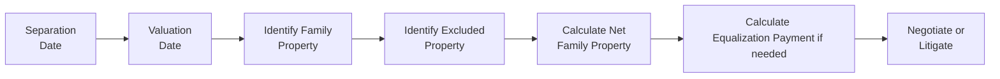

## 16.3 Property Issues on Relationship Breakdown

Sometimes, life doesn’t go quite as planned. You get married or move in together, maybe even start a family, but then “happily ever after” takes a surprising detour. In Canada, when a marriage or common-law relationship breaks down, the rules on how to share property can suddenly feel pretty complicated. You might find yourself saying, “Wait, do we have to split my grandmother’s cottage too?” or “I thought my pension was just for me.”  

This section is all about clarifying (and maybe even simplifying, if that’s possible!) how property is divided at separation or divorce. Different provinces have different legislation—Ontario has its Family Law Act, British Columbia’s got a statute with the same name, and Alberta has its Family Property Act—so the specifics vary depending on where you live. But we’ll go through the main concepts that show up across Canada: net family property, equalization payments, exclusions, special rules for the “matrimonial home,” and the often-overlooked area of common-law relationships.  

We’ll also explore how registered assets like RRSPs, TFSAs, and pension plans come into play. The big takeaway? Document everything—and I really mean everything—because good records will reduce future drama. Let’s dive in, step by step.

---

### Understanding Provincial Variations

If you’ve ever traveled to different parts of Canada, you’ll know how uniquely each province or territory approaches everyday life, from the language to the local laws. Well, property division is no different. Each province has its own spin on who gets what.  

• In Ontario, the Family Law Act focuses on the growth in net family property (NFP) during the marriage. After separation, each spouse calculates their NFP from marriage date to separation date. The spouse who’s enjoyed the bigger increase pays half the difference to the other.  
• In Alberta, the Family Property Act operates similarly, but the details around exclusions, contribution values, and the valuation date can differ.  
• In British Columbia, the Family Law Act (which also renamed the concept of “marriage-like relationships” to more clearly include common-law spouses who’ve lived together for at least two years) sets out how family property is to be divided, typically on a 50-50 basis unless that would be significantly unfair.  

And that’s just a snapshot. Each province has plenty of twists—including the treatment of inheritances, gifts, and pension benefits, all of which can vary. So if you ever find yourself advising clients, or you’re in this boat yourself, it’s critical to know which provincial statute governs your situation.  

---

### The Concept of Equalization (for Married Couples)

Let’s focus on a province like Ontario to illustrate how “equalization” works, but keep in mind that many other provinces have similar frameworks. Suppose you and your spouse got married a decade ago. At marriage, you both list your assets and liabilities. Over the course of your 10-year marriage, both of you accumulate new property—like a house, maybe some investments, perhaps a cottage up north. Now you separate.  

Ontario’s Family Law Act tries to ensure that you both share equally in that new wealth. Hence, each spouse determines their “net family property,” which basically is:

$$
\text{NFP} = \bigl(\text{Assets}_{\text{Separation}} - \text{Liabilities}_{\text{Separation}}\bigr) \;-\; \bigl(\text{Assets}_{\text{Marriage}} - \text{Liabilities}_{\text{Marriage}}\bigr)
$$

If your spouse’s NFP is, say, $200,000, and yours is $100,000, the difference is $100,000. One half of that difference is $50,000, so the spouse with the larger NFP (here, $200,000) pays $50,000 to the other. This helps ensure both parties walk away with an equal “growth” in their net worth from the time they were married.  

#### Special Issues Around the Valuation Date  
Because property values can fluctuate, especially during a messy breakup, provinces usually define a “valuation date” to fix the point in time when you measure each spouse’s net family property. In Ontario, that date is commonly the date the spouses separate with no reasonable prospect of reconciliation. The precise definition can be a bit technical, so always check your local legislation.  

#### Personal Anecdote  
I remember a friend who had a strong emotional attachment to a piece of land that had been in his family for years. During his divorce, the question was: did the property belong exclusively to him because he inherited it, or was it part of the equalization? Well, we’ll talk about exclusions in a bit, but the short answer usually depends on the rules in your province.  

---

### Exclusions and Exemptions

Not all property is up for grabs when relationships fall apart. There are certain “excluded” assets—like gifts or inheritances received from someone outside of the marriage—that many provinces protect.  

• In Ontario, inheritances or gifts from third parties (excluding the spouse) during the marriage are generally excluded, unless they are used towards the matrimonial home.  
• In British Columbia, typically any property you bring into the relationship remains your separate property, and only the increase in its value during the relationship is subject to division.  
• In Alberta, certain property acquired before marriage remains the property of that spouse, as do inheritances or gifts, but the increase in value of that excluded property can sometimes be shared.  

The key is to track these items over time. If you really want to keep Aunt Lydia’s jewelry or that inherited lakefront cottage separate, keep good documentation—like appraisal values, inheritance letters, or gift receipts—so you can prove that some assets (and their original valuations) fall outside the pot.  

#### Common Pitfalls  
• Mixing excluded property with marital property. For instance, if you deposit an inheritance into a joint account used for family expenses, you might lose the exclusion because you’ve “commingled” that asset.  
• Not maintaining adequate records. It’s amazing how many people fail to keep a paper trail. Let’s say you lose an inheritance letter, or you never note down the value of assets at marriage; you might lose an argument over the asset’s status as excluded.  

---

### Considering the Family Residence (The Matrimonial Home)

The matrimonial home is often the biggest asset in a divorce—both financially and emotionally. In many provinces, special rules mean that both spouses have an equal right to live in the shared home, regardless of who actually holds legal title.  

• Ontario treats the matrimonial home as part of the family assets, but it also has unique protections. Even if one spouse owned the home before marriage, that spouse can’t simply kick the other out upon separation. Moreover, in Ontario, if you owned the home before marriage, you don’t get to subtract its value on the date of marriage from your net family property if the same home is the matrimonial home on the date of separation.  
• British Columbia similarly protects the “family residence.” It’s considered family property subject to a 50-50 split of the increase in value during the relationship.  
• Alberta has occupancy rights for spouses too, which means one spouse can apply to stay in the matrimonial home, at least for a certain period, even if the other spouse is the registered owner.  

#### Emotional Attachments  
Honestly, the matrimonial home can trigger serious emotion—and cost. Relinquishing it can be heartbreaking if your family’s been living there for years, or if you put in sweat equity renovating it from top to bottom. So, many couples end up negotiating a buyout, or they might sell the property and split the proceeds if neither can afford it alone.  

---

### Factor in Common-Law Property Division

For common-law couples (or “adult interdependent partners,” as they’re sometimes called in certain provinces), the rules can be starkly different. In many jurisdictions, statutory property laws protect only legally married spouses. Common-law partners might not have an automatic claim to property just because they lived together for, say, eight years.  

• Ontario: Common-law spouses generally do not get equalization. Instead, they may have to make a claim under principles like unjust enrichment or constructive trust if they believe they contributed to property.  
• British Columbia: By contrast, the Family Law Act extends property-division rules to common-law spouses who’ve lived together for at least two years or who have a child together.  
• Alberta: The Family Property Act applies to married couples and adult interdependent partners alike. That means some common-law couples do have statutory property rights if they meet the definition of adult interdependent partners.  

If you’re in a province that doesn’t automatically grant property rights to common-law couples, you might be forced to rely on fairly complicated trust principles or a claim for unjust enrichment. If one partner ends up with a windfall that the other contributed to—maybe you spent a decade renovating a house that was in your partner’s name—that can be “unjust.” Courts can make a property award or compensation.  

Anyway, it’s a headache. The key is to understand that a break-up can get real complicated if you’re not married in a province that specifically extends statutory rules to common-law partners.  

---

### Pensions and Other Registered Assets

Pensions, RRSPs, and TFSAs are often overlooked, but they can carry significant value—sometimes even more than the family home over the long term.  

• Registered Retirement Savings Plans (RRSPs) and Tax-Free Savings Accounts (TFSAs) are commonly treated as family property, which means the growth in these accounts during the relationship is shareable. The specific rules differ by province, so be sure to check.  
• Employer Pension Plans—particularly Defined Benefit (DB) pensions—can be tricky to value. You often need an actuary or pension administrator to give you a present value of the future pension benefits accrued during the marriage. In many breakups, dividing a DB pension can be a big bone of contention because it might represent a large future income stream.  
• Locked-in Retirement Accounts (LIRAs): In some provinces, once pension funds are locked in, they cannot be accessed until retirement. However, the portion that is considered shareable may be transferred or potentially divided at source (pension-splitting at source) if the legislation allows.  

#### Collaborating with Professionals  
If you’re advising clients (or are in this situation personally), don’t be shy about bringing in an actuary, an accountant, or both. Evaluating a defined benefit pension is no small feat—especially if the plan is complex, or if there are bridging benefits.  

---

### Documentation to Minimize Disputes

We can’t say it enough: keep good records. That means from Day 1 of your marriage or relationship—ideally even before. Try to have:  

• A record of major assets you owned at marriage and their appraised or fair market value.  
• Documentation on inheritances or gifts (letters, written confirmations, bank deposits).  
• Bank statements or mortgage statements tracing how you used those inheritances or gifts.  
• Clear inventory of any properties you brought into the marriage, along with valuations.  

Best case scenario? You or your financial planner sets up a system to track net worth annually. That might sound as exciting as watching paint dry, but wow, it can save you huge headaches if the relationship heads south.  

Aside from that, seeking professional advice early—say, from a lawyer or a financial advisor—can help you structure your finances in a way that clearly demarcates what’s joint property and what’s excluded.  

---

### Practical Flow: From Separation to Settlement

Below is a simplified flowchart showing the general process of property division in many Canadian provinces once a couple separates. The specifics vary (and often overlap), but this should help you visualize the main steps.

• Step A: The relationship ends, marking a “Separation Date.”  
• Step B: Determine the relevant valuation date by law.  
• Step C: Identify which assets and liabilities are in the pot.  
• Step D: Subtract any recognized exclusions (like inheritances, gifts, or pre-relationship property, depending on your province’s law).  
• Step E: Calculate the net family property for each spouse (or partner).  
• Step F: Figure out if an equalization or division payment is required.  
• Step G: Attempt negotiation. If that fails, litigation is the final resort.  

---

### Helpful Examples and Case Studies

• Case Study 1: Divorce in Ontario  
  - Anna and Bob get married in 2010. On the day of marriage, Anna owned a condo worth $100,000 (with no mortgage), and Bob owned a car worth $5,000 and had $5,000 in credit card debt. During their 12-year marriage, they sold the condo and bought a new house together. By 2022, Anna and Bob’s net family property also included savings, investments, and more. They separated in 2022.  
  - In Ontario, Anna doesn’t automatically get to deduct the value of the condo at marriage from her NFP if that property ended up being their matrimonial home on the date of separation (subject to a few exceptions). But if the condo was sold earlier in the marriage and the proceeds went toward the purchase of a jointly titled house, the law may treat that real estate as “family property.”  
  - When they do the math, Bob might be entitled to an equalization payment if Anna’s overall net family property growth was higher.  

• Case Study 2: Common-Law Split in Manitoba  
  - Carla and Dan lived together for seven years in Manitoba (common-law). They never married. The house title was in Dan’s name alone, but Carla poured equal money into the mortgage. When they split, Carla claimed she should at least get half of the house’s equity. Manitoba’s laws around common-law property division differ from Ontario, so Carla might have recourse under Manitoba’s family property legislation. If not, she would rely on an “unjust enrichment” claim, showing she contributed financially (and maybe also by doing major improvements) and that Dan benefited unfairly at her expense.  
  - Ultimately, if the law in Manitoba supports the idea that long-term common-law folks can share property, Carla’s on solid ground. Otherwise, she might be successful under trust and unjust enrichment principles.  

---

### Best Practices, Pitfalls, and Strategies

• **Best Practices**  
  - Consider a domestic contract (prenuptial or cohabitation agreement) if you want to clarify from the get-go how property will be divided if you separate.  
  - Keep an itemized inventory of your assets from day one. Update it regularly.  
  - Consult legal or financial experts if you’re venturing into major financial territory such as investing an inheritance into a family asset.  

• **Common Pitfalls**  
  - Failing to maintain separate accounts for gifts or inheritance. Once you mix them into a shared account, you risk losing the exclusion.  
  - Assuming the law in your province automatically covers you if you’re in a common-law relationship and not checking whether you actually qualify.  
  - Underestimating the value of your spouse’s pension or other intangible assets.  

---

### Working with Advisors and CIRO-Regulated Firms

It might be easy to forget, but if you or your spouse hold investment accounts at a brokerage or a financial advisory firm regulated by the Canadian Investment Regulatory Organization (CIRO)—the current (as of 2025) national self-regulatory body responsible for overseeing investment dealers, mutual fund dealers, and marketplace integrity—those assets also fall under the “family property” umbrella. You’ll likely need statements showing the value of those investment holdings on the valuation date. Although CIRO doesn’t directly intervene in family law matters, it maintains industry standards that can help ensure advisors provide the relevant documentation and follow the appropriate procedures.  

---

### Additional Resources for Further Exploration

• **Family Law Act (Ontario)**:  
  https://www.ontario.ca/laws/statute/90f03  

• **Family Property Act (Alberta)**:  
  https://www.qp.alberta.ca/  

• **Family Law Act (British Columbia)**:  
  https://www.bclaws.gov.bc.ca/  

• **Pension Valuation Guidelines** (varies by province; see also the Canadian Institute of Actuaries):  
  https://www.cia-ica.ca/  

• **CanLII** (Canadian Legal Information Institute) for property division cases:  
  https://www.canlii.org/  

• Textbook: “Sharing the Pie: Property Division in Canada” (various authors)

We also recommend working with qualified lawyers and accountants to confirm the laws that apply to you.  

---

### Glossary

• **Net Family Property (NFP)**: The net growth in a spouse’s property from the date of marriage to the date of separation, used to calculate the equalization payment in Ontario and some other provinces.  

• **Equalization Payment**: A lump-sum payment one spouse pays the other to ensure both spouses share equally in the total growth of net family property acquired during the marriage.  

• **Matrimonial Home**: The primary residence where spouses usually reside. Special legal rules often give both spouses equal right to possession.  

• **Excluded Property**: Certain types of assets not included in the divisible property—for example, gifts, inheritances, or property owned prior to the relationship (subject to local rules).  

• **Unjust Enrichment**: A key legal principle for common-law partners, where one partner obtains a benefit at the other’s expense under circumstances deemed unfair by the courts.  

• **Valuation Date**: The legally recognized date to measure the value of assets and liabilities in a family law setting. In most provinces, it’s tied to the date of separation.  

• **Defined Benefit Pension**: A pension plan promising a specific future income stream, typically requiring actuarial valuation in family law proceedings.  

---

### Conclusion

Property division in Canada when relationships break down can be a bit like assembling an intricate puzzle. Each province brings its own pieces: different rules on the matrimonial home, different ways to handle pensions, and different approaches to handling common-law relationships. The big message here is: be prepared and keep good records. If you can do that, you’ll stand a better chance of a fair—and maybe a little less stressful—resolution.  

Anyways, that’s the gist of it. It might sound daunting, but with the right information, the right professionals (lawyers, actuaries, financial planners), and the right attitude, you can navigate these tricky waters. And believe me, you’ll be grateful you took the time to understand it all if you ever do need it.  

---

## Test Your Knowledge: Understanding Property Division on Relationship Breakdown



### 1. According to Ontario’s Family Law Act, what is “Net Family Property” used to calculate?

- [ ] Child support obligations.
- [ ] Spousal support payments.
- [x] Equalization payments.
- [ ] Court filing fees.

> **Explanation:** In Ontario, Net Family Property (NFP) measures each spouse’s net worth growth during the marriage, which is then used to determine if an equalization payment is owed from one spouse to the other.

### 2. Which of the following best describes a “matrimonial home” in Canadian family law?

- [x] The primary residence where spouses habitually reside.
- [ ] Any secondary property jointly owned by the spouses.
- [ ] A vacation property inherited by one spouse.
- [ ] A property owned prior to marriage that cannot be divided.

> **Explanation:** The matrimonial home is usually the principal residence of the spouses, with special legal protections giving each spouse equal right to possession.

### 3. In which province can common-law couples be entitled to a statutory property division similar to married couples if they have lived together for at least two years?

- [x] British Columbia.
- [ ] Ontario.
- [ ] Prince Edward Island.
- [ ] Nova Scotia.

> **Explanation:** British Columbia’s Family Law Act provides property-division rights to common-law partners who have lived together for at least two years.

### 4. Which of the following assets is typically excluded from the family property in many provinces?

- [x] Inheritances received by one spouse during the marriage (and kept separate).
- [ ] The matrimonial home.
- [ ] Joint bank accounts.
- [ ] Family vehicles.

> **Explanation:** Inheritances (if properly traced and kept separate) are often excluded from family property. However, the specifics of each province’s legislation may vary.

### 5. True or False: One of the best ways to preserve an inheritance from equalization is to deposit it into a joint account.

- [ ] True
- [x] False

> **Explanation:** Mixing an inheritance into a joint account can cause it to lose its excluded status. Staying organized and maintaining separate records and accounts for inheritances preserves their excluded status.

### 6. Which principle do common-law partners typically rely on if their province doesn’t have statutory property rights for common-law relationships?

- [x] Unjust enrichment.
- [ ] Collective bargaining.
- [ ] Equitable restitution.
- [ ] Limitations law.

> **Explanation:** Common-law partners often make claims under unjust enrichment or related trust principles if they contributed to property still held in the other partner’s name.

### 7. What is the main challenge in valuing a defined benefit pension for property division?

- [ ] No professional can accurately calculate pension benefits.
- [x] It often requires actuarial expertise to determine the present value.
- [ ] Defined benefit pensions are never considered divisible assets.
- [ ] There is no standardized method for calculating future returns.

> **Explanation:** Actuarial valuations are typically needed to calculate the present value of future pension benefits, making the division of defined benefit pensions potentially complex.

### 8. Under Ontario’s Family Law Act, what happens if the marital home was owned by one spouse prior to marriage, yet it remained the family residence at the time of separation?

- [ ] The spouse automatically retains exclusive ownership.
- [x] The spouse may not get to deduct its original value on the date of marriage.
- [ ] Both spouses are entitled to a 50-50 split in all situations.
- [ ] The home is not considered part of the net family property at all.

> **Explanation:** In Ontario, if the same property is the matrimonial home at the date of separation, the spouse who owned it before may be unable to exclude its marriage-date value from the NFP calculations.

### 9. Which of the following statements is true about the “valuation date”?

- [x] It is the date used to measure the value of each spouse’s assets and liabilities.
- [ ] It is the date the couple got engaged.
- [ ] It is irrelevant to property division.
- [ ] It must be the date of the final divorce decree.

> **Explanation:** The valuation date is used to determine the value of assets and liabilities for property division, typically around the separation date or another statutorily defined date.

### 10. True or False: Proper documentation of asset values and any gifts or inheritances can reduce disputes if a relationship breaks down.

- [x] True
- [ ] False

> **Explanation:** Keeping detailed records supports the classification of assets as excluded (if applicable) and ensures accurate calculation of each spouse’s net family property.


