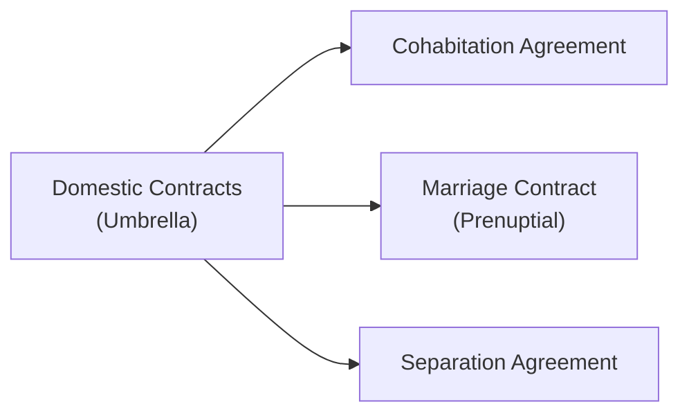

## 16.4 Domestic Contracts

Have you ever had a conversation with a friend who was a little sheepish about discussing what happens if a relationship doesn’t work out? I remember chatting with a colleague—let’s call him Dave—who insisted his new partner and he would “never need anything like a prenuptial agreement.” He was convinced that talking about finances and the possibility of a split would somehow cast a dark cloud over their relationship. But, well, life happens. A few years later, Dave found himself in a nasty dispute about who owned what—especially the house—and ended up wishing he’d put something in writing back when everyone was still on good terms.

In Canada, domestic contracts can help avoid messy misunderstandings and pave a smoother path, not just if a relationship breaks down, but also to clarify each partner’s financial obligations during the relationship. In this part of our book, we’ll dissect the nature of domestic contracts. We’ll look at their structure, enforceability, and the crucial role they can play in a financial plan. And we’ll also share some best practices—like obtaining independent legal advice (ILA) and ensuring full financial disclosure—to help you better serve clients in this area.

Before diving in, remember that domestic contracts intersect with laws that vary somewhat across provinces and territories. If you advise clients on domestic contracts, you’ll want to ensure you’re up to speed on the relevant legislation where they reside. Also, if you are working under the oversight of the Canadian Investment Regulatory Organization (CIRO)—which replaced the historical MFDA and IIROC—note that while CIRO supervises investment dealers and mutual fund dealers, matters like family law and domestic contracts can still have a major impact on your client’s overall financial well-being.

Let’s start by understanding what we mean by “domestic contracts.”

---

### What Are Domestic Contracts?

A domestic contract is a legally binding agreement that addresses the rights, obligations, and expectations of individuals in familial or spousal relationships. Broadly, domestic contracts encompass:

• Cohabitation agreements  
• Marriage contracts (sometimes called prenuptial or “prenup” agreements)  
• Separation agreements  

These agreements are designed to help couples or ex-couples clarify things like property distribution, spousal support, and sometimes even child-related provisions. As we’ll soon see, each type of contract serves a different life stage—before marriage, during marriage, or after separation.

Domestic contracts offer a preventive framework. Instead of waiting for courts to decide how to divvy up assets or settle support issues, couples can define it themselves while in good faith. Having these agreements in a financial plan can reduce the stress, legal fees, and unpredictability during significant life events like relationship breakdown or death.

It might feel awkward or unromantic to discuss, say, a “cohabitation agreement,” or a “marriage contract,” especially if a relationship is blossoming. But time and again, I’ve seen how such conversations—when handled sensitively and with proper legal counsel—can give partners a deeper understanding of each other’s expectations. Think of it kind of like insurance: We hope not to need it, but we’re grateful it’s there if something unexpected happens.

Below is a quick diagram illustrating how the three major types of domestic contracts fit under the broader umbrella.

---

### Cohabitation Agreements

Cohabitation agreements are typically used by couples who live together (or plan to live together) but have not formally married. This is particularly significant in Canada, where some provinces grant “common-law” status to couples who have lived together for a certain period (often two or three years, although definitions vary).

A cohabitation agreement can outline:  
• How existing and future property will be managed or divided if the relationship ends  
• Shared expenses and debts during the relationship  
• Spousal support obligations (if applicable)

Let’s say we have Alex and Sam, who plan to move in together. Alex owns a condo. Both Alex and Sam want clarity on how to split mortgage payments, household expenses, and possibly how the equity in the property would be divided if Sam contributes to mortgage payments over several years. A cohabitation agreement can lay out these arrangements. It helps them avoid a scenario where Sam invests money in the condo but fights tooth and nail to claim any portion of it if they split up. Or, conversely, it can help Alex protect the condo’s equity, which might have been in Alex’s name alone from the start.

#### Why Cohabitation Agreements Matter

Cohabitation agreements allow both parties to avoid the standardized laws that might otherwise govern common-law relationships. These can be especially relevant if one partner brings a large amount of property or debt into the relationship or if one partner is the primary caretaker of children from a previous relationship. By defining the terms, each partner knows exactly where they stand, financially speaking.

A cohabitation agreement can also evolve into a marriage contract if the couple decides to wed down the line. Sometimes, couples include a clause that if they marry, the cohabitation agreement automatically becomes a binding marriage contract with or without certain adjustments.

---

### Marriage Contracts (a.k.a. Prenuptial Agreements)

Marriage contracts—commonly called prenups in popular culture—are agreements couples enter when they’re planning to marry or even after they’re already married. These agreements can:

• Protect or exclude certain assets from the equalization or distribution process in the event of divorce  
• Spell out spousal support obligations  
• Determine how property acquired before or during the marriage will be managed or divided  

Marriage contracts can be as simple or as complex as the couple desires, but the underlying principle is to provide consistency and predictability. If a relationship ends, the parties have a roadmap for dividing assets and meeting support obligations.  

Think of Maria and Liam, both successful professionals. Let’s say Maria expects a significant inheritance from a family trust in the future. A marriage contract can outline that any inherited funds remain Maria’s separate property or that a portion of it may be shared if the marriage dissolves after a certain number of years. By discussing it early, Maria and Liam avoid misunderstandings and guard their personal and family assets.

#### Key Considerations in Marriage Contracts

When discussing a marriage contract, it’s crucial that both parties:  
1. Provide full financial disclosure (net worth statements, details of major assets and debts, income information)  
2. Seek independent legal advice (ILA) to ensure each party understands the agreement  
3. Sign the contract voluntarily, without pressure or deception  

Courts in Canada can overturn marriage contracts if they see evidence of fraud, duress, or incomplete financial disclosure. If one spouse didn’t fully comprehend what they were agreeing to—or didn’t have legal counsel—that spouse might successfully challenge the agreement later.

---

### Separation Agreements

A separation agreement is a contract that resolves key issues when a couple (married or common-law) separates. It often covers:

• Property division and the transfer or sale of shared assets  
• Spousal support or child support obligations  
• Custody and access (parenting schedules) for any children  
• Who pays which debts  

Let’s say Dave and his spouse are deciding to end their marriage. They own a family home and two vehicles and have two young children. A well-structured separation agreement might specify which spouse stays in the family home, whether it will be sold, how they’ll share parenting time, and how child support or spousal support will be arranged.

#### Why a Separation Agreement Matters for Financial Planners

Separation agreements can dramatically affect a client’s net worth, investment strategy, retirement plan, and tax liabilities. If a client has to pay monthly spousal or child support, their disposable income decreases. That might mean adjustments to retirement contributions or educational savings plans. As a financial planner, understanding how separation agreements factor into your client’s overall financial plan can help you provide more holistic advice.

A comprehensive separation agreement can also eliminate the need to keep returning to court (barring significant changes, like job losses or child custody updates). It saves everyone time, money, and emotional energy.

---

### Enforceability Requirements: Keeping Contracts Valid

For a domestic contract to be legally enforceable in Canada, there are several key requirements that, if overlooked, can cause big problems down the road:

• **It must be in writing and signed by both parties.** An informal, verbal promise doesn't hold up in court.  
• **It must be witnessed.** Having a third-party witness the original signatures.  
• **Full financial disclosure is crucial.** Parties must lay their financial cards on the table. You can’t hide significant debts or assets. If the court finds a spouse hid or understated income or property, the agreement might be set aside.  
• **No duress or coercion.** Each party must enter voluntarily, without undue pressure.  

Remember, a domestic contract that attempts to restrict or eliminate child support obligations contrary to provincial or federal support guidelines may not be enforced by a court. The child’s best interests generally override any private arrangements that try to reduce or waive mandatory child support obligations.

---

### The Role of Independent Legal Advice (ILA)

Courts look favorably on domestic contracts when each party has obtained their own legal advice from separate lawyers. Here’s why that matters:

1. **Ensures Full Understanding**: Each party is much more likely to understand the ramifications of what they’re signing. For instance, a spouse who’s giving up certain property rights needs to know the future financial impact of that decision.  
2. **Reduces Risk of Unfairness**: If someone claims later they didn’t grasp what they were signing or felt pressured, having documented proof of independent legal advice counters that during any future court challenge.  
3. **Protects Both Parties**: Each lawyer advocates for their client’s best interest. This helps produce a more balanced contract. Courts want to see that the agreement is fair and reasonable and that no one exploited the other party.

As a financial planner, you’re not expected (or allowed) to give legal advice. However, you should gently encourage both partners to seek out their own lawyers. Some clients balk at the expense, but the cost of rewriting an unfair agreement—or litigating in court years later—can dwarf the initial outlay.

---

### Scope and Limitations: What Domestic Contracts Can and Cannot Do

Domestic contracts have wide scope but also distinct boundaries:

• **Property Division**: Typically, domestic contracts can detail how to divide real estate, personal property, and even intangible assets like business interests or intellectual property.  
• **Spousal Support**: The parties can set out how spousal support will be calculated and paid. They may opt for a lump sum or periodic (monthly) payment.  
• **Child Support**: Contracts can outline child support, but courts can override provisions that fail to meet statutory child support guidelines or conflict with a child’s best interest. you can’t contract out of your duty to support your child if that child qualifies for support under the law.  
• **Estate Rights**: Parties can decide on inheritance rights or disclaim certain entitlements under the provincial family law or succession law legislation.  
• **Cannot Contradict Public Policy**: Provisions that attempt to limit a child’s right to support or severely disadvantage one spouse might be struck down.

Domestic contracts, therefore, can’t do just anything. For instance, you can’t say, “If we separate, I get all your property plus a monthly support payment of $1,” when that is clearly unconscionable and inequitable. Courts want to see that any contract is fair and consistent with statutory guidelines and the principles of public policy.

---

### Integrating Domestic Contracts with Estate Planning

Family law and estate law often intertwine. For instance, a marriage contract might stipulate that each spouse waives certain rights to the other’s estate. Another example: a separation agreement may indicate how any pensions or life insurance policies should be dealt with upon separation or death.

If your client has a domestic contract that sets out property rights or obligations, it’s vital that they update their will, RRSP/RRIF beneficiary designations, insurance policy beneficiaries, and any other estate documents accordingly. In some cases, a separation might automatically revoke a spouse as a beneficiary. In other cases, you might need to actively remove that spouse. Failing to sync a client’s estate plan with their domestic contract can lead to confusion, contested wills, and family disputes.

---

### Practical Examples

1. **Cohabitation Agreement Gone Right**  
   Ellen and James started living together in James’s condo. Over the years, James paid the property taxes while Ellen took care of the mortgage interest payments. They drafted a cohabitation agreement spelling out exactly how they’d handle expenses and addressing what portion of equity Ellen might be entitled to if they broke up. Fast forward four years, they parted ways amicably, and the agreement took the guesswork out of how the bank account was split. Nobody had to lawyer up in an expensive, drawn-out fight.

2. **Prenuptial Agreement with Independent Legal Advice**  
   Martina, a partner in a successful marketing firm, was set to marry Rob, who worked as a freelance graphic designer. Martina owned a rental property and had substantial savings. Fearing future complications, both pursued legal counsel to draft an agreement that spelled out the fate of her rental property if they ever separated. Thanks to separate lawyers, both Martina and Rob fully understood their rights. The contract had a better chance of standing up if challenged, because of the transparency and fairness.

3. **Separation Agreement and Estate Coordination**  
   Devin and Laura separated after 15 years of marriage. They drafted a separation agreement that, among other things, dictated that Devin would maintain a life insurance policy naming Laura as beneficiary until their youngest child turned 18. Devin updated his will accordingly to reflect spousal obligations. Had he died without doing so, the estate division might not have matched the separation agreement, causing huge turmoil for Laura and the children.  

---

### Common Pitfalls and Best Practices

**Pitfall**: One party doesn’t fully disclose assets or debts. If discovered later, the court might invalidate or renegotiate the agreement.

**Pitfall**: Relying on verbal side deals. If it’s not in writing, risk is high that the agreement won’t hold up when it matters.

**Pitfall**: Not seeking separate legal counsel. One party claims they signed under pressure, leading courts to closely scrutinize the agreement’s fairness.

**Pitfall**: Failing to address how children’s needs (especially child support) might change over time (e.g., once kids grow older, enroll in post-secondary education, or have special medical needs).

**Best Practice**: Always get separate, independent legal advice. It’s not just recommended; it’s practically essential.  
**Best Practice**: Update the contract if circumstances change drastically (like a new child, a major shift in finances, or a move to another province).  
**Best Practice**: Ensure the contract doesn’t violate statutory requirements, especially around child support.  
**Best Practice**: Coordinate with estate planning—check for consistency in wills, insurance beneficiaries, powers of attorney, and so on.

---

### Domestic Contracts and Financial Planning

In a perfect world, finances and emotions wouldn’t mix, but in reality, they do. Domestic contracts are a prime example of this collision. As a financial planner, you may find that you’re not only dealing with numbers but also with some pretty profound personal dynamics. To build trust and help clients reach their financial goals, it’s valuable to understand the legal scaffolding of domestic contracts. You can guide them toward appropriate legal resources, help ensure they’re asking the right questions, and keep their broader financial picture front and center.

Remember that provincial family property legislation applies differently depending on whether clients are married or in common-law relationships. Also remember that the new self-regulatory organization, CIRO (created from the amalgamation of the historical MFDA and IIROC), expects investment professionals to maintain a high standard of client care. That means being aware of factors—like domestic contracts—that can significantly influence a client’s portfolio and financial well-being. Always consult the official CIRO website (https://www.ciro.ca) for any updated guidance regarding regulatory compliance.

---

### Glossary

• **Domestic Contract**: A written agreement that governs rights and obligations between partners (married, common-law, or separated).  
• **Cohabitation Agreement**: Drafted by common-law partners to clarify property division and/or support.  
• **Marriage Contract/Prenuptial Agreement**: Formal agreement by couples before or during marriage regarding property and support issues in the event of separation or divorce.  
• **Separation Agreement**: A contract that resolves financial and parenting matters after a relationship ends.  
• **Independent Legal Advice (ILA)**: Separate legal counsel for each party, ensuring each understands the contract’s implications.  
• **Full Financial Disclosure**: Mandatory practice of sharing all financial details to ensure fairness and validity of the contract.

---

### Additional Resources for Further Exploration

Here are a few references to help deepen your understanding:

• Relevant provincial/territorial legislation (e.g., Ontario’s Family Law Act, Alberta’s Family Property Act, BC’s Family Law Act) — search for “Domestic Contracts” or “Family Agreements” in your local legislation.  
• “Marriage Contracts and Cohabitation Agreements: How to Write Them” — public legal education resources such as Community Legal Education Ontario (CLEO).  
• Department of Justice Canada – Family Law resources: [https://www.justice.gc.ca/eng/fl-df/](https://www.justice.gc.ca/eng/fl-df/)  
• CanLII – Searchable database of case law on prenuptial agreements that were successfully or unsuccessfully challenged: [https://www.canlii.org](https://www.canlii.org)  
• CIRO – Canada’s national self-regulatory organization for investment dealers and mutual fund dealers. For updated regulatory and professional guidelines related to financial advice: [https://www.ciro.ca](https://www.ciro.ca)

---

Throughout the twists and turns of personal relationships, domestic contracts can provide clarity, security, and a structured roadmap. If you talk to your friends or clients about these issues, you might find they’re initially hesitant—like Dave was—but equipping them with the “why” and “how” fosters more informed decisions. After all, it’s so much easier to negotiate financial terms when emotions are calm and trust is intact than it is to do so in the heat of a separation or a crisis. As a financial planner, your role is pivotal: You can guide your clients toward professional legal support, ensure their broader financial plan remains aligned with their domestic contracts, and help them navigate life’s changes without losing sight of their long-term goals.

Now, let’s see how well you’ve absorbed the key concepts about domestic contracts in Canada. Here’s a short quiz to test your knowledge!

## Test Your Knowledge: Domestic Contracts in Canada



### Which type of domestic contract is specifically designed for couples who live together but have not formally married?

- [ ] Marriage Contract
- [ ] Separation Agreement
- [x] Cohabitation Agreement
- [ ] Postnup Agreement

> **Explanation:** Cohabitation agreements are used by common-law partners who live together without being formally married. Marriage contracts (prenups) apply to couples who are intending to marry or are already married, and separation agreements come into play when a relationship has broken down.

### Which of the following is NOT generally a requirement for a domestic contract to be enforceable in Canada?

- [x] Filing the agreement with a government registry
- [ ] Having the agreement in writing
- [ ] Having the agreement witnessed
- [ ] Ensuring full financial disclosure

> **Explanation:** Domestic contracts in Canada typically must be in writing, witnessed, signed by both parties, and include full financial disclosure. There is no requirement to file a domestic contract with a government registry in most jurisdictions.

### Which statement best describes the effect of not seeking independent legal advice (ILA) when drafting a domestic contract?

- [x] It increases the risk that the contract could be set aside
- [ ] It guarantees the contract will still be enforceable
- [ ] It makes the contract automatically null and void
- [ ] It only matters if property is worth more than $1 million

> **Explanation:** Not seeking ILA can significantly increase the risk of a contract being challenged in court, since one party can claim they didn’t understand the terms or were pressured into signing without proper counsel.

### What happens if a domestic contract attempts to eliminate child support obligations entirely?

- [ ] The court will always uphold it
- [ ] It is automatically valid if both parties sign
- [x] The court can override those provisions in the child’s best interest
- [ ] The parties must create a new marriage contract

> **Explanation:** Courts look for the best interests of the child and will typically override or set aside any contractual provisions that deprive a child of entitlements mandated by law.

### In which scenario is a separation agreement typically used?

- [x] After a marriage or common-law relationship has ended
- [ ] Before a couple moves in together
- [ ] Only when a couple inherits a large sum of money
- [x] In order to formalize a postnup agreement

> **Explanation:** Separation agreements are used after separation or when a couple decides to end their relationship (marriage or common-law). They settle issues like property, support, and custody. Note that a formal “postnup” arrangement can also resemble a separation agreement if the couple remains together but wants to structure specific financial obligations.

### Which of the following describes a valid reason for setting aside a domestic contract?

- [x] One party withheld significant financial information
- [ ] The contract was signed by both parties and witnessed
- [ ] It included spousal support terms
- [ ] Lawyers reviewed the contract at least once

> **Explanation:** A court may set aside or alter a domestic contract if it was created under fraudulent or incomplete disclosure of assets or debts.

### What is the main purpose of a cohabitation agreement in Canada?

- [ ] To ensure a spouse automatically receives half of the other spouse’s pension
- [x] To clarify property division and support obligations for non-married couples
- [x] To provide financial clarity if the relationship ends
- [ ] To decrease future liability for child support

> **Explanation:** Cohabitation agreements are generally used by common-law partners to clarify each partner’s rights and obligations, particularly around property division and support, should the relationship end.

### Can a marriage contract address estate planning matters such as inheritance or beneficiary designations?

- [x] Yes, and it should align with the couple’s overall estate plan
- [ ] No, domestic contracts cannot address property rights on death
- [ ] Only if signed by a judge
- [ ] Only if each spouse is over 65

> **Explanation:** Marriage contracts often include clauses about inheritance rights, estate succession, or property distribution in the event of death, and it’s advisable to ensure those provisions align with the overall estate plan.

### Why might a financial planner need to be aware of the contents of a client’s separation agreement?

- [x] Because spousal or child support payments can affect the client’s disposable income
- [ ] Because separation agreements automatically convert to wills
- [ ] Because the planner must co-sign the agreement
- [ ] Because the separation agreement replaces RRSP beneficiary designations

> **Explanation:** Spousal and child support commitments reduce a client’s disposable income, which can affect their ability to save, invest, or meet financial goals. Being aware of these obligations helps a planner create an accurate and realistic financial plan.

### A marriage contract that was signed under significant pressure from one spouse is generally:

- [x] True
- [ ] False

> **Explanation:** If a spouse signs under pressure, duress, or without understanding the implications due to lack of independent legal advice, the court may find the contract invalid or unenforceable.


