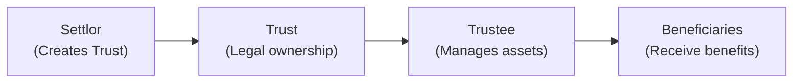

## 17.1 Setting Up a Trust

So, let's dive right in. I remember the first time someone said, “Hey, you should consider setting up a trust.” My initial reaction was a mix of fascination (“Wow, that's sophisticated!”) and total anxiety (“Uh, I have no idea what that even means!”). Honestly, a lot of people find trusts intimidating. But in practice, trusts can be profoundly useful for estate planning, tax minimization, and even asset protection. Let’s explore how they work in Canada, what you need to set one up, and why they might just be the tool your clients (or you) have been looking for.  

### Understanding the Essential Elements of a Trust

A trust might seem mystical, but it’s really just a legal relationship among three key players:  
• A settlor (the person placing assets into the trust).  
• A trustee (the person or corporation that manages those assets on behalf of someone else).  
• One or more beneficiaries (the people or entities that benefit from those assets).  

And, um, there’s a big difference between a trust and simply giving someone a gift: once assets are in the trust, they’re no longer the settlor’s property. The trustee is in charge of administering those assets strictly in the best interests of the beneficiaries.  

In Canada, a trust must have four main ingredients:  
• Clear intent. The settlor must honestly want to create a trust (no “Oops, I guess I accidentally made a trust!”).  
• Identifiable trust property. You can’t have a trust without something in it, like cash, real estate, shares, or other assets.  
• A named trustee (or trustees). The trustee is specifically responsible for managing the trust property.  
• Beneficiaries. We gotta know who’s supposed to benefit—these individuals (or even charities) need to be clearly identified.  

### Distinguishing Between Inter Vivos and Testamentary Trusts

There are two broad categories of trusts you’ll typically hear about:  
• Inter vivos trusts, sometimes called living trusts. They’re created while the settlor is still alive.  
• Testamentary trusts, which only spring into being after the settlor passes away—generally through the instructions in a will.

For inter vivos trusts, you might run into:  
• Spousal trusts  
• Joint partner trusts  
• Alter ego trusts  
• Family trusts  

But testamentary trusts? Those are often used to distribute an estate according to the deceased’s wishes and can also allow for tax planning or protection for minors and dependants.  

### The Trust Documentation

When setting up a trust, the main legal document is often known as a trust deed or declaration of trust. Think of it like the blueprint for the trust—it spells out who the players are (settlor, trustee, beneficiaries), the trust’s purpose, and how it should be administered. It also sets out what the trustee can and can’t do, such as how the trustee can invest the assets, when distributions can be made to beneficiaries, or whether they have discretion in distributing funds.  

Trust documentation usually covers:  
• Procedures for adding or removing trustees.  
• Distribution schedules or triggers (e.g., distributing assets after a beneficiary turns 21).  
• Any instructions about how beneficiaries should receive assets (e.g., monthly income, lump-sum payments, or some combination).  

### Trustee Responsibilities and Fiduciary Duties

Being a trustee sounds like a lot of power, right? It is, and that power comes with a very strict fiduciary duty. Trustees owe a duty of loyalty and care to the beneficiaries. They must manage trust assets in accordance with both the trust deed and the law. They have to stay objective and act with holistic integrity, never mixing trust assets with their own.  

If you’ve ever been asked to be a trustee, you know it can be a serious job:  
• Keeping detailed records of all transactions.  
• Filing trust income tax returns (trusts in Canada are generally taxed at the top personal marginal rate unless they qualify for certain exceptions).  
• Being impartial—trustees shouldn’t favor one beneficiary over others unless the trust deed specifically allows them to do so.  

### Legal and Tax Considerations

Each Canadian province has its own legislation that governs how trusts must be managed. In Ontario, for instance, the Trustee Act outlines a trustee’s powers and responsibilities, as well as investment standards. The Alberta Trustee Act does something very similar but every province will have its own nuances.  

Federally, the Income Tax Act (Canada) also has a huge role. Trusts, at least in the general sense, are treated as separate taxable entities. That means the trust must file a tax return each year, declare its income, and pay tax at the applicable rates. However, if the trust distributes that income to beneficiaries, the beneficiaries might pay the tax (depending on how the trust deed is structured).  

In short, if the settlor is looking to maintain some control while still achieving certain tax or estate planning goals, it’s usually a good idea to grab a lawyer or specialized tax professional who knows Canadian trust law inside out.  

Here’s a sample formula (in KaTeX) illustrating a simplified approach to trust taxation when the trust retains income:


\text{Tax Payable}_{\text{Trust}} = ( \text{Taxable Income}_{\text{Trust}} - \text{Deductions} ) \times \text{Marginal Tax Rate}


Of course, the real calculation can get more complex once you factor in capital gains, dividends, or distributed income.  

### Common Uses of Trusts

Trusts are flexible and used for all sorts of reasons. Some big ones include:  
• Controlling and providing for beneficiaries who can’t manage funds themselves.  
• Minimizing probate fees and other estate costs in certain provinces.  
• Protecting assets from creditors or ensuring they don’t get lost in the event of a family breakup or business lawsuit.  
• Reducing taxes by splitting income among family members (where permitted by law).  

And it’s not only about the wealthy. Sometimes a modest trust can be a great help—like when you have a family cottage and you want to ensure it stays in the family without all the assets going through probate or being subjected to potential claims.  

### Setting Up a Trust: Step-by-Step

How exactly do you create a trust? Well, let’s walk through the steps typically seen with an inter vivos trust:  

• Create the trust deed. A lawyer often drafts or reviews it, capturing the settlor’s intent and laying out all the rules.  
• Transfer the assets. The settlor legally transfers assets (like cash, shares, or property) to the trustee. That’s a critical moment—because the settlor is giving up legal ownership of those items.  
• Document the transaction. Make sure there’s an official record of the date, the value of assets transferred, and any relevant forms you file with the Canada Revenue Agency (CRA).  
• Trustee acceptance. The trustee affirms they understand and accept their responsibilities, which is often documented in writing.  
• Administration. The trustee starts managing the trust property: investing the assets prudently, paying any beneficiaries if required, and making sure to adhere to the trust deed and relevant laws.  

### Diagram: The Flow of Setting Up a Trust

Below is a simple Mermaid diagram illustrating the overall structure of a trust and how assets flow from settlor to trustee to beneficiaries:

In this diagram, the Settlor establishes the Trust, and the Trustee subsequently manages trust assets on behalf of the Beneficiaries.  

### Pitfalls, Best Practices, and Practical Examples

• Watch out for control issues. A common pitfall is the settlor trying to retain too much control over the trust while wanting the trust’s tax and legal benefits. The CRA and courts may determine the trust is a “sham” if the settlor effectively holds the real power.  
• Keep up with compliance. Trustees need to meet annual filing requirements (T3 returns in Canada), maintain meticulous records, and never co-mingle personal and trust funds.  
• Communicate with beneficiaries. It might be tricky if you have one child who’s more financially savvy than another, but transparency usually helps prevent conflicts.  

I still remember a friend who told me about their father setting up a small family trust that funded grandchildren’s education. The father was initially worried that the grandchildren might blow the money on a fancy car, but the trust deed gave the trustee the power to release funds only for education expenses. This offered peace of mind.  

Another scenario: a woman with significant rental properties placed them in a trust to reduce the tax burden on her estate. After her passing, the trustee carried on managing those properties—rents got collected, repairs were paid, and the net income was distributed to each child proportionally. The children didn’t have to worry about probate or estate delays, because the trust already had ownership.  

### Legal and Regulatory Framework in 2025: CIRO and CIPF

Things have changed a bit in the Canadian regulatory landscape for investment dealers and mutual fund dealers. CIRO (Canadian Investment Regulatory Organization) is now the single self-regulatory organization in Canada, overseeing investment dealers, mutual fund dealers, and market integrity across equity and debt marketplaces. References to MFDA or IIROC these days are strictly historical—they merged into CIRO on January 1, 2023, with the official name taking effect on June 1, 2023.  

• If you’re a financial advisor registered with CIRO, you might have certain obligations regarding how you can advise on or administer trusts.  
• CIPF remains Canada’s sole investor protection fund. If a member firm becomes insolvent, CIPF helps protect client assets.  

### Additional Resources

There are plenty of resources to explore if you (or your clients) want to dive deeper into setting up and managing a trust:  
• Canada Revenue Agency (CRA): https://www.canada.ca/en/revenue-agency.html (for rules on trust taxation, T3 returns, etc.)  
• Provincial Legislation: Look up the Trustee Act in your particular province (e.g., Ontario Trustee Act, Alberta Trustee Act).  
• Estate Planning/Wealth Management Tools: Consider open-source software like EstateExec (although it might require adjustments for Canadian specifics) or specialized professional estate-software recommended by Canadian lawyers.  
• CIRO Resources: https://www.ciro.ca (for regulatory updates and guidelines for advisors).  
• Hull & Hull LLP’s “Power of Attorney and Trusts in Canada” article series.  
• Canadian Bar Association articles on trust law and estate planning.  

Sometimes it helps to talk to a lawyer who’s well-versed in trusts and estates, especially if you have complex family or financial circumstances.  

### Conclusion

Anyway, I hope all these details help make trusts feel less daunting. Whether it’s providing for children, managing assets when you’re gone, minimizing probate fees, or ensuring your business can carry on seamlessly, a well-crafted trust can be a powerful component of any financial plan. Just remember to draft your documentation carefully, choose a reliable trustee, and keep provincial and federal laws in mind. Above all, never hesitate to seek professional advice—especially if you’re juggling major assets or complicated family dynamics.  

Trusts might be ancient tools (they date back to the era of knights going off on Crusades, apparently), but they remain extremely relevant in modern Canadian financial life. When used correctly, they deliver a structured, secure way to manage and pass along wealth for generations.  

---

## Test Your Knowledge: Setting Up a Trust in Canada



### Which of the following is not an essential element of a valid trust in Canada?

- [ ] Clear intent by the settlor to create a trust  
- [ ] Identifiable trust property or assets  
- [x] Beneficiaries who manage the trust assets themselves  
- [ ] Named trustee(s)

> **Explanation:** A valid trust requires a settlor with the genuine intent to create the trust, identifiable trust property, a named trustee, and beneficiaries. It is not required that beneficiaries manage the trust assets themselves—this is actually the trustee’s job.

### When does a testamentary trust generally come into effect?

- [ ] When the settlor decides to transfer assets during their lifetime  
- [ ] When the trustee first accepts the trust property  
- [ ] On the date the trust deed is signed  
- [x] After the death of the settlor, typically through a will

> **Explanation:** A testamentary trust is created by the settlor’s will and only takes effect after the settlor's death.

### Which of the following statements best describes the trustee’s main responsibility?

- [ ] To act in their own best financial interest while managing the trust property  
- [x] To act for the benefit of the beneficiaries, adhering to the terms of the trust  
- [ ] To ensure the settlor regains control of the assets whenever needed  
- [ ] To benefit creditors of the trustee

> **Explanation:** A trustee’s primary responsibility is fiduciary in nature—they must manage the trust property in accordance with the trust document and in the best interests of the beneficiaries.

### In Canada, who generally pays taxes on the trust’s income if all income is distributed to beneficiaries?

- [ ] The trustee, personally  
- [x] The beneficiaries, based on their personal tax rates  
- [ ] The settlor, based on the trust deed  
- [ ] The trust, taxed at a flat rate of 25%

> **Explanation:** When a trust distributes its income to beneficiaries, the beneficiaries generally report that income on their personal tax returns and pay tax at their respective rates, rather than the trust paying it.

### What is one common reason to set up an inter vivos trust?

- [x] To manage and distribute assets during the settlor’s lifetime and possibly reduce probate fees  
- [ ] To transfer ownership to the trustee immediately upon the settlor’s death  
- [ ] Strictly to avoid any tax reporting to the CRA  
- [ ] So the beneficiaries can claim ownership of the trustee’s personal assets

> **Explanation:** An inter vivos (living) trust is established during the settlor’s lifetime and can help reduce probate fees in certain provinces, among other benefits.

### Which Canadian federal statute primarily governs taxation of trusts?

- [ ] The Bankruptcy and Insolvency Act  
- [ ] The Trustee Act  
- [x] The Income Tax Act (Canada)  
- [ ] The Criminal Code

> **Explanation:** The Income Tax Act (Canada) is the federal legislation setting out the rules for how trusts are taxed in Canada.

### Which of the following is a key difference between inter vivos trusts and testamentary trusts?

- [x] Inter vivos trusts are established while the settlor is alive; testamentary trusts are created after death  
- [ ] Testamentary trusts always pay no taxes  
- [x] Inter vivos trusts have the same settlor and trustee by definition  
- [ ] Testamentary trusts let the trustee use assets for personal gain

> **Explanation:** Inter vivos trusts are created while the settlor is alive. Testamentary trusts come into being after the settlor’s death, usually via the will.

### Which of the following best describes a fiduciary duty?

- [ ] A contract allowing the trustee to acquire assets in any way necessary  
- [x] A duty to act with loyalty, honesty, and good faith in the beneficiaries’ best interests  
- [ ] The trustee’s right to keep any profits resulting from trust transactions  
- [ ] An obligation for beneficiaries to follow the trustee’s personal instructions

> **Explanation:** A fiduciary duty requires the trustee to act in the best interests of the beneficiaries, with honesty, loyalty, and good faith at all times.

### What is the typical outcome if the settlor tries to retain full control over the trust assets while still calling it a trust for tax advantages?

- [ ] The trustee can replace the settlor automatically  
- [ ] The beneficiaries gain immediate exclusive control  
- [ ] It becomes a criminal offense  
- [x] The trust may be considered a “sham,” losing its intended legal status

> **Explanation:** If the settlor hasn’t genuinely transferred control of the trust assets to the trustee, the courts or the CRA may treat the arrangement as a sham, stripping away the intended trust benefits.

### True or False: CIRO is the current self-regulatory organization overseeing investment dealers and mutual fund dealers in Canada, replacing the roles of IIROC and MFDA.

- [x] True
- [ ] False

> **Explanation:** As of 2025, the Canadian Investment Regulatory Organization (CIRO) is the national self-regulatory body that superseded the former IIROC and MFDA organizations.


