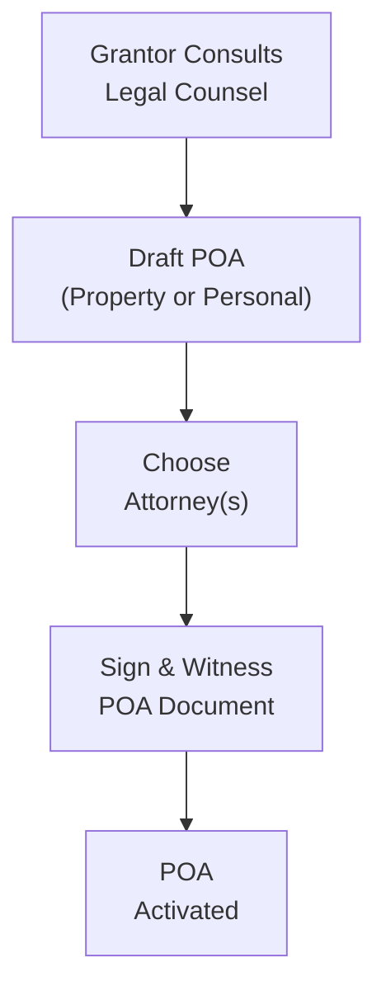

## 17.3 Power of Attorney

Power of Attorney (POA) is a vital instrument in personal financial planning, and it connects to multiple areas of wealth management, estate planning, and personal well-being. In this section, we’ll explore how POA ensures decisions can be made if an individual is unable—intellectually or physically—to handle their own affairs. It is important for everyone, not just high-net-worth individuals. And trust me, the moment I realized my elderly grandmother had to rely on me to handle her day-to-day finances, I knew just how significant this document could be. It ensures that if you can’t do something personally—perhaps because of health reasons or travel—you won’t lose control over your finances or personal care matters.

---
  
### Understanding the Basics

A Power of Attorney is a legal document in which one person (often called the “grantor” or “donor”) gives another individual (the “attorney”) the authority to make decisions on their behalf. Contrary to popular misconception, the attorney here does not have to be a lawyer. Instead, it can be someone you trust—like a close family member or a reliable friend—who will act in your best interests.

In Canada, POAs are governed by provincial or territorial legislation. This means the *rules* in Ontario might look slightly different than those in Alberta or Quebec. Nonetheless, the overarching philosophy is the same: you empower someone to take care of your financial or personal needs if you can’t do so yourself.

Below are some key terms you’ll encounter:

• Grantor (or donor): The person who creates (and grants) the power of attorney.  
• Attorney: The person authorized to act on behalf of the grantor.  
• Incapacity: The state in which a person is not able to make financial, legal, or personal-care decisions. This could be determined by a court or by a physician, depending on the province.  
• Enduring (Continuing) POA: A POA that remains valid even after the grantor becomes mentally incapacitated.  
• Non-continuing POA: A POA that ceases to be valid if the grantor is no longer mentally capable.

A well-drafted POA ensures clarity of roles and responsibilities and can help minimize confusion or misappropriation of funds.

---

### Types of Power of Attorney

In Canada, there are two primary categories of POA:

1. Power of Attorney for Property (Financial and Legal Matters)  
2. Power of Attorney for Personal Care (Health and Personal Decisions)

Both categories serve distinct purposes. Understanding them is crucial to ensure you use the right type of documentation for your personal situation.

#### Power of Attorney for Property

The POA for Property typically grants authority over financial, legal, and property-related matters. This includes managing bank accounts, paying bills, overseeing investments, and sometimes even selling property. Depending on the limitations set by the grantor, a POA for Property can be a general POA with broad authority or a specific (limited) POA for a narrowly defined transaction (e.g., signing real estate papers while the grantor is abroad).

Individuals often opt for an enduring or continuing POA for Property so that the arrangement remains legally valid if they become mentally incapable. If you don’t have such a POA in place, and you become incapacitated, you might face complicated and expensive guardianship processes in court, or your loved ones may need the public guardian to assume control.

#### Power of Attorney for Personal Care

A Power of Attorney for Personal Care generally covers healthcare and personal decisions. If you’re incapacitated, the person you designate would handle matters such as hospitalization, medical treatment consents, residence decisions (like moving you to a long-term care facility), and day-to-day care. In some provinces, this is also referred to as a “Personal Directive” or “Personal Care Directive.” Make sure to consult your province’s specific legislation—Ontario’s Substitute Decisions Act, for instance, outlines how attorneys for personal care must make decisions in the best interests of the grantor, taking into account the grantor’s prior instructions, beliefs, and values.

---

### Continuing vs. Non-continuing POA

A fundamental aspect is determining whether the POA should continue after mental incapacity:

• A continuing or enduring POA stays in effect if you lose the ability to make decisions.  
• A non-continuing POA stops once you become mentally incapable.

In most estate and financial planning contexts, continuing or enduring POAs are strongly recommended. Life can be unpredictable, and if someone is in a car accident or falls ill, the continuing POA ensures a trusted individual can keep paying the mortgage, manage investments, or handle medical needs, without interruption.

---

### The Scope of Authority

When you draft a POA, you can grant broad authority or limit it to specific tasks. Think of these scenarios:

• Limited/Special POA: My friend once drafted a special POA letting me sign the paperwork for the sale of their cottage while they were backpacking in Asia. I had no authority to touch their bank accounts—they simply made things easier for that one real estate transaction.  
• General POA: A broad authorization effectively lets the attorney handle most or all financial, business, and legal decisions on your behalf. However, the grantor often includes conditions or instructions in the document, like “do not sell my house unless it is strictly necessary to pay for a long-term care facility.”

---

### Drafting Considerations

A poorly drafted POA might create confusion, abuse of power, or unintended financial consequences. To avoid these pitfalls:

• Identify a trustworthy attorney: If your attorney mismanages your property or personal care, this can lead to serious financial or personal harm.  
• Clearly define responsibilities: Some POAs have additional clauses outlining the responsibilities, such as the duty to keep detailed records or the duty to consult certain family members on major decisions.  
• Stipulate if it’s continuing: An explicit statement is usually required to specify that the POA should remain valid after incapacity.  
• Address compensation: Will the attorney get paid? If so, how much and who decides?  
• Plan for successors: If your first choice attorney is unable to act, do you have a second or third choice?

Every province or territory has its own requirements for witnessing and signing. For instance, in several jurisdictions, the attorney cannot also be a witness. Check your local legislation or consult legal counsel to avoid having your POA deemed invalid.

---

### The Canadian Legal Landscape

Since each province or territory has specific legislation, it’s essential to consult the rules in your jurisdiction:

• Ontario’s Substitute Decisions Act: Governs powers of attorney for property and personal care.  
• Quebec’s Civil Code: Addresses incapacity mandates (Mandat en prévision de l’inaptitude).  
• Alberta’s Personal Directives Act: Specifically covers personal directives, which act similarly to a power of attorney for personal care.  
• British Columbia’s Power of Attorney Act and Representation Agreement Act: Distinguish between legal, financial, personal, and healthcare decisions.  
• Other provinces and territories have equivalent statutes.

For detailed directions and sample forms, you can consult the Public Guardian and Trustee (PGT) in your province. The PGT offices often provide free guides on how to draft POAs.

For broader national context, the Government of Canada’s Department of Justice (https://www.justice.gc.ca) offers general information on laws surrounding incapacity and substitute decision-making. Note, however, that these resources are not province-specific.

---

### POA and Financial Planning

At first glance, a POA might seem purely a legal matter. In reality, it’s a cornerstone of comprehensive financial planning. As covered in Chapter 2 (Net Worth and Cash Management Planning), having someone to manage day-to-day financial obligations if you’re incapacitated prevents you from defaulting on loans, missing tax deadlines, or forgetting essential household expenses.

In Chapter 6 (Tax Planning Strategies), we saw how timely payment of taxes is critical. With a proper POA in place, your attorney can fulfill these tasks on your behalf, ensuring you remain compliant with the Canada Revenue Agency (CRA) rules. It’s also relevant in Chapter 8 (Retirement Planning Process), as you might need someone to transition your Registered Retirement Savings Plans (RRSPs) or handle government benefits under certain circumstances, especially if you become unable to handle these tasks independently.

---

### The Role of Trusts and Powers of Attorney

Chapter 17 delves into trusts (Sections 17.1 and 17.2) and PoAs. You might be wondering: “Should I use a trust or a Power of Attorney, or both?” While trusts are legal arrangements establishing the ownership of property by a trustee for the benefit of a beneficiary, a POA is about designating someone to *act* on your behalf. These two can complement each other in an estate plan. For instance, you might set up a trust for long-term asset management, while your attorney manages day-to-day expenses. Indeed, layering these tools can provide robust protection against many uncertainties of life.

---

### Duties and Responsibilities of the Attorney

Legally and ethically, an attorney must act in the best interests of the grantor. Let’s clarify some best practices to ensure the attorney is trustworthy and their powers are used responsibly:

• Keep Records: If you’re managing someone else’s finances, keep detailed notes, statements, and receipts.  
• Separate Assets: Avoid mixing your personal assets with the grantor’s. Consolidating them might create confusion or accusations of misappropriation.  
• Follow Instructions: If the grantor has specific instructions, you must follow them.  
• Limited Authority: Recognize that POA authority does not let you change the grantor’s will or beneficiary designations.  
• Consultation: Where feasible, attorneys should consult family members, medical professionals, or financial advisors to make balanced decisions.

---

### Practical Example: The Case of Mr. Dunbar

Let’s say Mr. Dunbar is a retired teacher in Ontario. He sets up a continuing Power of Attorney for Property naming his daughter as the attorney. In the POA document, Mr. Dunbar writes:

• The POA is continuing and takes effect immediately, but his daughter promises not to use this authority unless he is out of town or ill.  
• She can access his bank accounts, pay any recurring bills, manage his investment portfolio, and dispose of real estate if needed to fund his long-term care.  
• She must consult Mr. Dunbar’s financial advisor before making any major investment changes. 

Now, if Mr. Dunbar suffers a stroke and can’t communicate, his daughter seamlessly continues to pay for his home care, medical supplies, and living expenses. She can also, in consultation with his advisor, decide whether it makes sense to liquidate certain assets.

---

### Common Pitfalls and How to Avoid Them

• Inadequate Clarity: A vague POA might lead to disputes about the extent of the attorney’s powers.  
• Poor Choice of Attorney: Grantors might choose someone they trust personally, but who lacks the necessary financial know-how.  
• Failure to Update: Circumstances can change. If you finalize a POA in your 40s but don’t update it until your 80s, you might forget to reflect changes in marital status, new children, etc.  
• Overlooking Personal Care: Some folks only get a POA for Property but forget personal care proxies.  
• Lack of Communication: Family members may claim the attorney is abusing power simply because they do not understand the attorney’s duties. Encouraging open communication can prevent misunderstandings.  

---

### Visualizing the POA Process

Below is a simple Mermaid diagram showing the typical steps in setting up and using a POA:

Explanation of the diagram:

• Step A: The grantor (you) might consult with a lawyer or provincial resource guide.  
• Step B: Drafting the POA, ensuring it meets provincial requirements and clarifies whether it’s continuing or non-continuing.  
• Step C: Choosing the right attorney(s) who align with your interests, values, and competence requirements.  
• Step D: Proper witnesses sign the document. Different provinces may require specific witness criteria.  
• Step E: The POA is officially activated under the conditions you’ve specified. You remain in charge unless you become incapacitated or you choose to let your attorney act earlier.

---

### Best Practices for Effective POA Management

• Communicate: Let your financial institutions (bank, brokerage, insurance company) know you have a POA. Provide them with a relevant copy.  
• Revisit Regularly: Circumstances evolve. If you switch provinces, you might need to revise your document to comply with new local laws.  
• Plan for Disputes: Incorporate a conflict resolution clause or name multiple attorneys who have to consult with each other.  
• Consider Professional Advice: Financial planners, accountants, and lawyers can help shape well-rounded instructions.  

---

### Relationship to Other Regulatory Bodies

If you have an investment account with a registrant of the Canadian Investment Regulatory Organization (CIRO), it’s essential that they have a copy of your POA if you want your attorney to trade on your behalf. CIRO is the current self-regulatory organization that replaced the former IIROC and MFDA on January 1, 2023, and it oversees both investment and mutual fund dealers. Make sure the firm is updated with the relevant documents so your attorney can manage your trading accounts should you become incapacitated.

It’s also relevant to note that in situations where a firm becomes insolvent, the Canadian Investor Protection Fund (CIPF)—now Canada’s sole investor protection fund—protects client assets (up to certain limits). If the attorney is in charge when such a scenario occurs, they will interface with CIPF and CIRO on behalf of the grantor.

---

### Linking POA to Estate Planning

So, maybe you’re thinking, “I’ve already got a will—do I really need a power of attorney?” Remember, a will becomes effective only upon your death. A POA is about ensuring a trusted individual can step in *while you’re still alive*, particularly if you become temporarily or permanently incapable. That’s a big difference. Ideally, you have a will, a power of attorney for property, and a power of attorney for personal care. Combined, these documents safeguard your estate and well-being both before and after death.

---

### Considerations for Cross-Border Situations

If you have property in the United States, or if you are traveling extensively abroad, you may need separate POAs validated in those jurisdictions. Or perhaps you have financial accounts in multiple countries. Each country has its own rules. In some cases, you might need an “apostille” or notarization recognized internationally. If you fall into that category, consult specialized legal assistance to ensure your POA is recognized everywhere you do business.

---

### Case Study: Handling Incapacity in a Business Context

Imagine you’re a small business owner in Ontario who also holds real estate in British Columbia. You have employees, pay corporate taxes, and juggle multiple bank accounts. You also have a spouse in Vancouver who helps out occasionally with administrative tasks. When drafting your POA, you may wish to:

• Create a broad POA for Property that includes the authority to manage business operations.  
• Ensure the POA meets Ontario requirements and consider a separate one if you have critical property or personal matters in BC.  
• Outline whether your attorney for property can sign cheques for payroll, negotiate with corporate creditors, or sell business assets so the business can continue operating if you are in a medically induced coma or otherwise incapacitated.  

These considerations showcase the interplay between personal estate planning and the realities of running a business—topics explored in Chapter 15 (Financial Planning for Small Business).

---

### References and Additional Resources

• Provincial Legislation (e.g., Ontario’s Substitute Decisions Act, Quebec’s Civil Code, Alberta’s Personal Directives Act).  
• Public Guardian and Trustee Offices: Look up your province’s specific resources and forms.  
• Government of Canada’s Justice Department: https://www.justice.gc.ca  
• Public Legal Education and Information Organizations (PLEI) in your province often provide free guides.  
• “Power of Attorney and Incapacity Planning in Canada” by Joanne Taylor, published by Nidus Personal Planning Resource Centre.

---

### Final Thoughts

Perhaps you’ve never really paid attention to the idea of a POA—many of us think we’re immortal, or that “someone else will handle it if something goes wrong.” Honestly, it might feel like just another legal form, but it’s so much more. A POA, especially one that’s enduring, acts like a safety net, ensuring you maintain control over your finances and personal care through the trusted hands of an attorney, even if you can’t personally make those calls. It’s a key building block in a robust financial plan, complementing your retirement strategies, insurance coverages, and overall estate planning.

As you move forward in your financial planning journey (and possibly explore other areas like trust arrangements in Section 17.1 or estate procedures in Section 18), keep the concept of a POA on your radar. It’s one of those documents we hope to never use but are grateful to have in place if life takes unexpected turns.

---

## Test Your Knowledge: Power of Attorney Essentials Quiz



### Which of the following best describes a Power of Attorney? 
- [ ] A document that only lawyers can create to shield holdings from taxes
- [x] A legal appointment allowing one person to act on behalf of another
- [ ] An insurance policy covering personal care costs
- [ ] A mandatory provincial savings plan for medical expenses

> **Explanation:** A POA is a legal instrument granting decision-making authority over property or personal care. It does not inherently function as a tax shield or insurance policy.  

### Which of the following is a key distinction in an enduring (or continuing) Power of Attorney? 
- [ ] It automatically revokes a person’s will
- [ ] It only applies if the grantor is out of the country
- [x] It remains valid even after the grantor becomes mentally incapacitated
- [ ] It requires court approval each time it is used

> **Explanation:** An enduring or continuing POA specifically remains in effect once the grantor is deemed mentally incapable.  

### In Canada, the legislation governing POAs is typically found:  
- [x] At the provincial or territorial level
- [ ] Universally in the federal Income Tax Act
- [ ] Under the direct supervision of CIRO
- [ ] Only in international treaties

> **Explanation:** POAs in Canada are regulated by provincial or territorial jurisdictions, such as Ontario’s Substitute Decisions Act or Alberta’s Personal Directives Act.  

### Which of the following describes the main function of a POA for Personal Care?  
- [ ] Overseeing business contracts and leases
- [ ] Filing annual tax returns
- [ ] Managing real estate and investments
- [x] Making health care and personal decisions on behalf of the grantor

> **Explanation:** A POA for Personal Care deals with health and personal matters (e.g., medical consents, living arrangements), not property management.  

### What is a common requirement for a valid POA in many Canadian provinces?  
- [ ] The document must be published in a local newspaper
- [x] Two eligible witnesses must sign the document
- [ ] A seal from the Canada Revenue Agency
- [x] The attorney must be a practicing lawyer

> **Explanation:** Most provinces require the POA to be witnessed (often by one or two eligible witnesses) to make the document legally binding. However, it is not mandatory for the attorney to be a lawyer in Canada.  

### Why is transparency important when acting as an attorney under a POA for Property?  
- [x] It ensures the attorney provides detailed financial records and prevents suspicions of financial abuse
- [ ] It is required only to satisfy the Canada Revenue Agency regulations
- [ ] It guarantees that the attorney cannot make any investment decisions
- [ ] It protects the attorney from future health care decisions

> **Explanation:** Attorneys must keep accurate financial records and maintain transparency to avoid potential allegations of mismanagement or abuse of authority.  

### If the grantor moves from Ontario to another province, how should they proceed with their existing POA documents?  
- [x] Consult the new province’s laws to ensure the POA is still valid or execute a new POA if necessary
- [ ] Do nothing; the POA automatically becomes valid internationally
- [ ] Revoke the POA and rely on the provincial Public Guardian
- [ ] The POA applies first, then the original will

> **Explanation:** Because POA legislation is provincial, a grantor moving to a new province should consult local regulations to confirm validity or create updated documents.  

### Which of the following statements about choosing an attorney is correct?  
- [x] The attorney should be someone trustworthy, capable, and willing to manage the grantor’s affairs
- [ ] The attorney must be a legal professional
- [ ] The attorney has no obligation to consult healthcare professionals
- [ ] An attorney under a POA for Property can override the grantor’s will

> **Explanation:** You generally choose a trustworthy, capable person as your attorney. Being a lawyer is not a requirement, and attorneys do not override an existing will.  

### Can you grant authority through a POA to alter your will?  
- [ ] Yes, but only if the attorney agrees
- [ ] Yes, if the grantor is incapacitated at the time
- [ ] Yes, if a lawyer signs off on it
- [x] No, an attorney cannot alter or revoke the grantor’s will

> **Explanation:** A POA for Property or Personal Care does not extend to making or modifying the grantor’s will. That power is strictly the grantor’s (while capable).  

### A Power of Attorney remains in effect after the grantor’s death.  
- [ ] True
- [x] False

> **Explanation:** A POA ends upon the grantor’s death. At that point, the will (or intestacy rules, if no will exists) governs the distribution of the estate.  


