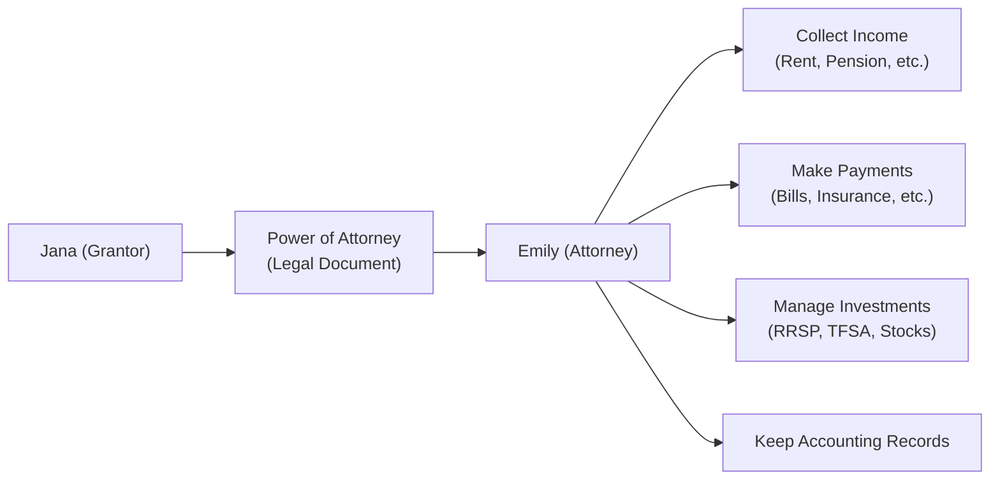

## 17.4 Power of Attorney for Property

Let’s face it: talking about a Power of Attorney for Property isn’t exactly something people do at the dinner table. But oh my, it is so important for effective financial planning here in Canada! If you or your clients have ever worried that an unexpected illness or disability might derail the handling of bills, investments, or real estate transactions—then consider taking a close look at how this legal tool can protect one’s interests. In this section, we’ll explore everything you need to know about a Power of Attorney for Property: how it works, the pros and cons of using one, how to set it up, and the best ways to avoid pitfalls. We’ll also include some personal insights, real-life anecdotes, and practical examples to keep it engaging.

Before we dive in, just a quick note that the laws around Powers of Attorney (POAs) and property matters can differ depending on your province or territory. And of course, while we aim to provide comprehensive information here, this isn’t legal advice—always consult with a qualified legal professional for your unique situation.

---

### Understanding the Power of Attorney for Property

A Power of Attorney for Property is a legal document that authorizes an individual (often called the attorney or agent) to manage someone else’s financial and property matters. An “attorney” in this context does not necessarily mean a lawyer—rather, it’s any trusted person the grantor (the one who gives the power) chooses. Depending on the scope, this might involve:

• Paying bills and everyday expenses  
• Overseeing investments (like mutual funds, stocks, or bonds)  
• Buying or selling real estate  
• Collecting rent from investment properties  
• Handling tax filings  
• Managing business transactions on behalf of the grantor  

The name might vary slightly by province—sometimes it’s called a “Continuing Power of Attorney for Property,” “Enduring Power of Attorney,” or something else. The key message is that it’s designed to handle finances.

#### A Personal Glimpse
Let’s say you have an elderly aunt who’s starting to find it overwhelming to keep track of her monthly bills, investment statements, and property taxes. One day, she confides in you that she feels anxious: “I’m worried that I might forget to pay something important.” This is a prime example of where a Power of Attorney for Property might come in handy. By naming you as her attorney, she has someone she trusts and who cares about her finances. You, in turn, have the legal authority to step in and handle the day-to-day financial tasks and property dealings on her behalf.  

---

### Limited vs. General Power of Attorney for Property

The scope of authority granted under a Power of Attorney can be as narrow or as wide as the grantor wishes.

- **Limited (Specific) POA**  
  If the attorney’s authority is restricted to certain tasks or assets, you’re dealing with a limited POA. For instance, the grantor might allow the attorney to manage a single investment account or sign on a specific real estate transaction—but nothing else. People sometimes use this arrangement for short-term needs, like if they’ll be out of the country when a real estate closing needs to happen.

- **General POA**  
  A general POA is broader. It typically grants the attorney the power to handle nearly all financial matters on the grantor’s behalf: paying the mortgage, filing taxes, selling assets, you name it. This is especially useful if the grantor wants comprehensive help—or if they anticipate losing the ability to manage day-to-day finances in the foreseeable future.

**Pro Tip:** Always spell out the scope of authority in the document as clearly as possible. Clarity up front can prevent future misunderstandings or disputes.

---

### Enduring (Continuing) Power of Attorney for Property

In Canada, if you want a POA to remain in effect even after the grantor loses mental capacity, you need an enduring (or continuing) POA. This is an important distinction—some POAs automatically become void if the grantor can’t make decisions for themselves. For folks who expect a long-term need (perhaps due to progressive illness), an enduring POA is often a crucial component of the estate and financial planning process.

#### Durability Matters
Why does “enduring” or “continuing” status matter? Let’s say the grantor develops a cognitive impairment. With an enduring POA, the attorney can seamlessly continue managing the grantor’s accounts, paying for care, and ensuring financial stability despite the grantor’s diminished capacity. Without that clause, the attorney’s authority might be automatically terminated when it’s actually needed most, leading to all kinds of bureaucratic headaches—like needing to pursue a court-appointed guardianship.

---

### Selecting the Right Attorney for Property

Choosing who will handle your money or your loved one’s money is, frankly, a big deal. This person might pay bills, distribute allowances to family members, handle rent payments from tenants, or even juggle debts. So, the attorney’s integrity and competence are paramount.

Key qualities to consider:
• **Trustworthiness:** The attorney must keep accurate records, avoid conflicts of interest, and always act in the grantor’s best interests.   
• **Financial Experience:** This can mean professional expertise (e.g., an accountant or financial planner) or at least some solid personal finance skills.  
• **Willingness and Availability:** They should be approachable and willing to communicate regularly.  

#### Balancing Family & Professionals
Many Canadians instinctively choose a close family member—like a spouse or adult child—to act as attorney. But sometimes, it’s wise to appoint someone with professional experience, such as a trust company, a lawyer, or an accountant, especially if significant assets or complex business interests are involved. In some families, combining both might be ideal: appoint the family member who knows the personal situation plus a professional who can navigate advanced financial tasks.

---

### Record Keeping and Avoiding Conflicts

The person who’s granted authority under a Power of Attorney for Property has a fiduciary responsibility. This includes:

1. **Maintaining Separate Accounts:** The attorney shouldn’t co-mingle the grantor’s funds with their own (e.g., no depositing the grantor’s money in the attorney’s personal chequing account).  
2. **Keeping Detailed Records:** It’s wise to keep a log of every transaction, along with receipts and account statements.  
3. **Acting in the Grantor’s Best Interests:** All decisions must align with what the grantor would’ve wanted, or at least what’s objectively beneficial for them.  
4. **Checking for Conflicts of Interest:** If the attorney stands to benefit personally from a transaction, they must be extremely careful. In many provinces, there are rules requiring disclosure or even prohibiting the action if it’s strictly self-serving.

#### A Quick Example
Imagine you’re named as attorney for your grandmother’s finances. Then, you think, “Maybe I’ll buy her house at a discount. After all, she’s not using it, and I’m handling everything anyway.” This scenario screams conflict of interest, as you’re on both sides of the transaction. Avoiding such entanglements or at least seeking independent legal advice is crucial to protect both you and the grantor.

---

### Practical Tools and Software

Handling finances under a POA often means juggling multiple bank and brokerage accounts, monthly bills, tax documents, insurance policies, etc. That’s a lot! Fortunately, there are software solutions and fintech tools:

- **Accounting Platforms:** Programs like QuickBooks or Wave can track transactions in separate accounts, generate financial statements, and ensure everything is well-documented.  
- **Estate & POA Management Software:** Some specialized solutions allow attorneys to track assets, liabilities, deadlines (e.g., tax due dates), share documents with co-attorneys, and create an audit trail of decisions.  

If an attorney is dealing with a large or complex estate, these tools can be lifesavers. They help minimize errors, reduce stress, and create transparency—important if any family disputes arise.  

---

### Common Pitfalls and How to Avoid Them

1. **Procrastinating the Setup**  
   Some people delay drafting a POA because, let’s be honest, dealing with mortality or incapacity isn’t a fun conversation. But failing to set up a proper POA can lead to crisis if the grantor suddenly becomes incapacitated.  
   • **Solution:** Encourage timely planning. Share real-life stories of families who faced legal struggles because they didn’t have this sorted out in time.

2. **Vague Language**  
   A partial or poorly worded POA might create confusion about the attorney’s exact powers.  
   • **Solution:** Keep the document crystal clear about which powers the attorney has and under what conditions.

3. **Lack of Regular Reviews**  
   Over time, a grantor’s life circumstances can change (e.g., new investments, a divorce, a relocation). If the POA doesn’t reflect the current reality, the attorney’s actions might not align with the grantor’s wishes.  
   • **Solution:** Periodically review and update the POA document to address changes in assets, family dynamics, or personal intentions.

4. **Ignoring Provincial Requirements**  
   Each province or territory might have slightly different legal requirements for a valid POA. Failing to meet local requirements can invalidate the document.  
   • **Solution:** Consult a legal professional in your area or refer to local government resources (e.g., from the Ontario Ministry of the Attorney General).

5. **Choosing the Wrong Attorney**  
   Some attorneys might not be up to the task, or they might cause friction with other family members.  
   • **Solution:** Vet your attorney carefully, discuss expectations, and ensure open communication between all key stakeholders.

---

### Working Through a Real-World Scenario

Let’s walk through a simplified scenario to illustrate the potential complexities:

1. **Context:** Jana is 75 years old, living independently in Toronto. She owns a condo, has RRSP and TFSA investments, and collects rent from a small commercial property.  
2. **Concerns:** Jana worries about memory lapses and wants to ensure her finances are in order if her health declines.  
3. **POA Setup:** Jana grants her daughter, Emily, a continuing Power of Attorney for Property. The document states Emily can manage “all her financial affairs,” including paying bills, renewing leases, overseeing investment allocations, and filing taxes.  
4. **Activation:** Jana decides the POA will be effective immediately, allowing Emily to help with complex tasks now while Jana is still capable. Jana can still do the day-to-day things she wants (like paying her phone bill), but Emily has the legal capacity to step in where needed.  
5. **Records:** Emily sets up an online accounting platform to automatically categorize expenses, track property tax payments, and sync with investment accounts. She consults with Jana before making significant decisions, like adjusting the asset allocation in her RRSP.  
6. **Outcome:** Over time, Jana’s memory issues worsen. Because Emily’s POA continues upon incapacity, there’s no interruption in managing Jana’s finances. Jana’s bills are paid on time, her investments remain well maintained, and the rent from the commercial property is collected without a hitch.

---

### Visualizing the Role of a Power of Attorney for Property

Below is a Mermaid diagram illustrating a simplified workflow for how an attorney (Emily) manages finances under a Power of Attorney for Property on behalf of the grantor (Jana). Notice each node is surrounded by quotes and contained in square brackets, as required.

• Jana (the grantor) creates the legal document (the POA).  
• Emily (the attorney) then follows the framework of the document to collect income, pay bills, manage investments, and keep thorough records.

---

### Best Practices for Attorneys

1. **Transparency:** If there are multiple family members involved, consider sharing periodic updates or statements. This fosters trust and reduces the risk of suspicions.  
2. **Stick to a Budget:** Understand the grantor’s income sources (e.g., CPP/QPP, GIS if applicable, private pensions) and typical expenses, then plan accordingly.  
3. **Document Everything:** Keep original receipts, bank statements, investment papers, and a log of communications regarding major decisions.  
4. **Stay Informed:** Changes in provincial laws, taxation rules, or financial regulations can affect POA management. Keep yourself updated. CIRO, Canada’s current self-regulatory organization as of 2025, oversees finance industry rules and might have relevant guidelines or resources.  
5. **Seek Professional Advice:** An attorney should consult financial advisors, accountants, or lawyers for complex issues (like dealing with large sums, business assets, or complicated estate planning concerns).

---

### Working Hand-in-Hand With Other Aspects of Financial Planning

A Power of Attorney for Property is just one piece of the puzzle—albeit an important one. Integrating it seamlessly with other elements of a client’s financial plan can ensure continuity:

- **Trusts (Chapter 17.1 & 17.2):** Sometimes a trust structure complements or replaces a POA, especially when managing large assets.  
- **Powers of Attorney for Personal Care (Chapter 17.5):** This deals with health care decisions, whereas the POA for Property handles finances.  
- **Estate Planning (Chapters 18.1–18.5):** Wills, beneficiary designations, and other documents are closely tied to POAs. Proper alignment prevents conflicts among documents.  
- **Retirement Planning (Chapters 8 & 9):** If the grantor’s retirement income (e.g., CPP/QPP, RRSP withdrawals) is part of the equation, the attorney must coordinate those cash flows.  

---

### Glossary

- **Attorney for Property:** A person appointed to make financial and property decisions on behalf of the grantor.  
- **Continuing Power of Attorney for Property (Enduring POA):** Remains valid upon the incapacity of the grantor, ensuring uninterrupted management of finances.  
- **Inventory of Assets:** A record of all the grantor’s assets and liabilities that the attorney manages—extremely handy for clarity and annual reviews.

---

### References and Resources

• **Ontario Ministry of the Attorney General:**  
  Find templates and guides for drafting a Continuing Power of Attorney for Property at:  
  https://www.ontario.ca/page/make-power-attorney  

• **Financial Consumer Agency of Canada (FCAC):**  
  For comprehensive resources on money management, including information tailored for seniors and individuals acting under POAs, visit:  
  https://www.canada.ca/en/financial-consumer-agency.html  

• **CIRO (Canadian Investment Regulatory Organization):**  
  For current guidelines and regulations affecting financial advisors and investment dealers, check out:  
  https://www.ciro.ca  

• **Software Solutions:**  
  • QuickBooks, Wave, or specialized trustee/POA management platforms for record-keeping and reporting.  
  • Estate planning or trust management solutions that help integrate POAs with other legal documents.

---

### Final Thoughts

It’s no secret that nobody wants to think about losing the ability to manage their own finances. But planning ahead with a Power of Attorney for Property can spare families the anguish of rushing into court for guardianship or sorting through finances when tensions are high. Whether you’re advising clients or looking out for a loved one, creating a robust and clear POA arrangement is a wonderful way to ensure continuity and peace of mind. And if you’re an attorney yourself, remember that this role is a privilege—treat it with diligence, honesty, and respect.

Keep in mind that each province in Canada handles POAs just a bit differently, so local research and possibly a lawyer’s advice are essential. Still, in almost all cases, the fundamentals remain consistent: clarity in the scope of authority, trust in the appointed person, and good record-keeping. With proactive planning, a sense of responsibility, and transparent communication, you can make the most of this powerful legal tool.

---

## Test Your Knowledge: Power of Attorney for Property



### Which statement best describes an “enduring” or “continuing” Power of Attorney for Property?

- [ ] It terminates when the grantor becomes incapable.  
- [x] It remains valid even if the grantor becomes incapable.  
- [ ] It cannot be used for real estate transactions.  
- [ ] It requires court approval for every transaction.  

> **Explanation:** An enduring (or continuing) Power of Attorney for Property remains valid even if the grantor becomes legally incapacitated, ensuring continuous financial management.

### What’s one major difference between a “limited” POA and a “general” POA?

- [x] A limited POA restricts authority to specific transactions, while a general POA grants broad financial powers.  
- [ ] Only a limited POA can be used after incapacity.  
- [ ] General POAs never allow the attorney to sell real estate.  
- [ ] A general POA is only recognized in Ontario.  

> **Explanation:** A limited POA might grant authority for a single account or transaction, whereas a general POA allows the attorney to act on almost all of the grantor’s financial matters.

### Why is record keeping so important for an attorney acting under a Power of Attorney for Property?

- [x] It helps demonstrate that the attorney is acting in the grantor’s best interests and provides transparency.  
- [ ] It’s only needed in case of a tax audit.  
- [ ] It’s optional, as long as the attorney has the grantor’s permission.  
- [ ] It’s prohibited in most Canadian provinces.  

> **Explanation:** Detailed record keeping is crucial because it tracks how funds are used, deters conflicts of interest, and provides a clear audit trail if questioned.

### In which scenario might you choose a limited POA over a general POA?

- [x] When you need someone to handle a single property sale while you’re out of the country.  
- [ ] When you want them to oversee all your financial transactions for life.  
- [ ] When you expect to become incapacitated soon.  
- [ ] When you want two attorneys jointly managing your entire financial portfolio.  

> **Explanation:** Limited POAs are often used for a one-off event or specific transactions, like signing documents for a real estate closing during a temporary absence.

### What is a common pitfall when selecting an attorney for property?

- [x] Choosing someone unfamiliar with or uninterested in financial matters.  
- [ ] Choosing a friend who lives in the same country as the grantor.  
- [x] Assigning a lawyer or trust company.  
- [ ] Asking a younger family member.  

> **Explanation:** The attorney should be trustworthy and financially astute. Selecting someone who lacks aptitude or willingness to handle finances can cause problems.

### Which of the following best describes a conflict of interest in the context of a Power of Attorney for Property?

- [x] When the attorney stands to personally benefit from a transaction involving the grantor’s assets.  
- [ ] When the attorney pays the grantor’s monthly bills using the grantor’s bank account.  
- [ ] When the attorney invests the grantor’s funds in GICs.  
- [ ] When the attorney keeps a log of every transaction.  

> **Explanation:** A conflict of interest arises if the attorney’s personal interests collide or interfere with their duty to act in the grantor’s best interests.

### According to best practices, which of the following should an attorney NOT do?

- [ ] Keep accurate records of all transactions.  
- [x] Deposit the grantor’s funds into the attorney’s personal bank account.  
- [ ] Communicate regularly with the grantor when possible.  
- [x] Ensure separate accounting to avoid mixing personal and grantor’s assets.  

> **Explanation:** The attorney must not mix (co-mingle) the grantor’s assets with their own, as it breaches fiduciary duty.

### Which resource offers official templates and guidance for drafting a Continuing Power of Attorney for Property in Ontario?

- [x] The Ontario Ministry of the Attorney General website.  
- [ ] The Canada Revenue Agency (CRA) home page.  
- [ ] The Financial Consumer Agency of Canada (FCAC) exclusively.  
- [ ] The Canadian Deposit Insurance Corporation (CDIC) website.  

> **Explanation:** The Ontario Ministry of the Attorney General provides POA forms and guidance specific to Ontario’s legal requirements.

### What is a recommended approach to ensure all transactions are conducted using the grantor’s funds?

- [x] Open a separate account in the grantor’s name and keep personal funds apart.  
- [ ] Combine the attorney’s personal account with the grantor’s account for convenience.  
- [ ] Use cash only to avoid paper trails.  
- [ ] Do not keep any supporting receipts.  

> **Explanation:** Maintaining separate accounts for the grantor’s funds is essential in order to avoid co-mingling and to ensure transparency.

### A Power of Attorney for Property is valid if the grantor is already legally incapacitated.

- [ ] True  
- [x] False  

> **Explanation:** Typically, the grantor must be mentally capable at the time of creating the POA. An enduring or continuing POA remains valid after incapacity but must be established while the grantor is still capable.


