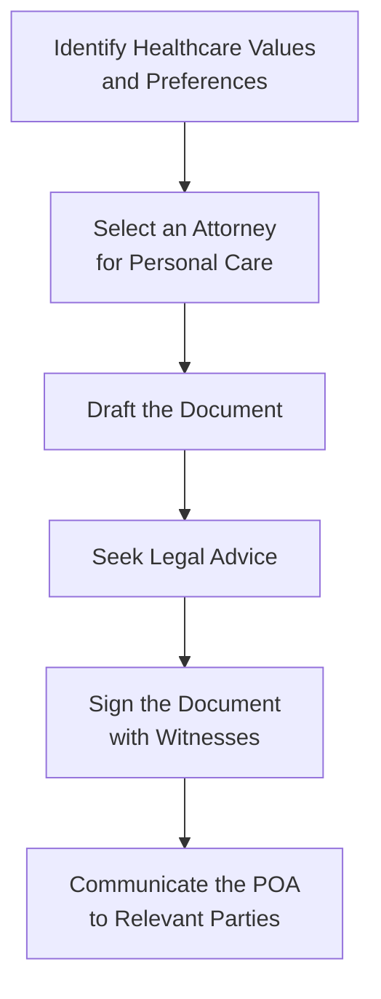

## 17.5 Power of Attorney for Personal Care

A Power of Attorney for Personal Care (often called a personal directive, living will, or health care directive, depending on the province) is a legal document that designates someone—your “attorney”—to make personal care decisions on your behalf should you become mentally incapable. These types of decisions cover a wide range of topics, including health care, end-of-life preferences, living arrangements, nutrition, bathing, and more.

In many Canadian jurisdictions, this legal authority is entirely separate from a Power of Attorney for Property (or finances). Readers will recall from earlier sections—especially 17.4 Power of Attorney for Property—that there’s a clear distinction between making decisions about finances and investments versus making decisions about personal welfare and daily life. So, when we talk about a POA for Personal Care, we’re specifically focusing on health and supportive living decisions.

This section will unpack how to create a Power of Attorney for Personal Care, why it is important, reveal the ways it is regulated in various Canadian provinces, and underscore the responsibilities of an attorney acting under such an arrangement. We’ll also talk about potential pitfalls, provide practical tips, and review references for further learning. 

---

## Understanding the Scope of a Power of Attorney for Personal Care

A Power of Attorney for Personal Care becomes relevant when the individual (often referred to as the “grantor” or “donor”) is deemed incapable of making certain personal decisions. Incapacity might arise due to an accident, a serious illness, age-related changes—like advanced dementia—or any scenario in which the individual can no longer make sound decisions on their own. 

Unlike a general Power of Attorney that deals with property or finances, a POA for Personal Care covers a variety of personal decisions:

• Healthcare treatment and end-of-life care (e.g., decisions to continue or discontinue life support).  
• Dental care, hygiene, and daily grooming.  
• Living arrangements (e.g., whether to move into a care facility or stay in the family home).  
• Decisions about diet and nutrition.  
• Organ donation and do-not-resuscitate (DNR) instructions.

The grantor can be as specific as they wish in this document. For example, you might specify the type of living environment you would prefer—some individuals explicitly state they do not want to be placed in a nursing home. Others choose to emphasize palliative care or comfort care over aggressive treatments. The level of detail is entirely up to the grantor, though it’s generally recommended to include clear guidelines whenever possible.

---

## Why This Matters in Financial Planning

You might be wondering, “Sure, I get that POA for Personal Care is crucial for medical decisions, but what does that have to do with my financial plan?” Well, financial planning isn’t purely about money; it’s about ensuring that every aspect of one’s future—health, housing, happiness, and overall well-being—is safeguarded. 

If you become incapacitated, not only will your financial needs require management (via a POA for Property), but your lifestyle, your healthcare preferences, and daily personal choices must also be addressed. From a holistic financial planning standpoint, your clients’ personal well-being is as critical as their retirement nest egg—especially if those personal care decisions have cost implications (e.g., selecting a private care facility vs. a public healthcare option).

A real story comes to mind: years ago, a close family friend, Elaine, found herself in a tough situation after her mother suffered a severe stroke. Elaine’s mother had a POA for Property in place (so finances were being managed by Elaine), but they never got around to planning a POA for Personal Care. The hospital asked for consent to proceed with certain treatments, and Elaine realized she didn’t have proper authorization to make those decisions. It caused heartbreaking delays, confusion among relatives, and friction within the family about what Mom “would have wanted.” A properly drafted POA for Personal Care, with specific directives, would have alleviated these uncertainties and helped keep the family on the same page.

---

## Key Legal Considerations and Terminology

1. Mental Capacity:  
   - Generally, a legal or medical professional must determine your mental capacity. The standard is whether you understand the nature and consequences of the decisions and can appreciate the risks and benefits. Provinces have different methods (and forms) for such assessments.

2. Living Will or Personal Directive:  
   - A living will is often used interchangeably with a POA for Personal Care but refers more specifically to instructions for end-of-life decisions rather than day-to-day decision-making authority. In some provinces (like Alberta and Nova Scotia), the term “personal directive” is used to outline health care and personal care wishes, and it may or may not include the naming of an attorney.

3. Advance Health Care Directive:  
   - In some provinces, an Advance Health Care Directive is a separate or additional legal instrument that focuses more explicitly on medical treatment preferences. 

4. Best Interests vs. Expressed Wishes:  
   - If the grantor’s preference around a particular issue isn’t explicitly stated, the attorney must act in the “best interests” of the grantor. Of course, what constitutes “best interests” can vary among families, so thorough instructions help reduce guesswork and disputes.

5. Provincial Variances:  
   - Laws differ from province to province. For instance, Ontario uses the term “Power of Attorney for Personal Care,” while in Alberta and Nova Scotia, you might see “Personal Directives Act.” It’s vital to consult the local legislation to ensure your POA for Personal Care is drafted according to the correct legal requirements.

---

## Detailed Steps to Establishing a POA for Personal Care

Let’s outline the typical procedure to create a POA for Personal Care. While details vary by jurisdiction, the following steps can serve as a general roadmap:

1. Identify Healthcare Values and Preferences  
   - Start by clarifying what matters most to you regarding your personal care. Think about end-of-life care, medical procedures you would or would not want, living arrangements, dietary needs, religious considerations, or any other personal preferences. 

2. Select an Attorney for Personal Care  
   - Choose someone you trust, who understands your wishes, and who is comfortable making potentially complex decisions under emotional pressure. It could be a spouse, an adult child, or a close friend. Some individuals name multiple attorneys or specify an attorney plus an alternate in case the first is unavailable.

3. Draft the Document  
   - Use a standard form from your province (if provided), or consult a legal professional to ensure the language is precise. In some provinces, standard templates are available, and you can fill in your specific details.

4. Seek Legal Advice  
   - Though do-it-yourself kits or government forms exist, it’s generally prudent to have a legal consultation. A lawyer will check for errors, confirm compliance with provincial law, and advise on how your POA interacts with other estate planning documents (like your will or trust arrangements).

5. Sign the Document with Witnesses  
   - Typically, you must sign your POA for Personal Care in the presence of one or more witnesses who are not immediate family members or the named attorney. Requirements vary, so check your local legislation. Some provinces demand that a notary or a commissioner of oaths be present.

6. Communicate the Document to Relevant Parties  
   - Share copies with your attorney, your family doctor, and possibly close relatives or friends. Keep a copy in a secure yet accessible location in your home. Some individuals also keep a wallet card or a note indicating they have a POA for Personal Care and where to find it.

---

## Practical Case Scenarios

• Scenario 1: Advanced Dementia  
  - Margaret is 80 years old and exhibits the early signs of dementia. She sets up a POA for Personal Care with her daughter as the named attorney. In her directive, Margaret specifies she wants to remain in her home as long as possible, with home-care support if feasible, before considering a long-term care facility. When Margaret’s dementia progresses significantly, her daughter can step in legally to arrange for in-home nursing services or other support, in alignment with Margaret’s directive.

• Scenario 2: Terminal Illness and Palliative Care  
  - David, diagnosed with terminal cancer, chooses not to pursue aggressive life-sustaining treatments. In his POA for Personal Care, he explicitly states he doesn’t want life support if there is no reasonable chance of recovery. This directive provides clear guidance for his appointed attorney if David becomes unable to communicate his wishes himself.

• Scenario 3: Disagreements Among Family Members  
  - Carol appoints one child as her attorney for personal care. After a stroke leaves Carol incapacitated, a sibling disputes the attorney’s decisions, believing Carol would have wanted a different course. Because Carol left detailed instructions in her POA for Personal Care, the attorney can produce the document as evidence of Carol’s stated wishes. This clarity helps minimize family conflict and ensures Carol’s preferences prevail.

---

## Common Pitfalls and Their Solutions

• Vague or Incomplete Instructions  
  - Some POAs for Personal Care contain generic statements like, “I’d rather not be placed in an institution.” But what does that mean if home care becomes financially or medically unfeasible? Provide realistic guidelines and accept that, if circumstances change drastically, your attorney may need some flexibility.

• Selecting the Wrong Attorney  
  - The attorney’s willingness to follow your wishes is key. It’s not enough that they’re a close relative; they should be emotionally prepared and share your values or, at least, respect them. Naming someone who doesn’t believe in your end-of-life directives could lead to turmoil.

• Failure to Consider Territorial Differences  
  - Canadian provinces have different rules for witnessing and even the name of the legal document. If you move or have property in multiple provinces, revisit your POA for Personal Care or consult a cross-provincial legal advisor to ensure validity everywhere you reside.

• Outdated Documents  
  - If your POA for Personal Care is ten years old, it might not reflect your current situation, your latest medical conditions, or changes in the lives of your named attorney (e.g., they’ve moved abroad). Review estate documents periodically and keep them timely.

---

## Regulatory Environment and Related Resources

Even though the newly formed Canadian Investment Regulatory Organization (CIRO)—which replaced the defunct MFDA and IIROC—primarily oversees investment dealers and mutual fund dealers, financial professionals should remain aware of changes in Canadian law that might affect client estate plans. While the regulation of POAs for Personal Care is largely provincial, a robust financial planning practice will keep clients informed of any relevant legislative updates.

### Provincial Resources
• Alberta’s Personal Directives Act:  
  https://www.alberta.ca/personal-directive.aspx  
  This website provides guidelines and forms for drafting personal directives, clarifying how to appoint an agent and the scope of personal care decisions.  

• Nova Scotia’s Personal Directives Act  
  Similar to Alberta, Nova Scotia also has a dedicated act that explains how to create a personal directive, eligibility criteria, and powers/responsibilities of attorneys.  

### Additional Expert References
• Canadian Bar Association, Elder Law Section:  
  This platform hosts articles, webinars, and discussions on elder law, including up-to-date best practices for personal directives.  
• Canadian Centre for Elder Law:  
  Offers online courses focusing on personal care planning and other legal issues related to aging.  
• Local Agencies on Aging:  
  Many provinces have local “aging and long-term care” offices or advocacy groups; these organizations sometimes provide free workshops and fact sheets.

---

## Best Practices

• Periodically Review Your POA for Personal Care:  
  - Update it if your goals change, or if you identify different or additional attorneys who better position your wishes.  

• Integrate it with Your Overall Financial Plan:  
  - Consider how costs related to certain healthcare decisions might be covered—through government benefits, personal savings, or insurance policies (such as long-term care insurance, discussed in Chapter 12).  

• Ensure Transparency:  
  - Inform key family members or close friends about the contents of your POA. Surprises at a crucial moment can lead to disputes.  

• File and Store the Document Properly:  
  - This might seem obvious, but the best POA is useless if it can’t be found when needed.  

---

## Encouragement to Take Action

If you haven’t written a POA for Personal Care yet, now’s a good time to start planning. It might feel uncomfortable—discussing incapacity or potential end-of-life preferences can stir up strong emotions—but having that document in place removes guesswork and reduces the burden on your loved ones. Plus, it ensures your voice is heard even if you can’t speak for yourself. 

More than a bureaucratic step, it’s an act of care and consideration for those you’ll leave behind or those who will have to make decisions on your behalf. Talk to your financial advisor, lawyer, or notary; gather examples or check out your province’s official forms.  

---

## References for Further Exploration

• “Personal Directives Act – Alberta”: https://www.alberta.ca/personal-directive.aspx  
• “Personal Directives Act – Nova Scotia” (search “Nova Scotia Personal Directives Act guide” for official forms)  
• Canadian Bar Association – Elder Law Section: https://www.cba.org/Sections/Elder-Law  
• Canadian Centre for Elder Law: https://www.bcli.org/ccel  
• For official updates or external references on regulatory affairs, consult the Canadian Investment Regulatory Organization (CIRO) at https://www.ciro.ca  

---

## Essential Questions on Powers of Attorney for Personal Care



### 1. Which of the following is generally covered by a Power of Attorney for Personal Care?

- [ ] Financial transactions, investments, and tax filing.  
- [x] Decisions regarding living arrangements, hygiene, and health care.  
- [ ] Business selections and insurance claims.  
- [ ] None of the above.  

> **Explanation:** A POA for Personal Care covers decisions about personal welfare, such as health care and living arrangements. Financial and property matters are handled under a POA for Property or a similar legal document.

---

### 2. What does “mental capacity” usually refer to in the context of creating a POA for Personal Care?

- [x] The ability to understand and appreciate the consequences of personal care decisions.  
- [ ] Holding enough assets to justify legal documentation.  
- [ ] Having a certain minimum level of education.  
- [ ] None of the above.  

> **Explanation:** Mental capacity involves being able to grasp the nature and impact of decisions. Provincial laws often require a formal assessment of capacity before a POA for Personal Care goes into effect.

---

### 3. In most provinces, what happens if your POA for Personal Care lacks specific instructions about a particular medical treatment?

- [ ] Any family member can automatically override the attorney’s decision.  
- [ ] The attorney must consult a court for every decision.  
- [x] The attorney must act in the grantor’s best interests.  
- [ ] It invalidates the entire POA.  

> **Explanation:** If the grantor has not provided specific instructions, the attorney is obligated to act in the best interests of the grantor, taking into account their known values and previous wishes.

---

### 4. Who is typically the best person to name as your attorney for personal care?

- [x] Someone you trust to respect your wishes and handle emotional pressure responsibly.  
- [ ] Always the eldest child, regardless of their willingness or ability.  
- [ ] A complete stranger with legal training.  
- [ ] Whoever your doctor recommends, with no questions asked.  

> **Explanation:** Trust, understanding of your personal preferences, and emotional readiness are critical factors in choosing a suitable attorney for personal care.

---

### 5. Which of the following is NOT one of the recommended steps when creating a POA for Personal Care?

- [x] Immediately distributing the grantor’s assets to family members.  
- [ ] Identifying your healthcare values and preferences.  
- [ ] Signing the document in front of appropriate witnesses.  
- [ ] Seeking legal advice to ensure provincial compliance.  

> **Explanation:** Distributing assets is part of estate distribution and not relevant to setting up a POA for Personal Care.

---

### 6. If you relocate from Ontario to Alberta, what’s the best approach regarding your existing POA for Personal Care?

- [x] Review and possibly update it to comply with Alberta’s Personal Directives Act.  
- [ ] Discard it and rely on family members to sort it out.  
- [ ] Do nothing; POAs always have national validity without changes.  
- [ ] Register it with CIRO for approval.  

> **Explanation:** Because provincially regulated documents can differ in requirements, it’s wise to review and update your POA for Personal Care when you move to another province.

---

### 7. Why might a “living will” differ from a “POA for Personal Care”?

- [ ] A living will is strictly about property distribution upon death.  
- [x] A living will often details end-of-life treatment preferences but may not appoint a legal decision-maker.  
- [ ] A living will is recognized only outside of Canada.  
- [ ] They refer to exactly the same form in every province.  

> **Explanation:** Although the terms sometimes overlap, a living will generally provides instructions about end-of-life care but might not formally designate someone to enforce those instructions.

---

### 8. Which person below is ineligible to serve as a witness for the signing of a POA for Personal Care in many provinces?

- [ ] A friend who isn’t named in the document.  
- [ ] A lawyer or notary.  
- [x] The individual who is named as the attorney.  
- [ ] A commissioner of oaths.  

> **Explanation:** In many jurisdictions, the attorney himself/herself and close family members typically cannot be witnesses to avoid conflicts of interest.

---

### 9. If an appointed attorney refuses to act, what is the best course of action?

- [ ] The POA is automatically void.  
- [ ] File a court petition within 48 hours.  
- [x] The alternate attorney (if named) or a new attorney must be appointed.  
- [ ] Force them by claiming breach of contract.  

> **Explanation:** POAs often provide for alternates. If the first-named attorney cannot or will not serve, the alternate will step in. Otherwise, legal procedures to appoint a new attorney might be necessary.

---

### 10. True or False: A POA for Personal Care always needs to be notarized to be valid in every Canadian province.

- [ ] True  
- [x] False  

> **Explanation:** The notarization requirement varies by province. Some provinces require signatures in the presence of specific witnesses, while others may require notarization or commissioning. Always check local rules.


