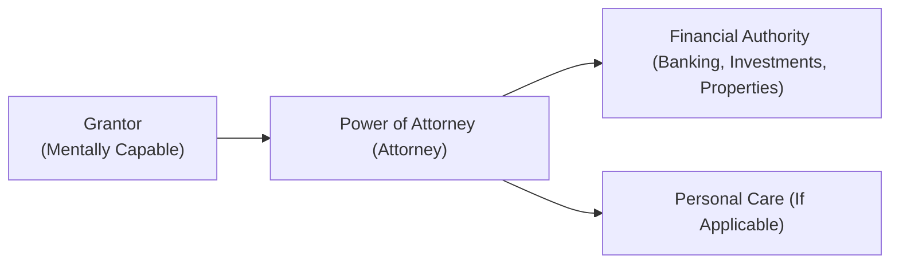

## 17.6 Risks and Considerations with Powers of Attorney

Imagine you have an elderly uncle who’s in good health but worried about managing his finances if his cognitive abilities decline. So, he decides to grant a Power of Attorney (POA) to his daughter. At first glance, it seems perfectly straightforward, right? But wait—what if your cousin (the daughter) uses the money for her own benefit? What if your uncle’s health suddenly worsens, or he changes his mind? Or what if your cousin, in good faith, simply makes mistakes because she didn’t keep careful records of her financial decisions?

These kinds of stories pop up in real life more often than you might think. They highlight why any discussion about Powers of Attorney isn’t complete without carefully examining all the possible risks. In this section, we’ll walk through the biggest concerns—like financial abuse, conflicts of interest, the necessity of revocation, capacity issues, and more—to help you better understand how a POA fits into a strong financial plan. We’ll also touch on the importance of good record-keeping and how essential it is to seek professional advice. By the end of this section, you’ll (hopefully!) be able to spot red flags, navigate common challenges, and know where to turn if something goes awry.

Before we dive in, remember that Powers of Attorney legislation can vary across different Canadian provinces and territories. Always consult legal counsel or relevant provincial statutes to ensure your advice—whether you’re a planner, an attorney under a POA, or simply a caring family member—is appropriate and valid.

---

## Understanding the Role and Scope of a Power of Attorney

Let’s kick things off with a quick refresher: a Power of Attorney is a legal instrument that allows an individual (“the grantor”) to appoint someone else (“the attorney,” who is not necessarily a lawyer) to act on their behalf. This could include making financial decisions, managing real estate, paying bills, deciding where to invest funds, or even making certain lifestyle and healthcare decisions (though that often requires a separate document called a Power of Attorney for Personal Care, depending on the province).

A comprehensive POA can be especially useful for aging clients who may eventually face diminished capacity, or for individuals who expect to be out of the country for prolonged periods. However, the significant grant of authority also can open the door to serious risks if not managed properly.

---

## Key Risks and Considerations

### Risk of Abuse

One of the most concerning aspects of granting a POA is the sheer potential for misuse or financial abuse. When you give someone power over your finances, you’re essentially handing them the keys to the castle. They can access bank accounts, move money, and make financial decisions—sometimes without much oversight.

• Financial Abuse: This often takes the form of unauthorized withdrawals, transferring funds to personal accounts, or even selling the grantor’s property.  
• Emotional Leverage: Sadly, attorneys under a POA might pressure the grantor for financial gain—especially if the grantor is emotionally dependent on them.

Abuse doesn’t always stem from malicious intent; sometimes it’s ignorance or negligence. Either way, the result can be devastating for individuals who may be at a stage in life where they can’t easily recoup financial losses. Even if the attorney in question is a close friend or family member, regular monitoring, transparent communication with other relatives, and professional oversight (like involving a financial advisor or accountant) can mitigate many of these risks.

For more information on elder abuse prevention strategies, it’s worth checking out the Government of Canada’s resources on elder abuse:  
• https://www.canada.ca/en/employment-social-development/campaigns/elder-abuse.html

Here is a simple diagram to illustrate the roles and relationships involved when a POA is in place:

In this example, the attorney has direct influence over decision-making, which underscores the importance of choosing someone trustworthy and maintaining checks and balances.

---

### Conflict of Interest

Another key risk concerns conflict of interest. The attorney must always act in the best interests of the grantor. Canadian law typically prohibits attorneys from mixing the grantor’s assets with their own or using the grantor’s funds for personal gain, unless explicitly authorized to do so in the POA document. But even with the best intentions, lines can blur.

For instance, an attorney might justify borrowing from the grantor’s account if they plan to “repay it later.” Or they might rationalize purchasing an asset from the grantor at a discounted price. Even if they plan on making the client whole eventually, these activities can create a serious legal conflict of interest. Plus, they complicate record-keeping and place the attorney’s personal interests above or into the same pot as the grantor’s. If you suspect any wrongdoing or impropriety, remember that in many provinces, you can file a complaint or report with the Public Guardian and Trustee, who can intervene when a POA is being abused.

**Best Practices:**  
• Keep separate bank accounts for personal funds and the grantor’s funds.  
• Obtain legal counsel when in doubt about whether a transaction conflicts with the grantor’s interests.  
• Provide periodic reports to another family member or third-party professional (e.g., an accountant) for added transparency.

---

### Revocation of the POA

So, what if things go south, or the grantor just changes their mind about who should be their attorney? As long as the grantor remains mentally capable, they have the right to revoke or alter a POA at any time. Revocation is a crucial safeguard. It might come into play if:

• There’s evidence the attorney is mismanaging finances or acting irresponsibly.  
• The originally appointed attorney is no longer capable or willing to serve.  
• The grantor wants to name someone else (maybe an updated family situation or a new professional advisor).  

If the grantor suspects wrongdoing, they can—and should—act promptly to terminate the POA and notify financial institutions. A new POA could then be drafted, often with revised instructions or additional clauses that aim to prevent further exploitation.

---

### Legal Capacity Issues

Drafting a POA document requires the grantor to be mentally capable. That is, they have to understand what authority they’re handing over, to whom, why, and what the implications are. If there’s any doubt—say, the grantor has early-stage dementia or a medical history of cognitive impairment—it might be wise to seek a capacity assessment.

A capacity assessment is a formal evaluation by a qualified professional (such as a physician, psychologist, or designated capacity assessor). If the grantor was determined to be incapable at the time they signed the document, the POA could be challenged in court or through provincial authorities, rendering it invalid. This is a tricky area, and the mere suggestion that someone might lack capacity can strain family relationships, so tread gently. Nevertheless, due diligence is critical and can protect everyone involved in the long run.

---

### Record-Keeping Obligations

We all know how easy it is to lose track of receipts and forget that $20 ATM withdrawal last month. But for someone acting under a POA, a small oversight can turn into bigger trouble. Attorneys must keep meticulous records to:

• Demonstrate they are acting in the grantor’s best interest.  
• Produce a clear audit trail of financial transactions, including receipts, disbursements, and investments.  
• Have evidence of compliance with legal duties if questioned by the grantor, their family, or provincial authorities.

A best practice is to use specialized accounting software or well-organized spreadsheets. Some attorneys hire bookkeepers to ensure no detail is overlooked. If the grantor has sizeable assets, it might even be wise to engage a Certified Professional Accountant (CPA) from day one.

---

### Professional Advice

Now, you might be thinking: “Okay, it’s quite a minefield out there. How can I ensure I’ve covered all my bases?” Well, besides reading everything you can find on Powers of Attorney (which, obviously, you are doing actively right now), it’s often necessary to consult professionals:

• **Legal Advice:** Lawyers can draft POA documents that include provisions for conflict of interest management, specify revocation procedures, or outline steps the attorney must take to report to third parties.  
• **Financial Guidance:** A financial advisor or planner can suggest structures that make mismanagement less likely—like setting up separate accounts or employing an independent trustee for certain assets.  
• **Capacity Assessors:** If there’s any doubt about mental competence, a formal capacity assessment can protect your client from future legal challenges.

If you’re seeking advanced insights, “Advanced Financial Advice for Seniors” by the Canadian Centre for Elder Law offers detailed case studies on POA misuse and how best to prevent it. CIRO (the Canadian Investment Regulatory Organization) also provides guidelines for dealing with vulnerable clients who may have POA arrangements in place. (Note that CIRO was formed on January 1, 2023, from the amalgamation of the Mutual Fund Dealers Association of Canada (MFDA) and the Investment Industry Regulatory Organization of Canada (IIROC), both of which are now defunct but historically relevant.)

---

## Real-World Scenarios and Examples

Below are a few hypothetical (but scarily plausible) scenarios to illustrate how POA risks might unfold:

1. **The “Helpful” Family Member**  
   Joe, age 84, grants a POA to his nephew who’s in charge of paying monthly bills. Over time, the nephew notices a large cash reserve and starts dipping into it for personal expenses, confident nobody will notice. When Joe’s accountant sees an unusual pattern of withdrawals, the nephew says he’s buying groceries and medications for Joe. But the receipts don’t add up.

2. **Unfortunate Timing**  
   Claire is transitioning into a care facility. Two weeks after she signs a POA giving her eldest daughter broad financial authority, a doctor diagnoses Claire with a cognitive impairment that suggests she might not have been mentally capable at the time of signing. Siblings who disagree about Claire’s care detect potential irregularities in the daughter’s decisions and contest the validity of the POA.

3. **Friendly Loans Gone Wrong**  
   An attorney under a POA gets into a short-term financial pinch. Because the grantor is a “close friend,” they temporarily borrow $10,000 from the grantor’s account—fully intending to return it. When the attorney can’t repay the loan promptly, it puts the grantor’s finances in jeopardy. The grantor’s other family members accuse the attorney of stealing.

In all these instances, better record-keeping, open communication, and an awareness of conflict-of-interest guidelines could have helped prevent or quickly resolve the problem.

---

## Best Practices to Mitigate Risks

• **Choose the Right Person:** The attorney should be someone trustworthy, financially responsible, and capable of handling complex paperwork.  
• **Consider Professional Attorneys:** When family dynamics are complicated or if the estate is large, hiring a lawyer or trust company can reduce conflict.  
• **Regular Check-Ins:** Schedule periodic meetings or updates (monthly, quarterly, or yearly) to go over financial activity, ensuring everything aligns with the grantor’s needs.  
• **Communication is Key:** Keep lines of communication open among family members and professionals involved. Confront issues like suspected abuse early.  
• **Know When to Revoke:** If you notice suspicious transactions or loss of confidence in the attorney’s abilities, act quickly to revoke that POA if the grantor is still capable.  
• **Stay Up-to-Date with Regional Laws:** Different provinces can have different rules. If a grantor moves or acquires property in another province, ensure the POA remains valid.

---

## Glossary

• **Financial Abuse:** The misuse or misappropriation of someone’s financial assets for personal gain. This can include forging signatures, stealing bank cards, transferring funds without authorization, or persuading/forcing someone to make decisions against their will.  
• **Revocation:** The official cancellation or termination of a previously granted POA, often requiring written notice to the attorney and relevant financial institutions.  
• **Capacity Assessment:** A formal evaluation by a qualified professional to confirm whether an individual can fully understand and appreciate the nature of the decisions they are making.

---

## Additional Resources

• **Government of Canada – Elder Abuse Resources:**  
  https://www.canada.ca/en/employment-social-development/campaigns/elder-abuse.html

• **Provincial Public Guardian and Trustee Websites:**  
  Each province (or territory) typically has an office of the Public Guardian and Trustee that protects the interests of vulnerable people. Processes to report POA misuse can be found on their websites.

• **Advanced Financial Advice for Seniors (Canadian Centre for Elder Law):**  
  This collection of case studies can offer deeper insights into POA abuse and strategies for prevention.

• **Canadian Investment Regulatory Organization (CIRO):**  
  https://www.ciro.ca  
  CIRO is the national self-regulatory body for investment and mutual fund dealers, with guidelines for dealing with clients who have POA arrangements. Although MFDA and IIROC existed historically, they have now been folded into CIRO.

• **Canadian Investor Protection Fund (CIPF):**  
  Ensures client assets are protected if a member firm becomes insolvent. CIPF is independent from CIRO and remains Canada’s sole investor protection fund.

---

## Bringing It All Together

Powers of Attorney can be incredibly useful tools for financial and personal care planning—especially for older adults or individuals with health concerns. However, the wrong combination of personal dynamics, inadequate oversight, or vaguely drafted documents can quickly lead to exploitation. By understanding the risks, encouraging the addition of oversight provisions, and emphasizing transparent record-keeping and revocation clauses, financial planners and clients alike can harness the benefits of a POA while minimizing pitfalls.

Think of it as adding safety features to a car: you don’t expect a crash, but if it happens, you want seatbelts, airbags, and good auto insurance in place. Similarly, a carefully considered POA—drafted with professional help, subject to ongoing checks, and revocable when necessary—offers critical protection for the grantor’s interests.

And remember, if you ever find the complexities overwhelming, consult a lawyer or a financial advisor. You’re not alone—many professionals specialize in dealing with POAs and can help tailor a solution that fits. Ultimately, a well-designed POA can bring peace of mind, ensuring a client’s finances and well-being remain safeguarded even under uncertain circumstances.

---

## Test Your Knowledge: Powers of Attorney and Risk Management



### Which of the following is a key reason proper record-keeping is essential under a Power of Attorney?

- [ ] It helps the attorney access personal funds.  
- [x] It demonstrates that the attorney is acting in the grantor’s best interest.  
- [ ] It allows for automatic POA renewal.  
- [ ] It replaces the need for capacity assessments.  

> **Explanation:** Maintaining clear records is critical because it shows financial transparency and provides evidence that decisions align with the grantor’s interests.

---

### Which scenario most clearly demonstrates a conflict of interest by the attorney under a POA?

- [ ] Using the grantor’s account to pay the grantor’s bills.  
- [ ] Seeking professional guidance before investing the grantor’s funds.  
- [x] Purchasing the grantor’s property at a discounted price for personal benefit.  
- [ ] Keeping meticulous records of all transactions.  

> **Explanation:** Buying the grantor’s property at a discounted rate benefits the attorney and can jeopardize the grantor’s financial interests, reflecting a conflict of interest.

---

### Which of the following best describes revocation in the context of Powers of Attorney?

- [ ] Renewing the terms of the POA.  
- [ ] Notarizing the POA document.  
- [x] Officially canceling or terminating a previously granted POA.  
- [ ] Permitting joint attorneys to act together.  

> **Explanation:** Revocation is the formal process of canceling a POA. Legally, the grantor can revoke the POA so long as they remain mentally capable of doing so.

---

### True or False: An individual without mental capacity can create a valid Power of Attorney.

- [ ] True  
- [x] False  

> **Explanation:** A grantor must be mentally capable at the time of signing the POA; otherwise, the POA can be declared invalid.

---

### Which of the following organizations in Canada oversees financial professionals and has guidelines regarding Powers of Attorney and vulnerable clients?

- [ ] The Mutual Fund Dealers Association (MFDA)  
- [x] The Canadian Investment Regulatory Organization (CIRO)  
- [ ] The Investment Industry Regulatory Organization of Canada (IIROC)  
- [ ] The Office of the Superintendent of Financial Institutions (OSFI)  

> **Explanation:** As of June 1, 2023, MFDA and IIROC amalgamated into CIRO, which is now the single national self-regulatory body overseeing investment dealers, mutual fund dealers, and market integrity.

---

### Which of the following best describes financial abuse under a POA?

- [ ] The attorney invests the grantor’s funds in a high-risk product with full disclosure.  
- [ ] The attorney and grantor share a joint account for convenience at the grantor’s request.  
- [x] The attorney uses the grantor’s funds for personal expenses without permission.  
- [ ] The attorney declines to pay the grantor’s personal expenses.  

> **Explanation:** Financial abuse occurs when the attorney misuses or misappropriates the grantor’s assets for personal gain, such as using the grantor’s funds for the attorney’s own expenses without approval.

---

### When might a formal capacity assessment be most important?

- [x] When there is doubt about the grantor’s mental capability to understand the POA.  
- [ ] When the attorney wants to sell the grantor’s property.  
- [x] When family members disagree on the grantor’s capacity.  
- [ ] When the grantor is out of the country.  

> **Explanation:** Capacity assessment is crucial if there is any concern or dispute about the grantor’s ability to understand the nature and consequences of granting a POA.

---

### What is one safeguard against the misuse of authority in a POA?

- [x] Requiring periodic financial statements to be reviewed by a third party.  
- [ ] Blending the grantor’s funds with the attorney’s to simplify banking.  
- [ ] Not specifying conflict-of-interest provisions in the POA.  
- [ ] Refusing to allow any oversight by relatives.  

> **Explanation:** Having a third party review financial statements adds oversight and accountability, making it harder for an attorney to misuse authority undetected.

---

### True or False: Once granted, a Power of Attorney cannot be modified, only fully revoked.

- [ ] True  
- [x] False  

> **Explanation:** A POA can be amended if the grantor remains mentally capable, allowing for changes in scope or in the choice of attorney.

---

### Which document would be crucial if a client wants to grant someone authority over healthcare decisions?

- [x] A separate or combined Power of Attorney for Personal Care (name varies by province).  
- [ ] A standard financial Power of Attorney.  
- [ ] A business partnership agreement.  
- [ ] A living trust.  

> **Explanation:** While the terminology varies, healthcare decisions typically require a specific form of POA (often called a Power of Attorney for Personal Care, Health Care Proxy, or Representative Agreement), distinct from the POA used for financial matters.


