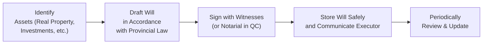

## 18.1 Preparing a Will

Imagine, for a moment, someone who’s spent their entire life building a future for themselves and their loved ones. They’ve got a cozy home, a few investments, maybe a vacation property, and even some (slightly embarrassing) digital treasures like a blog no one reads anymore. Everything’s humming along—until one day, they realize that if they suddenly weren’t around, who would get all these assets or even know where to find them?

This section is all about that challenge—tidying up our future plans so our families, friends, or chosen causes aren’t left in the dark or in disputes after we’re gone. We’re going to discuss the ins and outs of preparing a will in Canada. That means we’ll talk about the legal framework, what elements make a will valid, how to choose an executor, and why you might want to scribble down every asset (trust me, it saves a lot of time later). We’ll also look at specific quirks in certain provinces (especially Quebec), plus the all-important need to revisit your will whenever life changes.

Throughout this reading, keep in mind that the laws can vary from one province or territory to another—sometimes significantly. And as of 2025, with Canada’s new self-regulatory organization, the Canadian Investment Regulatory Organization (CIRO), overseeing investment dealers and mutual fund dealers, there’s a heightened emphasis on proper estate planning in connection with financial advice. So let’s dive in.

---

### Key Points in Canada’s Legal Landscape

Wills in Canada are governed primarily by provincial or territorial legislation, plus relevant case law (or the Civil Code in Quebec). In Ontario, for instance, the Succession Law Reform Act dictates who can make a will, how it should be signed, and its witnessing requirements. In British Columbia, the Wills, Estates, and Succession Act covers similar ground. Quebec follows the Civil Code of Quebec, which has distinct provisions on testaments, including notarial wills.

Though the rules are slightly different in each region, a few broad principles usually apply:

• The testator (the person making the will) must have the mental capacity to understand the nature and effect of their testamentary decisions.  
• The will typically must be in writing and signed.  
• Most provinces and territories require at least two witnesses who are not beneficiaries under the will.  
• In Quebec, there are three main forms of wills: notarial, holograph, and witnessed (commonly referred to as the “formal will”). Each has specific requirements.

In Canada, if someone dies intestate (that is, without a valid will), their property gets distributed under the governing legislation of their province or territory—often not how folks would have preferred.

---

### Ensuring a Valid Will

So, how do you ensure your will can actually stand up in court and guide the distribution of your assets? Let’s check out a few key elements:

• Capacity: The testator must understand the extent of their property, who their legal heirs might be, and the nature of the act of making a will. This mental capacity generally requires them to grasp the consequences of their instructions.  
• Voluntary Intention: If a will is signed under duress (through intimidation, coercion, or trickery), it might be contested or invalidated.  
• Proper Execution: As a rule of thumb, you’ll want two independent witnesses (unless you’re using a holograph or notarial format). In some provinces, having a beneficiary or the beneficiary’s spouse witness the will can void the gift to that beneficiary.  
• Province-Specific Rules: Familiarize yourself with local rules. For instance, in some places, marriage can automatically revoke a previously made will. Divorce or separation might partially revoke or alter certain gifts.

In Quebec, you can execute a notarial will, which is prepared by a notary and witnessed. This type of will typically doesn’t need to be probated after your death and carries significant legal weight. There’s also the holograph will, valid in multiple provinces, that requires no witnesses if it’s entirely in the testator’s handwriting. A handwritten scrap might be recognized as a valid holograph will—though it can lead to headache-level disputes if the instructions aren’t clear.

---

### Assets, Liabilities, and Minimizing Surprises

One of the first steps in crafting a successful will is compiling a solid inventory of your assets and liabilities. Think about real estate, vehicles, bank accounts, investments, personal items (like jewelry or art), digital assets (cryptocurrency, online businesses, social media accounts), and intangible assets like intellectual property. Also note your outstanding debts, lines of credit, mortgages, or other liabilities.

Why bother with such detail? Because the more transparent your estate’s finances, the less confusion for your executor or your family. Plus, let’s be honest: it’s easy to forget about that old mutual fund you opened 15 years ago or your vintage car that’s been sitting in a friend’s garage. Include everything, so the distribution is fair and straightforward.

Some assets—like your registered accounts with named beneficiaries (for example, an RRSP or TFSA) or certain insurance policies—may bypass the will and go directly to the named recipient. It’s crucial to confirm up-to-date beneficiary designations on these assets to align with your overall estate planning. Otherwise, you might inadvertently leave money or property to someone you didn’t intend.

---

### Selecting an Executor

Picking an executor (called a “liquidator” in Quebec) is sometimes the trickiest part of writing your will. This person or institution is going to manage your estate: dealing with creditors, paying off liabilities, filing final tax returns (with the Canada Revenue Agency), and distributing your assets as per your instructions.

They should be organized, trustworthy, and comfortable navigating basic legal and financial tasks. Often people will pick a close family member, like a spouse or adult child. Others might tap a trusted friend, or even a professional trustee or a trust company if their estate is complex (or if there’s family drama lurking). In Quebec, you can name more than one liquidator; that arrangement can spread the responsibilities but might introduce more complexity or potential disagreements.

Think carefully about who you appoint. This is a big job. You can even provide compensation for your executor as part of your will. If they’re not prepared or willing to shoulder the admin burdens (or to act fairly among your beneficiaries), you might consider someone else.

---

### Designating Beneficiaries

A will spells out who gets what—and how. But it’s not always as straightforward as “I leave everything to my spouse” or “50% each to my children.” Sometimes you want to name multiple beneficiaries with different percentages or specify unique gifts (like a treasured painting or the family cabin).

Consider adding contingency clauses for the unexpected, such as if a primary beneficiary passes away before or at the same time as you. Without contingencies covered, you might accidentally create partial intestacy or provoke a legal wrangle among survivors.

Clarity is key: use correct names and add identifying details when possible, especially if you’re leaving property to someone outside your immediate family. The more explicit you are (some might say painfully detail-oriented), the less potential for confusion.

---

### Powers of Attorney and Mandates

A power of attorney (or mandate in Quebec) isn’t part of your will per se, but it’s often drawn up around the same time. This document addresses who can make decisions if you’re incapacitated while still alive. Typically, it’s split into two types:  
• Power of Attorney for Property (or finances).  
• Power of Attorney for Personal Care (or health decisions).

In Quebec, a mandate in anticipation of incapacity fulfills a similar function. If your mental or physical health takes a turn, you won’t be able to revise your will at that moment. That’s why having these documents in place is crucial. It provides continuity and security, ensuring your bills are paid, your finances are managed, and your health-care decisions reflect your wishes.

For a deeper dive on powers of attorney, you can compare this discussion with our other chapters on trusts and incapacity planning.

---

### Reviewing and Updating a Will

Let’s talk about a scenario: a friend of mine, Carol, got married in one province in her 20s and prepared a will that left everything to her spouse. After they divorced, she moved across the country, got remarried, had kids, and built up a nice chunk of savings. Except she never updated her old will—yikes. That’s a recipe for estate chaos.

Major life changes—marriage, divorce, birth or adoption of a child, death of a beneficiary, or significant shifts in finances—are your signals to revisit your will. In some provinces, marriage automatically revokes a current will. Even if it doesn’t, you might want to be sure your new spouse is included in a thoughtful way. A simple review every couple of years (or whenever you feel your life has changed drastically) can save heartbreak down the road.

---

### Professional Legal Advice

Yes, it’s entirely possible to write your own will, especially if your estate is small and straightforward. However, for many Canadians, consulting a lawyer specializing in wills and estates is money well spent. They can ensure the document meets your province’s legal requirements, address complex circumstances (like blended families, corporate assets, or special needs beneficiaries), and minimize the risk of a legal challenge.

A lawyer will also keep tabs on the latest legal developments in your province or territory. For instance, certain changes might have been introduced in your region’s legislation around electronic wills or witnessed wills executed via videoconference. With professional advice, you’re less likely to have your last wishes upended by a technical glitch or outdated assumption.

---

### Common Pitfalls and Best Practices

It’s easy to slip up when making a will, especially if it’s your first time. Here are some pitfalls to watch out for:

• Outdated Beneficiaries: Maybe you left your entire estate to your ex-spouse or forgot your newly adopted child.  
• Failing to Account for All Assets: Think digital. Those cryptocurrency keys or your domain names can have real value.  
• Ambiguous Language: “I leave the house to so-and-so if she wants it” can raise all sorts of interpretive questions.  
• Unclear Residue Clauses: The “residue” is what remains after specific gifts and debts. If you don’t clarify who gets the residue, you might trigger partial intestacy.  
• Overlooking Witness Rules: If a beneficiary or that beneficiary’s spouse is a witness (and your province says that’s a no-no), that gift could be void.  
• Storing the Will Improperly: The best will in the world does no good if no one knows where it is.

A crisp, well-structured will reduces confusion and conflict. It can also integrate with your other planning efforts, including insurance designations, pensions, registered investment accounts, and trusts. 

---

### Visual Overview: Will Preparation Flow

Here is a simple Mermaid diagram showing a high-level flow of will preparation. This might help you visualize the overall process:

• Identify your assets and liabilities.  
• Draft the will according to your province’s (or territory’s) rules, factoring in relevant details like designated beneficiaries, a chosen executor, and instructions for personal property.  
• Sign and witness the will (or use a notary in Quebec).  
• Store it in a safe and accessible location—ideal spots might be with your lawyer, in a safety deposit box, or a secure home filing system.  
• Revisit it periodically to make updates or codicils (amendments) as life changes.

---

### Integrating Financial Regulations and Final Tax Returns

You might be wondering how all this lines up with federal regulations and organizations like the Canada Revenue Agency (CRA). Here’s the short version:

• When someone passes away, their executor is responsible for filing the final tax returns. If the deceased owned significant investments, or if there were tax-deferred vehicles like RRSPs or RRIFs, a thorough estate plan can reduce tax implications.  
• CIRO (the Canadian Investment Regulatory Organization) is Canada’s self-regulatory body for investment dealers and mutual fund dealers, as of January 1, 2023 (the MFDA and IIROC are now defunct). Keeping your advisor informed about your estate plan ensures your investment accounts and registered products align with your distribution goals.  
• The Canadian Investor Protection Fund (CIPF) remains the sole investor protection fund. CIPF covers client assets if a member dealer becomes insolvent. It’s independent of CIRO, but it’s good to confirm your investment accounts are CIPF-protected according to the latest coverage details.

---

### Further Resources

For those looking to dig deeper, here are some great resources:

• [Ontario Ministry of the Attorney General – Wills and Estate Planning](https://www.ontario.ca/page/wills-and-estate-planning)  
• [BC Laws – Wills, Estates and Succession Act](https://www.bclaws.gov.bc.ca)  
• [CIRO (Canadian Investment Regulatory Organization)](https://www.ciro.ca)  
• [CRA Guide on Filing Final Returns: T4011](https://www.canada.ca/en/revenue-agency/services/forms-publications/publications/t4011.html)  
• Hull & Hull LLP Blog (for Ontario-focused legal updates)  
• The Canadian Guide to Will and Estate Planning by Douglas Gray & John Budd  
• [Canada.ca’s Retirement Income Calculator](https://www.canada.ca/en/services/benefits/publicpensions.html) (a handy open-source tool to gauge retirement and estate impacts)

If you have specialized needs (like cross-border issues, minor or special needs beneficiaries, or complex corporate shareholdings), it’s prudent to seek legal counsel from a lawyer with estate planning experience.

---

### Conclusion

A will is your last note to everyone you leave behind. By investing time in listing assets, understanding provincial requirements, naming an executor who’s up to the task, and ensuring beneficiaries are clearly designated, you reduce the burdens on your loved ones and help your wishes stand up legally.

Take it from me: I’ve seen families undone by the confusion of an outdated or missing will. On the other hand, I’ve watched folks seamlessly navigate an estate when there’s a thorough plan in place. It can make all the difference at a stressful moment in your family’s life. 

So, think carefully about what you want your legacy to be—and then put it in writing. Stay current with your province’s laws, and when in doubt, call a qualified estate lawyer to guide you. The peace of mind is more than worth it.

---

## Test Your Knowledge: Preparing a Will in Canada



### Which of the following is a key requirement of a valid will in most Canadian provinces (outside Quebec)?
- [ ] The testator must be at least 25 years old.
- [x] The testator must have the mental capacity to understand their decisions.
- [ ] The will must be endorsed by a bank or financial institution.
- [ ] The testator must publish a notice of the will in a local newspaper.

> **Explanation:** In most parts of Canada, the testator must have testamentary capacity—meaning they understand what a will is, the nature of their assets, and the implications of the distribution. Other requirements such as age (generally 18 or 19, depending on the province) are also important, but 25 is not a standard threshold.

### In Quebec, which form of will often does NOT require probate?
- [ ] Holograph will
- [ ] Formal/witnessed will
- [x] Notarial will
- [ ] Secret will

> **Explanation:** A notarial will, executed before a notary and witnesses, usually does not require probate in Quebec. Holograph wills and formal/witnessed wills must generally be verified by the Quebec court before the estate administration.

### What is the primary role of an executor (or liquidator in Quebec)?
- [ ] To purchase an insurance policy on the testator’s life.
- [x] To administer the estate, pay off debts, and distribute assets according to the will.
- [ ] To rewrite the will if any beneficiary contests it.
- [ ] To advise the testator on tax-related matters.

> **Explanation:** The executor (or liquidator in Quebec) is responsible for administering the estate, settling debts, filing final tax returns, and distributing the assets to beneficiaries under the will’s terms.

### Which document ensures someone can manage your finances if you become mentally incapacitated during your lifetime?
- [ ] Your will
- [ ] A life insurance policy
- [x] A power of attorney or mandate
- [ ] A living will only

> **Explanation:** A power of attorney for property (or a mandate in Quebec) grants authority to an individual to manage your finances and assets while you are alive but incapacitated. It’s separate from your will.

### What is an example of a digital asset that might need to be addressed in your will?
- [ ] A handwritten letter
- [ ] A standard credit card
- [x] Cryptocurrency wallet keys
- [ ] A public library card

> **Explanation:** Digital assets include online bank accounts, cloud-based photographs, or cryptocurrency wallet keys. Including instructions and secure access details in your estate plans helps avoid losing these assets.

### In which scenario might a testamentary gift become void under certain provincial laws?
- [x] If the beneficiary (or their spouse) is a witness to the will
- [ ] If the gift is given to the executor named in the will
- [ ] If the gift is of real estate rather than cash
- [ ] If the gift was mentioned verbally outside the will

> **Explanation:** In some provinces, a beneficiary or their spouse serving as a witness to the will can invalidate or reduce the gift to that witness. Always check local rules to avoid confusion.

### When might a marriage have a significant impact on your existing will?
- [ ] Never, as marriage doesn't affect a previously drafted will in any province.
- [x] In provinces where marriage automatically revokes an earlier will, such as in Ontario.
- [ ] Only if spouses decide to share property while alive.
- [ ] Only if the couple has children later.

> **Explanation:** In certain provinces, including Ontario, marriage automatically revokes a previously made will unless the will was made explicitly in contemplation of that marriage.

### Which of the following is a best practice for storing your will?
- [x] Keep it in a secure location, and inform your executor where it is kept.
- [ ] Scan it and email copies to all beneficiaries.
- [ ] Place it on social media for easy access.
- [ ] Rely on your bank to retrieve it without instruction.

> **Explanation:** Storing your will securely and telling your executor where to find it ensures it will be accessible when needed. You can store it with a lawyer, in a safety deposit box, or in a fireproof cabinet at home.

### Which of the following statements about “intestate” death is correct?
- [x] If you die intestate, the provincial or territorial laws decide how your estate is distributed.
- [ ] If you die intestate, all assets go automatically to the executor.
- [ ] If you die intestate, your life insurance benefits are forfeited to the government.
- [ ] If you die intestate, your will must still be approved by the court.

> **Explanation:** “Intestate” means dying without a valid will. In that scenario, the laws in your province or territory set out how to distribute your estate, often starting with the spouse, then children, and so on.

### True or false: A “holograph will” requires two witnesses in every Canadian province.
- [x] True
- [ ] False

> **Explanation:** In several provinces (and in Quebec, if the criteria are met), a holograph will is valid if ‒ and only if ‒ it is entirely written and signed in the testator’s own handwriting, without witnesses. However, some provinces do not allow holograph wills or have very strict rules, so always check your jurisdiction’s specific requirements. (In other words, it is "true" that some provinces or territories require only the testator's handwriting and signature, but no separate witnesses. Still, some regions don't recognize them, or they impose more stringent rules. Always verify locally.)


