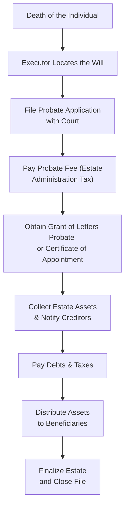

## 18.2 Probating a Will

It’s often said that making a will is an act of love for those you leave behind. But even the clearest will can require a formal process called probate to confirm its authenticity and to officially appoint an executor (often called an estate trustee or personal representative) to handle all those nitty-gritty tasks that arise when someone passes on. Sometimes people wonder, “Um, why bother with probate?” The short answer is that financial institutions, beneficiaries, and creditors need a legal assurance that the executor has authority to administer the estate. This section explores what probate is, why it matters, the different approaches across Canadian provinces, and some of the pitfalls and remedies that you or your clients may want to know about. Plus, I’ll throw in some personal thoughts on how you can (hopefully) avoid the trickier spots.

  
Overview of Probate  
-------------------

Probate is the legal process in which a court (in most provinces) or the Superior Court (in Quebec) recognizes a will’s validity (or, more formally, its authenticity). During this process, the executor is confirmed by the court and gains the legal power to administer the deceased’s estate. This includes:

• Identifying and valuing the assets.  
• Paying off any debts, taxes, or expenses.  
• Distributing the remainder to the rightful beneficiaries.

In common law jurisdictions—for example, Ontario, Alberta, British Columbia—this involves filing paperwork with the appropriate court, paying probate fees (sometimes called an estate administration tax), and obtaining what’s often called a Grant of Letters Probate or Certificate of Appointment of Estate Trustee. In Quebec, there’s a different framework: notarial wills don’t require probate, but other wills (like holograph or formally witnessed wills) generally need to be “verified” through the Superior Court of Quebec.

Personally, I recall serving as an executor for my aunt a few years ago—her estate was in Ontario. It was, well, a bit of a whirlwind. Even with the best intentions, it took time to gather all the accounts, confirm the property value, and file the correct court documents. Whenever I got stuck, my saving grace was leaning on a lawyer and accountant who specialized in estates. That’s the big takeaway: you don’t have to go it alone.

  
The Importance of Probate  
-------------------------

Creditors, financial institutions, and beneficiaries often want the reassurance that they’re dealing with the legitimate executor. Picture this: Suppose your friend Wanda passes away, and you believe you’re named as executor. You walk into the bank to move money from Wanda’s account to pay some funeral expenses. The bank manager looks at you and says, “Sorry, but we need to see the probated will to make sure you have the authority to do this.” That’s how important probate can be. Without that legal seal of approval from the court, banks and other institutions could face liability for releasing funds improperly.

Beyond establishing authority, probate:

• Helps protect the executor from future disputes.  
• Ensures that any challenges to the will’s validity are settled in a judicial process.  
• Provides transparency and official recognition of the estate’s personal representative.

In short, it’s the legal green light for estate administration.

  
Filing for Probate in Common Law Provinces  
------------------------------------------

The general process of filing for probate in common law provinces (Ontario, Alberta, British Columbia, etc.) typically includes:

• Locating the original will and confirming it is the deceased’s last valid will.  
• Filling out and submitting the probate application forms. Provincial court websites often list these forms (e.g., the Ontario Superior Court of Justice website).  
• Paying the probate fees or estate administration taxes, generally calculated based on the estate’s value.  
• Providing supporting documents, such as the deceased’s death certificate, affidavits from witnesses, and the executor’s oath (or pledge) that they will faithfully administer the estate.

Once granted, the executor receives the Grant of Letters Probate (or Certificate of Appointment of Estate Trustee). This document is gold—it tells everyone that yes, indeed, the executor can marshal the assets, deal with creditors, and distribute property to beneficiaries.

  
Filing for Probate in Quebec  
----------------------------

Quebec’s civil law system has some unique features:

• If the will is notarial (i.e., drafted and signed in front of a notary public in Quebec, duly registered in the notarial records), it usually does not require probate. A notarial will is essentially self-proving, because the notary keeps a validated copy and ensures it meets legal criteria.  
• Holograph wills (written entirely in the testator’s own handwriting) and wills made in the presence of witnesses still need to be verified by the Superior Court of Quebec.  
• The verification process—though simpler in many ways than a full probate procedure—nonetheless confirms the validity of these non-notarial wills.

  
Executor’s Responsibilities and Liabilities  
-------------------------------------------

Once you have that prized letter from the court, your next role as executor is to manage the estate responsibly. It’s not a small job—trust me, it can be quite overwhelming:

• Collect and value the estate’s assets.  
• Notify creditors, pay any outstanding bills, and handle taxes.  
• Create a record of all income, payouts, and expenses. This is no time to toss your receipts in the trash. Keep it nice and tidy!  
• Finally, distribute whatever’s left to the beneficiaries in line with the terms of the will.

It’s crucial to remember that the executor can be held personally liable if they fail to meet their duties, especially when it comes to paying taxes or safeguarding estate assets before distribution. For example, if you distribute asset shares to beneficiaries without ensuring the estate has enough available to pay a big tax bill, guess who might be on the hook? You, the executor. This is also why many executors say, “You know, let’s get some legal and accounting advice to be sure we do this right.”

  
Common Mistakes and Pitfalls  
-----------------------------

Probate can be nerve-wracking and full of hidden traps, especially if:

• The executor doesn’t keep proper records. Document every step, every receipt, every payment.  
• Beneficiaries suspect undue influence or question the testator’s mental capacity. Contested wills can get messy—like, multi-year legal battles messy.  
• There are unpaid debts that were overlooked. A creditor might come out of the woodwork and demand a slice of the estate after you thought you’d closed everything out.  
• There’s unclear or contradictory language in the will. If the will is ambiguous, the court might need to interpret the testator’s intended meaning.

  
Contesting the Will  
-------------------

Challenges to a will can arise for various reasons, including allegations that the testator lacked capacity or was under undue influence, or that the will fails to meet statutory formalities (like missing signatures or witness requirements). If a family member or other interested party contests the will during the probate process, the court may step in to hear arguments. This can delay the issuance of the Grant of Letters Probate or the Certificate of Appointment, sometimes for a long time.

It’s pretty heartbreaking whenever a family feud drags on in court—plus, it depletes the estate’s value. Mediation is often encouraged. Alternatively, testators might reduce the risk of a challenge by getting thorough legal advice when drawing up the will, using professional drafting services, and discussing plans openly with family members.

  
Working with Professionals  
--------------------------

Probate weaves together legal, financial, and sometimes tax complexities. Executors often consult:

• Lawyers (estate lawyers or notaries in Quebec) to navigate court forms and reduce the risk of mistakes.  
• Accountants to deal with final tax returns, estate tax returns, or capital gains calculations.  
• Financial planners (like you!) for guidance on how to handle distributions or investment assets until the estate is settled.

You can also check CIRO guidelines and bulletins on dealing with client estates and successor account authorities (https://www.ciro.ca). Although CIRO primarily oversees investment dealers, it offers valuable perspective on how to handle a deceased investor’s accounts, shares, or mutual fund holdings. Additionally, the Canadian Investor Protection Fund (CIPF) may come into play if the deceased had accounts with a CIRO-regulated firm that becomes insolvent.  

  
Case Study: Handling the Smith Estate  
-------------------------------------

Let’s say Mr. Smith passes away in British Columbia, leaving a will that names his daughter, Sarah, as executor. Mr. Smith had a stock portfolio, a house, and some debts and funeral expenses. Sarah:

1. Locates his will (signed by two witnesses).  
2. Checks with BC courts to learn about the process of filing probate paperwork and required forms.  
3. Engages a lawyer to help estimate the estate’s value for calculating probate fees (BC charges an estate administration tax that goes up depending on the total value).  
4. Submits relevant forms and pays the probate fees.  
5. Receives the Grant of Letters Probate, which she presents to the bank, brokerage firm, and any other asset holders.  
6. Gathers the assets, pays outstanding debts (including credit cards and final tax bills), and then, only after all obligations are done, distributes the remainder to beneficiaries named in the will.  

By following these steps carefully, Sarah avoids personal liability. She also keeps detailed records to provide a final statement of accounts, ensuring everyone’s in the loop on how Mr. Smith’s estate was administered.

  
Visualizing the Probate Process  
-------------------------------

Below is a simple Mermaid diagram to illustrate the typical flow of the probate process in a common law province. This is just a general overview (real life might have a few extra twists):

  
Tips to Minimize Delays or Challenges  
-------------------------------------

• Make sure the will is clearly drafted. A notarial will in Quebec or a well-witnessed will in other provinces helps reduce hassles.  
• Consider discussing your estate plans with your family or with those who’ll be affected. Surprises can lead to disputes.  
• Keep a separate folder of important documents—like insurance policies, investment accounts, property deeds—so that the executor can locate them easily.  
• If the estate is particularly large or complex, consider trusts or other planning techniques (see Sections 17.1 on Setting Up a Trust and 18.4 on Minimizing or Deferring Taxes Right before Death).  
• Check your beneficiary designations on RRSPs, TFSAs, and life insurance policies. Assets with named beneficiaries often bypass the estate and may not be subject to probate fees.

  
Potential Consequences of Avoiding Probate  
------------------------------------------

While it might be tempting to skip probate to dodge fees, resisting it can lead to bigger problems:

• Banks and other account custodians may refuse to release funds.  
• Real estate transactions might be blocked if the land registry requires a probated will.  
• You risk personal liability if distributions are made without following formal procedures.  
• Potential beneficiaries might contest your authority and cause legal trouble.

Sometimes families consider probate-avoidance strategies—like joint tenancy on property, naming beneficiaries outside the will, or setting up trusts. Some of these can be legitimate, but they shouldn’t be thrown together last-minute without proper advice. An improperly structured plan can lead to unintended results (like exposing assets to a child’s creditors or losing control over property).

  
Conclusion  
----------

Probating a will is an important safeguard to ensure that the deceased’s wishes are carried out fairly and lawfully. It may feel cumbersome, but as we’ve seen, it brings legitimacy and finality to estate administration. The golden rule is that executors should be transparent, organized, and diligent. Lean on lawyers and accountants if complexities arise. And if you’re planning your own estate, a carefully drafted will can reduce headaches (and heartbreaks) for those dealing with your affairs when you’re gone.

  
References and Additional Resources  
-----------------------------------

• CIRO Guidelines and Bulletins on Client Estate Administration:  
  – Website: [https://www.ciro.ca](https://www.ciro.ca)  

• Provincial Court Websites (for forms and procedures):  
  – Ontario Superior Court of Justice: [https://www.ontariocourts.ca/scj/](https://www.ontariocourts.ca/scj/)  
  – Court of King’s Bench in other provinces (formerly Queen’s Bench, name varies by jurisdiction).  

• Books:  
  – “Probate Kit for Ontario” by Mary-Alice Thompson and Clare Sullivan  
  – “How Probate Works” by Jeffrey Condon (U.S. focused, still offers valuable insights on the legal principles of probate)

• Refer to Chapter 17 (Trusts and Powers of Attorney) and the rest of Chapter 18 (Passing on the Estate) for broader strategies on estate planning, will preparation, and tax considerations.

  
Probate and Estate Administration Quiz: Test Your Knowledge
-----------------------------------------------------------



### Which of the following best describes the reason why many banks require a probated will?

- [ ] It acts as a receipt the executor pays the decedent’s debts.  
- [x] It confirms the executor’s legal authority to administer the estate.  
- [ ] It ensures the executor receives personal compensation for their work.  
- [ ] It sets a limit on the estate’s liabilities.  

> **Explanation:** Probate is primarily about confirming the executor’s authority under a legally valid will. Banks want to be sure they’re dealing with the rightful estate representative.

### What is one key difference in Quebec’s probate process compared to most other provinces in Canada?

- [ ] Quebec automatically exempts large estates from probate fees.  
- [ ] Quebec charges higher probate fees than any other province.  
- [ ] Quebec forbids wills witnessed by two individuals.  
- [x] Notarial wills in Quebec do not require probate, while holograph and witnessed wills do require court verification.  

> **Explanation:** Quebec’s civil law system recognizes the special status of notarial wills, so they generally skip probate, unlike holograph or witnessed wills which need court validation.

### Which of the following might cause a delay in obtaining a Grant of Letters Probate?

- [x] A beneficiary contests the will, alleging undue influence.  
- [ ] The executor elects to work with legal counsel.  
- [ ] A notary has witnessed the signing of the will in Quebec.  
- [ ] The deceased had at least one named beneficiary for RRSP assets.  

> **Explanation:** Contested wills can lead to lengthy legal proceedings, thereby delaying probate. Working with coherent legal processes does not necessarily cause delays unless there’s a dispute or improper documentation.

### Which statement best describes the executor’s duty when paying estate debts?

- [ ] Debts only need to be paid if beneficiaries agree to them.  
- [ ] Debts must be allocated evenly among beneficiaries.  
- [x] Debts must be settled before distributing assets to beneficiaries.  
- [ ] Debts never require special attention during probate.  

> **Explanation:** Paying off valid debts (including taxes) is a critical step before distributing estate assets, or the executor risks personal liability.

### Which factor does not typically require a probated will to be released?

- [ ] Bank accounts above certain thresholds.  
- [x] Assets held in joint tenancy with right of survivorship.  
- [ ] Stocks and bonds where ownership is solely in the deceased’s name.  
- [ ] Real estate registered under the deceased’s name alone.  

> **Explanation:** Joint tenancy with the right of survivorship usually transfers ownership directly to the surviving joint tenant, bypassing the estate.

### What is a primary reason an executor might consult a financial planner?

- [ ] To invalidate the will.  
- [ ] To locate hidden estate assets.  
- [ ] To replace the role of a lawyer.  
- [x] To structure and manage the estate’s investments during probate.  

> **Explanation:** A financial planner can help optimize the management and distribution of investments while ensuring the executor meets the estate’s objectives and timelines.

### Which statement accurately describes undue influence in estate planning?

- [ ] It’s the executor’s authority to direct beneficiaries’ financial decisions.  
- [x] It involves coercing someone into making or altering a will against their free will.  
- [ ] It’s a required element for witnessing a will.  
- [x] It can invalidate the will if proven.  

> **Explanation:** Undue influence happens when pressure is placed on the testator to change their will, compromising free choice. A court can deem the will invalid if undue influence is established.

### When might a legal dispute over the validity of a will most likely occur?

- [x] If family members claim the will was created under suspicious circumstances.  
- [ ] If the estate was fully distributed before death.  
- [ ] If the executor is a professional accountant.  
- [ ] If the will was typed and witnessed in accordance with provincial laws.  

> **Explanation:** Wills are typically contested when there’s suspicion of improper creation (capacity issues, undue influence), not simply from having a professional executor or following standard procedure.

### What is a major reason for having a holograph will verified by the court in Quebec?

- [ ] To confirm the notary’s signature.  
- [ ] To calculate the estate’s debt load.  
- [ ] To convert the will into a notarial will.  
- [x] To legally confirm its validity when it hasn’t been drafted by a notary.  

> **Explanation:** Holograph wills and wills made in the presence of witnesses in Quebec require court verification to ensure they comply with legal requirements and reflect the testator’s true wishes.

### Probate fees (estate administration taxes) in most provinces are calculated based on the estate’s:

- [x] Total value.  
- [ ] Number of beneficiaries.  
- [ ] Number of executors involved.  
- [ ] Date of probate.  

> **Explanation:** Probate fees often scale with the estate’s total value. This fee structure encourages individuals to explore planning strategies that might reduce probate exposure.


