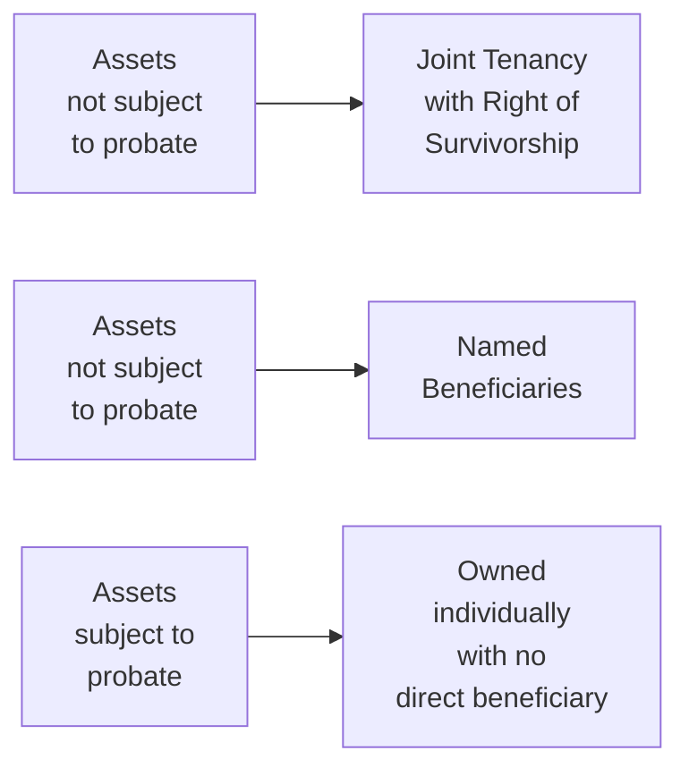

## 18.3 Reducing the Impact of Probate

Have you ever heard someone say, “I need to avoid probate!” or “I don’t want my assets to be stuck in the courts for months”? Well, if you’re nodding your head, don’t worry. You’re definitely not alone in wanting to streamline the process for distributing assets after death. Probate can sometimes be slow, and it generally comes with fees that can nibble away at the estate. The good news is there are lots of ways to lower these costs and hassles, especially if you plan carefully.

In Canada, probate fees (sometimes called “probate taxes” or “estate administration taxes”) can vary by province, and they might be charged as a one-time percentage on the total value of assets in the estate. Luckily, quite a few strategies exist to reduce or possibly eliminate the probate tax on specific assets. Let’s dive into the details, shedding light on legal, financial, and practical considerations.

But heads up, none of this is intended to replace professional advice. Seriously—if you or your clients want to make big changes, it’s essential to consult with a qualified legal or tax professional, especially considering different provincial rules (and let’s not forget upcoming regulatory changes or personal complexities).

---------------------------------------------
### Understanding Probate and Its Role
Probate is the legal process where a court verifies a will’s validity and confirms the executor’s authority to act on behalf of the deceased’s estate. If there’s no will, the probate process can be even more critical for designating someone to administer the estate. Now, you might be thinking, “Why bother avoiding this essential process?” Well, the key reason is cost. Provinces or territories charge probate fees that can be a percentage of the estate’s total value. Even though they might seem minor at first, these fees can add up and put a sizable dent in the assets you pass on (especially if your estate is large).

But it’s not only about money. The probate process can also be time-consuming. When an asset bypasses the estate altogether—like through a designated beneficiary or joint ownership—it’s often accessible to survivors more quickly and without the fuss of probate. Let’s walk through some popular strategies.

---------------------------------------------
### Joint Ownership with Right of Survivorship (JTWROS)

It’s pretty common to hold assets—like a family home or a bank account—in joint names with a spouse or someone else you trust. When you hold property as Joint Tenants with Right of Survivorship (JTWROS), upon the death of one owner, the property typically passes directly to the surviving owner without going through probate. This arrangement is widely used outside Quebec for interspousal arrangements. Here’s a quick personal story: I once had a client who added her adult child as a joint tenant on a condo. After her passing, the condo title transferred automatically to her child without the probate delay—saving time and fees that might otherwise have been levied on that asset.

But like many good things in life, JTWROS can be complicated:
• Outside Quebec: Generally recognized and used, especially between spouses.  
• Within Quebec: Joint tenancy with right of survivorship is not recognized in the same manner, so careful legal review is vital.  

Also, if you add a non-spouse or a non-dependent as a joint owner, you may create unintended tax consequences—like a deemed disposition for half the asset, resulting in potential capital gains triggered right away. So, weigh the pros and cons carefully and consult with professionals before making such moves.

---------------------------------------------
### Beneficiary Designations

Another common way to keep certain assets out of probate is by naming direct beneficiaries on:
• Registered Retirement Savings Plans (RRSPs)  
• Registered Retirement Income Funds (RRIFs)  
• Tax-Free Savings Accounts (TFSAs)  
• Life Insurance Policies  
• Some forms of non-registered segregated fund contracts  

If the named beneficiary survives the original account holder, the asset typically goes straight to them, bypassing the estate. This is super handy in reducing probate fees (or avoiding them altogether) on these registered accounts or insurance benefits.

However, watch out for unintended consequences. For instance, if you name your children on your RRIF, and your will states that everything else goes to your spouse, you might accidentally create an imbalance among your heirs. Plus, there can be tax obligations on registered accounts if you don’t designate a spouse or dependent beneficiary who qualifies for a rollover. Always align your beneficiary designations with your overall estate plan.

---------------------------------------------
### Trust Planning

Trusts can get really interesting—and a bit intimidating—because they’re flexible but can also be complicated. Overall, there are two broad categories:
• **Inter Vivos Trust:** Created while you’re alive (e.g., a family trust).  
• **Testamentary Trust:** Set up in your will, taking effect after your death.

When assets are placed in a trust, ownership shifts from you (personally) to the trust. Since those assets typically don’t form part of your estate upon death, probate is not (usually) needed for those assets. This also allows you to control distribution details, especially helpful if you want to ensure money goes to beneficiaries like minor children or individuals who might need help managing finances.

But, trust planning requires careful drafting, tax planning, and professional advice. For instance, a trust might file its own tax returns and be subject to specific rules around taxation (like the 21-year deemed disposition rule for inter vivos trusts). If you’re not an estate or tax expert, definitely work with a specialized lawyer or accountant to set everything up.

---------------------------------------------
### Spousal Rollovers

While spousal rollovers don’t directly reduce probate fees the same way joint ownership or beneficiary designations may, they’re worth mentioning in the context of estate planning. Under the Canadian Income Tax Act, certain eligible assets can roll over to the surviving spouse or common-law partner on a tax-deferred basis—meaning they won’t trigger capital gains taxes right away.

Even though that’s more about deferring or reducing taxes rather than sidestepping probate fees, it plays a big role in maximizing your estate’s overall value. Imagine you have a large Registered Retirement Savings Plan (RRSP). If you name your spouse as beneficiary, they can typically roll it into their own RRSP or RRIF on a tax-deferred basis. This ensures the legacy you pass on is stronger—fewer taxes means potentially more money for your loved ones.

---------------------------------------------
### Corporate Ownership Structures

Clients who own corporations can leverage corporate structures to help reduce probate fees on personal assets if done properly. Let’s say an individual holds shares in a holding company or sets up a family trust that owns certain assets. In some cases, those assets are no longer part of the shareholder’s personal estate, so the full value of those assets is not subject to probate. However, the arrangement might require ongoing corporate governance and compliance, which can be time-consuming and include certain fees of its own.

Also, watch out for potential pitfalls:
• Inadvertent changes to the control of the corporation  
• Shareholder agreements that conflict with your will  
• Complex obligations if minors or non-residents are involved  

So, yes, corporate ownership can trim down probate, but it’s best done with a thorough legal structure in place.

---------------------------------------------
### Insurance Strategies

Permanent life insurance policies that pay a tax-free death benefit to a named beneficiary often bypass the estate altogether, which typically avoids probate. This is a popular way to provide immediate liquidity for your heirs—something they can use to cover funeral costs, outstanding debts, or other obligations while the rest of the estate settles.

A quick personal observation: I’ve seen situations where families used the life insurance proceeds to pay off the mortgage immediately after the policyholder passed away. The rest of the home’s value then transferred via the estate to the children. Because the life insurance was paid out quickly and avoided probate, the money arrived in time to handle crucial bills—no waiting, no red tape.

Of course, if the insurance payout is intended to pay the deceased’s personal taxes or other liabilities, those responsibilities don’t magically vanish. The estate must still handle those. However, designating a beneficiary can mean the proceeds are protected from claims by estate creditors (subject to certain provincial rules). Always confirm details with a qualified insurance agent or advisor to ensure the arrangement meets your needs.

---------------------------------------------
### Common Pitfalls and Best Practices

While these techniques can be powerful, consider the following do’s and don’ts:

• **Coordinate with your will.** Avoid contradictory statements between your will and your beneficiary designations; you don’t want confusion or potential legal disputes.  
• **Communicate with your executor or loved ones.** Let your executor know where to find important documents and how your assets are structured.  
• **Double-check provincial rules.** Probate fees, rules on joint ownership, and recognition of certain trust structures can vary. Quebec’s unique civil law system is a prime example.  
• **Watch out for tax triggers.** Adding someone as a joint owner might cause a deemed disposition, and naming a beneficiary might shift the tax burden to your estate or other beneficiaries.  
• **Review regularly.** Life changes—births, deaths, divorces—can affect your estate plan. So, do a periodic check-up.

---------------------------------------------
### Practical Example: The Smith Family Estate Plan

Let’s create a fictional scenario, focusing on key aspects:

John and Mary Smith own a home worth $700,000 in Alberta and have an RRSP each, plus a joint chequing account. They want to reduce the impact of probate for their future estate. Here’s what they consider:

1. **Joint Ownership (JTWROS):** They hold the family home as joint tenants, so when either John or Mary passes away, the surviving spouse inherits it without probate.  
2. **Beneficiary Designations:** Each of them names the other as beneficiary on their RRSP. If Mary passes first, her RRSP rolls over to John’s RRSP tax-deferred.  
3. **Life Insurance:** Mary takes out a $300,000 permanent life insurance policy with John as the beneficiary. Upon her death, the proceeds immediately go to him, bypassing her estate.  
4. **Testamentary Trust in Their Wills:** They plan that if both pass away at or around the same time, a trust will be created in their wills for their minor grandchildren. This trust would keep the funds for the kids’ benefit until they reach 22.  
5. **Periodic Review:** They agree to revisit these designations every 2–3 years or if any big life changes occur (like births, marriages, or divorces in the family).

With this plan, the Smiths have significantly minimized potential probate fees—and they’ve streamlined how their assets will transfer to loved ones.

---------------------------------------------
### Visualizing Key Strategies

Below is a simplified diagram to illustrate how different assets might be labeled “subject to probate” or “not subject to probate”:

• “Joint Tenancy with Right of Survivorship” and “Named Beneficiaries” typically avoid probate.  
• Solely owned assets with no beneficiary might require going through the estate and paying probate fees.

---------------------------------------------
### Summary of Key Takeaways

• **Probate**: The legal process to validate the will and confirm the executor. Comes with time and fees.  
• **Joint Ownership (JTWROS)**: Allows property to pass directly to the survivor, but potential tax implications for adding a joint owner who isn’t a spouse or dependent.  
• **Beneficiary Designations**: Excellent for RRSPs, RRIFs, TFSAs, and insurance policies. Make sure they align with your overall plan.  
• **Trust Planning**: Can reduce the value of assets passing through your estate, but must be set up carefully to avoid unintended tax consequences.  
• **Spousal Rollovers**: Deferred taxation for certain registered accounts or capital property passing to a spouse or common-law partner.  
• **Corporate Structures**: For those who own businesses, it might reduce personal holdings subject to probate, but it’s complex and requires careful setup.  
• **Insurance Strategies**: Proceeds are generally tax-free, pass directly to beneficiaries, and skip probate (with a named beneficiary).  

---------------------------------------------
### Glossary

- **Joint Tenancy with Right of Survivorship (JTWROS):** A form of co-ownership (outside Quebec) where the surviving owner(s) automatically inherit the deceased owner’s share.  
- **Inter Vivos Trust:** A trust set up during the lifetime of the settlor.  
- **Testamentary Trust:** A trust created through a will that takes effect upon death.  
- **Spousal Rollover:** A provision under the Income Tax Act allowing tax-deferred transfer of eligible assets to a surviving spouse.  
- **Segregated Funds:** Insurance-based investment products that may pass outside the estate if a beneficiary is named.  

---------------------------------------------
### Further Resources and References

• **CIRO**: Check out CIRO documents regarding estate transfers, as MFDA and IIROC merged into the Canadian Investment Regulatory Organization effective in 2023. You can browse official guidelines on beneficiary changes and more at  
  [https://www.ciro.ca](https://www.ciro.ca)

• **Income Tax Act (Canada)**: For details on spousal rollovers and trust rules, see  
  [https://laws-lois.justice.gc.ca/eng/acts/I-3.3/](https://laws-lois.justice.gc.ca/eng/acts/I-3.3/)

• **CRA Publications**: The Canada Revenue Agency publishes helpful guides on trusts and estates, including T4013 (T3 Trust Guide). View them here:  
  [https://www.canada.ca/en/revenue-agency/services/forms-publications.html](https://www.canada.ca/en/revenue-agency/services/forms-publications.html)

• **Additional Reading**:  
  - “Wealth Planning Strategies for Canadians” by Manulife Investment Management  
  - “Estate Planning with Trusts, Enduring Powers of Attorney and Wills” (various provincial bar associations offer free guides)

---------------------------------------------
So that’s the big picture. While tossing around terms like “probate fees” and “joint tenancy” might seem overwhelming at first, remember that a strategic approach—often guided by professionals—can spare your loved ones hassle, time, and sometimes a hefty chunk of money. Setting up your estate properly doesn’t just bring financial benefits; it also provides peace of mind knowing your estate will pass smoothly to the people or causes you cherish most.

And hey, if you’re feeling even a tiny bit uncertain, call a licensed advisor or legal professional. Reducing the impact of probate is worth the extra conversation and planning time, especially if it means preserving more of your hard-earned assets for those you care about.

---------------------------------------------

## Test Your Knowledge: Probate Minimization Strategies in Canada



### Which of the following assets will generally bypass probate if properly designated?

- [ ] A house owned by the deceased with no joint ownership
- [x] An RRSP with a specific beneficiary named
- [ ] A chequing account with no beneficiary
- [ ] Art collection owned solely in the deceased’s name

> **Explanation:** Registered accounts with a named beneficiary—like an RRSP—will normally pass outside the estate, thereby bypassing probate.

### Which statement is correct in relation to Joint Tenancy with Right of Survivorship (JTWROS) in Canada?

- [x] It is recognized outside Quebec and passes the deceased’s interest directly to the surviving joint owner.
- [ ] It is recognized uniformly across all Canadian provinces, including Quebec.
- [ ] It only applies when the joint owners are siblings.
- [ ] It applies only to personal chattels, not real property.

> **Explanation:** JTWROS is generally recognized outside Quebec for real property and other assets, allowing the surviving joint owner to inherit automatically without probate.

### When establishing a trust during your lifetime (an inter vivos trust), what is the primary advantage regarding probate?

- [ ] Holding title to your home personally
- [x] Assets placed in the trust do not form part of your estate upon death and typically avoid probate
- [ ] Saving on income tax every year
- [ ] Ensuring that your executor is automatically appointed

> **Explanation:** Assets in an inter vivos trust do not typically pass through your estate, so they avoid probate when you die.

### How can a spousal rollover help in estate planning?

- [ ] It immediately imposes capital gains tax on the estate.
- [ ] It ensures an RRSP is distributed equally among all surviving children.
- [x] It allows qualifying assets to transfer tax-deferred to a surviving spouse.
- [ ] It has no tax-deferral benefits and must be avoided.

> **Explanation:** Under the Income Tax Act (Canada), certain assets can be rolled over tax-deferred to a surviving spouse, which helps reduce immediate tax burdens on the estate.

### Which of the following is often used to provide immediate liquidity and could bypass probate if a beneficiary is named?

- [ ] Real estate property
- [x] A permanent life insurance policy
- [ ] Shares in a personal holding company
- [ ] A testamentary trust

> **Explanation:** If a beneficiary is named, the death benefit from life insurance typically bypasses the estate and is paid out directly, thus avoiding probate.

### What is a key difference between inter vivos trusts and testamentary trusts?

- [x] Inter vivos trusts are created during the settlor’s lifetime, while testamentary trusts arise after the settlor’s death.
- [ ] Inter vivos trusts cannot hold real estate.
- [ ] Testamentary trusts must be registered with CIRO.
- [ ] Inter vivos trusts are invalid in Canada.

> **Explanation:** An inter vivos trust is established while the settlor is alive, and a testamentary trust comes into effect after death, typically through the will.

### Under Quebec law, how does joint ownership differ from other Canadian provinces?

- [ ] Quebec uses the exact same JTWROS system as Ontario.
- [ ] Quebec only allows JTWROS for married couples.
- [x] Quebec generally does not recognize JTWROS in the same manner, requiring alternative legal structures.
- [ ] Quebec disallows any type of real estate joint property ownership altogether.

> **Explanation:** Quebec’s civil law does not recognize JTWROS the same way other common-law provinces do, so different legal strategies are necessary.

### In a corporate ownership structure, how might shareholders reduce the probate fees on certain assets?

- [ ] By ensuring all assets are solely owned by individuals
- [x] By placing assets under a holding company or a family trust
- [ ] By registering all shares in multiple provinces
- [ ] By avoiding any formal entity structure

> **Explanation:** Utilizing a holding company or a family trust can move certain assets outside an individual’s personal estate, potentially lowering probate fees.

### Which scenario might inadvertently trigger capital gains during estate planning?

- [x] Adding a non-spouse child as a joint owner of property, causing a deemed disposition
- [ ] Naming a surviving spouse as the sole beneficiary of an RRSP
- [ ] Purchasing a permanent life insurance policy with the spouse as beneficiary
- [ ] Funding a testamentary trust with assets after the settlor’s death

> **Explanation:** Adding a non-spouse or non-dependent child as joint owner may create a deemed disposition on half the asset’s value, leading to possible immediate capital gains taxation.

### True or False: A named beneficiary for a segregated fund will generally have those proceeds bypass probate.

- [x] True
- [ ] False

> **Explanation:** Segregated funds are insurance contracts. When a beneficiary is properly named, proceeds usually bypass the estate and probate.


