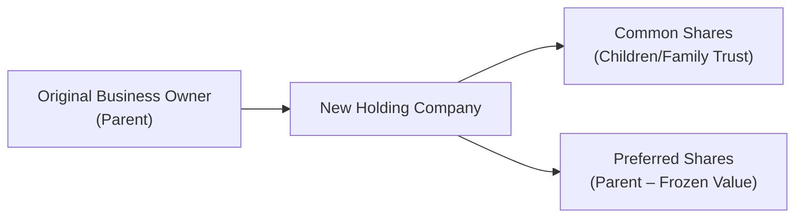

## 18.4 Minimizing or Deferring Taxes Right before Death

Thinking about taxes may not be at the top of anyone’s “fun list,” let alone when facing end-of-life matters. But trust me, taking the time to plan for potential tax exposure can make all the difference to your loved ones. In my own family, I remember sitting around my grandmother’s kitchen table—big mugs of tea in hand—listening to my uncle talk about his frustration with estate taxes that had caught him by surprise. That’s exactly the type of scenario we want to avoid if possible.

When we talk about “minimizing or deferring taxes right before death,” we’re referring to strategies that reduce the immediate tax burden on an estate or shift that tax liability into the future. Ultimately, this can preserve more wealth for heirs and make life a little simpler for everyone involved. Let’s explore the tools available to achieve these goals. 

---
  
### Strategic Charitable Gifting

Charitable giving is one of the most powerful tools in tax planning before death, and honestly, it can also be a wonderful way to leave a legacy that aligns with your personal values. In Canada, charitable donations to registered charities generate donation tax credits. We’ll decode the idea step-by-step.

#### Types of Charitable Donations

• Cash Donations: You’ll receive a tax receipt for the amount donated.  
• Donation of Publicly Traded Securities: If you donate publicly traded securities (like shares listed on a stock exchange) directly to a registered charity, any associated capital gains are typically exempt from tax. This scenario might eliminate capital gains taxes otherwise triggered upon the sale of those securities, all while generating a charitable donation tax receipt for their fair market value.

#### How It Works

1. You transfer the securities “in kind” to the charity (i.e., no sale transaction in your hands).  
2. You receive a donation receipt for the full fair market value of the donated securities.  
3. You can apply the resulting non-refundable tax credit to reduce current year tax liability or carry it forward for five years.

If someone has significant capital gains built up, charitable gifting can help both the charity and the donor’s estate. It’s a feel-good approach and can drastically reduce the taxable income that might hit just before or upon death.

---
  
### Triggering Gains or Losses

It might feel a bit strange to consider selling assets intentionally near the end of life. Yet, there are perfectly valid reasons to do so. Let’s say you expect higher tax rates in the future, or you’re anticipating new, more stringent tax requirements. In that case, you might decide to realize capital gains now (sometimes called crystallizing gains) or realize losses to offset other gains.

1. **Capital Loss Harvesting**: By selling an investment at a loss, you create a capital loss that can be used to offset other capital gains. This is a common strategy near year-end, but it can also be used right before death if you want to reduce the overall tax burden on the final return or capital gains triggered by deemed dispositions upon death.  
2. **Crystallizing Gains**: Maybe you’re in a lower tax bracket this year compared to what might happen to your estate tax bracket at death (especially if you have large RRSP balances or property gains). By selling (or otherwise triggering the gain) while alive, you lock in a tax rate that could be more favorable than what your estate would face.

Pro tip: This is not a move you do willy-nilly. Seeking guidance from a certified tax professional is crucial because selling assets prematurely might have other unintended consequences (like missing out on future growth).

---
  
### Transfer of Property to Family Members

When we’re talking about transferring property, whether it’s a treasured family cottage or an investment portfolio, the tax rules can get complicated because of something known as the “attribution rules.” Generally, if you transfer or gift assets to a spouse or a minor child, future capital gains and income might be attributed back to you for tax purposes. 

However, in some cases, transferring property to adult children, grandchildren, or other family members at fair market value can be strategic. You might realize a capital gain or loss, but that might work in your favor if you’re trying to minimize the taxable value of your estate down the line or if you have capital losses you want to use up. 

• **Fair Market Value (FMV) Sales**: Selling (or gifting) an asset at FMV locks in the gain or loss. This could be a beneficial approach if your estate is likely to be in a higher tax bracket after your passing.  
• **Avoid “Non-Arm’s-Length” Pitfalls**: The Canada Revenue Agency (CRA) is vigilant about transactions that could undermine legitimate tax collection. If you transfer property to a related party for less than FMV, the CRA deems it as a sale at FMV. That means you can’t just set a bargain-basement price to reduce the tax. They’ll generally treat it as though you received FMV anyway, and the buyer’s cost base might be differently assessed.  

Remember that “attribution rules” are in place to prevent abuse. If you transfer property into, say, your spouse’s name for income-splitting reasons, that income may end up being attributed back to you. For bigger estates, you might want to talk to a lawyer specializing in estate planning to ensure you don’t end up with a big tax bill you weren’t expecting.

---
  
### Holding Corporations or Family Trusts

If you’ve been chatting with your financial advisor or tax professional, chances are the phrase “estate freeze” has come up. Essentially, an estate freeze is used to lock in the current value of the business or asset for the owner (often called the “freezor”), while the future growth of that asset transfers to others (often children, grandchildren, or a family trust).

#### The Concept of an Estate Freeze

An estate freeze can help manage or defer taxes by capping the value on which the original owner will pay tax in the future. Let’s break it down with a quick example:

• Parent owns a small business valued at $1 million today but which will likely be worth $2 million in five years.  
• Through an estate freeze, the parent exchanges common shares (the original growth shares) for preferred shares that are “frozen” at the current $1 million value.  
• New common shares are typically issued to a family trust or children, capturing all future growth.  
• Upon death, the parent’s tax exposure is effectively limited to that frozen $1 million in capital value (plus any subsequent adjustments), not the potentially doubled or tripled future value of the business.

Below is a small flowchart that shows a simplified estate freeze structure:

The parent stops any further growth from accruing on the shares they hold, and that prospective upside goes to the kids or a trust. It’s complicated, yes—but also a powerful planning tool, especially for owners of family businesses, farms, or large holdings. Of course, none of this is an overnight procedure; it involves the assistance of both a tax lawyer and a valuation expert to ensure compliance with the Income Tax Act and to follow relevant corporate laws.

---
  
### Beneficiary Review

If you have registered accounts in Canada—like RRSPs, RRIFs, TFSAs, or even life insurance policies—naming or reviewing your beneficiary designations can make a huge difference to the final tax outcome. Here’s how:

• **Spousal Rollover**: By naming a spouse or common-law partner as the beneficiary of your RRSP or RRIF, you can defer taxable income. The funds can roll over to the spouse’s plan, and expenses that might otherwise be due immediately can be postponed until they eventually withdraw the funds.  
• **Children or Grandchildren**: Sometimes, particularly with TFSAs or insurance policies, naming children or grandchildren as direct beneficiaries allows those funds to bypass probate entirely and can also reduce the taxation within the estate.  
• **Successor Holder on TFSAs**: A spouse or common-law partner can be named as a “successor holder” for TFSAs, which means that upon your death, the TFSA stays tax-sheltered without affecting the spouse’s own TFSA contribution room.

Regularly reviewing beneficiary designations is essential because life changes—marriages, divorces, births of children, the passing of a previously named beneficiary, etc.—can all shift your priorities. You don’t want an outdated designation that triggers an unintended tax scenario or that leaves someone out inadvertently.

---
  
### Life Insurance Options

I remember a friend’s father passing away with a large tax bill tied to a family business. They ended up having to liquidate part of the business to pay the CRA. It’s not a fun place to be in. Life insurance can be a powerful tool to ensure your loved ones have enough liquidity to deal with tax liabilities at death.

• **Term Life Insurance**: Generally cheaper premiums for a set period (e.g., 10, 20, 30 years). It can be used to provide a simple, cost-effective way to cover taxes.  
• **Permanent Life Insurance**: Products like Whole Life or Universal Life allow you to build up a cash value. Premiums can be much higher, but these policies can form part of a broader estate plan (especially if you have large and illiquid assets, like a family business or real estate).  
• **Using Insurance Proceeds**: The policy’s proceeds are typically paid out tax-free, allowing your estate or named beneficiaries to quickly pay off any taxes owing. That way, your heirs aren’t forced into a fire sale of your assets.

---
  
### Practical Examples and Real-World Scenarios

Below are several vignettes to illustrate how these strategies might be applied.

#### Example 1: Strategic Charitable Securities Donation
• Margaret, age 75, owns $100,000 worth of publicly-traded shares with an adjusted cost base of $20,000.  
• If she sold them, she’d face capital gains tax on $80,000 of gains (50% of that is taxable).  
• Instead, she donates the shares directly to a registered charity.  
• This results in no capital gains tax, and she receives a $100,000 tax receipt.  
• Her final tax bill is reduced, and the donation credit can offset other taxable income.  

#### Example 2: Triggers Gains Early
• Carlos has an investment property that has doubled in value. He suspects property values could keep rising but also worries that if he holds it until death, the higher FMV at that time will result in a bigger tax liability for his estate.  
• He decides to sell the property now at a locked-in gain.  
• He pays capital gains tax at his current marginal rate, which he’s comfortable with.  
• He then invests the net proceeds in a more liquid portfolio to ensure his estate has enough cash to handle future expenses or taxes.

#### Example 3: Transfer to a Child at FMV
• Nadia owns a separate condo unit that she wants her daughter to have eventually.  
• Rather than wait for a deemed disposition at Nadia’s death, they arrange a sale at fair market value now.  
• Nadia triggers the capital gain, but that works for her because she also has capital losses to apply from previous investments.  
• Her daughter then takes official ownership of the condo sooner and can manage it, live in it, or rent it out.

#### Example 4: Estate Freeze Principles
• Helene runs a small but fast-growing tech startup.  
• She’s worried about the looming tax bill if she dies with the shares worth significantly more in five years.  
• She opts for an estate freeze: exchanging her growth shares for new preferred shares with a redemption value equal to today’s FMV.  
• Her children subscribe for new common shares, capturing future growth.  
• If Helene passes away, her taxable amount is based on the value at the freeze date, effectively limiting the capital gains for her estate.

---
  
### Advantages, Pitfalls, and Things to Watch Out For
      
• **Advantages**:  
  – Reducing immediate or future tax loads.  
  – Preserving more capital for heirs.  
  – Supporting charities or philanthropic causes in a tax-effective way.  
  – Improving liquidity for final taxes or immediate estate needs.  

• **Pitfalls**:  
  – Complex rules and potential for CRA scrutiny, especially around attribution or non-arm’s-length transactions.  
  – Inadvertent triggers of capital gains or losing out on future asset appreciation.  
  – Overreliance on life insurance without reviewing changing needs or beneficiary designations.  
  – Inadequate professional planning leading to errors or omissions in documents.  

• **Best Practices**:  
  – Regularly review beneficiary designations.  
  – Keep lines of communication open with family members or executors.  
  – Work with qualified professionals (tax accountants, estate lawyers) who understand Canadian regulations, including the changes in self-regulatory organizations. (As of 2025, the Canadian Investment Regulatory Organization (CIRO) is the national self-regulatory body overseeing investment dealers and market integrity for equity and debt marketplaces. Former SROs like the Mutual Fund Dealers Association (MFDA) and the Investment Industry Regulatory Organization of Canada (IIROC) are now defunct.)  

---
  
### A Quick Note on Canadian Regulations

If you want to dive deeper, the official Government of Canada CRA portal (<https://www.canada.ca/en/revenue-agency.html>) has resources for individuals who are planning for end-of-life tax obligations. Each province’s bar association—like the Law Society of Ontario or the Barreau du Québec—also offers guidelines, educational publications, and professional directories for estate lawyers.  

Although referencing specific self-regulatory organizations (SROs) like the MFDA or IIROC is now strictly historical, it’s important to note that CIRO (the Canadian Investment Regulatory Organization) oversees the national framework. If you’re dealing with investment professionals, confirm they’re regulated by CIRO, and remember that the Canadian Investor Protection Fund (CIPF) is Canada’s sole protection fund for clients of insolvent welcome-members.  

---
  
### Glossary

• **Estate Freeze**: A tax strategy in which an individual “freezes” the current value of their holdings and transfers the future growth to someone else, often children or a trust.  
• **Attribution Rules**: Provisions under the Canadian Income Tax Act that “attribute” certain taxable amounts (income, capital gains, etc.) back to the original owner who transferred the asset, especially when dealing with spouses or minor children.  
• **Capital Gain vs. Capital Loss**: The increase (gain) or decrease (loss) in value of an investment from purchase to sale. In Canada, 50% of a net capital gain is included in taxable income, whereas capital losses can offset gains.  
• **Tax Credit**: Reduces your payable tax on a dollar-for-dollar basis. For example, charitable donations generate donation tax credits against your total tax liability.  

---
  
### Additional Resources

• **CRA Tax Planning**:  
  Visit <https://www.canada.ca/en/revenue-agency.html> for official guidance on end-of-life tax issues.  

• **Trust and Estate Law**:  
  Explore provincial bar association websites (e.g., Law Society of Ontario, Barreau du Québec) for estate planning guides and directories of specialized lawyers.  

• **Books & Articles**:  
  – “Tax and Family Business Succession Planning” by PricewaterhouseCoopers  
  – “Charitable Giving in Canada” by Imagine Canada  

• **General Regulation**:  
  – Stay current with the new self-regulatory organization (CIRO) at <https://www.ciro.ca>, replacing the former MFDA and IIROC as of 2023.  

---

### Conclusion

Minimizing or deferring taxes right before death is truly about proactive and empathetic planning. It’s one of those areas where a relatively small investment of time—and a deliberate conversation with financial experts—can produce immense benefits for loved ones later. From donating publicly traded securities to orchestrating estate freezes or reviewing beneficiary designations, each step helps ensure your tax obligations are predictable and manageable.

These topics can seem daunting, but remember: you don’t have to figure it all out alone. Talk to your accountant, financial advisor, or estate lawyer. They can guide you through complex scenarios, highlight opportunities you might have missed, and craft a customized strategy that reflects your values and financial goals.

And if you ever start feeling overwhelmed, just picture that warm kitchen, the big mugs of tea, and the reassuring voice of someone who’s walked this path before. Because when it comes to estate planning, you’re not just dealing with numbers—you’re preserving a legacy of care and foresight for the people you love.

---

## Test Your Knowledge: Minimizing or Deferring Taxes Right before Death



### Which of the following best describes an estate freeze?  
- [ ] A strategy for purchasing life insurance to minimize taxes.  
- [x] A method for capping the current value of a business or asset and transferring future growth to others.  
- [ ] A procedure that eliminates all capital gains taxation for seniors.  
- [ ] A technique for automatically converting RRSPs to RRIFs.  

> **Explanation:** An estate freeze locks in (“freezes”) the value of an existing asset, so future growth belongs to other parties, thus limiting the original owner’s eventual tax liability.

### What is the principal tax benefit of donating publicly traded securities directly to a registered charity?  
- [ ] The taxpayer must include 75% of the capital gain as taxable.  
- [x] The capital gains on donated securities are exempt from tax, plus the donor gets a full charitable tax receipt.  
- [ ] It increases the cost base of the donor’s remaining shares.  
- [ ] There is no tax benefit; a donation of securities is identical to a regular cash donation.  

> **Explanation:** When donating publicly traded securities in kind, the capital gain is not taxed, and the donor also receives a tax receipt based on fair market value.

### Which statement about capital loss harvesting is correct?  
- [ ] It involves selling assets at the highest possible price to realize maximum gains.  
- [x] It is the practice of intentionally selling assets at a loss to offset capital gains.  
- [ ] It can only be done on December 31 of each year.  
- [ ] It is illegal under Canadian tax laws.  

> **Explanation:** Capital loss harvesting is a legitimate strategy where investors sell assets with accrued losses to offset gains, potentially reducing taxes owing.

### When transferring property to a related family member at less than fair market value, the Canada Revenue Agency (CRA) treats the transaction:  
- [x] As if it occurred at fair market value for calculating taxable capital gains.  
- [ ] Exactly as per the declared transfer price, regardless of fair market value.  
- [ ] As a dividend distribution subject to withholding tax.  
- [ ] As a capital loss no matter what the sale price is.  

> **Explanation:** The CRA typically deems the transfer to have occurred at fair market value. If the declared transfer price is lower, the difference is ignored for tax calculation purposes.

### Regarding beneficiary designations, which of the following can help defer taxation on registered plans after the owner’s death?  
- [x] Naming the surviving spouse as beneficiary or successor annuitant.  
- [ ] Naming the estate as beneficiary and distributing equally among children.  
- [x] Rolling funds over to a spousal RRSP or RRIF.  
- [ ] Converting the RRSP to a TFSA.  

> **Explanation:** By naming the spouse or common-law partner as beneficiary or successor annuitant, the registered plan can roll over, deferring any taxes until the spouse withdraws the funds.

### What is a potential downfall of using an estate freeze improperly?  
- [x] It may inadvertently trigger an unwanted capital gain if improperly structured.  
- [ ] It guarantees no future capital gains at all.  
- [ ] It’s only allowed once per person under Canadian tax law.  
- [ ] It cannot be used in conjunction with family trusts or holding companies.  

> **Explanation:** An estate freeze should be implemented carefully with professional guidance. If structured incorrectly, it can cause unexpected capital gains, potential double taxation, or fail to achieve the intended freeze benefits.

### Life insurance in estate planning is primarily used to:  
- [x] Provide liquidity to cover final taxes and other obligations.  
- [ ] Promote faster capital appreciation of investment portfolios.  
- [x] Ensure an efficient transfer of wealth with minimized tax.  
- [ ] Eliminate probate fees automatically.  

> **Explanation:** Life insurance proceeds are typically tax-free, which can cover estate tax liabilities. Moreover, it aids in wealth transfer strategies but does not directly appreciate investment portfolios or automatically remove probate costs.

### Why might someone “crystallize” capital gains before death?  
- [x] To lock in gains at a preferable tax rate today rather than a potentially higher rate later.  
- [ ] To avoid capital gains entirely.  
- [ ] To comply with mandatory CRA regulations that force the sale of assets every five years.  
- [ ] To reduce the number of beneficiaries in an estate.  

> **Explanation:** Crystallizing gains is a common tactic to manage or defer taxes over time, especially when current personal marginal rates might be lower than expected rates at death.

### An “estate freeze” is most frequently employed by individuals:  
- [x] Who want to manage or defer tax on assets (like a family enterprise) expected to grow in value.  
- [ ] Who only have an RRSP or TFSA and no non-registered assets.  
- [ ] Who have minimal assets and no investment portfolio.  
- [ ] Who already own 100% of the shares of a public corporation.  

> **Explanation:** Estate freezes are especially relevant for private business owners or those holding assets likely to increase in value. They help shift future growth (and tax) to the next generation.

### True or False: Under the new Canadian regulatory framework, the Mutual Fund Dealers Association (MFDA) and IIROC still exist as separate entities in 2025.  
- [x] True  
- [ ] False  

> **Explanation:** This is a bit of a historical nuance. The MFDA and IIROC amalgamated into the Canadian Investment Regulatory Organization (CIRO), but references to the former SROs are valid only historically. By 2025, CIRO is the recognized single self-regulatory body, making references to MFDA and IIROC purely historical.


