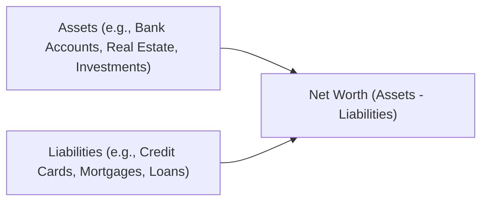

## 2.1 Net Worth Planning

Picture this scenario: you’re hanging out with your friend—let’s call her Maya—who’s busy chatting about building her dream life. She’s saving for a condo, maybe dreaming of a small business venture, and focusing on paying down her student loans. At one point, she blurts out, “I have zero clue if I’m really making progress!” This is where the concept of “net worth” swoops in to save the day. Planning around net worth not only helps Maya evaluate where she stands financially but also points her toward a pathway of steady growth.

Net worth boils down to one very simple formula: total assets minus total liabilities. But behind that straightforward calculation lies a rich tapestry of decisions—how to value real estate, which debts to prioritize, and how often to track everything so you’re not caught by surprise. Let’s walk through the basics, step by step.

---

Understanding Net Worth

At its core, net worth is a single snapshot that reflects an individual’s overall financial health. If you imagine your finances as a balance scale, “assets” go on one side—what you own—while “liabilities” go on the other side—what you owe. Tip the scale in your favor, and you’ve got a comfortable net worth. Have too many debts? Then your net worth sinks below zero. That can be an “Oh, no!” moment for sure. But here’s the bright side: with some strategy and follow-through, most people can nudge their net worth upward over time.

You might ask, “So, what exactly counts as an asset?” Typically, we’re talking about bank account balances, investment portfolios, real estate, vehicles (although cars depreciate over time), and even intangible items like a part of a business. On the liabilities side, you want to list everything from credit card balances to mortgages, car loans, lines of credit, student loans, or personal loans. Once you line them all up, subtract the liabilities from the assets. Zip, zap, boom—that is your net worth.

---

Gathering Client Information

In professional financial planning, the starting point is to collect comprehensive and accurate details about all of a client’s assets and liabilities. I remember once helping a relative who thought he had a “good handle” on everything, only to discover random store credit accounts and a tiny inherited piece of land worth more than he realized. So, thoroughness matters!

When you’re helping a client (or yourself!), here are a few steps to consider:

• Collect account statements for checking, savings, and investment accounts.  
• List property holdings (even timeshares).  
• Include vehicles, boats, or RVs.  
• Don’t forget personal property such as jewelry or collectibles if they have significant value.  
• Tally up every loan or outstanding debt. Don’t miss the smaller ones.  
• Remember to note interest rates and associated costs, because sometimes an expensive interest rate on a small loan can have a big impact.

---

Categorizing Assets and Liabilities

Once you’ve gathered all those details, it’s time to sort them into categories. One of the most useful distinctions is between liquid and non-liquid (illiquid) assets:

• Liquid assets: Assets that can quickly be turned into cash—like cash in your chequing account, money market funds, T-bills, or a short-term GIC nearing maturity. Having enough liquid assets around is super helpful when emergencies pop up—like a basement flood or an unexpected medical expense.  
• Non-liquid assets (illiquid): Assets like real estate, collectibles, or even certain business holdings. These might grow in value over time, but you usually can’t unload them quickly without incurring fees or accepting a lower price.

Let’s also not forget that liabilities can differ in urgency and interest rate structure. Some appear as short-term obligations, like a credit card bill, while others hang around for decades, like a mortgage. Grouping your liabilities by interest rate or by repayment period can help you identify where you might want to tackle debt first.

---

Estimating Fair Market Value

Estimating fair market value for assets can get tricky. With stocks or mutual funds, you have a relatively clear market price. But for real estate, business shares, art, or that special edition collectible figurine you’ve had since childhood? The “real” price might change if market conditions shift, or if you decide to sell in a rush. Sometimes, clients overestimate the worth of a property because they’ve done endless renovations, only to find that the local real estate market doesn’t fully reward those enhancements. Likewise, business interests can be complicated to measure due to intangible assets or contractual obligations.

If you suspect an item’s value is uncertain, encourage your client (or yourself) to seek a professional appraisal or at least a second opinion. It’s all about having a reality check. Overvaluing or undervaluing assets can skew net worth calculations, leaving you with a misleading sense of security—or panic.

---

Analyzing Liabilities

Liabilities are the goosebumps on your financial plan’s arms: you might wish they didn’t exist, but they do. The key is to know them well. First, identify each loan or debt, how much is owed, its interest rate, payment schedule, fees, and penalties. Then, consider potential strategies:

• Debt consolidation: Merging multiple debts into a single lower-interest loan.  
• Refinancing: Replacing an old loan with a new one, possibly at a lower interest rate.  
• Snowball method or avalanche method: Paying down smaller debts first or targeting the highest interest debts first.  

By understanding your liability structure, you’re in a better position to plan. For instance, if your mortgage is locked in at a comfortable rate, that might not be your biggest concern. But a high-interest credit card you use to fund your monthly brunch habit might be the first thing to tackle.

---

Visualizing the Net Worth Calculation

Sometimes pictures speak louder than words. Below is a simple Mermaid.js diagram that can help illustrate the net worth calculation structure:

In this diagram, net worth is open to both sets of influences—the good (assets) and the not-so-great (liabilities). When you’re working with a client, or even for yourself, you want those asset arrows to outweigh the liabilities arrow over time.

---

Preparing and Reviewing a Net Worth Statement Regularly

A net worth statement is effectively a balance sheet for your personal life. And—just like businesses produce quarterly or annual reports—doing this at least once a year is a best practice. Many folks revisit their net worth around tax season or at a major life milestone—like a career change, the purchase of a new house, or the birth of a child.

Even if your net worth statement is just a simple spreadsheet, the act of writing items down cements awareness. GnuCash, an open-source tool (https://www.gnucash.org/), can help you manage your finances and generate net worth statements. It’s free, so that’s a plus for many people just getting started.

---

Setting Goals to Increase Net Worth

Why is net worth so important, anyway? Well, a strong net worth can open doors, from better loan terms—if your debt-to-equity ratio looks good—to peace of mind about retirement. Perhaps you want to eventually quit your job and run a side business, or you dream of ramping up philanthropic giving. An expanding net worth can help fuel all of that.

Encourage yourself or your clients to set feasible goals. For instance:

• Paying down high-interest debt first—like that 19% interest credit card.  
• Building up an emergency fund of liquid assets.  
• Making consistent investment contributions to a Tax-Free Savings Account (TFSA) or an RRSP.  
• Adopting more aggressive (but still measured) investment strategies once stable.  

A side note: Don’t discount those intangible benefits of a positive net worth. Emotional well-being, confidence, negotiation power—these rarely pop up in a spreadsheet but can be game-changers in real life.

---

Refinancing and Other Strategies

Refinancing isn’t just about house mortgages (though that’s a big one). You can also refinance car loans or student loans if you spot better rates. Do keep an eye out for penalties, though. Some lenders charge you for breaking the original agreement early. In other words, read the fine print.

Beyond refinancing, here are other approaches that might help:

• Consolidation: If you have multiple credit cards with high interest, sometimes it’s cheaper to roll them into a single line of credit with a lower rate.  
• Lump-sum payments: If you get a holiday bonus or a tax refund, you could pop it directly onto your debts to reduce the principal faster.  
• Portfolio rebalancing: If your investments have soared in value, maybe you can liquidate some growth and pay down high-interest debt or invest in a more diversified manner.

---

Case Study: Jenny’s Real Estate Dilemma

Let’s illustrate how net worth planning can be valuable. Meet Jenny, who’s excited about her condominium in downtown Toronto. She bought it five years ago, and condo prices have soared in her area during that time. Jenny thinks it might be time to sell, pocket her profits, and move to a quieter suburb to reduce monthly expenses.

1. Jenny calculates her net worth before and after a potential sale. Right now, her condo is valued at around $700,000 with a remaining mortgage of $400,000. That’s $300,000 in equity.  
2. She also has $20,000 across a few bank and investment accounts (liquid assets).  
3. Her other liabilities are her car loan ($5,000 left) and a small student loan ($4,000).  

So, doing the math:  
• Total assets = $720,000 ($700,000 condo + $20,000 cash/investments).  
• Total liabilities = $409,000 ($400,000 mortgage + $5,000 car loan + $4,000 student loan).  
• Net worth = $720,000 – $409,000 = $311,000.

If she sells the condo and relocates, she might reduce her mortgage by buying a lower-priced property; she’d also possibly reduce her monthly living costs. As part of that net worth strategy, Jenny would aim to invest additional funds for retirement or further pay down her car loan or student debt. The bigger picture: a net worth statement gives her a snapshot to weigh possible outcomes before making a major choice.

---

The Importance of Regular Check-ins

Financial planning isn’t a one-and-done scenario. Life changes, markets go up or down, and personal priorities shift. Maybe you add a new child to your family, or you decide to launch a business, or you receive an inheritance. Each event can radically change your asset-liability mix. By making it a habit—annually or quarterly—to revisit your net worth statement, you can stay on track and be nimble in adjusting your financial plan.

---

Common Pitfalls and How to Avoid Them

• Overestimating asset values: We might assume our property or art collection is worth a fortune—but the market might think otherwise.  
• Underestimating debt: Optional credit lines or store credit often remain “hidden” until you add them up.  
• Not planning for unexpected costs: Car repairs, medical bills, or natural disasters can quickly erode your liquidity.  
• Ignoring small liabilities: 10 small liabilities can become a big problem if you’re not paying attention.  
• Neglecting to update frequently: Revisit your statement, especially when interest rates or personal circumstances change.

---

Tying Net Worth Back to Financial Goals

If your net worth grows each year, you’re likely on a healthy path. If it’s stagnant or—gulp—slipping downward, you might need to reassess. Are you overspending? Did you take on too much debt to finance a lifestyle you can’t sustain? Or maybe you’re funneling money into assets with big potential but uncertain near-term growth.

This ties deeply into all sorts of financial planning elements—like tax planning (see Chapter 6 for further insights) or retirement readiness (see Chapter 8). If you have robust net worth, possibly you can retire earlier or with greater comfort. Alternatively, you might want to invest in life insurance to safeguard your family’s net worth (see Chapter 10 and 11). In short, net worth is like the drumbeat underlying all these financial instruments.

---

References and Further Exploration

If you’re curious to learn more, or if you want to hone your net worth planning, here are some resources:

• Financial Consumer Agency of Canada (FCAC): https://www.canada.ca/en/financial-consumer-agency.html  
  - Offers practical guidance on understanding banking products, credit cards, budgets, and more.  

• Canada Revenue Agency (CRA): https://www.canada.ca/en/revenue-agency.html  
  - When you sell assets or convert them to cash, the CRA website can help clarify potential tax implications.  

• Canadian Investment Regulatory Organization (CIRO): https://www.ciro.ca  
  - The current self-regulatory body overseeing Canadian investment dealers and market integrity.  

• GnuCash: https://www.gnucash.org/  
  - An open-source program that’s excellent for creating net worth statements, tracking expenses, and more.  

• Books:  
  - “The Wealthy Barber” by David Chilton — a classic that uses storytelling to illustrate key financial concepts.  
  - “Stop Over-Thinking Your Money!” by Preet Banerjee — a modern, approachable take on personal finance and net worth building.  

---

Glossary

Net Worth: The total sum of one’s assets minus liabilities.  
Liquid Assets: Assets quickly converted to cash (e.g., savings accounts, T-bills).  
Non-Liquid Assets (Illiquid Assets): Assets that can’t be converted to cash easily (e.g., real estate, collectibles).  
Liabilities: Debts or obligations—for instance, a mortgage, car loan, or credit card balance.  
Refinancing: Replacing an existing loan with a new one, often at better terms.  
Fair Market Value: The likely price an asset would fetch under normal market conditions.  
Financial Goal: A personal target for finances—like hitting a specific net worth by a certain age.  
Equity: The value of an asset (like a home) minus the debt owed on that asset.

---

Best Practices and Encouragement

It’s entirely possible to feel intimidated by net worth planning, especially if your debt feels insurmountable or if you’re unsure what your assets are truly worth. But trust me—gaining even a simple awareness of your net worth can be like switching on a flashlight in a dark room. You’ll see which corners are messy and which are tidy. The next step is simply to clean up the messy spots.

Whether you’re an absolute beginner or a seasoned finance professional, net worth planning never goes out of style. It’s part of the fundamental building blocks for every other facet of financial planning. Over time, as your net worth evolves, you’ll notice how it intersects with your risk profile (Chapter 1.5), your debt planning strategy (Chapter 3), and your mortgage decisions (Chapter 4). Keep on top of it with regular updates, and always remain open to adjusting your strategies. That’s how you’ll keep moving forward—a step at a time.

---

## Test Your Knowledge: Net Worth Planning Essentials



### Which of the following most accurately defines net worth?
- [ ] Total assets × total liabilities
- [x] Total assets – total liabilities
- [ ] Total liabilities – total assets
- [ ] Total income – total expenses

> **Explanation:** Net worth is calculated by subtracting total liabilities (all outstanding debts) from total assets (everything you own).  

### What is the main reason to categorize assets into liquid and non-liquid?
- [ ] To reduce tax obligations immediately
- [x] To determine how quickly assets can be converted into cash
- [ ] To hide certain assets from creditors
- [ ] To inflate the stated net worth

> **Explanation:** Categorizing assets highlights how quickly you can access funds if needed, which is vital for emergency planning and liquidity analysis.  

### Which of the following is a recommended best practice for net worth planning?
- [ ] Refuse to include intangible personal assets
- [x] Prepare and review a net worth statement at least annually
- [ ] Inflate the purchase value of all assets
- [ ] Consolidate liquid and non-liquid assets into a single category  

> **Explanation:** Regular reviews (e.g., annually) allow you to track progress and make adjustments as needed.  

### Why might someone refinance a debt?
- [ ] To avoid having to pay interest altogether
- [ ] To reduce their net worth
- [ ] Because all lenders require regular refinancing
- [x] To get a better interest rate or improve loan terms

> **Explanation:** Refinancing allows borrowers to replace an existing loan with a new one that may offer better terms or lower interest rates, potentially saving money.  

### Which statement best describes the advantage of knowing your fair market value for assets?
- [ ] It guarantees the exact amount you’ll receive upon selling
- [ ] It makes your net worth appear larger than it really is
- [ ] It eliminates the need to track liabilities
- [x] It gives a more realistic and accurate calculation of net worth

> **Explanation:** Understanding fair market value helps ensure your net worth calculation isn’t overstated or understated.  

### Which of the following is a liquid asset?
- [x] A money market account
- [ ] A vacation home
- [ ] An antique car
- [ ] A coffee shop you own

> **Explanation:** A money market account is easily converted to cash, which makes it a liquid asset.  

### A key reason to update your net worth statement after major life events is:
- [ ] To increase your tax rate
- [x] To account for significant changes in assets or liabilities
- [ ] To avoid reviewing old statements
- [ ] Because net worth calculations automatically adjust on their own  

> **Explanation:** When your personal or financial circumstances change significantly—like buying a house, starting a business, or inheriting assets—your net worth also changes; an updated statement is essential for accurate tracking.  

### If a client decides to consolidate her credit card debts, she is typically aiming to:
- [x] Reduce the overall interest cost
- [ ] Increase monthly payments
- [ ] Eliminate all liabilities in one go
- [ ] Hide debts from credit agencies

> **Explanation:** Consolidation often merges higher-interest debts into a single loan or line of credit with a lower rate, thus reducing ongoing interest expenses.  

### Which of the following is an example of a non-liquid (illiquid) asset?
- [ ] Chequing account
- [ ] Short-term GIC maturing tomorrow
- [ ] Cash in hand
- [x] Rental property

> **Explanation:** A rental property cannot be quickly converted to cash without a longer sale process, closing costs, and possible market fluctuations.  

### True or False: Building a strong net worth position can help secure more favorable loan terms.
- [x] True
- [ ] False

> **Explanation:** Lenders often consider a borrower’s net worth when determining loan conditions. A higher net worth typically indicates lower credit risk, which may lead to more favorable terms.  


