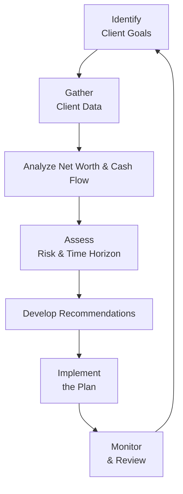

## 2.2 Create a Comprehensive Financial Plan

Imagine sitting down at your kitchen table with a stack of bills, your laptop open to a host of online banking tabs, and a lingering feeling of, “Okay, but how do I put all this together?” This moment—somewhat stressful, maybe even a bit overwhelming—is where the joys (and challenges) of creating a comprehensive financial plan truly begin. In Canada, a comprehensive financial plan aims to tie together every element of your financial life. It’s not just about net worth or budgeting; it’s also about thinking strategically for the future, whether that includes retirement, education savings, or simply building a buffer for unexpected hiccups. So let’s figure out how we do this step by step.

----------------------------------
## Understanding the Concept of a Comprehensive Financial Plan

A comprehensive financial plan is like a big puzzle: each piece—net worth, cash flow, taxes, investments, risk management, estate planning—must fit perfectly with the others to create a clear, supportive picture of your financial well-being. If one piece is missing or broken, the entire plan may falter.

Basically, we start by asking: “What do you (or your client) want to achieve?” Once the goal is crystal clear (it might be paying off a mortgage before retirement, traveling the world after 60, or sending a child to an Ivy League school), the rest of the plan is built around that vision. From there, we figure out constraints, like risk tolerance—how much volatility can you stand?—and time horizons—when you need the funds. Sprinkle on top your tax situation, insurance concerns, and any special legal documents you’ve got, and you’re on your way to a thorough plan.

Here is a high-level Mermaid diagram that illustrates the typical steps involved:

- A["Identify  Client Goals"]: Understand the client’s aspirations—short, medium, and long term.
- B["Gather  Client Data"]: Collect net worth statements, budgets, tax documents, insurance policies, etc.
- C["Analyze Net Worth & Cash Flow"]: Evaluate assets, liabilities, expenses, and income to ensure a realistic baseline.
- D["Assess  Risk & Time Horizon"]: Gauge risk tolerance and time frames for investment or savings objectives.
- E["Develop Recommendations"]: Provide targeted solutions for savings, debt planning, insurance, investment, tax strategies, and more.
- F["Implement  the Plan"]: Put the recommendations into action, step by step.
- G["Monitor  & Review"]: Review progress and adapt as personal, economic, or regulatory conditions shift.

----------------------------------
## Step 1: Clarify Short-, Medium-, and Long-Term Objectives

Alright, let’s begin with the fun part: dreaming big about your objectives. Maybe you have multiple short-term goals (like paying off a high-interest credit card), medium-term goals (like saving for your child’s college costs), and long-term goals (like retiring with a comfortable nest egg). It’s vital to lay them out in order of priority.

• Short-Term Goals (up to 1 year): Examples include building an emergency fund or paying off small high-interest loans.  
• Medium-Term Goals (2–5 years): Could involve saving for a home down payment, or perhaps setting funds aside for a wedding.  
• Long-Term Goals (5+ years): Typically revolve around retirement planning, major real estate acquisitions, or philanthropic aspirations.

I once worked with a friend who wanted to do everything at once: buy a new car, pay off student loans, and invest for retirement. We realized we needed to untangle these goals, prioritize each, and map a timeline. That’s how we made sure she wasn’t biting off more than she could chew.

----------------------------------
## Step 2: Recognize Your Constraints—Risk Tolerance, Time Horizon, and Liquidity

Every individual has unique constraints that must be built into the plan. If I had a nickel for every time someone jumped into the “next big stock opportunity” without considering risk tolerance, I’d probably retire already! The point is: you have to account for how comfortable you are with market fluctuations, how soon you need to tap into your money (time horizon), and how easily you need to convert your assets to cash (liquidity).

• **Risk Tolerance**: If big market ups and downs keep you awake at night, it might be best to focus on stable, low-volatility investments, such as certain fixed-income instruments. Meanwhile, if you’re comfortable riding out the storms, equities may play a bigger role.  
• **Time Horizon**: The number of years until you need the funds. Greater time horizons can support higher-risk, higher-growth potentials. Shorter time horizons call for safer, more liquid choices.  
• **Liquidity Needs**: If you anticipate major outflows in the near future (say you want to renovate a kitchen soon), keep enough cash or equivalent assets on hand to avoid forced selling at an inopportune time.

----------------------------------
## Step 3: Gather All Relevant Documents and Information

This is the detective work side of financial planning. A comprehensive plan must reflect your entire financial reality. Gather:

• **Net Worth Statement:** A snapshot of your assets and liabilities.  
• **Cash Flow Statement (Budget):** Tracks your income, expenses, and savings patterns.  
• **Investment Portfolios:** Details regarding current assets, such as mutual funds, ETFs, stocks, GICs, or alternative investments.  
• **Insurance Coverage:** Life insurance, disability, critical illness, property & casualty, etc.  
• **Tax Documents:** Recent tax returns to understand your marginal tax rates, past capital gains or losses, and potential tax credits or deductions.  
• **Legal Agreements:** Wills, trusts, shareholder agreements, and powers of attorney.  
• **Estate Planning Documents:** If relevant, to ensure inheritance or legacy goals align with other aspects of the plan.

Often, as a financial planner in Canada, you’ll also want to check the client’s central credit file for outstanding obligations or lines of credit. Use this info to highlight any red flags—like a monthly negative balance that signals overspending.

----------------------------------
## Step 4: Identify Gaps in the Current Strategy

Your analysis might reveal a few missing pieces—like no emergency fund or an inadequate insurance policy. Or maybe the client is paying way too much in high-interest debt and can’t contribute to an RRSP (Registered Retirement Savings Plan). Possibly, their portfolio is overweight in a single sector or asset class, exposing them to undue risk.

Common gaps include:

• Lack of Emergency Funds: Usually, we recommend three to six months’ worth of living expenses be set aside in a liquid account.  
• Insufficient Insurance: Check coverage for life, disability, critical illness, or long-term care.  
• Unoptimized Tax Planning: Missed opportunities for tax-sheltered or tax-deferred growth, or ignoring beneficial income-splitting strategies.  
• Overconcentration in Portfolios: For instance, a portfolio loaded with Canadian resource stocks but lacking global diversification.  
• No Estate Plan: Some clients never get around to drafting a will or naming beneficiaries on key accounts.

Addressing these gaps early not only prevents big headaches down the road but also provides immediate peace of mind.

----------------------------------
## Step 5: Develop Specific Recommendations, Timelines, and Action Steps

Now we’re cooking with gas. Once you have the goals outlined and the data gathered, you can build recommendations. This might look like a multi-page, user-friendly plan that states:

1. **Emergency Fund**: For example, “Within the next six months, set aside $10,000 in a high-interest savings account to cover at least three months of living costs.”  
2. **Debt Reduction**: “Prioritize paying down the credit card with a 19% interest rate while making minimum payments on other debts. Consolidate or refinance if possible.”  
3. **Insurance Optimization**: “Review life insurance coverage to ensure your spouse is protected in case of unexpected events. Consider disability coverage if your job doesn’t provide it.”  
4. **Investment Strategy**: “Shift 20% of the equity allocation into an international equity ETF for better geographic diversification. Maintain 10% in cash or near-cash for short-term goals.”  
5. **Tax Planning**: “Maximize RRSP contributions to reduce taxable income. Investigate if a Tax-Free Savings Account (TFSA) or spousal RRSP can help with income splitting.”  
6. **Estate Planning**: “Consult with a lawyer to update your will, add beneficiaries on any unregistered accounts, and assign a power of attorney for property and personal care.”

Make these steps as specific as possible. If you just say “pay off debt,” well, how much each month and over how long? That’s the difference between a plan that sits in a drawer collecting dust and one that truly changes people’s lives.

----------------------------------
## Step 6: Stress-Test the Plan for Unforeseen Events

Life is full of surprises—job loss, health emergencies, or home repair disasters can strike without warning. Stress-testing your plan means asking, “What if something bad happened tomorrow?” Then you see how your strategy would hold up.

• **Job Loss Scenario**: Do you have enough emergency funds or accessible lines of credit to get you through three months or more?  
• **Market Downturn**: How would a 20% or 30% drop in equities affect your retirement timeline?  
• **Health Emergency**: Do you have disability or critical illness coverage to pay bills if you’re out of work temporarily?

Even though it’s impossible to prepare for every single curveball, building some “shock absorbers” into your plan can drastically limit the financial fallout. And it sure helps you sleep better at night.

----------------------------------
## Step 7: Implement, Monitor, and Adjust

Once your recommendations are on paper, it’s time to take action. This may involve:

• Setting up automatic transfers to a savings account.  
• Rebalancing investments on a specified schedule.  
• Consolidating debt or refinancing a mortgage.  
• Purchasing or updating necessary insurance policies.  
• Meeting with a legal professional to draft or revise wills and powers of attorney.

Financial planning is iterative. You can’t just set it and forget it. Market conditions will change, interest rates may fluctuate, and personal circumstances evolve—weddings, children, divorces, relocations, promotions, or perhaps an unexpected windfall. Reviewing the plan at least annually (semiannually if you can) helps keep everything aligned.

----------------------------------
## Working Within CIRO’s Best Practices and Regulations

Since January 1, 2023, the Mutual Fund Dealers Association of Canada (MFDA) and the Investment Industry Regulatory Organization of Canada (IIROC) amalgamated into one entity, the Canadian Investment Regulatory Organization (CIRO). CIRO is now the recognized national self-regulatory body that oversees investment dealers, mutual fund dealers, and market integrity on Canadian marketplaces. 

When putting together your comprehensive financial plan, remain mindful of client suitability rules mandated by CIRO. Suitability means ensuring your recommended strategy aligns with the client’s personal and financial circumstances, risk profile, and objectives. Also, if you are a professional, maintain robust documentation and a consistent review process to comply with CIRO guidelines. For official updates or external references, you can refer to [CIRO’s website](https://www.ciro.ca).

----------------------------------
## Common Pitfalls and How to Avoid Them

1. **Overlooking Cash Flow**: Net worth statements are super helpful, but if someone’s monthly spending outstrips their income, that shortfall can sabotage long-term savings.  
2. **Forgetting Inflation**: If you’re planning for retirement 20 years out, ignoring inflation can drastically underfund your future needs.  
3. **Ignoring Tax Adjustments**: This can happen when individuals jump between brackets without rethinking contribution strategies for RRSPs or TFSAs.  
4. **Incomplete Communication**: If you’re working with a couple, not addressing the goals or risk tolerance of both parties can create friction.  
5. **Procrastination**: The plan is worthless if you never implement or review. Don’t let “analysis paralysis” get in your way.

----------------------------------
## Real-World Scenario: A Case Study

Let’s say we have Cynthia and Mark, a couple in their late 30s living in Toronto. Both have stable jobs, and they come in wanting to “get serious” about retirement plus put something away for their toddler’s education.

1. **Goals**: Retire comfortably by age 60; start an RESP (Registered Education Savings Plan) for their child; pay off their mortgage by 55.  
2. **Constraints**: They have moderate risk tolerance (neither thrills nor chills them to see big market swings). Their time horizon for retirement is 20+ years.  
3. **Key Data**: They have $15,000 in credit card debt at 19%, an existing mortgage with 2.8% interest, and about $40,000 in TFSAs combined.  
4. **Gaps**: Minimal life and disability insurance; no RESP set up; no formal estate plan.  
5. **Recommendations**:  
   - Make extra monthly payments on the high-interest credit card until paid in full within 12 months.  
   - Redirect the $200 monthly freed from debt payments to an RESP to capture the Canada Education Savings Grant (CESG).  
   - Optimize their RRSP and TFSA contributions by each focusing on RRSP to reduce taxes (they’re in a higher bracket), while using TFSAs for accessible emergency savings.  
   - Increase life insurance coverage to match current salary levels and purchase disability insurance for Mark, who doesn’t have coverage at work.  
   - Meet with a lawyer to draft wills and set up guardianship instructions for their child.  
6. **Implementation**: They start automatic monthly transfers for the debt, set up the RESP contributions online, and purchase an appropriate term life insurance policy.  
7. **Review**: Six months later, the credit card debt is cut in half. One year later, it’s gone. Meanwhile, the RESP has begun to accumulate government grants. Their net worth is improving, and they review the plan annually to keep track of progress.

This kind of systematic approach ensures Cynthia and Mark remain on a clear path—one that can be adjusted if interest rates jump or if Mark decides to change careers.

----------------------------------
## Tools and Resources

Crafting a comprehensive plan often involves a mix of professional guidance and personal management tools:

- **Official Regulatory Guidance**: [CIRO](https://www.ciro.ca) for updates on regulations and guidelines in Canada.  
- **Financial Advisory Credentials**: Consider the Certified Financial Planner (CFP) program from [FP Canada](https://www.fpcanada.ca/) if you’re a finance professional seeking deeper expertise.  
- **Budgeting Software**: Free and open-source tools such as [KMyMoney](https://kmymoney.org/) or paid solutions like Quicken to track income, expenses, and net worth.  
- **Books & Courses**: The “Canadian Securities Course (CSC®) Volumes 1 & 2” by CSI or advanced texts from the Financial Planning II (FP II) program to deepen investment and regulatory knowledge.  
- **Online Calculators**: Various banks and credit unions in Canada offer free calculators for mortgage payments, RRSP vs. TFSA contributions, and net worth projections.

----------------------------------
## Best Practices for Ongoing Success

• **Keep Communication Open**: If you have a spouse or partner, plan together to avoid misalignment.  
• **Review Regularly**: Conduct annual or semiannual check-ins to recalibrate for life events and market changes.  
• **Stay Educated**: The Canadian financial landscape evolves—from tax rules to regulatory updates from CIRO. Keep learning.  
• **Work with Experts**: Engage with qualified financial planners, accountants, and lawyers to address complex areas like estate freezes, advanced tax planning, or high-net-worth portfolio strategies.  
• **Document Everything**: Keep records of each recommendation, so you can revisit your original rationale when the market or personal landscape changes.

----------------------------------
## Quick Glossary Recap

• **Comprehensive Financial Plan**: A multi-faceted strategy that ties all aspects of personal finance—net worth, cash flow, investments, tax, risk management—together.  
• **Risk Tolerance**: The degree of market volatility you’re comfortable with.  
• **Time Horizon**: The number of years until you require the funds.  
• **Emergency Fund**: Cash/investments set aside for unplanned events (usually 3 to 6 months of expenses).  
• **Suitability**: Ensuring recommendations match a client’s personal situation, goals, and comfort levels.  
• **Stress Test**: Evaluating how your plan might hold up during adverse events (market downturns, job loss, illness).

----------------------------------
## Conclusion

Crafting a comprehensive financial plan is a bit like painting a mural: you start with a broad sketch of your vision, then fill in the details to create a vivid, enduring piece of art. Each brushstroke—your net worth analysis, your risk assessment, your insurance coverage—plays a role in the bigger picture. Sure, it takes time, expertise, and maybe a bit of patience. But in the end, the sense of security and clarity you gain is priceless.

Building such a plan in Canada means understanding unique regulatory frameworks (now guided by CIRO) and leveraging a wide range of tools, from TFSAs and RRSPs to specialized insurance products. So don’t be afraid to dream big—just balance that dream with practicality, vigilance, and periodic reviews. Do that, and you’ll have a robust roadmap that can guide you (or your clients) through life’s unpredictable twists and turns, hopefully with a sense of confidence and calm along the way.

----------------------------------

## Test Your Knowledge: Comprehensive Financial Planning Essentials



### Which of the following MOST accurately describes a comprehensive financial plan?

- [ ] A quick method for tracking daily expenses
- [ ] A single investment product to maximize returns
- [x] A multi-faceted strategy considering net worth, cash flow, risk, insurance, and tax 
- [ ] A short-term budgeting guideline for emergency situations only

> **Explanation:** A comprehensive financial plan is holistic, addressing multiple areas like net worth, budgeting, risk profiles, investments, insurance, taxation, and more.

### Someone who is extremely uncomfortable with market volatility is described as having:

- [ ] A large time horizon
- [ ] A flexible liquidity requirement
- [x] A low risk tolerance
- [ ] No specific investment preference

> **Explanation:** Risk tolerance indicates how much fluctuation in investment returns someone can handle. “Extremely uncomfortable” indicates low risk tolerance.

### Which of the following items is typically NOT included when gathering data for a comprehensive financial plan?

- [ ] Net worth statement
- [ ] Insurance policies
- [ ] Tax returns
- [x] Resume outlining the individual’s job history in detail

> **Explanation:** While employment information is relevant, a detailed resume isn’t typically required. More pertinent are items like net worth details, insurance policies, tax documents, and current investment assets.

### What is the recommended general range of emergency funds for an average household?

- [ ] 1 year of total expenses
- [x] 3 to 6 months of living expenses
- [ ] 12% of pre-tax annual salary
- [ ] 20% of monthly net earnings

> **Explanation:** Financial advisors often suggest setting aside 3 to 6 months’ worth of expenses to cover unforeseen events.

### A client with a 15-year time horizon and a moderate risk tolerance might:

- [x] Invest in a balanced portfolio combining equities and fixed income
- [ ] Keep all assets in a daily savings account
- [x] Diversify across national and international equities
- [ ] Invest strictly in speculative penny stocks

> **Explanation:** With a moderate risk tolerance and a fairly long time horizon, a balanced and diversified approach that includes both equities and fixed income is usually suitable.

### Stress-testing a financial plan for a market downturn primarily helps ensure:

- [x] That you understand how your portfolio would perform in adverse conditions
- [ ] You never suffer any losses
- [ ] The tax benefits are indefinite
- [ ] No need for insurance coverage

> **Explanation:** Stress-testing helps evaluate vulnerabilities in the plan under challenging market conditions, offering valuable insights for risk mitigation.

### What regulatory requirement ensures client recommendations align with their circumstances?

- [x] Suitability
- [ ] Leverage
- [ ] Capitalization
- [x] Regulatory compliance

> **Explanation:** “Suitability” ensures all recommendations are tailored to the client’s goals, risk tolerance, and financial situation. (Note: Two possible correct answers are combined here—“suitability” and “regulatory compliance” are distinct, but in the context, “suitability” is the primary requirement.)

### Under which condition might a financial plan require an immediate update?

- [x] Significant life event like divorce or inheritance
- [ ] Surpassing the annual RRSP contribution limit
- [ ] The weather turning cold
- [ ] Getting lower utility bills in winter

> **Explanation:** Major life changes—new child, marriage, divorce, big inheritance, or even a career change—often require an immediate review and update.

### Why is it crucial to consider both spouses’ viewpoints in a comprehensive financial plan?

- [ ] Only one spouse usually earns income
- [ ] To minimize confusion about who spends how much
- [x] To align goals, risk tolerance, and spending patterns to prevent future conflict
- [ ] It isn’t necessary in most cases

> **Explanation:** Including both spouses ensures the plan reflects everyone’s goals and risk preferences, improving cooperation and reducing friction later.

### A “time horizon” in financial planning means:

- [x] The number of years before the funds will be needed
- [ ] The largest possible investment return
- [ ] How quickly you can convert assets to cash
- [ ] The ratio of equity to fixed-income holdings

> **Explanation:** Time horizon measures the length of time until the specific funds are required, which is critical in determining an appropriate investment strategy.


