## 2.3 Cash Management Planning

Cash management planning is one of those areas of personal finance that sometimes goes overlooked. We've all had those moments—maybe it’s the week before payday, and you realize you forgot to pay the internet bill, right? Or perhaps you’ve got more “month at the end of your money” than you expected. But almost everyone, from students with part-time jobs to busy parents juggling multiple income sources, benefits from a good cash management plan. Let’s dive into how to collect and organize your daily income, expenses, and short-term assets in a way that keeps your financial house in tip-top shape.

---
### Why Cash Management Matters

Cash management is about more than just paying your bills on time—though that’s certainly part of it. It’s about ensuring that your money works for you in the short term as effectively as possible. We’re talking about:

• Collecting and managing all your income sources in a centralized manner.  
• Monitoring your spending—what’s going out and when it’s going out.  
• Maintaining liquidity so you can meet unexpected expenses without derailing your financial progress.  
• Allocating surpluses (if you’re fortunate to have them) to savings or investment vehicles that match your short-term and long-term goals.

When done properly, good cash management also reduces stress (trust me, you don’t want to lose sleep over a missed mortgage payment or an overdrawn account). On a broader scale, it forms the foundation upon which you can build more advanced strategies—like investing in capital markets, buying real estate, or even starting your own business.

---
### Key Considerations in Cash Management Planning

#### Gathering Data on Inflows and Outflows

First up: gather the data on what’s coming in and what’s going out. You’ll want to account for:

• Salaries or wages (including bonuses, if any).  
• Rental income from property.  
• Investment dividends and interest (if you hold dividend-paying stocks, GICs, or other interest-bearing accounts).  
• Business income, if you’re an entrepreneur or have a side hustle.

And of course, your expenses:

• Mortgage or rent.  
• Utility bills (electricity, water, heating, internet).  
• Transportation costs.  
• Insurance premiums (auto, homeowner’s, life, disability, etc.).  
• Debt repayments (credit cards, lines of credit, student loans).  
• Groceries, entertainment, dining out—basically all the daily life stuff that adds up.  

This information often ends up in what we call a “Cash Flow Statement.” It’s a document that tracks your monthly (or weekly) inflows and outflows, showing you whether your net flow is positive, negative, or just breaking even. 

#### Budget Creation and Structure

But here’s the thing: a cash flow statement tells you what has already happened, while a budget is your plan for the future. By setting a monthly or quarterly budget, you’re effectively deciding how to allocate your future income. This helps ensure you have enough for the essentials while contributing to your financial goals—like saving for a home, investing in your RRSP, or paying down debt.

One quick personal anecdote here—back when I first tried budgeting, I was blown away by how many small digital subscription services had been nibbling away at my monthly pay. It was like, you know, “Oh, it’s only $5 for streaming music, $7 for online cloud storage, $10 for ad-free something else…” but add them all together, and they become a real expense. My guess is many of you can totally relate.

To create a workable budget:

• Determine monthly anticipated income.  
• Subtract expected fixed expenses (e.g., mortgage, insurance premiums) and essential variable costs (groceries, utilities).  
• Allocate a portion for discretionary spending (dining, entertainment).  
• Prioritize savings or investments, like RRSP or TFSA contributions.  
• Build in a buffer for unplanned, minor expenses.

Feel free to use either a simple spreadsheet or a more robust app like Mint (https://www.mint.com/) or YNAB (https://www.youneedabudget.com/). The Financial Consumer Agency of Canada (FCAC) also provides an excellent free Budget Planner (https://itools-ioutils.fcac-acfc.gc.ca/BP-PB/budget-planner/) that’s quite user-friendly and suits Canadian contexts well.

#### Automating Bill Payments and Savings

Automation can be your new best friend when it comes to cash management. I remember missing the hydro bill one time because it was buried under a stack of flyers—major headache! Automating your recurring payments prevents late fees, helps you avoid accidental service interruptions, and relieves the mental load.

Common automation strategies:

• Automatic bill payments through online banking—most banks let you schedule payments for your mortgage, utilities, credit card, etc.  
• Automated savings contributions (e.g., a set amount to your high-interest savings account each pay period).  
• Automatic investment contributions to your TFSA, RRSP, or non-registered account if you’re in a position to invest regularly.

It takes a bit of effort to set up, but once it’s done, life is simpler, and you reduce the risk of forgetting a payment or failing to contribute to your goal-based savings.

---
### Assessing Banking Structures and Tools

Having the right combination of bank accounts (chequing, high-interest savings, line of credit) is crucial. Not all accounts are created equal. For day-to-day transactions, a chequing account with minimal fees is typically your best bet. Meanwhile, a high-interest savings account (HISA) is great for stashing short-term savings you want fairly quick access to—without sacrificing the opportunity to earn a bit of interest.

If you’re comfortable with online-only banks, you may find that their HISAs have more competitive rates, especially compared to brick-and-mortar institutions. Keep in mind, though, that you should evaluate service offerings, ease of transactions, and customer support. Sometimes you need easy branch access if you deal with cash or if you prefer in-person service.

#### Lines of Credit and Other Liquidity Tools

A secured or unsecured line of credit (LoC) can be a valuable liquidity tool, especially if it has a favorable interest rate. But—and this is a huge but—lines of credit can be a double-edged sword if not used responsibly. The goal is to have it available for emergencies or short-term financing needs, not to treat it as an extended paycheck.

A line of credit is typically cheaper than a credit card for borrowing, especially if it’s secured against your home (often referred to as a HELOC—Home Equity Line of Credit). But always keep an eye on interest rate changes. The Bank of Canada (https://www.bankofcanada.ca/) updates its policy interest rate regularly, which can affect the prime rate that lenders use to set interest rates on lines of credit.

---
### Optimizing Cash Flow

Searching for ways to free up extra cash each month can open doors to more savings or investing. Sometimes it’s small steps—like trimming unnecessary subscription services or negotiating a better rate on your cell phone bill. Other times, it might be more significant measures:

• Consolidating high-interest debt: If you’re juggling multiple debts at steep interest rates, it might be wise to combine them into a single, lower-rate loan or line of credit.  
• Negotiating better rates: If you’ve been a loyal client with a strong credit score, your bank might reduce the interest rate on your existing line of credit or credit card. It never hurts to ask.  
• Leveraging rewards or loyalty programs: Keep an eye out for credit cards or loyalty programs that offer meaningful rewards (cash back, travel points, grocery points) that align with your normal spending habits. But watch out for any program that tempts you into overspending just to “earn more points.”

#### Seasonal Variations

Your cash flow might vary from season to season—like higher heating costs in winter or additional holiday shopping in December. Some people in Canada receive regular GST/HST credits or, if they have kids, Canada Child Benefit payments. Factor these into your budgeting and cash flow plan. If your expenses spike in certain months, plan ahead by beefing up your savings in lower-expense months.

---
### Keeping an Emergency Reserve

Life is unpredictable, right? An emergency fund is your financial safety net. This is money set aside—preferably in a high-interest savings account—that you only tap for genuine emergencies, like car repairs, medical bills, or a sudden job loss. By maintaining an emergency reserve, you can avoid leaning on high-interest debt (like a credit card or payday loan) when the unexpected hits.

I saw this happen with a friend who had no emergency fund and ended up having to pay for a furnace repair with a high-interest credit card in the middle of January—ouch. The interest alone was brutal. An emergency fund, even a small one, would have helped so much.

A commonly cited rule of thumb is to keep three to six months’ worth of living expenses in an emergency fund. It’s not a one-size-fits-all figure—some folks might need more, others less—but do what gives you peace of mind and suits your financial situation.

---
### Visualizing the Cash Management Process

Sometimes, it helps to see how all these steps flow together. Here’s a quick Mermaid.js diagram outlining the general progression: from assessing your current inflows/outflows to creating a budget, automating, optimizing, and building your safety net.

```mermaid
flowchart LR
    A["Start <br/>Cash Flow Planning"] --> B["Identify Inflows <br/>(Salary, Dividends, etc.)"]
    B --> C["Manage Outflows <br/>(Bills, Mortgage)"]
    C --> D["Create Budget <br/>for Income & Expenses"]
    D --> E["Automate <br/>Payments & Savings"]
    E --> F["Review <br/>Bank Structure & Tools"]
    F --> G["Optimize Interest <br/>Rates & Consolidate Debt"]
    G --> H["Maintain <br/>Emergency Fund"]
    H --> I["Monitor & Adjust <br/>for Seasonal Changes"]
```

Each of these nodes corresponds to a key component of cash management planning. The flowchart is linear here for simplicity’s sake, but in reality, you’ll probably iterate between these steps as your circumstances evolve.

---
### Common Pitfalls and Best Practices

**Pitfalls**  
• Impulse spending with credit cards or mobile payment apps.  
• Neglecting to track small, incremental expenses.  
• Relying heavily on overdraft or credit for routine purchases.  
• Forgetting to adjust spending for seasonal spikes (like holiday shopping).  
• Underestimating the importance of an emergency fund.

**Best Practices**  
• Track your spending at least monthly (or weekly if you’re new to budgeting).  
• Automate recurring expenses and savings contributions.  
• Compare financial products regularly—banks update fees, interest rates, and features fairly often.  
• Revisit your budget if your financial situation changes (new job, new baby, new mortgage, etc.).  
• Keep an eye on the Bank of Canada announcements for interest rate changes—this affects loans, lines of credit, mortgage renewals, and even saving rates.

---
### Real-World Scenario

Imagine that Chloe, a 34-year-old marketing professional, has a stable salary but unpredictable bonuses. She’s paying off her student loans, plus she has a mortgage and a car loan. Here’s how she approaches cash management:

• Chloe sets up automatic transfers on payday (twice a month) to ensure her mortgage, car loan, and student loan payments are covered first.  
• She has a monthly budget that includes all her fixed bills, and she uses a budgeting app to track her discretionary spending.  
• Whenever she receives a bonus, 60% goes into an emergency fund (stored in a high-interest savings account). The remaining 40% is split between paying down additional mortgage principal and rewards for herself (like a vacation fund).  
• She monitors her line of credit’s interest rate. If the bank offers a promotional rate for consolidating her remaining student loan, she’ll jump on it.  

By mixing automation, budgeting, and prudent debt management, Chloe has a strategy in place that flexes with her variable income, all while chipping away at her debts and building savings.

---
### Additional Resources & Regulatory Tidbits

Canada’s regulatory landscape has evolved. Currently, the Canadian Investment Regulatory Organization (CIRO) is the self-regulatory organization overseeing investment dealers and mutual fund dealers (formerly under IIROC and MFDA). Although direct investing regulations may not seem central to “cash management,” it’s still good to know the environment if you’re storing some savings in market instruments or dealing with a financial advisor.

The Canadian Investor Protection Fund (CIPF) is your sole investor protection fund that covers clients of CIRO member firms in the event of insolvency. For short-term savings or day-to-day cash, you’ll typically hold your account at a bank or credit union, which come with deposit insurance coverage programs like the Canada Deposit Insurance Corporation (CDIC) for banks or provincial deposit insurance for credit unions.

#### References for Further Exploration

• Financial Consumer Agency of Canada (FCAC): https://www.canada.ca/en/financial-consumer-agency.html  
  - Budget Planner: https://itools-ioutils.fcac-acfc.gc.ca/BP-PB/budget-planner/  
• Bank of Canada: https://www.bankofcanada.ca/  
  - Stay current with interest rate announcements.  
• Mint: https://www.mint.com/ and YNAB: https://www.youneedabudget.com/ — consumer-friendly budgeting apps.  
• FP Canada’s “Financial Planning Practice Standards”: https://www.fpcanada.ca/ — guidelines for professionals.  
• CIRO: https://www.ciro.ca — for compliance info on Canada’s investment industry.  

---
### Glossary

**Cash Management:** The process of collecting, managing, and short-term investing any cash inflows to optimize liquidity, reduce costs, and meet immediate financial obligations.

**Cash Flow Statement:** A financial statement showing the inflows and outflows of cash over a certain period.

**Budget:** A structured plan that outlines projected income and expenses, guiding day-to-day financial decisions to achieve specific goals.

**Liquidity:** The ease of converting an asset or investment into cash without significant loss of value.

**High-Interest Savings Account (HISA):** A savings account offering higher interest rates than standard savings, often used for emergencies or short-term goals.

**Debt Consolidation:** Combining multiple debts into a single loan or line of credit, typically aiming for a lower interest rate and a more manageable repayment structure.

---
### Conclusion

Cash management planning is the cornerstone of a healthy financial life. If you can keep your day-to-day finances in order—covering your essential expenses, saving appropriately, and maintaining an emergency fund—you’ll be in a much stronger position to pursue larger financial goals, whether that’s buying a home, contributing more aggressively to your retirement plan, or investing in a business. With the right mix of budgeting, automation, awareness of your banking tools, and a focus on optimizing your spending, you’ll be well on your way.

All that said, keep it comfortable and sustainable for your lifestyle. Maybe you’re the spreadsheet type, or maybe you prefer a budgeting app that sends you notifications. Whichever route you choose, consistent follow-through is what truly lights up your path to greater financial security and freedom.

---

## Test Your Knowledge: Cash Flow and Budgeting Essentials



### Which financial statement helps you track your cash inflows and outflows over a specific period?

- [ ] Balance Sheet
- [x] Cash Flow Statement
- [ ] Income Statement
- [ ] Statement of Changes in Equity

> **Explanation:** A Cash Flow Statement details the amount of cash entering and leaving your finances, showing where the money is going and how it’s generated.

### Which of the following is generally the most effective way to prevent missing important bill payments?

- [ ] Rely on memory 
- [ ] Pay only after receiving multiple reminders
- [ ] Write personal checks on the due date
- [x] Automate recurring bills through your bank

> **Explanation:** Automating recurring bills cuts down on human error and ensures every important payment is made on time.

### Which of the following is the biggest advantage of a high-interest savings account (HISA)?

- [x] It typically offers higher interest rates than a standard savings account
- [ ] It always has a locked-in interest rate for five years
- [ ] You must deposit a very high minimum balance 
- [ ] It’s designed primarily for long-term, growth-oriented investments

> **Explanation:** HISAs typically pay better interest than standard savings accounts, while remaining accessible for short-term savings or emergencies.

### What is a key advantage of setting up an emergency fund?

- [x] It helps prevent reliance on high-interest debt during unexpected events
- [ ] It guarantees credit approval for future loans
- [ ] It replaces the need for insurance coverage
- [ ] It exempts your other accounts from ongoing fees

> **Explanation:** Emergency funds act as a financial cushion. If unplanned expenses arise, you’re less likely to need costly credit solutions.

### Which is not a recommended step in developing a cash management plan?

- [ ] Calculate and list all regular expenses 
- [ ] Automate savings contributions
- [x] Skip tracking small transactions for simplicity
- [ ] Review banking tools for suitability

> **Explanation:** Small expenses can add up quickly, so skipping them entirely can undermine the accuracy of your plan.

### To improve your cash flow, which of the following approaches is most suitable?

- [ ] Diligently overspend on credit cards to maximize rewards
- [ ] Take out payday loans for short-term needs
- [x] Negotiate lower interest rates and costs
- [ ] Increase discretionary spending

> **Explanation:** Negotiating lower interest rates (or consolidating debts) helps reduce monthly costs and free up additional funds.

### Which of these is a key reason to monitor seasonal or short-term variations in expenses?

- [x] To adjust your budget accordingly and avoid cash shortages
- [ ] To maximize credit card usage each spring
- [ ] To ensure your monthly mortgage payment never changes
- [ ] To avoid ever taking vacation

> **Explanation:** Anticipating seasonal expenses (utilities in winter, holiday spending) allows you to plan in advance and prevent financial strain.

### Which of the following is the least beneficial practice for cash management?

- [x] Relying on a line of credit for every minor purchase
- [ ] Using budgeting apps to track spending
- [ ] Maintaining a list of monthly inflows and outflows
- [ ] Planning an emergency fund with three-to-six months’ expenses

> **Explanation:** Overuse of a line of credit for routine transactions can lead to unmanageable debt due to accumulating interest and fees.

### Which Canadian organization provides budgeting and money management tools, including a free online Budget Planner?

- [ ] CIRO
- [ ] CIPF
- [x] Financial Consumer Agency of Canada (FCAC)
- [ ] FP Canada

> **Explanation:** The Financial Consumer Agency of Canada (FCAC) offers various resources, including a helpful online Budget Planner.

### True or False: A budget is essentially a future-looking plan that outlines projected income and expenses.

- [x] True
- [ ] False

> **Explanation:** A budget is a forward-looking tool that helps you plan how to allocate your expected income toward your various expenses and financial objectives.


