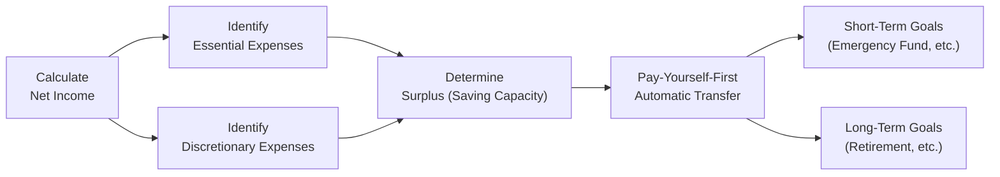

## 2.4 Savings Planning

Ah, savings. It’s that simple but powerful idea of tucking money away for future goals—yet it frequently feels like one of the toughest financial habits to maintain. If you’ve ever found yourself deciding between a quick weekend getaway and putting $500 into your emergency fund, you know exactly what I’m talking about. Still, a strong savings plan is absolutely key to long-term financial stability. This section will go deep into how you can help your clients (or even yourself) identify surplus income, set realistic goals, and adopt strategies to make saving second nature.

### Understanding the Big Picture: Why Savings Matter

Before we jump into the details, let’s quickly recap why savings planning is so important:

• It provides a “financial cushion” to deal with emergencies, which reduces stress and vulnerability.  
• It’s the foundation for achieving large goals: a down payment on a house, an education fund, an extended vacation, maybe even a life goal like early retirement.  
• Proper savings strategies let you take advantage of tax-sheltered or tax-advantaged accounts—like TFSAs or RRSPs—so your money can work harder and grow faster.

Simply put, saving money is how you build wealth, maintain financial freedom, and shield yourself from the unexpected. Let’s look at effective ways to go about it.

---

### Determining Your Client’s Saving Capacity

Savings planning always starts with a raw, honest look at income and expenses—no shortcuts there. Specifically, you want to figure out how much surplus your client truly has left after meeting their living costs. This is often easier said than done. 

• First, calculate the client’s net (or “take-home”) income each pay period. Subtract taxes, pension contributions, union dues—anything withheld at source.  
• Next, separate the client’s expenses into two categories:  
  – Essential Expenses: These are things like rent or mortgage payments, groceries, transportation, insurance, and utility bills.  
  – Discretionary Expenses: Dinners out, hobbies, streaming subscriptions, or that latte habit at the café around the corner.  

Once you sum up everything, you get a clear sense of “Disposable Income,” which is the money left over after essential and discretionary costs have been considered. The leftover portion (if any!) is your client’s potential “saving capacity.” 

It can be surprisingly enlightening to have your client see these numbers spelled out—sometimes a conversation about discretionary spending can go a long way. I remember discovering that I was spending a small fortune on random daily coffees. So, yes, that’s me owning up to it. A small change in my routine (like bringing coffee from home) freed up real money for bigger goals. 

This is a crucial step because your savings plan has to be grounded in reality. If your client’s living expenses are too high or somewhat inflated, savings can’t even get started. In which case, you might need to look at controlling expenses first, as outlined in earlier sections of this chapter on cash management.

---

### The Pay-Yourself-First Approach

Now, how do you encourage the discipline to actually save part of that leftover? Enter the concept of Pay-Yourself-First—basically meaning you set aside money before you consider your other bills and expenses. This might sound counterintuitive, but that’s how it works: Instead of waiting until the end of the month to see if you have anything left, you immediately siphon off a fixed amount into savings as soon as you get paid.

Why is this so nifty? Because it removes the “I’ll do it later” excuse. It’s automatic, has a sense of priority, and forms a habit. Even if it’s a small amount, something like $50 or $100 per paycheck, over time you begin to see that account grow. Clients who do this commonly mention feeling more in control. That psychological “win” can be huge when you’re trying to build a consistent savings routine.

---

### Aligning Savings Goals with Appropriate Vehicles

Once you’ve identified the savings capacity and embraced the pay-yourself-first method, the next question is: Where do you put the money? The answer depends on the client’s timeline, risk tolerance, and broader financial plan. Generally, you’ll see three main buckets of savings options:

• High-Interest Savings Accounts (HISAs): Perfect for super short-term goals or emergency funds because of their accessibility. Expect modest returns and low risk.  
• Tax-Free Savings Accounts (TFSAs): For Canadians, TFSAs are extremely flexible. Funds can grow tax-free, and withdrawals can be made without penalty. This makes them attractive for medium-term or even short-term goals, if you’re comfortable investing inside the TFSA. As of 2025, contribution limits and usage details can be verified through the Canada Revenue Agency (CRA) at:  
  https://www.canada.ca/en/revenue-agency/services/tax/individuals/topics/tax-free-savings-account.html  
• Registered Retirement Savings Plans (RRSPs): Typically, these come with a tax deduction on contributions, but any withdrawals are taxed. The main goal is retirement saving. Some special rules apply: for instance, using the RRSP for a first home purchase (Home Buyers' Plan) or education (Lifelong Learning Plan). CRA rules on RRSPs are explained further here:  
  https://www.canada.ca/en/revenue-agency/services/tax/individuals/topics/rrsps-related-plans.html  

If your client is saving for a home down payment that’s five to seven years away, you might suggest a balanced or conservative investment approach inside a TFSA or even a non-registered account. But if they’re looking at a 20-plus-year horizon for retirement, an RRSP or even an equity-oriented TFSA might be more suitable. Risk tolerance also matters: more conservative folks might stick to fixed-income or guaranteed investment certificates (GICs), while those with higher risk tolerance might opt for stocks, exchange-traded funds (ETFs), or index mutual funds.

---

### Automating and Maintaining Discipline

So, you’ve set a plan, you know how much to save, and you’ve decided on the right vehicles. Fantastic. Now let’s make sure it actually happens—consistently. Automation is crucial here. My personal trick was to set up a monthly automatic transfer from my main checking account straight into my savings right on payday. That forced me to get used to operating on what’s left.

You can also set up automated contributions to retirement or education savings (like an RESP) with your financial institution. Over time, those monthly or biweekly deposits add up. If your clients are having trouble with discipline, automation is a lifesaver—literally removing the “human error” from the equation.

---

### Short-Term vs. Long-Term Savings

When it comes to advising clients, it’s important to make sure they realize that an emergency fund is not the same as a retirement investment. Each of these goals has a different time horizon, associated risk, and often a different account or plan:

• Short-Term Savings (0–2 years):  
  – Examples: Emergency fund, saving for a wedding, a planned vacation, or a small business venture.  
  – Vehicle: Typically a HISA, short-term GIC, or even a cashable short-term deposit in a TFSA—someplace safe and accessible.  

• Long-Term Savings (3+ years):  
  – Examples: Retirement, post-secondary education for children, a future cottage, or “financial independence” goals.  
  – Vehicle: RRSP, TFSA invested in longer-term strategies, group retirement plans with employer matching, or non-registered investments if you’ve utilized all registered room.

It’s usually wise for clients to structure separate accounts or “envelopes” for each of these purposes. This helps prevent mixing short-term and long-term assets, ensuring you don’t inadvertently dunk into the retirement fund every time the car needs new tires!

---

### Government Incentives and Programs

Canada offers several sweet deals to encourage saving:

• Canada Education Savings Grant (CESG) for Registered Education Savings Plans (RESPs): The government will match a certain percentage of contributions, up to an annual limit. This is basically free money if your client plans to help fund a child’s education.  
• Matching Contributions from Employers for Group RRSPs: Some employers offer to match a portion of the employee’s RRSP contributions. That’s like giving yourself an immediate return on your money—it’s generally a no-brainer to take advantage of this if available.  
• Special Tax Treatments: TFSAs provide tax-free growth, RRSPs offer tax deferral, and the government sets contribution limits that often rise over time with indexing.  

Encourage your clients to keep an eye on these incentives; they can significantly accelerate savings growth. Also, remind them of the updated guidelines under CIRO (the Canadian Investment Regulatory Organization) for compliance on offering or helping to manage such products. While the defunct IIROC and MFDA organizations once oversaw many of these processes, CIRO now acts as the main self-regulatory body. For the latest updates, check out https://www.ciro.ca.

---

### Harnessing the Power of Compounding

Let’s talk about compounding—over time, you earn investment returns, and those returns start earning returns themselves! It’s like a snowball rolling downhill, getting bigger and bigger. Suppose you invest $1,000 at a 5% annual return. After one year, you might have $1,050. Next year, you’re not just earning 5% on $1,000, but on $1,050. So your second year’s interest is $52.50, giving you $1,102.50 total. Over 10 or 20 years, that snowball effect can be huge.

Maybe your client doesn’t see the point of saving $100 a month if it feels so small. But give it some time, add compound growth, and the results can be genuinely surprising—even life-changing. Andrew Hallam’s book “Millionaire Teacher” is a fun read on how simple, consistent investing and compounding can transform finances over the long run.

---

### Visualizing the Savings Process

Below is a simple Mermaid.js diagram that shows a high-level flow of how your client’s income can be allocated into savings. This is just to give you an idea of how each step might neatly feed into the next.

Explanation of the diagram:  
• Start by looking at your net income (A).  
• Subtract your essential (B) and discretionary (C) expenses to see how much you can save (D).  
• Use automatic transfers (E) to direct part of that surplus to short-term goals (F) or long-term goals (G).  

This flow ensures you “pay yourself first” instead of waiting to see if anything remains at the end of the month.

---

### Potential Pitfalls and Common Hiccups

Savings planning can look straightforward, but the execution may stumble on real-life challenges:

• Lack of Specific Goals: It’s easy to lose focus when you don’t have a particular target in mind.  
• Over-Spending on Discretionaries: We’ve all got our “splurge zones.” Make sure your client tracks spending frequently, or at least has a spending plan.  
• Not Investing Appropriately: For long-term goals, consider growth-oriented or balanced approaches. If money is languishing in a near-zero interest account, inflation will erode its value.  
• Inconsistent Contributions: Missing contributions because “something came up” can knock the plan off track. That’s why automation is crucial.  
• Not Monitoring or Rebalancing: Markets shift, personal goals shift, so adapt. A yearly or semi-annual check-in is good practice.

---

### Best Practices for Effective Savings Plans

• Set Clear, Measurable Goals: “I want an emergency fund with at least three months’ expenses” or “I want to contribute $5,000 to my RRSP annually.”  
• Carefully Choose Account Types: RRSP for retirement, TFSA for flexible growth, or a simple HISA for short-term needs.  
• Match Your Time Horizon: The shorter the time horizon, the safer your investments generally should be.  
• Use Automation: Less chance of letting emotions sabotage the plan.  
• Take Advantage of Tax Breaks and Employer Matching: These benefits can amplify your total savings.  
• Revisit the Plan Regularly: Life evolves—so should your savings strategy.

---

### Tools, References, and Further Learning

• Canada Revenue Agency (CRA) for TFSAs and RRSPs:  
  – TFSA Rules: https://www.canada.ca/en/revenue-agency/services/tax/individuals/topics/tax-free-savings-account.html  
  – RRSP Rules: https://www.canada.ca/en/revenue-agency/services/tax/individuals/topics/rrsps-related-plans.html  

• Canadian Investment Regulatory Organization (CIRO): https://www.ciro.ca  
  – Replaced IIROC (Investment Industry Regulatory Organization of Canada) and MFDA (Mutual Fund Dealers Association of Canada).  

• Canadian Investor Protection Fund (CIPF): https://www.cipf.ca  
  – Provides investor protection coverage in the event a CIRO-regulated firm goes insolvent.  

• “Millionaire Teacher” by Andrew Hallam — an easy read that highlights the power of long-term, consistent investing.  

• Some free online budgeting or expense-tracking apps (e.g., Mint, YNAB, or possibly simple spreadsheets) can help clients keep watch over their daily spending to ensure they always know their saving capacity.

---

### Wrapping Up: The Road Toward Financial Flexibility

Savings planning forms a huge part of helping your clients achieve that magical combination of financial stability and peace of mind. By identifying surplus income, harnessing the Pay-Yourself-First method, selecting the right accounts for the right goals, and automating the process, you set your clients on a path toward sustained growth. Emphasize that building a robust savings habit is not about sacrificing everything fun in life—rather, it’s creating a healthy balance that prioritizes their future well-being.

In short, start small but start now. Because, well, you know how time flies. And the earlier you harness the magic of compounding, the better off you’ll be. By applying the concepts covered in this and other sections of Chapter 2—particularly those on net worth tracking and cash management—your clients can form a solid foundation for future financial planning decisions.

---

## Test Your Knowledge: Savings Planning Essentials Quiz



### Which of the following best describes the “Pay-Yourself-First” strategy?

- [ ] Paying your largest bills first before addressing smaller bills.
- [ ] Waiting until the end of the month and saving whatever is left.
- [x] Automatically transferring a portion of income into savings or investments before paying other expenses.
- [ ] Using a credit card for monthly purchases and paying it off later.

> **Explanation:** The pay-yourself-first strategy involves transferring money into savings immediately upon receiving income, ensuring that saving takes priority over discretionary spending.

### When determining saving capacity, which of these is critical?

- [x] Subtracting essential and discretionary expenses from the client’s net (take-home) income.
- [ ] Reviewing only essential expenses to identify surpluses.
- [ ] Waiting until the end of the year to see what’s left.
- [ ] Ignoring discretionary expenses unless they are very large.

> **Explanation:** The key step in finding out how much a person can save is to look at net income and subtract both essential and discretionary expenses to see what is realistically left over.

### Why might a client prefer a TFSA for medium-term goals?

- [ ] Because TFSA withdrawals are heavily taxed.
- [ ] Because RRSPs allow more flexible withdrawals.
- [x] Because TFSA offers tax-free growth and you can withdraw funds without penalty.
- [ ] Because TFSAs are exclusively for retirement planning.

> **Explanation:** TFSAs provide tax-free investment growth and flexibility in withdrawals, making them a great option for medium-term goals or even short-term needs.

### What is a major advantage of automating savings contributions?

- [ ] You must manually deposit your savings each month, which is motivating.
- [x] It removes human error and ensures consistent contributions over time.
- [ ] It makes saving unnecessary because you can always do it later.
- [ ] It is only useful for specific types of accounts.

> **Explanation:** Automation helps lock in saving behavior so you don’t have to rely on willpower. It’s a best practice to ensure consistent progress toward savings goals.

### Which of the following statements about short-term vs. long-term savings is correct?

- [x] Short-term savings often reside in safer, more accessible investments, whereas long-term savings can be more growth oriented.
- [ ] Short-term savings are for goals 10+ years away.
- [x] Long-term savings typically require more focus on conservative investments.
- [ ] You should never keep an emergency fund in a savings account.

> **Explanation:** Short-term funds usually need to be accessible and low-risk to guard against volatility and facilitate quick withdrawal. Long-term funds, like for retirement, can often handle more risk in pursuit of higher returns.

### What is a common pitfall in savings planning?

- [x] Not having clear, specific goals to guide saving.
- [ ] Contributing to a retirement fund immediately upon receiving a paycheck.
- [ ] Keeping an emergency fund in a high-interest savings account.
- [ ] Having a separate account for short-term and long-term goals.

> **Explanation:** A significant pitfall is failing to define concrete goals, which makes it easy to lose discipline or dip into savings prematurely.

### Which of these is a notable Canadian government incentive for saving?

- [x] The Canada Education Savings Grant (CESG) for RESPs.
- [ ] Mandatory contributions into corporate bonds.
- [x] Employer stock purchase plans are subsidized by the government.
- [ ] The free deposit insurance covering investments up to any amount.

> **Explanation:** The Canada Education Savings Grant is a well-known government incentive that matches a portion of contributions to an RESP. Employer stock purchase plans are separate programs and don’t typically involve direct government subsidies, though some employers offer them to employees.

### Which option below highlights the power of compounding?

- [ ] Earning the same interest every year, with no accumulation of returns.
- [ ] Putting money in an account that only gains 1% simple interest annually.
- [ ] Having your returns get spent immediately on expenses.
- [x] Reinvesting gains so that they themselves start earning returns.

> **Explanation:** Compounding is about reinvesting gains so that the returns generate additional earnings over time. This exponential growth can significantly boost long-term savings.

### What is the main reason for reviewing a client’s savings plan annually?

- [x] Life events and market conditions may change, requiring adjustments.
- [ ] There is no advantage to ongoing reviews once the plan is set.
- [ ] To reduce the client’s monthly contributions arbitrarily.
- [ ] To file special forms with the CRA each year.

> **Explanation:** Over time, personal situations, economic conditions, and tax laws can shift. Reviewing the plan regularly ensures it stays aligned with the client’s current needs and objectives.

### True or False: TFSAs, RRSPs, and group RRSPs are all governed by CIRO under the new framework that replaced IIROC and MFDA.

- [x] True
- [ ] False

> **Explanation:** As of January 1, 2023, IIROC and MFDA no longer exist separately and have combined into CIRO. CIRO oversees compliance with these registered savings vehicles for member firms.


